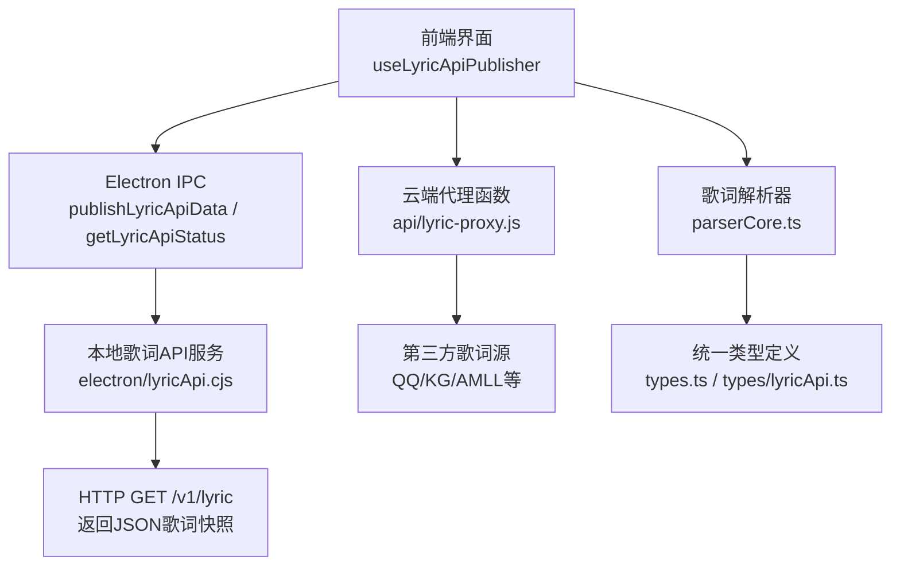
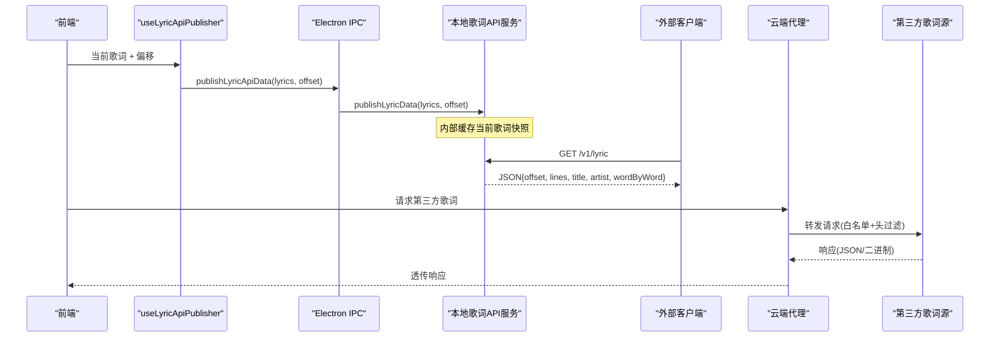
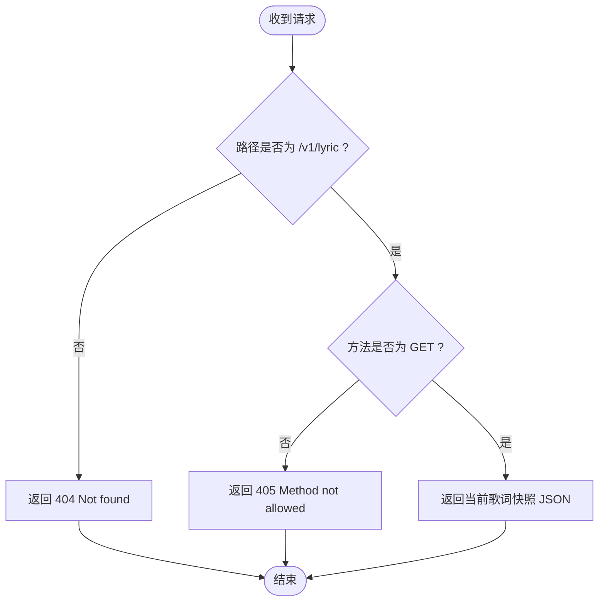
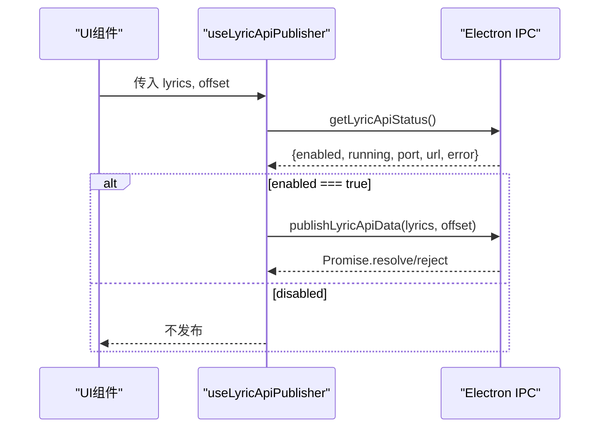
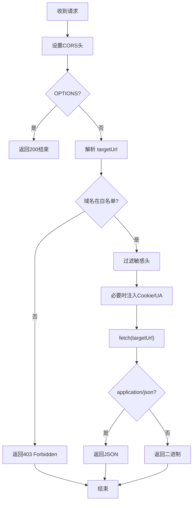
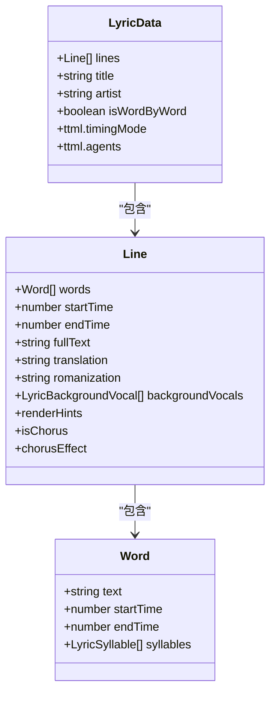
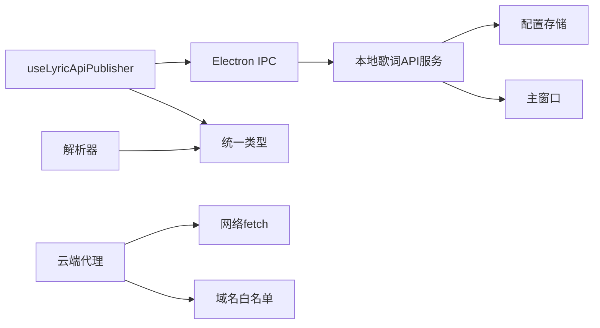

# 歌词API通信接口

<cite>
**本文引用的文件**
- [electron/lyricApi.cjs](file://electron/lyricApi.cjs)
- [src/types/lyricApi.ts](file://src/types/lyricApi.ts)
- [src/hooks/useLyricApiPublisher.ts](file://src/hooks/useLyricApiPublisher.ts)
- [api/lyric-proxy.js](file://api/lyric-proxy.js)
- [src/utils/lyrics/parserCore.ts](file://src/utils/lyrics/parserCore.ts)
- [src/utils/lrcParser.ts](file://src/utils/lrcParser.ts)
- [src/utils/yrcParser.ts](file://src/utils/yrcParser.ts)
- [src/utils/lyrics/types.ts](file://src/utils/lyrics/types.ts)
- [src/types.ts](file://src/types.ts)
</cite>

## 目录
1. [简介](#简介)
2. [项目结构](#项目结构)
3. [核心组件](#核心组件)
4. [架构总览](#架构总览)
5. [详细组件分析](#详细组件分析)
6. [依赖关系分析](#依赖关系分析)
7. [性能考虑](#性能考虑)
8. [故障排查指南](#故障排查指南)
9. [结论](#结论)
10. [附录：API参考与集成示例](#附录api参考与集成示例)

## 简介
本技术文档聚焦 Folia Player 的“歌词API”通信机制，覆盖本地桌面端暴露的只读HTTP接口、前端发布器、云端代理转发以及歌词解析与时间轴同步等关键能力。文档面向开发者与集成方，提供协议说明、数据格式、错误处理、性能优化与最佳实践，帮助快速接入并稳定运行歌词服务。

## 项目结构
围绕歌词API的关键路径包括：
- 桌面端本地HTTP服务：在Electron主进程中启动一个仅监听本机回环地址的小型HTTP服务器，对外暴露稳定的只读歌词快照接口。
- 前端发布器：React Hook负责将当前歌词与偏移量发布到桌面端服务，并维护服务状态（启用/禁用、端口、URL、错误）。
- 云端代理：Vercel函数用于安全地代理第三方歌词提供商的请求，限制目标域名并过滤敏感头。
- 歌词解析与时间轴：统一解析多种歌词格式（LRC/YRC/QRC/VTT/TTML等），生成带时间戳的行与词级时间信息，支持翻译与注音。

**图表来源**
- [electron/lyricApi.cjs:83-186](file://electron/lyricApi.cjs#L83-L186)
- [src/hooks/useLyricApiPublisher.ts:16-66](file://src/hooks/useLyricApiPublisher.ts#L16-L66)
- [api/lyric-proxy.js:43-108](file://api/lyric-proxy.js#L43-L108)
- [src/utils/lyrics/parserCore.ts:406-800](file://src/utils/lyrics/parserCore.ts#L406-L800)
- [src/types.ts:72-81](file://src/types.ts#L72-L81)
- [src/types/lyricApi.ts:4-10](file://src/types/lyricApi.ts#L4-L10)

**章节来源**
- [electron/lyricApi.cjs:83-186](file://electron/lyricApi.cjs#L83-L186)
- [src/hooks/useLyricApiPublisher.ts:16-66](file://src/hooks/useLyricApiPublisher.ts#L16-L66)
- [api/lyric-proxy.js:43-108](file://api/lyric-proxy.js#L43-L108)
- [src/utils/lyrics/parserCore.ts:406-800](file://src/utils/lyrics/parserCore.ts#L406-L800)
- [src/types.ts:72-81](file://src/types.ts#L72-L81)
- [src/types/lyricApi.ts:4-10](file://src/types/lyricApi.ts#L4-L10)

## 核心组件
- 本地歌词API服务（Electron）
  - 职责：监听本机端口，提供只读GET接口返回当前歌词快照；支持CORS；可启停；广播状态变更。
  - 关键点：严格校验请求方法与路径；返回标准化JSON；设置no-store缓存控制；错误消息记录。
- 前端发布器Hook
  - 职责：轮询/监听服务状态；当服务启用时，将当前歌词对象与偏移量发布到桌面端；捕获异常并降级。
  - 关键点：仅在Electron窗口下生效；使用IPC调用；保持UI与服务状态一致。
- 云端代理函数
  - 职责：安全转发第三方歌词源请求；白名单域名校验；过滤敏感头；按内容类型返回JSON或二进制。
  - 关键点：对特定域名附加必要Cookie/UA；对404特殊处理；统一CORS响应。
- 歌词解析器
  - 职责：将LRC/YRC/QRC/VTT/TTML等格式解析为统一的行/词级时间结构；合并翻译与注音；插入过门提示；标注渲染提示。
  - 关键点：多格式兼容；时间归一化；排序与稳定性；增量适配。

**章节来源**
- [electron/lyricApi.cjs:83-186](file://electron/lyricApi.cjs#L83-L186)
- [src/hooks/useLyricApiPublisher.ts:16-66](file://src/hooks/useLyricApiPublisher.ts#L16-L66)
- [api/lyric-proxy.js:43-108](file://api/lyric-proxy.js#L43-L108)
- [src/utils/lyrics/parserCore.ts:406-800](file://src/utils/lyrics/parserCore.ts#L406-L800)

## 架构总览
整体流程分为两条主线：
- 本地只读API线：前端通过Hook发布歌词 → Electron服务接收并缓存 → 外部客户端通过HTTP GET获取最新快照。
- 云端代理线：前端或后端通过代理函数访问第三方歌词源 → 白名单校验与安全头过滤 → 返回原始或JSON结果。

**图表来源**
- [src/hooks/useLyricApiPublisher.ts:43-50](file://src/hooks/useLyricApiPublisher.ts#L43-L50)
- [electron/lyricApi.cjs:183-186](file://electron/lyricApi.cjs#L183-L186)
- [electron/lyricApi.cjs:118-139](file://electron/lyricApi.cjs#L118-L139)
- [api/lyric-proxy.js:43-108](file://api/lyric-proxy.js#L43-L108)

## 详细组件分析

### 本地歌词API服务（Electron）
- 接口设计
  - 方法：GET
  - 路径：/v1/lyric
  - 响应：JSON，包含歌词快照与元信息
  - CORS：允许跨域；禁止缓存
- 数据模型
  - 字段：offset（秒）、lines（行数组）、title、artist、wordByWord（是否逐字模式）
  - 行结构：text、startTime、endTime、words[]、translation、romanization、backgroundVocals[]
- 行为特性
  - 仅本机监听；可选启用/禁用；错误消息持久化；状态变更通过IPC广播给主窗口
- 错误处理
  - 非GET或非法路径返回405/404；启动失败记录错误；关闭服务后广播状态

**图表来源**
- [electron/lyricApi.cjs:118-139](file://electron/lyricApi.cjs#L118-L139)

**章节来源**
- [electron/lyricApi.cjs:83-186](file://electron/lyricApi.cjs#L83-L186)
- [src/types/lyricApi.ts:4-10](file://src/types/lyricApi.ts#L4-L10)

### 前端发布器Hook（useLyricApiPublisher）
- 职责
  - 初始化并刷新服务状态（enabled/running/port/url/error）
  - 监听服务状态变化事件
  - 在服务启用时将当前歌词与偏移发布至桌面端
  - 捕获并发布异常，避免阻塞UI
- 降级策略
  - 非Electron环境直接返回空状态
  - IPC不可用时跳过发布并记录警告

**图表来源**
- [src/hooks/useLyricApiPublisher.ts:16-66](file://src/hooks/useLyricApiPublisher.ts#L16-L66)

**章节来源**
- [src/hooks/useLyricApiPublisher.ts:16-66](file://src/hooks/useLyricApiPublisher.ts#L16-L66)

### 云端代理函数（api/lyric-proxy.js）
- 功能
  - 接受查询参数中的目标URL，进行白名单校验
  - 过滤敏感头（host、connection、cookie、authorization等）
  - 针对特定域名附加必要头（如Cookie、User-Agent）
  - 根据响应内容类型返回JSON或二进制流
  - 对特定数据库域名404返回204空体
- 安全与可用性
  - 严格域名白名单；统一CORS；错误封装为JSON

**图表来源**
- [api/lyric-proxy.js:43-108](file://api/lyric-proxy.js#L43-L108)

**章节来源**
- [api/lyric-proxy.js:43-108](file://api/lyric-proxy.js#L43-L108)

### 歌词解析与时间轴同步（parserCore.ts）
- 支持格式
  - LRC、YRC、QRC、VTT、TTML（含Apple Music-like TTML）
- 核心能力
  - 行级时间戳解析与排序
  - 词级时间估算与对齐（基于权重与时长分配）
  - 翻译与注音文本按时间匹配合并
  - 插入过门提示（间隔大于阈值时）
  - 渲染提示标注（便于UI差异化展示）
- 兼容性
  - 多编码与BOM处理
  - 多时间格式兼容（分:秒.毫秒、角度标记等）
  - 结构化歌词（OpenSubsonic/Navidrome）映射

**图表来源**
- [src/types.ts:27-81](file://src/types.ts#L27-L81)
- [src/utils/lyrics/parserCore.ts:406-800](file://src/utils/lyrics/parserCore.ts#L406-L800)

**章节来源**
- [src/utils/lyrics/parserCore.ts:406-800](file://src/utils/lyrics/parserCore.ts#L406-L800)
- [src/utils/lrcParser.ts:4-6](file://src/utils/lrcParser.ts#L4-L6)
- [src/utils/yrcParser.ts:4-6](file://src/utils/yrcParser.ts#L4-L6)
- [src/utils/lyrics/types.ts:7-12](file://src/utils/lyrics/types.ts#L7-L12)
- [src/types.ts:27-81](file://src/types.ts#L27-L81)

## 依赖关系分析
- 组件耦合
  - Hook依赖Electron IPC以获取/更新服务状态与发布数据
  - 本地服务依赖配置存储与主窗口引用以广播状态
  - 代理函数依赖网络fetch与域名白名单策略
  - 解析器依赖统一类型定义与格式化检测
- 外部依赖
  - 第三方歌词源（QQ、酷狗、AMLL等）通过代理访问
  - 浏览器/Node环境差异由代理与Electron层隔离

**图表来源**
- [src/hooks/useLyricApiPublisher.ts:16-66](file://src/hooks/useLyricApiPublisher.ts#L16-L66)
- [electron/lyricApi.cjs:83-186](file://electron/lyricApi.cjs#L83-L186)
- [api/lyric-proxy.js:43-108](file://api/lyric-proxy.js#L43-L108)
- [src/utils/lyrics/parserCore.ts:406-800](file://src/utils/lyrics/parserCore.ts#L406-L800)

**章节来源**
- [src/hooks/useLyricApiPublisher.ts:16-66](file://src/hooks/useLyricApiPublisher.ts#L16-L66)
- [electron/lyricApi.cjs:83-186](file://electron/lyricApi.cjs#L83-L186)
- [api/lyric-proxy.js:43-108](file://api/lyric-proxy.js#L43-L108)
- [src/utils/lyrics/parserCore.ts:406-800](file://src/utils/lyrics/parserCore.ts#L406-L800)

## 性能考虑
- 本地API
  - 内存快照：服务端缓存当前歌词对象，避免重复计算
  - 无缓存响应：设置no-store，确保实时性
  - 最小化负载：仅返回必要字段，剔除多余属性
- 前端发布
  - 条件发布：仅在服务启用且IPC可用时发布
  - 异常捕获：避免UI线程阻塞
- 云端代理
  - 头部过滤：减少不必要传输
  - 内容类型分流：JSON直接序列化，二进制流式返回
  - 特殊处理：对特定域名404返回204，降低无效负载
- 解析器
  - 时间归一化与排序：保证播放同步准确性
  - 词级时间估算：基于权重与时长分配，提升逐字显示体验
  - 过门插入：合理阈值避免过多无用行

[本节为通用指导，无需具体文件分析]

## 故障排查指南
- 本地API无法访问
  - 检查服务是否启用与端口占用；查看错误消息
  - 确认请求路径与方法正确（GET /v1/lyric）
- 前端未发布歌词
  - 确认Electron环境；检查IPC方法是否存在
  - 查看控制台警告与错误日志
- 代理请求失败
  - 检查目标域名是否在白名单
  - 确认必要头已注入（如Cookie/UA）
  - 查看代理返回的错误JSON
- 歌词不同步
  - 检查解析器输出是否包含有效时间戳
  - 确认翻译与注音时间匹配逻辑正常
  - 验证过门插入阈值是否符合预期

**章节来源**
- [electron/lyricApi.cjs:118-139](file://electron/lyricApi.cjs#L118-L139)
- [src/hooks/useLyricApiPublisher.ts:43-50](file://src/hooks/useLyricApiPublisher.ts#L43-L50)
- [api/lyric-proxy.js:43-108](file://api/lyric-proxy.js#L43-L108)
- [src/utils/lyrics/parserCore.ts:406-800](file://src/utils/lyrics/parserCore.ts#L406-L800)

## 结论
Folia Player的歌词API通过本地只读HTTP服务与前端发布器实现了稳定可靠的歌词数据共享；云端代理提供了安全的第三方歌词源访问能力；解析器统一了多格式歌词的时间轴与元数据。该架构兼顾实时性、兼容性与安全性，适合桌面端与Web端的歌词展示与同步需求。

[本节为总结，无需具体文件分析]

## 附录：API参考与集成示例

### 本地歌词API（Electron）
- 基础信息
  - 协议：HTTP
  - 主机：127.0.0.1
  - 端口：动态（默认32109，可通过配置调整）
  - 路径：/v1/lyric
  - 方法：GET
  - 响应：application/json
  - CORS：允许跨域；Cache-Control: no-store
- 请求示例
  - GET http://127.0.0.1:32109/v1/lyric
- 响应字段
  - offset：数字（秒），全局偏移量
  - lines：数组，每行包含
    - text：字符串
    - startTime：数字（秒）
    - endTime：数字（秒）
    - words：数组，每个词包含
      - text：字符串
      - startTime：数字（秒）
      - endTime：数字（秒）
    - translation：字符串（可选）
    - romanization：字符串（可选）
    - backgroundVocals：数组（可选）
  - title：字符串（可选）
  - artist：字符串（可选）
  - wordByWord：布尔值（是否逐字模式）
- 错误码
  - 404：路径不存在
  - 405：方法不允许（仅支持GET）
  - 5xx：服务内部错误（代理或网络问题）

**章节来源**
- [electron/lyricApi.cjs:118-139](file://electron/lyricApi.cjs#L118-L139)
- [src/types/lyricApi.ts:4-10](file://src/types/lyricApi.ts#L4-L10)
- [src/types.ts:27-81](file://src/types.ts#L27-L81)

### 云端代理（Vercel函数）
- 基础信息
  - 入口：函数处理器
  - 参数：query.url（目标URL）
  - 安全：域名白名单；敏感头过滤
  - 响应：JSON或二进制流
- 请求示例
  - GET /?url=https%3A%2F%2Fu.y.qq.com%2F...
- 响应
  - 成功：透传第三方响应（JSON或二进制）
  - 失败：JSON错误对象（error、details）

**章节来源**
- [api/lyric-proxy.js:43-108](file://api/lyric-proxy.js#L43-L108)

### 集成建议
- 前端集成
  - 使用Hook管理服务状态与发布歌词
  - 在非Electron环境下降级为本地解析与展示
- 桌面端集成
  - 在主进程启动/停止服务；监听状态变更
  - 对外暴露IPC方法供渲染进程调用
- 第三方歌词源
  - 通过代理函数访问，避免跨域与鉴权问题
  - 对特定域名注入必要头以提升成功率

[本节为操作指引，无需具体文件分析]