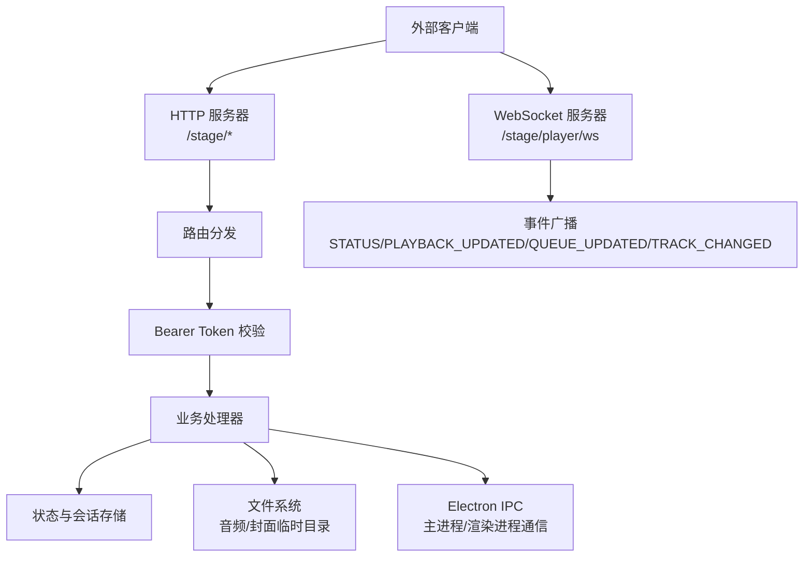
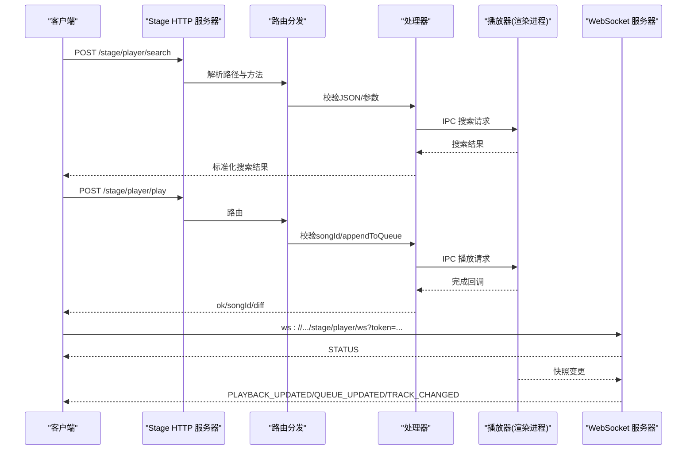
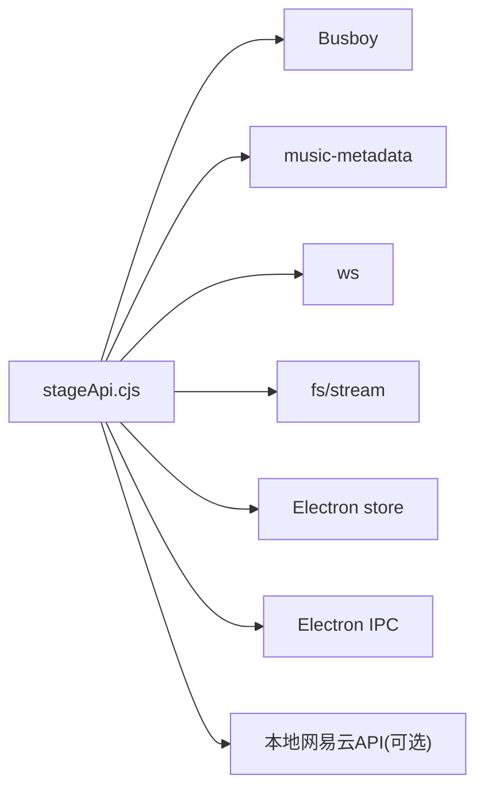

# HTTP RESTful接口

<cite>
**本文引用的文件**
- [electron/stageApi.cjs](file://electron/stageApi.cjs)
- [test/manual/stage-client/API_SCHEMA.md](file://test/manual/stage-client/API_SCHEMA.md)
- [test/unit/stage/stageApi.test.ts](file://test/unit/stage/stageApi.test.ts)
</cite>

## 目录
1. [简介](#简介)
2. [项目结构](#项目结构)
3. [核心组件](#核心组件)
4. [架构总览](#架构总览)
5. [详细接口说明](#详细接口说明)
6. [依赖关系分析](#依赖关系分析)
7. [性能与限制](#性能与限制)
8. [故障排查指南](#故障排查指南)
9. [结论](#结论)
10. [附录：调用示例](#附录调用示例)

## 简介
本文件为 Folia Player Stage API 的 HTTP/RESTful 接口文档。Stage API 是桌面端本地服务，用于外部工具向 Folia 注入歌词或媒体会话、搜索并点播歌曲、控制播放状态与队列，以及通过 WebSocket 订阅播放器状态事件。默认监听地址为 http://127.0.0.1:端口（端口可在设置中配置）。除健康检查外，所有接口均需要 Bearer Token 鉴权。

## 项目结构
- Stage API 由 electron/stageApi.cjs 实现，提供 HTTP 路由、请求校验、多部分表单解析、文件流式传输、WebSocket 升级与事件广播。
- test/manual/stage-client/API_SCHEMA.md 定义了完整的请求/响应 Schema、错误码与通用约定。
- test/unit/stage/stageApi.test.ts 提供了端到端测试用例，覆盖歌词写入、媒体会话、搜索、播放、控制、队列与 WebSocket 等流程。

图表来源
- [electron/stageApi.cjs:1837-2041](file://electron/stageApi.cjs#L1837-L2041)
- [electron/stageApi.cjs:648-676](file://electron/stageApi.cjs#L648-L676)

章节来源
- [electron/stageApi.cjs:1-2176](file://electron/stageApi.cjs#L1-L2176)
- [test/manual/stage-client/API_SCHEMA.md:1-889](file://test/manual/stage-client/API_SCHEMA.md#L1-L889)
- [test/unit/stage/stageApi.test.ts:1-826](file://test/unit/stage/stageApi.test.ts#L1-L826)

## 核心组件
- 认证与令牌管理
  - 使用 Bearer Token 进行鉴权；Token 从存储中读取，若不存在可生成随机 base64url 字符串。
  - 支持在 URL 查询参数 token 或 Authorization 头中传递 Token。
- 会话与状态
  - 歌词会话与媒体会话互斥；当前活动类型 activeEntryKind 可为 lyrics 或 media。
  - 媒体会话包含音频源、封面、歌词文本及格式探测结果。
- 播放器集成
  - 通过 Electron IPC 将搜索、播放、控制、队列操作转发到主窗口渲染进程执行。
  - 返回结构化能力集 controlCapabilities/queueCapabilities，指示当前上下文允许的操作。
- 文件与媒体
  - 支持 JSON 与 multipart/form-data 两种上传方式。
  - 对上传音频解析元数据，提取内嵌歌词与封面，并持久化到工作目录。
  - 提供 /stage/media/current/audio 与 /stage/media/current/cover 等静态资源访问接口，支持 Range 断点续传。
- WebSocket 事件
  - 连接路径 /stage/player/ws，支持 Header 或查询参数鉴权。
  - 事件包括 STATUS、PLAYBACK_UPDATED、QUEUE_UPDATED、TRACK_CHANGED。

章节来源
- [electron/stageApi.cjs:227-241](file://electron/stageApi.cjs#L227-L241)
- [electron/stageApi.cjs:892-915](file://electron/stageApi.cjs#L892-L915)
- [electron/stageApi.cjs:1133-1274](file://electron/stageApi.cjs#L1133-L1274)
- [electron/stageApi.cjs:1868-1913](file://electron/stageApi.cjs#L1868-L1913)
- [electron/stageApi.cjs:648-676](file://electron/stageApi.cjs#L648-L676)

## 架构总览
Stage API 作为本地 HTTP/WS 服务，对外暴露统一的路由集合。请求进入后先进行鉴权与模式开关检查，再分派到具体处理器。处理器负责参数校验、业务逻辑、IPC 通信与状态更新，并通过 WebSocket 广播事件。

图表来源
- [electron/stageApi.cjs:1657-1703](file://electron/stageApi.cjs#L1657-L1703)
- [electron/stageApi.cjs:1680-1703](file://electron/stageApi.cjs#L1680-L1703)
- [electron/stageApi.cjs:648-676](file://electron/stageApi.cjs#L648-L676)

## 详细接口说明

### 通用约定
- 基础地址：http://127.0.0.1:<端口>/stage
- 鉴权：除 GET /stage/health 外，所有接口需 Authorization: Bearer <token>；WebSocket 支持 ?token=<token>。
- 时间字段：positionMs、durationMs、sampledAtMs、updatedAt 均为毫秒；sampledAtMs、updatedAt 为 Unix epoch 毫秒。
- 错误体：通常返回 { error, code?, details? }。

章节来源
- [test/manual/stage-client/API_SCHEMA.md:5-12](file://test/manual/stage-client/API_SCHEMA.md#L5-L12)

### 健康检查
- GET /stage/health
  - 无需鉴权；即使 Stage 未启用也返回当前配置状态。
  - 响应字段：enabled、modeEnabled、source、port、activeEntryKind。

章节来源
- [test/manual/stage-client/API_SCHEMA.md:302-329](file://test/manual/stage-client/API_SCHEMA.md#L302-L329)
- [electron/stageApi.cjs:1851-1859](file://electron/stageApi.cjs#L1851-L1859)

### 状态查询
- GET /stage/status
  - 返回当前 Stage 输入状态，包括 enabled、modeEnabled、source、port、token、activeEntryKind、lyricsSession、mediaSession。
  - 用于获取当前 Bearer Token 与活跃会话信息。

章节来源
- [test/manual/stage-client/API_SCHEMA.md:330-341](file://test/manual/stage-client/API_SCHEMA.md#L330-L341)
- [electron/stageApi.cjs:1920-1923](file://electron/stageApi.cjs#L1920-L1923)

### 歌词处理
- POST /stage/lyrics
  - 写入 parser-compatible 歌词载荷；成功后 activeEntryKind 切换为 lyrics，清空媒体会话。
  - 请求体：{ title?, artist?, album?, lyricSource }。lyricSource.type 支持 local/embedded/navidrome/netease/qrc。
  - 响应：StageStatus，其中 lyricsSession 为本次标准化后的歌词会话。
  - 主要错误：
    - 400 INVALID_STAGE_LYRICS_JSON：JSON 无法解析。
    - 400 INVALID_STAGE_LYRICS：lyricSource 缺失或变体缺少必要内容。
    - 413 STAGE_BODY_TOO_LARGE：JSON 超过 2 MiB。

章节来源
- [test/manual/stage-client/API_SCHEMA.md:342-379](file://test/manual/stage-client/API_SCHEMA.md#L342-L379)
- [electron/stageApi.cjs:1948-1974](file://electron/stageApi.cjs#L1948-L1974)
- [electron/stageApi.cjs:1293-1437](file://electron/stageApi.cjs#L1293-L1437)

### 媒体文件上传与会话
- POST /stage/session
  - 支持 application/json 与 multipart/form-data。
  - JSON 模式：传入 audioUrl 与可选 lyricsText/lyricsFormat/封面等。
  - Multipart 模式：可上传 audioFile、lyricsFile、coverFile，同时支持字段 title/artist/album/coverUrl/audioUrl/lyricsText/lyricsFormat。
  - 限制：JSON 上限 2 MiB；单个 field 上限 2 MiB；单文件上限 1 GiB；最多 3 个文件、10 个 field、10 个 part。
  - 行为：成功后 activeEntryKind 切换为 media，清空歌词会话；服务端会尝试从上传音频中提取内嵌歌词与封面。
  - 响应：StageStatus，其中 mediaSession 为本次标准化后的媒体会话。
  - 主要错误：
    - 400 INVALID_STAGE_JSON：JSON 无法解析。
    - 400 INVALID_LYRICS_FORMAT：lyricsFormat 不在允许枚举。
    - 400 INVALID_AUDIO_SOURCE：未提供音频来源或同时提供 audioUrl 与 audioFile。
    - 400 INVALID_LYRICS_SOURCE：同时提供 lyricsText 与 lyricsFile。
    - 413 STAGE_BODY_TOO_LARGE / STAGE_FILE_TOO_LARGE。
    - 422 AUDIO_METADATA_PARSE_FAILED：上传音频 metadata 解析失败。
    - 500 SESSION_COMMIT_FAILED：文件写入或提交失败。

章节来源
- [test/manual/stage-client/API_SCHEMA.md:380-468](file://test/manual/stage-client/API_SCHEMA.md#L380-L468)
- [electron/stageApi.cjs:1976-2007](file://electron/stageApi.cjs#L1976-L2007)
- [electron/stageApi.cjs:917-1031](file://electron/stageApi.cjs#L917-L1031)
- [electron/stageApi.cjs:1133-1274](file://electron/stageApi.cjs#L1133-L1274)

### 媒体资源访问
- GET /stage/media/current/audio
  - 仅当 activeEntryKind 为 media 且当前媒体会话的 audioSrc 为本地 Stage 地址时可用。
  - 支持 Range 请求，返回 206 分段响应。
- GET /stage/media/current/cover
  - 返回当前媒体会话的封面二进制。
- GET /stage/media/session/{sessionId}/cover
  - 按会话 ID 返回对应封面二进制。

章节来源
- [electron/stageApi.cjs:1868-1913](file://electron/stageApi.cjs#L1868-L1913)
- [electron/stageApi.cjs:825-868](file://electron/stageApi.cjs#L825-L868)

### 搜索歌曲
- POST /stage/player/search
  - 将搜索请求转交给 Folia 当前接入的搜索通道，返回可供点播的候选结果。
  - 请求体：{ query, limit? }。limit 归一化到 1..50，默认 10。
  - 响应：{ query, songs[] }，songs 包含 songId/title/artists/album/durationMs/coverUrl。
  - 主要错误：
    - 400 INVALID_STAGE_PLAYER_SEARCH_JSON：JSON 无法解析。
    - 400 INVALID_STAGE_PLAYER_SEARCH_QUERY：query 为空。
    - 503 NETEASE_API_UNAVAILABLE：本地网易云 API 不可用。
    - 502 NETEASE_SEARCH_FAILED：搜索请求失败。

章节来源
- [test/manual/stage-client/API_SCHEMA.md:469-524](file://test/manual/stage-client/API_SCHEMA.md#L469-L524)
- [electron/stageApi.cjs:1657-1678](file://electron/stageApi.cjs#L1657-L1678)
- [electron/stageApi.cjs:1462-1487](file://electron/stageApi.cjs#L1462-L1487)

### 播放控制
- POST /stage/player/play
  - 请求主播放器播放或追加一首歌。
  - 请求体：{ songId, appendToQueue? }。appendToQueue 为 true 时追加到队列不打断当前播放。
  - 响应：{ ok, songId, appendToQueue, changed?, deduplicated?, affectedCount?, diff? }。
  - 主要错误：
    - 400 INVALID_STAGE_PLAYER_PLAY_JSON：JSON 无法解析。
    - 400 INVALID_STAGE_PLAYER_PLAY_SONG_ID：songId 不是正整数。
    - 503 STAGE_PLAY_UNAVAILABLE：主窗口不可用。
    - 503 STAGE_PLAY_CANCELED：请求被取消（如状态被清空）。
    - 504 STAGE_PLAY_TIMEOUT：15 秒超时。
    - 502 STAGE_PLAY_REJECTED：渲染进程拒绝。

章节来源
- [test/manual/stage-client/API_SCHEMA.md:525-577](file://test/manual/stage-client/API_SCHEMA.md#L525-L577)
- [electron/stageApi.cjs:1680-1703](file://electron/stageApi.cjs#L1680-L1703)
- [electron/stageApi.cjs:1489-1517](file://electron/stageApi.cjs#L1489-L1517)

- POST /stage/player/control
  - 发送控制指令：next/prev/pause/resume/seek。
  - seek 必须携带非负 positionMs。
  - 响应：{ accepted, action, playbackContext }。
  - 主要错误：
    - 400 INVALID_STAGE_PLAYER_CONTROL_JSON：JSON 无法解析。
    - 400 INVALID_STAGE_PLAYER_CONTROL_ACTION：action 不合法。
    - 400 INVALID_STAGE_PLAYER_SEEK_POSITION：seek 位置非法。
    - 409 STAGE_PLAYER_CONTROL_UNSUPPORTED：当前上下文不支持该动作。
    - 503 STAGE_PLAYER_CONTROL_UNAVAILABLE：主窗口不可用或服务停止。
    - 504 STAGE_PLAYER_REQUEST_TIMEOUT：10 秒超时。
    - 502 STAGE_PLAYER_REQUEST_REJECTED：渲染进程拒绝。

章节来源
- [test/manual/stage-client/API_SCHEMA.md:618-663](file://test/manual/stage-client/API_SCHEMA.md#L618-L663)
- [electron/stageApi.cjs:1732-1758](file://electron/stageApi.cjs#L1732-L1758)

### 状态与时间同步
- GET /stage/player/status
  - 返回播放器快照摘要，包含 playbackContext/current/playerState/positionMs/durationMs/sampledAtMs/updatedAt/controlCapabilities/queueCapabilities/queue。
  - 不返回完整 queue.items。
- GET /stage/player/time
  - 主动校准播放时间，返回轻量时间与状态字段。

章节来源
- [test/manual/stage-client/API_SCHEMA.md:578-617](file://test/manual/stage-client/API_SCHEMA.md#L578-L617)
- [electron/stageApi.cjs:1925-1933](file://electron/stageApi.cjs#L1925-L1933)

### 队列管理
- GET /stage/player/queue
  - 分页读取队列详情。
  - 查询参数：offset、limit(1..500)、around=current。
  - 响应：playbackContext/queueCapabilities/queue{ currentIndex,length,revision,items[],offset,limit,returned,hasMore,nextOffset }。
- POST /stage/player/queue
  - 编辑队列：append/insert-next/remove/move/select/clear。
  - 响应：accepted/action/playbackContext/changed?/deduplicated?/affectedCount?/diff?/queue。
  - 主要错误：
    - 400 INVALID_STAGE_PLAYER_QUEUE_JSON：JSON 无法解析。
    - 400 INVALID_STAGE_PLAYER_QUEUE_ACTION：action 不合法。
    - 409 STAGE_PLAYER_QUEUE_UNSUPPORTED：当前上下文不支持该队列动作。
    - 503 STAGE_PLAYER_QUEUE_UNAVAILABLE：主窗口不可用或服务停止。
    - 504 STAGE_PLAYER_REQUEST_TIMEOUT：10 秒超时。
    - 502 STAGE_PLAYER_REQUEST_REJECTED：渲染进程拒绝。

章节来源
- [test/manual/stage-client/API_SCHEMA.md:664-782](file://test/manual/stage-client/API_SCHEMA.md#L664-L782)
- [electron/stageApi.cjs:1779-1835](file://electron/stageApi.cjs#L1779-L1835)

### WebSocket 事件
- WS /stage/player/ws
  - 连接鉴权：Authorization: Bearer <token> 或 ?token=<token>。
  - 事件：
    - STATUS：初始状态。
    - PLAYBACK_UPDATED：播放进度/状态变化。
    - QUEUE_UPDATED：队列变化。
    - TRACK_CHANGED：曲目切换。
  - 鉴权/连接错误：
    - 401 Unauthorized：token 缺失或不匹配。
    - 503 Service Unavailable：Stage 未启用。
    - 404 Not Found：非 /stage/player/ws 路径。

章节来源
- [test/manual/stage-client/API_SCHEMA.md:783-805](file://test/manual/stage-client/API_SCHEMA.md#L783-L805)
- [electron/stageApi.cjs:648-676](file://electron/stageApi.cjs#L648-L676)

### 状态清理
- DELETE /stage/state
  - 清空当前 Stage 输入状态（歌词/媒体），activeEntryKind 置空。
  - 响应：StageStatus。

章节来源
- [electron/stageApi.cjs:1940-1946](file://electron/stageApi.cjs#L1940-L1946)

## 依赖关系分析
- 外部依赖
  - Busboy：解析 multipart/form-data。
  - music-metadata：解析上传音频元数据，提取内嵌歌词与封面。
  - ws：WebSocket 服务器。
  - Node fs/stream：文件读写与流式传输。
- 内部依赖
  - Electron store：存取 Stage 开关、端口、Token。
  - Electron main window IPC：将搜索、播放、控制、队列请求转发给渲染进程执行。
  - 本地网易云 API：默认搜索通道（可通过 searchStageSongs 注入替换）。

图表来源
- [electron/stageApi.cjs:1-7](file://electron/stageApi.cjs#L1-L7)
- [electron/stageApi.cjs:787-792](file://electron/stageApi.cjs#L787-L792)
- [electron/stageApi.cjs:1462-1487](file://electron/stageApi.cjs#L1462-L1487)

章节来源
- [electron/stageApi.cjs:1-2176](file://electron/stageApi.cjs#L1-L2176)

## 性能与限制
- 请求体限制
  - JSON 请求体上限：2 MiB。
  - multipart 单个 field 上限：2 MiB。
  - 单文件上限：1 GiB。
  - 最多 3 个文件、10 个 field、10 个 part。
- 队列分页
  - limit 范围 1..500，默认 100；around=current 围绕当前项计算 offset。
- 超时
  - 播放请求：15 秒。
  - 控制/队列请求：10 秒。
- 文件缓存与清理
  - 会话资产保留最近 N 个（默认 12）；清理非活跃会话目录。
- 带宽友好
  - 媒体资源支持 Range 断点续传，减少重复传输。

章节来源
- [electron/stageApi.cjs:14-25](file://electron/stageApi.cjs#L14-L25)
- [electron/stageApi.cjs:538-559](file://electron/stageApi.cjs#L538-L559)
- [electron/stageApi.cjs:714-729](file://electron/stageApi.cjs#L714-L729)
- [electron/stageApi.cjs:825-868](file://electron/stageApi.cjs#L825-L868)
- [electron/stageApi.cjs:1500-1546](file://electron/stageApi.cjs#L1500-L1546)

## 故障排查指南
- 网络错误
  - 检查 Stage 是否启用（GET /stage/health）。
  - 确认端口配置正确，防火墙允许本地回环访问。
- 认证失败
  - 确保 Authorization: Bearer <token> 与 /stage/status 返回的 token 一致。
  - WebSocket 可使用 ?token=<token> 或 Header 鉴权。
- 参数验证错误
  - 检查 JSON 结构与必填字段；注意枚举值与数值范围。
  - 对于 seek，positionMs 必须为非负整数。
- 服务不可用
  - 503 表示 Stage 未启用或主窗口不可用；检查 setStageEnabled 与主进程状态。
- 超时
  - 播放/控制/队列请求可能因渲染进程繁忙而超时；重试前建议先拉取最新状态。
- 文件上传失败
  - 检查文件大小与数量限制；确认 multipart 字段名与类型正确。
  - 若 metadata 解析失败，检查音频标签布局与编码。

章节来源
- [test/manual/stage-client/API_SCHEMA.md:799-805](file://test/manual/stage-client/API_SCHEMA.md#L799-L805)
- [electron/stageApi.cjs:1862-1866](file://electron/stageApi.cjs#L1862-L1866)
- [electron/stageApi.cjs:1915-1918](file://electron/stageApi.cjs#L1915-L1918)
- [electron/stageApi.cjs:1500-1546](file://electron/stageApi.cjs#L1500-L1546)
- [electron/stageApi.cjs:1190-1208](file://electron/stageApi.cjs#L1190-L1208)

## 结论
Stage API 提供了统一的本地接口，使外部工具能够安全地控制 Folia 的播放、队列与媒体资源，并通过 WebSocket 实时同步状态。其设计强调鉴权、限流与健壮的错误处理，适合桌面端集成与自动化场景。

## 附录：调用示例
以下为常见使用场景的调用步骤与要点（以文字描述为主，避免直接粘贴代码）：

- 搜索歌曲
  - 调用 POST /stage/player/search，请求体包含 query 与可选 limit。
  - 从响应中取得 songId，用于后续播放或队列操作。
  - 参考：[test/manual/stage-client/API_SCHEMA.md:469-524](file://test/manual/stage-client/API_SCHEMA.md#L469-L524)

- 播放控制
  - 调用 POST /stage/player/play，传入 songId 与 appendToQueue（可选）。
  - 如需追加到队列而不打断当前播放，设置 appendToQueue=true。
  - 参考：[test/manual/stage-client/API_SCHEMA.md:525-577](file://test/manual/stage-client/API_SCHEMA.md#L525-L577)

- 状态同步
  - 定期调用 GET /stage/player/status 或 GET /stage/player/time 获取当前播放状态与时间。
  - 使用 WebSocket /stage/player/ws 订阅实时更新，减少轮询开销。
  - 参考：[test/manual/stage-client/API_SCHEMA.md:578-617](file://test/manual/stage-client/API_SCHEMA.md#L578-L617)

- 歌词处理
  - 调用 POST /stage/lyrics，传入 lyricSource（type 为 local/embedded/navidrome/netease/qrc）。
  - 成功后 activeEntryKind 切换为 lyrics，可用于纯歌词展示。
  - 参考：[test/manual/stage-client/API_SCHEMA.md:342-379](file://test/manual/stage-client/API_SCHEMA.md#L342-L379)

- 媒体文件上传
  - 使用 POST /stage/session，选择 JSON 或 multipart 模式。
  - JSON 模式提供 audioUrl；multipart 模式可上传 audioFile、lyricsFile、coverFile。
  - 服务端会尝试从音频中提取内嵌歌词与封面。
  - 参考：[test/manual/stage-client/API_SCHEMA.md:380-468](file://test/manual/stage-client/API_SCHEMA.md#L380-L468)

- 队列管理
  - 使用 GET /stage/player/queue 分页读取队列；POST /stage/player/queue 执行 append/insert-next/remove/move/select/clear。
  - 根据 queueCapabilities 判断当前上下文允许的队列操作。
  - 参考：[test/manual/stage-client/API_SCHEMA.md:664-782](file://test/manual/stage-client/API_SCHEMA.md#L664-L782)

- 鉴权与令牌管理
  - 通过 GET /stage/status 获取当前 token。
  - 所有请求携带 Authorization: Bearer <token>；WebSocket 支持 ?token=<token>。
  - 参考：[electron/stageApi.cjs:227-241](file://electron/stageApi.cjs#L227-L241)

章节来源
- [test/unit/stage/stageApi.test.ts:249-826](file://test/unit/stage/stageApi.test.ts#L249-L826)
- [test/manual/stage-client/API_SCHEMA.md:1-889](file://test/manual/stage-client/API_SCHEMA.md#L1-L889)
- [electron/stageApi.cjs:1-2176](file://electron/stageApi.cjs#L1-L2176)