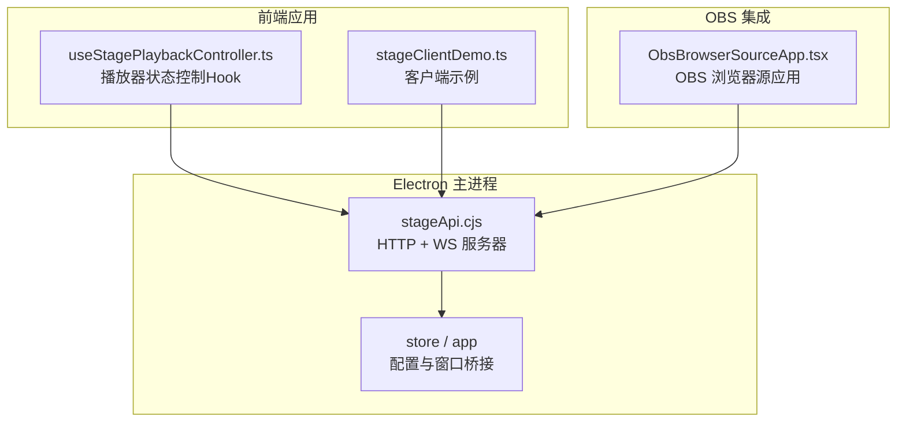
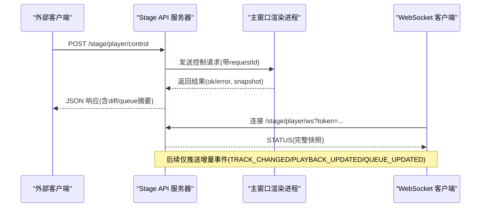
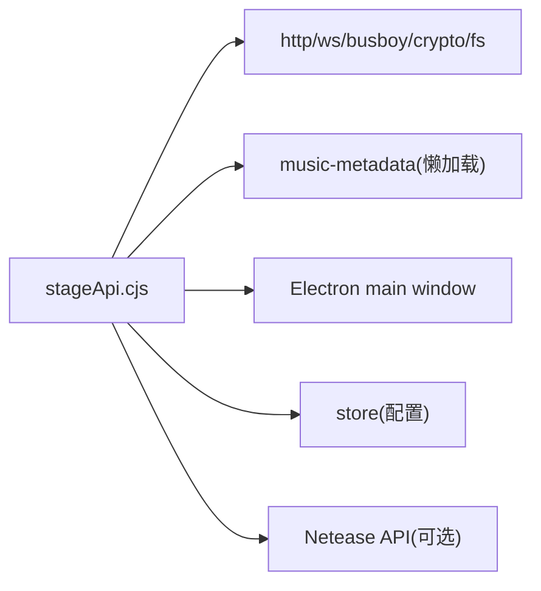

# Stage API通信接口

<cite>
**本文引用的文件**
- [electron/stageApi.cjs](file://electron/stageApi.cjs)
- [test/manual/stage-client/API_SCHEMA.md](file://test/manual/stage-client/API_SCHEMA.md)
- [src/hooks/useStagePlaybackController.ts](file://src/hooks/useStagePlaybackController.ts)
- [src/utils/stageClientDemo.ts](file://src/utils/stageClientDemo.ts)
- [src/components/obs/ObsBrowserSourceApp.tsx](file://src/components/obs/ObsBrowserSourceApp.tsx)
</cite>

## 目录
1. [简介](#简介)
2. [项目结构](#项目结构)
3. [核心组件](#核心组件)
4. [架构总览](#架构总览)
5. [详细组件分析](#详细组件分析)
6. [依赖关系分析](#依赖关系分析)
7. [性能考虑](#性能考虑)
8. [故障排查指南](#故障排查指南)
9. [结论](#结论)
10. [附录：API参考与示例](#附录api参考与示例)

## 简介
本技术文档面向外部集成方，系统化说明 Folia Player 桌面端提供的 Stage API 通信协议与数据格式。内容覆盖 HTTP RESTful 接口、WebSocket 实时事件、消息序列化与校验、认证与安全机制、异步通信模式（Promise、回调、事件驱动）、错误处理与重试策略，以及性能优化建议与最佳实践。该服务默认监听本地回环地址，便于桌面端工具、OBS 插件或浏览器扩展等本地集成场景安全调用。

## 项目结构
Stage API 的核心实现位于 Electron 主进程侧的 Node.js 模块中，提供 HTTP 服务器与 WebSocket 升级能力；前端通过 Hook 和工具类消费该 API；OBS 集成通过专用组件暴露 URL 与资源访问能力。

图表来源
- [electron/stageApi.cjs:169-2176](file://electron/stageApi.cjs#L169-L2176)
- [src/hooks/useStagePlaybackController.ts](file://src/hooks/useStagePlaybackController.ts)
- [src/utils/stageClientDemo.ts](file://src/utils/stageClientDemo.ts)
- [src/components/obs/ObsBrowserSourceApp.tsx](file://src/components/obs/ObsBrowserSourceApp.tsx)

章节来源
- [electron/stageApi.cjs:169-2176](file://electron/stageApi.cjs#L169-L2176)

## 核心组件
- Stage API 服务器：基于 Node.js http 与 ws 库，提供健康检查、状态查询、媒体会话注入、歌词注入、播放控制、队列操作、媒体流下载、WebSocket 事件推送等能力。
- 认证与鉴权：Bearer Token 验证，支持 Header 与查询参数两种方式；Token 可动态生成与轮换。
- 请求体与上传：JSON 与 multipart/form-data 双通道，严格大小限制与字段数量限制，防止滥用。
- 播放器快照与事件：内部维护播放器快照，按曲目、队列、播放时间变化广播增量事件。
- 跨域支持：统一设置 CORS 响应头，允许本地跨域调用。
- 错误模型：统一的 StageApiError 类型，携带 HTTP 状态码、错误码与详情。

章节来源
- [electron/stageApi.cjs:56-64](file://electron/stageApi.cjs#L56-L64)
- [electron/stageApi.cjs:802-868](file://electron/stageApi.cjs#L802-L868)
- [electron/stageApi.cjs:892-915](file://electron/stageApi.cjs#L892-L915)
- [electron/stageApi.cjs:917-1031](file://electron/stageApi.cjs#L917-L1031)
- [electron/stageApi.cjs:1642-1655](file://electron/stageApi.cjs#L1642-L1655)
- [electron/stageApi.cjs:2082-2114](file://electron/stageApi.cjs#L2082-L2114)

## 架构总览
Stage API 作为本地服务运行在 127.0.0.1，对外暴露 REST 与 WebSocket 接口。外部客户端通过 HTTP 发送控制与查询请求，或通过 WebSocket 订阅播放器状态变更。服务端将请求转发至 Electron 主窗口渲染进程进行实际播放控制，并通过 Promise 与超时机制保证可靠性。

图表来源
- [electron/stageApi.cjs:1519-1546](file://electron/stageApi.cjs#L1519-L1546)
- [electron/stageApi.cjs:1601-1605](file://electron/stageApi.cjs#L1601-L1605)
- [electron/stageApi.cjs:648-676](file://electron/stageApi.cjs#L648-L676)
- [electron/stageApi.cjs:573-598](file://electron/stageApi.cjs#L573-L598)

## 详细组件分析

### 认证与安全机制
- 令牌获取与校验：从配置读取或自动生成 Base64url 令牌；所有需要认证的接口均要求 Authorization: Bearer <token>，也支持 ?token= 查询参数。
- 跨域资源共享：所有响应统一设置 Access-Control-Allow-Origin、Allow-Headers、Allow-Methods，并正确处理 OPTIONS 预检。
- 速率与体积限制：JSON 请求体上限、multipart 字段与文件大小限制、部件数量限制，避免资源耗尽。
- 安全路径：仅监听 127.0.0.1，避免公网暴露。

章节来源
- [electron/stageApi.cjs:227-241](file://electron/stageApi.cjs#L227-L241)
- [electron/stageApi.cjs:802-868](file://electron/stageApi.cjs#L802-L868)
- [electron/stageApi.cjs:892-915](file://electron/stageApi.cjs#L892-L915)
- [electron/stageApi.cjs:917-1031](file://electron/stageApi.cjs#L917-L1031)
- [electron/stageApi.cjs:2105-2114](file://electron/stageApi.cjs#L2105-L2114)

### HTTP RESTful 接口
- 健康检查：GET /stage/health（无需鉴权）
- 状态查询：GET /stage/status
- 媒体会话写入：POST /stage/session（JSON 或 multipart）
- 歌词会话写入：POST /stage/lyrics
- 播放器搜索：POST /stage/player/search
- 播放器播放：POST /stage/player/play
- 播放器状态：GET /stage/player/status
- 播放器时间：GET /stage/player/time
- 播放器控制：POST /stage/player/control
- 播放器队列：GET /stage/player/queue、POST /stage/player/queue
- 媒体资源：GET /stage/media/current/audio、/stage/media/current/cover、/stage/media/session/{id}/cover
- 状态清理：DELETE /stage/state

章节来源
- [electron/stageApi.cjs:1837-2041](file://electron/stageApi.cjs#L1837-L2041)
- [test/manual/stage-client/API_SCHEMA.md:302-889](file://test/manual/stage-client/API_SCHEMA.md#L302-L889)

### WebSocket 实时通信
- 端点：ws://127.0.0.1:<port>/stage/player/ws
- 鉴权：Authorization: Bearer <token> 或 ?token=<token>
- 初始事件：连接成功后立即推送 STATUS
- 增量事件：TRACK_CHANGED、PLAYBACK_UPDATED、QUEUE_UPDATED
- 关闭与重连：令牌变更会主动关闭连接；客户端应实现自动重连

章节来源
- [electron/stageApi.cjs:648-676](file://electron/stageApi.cjs#L648-L676)
- [electron/stageApi.cjs:573-598](file://electron/stageApi.cjs#L573-L598)
- [test/manual/stage-client/API_SCHEMA.md:783-863](file://test/manual/stage-client/API_SCHEMA.md#L783-L863)

### 消息序列化与校验
- JSON 载荷：统一解析与错误包装，包含 code 与 details。
- multipart 表单：字段与文件分别收集，限制 field/file/part 数量与大小，失败时清理临时文件。
- 歌词格式：支持 lrc、enhanced-lrc、vtt、yrc、qrc；未指定时尝试自动检测。
- 音频元数据：上传音频时解析内嵌歌词、封面与时长，减少重复传输。

章节来源
- [electron/stageApi.cjs:1033-1061](file://electron/stageApi.cjs#L1033-L1061)
- [electron/stageApi.cjs:1063-1131](file://electron/stageApi.cjs#L1063-L1131)
- [electron/stageApi.cjs:1133-1274](file://electron/stageApi.cjs#L1133-L1274)
- [electron/stageApi.cjs:1293-1437](file://electron/stageApi.cjs#L1293-L1437)

### 播放控制与队列操作
- 控制动作：next、prev、pause、resume、seek（seek 需非负 positionMs）。
- 队列动作：append、insert-next、remove、move、select、clear（受 playbackContext 能力约束）。
- 差异更新：返回 queue diff（baseRevision、revision、ops），必要时 requiresReload 提示重新拉取。

章节来源
- [electron/stageApi.cjs:1713-1777](file://electron/stageApi.cjs#L1713-L1777)
- [electron/stageApi.cjs:1779-1835](file://electron/stageApi.cjs#L1779-L1835)
- [electron/stageApi.cjs:1519-1581](file://electron/stageApi.cjs#L1519-L1581)

### OBS 集成
- 通过 ObsBrowserSourceApp 暴露当前播放信息、封面与 CSS 样式 URL，供 OBS 浏览器源加载。
- 使用 Stage API 提供的媒体资源端点获取封面与音频流。

章节来源
- [src/components/obs/ObsBrowserSourceApp.tsx](file://src/components/obs/ObsBrowserSourceApp.tsx)
- [electron/stageApi.cjs:247-274](file://electron/stageApi.cjs#L247-L274)

### 前端 Hook 与客户端示例
- useStagePlaybackController：封装对 Stage API 的调用与状态同步，提供播放控制与队列操作的便捷方法。
- stageClientDemo：演示如何发起搜索、播放、控制与队列操作，以及如何处理错误与重试。

章节来源
- [src/hooks/useStagePlaybackController.ts](file://src/hooks/useStagePlaybackController.ts)
- [src/utils/stageClientDemo.ts](file://src/utils/stageClientDemo.ts)

## 依赖关系分析
- 服务器层：Node.js http、ws、busboy、crypto、fs、music-metadata（懒加载）。
- 进程间通信：通过 Electron main window webContents.send 与渲染进程交互，使用 requestId 与 Promise 完成请求-响应。
- 存储与配置：通过 store 读写 Stage 端口、令牌、模式开关等。
- 外部依赖：可选本地 Netease API 用于默认搜索通道。

图表来源
- [electron/stageApi.cjs:1-8](file://electron/stageApi.cjs#L1-L8)
- [electron/stageApi.cjs:787-792](file://electron/stageApi.cjs#L787-L792)
- [electron/stageApi.cjs:1462-1487](file://electron/stageApi.cjs#L1462-L1487)

章节来源
- [electron/stageApi.cjs:1-8](file://electron/stageApi.cjs#L1-L8)
- [electron/stageApi.cjs:787-792](file://electron/stageApi.cjs#L787-L792)
- [electron/stageApi.cjs:1462-1487](file://electron/stageApi.cjs#L1462-L1487)

## 性能考虑
- 请求体与上传限制：防止大请求占用内存与磁盘。
- 分页与窗口化：队列查询支持 offset/limit/around=current，减少不必要的数据传输。
- 增量事件：WebSocket 仅推送变化，降低带宽与 CPU 开销。
- 懒加载模块：music-metadata 按需导入，缩短启动时间。
- 会话资产清理：保留最近 N 个会话，避免磁盘膨胀。
- 连接管理：WebSocket 服务器复用，连接关闭时清理资源。

章节来源
- [electron/stageApi.cjs:14-25](file://electron/stageApi.cjs#L14-L25)
- [electron/stageApi.cjs:538-559](file://electron/stageApi.cjs#L538-L559)
- [electron/stageApi.cjs:714-729](file://electron/stageApi.cjs#L714-L729)
- [electron/stageApi.cjs:787-792](file://electron/stageApi.cjs#L787-L792)
- [electron/stageApi.cjs:600-618](file://electron/stageApi.cjs#L600-L618)

## 故障排查指南
- 401 Unauthorized：检查 Authorization 或 token 查询参数是否与当前令牌一致；令牌变更后需重新连接 WebSocket。
- 503 Service Unavailable：Stage 模式未启用或服务未启动；确认端口与模式开关。
- 413 Payload Too Large：请求体或文件超过限制；拆分上传或减小 payload。
- 409 Conflict：当前播放上下文不支持该控制或队列动作；查看 controlCapabilities/queueCapabilities。
- 504 Timeout：播放器未在超时时间内响应；检查主窗口是否可用，或重试策略。
- 502 Rejected：渲染进程拒绝请求；检查业务逻辑或权限。
- 416 Range Not Satisfiable：Range 请求无效或超出范围；修正 Range 头部。

章节来源
- [electron/stageApi.cjs:802-868](file://electron/stageApi.cjs#L802-L868)
- [electron/stageApi.cjs:870-890](file://electron/stageApi.cjs#L870-L890)
- [electron/stageApi.cjs:1519-1581](file://electron/stageApi.cjs#L1519-L1581)
- [electron/stageApi.cjs:1705-1730](file://electron/stageApi.cjs#L1705-L1730)
- [electron/stageApi.cjs:2082-2114](file://electron/stageApi.cjs#L2082-L2114)

## 结论
Stage API 为桌面端提供了稳定、安全且高效的本地集成通道，支持丰富的播放控制、队列管理与媒体资源访问能力。通过严格的输入校验、认证机制与增量事件推送，既能满足复杂集成场景，又能保持较低的资源消耗。建议客户端实现合理的重试与错误处理策略，并结合分页与缓存提升性能。

## 附录：API参考与示例

### 通用约定
- 除健康检查外，所有 HTTP 接口均需 Bearer Token。
- WebSocket 支持 Header 与查询参数两种鉴权方式。
- 时间字段均为毫秒；sampledAtMs、updatedAt 为 Unix epoch 毫秒。
- 错误响应通常包含 error、code、details。

章节来源
- [test/manual/stage-client/API_SCHEMA.md:5-13](file://test/manual/stage-client/API_SCHEMA.md#L5-L13)

### 公共对象
- StageStatus、StageLyricsSession、StageMediaSession、StagePlayerSnapshot、队列相关对象等定义详见 Schema。

章节来源
- [test/manual/stage-client/API_SCHEMA.md:45-301](file://test/manual/stage-client/API_SCHEMA.md#L45-L301)

### 关键端点速查
- GET /stage/health：连通性探测
- GET /stage/status：外部输入状态
- POST /stage/lyrics：写入歌词会话
- POST /stage/session：写入媒体会话（JSON/multipart）
- POST /stage/player/search：搜索歌曲
- POST /stage/player/play：播放或追加到队列
- GET /stage/player/status：播放器快照
- GET /stage/player/time：播放时间校准
- POST /stage/player/control：播放控制
- GET /stage/player/queue：分页队列
- POST /stage/player/queue：编辑队列
- WS /stage/player/ws：实时事件订阅
- DELETE /stage/state：清空外部状态

章节来源
- [test/manual/stage-client/API_SCHEMA.md:302-889](file://test/manual/stage-client/API_SCHEMA.md#L302-L889)

### 使用示例（概念流程）
- 搜索并播放：POST /stage/player/search → POST /stage/player/play
- 控制播放：POST /stage/player/control（action: pause/resume/seek/next/prev）
- 订阅状态：连接 WS → 接收 STATUS → 增量事件更新 UI
- 上传媒体：POST /stage/session（multipart）→ 获取 mediaSession → 通过媒体端点访问封面/音频

章节来源
- [src/utils/stageClientDemo.ts](file://src/utils/stageClientDemo.ts)
- [electron/stageApi.cjs:1657-1703](file://electron/stageApi.cjs#L1657-L1703)
- [electron/stageApi.cjs:1732-1758](file://electron/stageApi.cjs#L1732-L1758)
- [electron/stageApi.cjs:1976-2007](file://electron/stageApi.cjs#L1976-L2007)