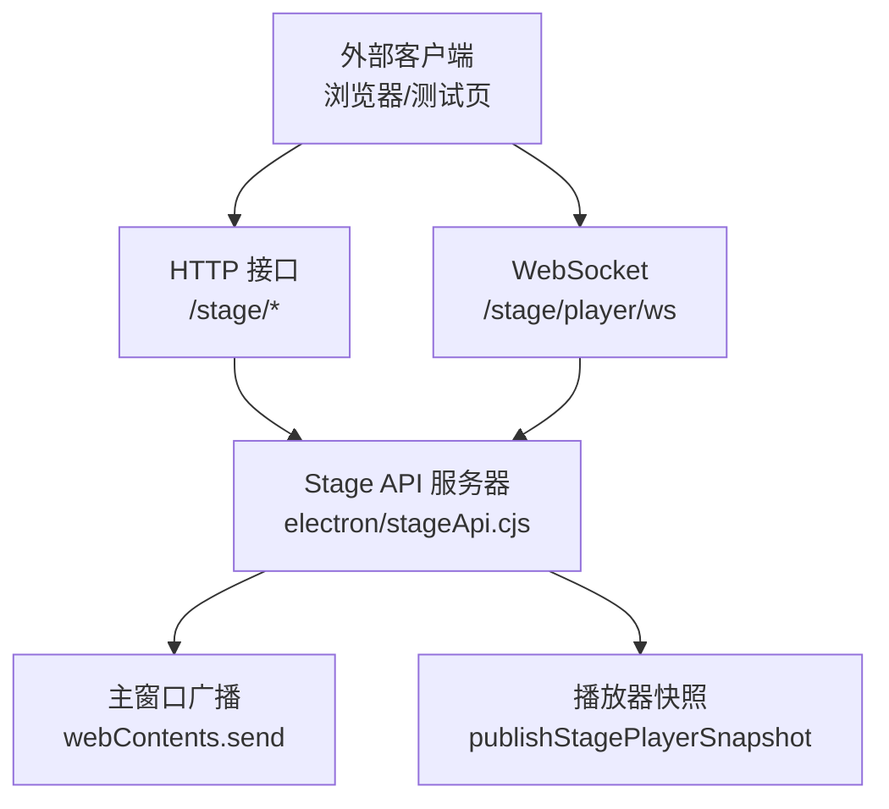
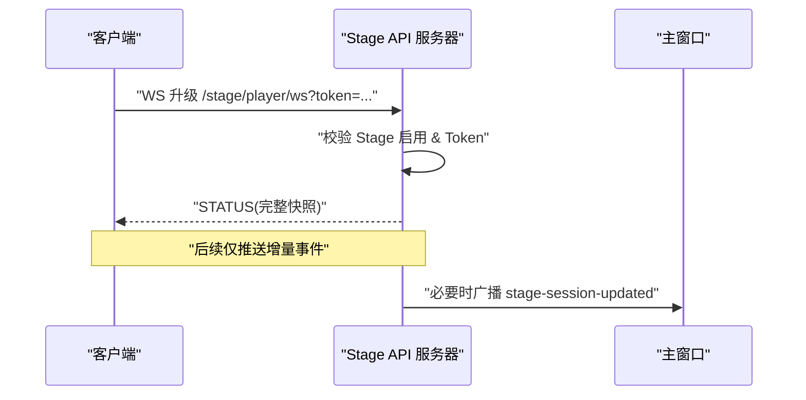
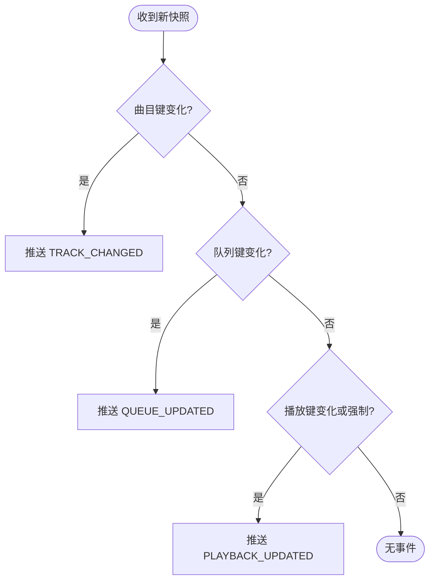
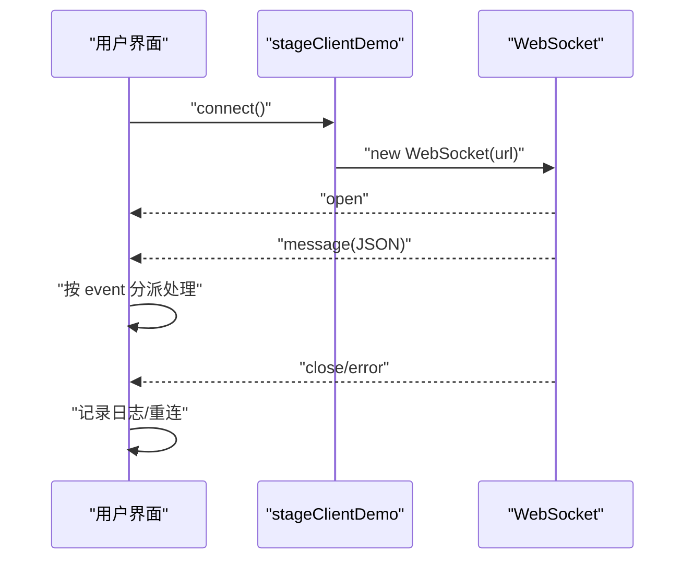
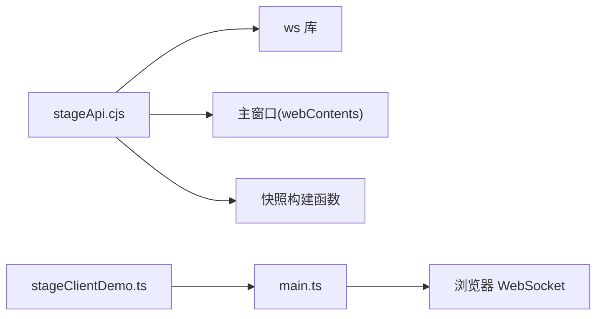

# WebSocket实时通信

<cite>
**本文引用的文件**
- [electron/stageApi.cjs](file://electron/stageApi.cjs)
- [test/manual/stage-client/API_SCHEMA.md](file://test/manual/stage-client/API_SCHEMA.md)
- [src/utils/stageClientDemo.ts](file://src/utils/stageClientDemo.ts)
- [test/manual/stage-client/main.ts](file://test/manual/stage-client/main.ts)
- [src/utils/stagePlayerSnapshot.ts](file://src/utils/stagePlayerSnapshot.ts)
- [src/services/playerCapProvider.ts](file://src/services/playerCapProvider.ts)
- [src/services/nowPlayingProvider.ts](file://src/services/nowPlayingProvider.ts)
- [test/unit/stage/stageApi.test.ts](file://test/unit/stage/stageApi.test.ts)
</cite>

## 目录
1. [简介](#简介)
2. [项目结构](#项目结构)
3. [核心组件](#核心组件)
4. [架构总览](#架构总览)
5. [详细组件分析](#详细组件分析)
6. [依赖关系分析](#依赖关系分析)
7. [性能考虑](#性能考虑)
8. [故障排查指南](#故障排查指南)
9. [结论](#结论)
10. [附录](#附录)

## 简介
本文件聚焦 Folia Player Stage API 的 WebSocket 实时通信能力，面向外部集成方与二次开发者。内容涵盖：
- WebSocket 连接建立、鉴权、事件推送机制
- 消息协议格式、事件类型与数据字段说明
- 播放状态变更、队列更新、媒体信息变化等事件的触发条件
- 连接管理最佳实践（连接复用、断线重连、心跳策略）
- 客户端实现示例（连接、订阅、处理消息、错误恢复）
- 性能优化建议（连接复用、消息批处理、内存管理）

## 项目结构
Stage API 由 Electron 进程提供本地 HTTP + WebSocket 服务，前端通过浏览器或测试工具访问。关键路径如下：
- 服务端实现：electron/stageApi.cjs
- 协议文档：test/manual/stage-client/API_SCHEMA.md
- 客户端构建器与示例：src/utils/stageClientDemo.ts、test/manual/stage-client/main.ts
- 快照构建与上下文推导：src/utils/stagePlayerSnapshot.ts
- 其他 WS 参考实现（用于对比连接管理）：src/services/playerCapProvider.ts、src/services/nowPlayingProvider.ts
- 单元测试验证 WS 行为：test/unit/stage/stageApi.test.ts

图表来源
- [electron/stageApi.cjs:648-676](file://electron/stageApi.cjs#L648-L676)
- [electron/stageApi.cjs:573-598](file://electron/stageApi.cjs#L573-L598)
- [electron/stageApi.cjs:620-641](file://electron/stageApi.cjs#L620-L641)

章节来源
- [electron/stageApi.cjs:1-800](file://electron/stageApi.cjs#L1-L800)
- [test/manual/stage-client/API_SCHEMA.md:1-120](file://test/manual/stage-client/API_SCHEMA.md#L1-L120)

## 核心组件
- Stage API 服务器：负责 HTTP 路由、WS 升级、鉴权、事件广播、快照发布与队列摘要计算。
- 播放器快照系统：将内部播放状态标准化为对外发布的 StagePlayerSnapshot，并据此决定推送何种增量事件。
- 客户端工具：提供请求构建器、URL 生成器、表单/JSON 选择逻辑，以及手动测试页面。
- 连接管理参考：playerCapProvider 和 nowPlayingProvider 展示了通用的 WS 连接、重连、状态回调模式。

章节来源
- [electron/stageApi.cjs:169-241](file://electron/stageApi.cjs#L169-L241)
- [src/utils/stagePlayerSnapshot.ts:180-245](file://src/utils/stagePlayerSnapshot.ts#L180-L245)
- [src/utils/stageClientDemo.ts:236-535](file://src/utils/stageClientDemo.ts#L236-L535)
- [src/services/playerCapProvider.ts:45-195](file://src/services/playerCapProvider.ts#L45-L195)
- [src/services/nowPlayingProvider.ts:300-472](file://src/services/nowPlayingProvider.ts#L300-L472)

## 架构总览
Stage API 在本地监听端口，仅接受来自本机 127.0.0.1 的连接。所有 HTTP 接口（除健康检查）需要 Bearer Token；WS 支持 Header 或查询参数 token。连接成功后立即推送 STATUS 完整快照，后续仅在“曲目”、“队列”或“播放语义/时间”发生变化时推送增量事件。

图表来源
- [electron/stageApi.cjs:648-676](file://electron/stageApi.cjs#L648-L676)
- [electron/stageApi.cjs:573-598](file://electron/stageApi.cjs#L573-L598)
- [test/manual/stage-client/API_SCHEMA.md:783-800](file://test/manual/stage-client/API_SCHEMA.md#L783-L800)

## 详细组件分析

### WebSocket 连接与鉴权
- 端点：ws://127.0.0.1:<port>/stage/player/ws
- 鉴权：Authorization: Bearer <token> 或 ?token=<token>
- 失败处理：未启用 Stage、Token 不匹配、非预期路径会拒绝升级并关闭连接
- 连接池：服务器维护一个 Set 保存当前活跃 socket，便于批量广播

章节来源
- [electron/stageApi.cjs:648-676](file://electron/stageApi.cjs#L648-L676)
- [electron/stageApi.cjs:594-618](file://electron/stageApi.cjs#L594-L618)
- [test/manual/stage-client/API_SCHEMA.md:783-800](file://test/manual/stage-client/API_SCHEMA.md#L783-L800)

### 事件模型与触发条件
- 首次连接：推送 STATUS（完整快照，但 queue 仅为摘要，不含 items）
- TRACK_CHANGED：当前曲目变化时推送，包含 current、playerState、capabilities、queue 摘要
- QUEUE_UPDATED：队列变化时推送，包含 previousQueue 与 queue 摘要
- PLAYBACK_UPDATED：播放时间/状态变化时推送，包含 positionMs、durationMs、sampledAtMs
- 触发逻辑：基于 trackKey、queueKey、playbackKey 的变化比较，必要时强制推送

图表来源
- [electron/stageApi.cjs:620-641](file://electron/stageApi.cjs#L620-L641)
- [electron/stageApi.cjs:502-571](file://electron/stageApi.cjs#L502-L571)

章节来源
- [electron/stageApi.cjs:620-641](file://electron/stageApi.cjs#L620-L641)
- [test/manual/stage-client/API_SCHEMA.md:807-854](file://test/manual/stage-client/API_SCHEMA.md#L807-L854)
- [test/unit/stage/stageApi.test.ts:732-826](file://test/unit/stage/stageApi.test.ts#L732-L826)

### 消息序列化与数据结构
- 通用约定：
  - 时间字段单位毫秒，sampledAtMs/updatedAt 为 Unix epoch 毫秒
  - 所有 HTTP 接口（除 health）需 Authorization: Bearer <token>
  - WS 支持 Header 或查询参数 token
- 事件载荷：
  - STATUS：StagePlayerSnapshot（queue 为摘要）
  - TRACK_CHANGED：包含 playbackContext、current、playerState、capabilities、queue 摘要
  - QUEUE_UPDATED：包含 previousQueue、queue 摘要
  - PLAYBACK_UPDATED：包含 playbackContext、playerState、positionMs、durationMs、sampledAtMs

章节来源
- [test/manual/stage-client/API_SCHEMA.md:1-43](file://test/manual/stage-client/API_SCHEMA.md#L1-L43)
- [test/manual/stage-client/API_SCHEMA.md:207-301](file://test/manual/stage-client/API_SCHEMA.md#L207-L301)
- [test/manual/stage-client/API_SCHEMA.md:807-854](file://test/manual/stage-client/API_SCHEMA.md#L807-L854)

### 播放状态、队列与媒体信息
- 播放上下文：normal-playback、stage-session、external-playback-source
- 控制能力：根据上下文与当前曲目动态计算 controlCapabilities
- 队列能力：normal-playback 可编辑，其他上下文可能只读
- 媒体会话：可通过 POST /stage/session 注入音频、封面、歌词，服务端返回媒体会话对象

章节来源
- [electron/stageApi.cjs:309-341](file://electron/stageApi.cjs#L309-L341)
- [electron/stageApi.cjs:394-464](file://electron/stageApi.cjs#L394-L464)
- [test/manual/stage-client/API_SCHEMA.md:170-206](file://test/manual/stage-client/API_SCHEMA.md#L170-L206)

### 客户端实现示例
- 构建 WS URL：使用 buildStagePlayerWebSocketUrl，自动转换 http(s) -> ws(s) 并附加 token
- 连接与事件处理：
  - open：建立连接成功
  - message：解析 JSON 并分发到不同事件处理器
  - close/error：记录状态并可选择重连
- 手动测试页：test/manual/stage-client/main.ts 提供了完整的 UI 交互与日志输出

图表来源
- [src/utils/stageClientDemo.ts:526-535](file://src/utils/stageClientDemo.ts#L526-L535)
- [test/manual/stage-client/main.ts:570-619](file://test/manual/stage-client/main.ts#L570-L619)

章节来源
- [src/utils/stageClientDemo.ts:526-535](file://src/utils/stageClientDemo.ts#L526-L535)
- [test/manual/stage-client/main.ts:570-619](file://test/manual/stage-client/main.ts#L570-L619)

### 连接管理与最佳实践
- 连接复用：单例 WS 实例，避免重复创建；断开后清理引用
- 断线重连：参考 playerCapProvider 的重连调度与 nowPlayingProvider 的重连延迟
- 心跳检测：Stage API 未内置应用层心跳，建议客户端基于业务需求实现轻量心跳（如定时 GET /stage/player/time）
- 连接池：服务端维护 Set<WebSocket>，客户端应确保唯一连接，避免多实例造成资源浪费

章节来源
- [src/services/playerCapProvider.ts:107-195](file://src/services/playerCapProvider.ts#L107-L195)
- [src/services/nowPlayingProvider.ts:300-472](file://src/services/nowPlayingProvider.ts#L300-L472)
- [electron/stageApi.cjs:594-618](file://electron/stageApi.cjs#L594-L618)

## 依赖关系分析
- 服务端依赖：
  - ws 库：WebSocket 与 WebSocketServer
  - 主窗口：通过 webContents.send 广播 stage-session 相关事件
  - 播放器快照：normalizeStagePlayerSnapshot、buildStagePlayerStatus 等函数
- 客户端依赖：
  - stageClientDemo：请求构建器、URL 生成器
  - main.ts：手动测试页，演示 WS 连接与日志输出

图表来源
- [electron/stageApi.cjs:1-8](file://electron/stageApi.cjs#L1-L8)
- [electron/stageApi.cjs:573-598](file://electron/stageApi.cjs#L573-L598)
- [src/utils/stageClientDemo.ts:236-535](file://src/utils/stageClientDemo.ts#L236-L535)
- [test/manual/stage-client/main.ts:570-619](file://test/manual/stage-client/main.ts#L570-L619)

章节来源
- [electron/stageApi.cjs:1-800](file://electron/stageApi.cjs#L1-L800)
- [src/utils/stageClientDemo.ts:236-535](file://src/utils/stageClientDemo.ts#L236-L535)
- [test/manual/stage-client/main.ts:570-619](file://test/manual/stage-client/main.ts#L570-L619)

## 性能考虑
- 连接复用：保持单一 WS 实例，避免频繁创建销毁
- 消息批处理：服务端已对增量事件进行去重与最小化推送；客户端可按事件类型合并 UI 更新
- 内存管理：及时移除事件监听器，断开连接后清空引用；避免在 message 中持有大对象
- 网络优化：优先使用增量事件，必要时再调用 GET /stage/player/queue 拉取完整队列
- 时间同步：利用 sampledAtMs 与 positionMs 进行时间补偿，减少轮询频率

[本节为通用指导，无需特定文件来源]

## 故障排查指南
- 连接失败：
  - 检查 Stage 是否启用、端口是否正确、Token 是否匹配
  - 查看拒绝原因（401 Unauthorized、503 Service Unavailable）
- 事件缺失：
  - 确认是否收到首次 STATUS；若未收到，检查连接是否成功升级
  - 检查是否有强制推送标志 forcePlaybackEvent 的使用场景
- 队列不一致：
  - 当 diff.requiresReload 为 true 时，重新调用 GET /stage/player/queue 校准本地队列
- 错误码参考：
  - STAGE_API_ERROR、STAGE_INTERNAL_ERROR、STAGE_PLAY_CANCELED、STAGE_PLAYER_REQUEST_TIMEOUT 等

章节来源
- [electron/stageApi.cjs:56-64](file://electron/stageApi.cjs#L56-L64)
- [electron/stageApi.cjs:678-688](file://electron/stageApi.cjs#L678-L688)
- [test/manual/stage-client/API_SCHEMA.md:302-329](file://test/manual/stage-client/API_SCHEMA.md#L302-L329)

## 结论
Folia Stage API 的 WebSocket 实时通信以最小化增量事件为核心，结合严格的鉴权与上下文能力控制，为外部集成提供了稳定、高效的播放状态同步通道。通过合理的连接管理、事件分发与错误恢复策略，可实现低延迟、高可靠的实时体验。

[本节为总结性内容，无需特定文件来源]

## 附录

### 常用端点与事件速查
- HTTP 端点：
  - GET /stage/health：连通性探测
  - GET /stage/status：读取 Stage 输入状态
  - POST /stage/lyrics：写入歌词会话
  - POST /stage/session：写入媒体会话
  - GET /stage/player/status：播放器状态（队列摘要）
  - GET /stage/player/time：播放时间
  - POST /stage/player/control：控制指令
  - GET /stage/player/queue：分页队列详情
  - POST /stage/player/queue：编辑队列
- WS 端点：
  - WS /stage/player/ws：订阅播放器事件

章节来源
- [test/manual/stage-client/API_SCHEMA.md:302-800](file://test/manual/stage-client/API_SCHEMA.md#L302-L800)

### 客户端实现要点
- 构建 URL：使用 buildStagePlayerWebSocketUrl
- 连接生命周期：open -> message -> close/error
- 事件处理：按 event 字段分派到对应处理器
- 错误恢复：捕获异常、记录日志、必要时重连

章节来源
- [src/utils/stageClientDemo.ts:526-535](file://src/utils/stageClientDemo.ts#L526-L535)
- [test/manual/stage-client/main.ts:570-619](file://test/manual/stage-client/main.ts#L570-L619)