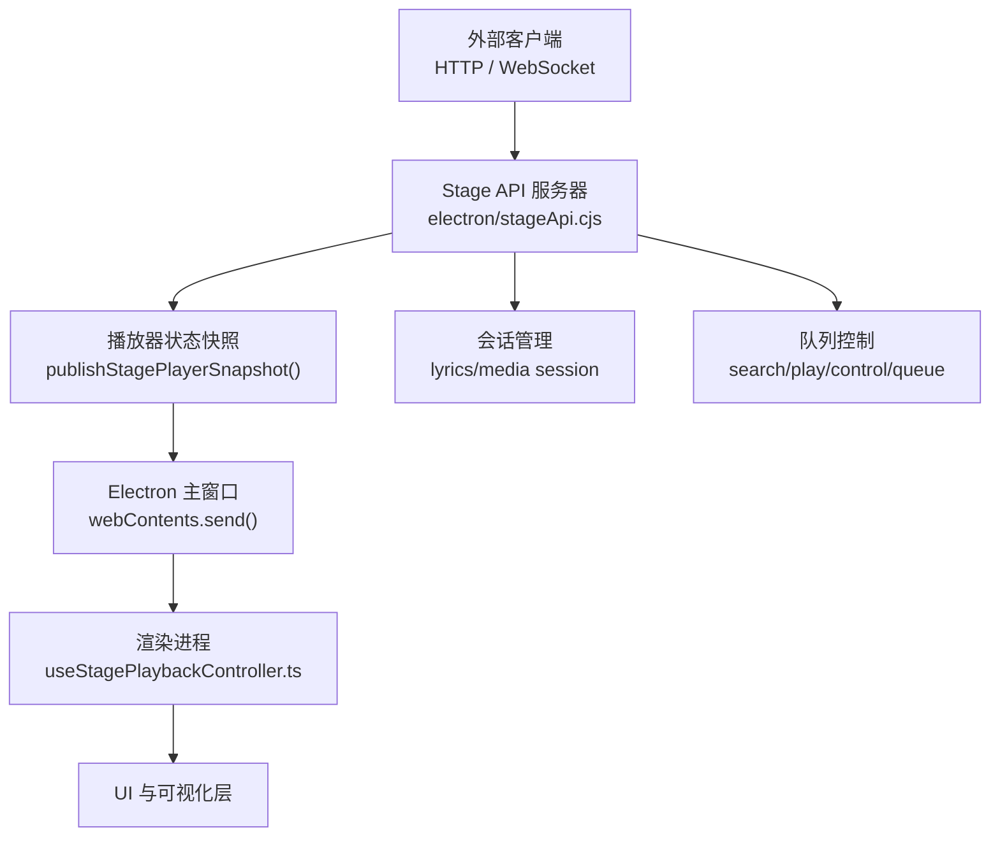
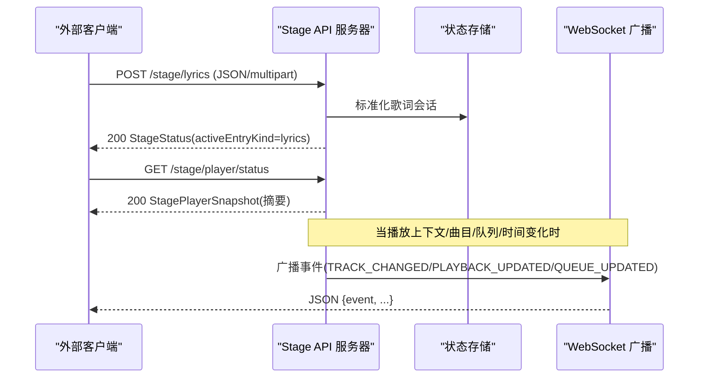
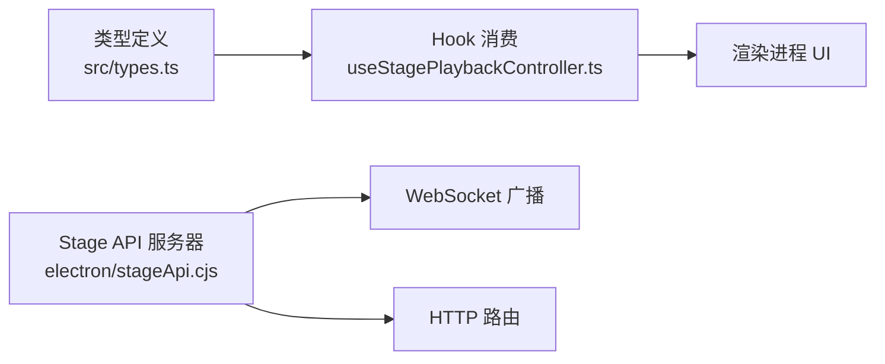

# 数据格式与协议

<cite>
**本文引用的文件**
- [stageApi.cjs](file://electron/stageApi.cjs)
- [API_SCHEMA.md](file://test/manual/stage-client/API_SCHEMA.md)
- [types.ts](file://src/types.ts)
- [appPlayback.ts](file://src/types/appPlayback.ts)
- [vite-env.d.ts](file://src/vite-env.d.ts)
- [stagePlayerSnapshot.ts](file://src/utils/stagePlayerSnapshot.ts)
- [useStagePlaybackController.ts](file://src/hooks/useStagePlaybackController.ts)
- [main.cjs](file://electron/main.cjs)
</cite>

## 目录
1. [简介](#简介)
2. [项目结构](#项目结构)
3. [核心组件](#核心组件)
4. [架构总览](#架构总览)
5. [详细组件分析](#详细组件分析)
6. [依赖关系分析](#依赖关系分析)
7. [性能考虑](#性能考虑)
8. [故障排查指南](#故障排查指南)
9. [结论](#结论)
10. [附录：数据字典与迁移指南](#附录：数据字典与迁移指南)

## 简介
本文件面向外部集成方与二次开发者，系统化说明 Folia Player Stage API 的数据格式与通信协议。内容覆盖：
- 播放状态、媒体信息、歌词数据、队列管理等核心数据模型
- HTTP 请求/响应格式、WebSocket 消息结构与事件语义
- 字段类型、取值范围、必填项等数据验证规则
- 数据转换机制（格式兼容、版本升级、向后兼容）
- 完整数据字典（字段、类型、说明、示例值）
- 数据格式迁移指南（不同版本间变化处理）

## 项目结构
Stage API 由 Electron 主进程暴露本地 HTTP 与 WebSocket 服务，供桌面端本地工具或浏览器页面调用；前端通过类型定义与 Hook 消费该 API。

图表来源
- [stageApi.cjs:169-210](file://electron/stageApi.cjs#L169-L210)
- [stageApi.cjs:573-598](file://electron/stageApi.cjs#L573-L598)
- [useStagePlaybackController.ts:28-70](file://src/hooks/useStagePlaybackController.ts#L28-L70)

章节来源
- [stageApi.cjs:1-210](file://electron/stageApi.cjs#L1-L210)
- [API_SCHEMA.md:1-43](file://test/manual/stage-client/API_SCHEMA.md#L1-L43)

## 核心组件
- Stage API 服务器：提供健康检查、状态查询、歌词/媒体会话写入、搜索、播放、控制、队列操作以及播放器状态 WebSocket 推送。
- 会话系统：维护当前歌词会话与媒体会话，支持本地/嵌入/第三方来源的歌词与音频资源。
- 播放器快照与能力：标准化当前曲目、播放状态、时间、能力集（控制/队列），并基于上下文限制可执行动作。
- 队列差异与分页：提供队列摘要、增量 diff、分页窗口，便于客户端高效同步。
- 鉴权与限流：Bearer Token 鉴权、请求体与 multipart 大小限制、超时控制。

章节来源
- [stageApi.cjs:13-55](file://electron/stageApi.cjs#L13-L55)
- [stageApi.cjs:227-245](file://electron/stageApi.cjs#L227-L245)
- [stageApi.cjs:302-415](file://electron/stageApi.cjs#L302-L415)
- [stageApi.cjs:538-560](file://electron/stageApi.cjs#L538-L560)
- [API_SCHEMA.md:302-329](file://test/manual/stage-client/API_SCHEMA.md#L302-L329)

## 架构总览
Stage API 采用“输入侧”和“输出侧”两类元数据区分方向：
- 输入侧（outside-in）：来自外部的歌词/媒体会话写入，返回 StageStatus。
- 输出侧（inside-out）：播放器内部状态向外广播，包含 STATUS/TRACK_CHANGED/PLAYBACK_UPDATED/QUEUE_UPDATED 等事件。

图表来源
- [stageApi.cjs:276-300](file://electron/stageApi.cjs#L276-L300)
- [stageApi.cjs:573-598](file://electron/stageApi.cjs#L573-L598)
- [API_SCHEMA.md:783-863](file://test/manual/stage-client/API_SCHEMA.md#L783-L863)

## 详细组件分析

### 数据模型与校验
- 播放上下文与状态
  - playbackContext：normal-playback | stage-session | external-playback-source
  - playerState：IDLE | PLAYING | PAUSED
- 当前曲目 current
  - id/source/title/artist/album/durationMs/coverUrl
- 队列
  - items/currentIndex/length/revision
  - 分页窗口：offset/limit/returned/hasMore/nextOffset
  - 差异 diff：baseRevision/revision/ops/requiresReload
- 能力集
  - controlCapabilities：play/pause/resume/seek/previous/next
  - queueCapabilities：append/insert-next/remove/move/select/clear
- 时间字段
  - positionMs/durationMs/sampledAtMs/updatedAt 均为毫秒；sampledAtMs/updatedAt 为 Unix epoch 毫秒

校验要点
- 数字归一化：非数字按默认值处理，负数截断为 0，整数向下取整。
- 枚举约束：playerState、lyric format、action 等严格限定集合。
- 必填项：如 lyricSource、audioUrl、songId、action 等。
- 大小限制：JSON 请求体上限 2 MiB；multipart field 上限 2 MiB；单文件上限 1 GiB；最多 3 个文件、10 个 field、10 个 part。
- 超时：播放请求 15s，播放器控制/队列请求 10s。

章节来源
- [stageApi.cjs:302-415](file://electron/stageApi.cjs#L302-L415)
- [stageApi.cjs:538-560](file://electron/stageApi.cjs#L538-L560)
- [API_SCHEMA.md:342-468](file://test/manual/stage-client/API_SCHEMA.md#L342-L468)
- [API_SCHEMA.md:469-781](file://test/manual/stage-client/API_SCHEMA.md#L469-L781)

### 歌词数据与格式
- 支持的歌词来源
  - local：lrc/enhanced-lrc/vtt/yrc/qrc 文本
  - embedded：从音频标签提取（USLT 等）
  - netease：网易云分支（lrc/yrc/ytlrc/tlyric）
  - navidrome：结构化或纯文本
  - qrc：QRC 歌词
- 自动检测与转换
  - 根据文本特征识别 lrc/enhanced-lrc
  - 将结构化 syncText 转换为 LRC 时间轴
  - 选择最佳候选（优先 enhanced word timeline）

章节来源
- [stageApi.cjs:66-122](file://electron/stageApi.cjs#L66-L122)
- [API_SCHEMA.md:75-168](file://test/manual/stage-client/API_SCHEMA.md#L75-L168)

### 媒体会话与资源
- 媒体会话字段包括 id/title/artist/album/durationMs/coverUrl/audioUrl/audioSrc/mimeType/lyricsText/lyricsFormat/updatedAt
- 支持 JSON 与 multipart 两种提交方式
- 服务端会尝试读取内嵌封面/歌词与 metadata，生成 Stage media URL

章节来源
- [API_SCHEMA.md:170-206](file://test/manual/stage-client/API_SCHEMA.md#L170-L206)
- [API_SCHEMA.md:380-468](file://test/manual/stage-client/API_SCHEMA.md#L380-L468)

### 搜索与播放
- 搜索：POST /stage/player/search，返回歌曲候选（songId/title/artists/album/durationMs/coverUrl）
- 播放：POST /stage/player/play，支持追加到队列或打断当前播放
- 错误码涵盖网络不可用、超时、拒绝等

章节来源
- [API_SCHEMA.md:469-577](file://test/manual/stage-client/API_SCHEMA.md#L469-L577)

### 控制与队列
- 控制：POST /stage/player/control，动作 next/prev/pause/resume/seek
- 队列：GET/POST /stage/player/queue，支持分页、around=current、diff 与 revision
- 能力受 playbackContext 限制，external-playback-source 可能只读

章节来源
- [API_SCHEMA.md:618-781](file://test/manual/stage-client/API_SCHEMA.md#L618-L781)
- [stageApi.cjs:315-341](file://electron/stageApi.cjs#L315-L341)

### WebSocket 事件
- 连接：ws://127.0.0.1:<port>/stage/player/ws?token=<token> 或 Authorization: Bearer <token>
- 事件：
  - STATUS：完整快照（queue 仍为摘要）
  - TRACK_CHANGED：曲目/状态/能力/队列摘要
  - PLAYBACK_UPDATED：时间与状态
  - QUEUE_UPDATED：队列变化前后摘要
- 需要完整队列详情时调用 GET /stage/player/queue

章节来源
- [API_SCHEMA.md:783-863](file://test/manual/stage-client/API_SCHEMA.md#L783-L863)
- [stageApi.cjs:648-676](file://electron/stageApi.cjs#L648-L676)

### 鉴权与健康检查
- 除 /stage/health 外均需 Bearer token
- health 接口无需鉴权，返回 enabled/modeEnabled/source/port/activeEntryKind

章节来源
- [API_SCHEMA.md:5-12](file://test/manual/stage-client/API_SCHEMA.md#L5-L12)
- [API_SCHEMA.md:302-329](file://test/manual/stage-client/API_SCHEMA.md#L302-L329)

## 依赖关系分析
- Stage API 服务器依赖 Electron 主进程能力（窗口、设置、IPC）。
- 前端通过类型定义与 Hook 消费状态，确保 UI 与后端一致。
- 测试用例与手动联调页用于契约验证与调试。

图表来源
- [types.ts:122-357](file://src/types.ts#L122-L357)
- [useStagePlaybackController.ts:28-70](file://src/hooks/useStagePlaybackController.ts#L28-L70)
- [stageApi.cjs:573-598](file://electron/stageApi.cjs#L573-L598)

章节来源
- [types.ts:122-357](file://src/types.ts#L122-L357)
- [vite-env.d.ts:366-483](file://src/vite-env.d.ts#L366-L483)

## 性能考虑
- 队列分页与 around=current 减少不必要传输
- 使用 diff + revision 实现增量更新，避免全量拉取
- 时间补偿：PLAYING 状态下根据 sampledAtMs 推算 positionMs，降低高频轮询
- 资源清理：会话目录保留最近 N 条，防止磁盘膨胀

章节来源
- [stageApi.cjs:538-560](file://electron/stageApi.cjs#L538-L560)
- [stageApi.cjs:714-729](file://electron/stageApi.cjs#L714-L729)
- [stageApi.cjs:431-446](file://electron/stageApi.cjs#L431-L446)

## 故障排查指南
常见错误与定位建议
- 401 Unauthorized：检查 token 是否匹配或传递方式（Header 或 query）
- 503 Service Unavailable：确认 Stage 已启用且端口正确
- 404 Not Found：WebSocket path 必须为 /stage/player/ws
- 413/422/500：检查请求体大小、文件格式、metadata 解析失败
- 504 超时：检查播放器响应链路是否正常

章节来源
- [API_SCHEMA.md:799-805](file://test/manual/stage-client/API_SCHEMA.md#L799-L805)
- [API_SCHEMA.md:372-468](file://test/manual/stage-client/API_SCHEMA.md#L372-L468)
- [API_SCHEMA.md:567-781](file://test/manual/stage-client/API_SCHEMA.md#L567-L781)

## 结论
Stage API 提供了稳定、可扩展的本地集成通道，通过严格的校验、清晰的鉴权、高效的增量同步与丰富的能力集，满足外部工具对播放、歌词、媒体与队列的控制需求。遵循本文档的数据字典与协议规范，可快速构建可靠的集成方案。

## 附录：数据字典与迁移指南

### 数据字典（节选）
- StageStatus
  - enabled: boolean
  - modeEnabled: boolean
  - source: 'stage-api' | 'now-playing' | null
  - port: number
  - token: string | null
  - activeEntryKind: 'lyrics' | 'media' | null
  - lyricsSession: StageLyricsSession | null
  - mediaSession: StageMediaSession | null
- StageLyricsSession
  - title?: string
  - artist?: string
  - album?: string
  - lyricSource: StageLyricSource
  - updatedAt: number
- StageMediaSession
  - id: string
  - title: string
  - artist: string
  - album?: string
  - durationMs?: number | null
  - coverUrl?: string | null
  - coverArtUrl?: string | null
  - audioUrl?: string | null
  - audioSrc: string
  - audioMimeType?: string
  - coverMimeType?: string
  - lyricsText?: string | null
  - lyricsFormat?: 'lrc' | 'enhanced-lrc' | 'vtt' | 'yrc' | null
  - updatedAt: number
- StagePlayerSnapshot
  - playbackContext: 'normal-playback' | 'stage-session' | 'external-playback-source'
  - current: StagePlayerCurrent | null
  - playerState: 'IDLE' | 'PLAYING' | 'PAUSED'
  - positionMs: number
  - durationMs: number
  - sampledAtMs: number
  - updatedAt: number
  - controlCapabilities: {...}
  - queueCapabilities: {...}
  - queue: StagePlayerQueueSummary
- StagePlayerQueueWindow
  - currentIndex: number
  - length: number
  - revision?: string
  - items: StagePlayerQueueItem[]
  - offset: number
  - limit: number
  - returned: number
  - hasMore: boolean
  - nextOffset: number | null
- StagePlayerQueueDiff
  - baseRevision: string
  - revision: string
  - ops: [{op:'insert'|'remove'|'move'|'clear'|'select', ...}]
  - requiresReload?: true

示例值（示意）
- StageStatus.enabled = true
- StagePlayerSnapshot.playerState = 'PLAYING'
- StagePlayerQueueWindow.limit = 100
- StagePlayerQueueDiff.ops[0].op = 'insert'

章节来源
- [API_SCHEMA.md:45-301](file://test/manual/stage-client/API_SCHEMA.md#L45-L301)
- [types.ts:189-357](file://src/types.ts#L189-L357)
- [vite-env.d.ts:366-483](file://src/vite-env.d.ts#L366-L483)

### 数据转换机制
- 歌词格式检测与转换
  - 自动识别 lrc/enhanced-lrc
  - 将结构化 syncText 转为 LRC 时间轴
  - 选择增强型歌词作为首选
- 时间插值
  - 播放中根据 sampledAtMs 推算 positionMs，保证平滑显示
- 版本兼容
  - 旧接口 /stage/search 与 /stage/play 仍可用，但响应标记 deprecated 并提供 replacement
  - 队列 diff 支持 requiresReload 指示客户端回退到全量拉取

章节来源
- [stageApi.cjs:66-122](file://electron/stageApi.cjs#L66-L122)
- [stageApi.cjs:431-446](file://electron/stageApi.cjs#L431-L446)
- [API_SCHEMA.md:881-889](file://test/manual/stage-client/API_SCHEMA.md#L881-L889)

### 迁移指南
- 从旧接口迁移到新接口
  - /stage/search → /stage/player/search
  - /stage/play → /stage/player/play
- 队列同步策略
  - 使用 revision 与 diff.ops 进行增量应用
  - 若 diff.requiresReload 为 true，忽略 ops 并调用 GET /stage/player/queue 重新拉取
- 歌词格式演进
  - 优先使用 enhanced-lrc；若无法解析则回退到普通 lrc
  - 对于结构化歌词，统一转换为 LRC 时间轴

章节来源
- [API_SCHEMA.md:881-889](file://test/manual/stage-client/API_SCHEMA.md#L881-L889)
- [stageApi.cjs:522-536](file://electron/stageApi.cjs#L522-L536)
- [stageApi.cjs:94-108](file://electron/stageApi.cjs#L94-L108)