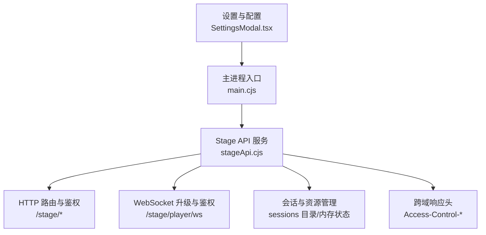
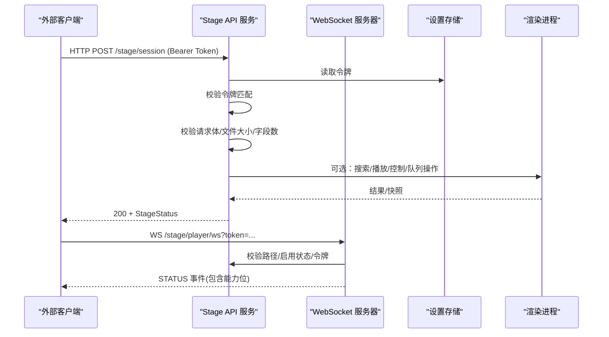
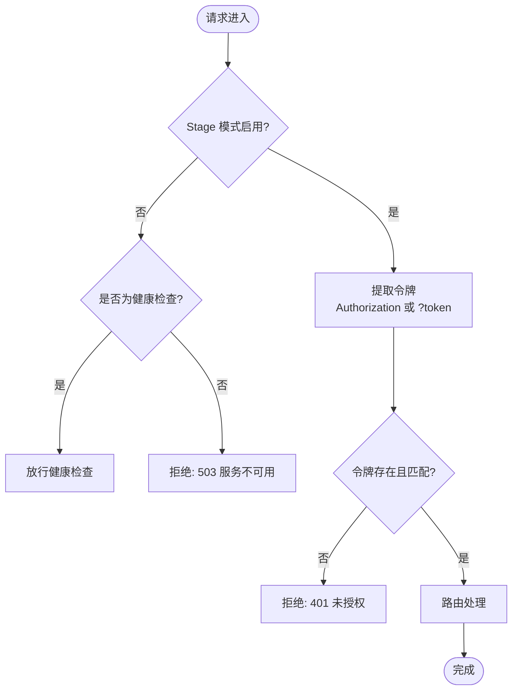
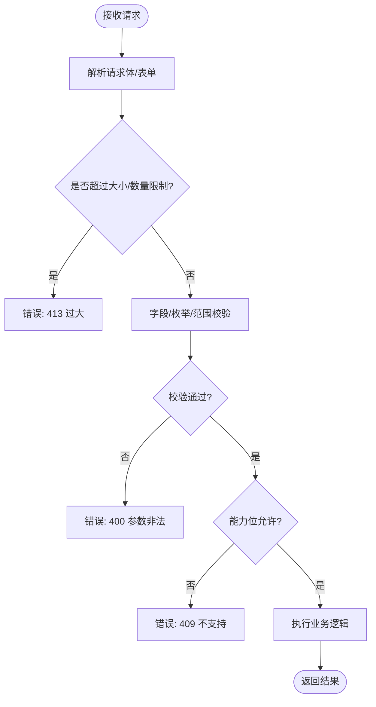
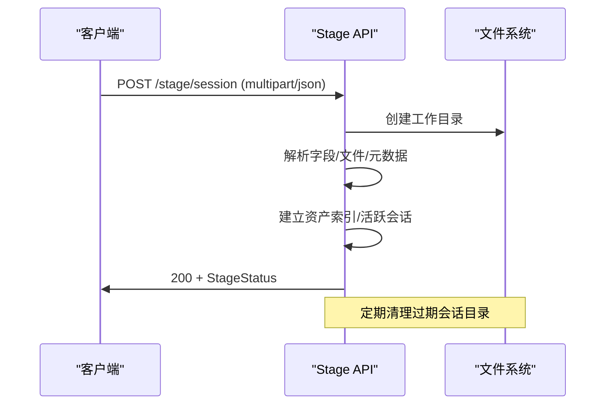

# 认证与安全机制

<cite>
**本文引用的文件**
- [electron/stageApi.cjs](file://electron/stageApi.cjs)
- [electron/main.cjs](file://electron/main.cjs)
- [test/manual/stage-client/API_SCHEMA.md](file://test/manual/stage-client/API_SCHEMA.md)
- [src/utils/stageClientDemo.ts](file://src/utils/stageClientDemo.ts)
- [src/components/modal/SettingsModal.tsx](file://src/components/modal/SettingsModal.tsx)
</cite>

## 目录
1. [简介](#简介)
2. [项目结构](#项目结构)
3. [核心组件](#核心组件)
4. [架构总览](#架构总览)
5. [详细组件分析](#详细组件分析)
6. [依赖关系分析](#依赖关系分析)
7. [性能与资源管理](#性能与资源管理)
8. [故障排除指南](#故障排除指南)
9. [结论](#结论)
10. [附录：安全配置示例与最佳实践](#附录：安全配置示例与最佳实践)

## 简介
本文件聚焦 Folia Player 的 Stage API 认证与安全机制，系统性解析令牌系统（生成、存储、验证、刷新）、安全配置（端口、访问控制、CORS）、请求验证流程（输入校验、参数检查、权限控制）与会话管理机制（创建、生命周期、清理）。同时提供安全最佳实践、配置示例与故障排除方法，帮助开发者正确配置与维护 Stage API 的安全性。

## 项目结构
Stage API 的安全能力主要由 Electron 主进程中的本地 HTTP/WebSocket 服务实现，并通过设置项控制开关、端口与令牌；前端设置界面负责展示与复制地址、遮蔽令牌等。

图表来源
- [electron/stageApi.cjs:1837-2114](file://electron/stageApi.cjs#L1837-L2114)
- [electron/main.cjs:1674-1711](file://electron/main.cjs#L1674-L1711)

章节来源
- [electron/stageApi.cjs:1837-2114](file://electron/stageApi.cjs#L1837-L2114)
- [electron/main.cjs:1674-1711](file://electron/main.cjs#L1674-L1711)

## 核心组件
- 令牌系统
  - 生成：使用加密安全的随机字节生成 base64url 字符串令牌，并持久化到设置存储。
  - 存储：通过应用设置键值存储保存，便于重启后复用。
  - 验证：所有需要鉴权的 HTTP 接口和 WebSocket 连接均要求携带令牌，支持 Authorization: Bearer 或查询参数 token。
  - 刷新：提供重新生成令牌的接口，刷新后会关闭现有 WebSocket 连接并广播状态更新。
- 安全配置
  - 端口：从设置读取，默认回退到内置默认端口；仅监听本地回环地址 127.0.0.1。
  - 访问控制：未启用 Stage 模式时拒绝大多数请求；健康检查除外。
  - CORS：为 JSON/二进制/文件响应统一设置允许的来源、方法与头部；OPTIONS 预检直接返回。
- 请求验证
  - 输入限制：JSON 请求体大小限制、multipart 字段/文件数量与大小限制。
  - 参数校验：严格枚举校验、必填字段校验、数值范围校验。
  - 权限控制：基于播放上下文的能力位（controlCapabilities/queueCapabilities）决定是否允许控制或队列操作。
- 会话管理
  - 创建：媒体会话写入时创建独立工作目录，记录音频/封面路径。
  - 生命周期：维护活跃会话 ID、资产索引，限制保留数量。
  - 清理：停止服务或状态清空时清理内存状态、关闭 WebSocket、删除工作目录。

章节来源
- [electron/stageApi.cjs:211-241](file://electron/stageApi.cjs#L211-L241)
- [electron/stageApi.cjs:892-915](file://electron/stageApi.cjs#L892-L915)
- [electron/stageApi.cjs:1837-2114](file://electron/stageApi.cjs#L1837-L2114)
- [electron/stageApi.cjs:690-729](file://electron/stageApi.cjs#L690-L729)
- [electron/stageApi.cjs:2141-2154](file://electron/stageApi.cjs#L2141-L2154)

## 架构总览
Stage API 在 Electron 主进程中启动一个仅绑定 127.0.0.1 的 HTTP 服务器，并提供 WebSocket 升级端点用于播放器状态订阅。所有非健康检查的请求均需通过令牌鉴权。请求进入路由后执行严格的输入校验与权限检查，再转发至渲染进程或执行业务逻辑。

图表来源
- [electron/stageApi.cjs:892-915](file://electron/stageApi.cjs#L892-L915)
- [electron/stageApi.cjs:1837-2114](file://electron/stageApi.cjs#L1837-L2114)
- [electron/stageApi.cjs:648-676](file://electron/stageApi.cjs#L648-L676)

## 详细组件分析

### 令牌系统与鉴权流程
- 令牌生成与存储
  - 首次获取时若不存在则生成新的 base64url 令牌并写入设置存储。
  - 令牌长度足够且来自加密安全随机源，适合本地集成场景。
- 令牌验证
  - HTTP：优先从 Authorization: Bearer 提取，其次从查询参数 token 提取。
  - WebSocket：同样支持两种形式，并在升级前进行校验。
  - 未启用 Stage 模式时，除健康检查外一律拒绝。
- 令牌刷新
  - 重新生成令牌会关闭所有已连接的 WebSocket 并广播状态更新，确保客户端感知变更。

图表来源
- [electron/stageApi.cjs:892-915](file://electron/stageApi.cjs#L892-L915)
- [electron/stageApi.cjs:1837-1918](file://electron/stageApi.cjs#L1837-L1918)
- [electron/stageApi.cjs:648-676](file://electron/stageApi.cjs#L648-L676)

章节来源
- [electron/stageApi.cjs:227-241](file://electron/stageApi.cjs#L227-L241)
- [electron/stageApi.cjs:892-915](file://electron/stageApi.cjs#L892-L915)
- [electron/stageApi.cjs:2141-2154](file://electron/stageApi.cjs#L2141-L2154)
- [test/manual/stage-client/API_SCHEMA.md:7-8](file://test/manual/stage-client/API_SCHEMA.md#L7-L8)

### 端口配置与访问控制
- 端口配置
  - 从设置中读取端口，若无效则回退到默认端口。
  - 服务器仅监听 127.0.0.1，避免暴露到局域网或公网。
- 访问控制
  - 未启用 Stage 模式时，除健康检查外的所有请求返回 503。
  - 健康检查不要求令牌，便于快速探测服务状态。
- CORS 设置
  - JSON、二进制、文件响应均设置 Access-Control-Allow-Origin 为 *，并允许 Authorization、Content-Type、Range 等头部。
  - OPTIONS 预检直接返回 204，减少跨域开销。

章节来源
- [electron/stageApi.cjs:211-214](file://electron/stageApi.cjs#L211-L214)
- [electron/stageApi.cjs:1837-1866](file://electron/stageApi.cjs#L1837-L1866)
- [electron/stageApi.cjs:802-868](file://electron/stageApi.cjs#L802-L868)

### 请求验证流程
- 输入限制
  - JSON 请求体上限：2 MiB。
  - multipart 限制：字段大小、文件数量、部分数量均有上限。
- 参数校验
  - 歌词格式枚举校验。
  - 音频来源互斥校验（URL 与文件二选一）。
  - 歌词来源互斥校验（文本与文件二选一）。
  - 控制动作与队列动作的白名单校验。
  - seek 位置必须为非负整数。
- 权限控制
  - 根据当前播放上下文计算 controlCapabilities/queueCapabilities，拒绝不支持的动作。

图表来源
- [electron/stageApi.cjs:870-890](file://electron/stageApi.cjs#L870-L890)
- [electron/stageApi.cjs:917-1031](file://electron/stageApi.cjs#L917-L1031)
- [electron/stageApi.cjs:1713-1777](file://electron/stageApi.cjs#L1713-L1777)

章节来源
- [electron/stageApi.cjs:870-890](file://electron/stageApi.cjs#L870-L890)
- [electron/stageApi.cjs:917-1031](file://electron/stageApi.cjs#L917-L1031)
- [electron/stageApi.cjs:1713-1777](file://electron/stageApi.cjs#L1713-L1777)

### 会话管理机制
- 会话创建
  - 媒体会话写入时创建独立工作目录，记录音频/封面路径，并建立资产索引。
  - 支持从上传音频中提取内嵌歌词与封面，自动填充元数据。
- 生命周期管理
  - 维护活跃会话 ID 与资产索引，限制保留最近 N 个会话。
  - 切换歌词或媒体会话时清空另一类会话状态。
- 资源清理
  - 停止服务或状态清空时，清理内存状态、关闭 WebSocket、删除工作目录。
  - 失败时记录警告日志，避免阻塞主流程。

图表来源
- [electron/stageApi.cjs:690-729](file://electron/stageApi.cjs#L690-L729)
- [electron/stageApi.cjs:1133-1274](file://electron/stageApi.cjs#L1133-L1274)
- [electron/stageApi.cjs:1976-2007](file://electron/stageApi.cjs#L1976-L2007)

章节来源
- [electron/stageApi.cjs:690-729](file://electron/stageApi.cjs#L690-L729)
- [electron/stageApi.cjs:1133-1274](file://electron/stageApi.cjs#L1133-L1274)
- [electron/stageApi.cjs:1976-2007](file://electron/stageApi.cjs#L1976-L2007)

### WebSocket 鉴权与事件
- 升级前校验
  - 路径必须为 /stage/player/ws。
  - Stage 模式必须启用。
  - 令牌必须存在且匹配。
- 事件推送
  - 连接成功后立即发送 STATUS 事件，包含当前播放器状态与能力位。
  - 令牌变更后主动关闭连接，促使客户端重连。

章节来源
- [electron/stageApi.cjs:648-676](file://electron/stageApi.cjs#L648-L676)
- [electron/stageApi.cjs:2141-2154](file://electron/stageApi.cjs#L2141-L2154)

## 依赖关系分析
- 模块耦合
  - stageApi.cjs 依赖 Electron 主进程的 app/store 获取配置与状态。
  - 通过 webContents.send 与渲染进程交互，完成播放、控制、队列等操作。
- 外部依赖
  - ws 库用于 WebSocket 服务。
  - busboy 用于解析 multipart/form-data。
  - music-metadata 用于解析上传音频的元数据。
- 潜在循环依赖
  - 无直接循环依赖；通过回调与事件解耦渲染进程交互。

章节来源
- [electron/stageApi.cjs:1-8](file://electron/stageApi.cjs#L1-L8)
- [electron/stageApi.cjs:1489-1546](file://electron/stageApi.cjs#L1489-L1546)

## 性能与资源管理
- 请求体与文件限制
  - JSON 请求体上限 2 MiB，防止内存耗尽。
  - multipart 字段/文件数量与大小限制，避免恶意大文件攻击。
- 时间预算
  - 外部播放请求与控制/队列请求设置超时，避免长时间挂起。
- 资源释放
  - 停止服务时清理待处理请求、关闭 WebSocket、删除工作目录。
  - 会话资产索引限制保留数量，定期清理过期目录。

章节来源
- [electron/stageApi.cjs:14-25](file://electron/stageApi.cjs#L14-L25)
- [electron/stageApi.cjs:1500-1546](file://electron/stageApi.cjs#L1500-L1546)
- [electron/stageApi.cjs:2043-2069](file://electron/stageApi.cjs#L2043-L2069)

## 故障排除指南
- 常见错误码与原因
  - 401 Unauthorized：令牌缺失或不匹配。
  - 503 Service Unavailable：Stage 未启用或服务不可用。
  - 404 Not Found：路由不存在或资源不可用。
  - 413 Payload Too Large：请求体或文件超过限制。
  - 409 Conflict：当前上下文不支持该动作。
  - 504 Gateway Timeout：渲染进程未在超时内响应。
- 排查步骤
  - 确认 Stage 模式已启用且端口可访问。
  - 检查 Authorization 或查询参数 token 是否正确。
  - 查看请求体是否符合 schema 与限制。
  - 关注服务端日志输出，定位具体错误代码与详情。

章节来源
- [test/manual/stage-client/API_SCHEMA.md:799-805](file://test/manual/stage-client/API_SCHEMA.md#L799-L805)
- [electron/stageApi.cjs:2083-2101](file://electron/stageApi.cjs#L2083-L2101)

## 结论
Stage API 采用本地回环绑定的轻量 HTTP/WebSocket 服务，结合强随机令牌、严格的输入校验与基于上下文的权限控制，提供了面向桌面集成的安全通道。通过会话目录管理与资源清理策略，有效控制了内存与磁盘占用。建议在生产环境中遵循最小权限原则，仅在必要时启用 Stage API，并妥善保管令牌。

## 附录：安全配置示例与最佳实践
- 安全最佳实践
  - 令牌保护：将令牌视为敏感信息，避免硬编码或泄露到日志；使用前端设置界面遮蔽显示。
  - 网络安全：仅监听 127.0.0.1，避免暴露到网络；如需远程访问，应通过反向代理与额外鉴权层。
  - 数据加密：传输层建议使用 HTTPS（由上层代理保障），本地阶段可使用明文但需限制访问面。
  - 最小权限：仅开放必要接口；利用能力位限制控制与队列操作。
  - 资源限额：保持默认大小与数量限制，防止滥用。
- 配置示例
  - 启用 Stage API 并获取令牌：通过设置界面开启 Stage 模式，复制地址与令牌。
  - 前端调用示例：在请求头中添加 Authorization: Bearer <token>，或使用查询参数 token。
  - 跨域设置：浏览器调用时需允许 Authorization 与 Content-Type 头部。

章节来源
- [src/components/modal/SettingsModal.tsx:787-802](file://src/components/modal/SettingsModal.tsx#L787-L802)
- [src/utils/stageClientDemo.ts:89-103](file://src/utils/stageClientDemo.ts#L89-L103)
- [electron/stageApi.cjs:802-868](file://electron/stageApi.cjs#L802-L868)