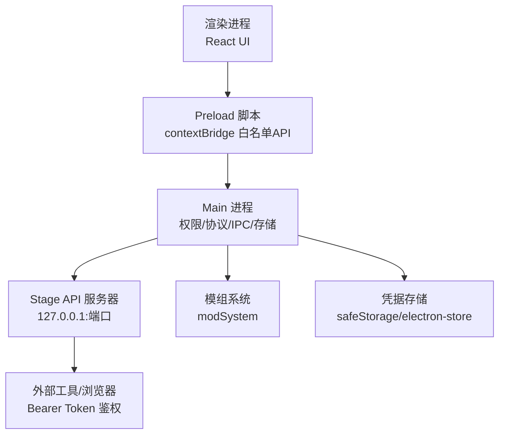
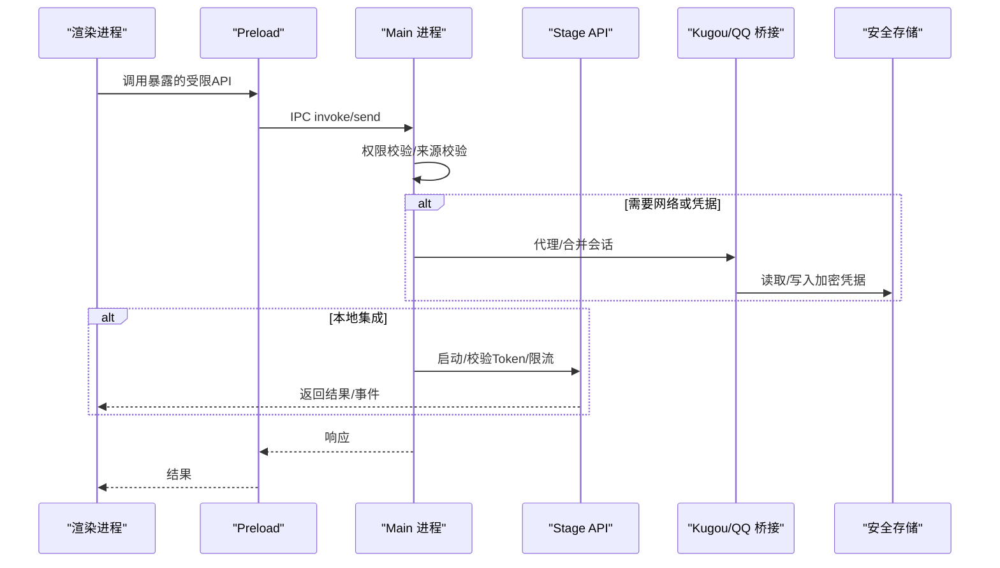
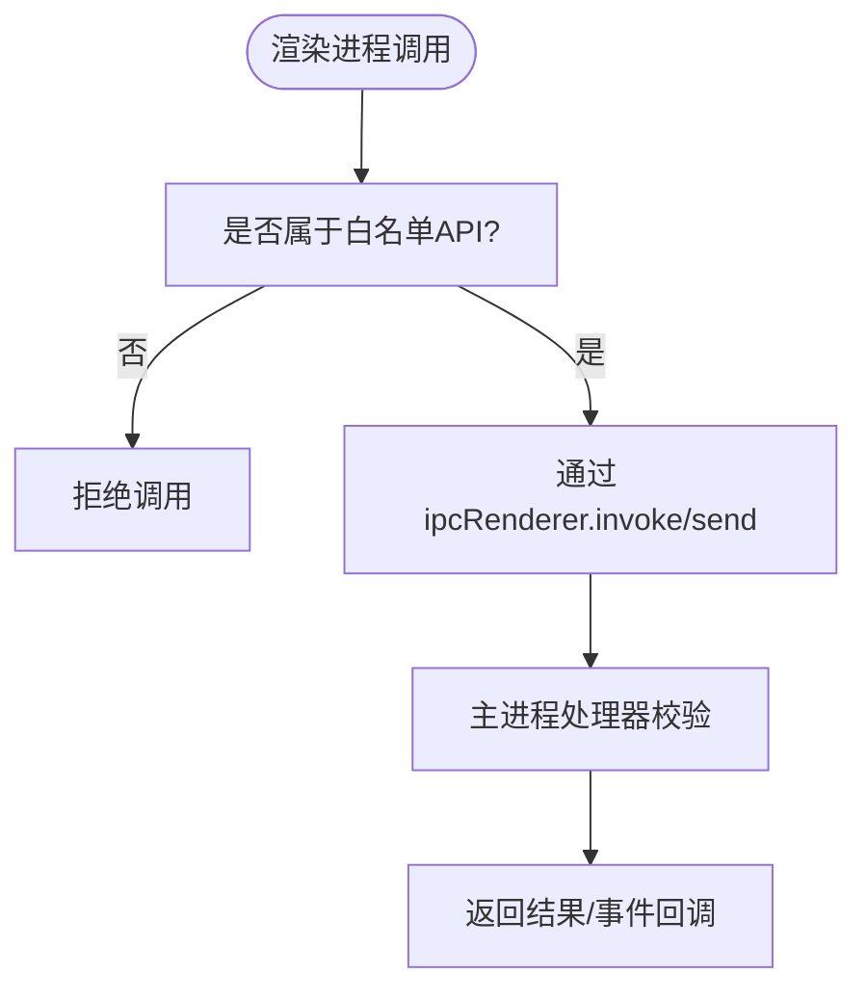
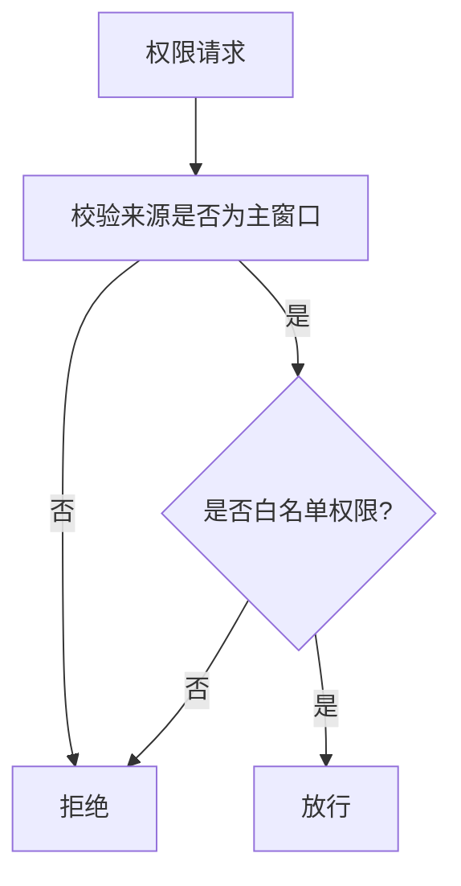
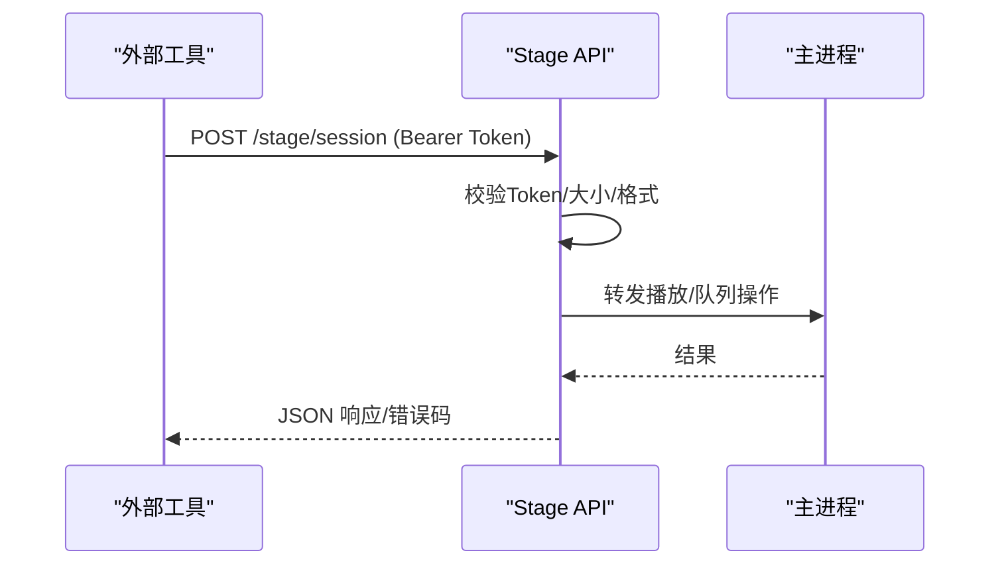
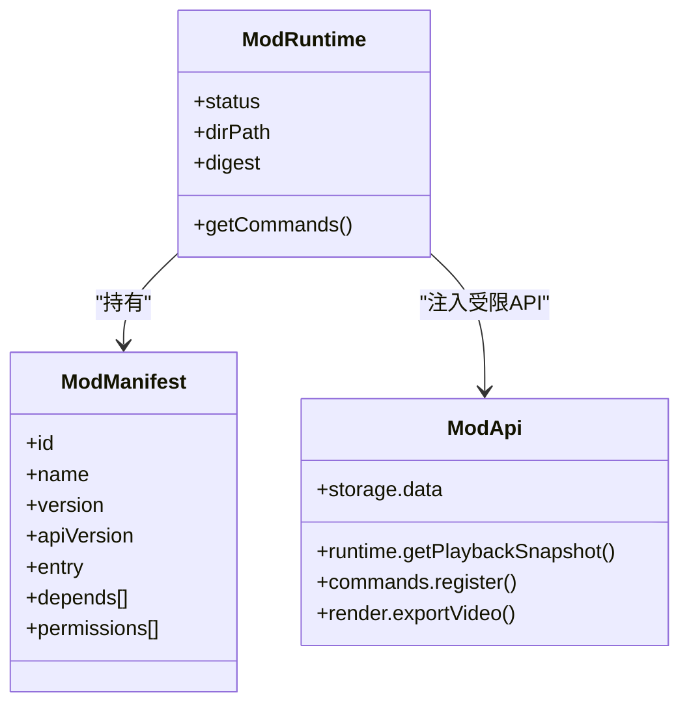
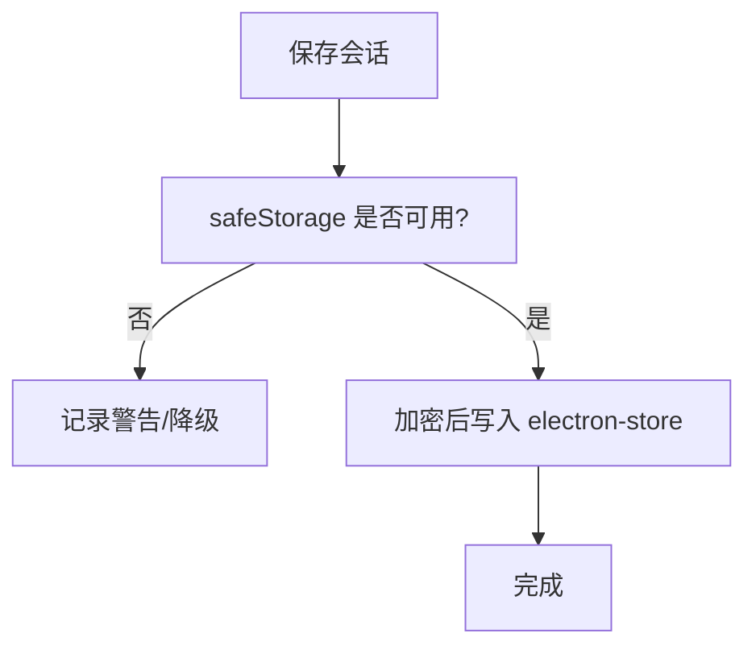
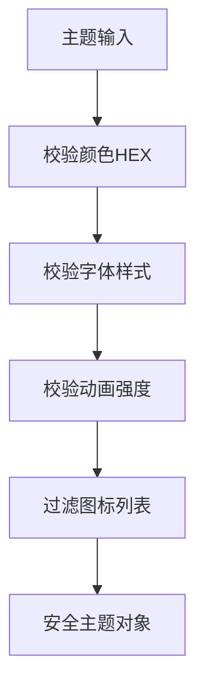
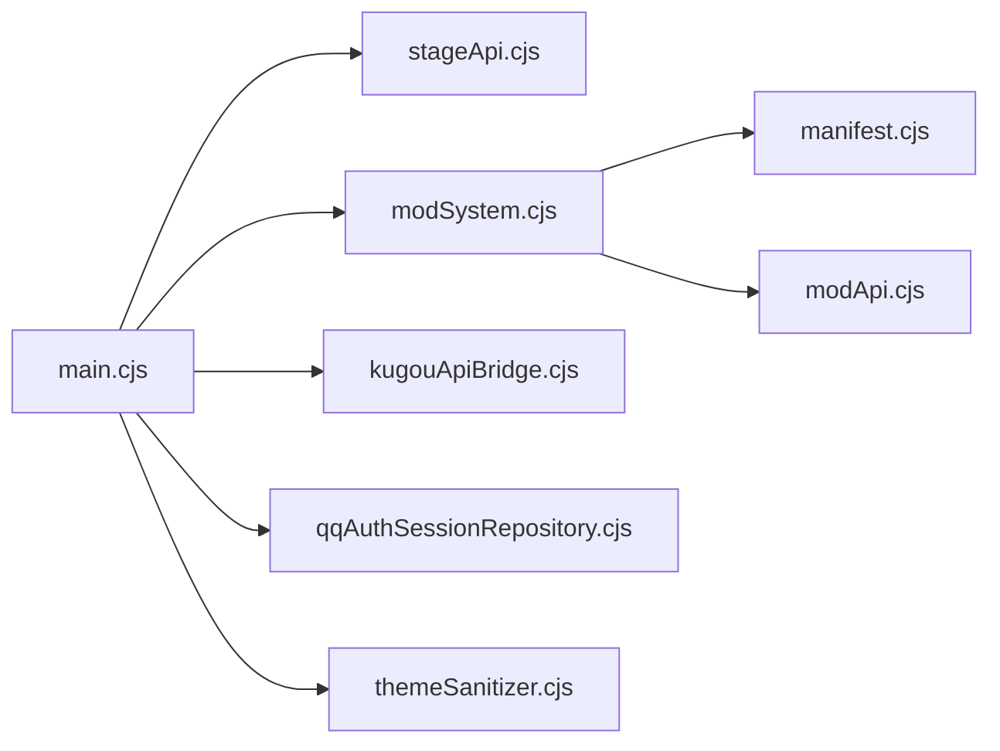

# 安全模型与权限控制

<cite>
**本文引用的文件**
- [electron/main.cjs](file://electron/main.cjs)
- [electron/preload.cjs](file://electron/preload.cjs)
- [electron/stageApi.cjs](file://electron/stageApi.cjs)
- [electron/modSystem/modSystem.cjs](file://electron/modSystem/modSystem.cjs)
- [electron/modSystem/manifest.cjs](file://electron/modSystem/manifest.cjs)
- [electron/modSystem/modApi.cjs](file://electron/modSystem/modApi.cjs)
- [electron/kugouApiBridge.cjs](file://electron/kugouApiBridge.cjs)
- [electron/qqAuthSessionRepository.cjs](file://electron/qqAuthSessionRepository.cjs)
- [shared/themeSanitizer.cjs](file://shared/themeSanitizer.cjs)
- [src/utils/stageClientDemo.ts](file://src/utils/stageClientDemo.ts)
</cite>

## 目录
1. [简介](#简介)
2. [项目结构](#项目结构)
3. [核心组件](#核心组件)
4. [架构总览](#架构总览)
5. [详细组件分析](#详细组件分析)
6. [依赖关系分析](#依赖关系分析)
7. [性能与安全权衡](#性能与安全权衡)
8. [故障排查指南](#故障排查指南)
9. [结论](#结论)
10. [附录：安全最佳实践](#附录：安全最佳实践)

## 简介
本技术文档聚焦 Folia Player 的 IPC 通信安全模型，系统性解析进程隔离、权限验证、输入校验等关键安全机制；说明跨进程通信的安全边界（渲染进程限制、Node.js API 访问控制、文件系统权限）；阐述恶意输入检测与防护策略（路径遍历、命令注入、XSS、SQL 注入等）；并给出安全审计与日志记录、安全编码规范、漏洞修复流程与安全测试方法。

## 项目结构
Folia Player 采用 Electron 多进程架构：
- Main 进程：集中管理权限、协议、IPC、外部服务、会话与凭据存储。
- Preload 脚本：通过 contextBridge 暴露最小化、白名单化的 API 给渲染进程。
- Renderer 进程：UI 与业务逻辑，仅能调用 preload 暴露的受限接口。
- 本地 Stage API：监听 127.0.0.1 的 HTTP/WebSocket，提供受鉴权的本地集成能力。
- 模组系统：加载第三方代码，强制用户确认与内容指纹绑定，按声明权限执行。

**图表来源**
- [electron/preload.cjs:1-320](file://electron/preload.cjs#L1-L320)
- [electron/main.cjs:1-800](file://electron/main.cjs#L1-L800)
- [electron/stageApi.cjs:1-200](file://electron/stageApi.cjs#L1-L200)

**章节来源**
- [electron/preload.cjs:1-320](file://electron/preload.cjs#L1-L320)
- [electron/main.cjs:1-800](file://electron/main.cjs#L1-L800)

## 核心组件
- 预加载白名单与 IPC 通道：将 Node/Electron 能力严格收敛为有限函数，避免直接暴露危险 API。
- 权限检查与请求处理：在 session 层对文件系统、媒体、剪贴板等权限进行白名单校验与来源校验。
- 本地 Stage API：仅绑定 127.0.0.1，要求 Bearer Token，严格校验请求参数与范围。
- 模组系统：基于 manifest 声明权限，运行时逐条校验；启用需用户确认且绑定内容指纹。
- 凭据与存储：使用 safeStorage 加密持久化敏感数据，拒绝明文后端。
- 主题与数据清洗：统一 sanitizer 过滤非法颜色、字体、动画强度等字段，防止注入。

**章节来源**
- [electron/preload.cjs:1-320](file://electron/preload.cjs#L1-L320)
- [electron/main.cjs:1537-1677](file://electron/main.cjs#L1537-L1677)
- [electron/stageApi.cjs:1-200](file://electron/stageApi.cjs#L1-L200)
- [electron/modSystem/modSystem.cjs:577-676](file://electron/modSystem/modSystem.cjs#L577-L676)
- [electron/kugouApiBridge.cjs:37-205](file://electron/kugouApiBridge.cjs#L37-L205)
- [electron/qqAuthSessionRepository.cjs:1-84](file://electron/qqAuthSessionRepository.cjs#L1-L84)
- [shared/themeSanitizer.cjs:1-146](file://shared/themeSanitizer.cjs#L1-L146)

## 架构总览
下图展示从渲染进程到主进程、再到外部服务的完整安全边界与数据流。

**图表来源**
- [electron/preload.cjs:1-320](file://electron/preload.cjs#L1-L320)
- [electron/main.cjs:1537-1677](file://electron/main.cjs#L1537-L1677)
- [electron/stageApi.cjs:1-200](file://electron/stageApi.cjs#L1-L200)
- [electron/kugouApiBridge.cjs:37-205](file://electron/kugouApiBridge.cjs#L37-L205)
- [electron/qqAuthSessionRepository.cjs:1-84](file://electron/qqAuthSessionRepository.cjs#L1-L84)

## 详细组件分析

### 预加载白名单与 IPC 安全边界
- 仅通过 contextBridge 暴露必要能力，如音频缓存、窗口控制、更新、模组管理等。
- 所有 IPC 通道均为主进程处理，渲染进程无法直接访问 Node/Electron 内部对象。
- 事件订阅采用显式注册与移除，避免内存泄漏与越权监听。

**图表来源**
- [electron/preload.cjs:1-320](file://electron/preload.cjs#L1-L320)

**章节来源**
- [electron/preload.cjs:1-320](file://electron/preload.cjs#L1-L320)

### 权限验证与来源校验
- 文件系统访问：仅允许受信任的主窗口来源，且仅放行白名单权限（文件系统、字体、剪贴板写入、扬声器选择、音频媒体）。
- 证书错误处理：仅对特定 CDN 主机名放宽常见名称不匹配错误，其他一律拒绝。
- CORS 绕过：针对特定域名与路径放行，避免全局放宽导致风险。

**图表来源**
- [electron/main.cjs:1537-1677](file://electron/main.cjs#L1537-L1677)
- [electron/main.cjs:56-76](file://electron/main.cjs#L56-L76)

**章节来源**
- [electron/main.cjs:56-76](file://electron/main.cjs#L56-L76)
- [electron/main.cjs:1537-1677](file://electron/main.cjs#L1537-L1677)

### 本地 Stage API 安全
- 绑定 127.0.0.1，默认端口可配置，仅本机可达。
- 所有 HTTP 接口（除健康检查）要求 Authorization: Bearer token，token 由主进程生成与轮换。
- 请求体大小、multipart 字段/文件数量、保留会话数均有上限。
- 播放控制与队列操作严格校验 action 枚举与数值范围，防止越界 seek 与非法指令。

**图表来源**
- [electron/stageApi.cjs:1-200](file://electron/stageApi.cjs#L1-L200)
- [electron/stageApi.cjs:833-866](file://electron/stageApi.cjs#L833-L866)
- [src/utils/stageClientDemo.ts:162-203](file://src/utils/stageClientDemo.ts#L162-L203)

**章节来源**
- [electron/stageApi.cjs:1-200](file://electron/stageApi.cjs#L1-L200)
- [electron/stageApi.cjs:833-866](file://electron/stageApi.cjs#L833-L866)
- [src/utils/stageClientDemo.ts:162-203](file://src/utils/stageClientDemo.ts#L162-L203)

### 模组系统安全模型
- 白名单权限：仅允许声明已知权限集（filesystem.data、render.export、runtime.playback、visualizer.register），未知权限直接拒绝。
- 用户确认与内容指纹：启用模组前弹出主进程对话框，显示权限、安装位置与内容指纹；启用后绑定当前文件哈希，后续变更需重新确认。
- 运行时权限门控：每个 API 调用点 requirePermission，未声明权限即抛错，确保“失败关闭”。
- 依赖图与加载计划：解析 depends 版本范围，检测循环依赖与缺失依赖，失败隔离至子图。

**图表来源**
- [electron/modSystem/manifest.cjs:1-327](file://electron/modSystem/manifest.cjs#L1-L327)
- [electron/modSystem/modSystem.cjs:577-676](file://electron/modSystem/modSystem.cjs#L577-L676)
- [electron/modSystem/modApi.cjs:1-164](file://electron/modSystem/modApi.cjs#L1-L164)

**章节来源**
- [electron/modSystem/manifest.cjs:1-327](file://electron/modSystem/manifest.cjs#L1-L327)
- [electron/modSystem/modSystem.cjs:577-676](file://electron/modSystem/modSystem.cjs#L577-L676)
- [electron/modSystem/modApi.cjs:1-164](file://electron/modSystem/modApi.cjs#L1-L164)

### 凭据与存储安全
- QQ 认证会话：使用 safeStorage 加密保存，拒绝 Linux basic_text 明文后端；空数组时清理陈旧密文。
- 酷狗 API 桥接：同样拒绝明文后端，首次调用懒加载 safeStorage，失败降级为内存会话；合并响应中的 cookie/token/userid 并持久化。
- 主进程日志：当无 OS 凭据加密可用时输出警告，便于诊断登录问题。

**图表来源**
- [electron/qqAuthSessionRepository.cjs:1-84](file://electron/qqAuthSessionRepository.cjs#L1-L84)
- [electron/kugouApiBridge.cjs:37-205](file://electron/kugouApiBridge.cjs#L37-L205)
- [electron/main.cjs:4088-4127](file://electron/main.cjs#L4088-L4127)

**章节来源**
- [electron/qqAuthSessionRepository.cjs:1-84](file://electron/qqAuthSessionRepository.cjs#L1-L84)
- [electron/kugouApiBridge.cjs:37-205](file://electron/kugouApiBridge.cjs#L37-L205)
- [electron/main.cjs:4088-4127](file://electron/main.cjs#L4088-L4127)

### 主题与数据清洗（防 XSS/注入）
- 颜色值仅接受合法 HEX，自动归一化短格式；未知值回退到安全默认。
- 字体样式与动画强度仅接受白名单值。
- 歌词图标列表限制长度与类型，过滤非字符串项。
- 双主题（明/暗）分别清洗，保证最终主题结构安全可控。

**图表来源**
- [shared/themeSanitizer.cjs:1-146](file://shared/themeSanitizer.cjs#L1-L146)

**章节来源**
- [shared/themeSanitizer.cjs:1-146](file://shared/themeSanitizer.cjs#L1-L146)

## 依赖关系分析
- 主进程依赖模块：Stage API、模组系统、壁纸模式、语音输入暂停、歌词 API、本地封面资产、更新渠道、分析宿主、调试宿主、模型存储、Linux 密码库、Whisper 对齐等。
- 模组系统依赖：manifest 校验、modDigest 计算、modApi 注入、ffmpeg 路径解析、导出服务。
- 安全边界贯穿：preload 到 main 的 IPC 白名单、session 权限检查、Stage API 的 Token 校验、模组系统的权限门控、凭据存储的加密约束。

**图表来源**
- [electron/main.cjs:1-800](file://electron/main.cjs#L1-L800)
- [electron/modSystem/modSystem.cjs:1-676](file://electron/modSystem/modSystem.cjs#L1-L676)
- [electron/modSystem/manifest.cjs:1-327](file://electron/modSystem/manifest.cjs#L1-L327)
- [electron/modSystem/modApi.cjs:1-164](file://electron/modSystem/modApi.cjs#L1-L164)
- [electron/kugouApiBridge.cjs:1-205](file://electron/kugouApiBridge.cjs#L1-L205)
- [electron/qqAuthSessionRepository.cjs:1-84](file://electron/qqAuthSessionRepository.cjs#L1-L84)
- [shared/themeSanitizer.cjs:1-146](file://shared/themeSanitizer.cjs#L1-L146)

**章节来源**
- [electron/main.cjs:1-800](file://electron/main.cjs#L1-L800)
- [electron/modSystem/modSystem.cjs:1-676](file://electron/modSystem/modSystem.cjs#L1-L676)

## 性能与安全权衡
- 模组内容指纹计算限制：文件数与总字节上限，避免启动时长时间阻塞；超限视为不可验证，拒绝信任。
- Stage API 请求体与 multipart 限制：防止大体积攻击与资源耗尽。
- 权限检查与来源校验：在主进程集中处理，减少渲染侧开销与风险面。
- 凭据存储懒加载：首次 IPC 时才初始化 safeStorage，降低冷启动成本。

[本节为通用指导，无需具体文件引用]

## 故障排查指南
- 无 OS 凭据加密：主进程会输出警告，表明在线账户不会持久化；检查平台与桌面环境是否支持安全存储。
- 模组启用被拒：确认 mod.json 的 id、version、entry、permissions 是否符合规范；查看依赖解析失败原因。
- Stage API 401/503：检查 Token 是否正确、Stage 是否启用、端口是否被占用。
- 文件系统权限被拒：确认来源是否为主窗口，权限是否在白名单内。

**章节来源**
- [electron/main.cjs:4088-4127](file://electron/main.cjs#L4088-L4127)
- [electron/modSystem/manifest.cjs:136-201](file://electron/modSystem/manifest.cjs#L136-L201)
- [electron/stageApi.cjs:1-200](file://electron/stageApi.cjs#L1-L200)
- [electron/main.cjs:1537-1677](file://electron/main.cjs#L1537-L1677)

## 结论
Folia Player 通过多层安全边界实现稳健的 IPC 通信安全模型：
- 渲染进程仅能通过 preload 白名单调用受限 API。
- 主进程集中实施权限检查、来源校验与协议注册。
- 本地 Stage API 以 Token 鉴权与严格参数校验保护本机集成。
- 模组系统以用户确认+内容指纹+声明权限三重保障第三方代码运行安全。
- 凭据存储强制使用 OS 加密，拒绝明文后端。
- 主题与数据清洗防止注入与异常输入影响 UI 与状态。

这些机制共同构成应用的安全基线，确保跨进程通信的可控性与可追溯性。

[本节为总结性内容，无需具体文件引用]

## 附录：安全最佳实践
- 安全编码规范
  - 所有外部输入必须校验类型、范围与格式；拒绝未知权限与非法路径。
  - 使用白名单而非黑名单；对枚举值进行严格匹配。
  - 对敏感数据一律加密存储，禁止明文落盘。
- 漏洞修复流程
  - 发现漏洞后优先缩小攻击面（收紧权限、增加校验、限制来源）。
  - 补充单元测试与集成测试覆盖新规则。
  - 发布前进行安全回归测试与依赖扫描。
- 安全测试方法
  - 对 Stage API 进行 Token 伪造、超大请求体、非法 action 的渗透测试。
  - 对模组系统验证未知权限、循环依赖、路径穿越的拒绝行为。
  - 对凭据存储验证明文后端拒绝与解密失败降级路径。

[本节为通用指导，无需具体文件引用]