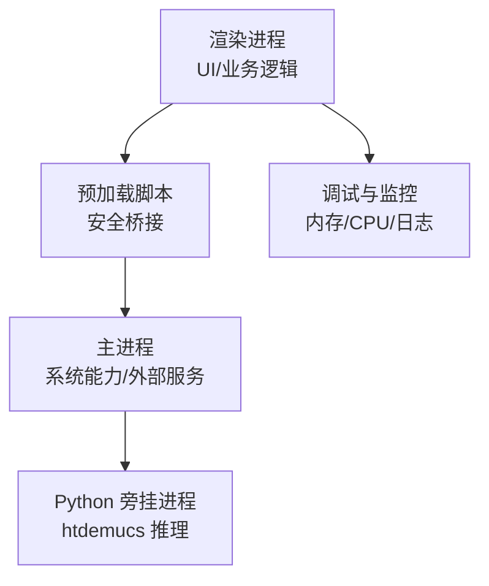
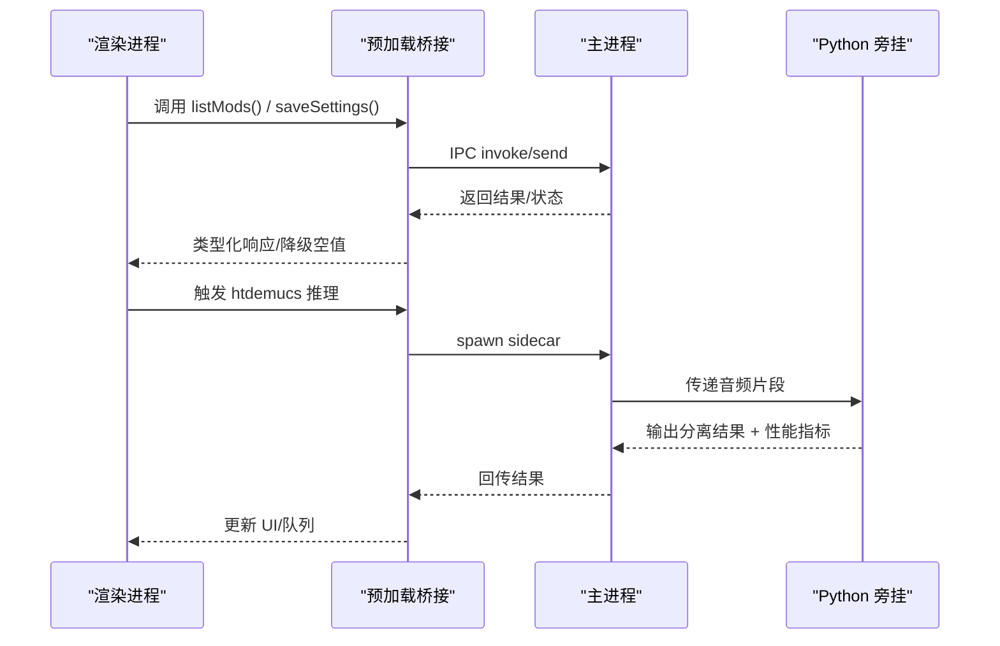
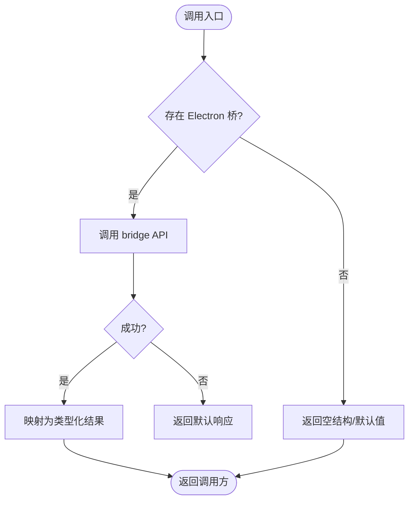
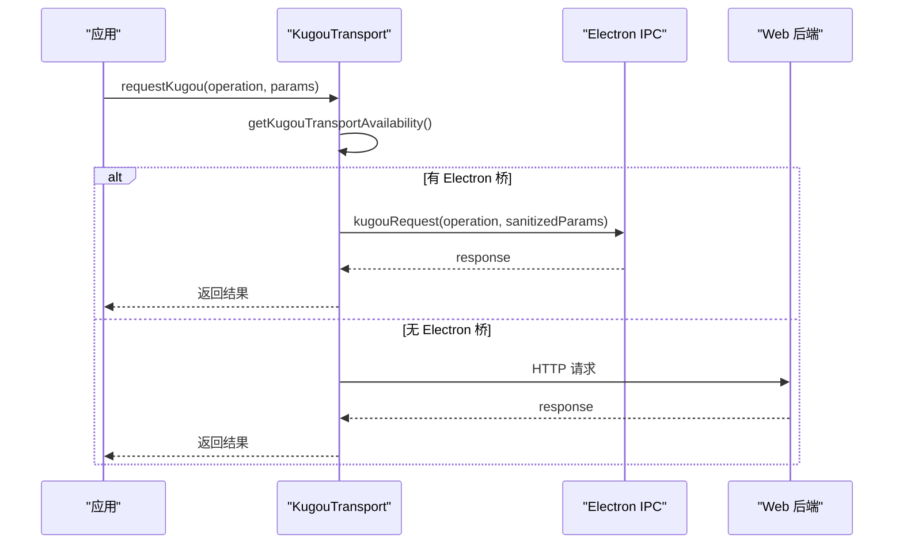
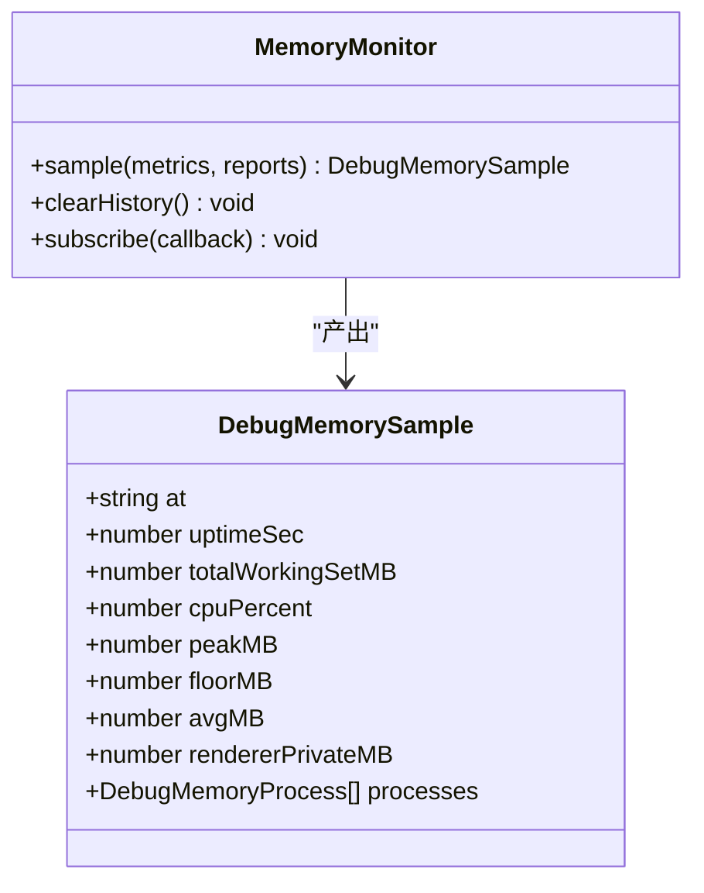
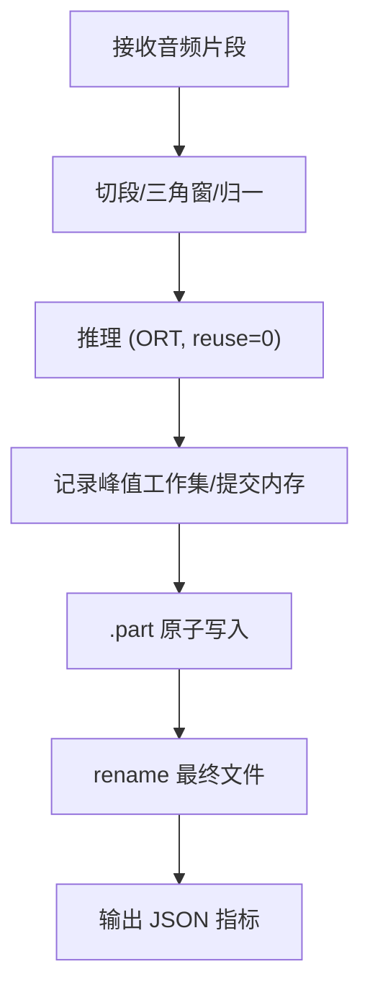
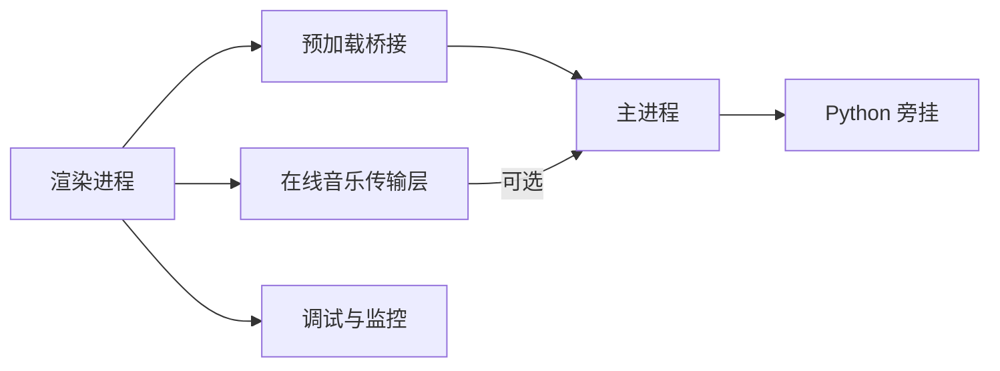

# 性能优化与监控

<cite>
**本文引用的文件**
- [src/mods/ipc.ts](file://src/mods/ipc.ts)
- [electron/preload.cjs](file://electron/preload.cjs)
- [electron/kugouApiBridge.cjs](file://electron/kugouApiBridge.cjs)
- [src/services/onlineMusic/kugouTransport.ts](file://src/services/onlineMusic/kugouTransport.ts)
- [test/unit/onlineMusic/qqTransport.test.ts](file://test/unit/onlineMusic/qqTransport.test.ts)
- [electron/analysis/htdemucs_runner.py](file://electron/analysis/htdemucs_runner.py)
- [docs/automix-memory-optimization.md](file://docs/automix-memory-optimization.md)
- [test/unit/electron/debugModule.test.ts](file://test/unit/electron/debugModule.test.ts)
- [src/vite-env.d.ts](file://src/vite-env.d.ts)
- [test/manual/lyrics_benchmark.ts](file://test/manual/lyrics_benchmark.ts)
</cite>

## 目录
1. [引言](#引言)
2. [项目结构](#项目结构)
3. [核心组件](#核心组件)
4. [架构总览](#架构总览)
5. [详细组件分析](#详细组件分析)
6. [依赖关系分析](#依赖关系分析)
7. [性能考量](#性能考量)
8. [故障排查指南](#故障排查指南)
9. [结论](#结论)
10. [附录](#附录)

## 引言
本技术文档聚焦 Folia Player 的 IPC 通信性能优化，围绕网络延迟、内存使用、CPU 占用等关键指标进行瓶颈定位，并给出消息批处理、连接池管理、内存泄漏防护等优化策略。同时说明监控与诊断工具（性能分析器、日志收集、错误追踪），解释异步通信优化（Promise 链、事件循环、并发控制），并提供基准测试与压力测试方法以及调优实践建议，确保高负载下的稳定性。

## 项目结构
本项目在 Electron 环境下运行，IPC 通信贯穿渲染进程与主进程：
- 渲染侧通过 window.electron.* 暴露的桥接 API 发起调用；
- preload 层负责将安全能力封装为 IPC 通道；
- 主进程侧提供具体实现（如设置保存、API 代理、调试采集）；
- 业务模块按功能分层组织（在线音乐、自动混音、可视化、调试等）。

图表来源
- [electron/preload.cjs:21-48](file://electron/preload.cjs#L21-L48)
- [src/mods/ipc.ts:16-117](file://src/mods/ipc.ts#L16-L117)
- [electron/analysis/htdemucs_runner.py:170-251](file://electron/analysis/htdemucs_runner.py#L170-L251)

章节来源
- [electron/preload.cjs:21-48](file://electron/preload.cjs#L21-L48)
- [src/mods/ipc.ts:16-117](file://src/mods/ipc.ts#L16-L117)

## 核心组件
- 插件与扩展 IPC：统一的类型化 IPC 访问层，屏蔽无 Electron 环境的降级路径，保证可渲染性。
- 在线音乐传输层：根据环境选择 Electron IPC 或 Web 后端，避免敏感信息穿越边界。
- 调试与内存监控：跨平台采样工作集、堆大小、CPU 占比，维护历史曲线与峰值统计。
- Python 旁挂推理：将 htdemucs 推理迁移到独立 Python 进程，关闭 ORT 内存复用以降低峰值。

章节来源
- [src/mods/ipc.ts:16-117](file://src/mods/ipc.ts#L16-L117)
- [src/services/onlineMusic/kugouTransport.ts:216-237](file://src/services/onlineMusic/kugouTransport.ts#L216-L237)
- [test/unit/electron/debugModule.test.ts:27-163](file://test/unit/electron/debugModule.test.ts#L27-L163)
- [docs/automix-memory-optimization.md:21-118](file://docs/automix-memory-optimization.md#L21-L118)

## 架构总览
IPC 通信的关键路径包括：
- 渲染进程通过 preload 暴露的桥接函数调用主进程能力；
- 在线音乐请求在渲染侧判断是否走 Electron IPC，必要时剥离敏感参数；
- 调试数据由主进程采集并通过 IPC 上报给渲染侧用于可视化；
- 重型计算（如 htdemucs）下沉至 Python 旁挂进程，减少主进程内存尖峰。

图表来源
- [src/mods/ipc.ts:26-117](file://src/mods/ipc.ts#L26-L117)
- [electron/preload.cjs:21-48](file://electron/preload.cjs#L21-L48)
- [electron/analysis/htdemucs_runner.py:219-251](file://electron/analysis/htdemucs_runner.py#L219-L251)

## 详细组件分析

### 插件 IPC 层（src/mods/ipc.ts）
- 设计要点：统一类型化封装，所有调用均具备降级策略（无 Electron 时返回空结构），保障 UI 可渲染。
- 性能关注点：
  - 批量订阅：通过 on* 回调集中推送状态变更，避免频繁 RPC。
  - 错误隔离：try/catch 包裹远程调用，失败时返回默认值，防止阻塞渲染。
  - 最小载荷：仅传递必要字段，降低序列化开销。

图表来源
- [src/mods/ipc.ts:26-117](file://src/mods/ipc.ts#L26-L117)

章节来源
- [src/mods/ipc.ts:16-117](file://src/mods/ipc.ts#L16-L117)

### 在线音乐传输层（kugouTransport.ts）
- 设计要点：优先走 Electron IPC，若不可用则回退到 Web 后端；在 IPC 边界剥离敏感参数（token、cookie、dfid），避免泄露。
- 性能关注点：
  - 端口解析缓存：测试表明端口解析结果会被缓存，后续请求不再重复 IPC，降低桥接成本。
  - 条件分支短路：快速判定可用性与配置，减少不必要的网络/IPC 调用。

图表来源
- [src/services/onlineMusic/kugouTransport.ts:216-237](file://src/services/onlineMusic/kugouTransport.ts#L216-L237)
- [test/unit/onlineMusic/qqTransport.test.ts:378-403](file://test/unit/onlineMusic/qqTransport.test.ts#L378-L403)

章节来源
- [src/services/onlineMusic/kugouTransport.ts:216-237](file://src/services/onlineMusic/kugouTransport.ts#L216-L237)
- [test/unit/onlineMusic/qqTransport.test.ts:378-403](file://test/unit/onlineMusic/qqTransport.test.ts#L378-L403)

### 调试与内存监控（preload.cjs + debugModule.test.ts）
- 设计要点：
  - 预加载层提供 debugRendererMemory 等方法，读取进程级内存信息并通过 IPC 上报。
  - 调试模块对多进程工作集进行聚合，计算峰值、均值、地板，避免简单相加导致的误判。
- 性能关注点：
  - 采样频率可调，避免高频采样影响性能。
  - 历史曲线固定长度，防止内存无限增长。
  - 区分平台差异（Windows privateBytes vs 其他平台），保证指标一致性。

图表来源
- [src/vite-env.d.ts:618-655](file://src/vite-env.d.ts#L618-L655)
- [test/unit/electron/debugModule.test.ts:27-163](file://test/unit/electron/debugModule.test.ts#L27-L163)

章节来源
- [electron/preload.cjs:21-48](file://electron/preload.cjs#L21-L48)
- [test/unit/electron/debugModule.test.ts:27-163](file://test/unit/electron/debugModule.test.ts#L27-L163)
- [src/vite-env.d.ts:618-655](file://src/vite-env.d.ts#L618-L655)

### Python 旁挂推理（htdemucs_runner.py）
- 设计要点：
  - 将 htdemucs 推理从 Node 侧迁移到 Python 进程，关闭 ORT 内存复用，显著降低峰值。
  - 输出原子写入（.part + rename），崩溃不产生半写文件。
  - 报告峰值工作集、提交内存、线程数、CPU 数等指标，便于诊断。
- 性能关注点：
  - 单会话持久化，避免每段开新会话导致权重重载叠加。
  - 限制线程数，留出 CPU 核给播放与渲染。
  - Windows 上偏好能效核，降低后台任务干扰。

图表来源
- [electron/analysis/htdemucs_runner.py:170-251](file://electron/analysis/htdemucs_runner.py#L170-L251)
- [docs/automix-memory-optimization.md:21-118](file://docs/automix-memory-optimization.md#L21-L118)

章节来源
- [electron/analysis/htdemucs_runner.py:170-251](file://electron/analysis/htdemucs_runner.py#L170-L251)
- [docs/automix-memory-optimization.md:21-118](file://docs/automix-memory-optimization.md#L21-L118)

## 依赖关系分析
- 渲染进程依赖 preload 提供的安全桥接，再调用主进程能力；
- 在线音乐传输层依赖 Electron IPC 或 Web 后端，且具备端口解析缓存；
- 调试模块依赖主进程的进程指标采集，并在渲染侧维护历史曲线；
- Python 旁挂进程作为独立子进程，通过文件系统与主进程交换数据。

图表来源
- [src/mods/ipc.ts:16-117](file://src/mods/ipc.ts#L16-L117)
- [src/services/onlineMusic/kugouTransport.ts:216-237](file://src/services/onlineMusic/kugouTransport.ts#L216-L237)
- [electron/preload.cjs:21-48](file://electron/preload.cjs#L21-L48)
- [electron/analysis/htdemucs_runner.py:219-251](file://electron/analysis/htdemucs_runner.py#L219-L251)

章节来源
- [src/mods/ipc.ts:16-117](file://src/mods/ipc.ts#L16-L117)
- [src/services/onlineMusic/kugouTransport.ts:216-237](file://src/services/onlineMusic/kugouTransport.ts#L216-L237)
- [electron/preload.cjs:21-48](file://electron/preload.cjs#L21-L48)
- [electron/analysis/htdemucs_runner.py:219-251](file://electron/analysis/htdemucs_runner.py#L219-L251)

## 性能考量
- 网络延迟
  - 使用 Electron IPC 时，注意避免每次请求都进行昂贵解析（如端口解析缓存）。
  - 合理拆分请求，避免大对象序列化；必要时采用流式或分块传输。
- 内存使用
  - 通过 Python 旁挂关闭 ORT 内存复用，显著降低峰值；保持单会话持久化，避免权重重载叠加。
  - 调试模块对多进程工作集进行聚合，避免简单相加造成的误判；历史曲线固定长度，防止内存增长。
- CPU 占用
  - 限制推理线程数，留出 CPU 核给播放与渲染；Windows 上偏好能效核，降低后台任务干扰。
  - 批量操作与事件合并，减少事件循环抖动。
- 异步通信优化
  - Promise 链尽量扁平化，避免深层嵌套；失败路径尽早返回，减少无用计算。
  - 事件循环优化：将重任务放入 Worker 或子进程，保持 UI 流畅。
  - 并发控制：对并行请求设置上限，避免资源争用。
- 消息批处理
  - 日志与遥测数据批量发送，避免逐行 IPC 带来的开销。
  - 队列操作批量变换，减少多次状态更新。
- 连接池管理
  - 对长连接（如 WebSocket）进行复用与心跳检测，避免频繁建立/销毁。
  - 超时与重试策略需考虑幂等性与去抖。
- 内存泄漏防护
  - 订阅回调及时注销，避免悬挂监听器。
  - 大对象及时释放，避免长时间驻留；使用弱引用存储临时数据。
- 监控与诊断
  - 启用内存监控与运行时日志，定期导出历史曲线与日志文件。
  - 结合 Python 旁挂输出的 JSON 指标，定位推理阶段瓶颈。

[本节为通用指导，无需特定文件引用]

## 故障排查指南
- 常见症状
  - 界面卡顿：检查是否有重任务阻塞事件循环；确认是否启用了 Worker 或子进程。
  - 内存飙升：查看调试模块的峰值与工作集曲线；核对 Python 旁挂是否正常运行。
  - 网络异常：确认 Electron IPC 可用性；检查端口解析缓存与回退路径。
- 定位步骤
  - 打开调试日志，过滤关键错误；导出内存历史曲线进行分析。
  - 检查 Python 旁挂输出 JSON，确认推理耗时与峰值指标。
  - 对热点路径添加计时点，对比不同配置下的表现。
- 恢复策略
  - 重启旁挂进程以释放内存；清理临时文件与缓存。
  - 降级到 Web 后端或普通交叉淡入，保证基本功能可用。
  - 调整线程数与采样频率，平衡性能与精度。

章节来源
- [electron/preload.cjs:21-48](file://electron/preload.cjs#L21-L48)
- [test/unit/electron/debugModule.test.ts:27-163](file://test/unit/electron/debugModule.test.ts#L27-L163)
- [electron/analysis/htdemucs_runner.py:219-251](file://electron/analysis/htdemucs_runner.py#L219-L251)

## 结论
通过对 IPC 通信路径的梳理与优化，结合 Python 旁挂推理、调试监控与批量处理等手段，Folia Player 在高负载下能够保持稳定与流畅。关键在于：
- 将重型计算移出主进程，降低内存尖峰；
- 合理使用 IPC 缓存与批处理，减少桥接开销；
- 完善监控与诊断，持续跟踪性能指标；
- 遵循异步与并发最佳实践，避免事件循环阻塞。

[本节为总结，无需特定文件引用]

## 附录
- 基准测试方法
  - 使用 Node perf_hooks 对解析与处理流程进行计时，统计均值、P95、极值与总耗时。
  - 构造合成数据与真实数据混合场景，覆盖不同格式与规模。
- 压力测试方法
  - 模拟高并发请求，观察 IPC 吞吐与延迟；验证连接池与重试策略。
  - 长时间运行测试，检查内存曲线是否稳定，是否存在泄漏迹象。
- 调优实践
  - 逐步调整线程数、采样频率与批大小，记录性能变化。
  - 在不同硬件与环境（含弱机）下复测，确保兼容性与鲁棒性。

章节来源
- [test/manual/lyrics_benchmark.ts:34-156](file://test/manual/lyrics_benchmark.ts#L34-L156)