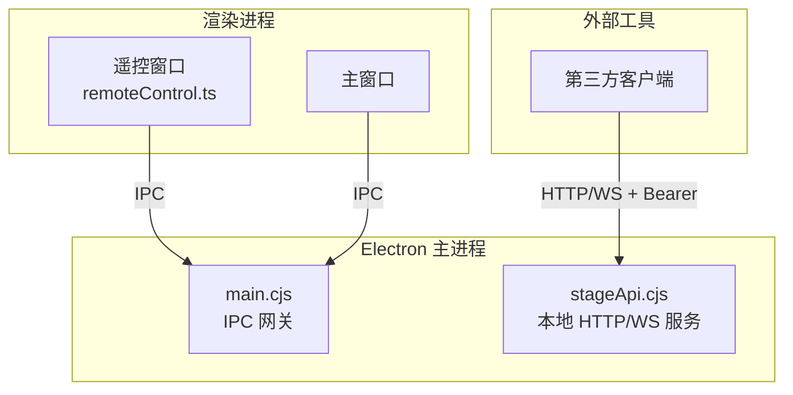
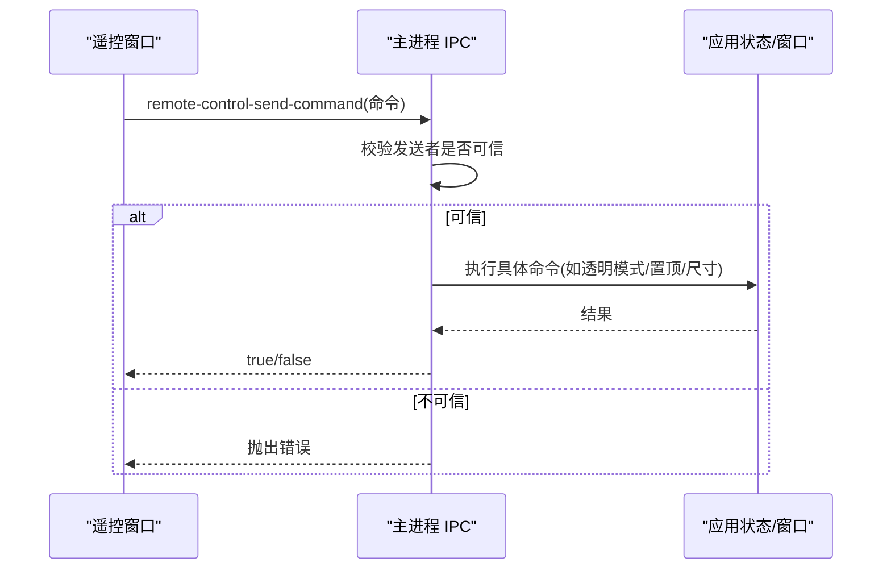
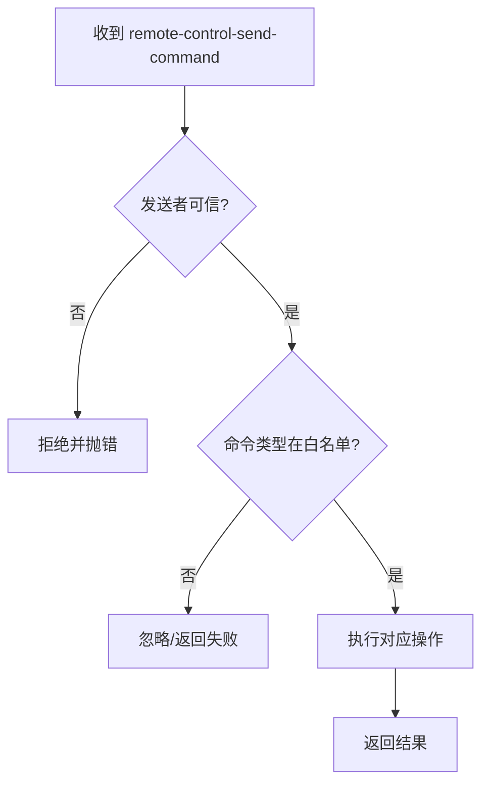
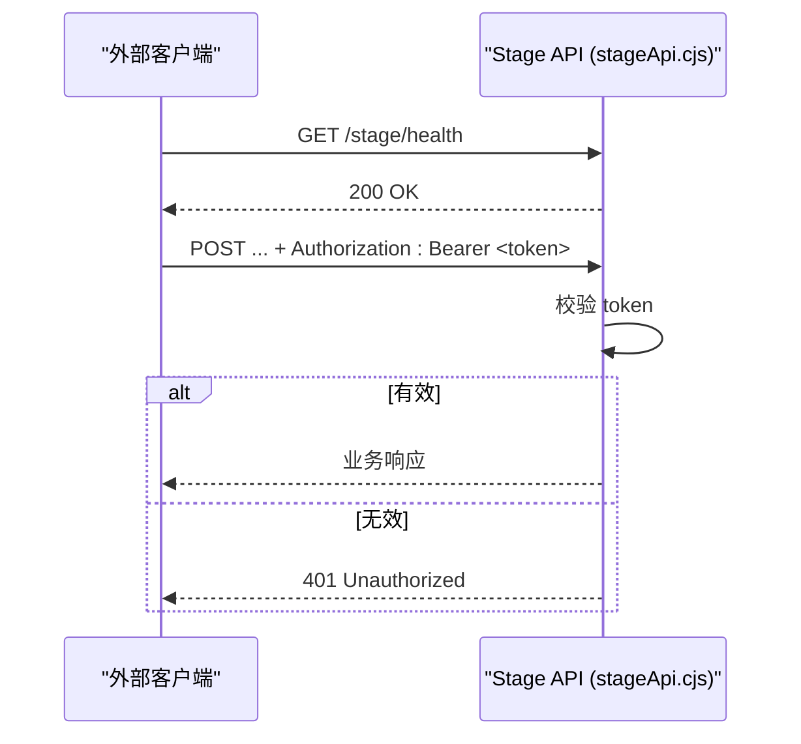
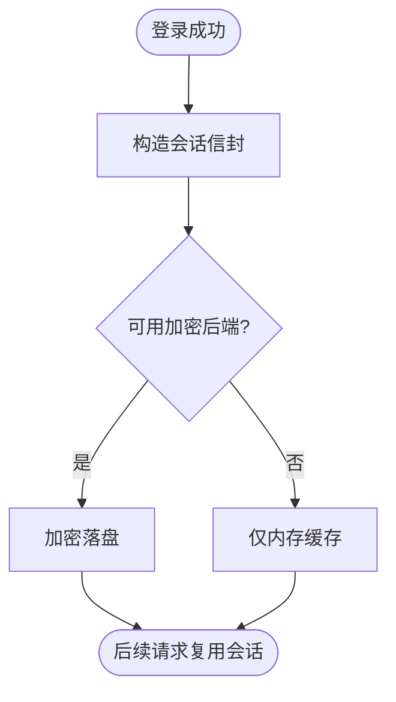
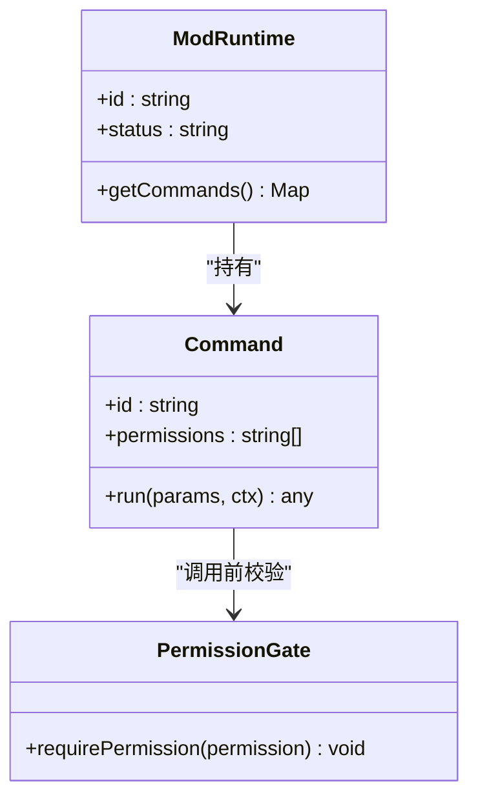
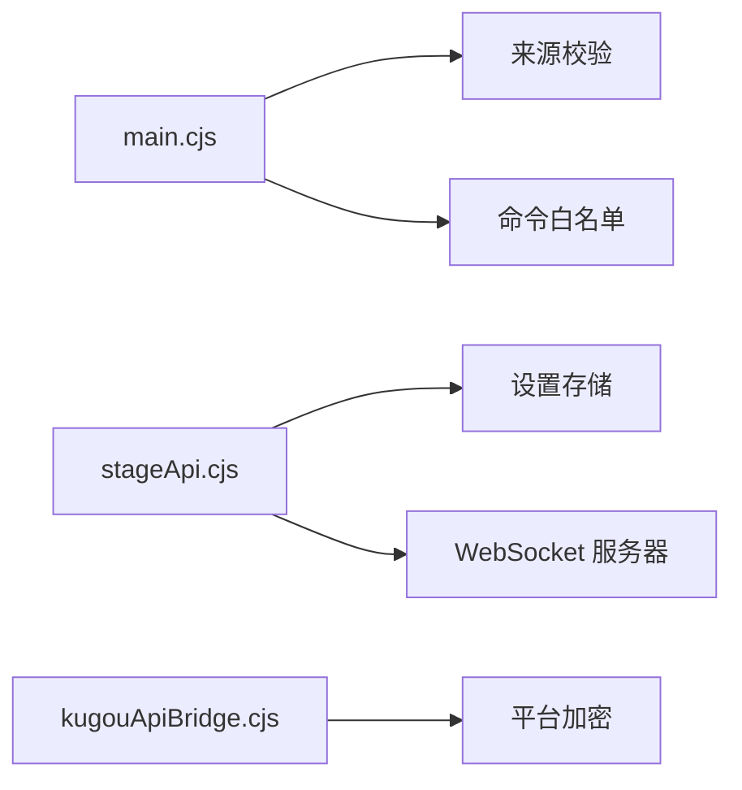

# 安全机制

<cite>
**本文引用的文件**
- [electron/main.cjs](file://electron/main.cjs)
- [electron/stageApi.cjs](file://electron/stageApi.cjs)
- [src/types/remoteControl.ts](file://src/types/remoteControl.ts)
- [src/services/repositories/sessionRepository.ts](file://src/services/repositories/sessionRepository.ts)
- [electron/kugouApiBridge.cjs](file://electron/kugouApiBridge.cjs)
- [src/services/onlineMusic/qqTransport.ts](file://src/services/onlineMusic/qqTransport.ts)
- [electron/modSystem/modSystem.cjs](file://electron/modSystem/modSystem.cjs)
- [test/unit/electron/qqAuthSessionRepository.test.ts](file://test/unit/electron/qqAuthSessionRepository.test.ts)
- [sync-server/install.sh](file://sync-server/install.sh)
- [test/manual/stage-client/API_SCHEMA.md](file://test/manual/stage-client/API_SCHEMA.md)
</cite>

## 目录
1. [简介](#简介)
2. [项目结构](#项目结构)
3. [核心组件](#核心组件)
4. [架构总览](#架构总览)
5. [详细组件分析](#详细组件分析)
6. [依赖关系分析](#依赖关系分析)
7. [性能与安全考量](#性能与安全考量)
8. [故障排查指南](#故障排查指南)
9. [结论](#结论)
10. [附录：配置与最佳实践](#附录配置与最佳实践)

## 简介
本文件聚焦 Folia Player 的“远程控制”安全机制，覆盖以下方面：
- 认证体系：令牌生成、验证、刷新（含本地 Stage API 与 QQ/KuGou 等在线服务的会话）
- 会话管理：创建、过期处理、并发控制
- 权限控制：操作授权、访问控制、审计日志
- 输入验证与防护：命令白名单、参数校验、注入防护
- 通信加密与传输安全：IPC 信任边界、HTTP 鉴权、CORS 策略
- 安全配置与最佳实践

## 项目结构
远程控制在 Electron 主进程中通过 IPC 暴露受控能力，前端渲染进程（主窗口或独立的遥控窗口）仅能调用被明确授权的接口。Stage API 提供本地 HTTP/WebSocket 接口供外部工具集成，同样以 Bearer Token 鉴权并限制端口与来源。

图表来源
- [electron/main.cjs:5036-5176](file://electron/main.cjs#L5036-L5176)
- [electron/stageApi.cjs:227-241](file://electron/stageApi.cjs#L227-L241)
- [src/types/remoteControl.ts:17-79](file://src/types/remoteControl.ts#L17-L79)

章节来源
- [electron/main.cjs:5036-5176](file://electron/main.cjs#L5036-L5176)
- [electron/stageApi.cjs:227-241](file://electron/stageApi.cjs#L227-L241)
- [src/types/remoteControl.ts:17-79](file://src/types/remoteControl.ts#L17-L79)

## 核心组件
- 远程控制的 IPC 网关：在 main.cjs 中集中注册 remote-control-* 系列 IPC 处理器，强制来源可信校验，并对命令类型进行白名单分发。
- Stage API 本地服务：在 stageApi.cjs 中实现基于 Bearer Token 的 HTTP 与 WebSocket 鉴权，提供播放控制、队列操作、媒体文件访问等能力。
- 会话存储：sessionRepository.ts 维护应用内会话键值；QQ/KuGou 等在线服务通过各自桥接层持久化凭证。
- 模组系统权限：modSystem.cjs 对第三方模组执行最小权限模型与内容指纹绑定，防止越权调用。

章节来源
- [electron/main.cjs:5036-5176](file://electron/main.cjs#L5036-L5176)
- [electron/stageApi.cjs:227-241](file://electron/stageApi.cjs#L227-L241)
- [src/services/repositories/sessionRepository.ts:1-35](file://src/services/repositories/sessionRepository.ts#L1-L35)
- [electron/modSystem/modSystem.cjs:642-688](file://electron/modSystem/modSystem.cjs#L642-L688)

## 架构总览
远程控制的请求路径分为两类：
- 内部 IPC：主窗口或遥控窗口通过 IPC 调用主进程能力，主进程严格校验发送者身份。
- 外部 HTTP/WS：外部工具通过本地 Stage API 使用 Bearer Token 访问，服务端校验 token 后放行。

图表来源
- [electron/main.cjs:5126-5176](file://electron/main.cjs#L5126-L5176)
- [electron/main.cjs:1593-1609](file://electron/main.cjs#L1593-L1609)

章节来源
- [electron/main.cjs:5126-5176](file://electron/main.cjs#L5126-L5176)
- [electron/main.cjs:1593-1609](file://electron/main.cjs#L1593-L1609)

## 详细组件分析

### 1) 远程控制的 IPC 认证与命令白名单
- 来源校验：所有 remote-control-* IPC 均检查 sender 是否属于主窗口或遥控窗口的 webContents，拒绝来自未知渲染进程的调用。
- 命令白名单：仅允许已定义的命令类型（如播放控制、窗口行为、导出控制），其他类型将被忽略或返回失败。
- 参数校验：例如 resize-main-window 的尺寸会经过清理与适配，避免非法尺寸导致异常。

图表来源
- [electron/main.cjs:5126-5176](file://electron/main.cjs#L5126-L5176)
- [electron/main.cjs:1593-1609](file://electron/main.cjs#L1593-L1609)

章节来源
- [electron/main.cjs:5126-5176](file://electron/main.cjs#L5126-L5176)
- [electron/main.cjs:1593-1609](file://electron/main.cjs#L1593-L1609)

### 2) Stage API 的令牌鉴权与会话
- 令牌生成：若未配置则按需生成随机 Bearer Token，并持久化到设置中。
- 鉴权方式：除健康检查外，所有 HTTP 接口需携带 Authorization: Bearer <token>；WebSocket 支持 header 或查询参数传递 token。
- 会话与资源：活跃会话的文件路径与媒体 URL 由服务端构建，避免直接暴露文件系统路径。

图表来源
- [electron/stageApi.cjs:227-241](file://electron/stageApi.cjs#L227-L241)
- [test/manual/stage-client/API_SCHEMA.md:1-12](file://test/manual/stage-client/API_SCHEMA.md#L1-L12)
- [test/manual/stage-client/API_SCHEMA.md:799-805](file://test/manual/stage-client/API_SCHEMA.md#L799-L805)

章节来源
- [electron/stageApi.cjs:227-241](file://electron/stageApi.cjs#L227-L241)
- [test/manual/stage-client/API_SCHEMA.md:1-12](file://test/manual/stage-client/API_SCHEMA.md#L1-L12)
- [test/manual/stage-client/API_SCHEMA.md:799-805](file://test/manual/stage-client/API_SCHEMA.md#L799-L805)

### 3) 在线服务会话与凭证保护（QQ/KuGou）
- QQ 会话：前端从 Cookie 中提取会话标识，同源部署时优先走 Header 传递密封 token，减少日志泄露面；跨源场景维持 cookie 传参。
- KuGou 会话：桥接层将登录态封装为信封并加密存储，仅在可用加密后端时落盘；若平台不支持加密则降级为内存态，避免明文落盘。
- 单元测试保障：确保保存的是密文而非明文，且在 Linux basic_text 模式下拒绝写入。

图表来源
- [src/services/onlineMusic/qqTransport.ts:90-109](file://src/services/onlineMusic/qqTransport.ts#L90-L109)
- [electron/kugouApiBridge.cjs:74-101](file://electron/kugouApiBridge.cjs#L74-L101)
- [electron/kugouApiBridge.cjs:168-205](file://electron/kugouApiBridge.cjs#L168-L205)
- [test/unit/electron/qqAuthSessionRepository.test.ts:41-90](file://test/unit/electron/qqAuthSessionRepository.test.ts#L41-L90)

章节来源
- [src/services/onlineMusic/qqTransport.ts:90-109](file://src/services/onlineMusic/qqTransport.ts#L90-L109)
- [electron/kugouApiBridge.cjs:74-101](file://electron/kugouApiBridge.cjs#L74-L101)
- [electron/kugouApiBridge.cjs:168-205](file://electron/kugouApiBridge.cjs#L168-L205)
- [test/unit/electron/qqAuthSessionRepository.test.ts:41-90](file://test/unit/electron/qqAuthSessionRepository.test.ts#L41-L90)

### 4) 权限控制与审计
- 模组权限：模组声明所需权限，运行时逐条校验，缺失即拒绝；调用栈统一返回一致的权限错误格式，便于上层处理。
- 信任绑定：启用模组时会计算内容指纹并记录，文件变更需重新确认，防止替换攻击。
- 审计日志：模组系统在执行命令失败时记录错误日志，便于问题定位。

图表来源
- [electron/modSystem/modSystem.cjs:642-688](file://electron/modSystem/modSystem.cjs#L642-L688)
- [electron/modSystem/modApi.cjs:33-66](file://electron/modSystem/modApi.cjs#L33-L66)

章节来源
- [electron/modSystem/modSystem.cjs:642-688](file://electron/modSystem/modSystem.cjs#L642-L688)
- [electron/modSystem/modApi.cjs:33-66](file://electron/modSystem/modApi.cjs#L33-L66)

### 5) 输入验证与防护
- 命令白名单：仅允许预定义命令类型，未知类型不执行。
- 参数校验：窗口尺寸、seek 位置等关键参数进行范围与类型校验，避免非法值导致崩溃或越界。
- 注入防护：对外部输入（如文件名、URL、表单字段）进行清洗与限制，避免路径穿越与注入。

章节来源
- [electron/main.cjs:5148-5168](file://electron/main.cjs#L5148-L5168)
- [test/manual/stage-client/API_SCHEMA.md:1-12](file://test/manual/stage-client/API_SCHEMA.md#L1-L12)

### 6) 通信加密与传输安全
- IPC 安全：通过来源校验限制可调用方，避免任意渲染进程操控核心功能。
- HTTP/WS 鉴权：Stage API 要求 Bearer Token，未授权返回 401；WebSocket 同时支持 header 与查询参数传 token。
- CORS 策略：部分端点允许跨域但配合 credentials 时需谨慎；本地集成默认监听 127.0.0.1，降低网络暴露面。

章节来源
- [electron/stageApi.cjs:833-866](file://electron/stageApi.cjs#L833-L866)
- [test/manual/stage-client/API_SCHEMA.md:799-805](file://test/manual/stage-client/API_SCHEMA.md#L799-L805)

## 依赖关系分析
- 主进程 IPC 依赖来源校验函数，确保只有受信任的渲染进程可调用敏感能力。
- Stage API 依赖设置存储读取/生成 Token，并基于当前会话状态构建媒体 URL。
- 在线服务桥接依赖平台加密能力，决定会话是否落盘及如何落盘。

图表来源
- [electron/main.cjs:1593-1609](file://electron/main.cjs#L1593-L1609)
- [electron/stageApi.cjs:227-241](file://electron/stageApi.cjs#L227-L241)
- [electron/kugouApiBridge.cjs:74-101](file://electron/kugouApiBridge.cjs#L74-L101)

章节来源
- [electron/main.cjs:1593-1609](file://electron/main.cjs#L1593-L1609)
- [electron/stageApi.cjs:227-241](file://electron/stageApi.cjs#L227-L241)
- [electron/kugouApiBridge.cjs:74-101](file://electron/kugouApiBridge.cjs#L74-L101)

## 性能与安全考量
- IPC 调用开销低，但应避免频繁发布快照造成渲染压力；建议按需推送或节流。
- Stage API 的媒体流采用分片与 Range 请求，减少大文件传输成本。
- 在线服务会话加密落盘可能带来 I/O 开销，应在首次加载或变更时触发，避免每次请求都写盘。

[本节为通用指导，不直接分析具体文件]

## 故障排查指南
- 无法打开遥控窗口：检查主进程是否拒绝不可信渲染进程调用；查看 IPC 错误信息。
- Stage API 401：确认请求携带了正确的 Authorization: Bearer <token>，且服务已启用。
- 在线服务登录态丢失：检查平台加密后端是否可用；Linux basic_text 会被拒绝落盘，需恢复加密环境或接受内存态。
- 模组权限不足：查看模组声明的权限与实际运行权限是否匹配；必要时重新确认启用。

章节来源
- [electron/main.cjs:5036-5070](file://electron/main.cjs#L5036-L5070)
- [test/manual/stage-client/API_SCHEMA.md:799-805](file://test/manual/stage-client/API_SCHEMA.md#L799-L805)
- [electron/kugouApiBridge.cjs:65-68](file://electron/kugouApiBridge.cjs#L65-L68)
- [electron/modSystem/modSystem.cjs:674-688](file://electron/modSystem/modSystem.cjs#L674-L688)

## 结论
Folia Player 的远程控制安全机制围绕“最小权限、来源可信、参数白名单、凭证加密”展开：
- IPC 层通过严格的来源校验与命令白名单保护核心能力。
- Stage API 通过 Bearer Token 与本地监听限制外部访问面。
- 在线服务会话采用平台加密存储，避免明文泄露。
- 模组系统实施显式权限与内容指纹绑定，增强第三方代码安全性。
遵循本文的配置与最佳实践，可在保证用户体验的同时最大化降低安全风险。

[本节为总结性内容，不直接分析具体文件]

## 附录：配置与最佳实践
- 启用并定期轮换 Stage API 的 Bearer Token，仅在本机 127.0.0.1 暴露。
- 保持平台加密后端可用，避免回退到明文存储；如遇 basic_text，应修复环境或接受内存态。
- 对远程控制的 IPC 调用保持最小化，仅开放必要能力。
- 对第三方模组启用最小权限模型，并在代码变更后重新确认。
- 同步服务（如 sync-server）建议使用强随机 Token，并通过环境变量或密钥管理服务注入。

章节来源
- [electron/stageApi.cjs:227-241](file://electron/stageApi.cjs#L227-L241)
- [electron/kugouApiBridge.cjs:65-68](file://electron/kugouApiBridge.cjs#L65-L68)
- [sync-server/install.sh:37-56](file://sync-server/install.sh#L37-L56)
- [sync-server/install.sh:208-218](file://sync-server/install.sh#L208-L218)