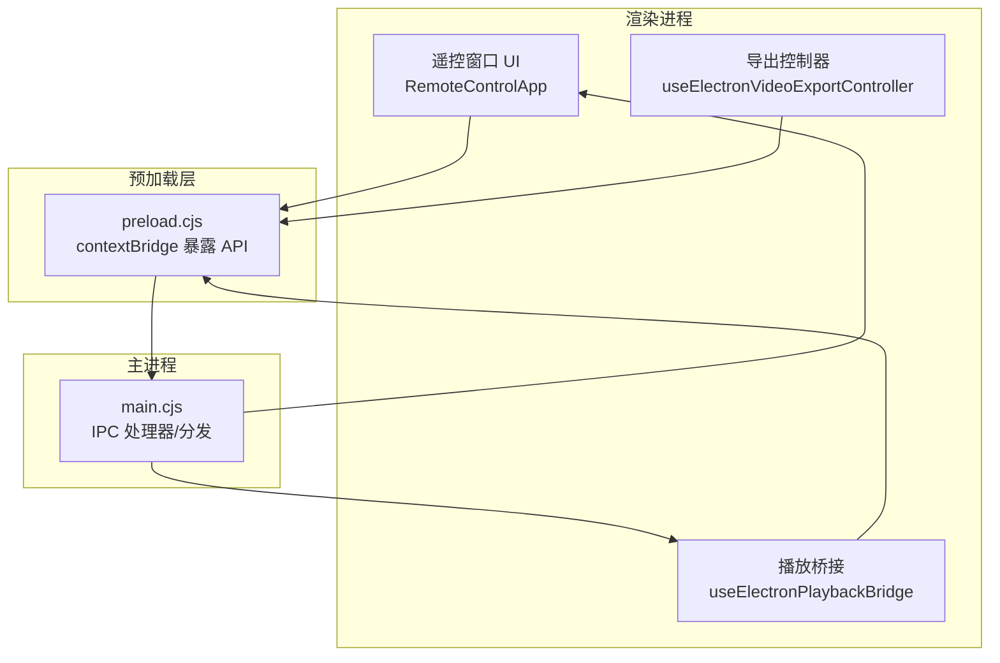
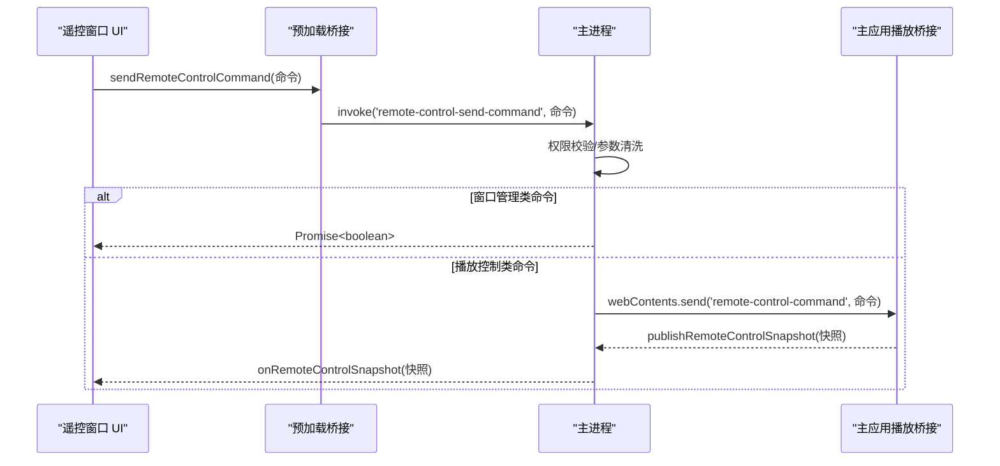
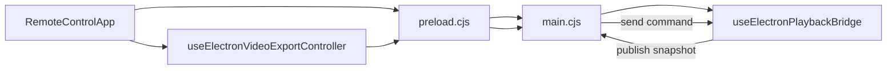

# 消息路由

<cite>
**本文引用的文件**
- [electron/main.cjs](file://electron/main.cjs)
- [electron/preload.cjs](file://electron/preload.cjs)
- [src/types/remoteControl.ts](file://src/types/remoteControl.ts)
- [src/components/remote/RemoteControlApp.tsx](file://src/components/remote/RemoteControlApp.tsx)
- [src/hooks/useElectronPlaybackBridge.ts](file://src/hooks/useElectronPlaybackBridge.ts)
- [src/hooks/useElectronVideoExportController.ts](file://src/hooks/useElectronVideoExportController.ts)
- [src/types/videoExport.ts](file://src/types/videoExport.ts)
</cite>

## 目录
1. [简介](#简介)
2. [项目结构](#项目结构)
3. [核心组件](#核心组件)
4. [架构总览](#架构总览)
5. [详细组件分析](#详细组件分析)
6. [依赖关系分析](#依赖关系分析)
7. [性能考量](#性能考量)
8. [故障排查指南](#故障排查指南)
9. [结论](#结论)
10. [附录：协议与调试](#附录协议与调试)

## 简介
本技术文档聚焦 Folia Player 的“远程控制消息路由”机制，围绕 Electron 主进程、渲染进程（含遥控窗口）之间的 IPC 通信展开。内容涵盖控制命令的发送、接收、分发、参数校验、响应处理；异步消息处理（Promise、超时、错误传播）；以及消息序列化/反序列化的类型契约。同时提供完整的消息协议参考与调试建议，帮助读者快速定位问题并扩展功能。

## 项目结构
远程控制由以下关键部分组成：
- 类型定义：集中声明遥控命令、快照等数据结构，保证跨进程数据一致性。
- 预加载脚本：在渲染进程暴露安全的桥接 API，封装 ipcRenderer 调用。
- 主进程：注册 IPC 处理器，负责权限校验、命令分发、状态广播与窗口管理。
- 遥控窗口 UI：订阅快照、发送命令、驱动导出流程。
- 播放桥接：在主应用侧消费远程命令，执行播放控制、进度跳转等操作。
- 导出控制器：在遥控窗口侧协调录制、写入、状态回推。

图表来源
- [electron/preload.cjs:212-230](file://electron/preload.cjs#L212-L230)
- [electron/main.cjs:5036-5176](file://electron/main.cjs#L5036-L5176)
- [src/components/remote/RemoteControlApp.tsx:42-44](file://src/components/remote/RemoteControlApp.tsx#L42-L44)
- [src/hooks/useElectronPlaybackBridge.ts:613-637](file://src/hooks/useElectronPlaybackBridge.ts#L613-L637)
- [src/hooks/useElectronVideoExportController.ts:292-309](file://src/hooks/useElectronVideoExportController.ts#L292-L309)

章节来源
- [electron/preload.cjs:212-230](file://electron/preload.cjs#L212-L230)
- [electron/main.cjs:5036-5176](file://electron/main.cjs#L5036-L5176)
- [src/components/remote/RemoteControlApp.tsx:42-44](file://src/components/remote/RemoteControlApp.tsx#L42-L44)
- [src/hooks/useElectronPlaybackBridge.ts:613-637](file://src/hooks/useElectronPlaybackBridge.ts#L613-L637)
- [src/hooks/useElectronVideoExportController.ts:292-309](file://src/hooks/useElectronVideoExportController.ts#L292-L309)

## 核心组件
- 遥控命令与快照类型：统一的数据契约，覆盖播放控制、窗口管理、导出控制等。
- 预加载桥接：将 ipcRenderer.invoke/on 封装为 window.electron.* 方法，屏蔽底层细节。
- 主进程分发器：对命令进行白名单校验、安全校验、参数清洗与业务分发。
- 遥控窗口：订阅快照、触发命令、展示导出面板。
- 播放桥接：消费远程命令，执行 seek、play/pause、切歌等。
- 导出控制器：在遥控窗口内编排录制生命周期，并通过 IPC 与主进程协作。

章节来源
- [src/types/remoteControl.ts:17-79](file://src/types/remoteControl.ts#L17-L79)
- [electron/preload.cjs:212-230](file://electron/preload.cjs#L212-L230)
- [electron/main.cjs:5126-5176](file://electron/main.cjs#L5126-L5176)
- [src/components/remote/RemoteControlApp.tsx:191-224](file://src/components/remote/RemoteControlApp.tsx#L191-L224)
- [src/hooks/useElectronPlaybackBridge.ts:613-637](file://src/hooks/useElectronPlaybackBridge.ts#L613-L637)
- [src/hooks/useElectronVideoExportController.ts:292-309](file://src/hooks/useElectronVideoExportController.ts#L292-L309)

## 架构总览
远程控制采用“命令 + 快照”的双向通道：
- 命令流：遥控窗口 → 预加载 → 主进程 → 主应用播放桥接（或主进程直接操作窗口）。
- 快照流：主应用 → 主进程 → 遥控窗口（推送式），用于刷新 UI 和联动行为。

图表来源
- [electron/preload.cjs:212-230](file://electron/preload.cjs#L212-L230)
- [electron/main.cjs:5126-5176](file://electron/main.cjs#L5126-L5176)
- [src/hooks/useElectronPlaybackBridge.ts:613-637](file://src/hooks/useElectronPlaybackBridge.ts#L613-L637)

## 详细组件分析

### 遥控命令与快照类型
- 遥控命令 RemoteControlCommand：联合类型，包含播放控制（play/pause/seek/previous/next）、循环模式切换、窗口管理（resize-main-window、set-main-window-border-visible、set-main-window-click-through、set-main-window-always-on-top、透明模式开关）、导出控制（open-export/start-export/stop-export/cancel-export）、收藏切换（toggle-like）等。
- 快照 RemoteControlSnapshot：描述当前播放态、可导航性、过渡信息、窗口状态、导出状态、歌词信息等，供遥控窗口高频刷新。

章节来源
- [src/types/remoteControl.ts:17-79](file://src/types/remoteControl.ts#L17-L79)
- [src/types/videoExport.ts:3-38](file://src/types/videoExport.ts#L3-L38)

### 预加载桥接（渲染 ↔ 主进程）
- 暴露 sendRemoteControlCommand、onRemoteControlCommand、onRemoteControlSnapshot 等方法，使用 ipcRenderer.invoke/on 实现请求-响应与事件推送。
- 通过 contextBridge 限制渲染进程直接访问 Node/Electron API，提升安全性。

章节来源
- [electron/preload.cjs:212-230](file://electron/preload.cjs#L212-L230)

### 主进程分发器（命令路由与安全）
- 打开/关闭/置顶遥控窗口：受信任来源校验，创建/销毁窗口，维护 alwaysOnTop 状态。
- 发布/读取快照：仅允许可信来源写入最新快照，并向所有遥控窗口推送。
- 命令分发：
  - 窗口管理类命令直接在主进程执行（如点击穿透、置顶、透明模式、尺寸调整）。
  - 播放控制类命令通过 webContents.send('remote-control-command', command) 转发到主应用。
- 参数校验：对 resize-main-window 的尺寸进行清洗与边界检查，避免非法值影响布局。

章节来源
- [electron/main.cjs:5036-5176](file://electron/main.cjs#L5036-L5176)

### 遥控窗口 UI（RemoteControlApp）
- 启动时拉取快照并订阅快照推送，合并歌词字段，保持 UI 与主应用一致。
- 用户交互（播放、切歌、拖动进度条、切换背景/置顶、导出面板）均转化为命令发送。
- 导出面板根据 exportState 自动切换到导出视图，并在完成/错误后延时复位。

章节来源
- [src/components/remote/RemoteControlApp.tsx:191-224](file://src/components/remote/RemoteControlApp.tsx#L191-L224)
- [src/components/remote/RemoteControlApp.tsx:954-1004](file://src/components/remote/RemoteControlApp.tsx#L954-L1004)

### 播放桥接（useElectronPlaybackBridge）
- 监听 'remote-control-command'，按命令类型执行：
  - seek：校验时间范围，优先走过渡感知路径（取消混音并回到可见轨道），否则直接设置 currentTime。
  - 其他播放控制：交由上层播放控制器处理。
- 每次变更后调用 publishRemoteControlSnapshot 更新快照，确保遥控窗口同步。

章节来源
- [src/hooks/useElectronPlaybackBridge.ts:613-637](file://src/hooks/useElectronPlaybackBridge.ts#L613-L637)

### 导出控制器（useElectronVideoExportController）
- 处理 start-export/stop-export/cancel-export 命令，编排准备、倒计时、录制、收尾、写盘流程。
- 完成后延时重置状态，避免 UI 长期停留在终态。
- 与主进程协作选择保存路径、写入文件。

章节来源
- [src/hooks/useElectronVideoExportController.ts:292-309](file://src/hooks/useElectronVideoExportController.ts#L292-L309)
- [src/types/videoExport.ts:3-38](file://src/types/videoExport.ts#L3-L38)

### 窗口管理与透明模式
- set-main-window-click-through / set-main-window-always-on-top / set-transparent-mode-enabled / disable-transparent-mode：主进程直接修改主窗口属性，返回布尔结果。
- resize-main-window：清洗宽高，必要时退出全屏/最大化，适配导出尺寸。

章节来源
- [electron/main.cjs:5126-5176](file://electron/main.cjs#L5126-L5176)

## 依赖关系分析
- 遥控窗口依赖预加载桥接发送命令与订阅快照。
- 主进程依赖类型定义解析命令，依赖主应用播放桥接执行播放逻辑。
- 播放桥接依赖导出控制器（间接）与窗口状态（通过快照）。
- 导出控制器依赖主进程的导出相关 IPC（选择路径、写入文件）。

图表来源
- [electron/preload.cjs:212-230](file://electron/preload.cjs#L212-L230)
- [electron/main.cjs:5126-5176](file://electron/main.cjs#L5126-L5176)
- [src/components/remote/RemoteControlApp.tsx:191-224](file://src/components/remote/RemoteControlApp.tsx#L191-L224)
- [src/hooks/useElectronPlaybackBridge.ts:613-637](file://src/hooks/useElectronPlaybackBridge.ts#L613-L637)
- [src/hooks/useElectronVideoExportController.ts:292-309](file://src/hooks/useElectronVideoExportController.ts#L292-L309)

章节来源
- [electron/preload.cjs:212-230](file://electron/preload.cjs#L212-L230)
- [electron/main.cjs:5126-5176](file://electron/main.cjs#L5126-L5176)
- [src/components/remote/RemoteControlApp.tsx:191-224](file://src/components/remote/RemoteControlApp.tsx#L191-L224)
- [src/hooks/useElectronPlaybackBridge.ts:613-637](file://src/hooks/useElectronPlaybackBridge.ts#L613-L637)
- [src/hooks/useElectronVideoExportController.ts:292-309](file://src/hooks/useElectronVideoExportController.ts#L292-L309)

## 性能考量
- 快照推送频率：主应用变更后立即发布快照，遥控窗口增量合并，避免全量重绘。
- 参数清洗：主进程对尺寸等数值型参数做边界约束，减少无效计算与布局抖动。
- 过渡感知 seek：在混音期间优先取消过渡并回到可见轨道，避免误操作导致听感异常。
- 导出状态自动复位：完成/错误后延时复位，降低 UI 常驻状态带来的内存占用。

[本节为通用指导，不直接分析具体文件]

## 故障排查指南
- 权限错误：若出现“不受信任的渲染进程尝试操作”，检查调用方是否来自受信任来源（主窗口或遥控窗口）。
- 命令未生效：确认主进程已正确分发到主应用播放桥接，且播放桥接已发布新快照。
- 窗口尺寸异常：检查 resize-main-window 的参数是否被清洗，是否存在全屏/最大化冲突。
- 导出失败：查看导出状态是否为 error，核对文件路径选择与写入 IPC 是否成功。

章节来源
- [electron/main.cjs:5036-5176](file://electron/main.cjs#L5036-L5176)
- [src/hooks/useElectronPlaybackBridge.ts:613-637](file://src/hooks/useElectronPlaybackBridge.ts#L613-L637)
- [src/hooks/useElectronVideoExportController.ts:292-309](file://src/hooks/useElectronVideoExportController.ts#L292-L309)

## 结论
Folia Player 的远程控制通过“命令 + 快照”的清晰分层实现了高内聚、低耦合的消息路由。主进程承担安全校验与分发职责，渲染进程专注交互与状态呈现，播放桥接负责具体业务执行。该设计便于扩展新命令、增强参数校验、优化异步处理与错误传播，并为调试提供了明确的断点与日志位置。

[本节为总结性内容，不直接分析具体文件]

## 附录：协议与调试

### 消息协议参考
- 遥控命令 RemoteControlCommand（节选）
  - 播放控制：play-pause、play、pause、previous、next、seek(time)、cycle-loop-mode、toggle-like
  - 窗口管理：resize-main-window(width, height)、set-main-window-border-visible(visible)、set-main-window-click-through(enabled)、set-main-window-always-on-top(enabled)、set-transparent-mode-enabled(enabled)、disable-transparent-mode、cycle-player-chrome-visibility-mode
  - 导出控制：open-export、start-export(preset, startMode)、stop-export、cancel-export
- 快照 RemoteControlSnapshot（节选）
  - 播放态：hasTrack、trackKey、title、artist、coverUrl、currentTime、duration、playerState、loopMode、canGoPrevious、canGoNext、trackTransition、controlsDisabled、isStageActive
  - 窗口态：transparentModeEnabled、mainWindowClickThroughEnabled、mainWindowAlwaysOnTop、mainWindowBorderVisible、playerChromeHidden、playerChromeVisibilityMode、mainWindowWidth、mainWindowHeight
  - 导出态：exportState
  - 歌词与偏好：lyrics、lyricOffsetMs、isLiked、canLike、likeUnavailableProvider、updatedAt、isDaylight

章节来源
- [src/types/remoteControl.ts:17-79](file://src/types/remoteControl.ts#L17-L79)
- [src/types/videoExport.ts:3-38](file://src/types/videoExport.ts#L3-L38)

### 调试工具与步骤
- 启用/关闭遥控窗口：通过主进程 IPC 打开/切换/关闭遥控窗口，观察窗口标题与状态。
- 订阅快照：在遥控窗口中订阅 onRemoteControlSnapshot，打印快照变化以验证数据一致性。
- 发送命令：从遥控窗口发送命令，观察主进程分发与主应用播放桥接的执行结果。
- 导出流程：在遥控窗口中选择预设并启动导出，跟踪 prepare/countdown/recording/finalizing/done/error 状态流转。

章节来源
- [electron/main.cjs:5036-5176](file://electron/main.cjs#L5036-L5176)
- [src/components/remote/RemoteControlApp.tsx:191-224](file://src/components/remote/RemoteControlApp.tsx#L191-L224)
- [src/hooks/useElectronVideoExportController.ts:292-309](file://src/hooks/useElectronVideoExportController.ts#L292-L309)