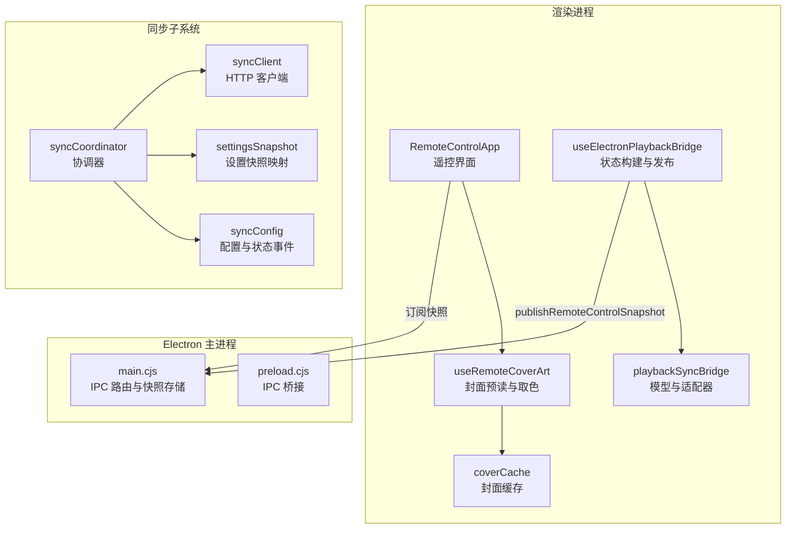
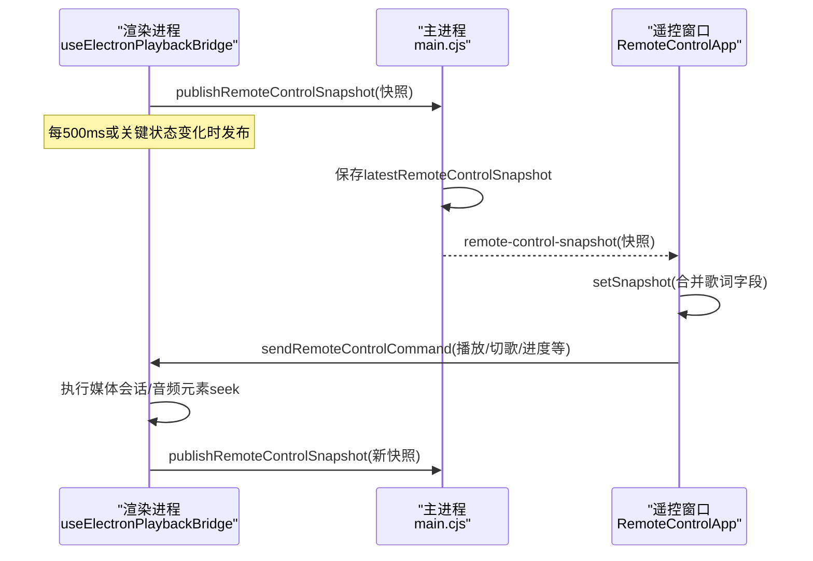
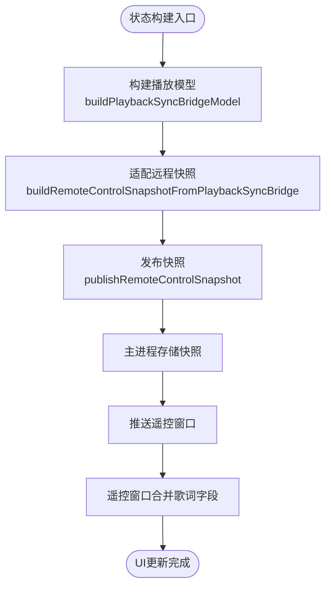
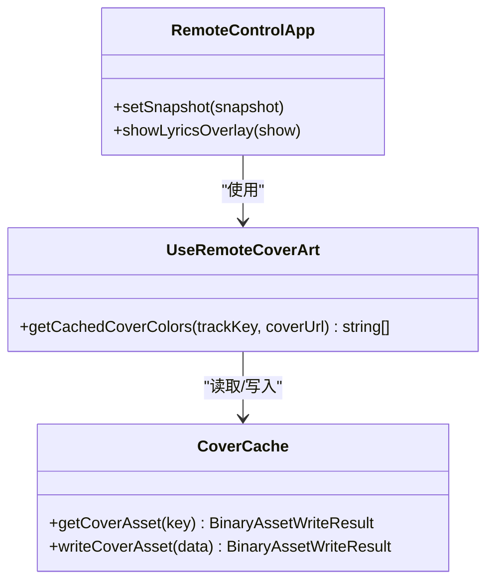
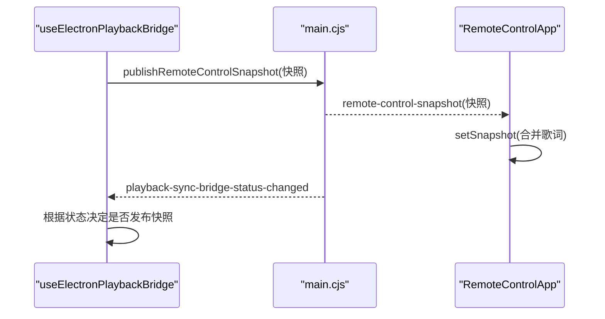
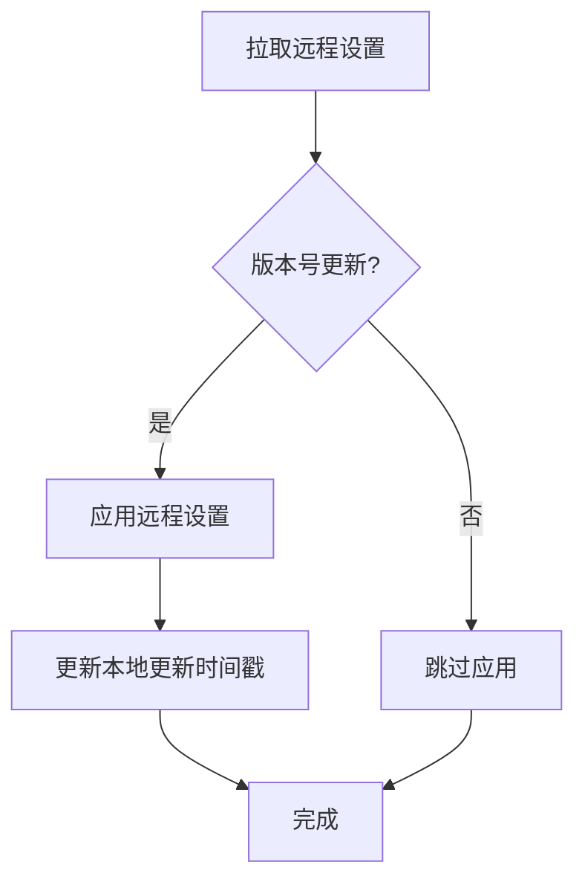
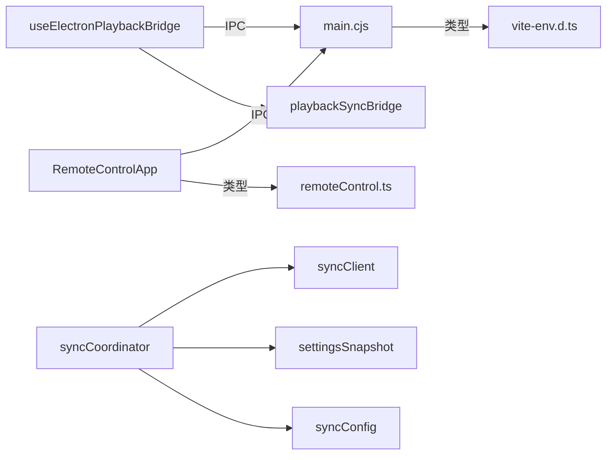

# 状态同步

<cite>
**本文引用的文件**
- [RemoteControlApp.tsx](file://src/components/remote/RemoteControlApp.tsx)
- [useElectronPlaybackBridge.ts](file://src/hooks/useElectronPlaybackBridge.ts)
- [playbackSyncBridge.ts](file://src/utils/playbackSyncBridge.ts)
- [remoteControl.ts](file://src/types/remoteControl.ts)
- [vite-env.d.ts](file://src/vite-env.d.ts)
- [main.cjs](file://electron/main.cjs)
- [preload.cjs](file://electron/preload.cjs)
- [syncCoordinator.ts](file://src/services/sync/syncCoordinator.ts)
- [syncClient.ts](file://src/services/sync/syncClient.ts)
- [settingsSnapshot.ts](file://src/services/sync/settingsSnapshot.ts)
- [syncConfig.ts](file://src/services/sync/syncConfig.ts)
- [coverCache.ts](file://src/services/coverCache.ts)
- [useRemoteCoverArt.ts](file://src/components/remote/useRemoteCoverArt.ts)
</cite>

## 目录
1. [简介](#简介)
2. [项目结构](#项目结构)
3. [核心组件](#核心组件)
4. [架构总览](#架构总览)
5. [详细组件分析](#详细组件分析)
6. [依赖关系分析](#依赖关系分析)
7. [性能考虑](#性能考虑)
8. [故障排查指南](#故障排查指南)
9. [结论](#结论)
10. [附录：API参考与集成示例](#附录api参考与集成示例)

## 简介
本技术文档聚焦 Folia Player 的“远程控制”与“状态同步”机制，围绕以下目标展开：
- 实时同步播放状态、歌词信息、封面图片等数据到远程窗口（或外部控制端）
- 说明状态快照机制：增量更新、全量同步、冲突解决策略
- 解释订阅模式：事件监听、变更通知、批量更新优化
- 保障状态一致性：数据完整性、版本控制、回滚机制
- 缓存策略与性能优化：确保远程控制流畅体验
- 提供状态同步 API 参考与集成示例

## 项目结构
本项目在 Electron 主进程与渲染进程之间通过 IPC 传递“遥控器快照”，并在渲染侧以固定频率发布最新状态。同时，项目内置一套跨设备/跨实例的“设置与主题同步”子系统，用于配置与视觉设置的增量同步与合并。

**图表来源**
- [RemoteControlApp.tsx:191-224](file://src/components/remote/RemoteControlApp.tsx#L191-L224)
- [useElectronPlaybackBridge.ts:488-525](file://src/hooks/useElectronPlaybackBridge.ts#L488-L525)
- [playbackSyncBridge.ts:185-218](file://src/utils/playbackSyncBridge.ts#L185-L218)
- [main.cjs:5097-5114](file://electron/main.cjs#L5097-L5114)
- [preload.cjs:212-222](file://electron/preload.cjs#L212-L222)
- [syncCoordinator.ts:95-149](file://src/services/sync/syncCoordinator.ts#L95-L149)
- [syncClient.ts:38-62](file://src/services/sync/syncClient.ts#L38-L62)
- [settingsSnapshot.ts:51-58](file://src/services/sync/settingsSnapshot.ts#L51-L58)
- [syncConfig.ts:82-110](file://src/services/sync/syncConfig.ts#L82-L110)

**章节来源**
- [RemoteControlApp.tsx:191-224](file://src/components/remote/RemoteControlApp.tsx#L191-L224)
- [useElectronPlaybackBridge.ts:488-525](file://src/hooks/useElectronPlaybackBridge.ts#L488-L525)
- [main.cjs:5097-5114](file://electron/main.cjs#L5097-L5114)
- [preload.cjs:212-222](file://electron/preload.cjs#L212-L222)
- [syncCoordinator.ts:95-149](file://src/services/sync/syncCoordinator.ts#L95-L149)
- [syncClient.ts:38-62](file://src/services/sync/syncClient.ts#L38-L62)
- [settingsSnapshot.ts:51-58](file://src/services/sync/settingsSnapshot.ts#L51-L58)
- [syncConfig.ts:82-110](file://src/services/sync/syncConfig.ts#L82-L110)

## 核心组件
- 遥控界面 RemoteControlApp：订阅主进程推送的快照，驱动 UI 展示与用户操作；支持封面背景、歌词覆盖层、导出面板等。
- 播放桥 useElectronPlaybackBridge：将当前播放上下文、队列、时间轴、封面、歌词等信息构造成统一模型，并周期性发布为远程快照。
- 播放同步适配 playbackSyncBridge：从内部状态生成可被多端消费的模型，并适配为远程快照、任务栏控制、Discord 状态等。
- 类型定义 remoteControl.ts：定义 RemoteControlCommand 与 RemoteControlSnapshot，作为遥控通道契约。
- Electron 主进程 main.cjs：维护 latestRemoteControlSnapshot，处理 IPC 命令，向遥控窗口推送快照。
- 预加载脚本 preload.cjs：暴露 IPC 方法给渲染进程使用。
- 同步子系统 syncCoordinator/syncClient/settingsSnapshot/syncConfig：负责设置与主题的拉取/推送、增量对比、应用与事件通知。

**章节来源**
- [remoteControl.ts:17-79](file://src/types/remoteControl.ts#L17-L79)
- [useElectronPlaybackBridge.ts:233-303](file://src/hooks/useElectronPlaybackBridge.ts#L233-L303)
- [playbackSyncBridge.ts:105-151](file://src/utils/playbackSyncBridge.ts#L105-L151)
- [main.cjs:5097-5114](file://electron/main.cjs#L5097-L5114)
- [preload.cjs:212-222](file://electron/preload.cjs#L212-L222)
- [syncCoordinator.ts:95-149](file://src/services/sync/syncCoordinator.ts#L95-L149)
- [syncClient.ts:38-62](file://src/services/sync/syncClient.ts#L38-L62)
- [settingsSnapshot.ts:51-58](file://src/services/sync/settingsSnapshot.ts#L51-L58)
- [syncConfig.ts:82-110](file://src/services/sync/syncConfig.ts#L82-L110)

## 架构总览
远程控制状态同步采用“渲染进程定时发布 + 主进程广播 + 遥控窗口订阅”的模式。播放状态、歌词、封面、队列邻居、过渡信息等被打包进 RemoteControlSnapshot，通过 IPC 推送到遥控窗口。同步子系统则独立于播放流，负责设置与主题的跨实例同步。

**图表来源**
- [useElectronPlaybackBridge.ts:488-525](file://src/hooks/useElectronPlaybackBridge.ts#L488-L525)
- [main.cjs:5097-5114](file://electron/main.cjs#L5097-L5114)
- [RemoteControlApp.tsx:191-224](file://src/components/remote/RemoteControlApp.tsx#L191-L224)
- [RemoteControlApp.tsx:42-44](file://src/components/remote/RemoteControlApp.tsx#L42-L44)

## 详细组件分析

### 播放状态快照与增量更新
- 渲染进程通过 useElectronPlaybackBridge 构建 PlaybackSyncBridgeModel，再适配为 RemoteControlSnapshot，包含当前曲目、队列邻居、播放状态、时间轴、封面、歌词、过渡信息等。
- 主进程维护 latestRemoteControlSnapshot，并通过 IPC 事件 remote-control-snapshot 推送至遥控窗口。
- 遥控窗口收到快照后合并歌词字段，避免丢失历史歌词。

**图表来源**
- [useElectronPlaybackBridge.ts:233-303](file://src/hooks/useElectronPlaybackBridge.ts#L233-L303)
- [playbackSyncBridge.ts:185-218](file://src/utils/playbackSyncBridge.ts#L185-L218)
- [main.cjs:5097-5114](file://electron/main.cjs#L5097-L5114)
- [RemoteControlApp.tsx:191-224](file://src/components/remote/RemoteControlApp.tsx#L191-L224)

**章节来源**
- [useElectronPlaybackBridge.ts:233-303](file://src/hooks/useElectronPlaybackBridge.ts#L233-L303)
- [playbackSyncBridge.ts:185-218](file://src/utils/playbackSyncBridge.ts#L185-L218)
- [main.cjs:5097-5114](file://electron/main.cjs#L5097-L5114)
- [RemoteControlApp.tsx:191-224](file://src/components/remote/RemoteControlApp.tsx#L191-L224)

### 歌词信息与封面图片更新策略
- 歌词：快照中包含 lyrics 字段，遥控窗口在接收时进行合并，保证歌词不丢失；封面 URL 来自当前曲目与缓存，配合 coverCache 与 useRemoteCoverArt 实现预读与取色。
- 封面：useRemoteCoverArt 按曲目标识缓存取色结果，提前解码邻居封面，切换时背景与封面同帧到位；coverCache 对特定域名走代理以提升兼容性。

**图表来源**
- [RemoteControlApp.tsx:191-224](file://src/components/remote/RemoteControlApp.tsx#L191-L224)
- [useRemoteCoverArt.ts:1-30](file://src/components/remote/useRemoteCoverArt.ts#L1-L30)
- [coverCache.ts:1-37](file://src/services/coverCache.ts#L1-L37)

**章节来源**
- [RemoteControlApp.tsx:191-224](file://src/components/remote/RemoteControlApp.tsx#L191-L224)
- [useRemoteCoverArt.ts:1-30](file://src/components/remote/useRemoteCoverArt.ts#L1-L30)
- [coverCache.ts:1-37](file://src/services/coverCache.ts#L1-L37)

### 状态订阅模式与批量更新
- 事件监听：主进程通过 IPC 事件 remote-control-snapshot 推送快照；遥控窗口通过 onRemoteControlSnapshot 订阅。
- 批量更新：渲染进程每 500ms 发布一次快照，或在关键状态变化（如封面、歌词、导出状态）时立即发布；遥控窗口合并歌词字段，减少重绘。
- 状态变更通知：主进程还广播 playback-sync-bridge-status-changed，告知遥控窗口是否打开及 Discord 状态开关。

**图表来源**
- [useElectronPlaybackBridge.ts:471-486](file://src/hooks/useElectronPlaybackBridge.ts#L471-L486)
- [useElectronPlaybackBridge.ts:488-525](file://src/hooks/useElectronPlaybackBridge.ts#L488-L525)
- [main.cjs:1016-1027](file://electron/main.cjs#L1016-L1027)
- [RemoteControlApp.tsx:191-224](file://src/components/remote/RemoteControlApp.tsx#L191-L224)

**章节来源**
- [useElectronPlaybackBridge.ts:471-486](file://src/hooks/useElectronPlaybackBridge.ts#L471-L486)
- [useElectronPlaybackBridge.ts:488-525](file://src/hooks/useElectronPlaybackBridge.ts#L488-L525)
- [main.cjs:1016-1027](file://electron/main.cjs#L1016-L1027)
- [RemoteControlApp.tsx:191-224](file://src/components/remote/RemoteControlApp.tsx#L191-L224)

### 状态一致性保证：数据完整性、版本控制、回滚机制
- 数据完整性：RemoteControlSnapshot 包含 trackKey、prev/nextTrackKey、playerState、currentTime、duration、lyrics、exportState 等关键字段；主进程在接收快照时保留歌词字段，避免丢失。
- 版本控制：同步子系统使用 schemaVersion 与 updatedAt 标记设置快照，pullRemoteVisualSettings 仅在新版本时应用；import/export 也携带 schemaVersion。
- 回滚机制：applySyncedVisualSettings 对每个字段做条件赋值，未提供的字段保持原值；错误路径中 setSyncStatus 记录 lastError，便于恢复。

**图表来源**
- [syncCoordinator.ts:65-83](file://src/services/sync/syncCoordinator.ts#L65-L83)
- [settingsSnapshot.ts:51-58](file://src/services/sync/settingsSnapshot.ts#L51-L58)
- [syncCoordinator.ts:179-214](file://src/services/sync/syncCoordinator.ts#L179-L214)

**章节来源**
- [syncCoordinator.ts:65-83](file://src/services/sync/syncCoordinator.ts#L65-L83)
- [settingsSnapshot.ts:51-58](file://src/services/sync/settingsSnapshot.ts#L51-L58)
- [syncCoordinator.ts:179-214](file://src/services/sync/syncCoordinator.ts#L179-L214)

### 冲突解决策略
- 设置同步：基于 updatedAt 比较，仅当远程设置更新时才应用；本地修改会更新本地时间戳，避免覆盖。
- 主题同步：通过指纹与桶（bucket）机制增量上传/下载缺失主题，避免重复传输。
- 播放快照：主进程保留 latestRemoteControlSnapshot，遥控窗口合并歌词字段，避免覆盖导致的信息丢失。

**章节来源**
- [syncCoordinator.ts:95-149](file://src/services/sync/syncCoordinator.ts#L95-L149)
- [syncClient.ts:87-133](file://src/services/sync/syncClient.ts#L87-L133)
- [main.cjs:5097-5114](file://electron/main.cjs#L5097-L5114)

### 状态缓存策略与性能优化
- 封面缓存：coverCache 将封面写入二进制资产存储，并按域名走代理提升兼容性；useRemoteCoverArt 按曲目标识缓存取色结果，限制缓存上限，避免内存泄漏。
- 快照发布：渲染进程每 500ms 发布一次快照，resize 时额外发布；DPR 变化时报告主进程，避免不必要的 IPC 往返。
- 歌词与过渡：仅在 audible transition 期间发布 trackTransition，减少无关数据；遥控窗口延迟显示歌词覆盖层，降低频繁交互导致的重绘。

**章节来源**
- [coverCache.ts:1-37](file://src/services/coverCache.ts#L1-L37)
- [useRemoteCoverArt.ts:1-30](file://src/components/remote/useRemoteCoverArt.ts#L1-L30)
- [useElectronPlaybackBridge.ts:488-525](file://src/hooks/useElectronPlaybackBridge.ts#L488-L525)
- [RemoteControlApp.tsx:151-162](file://src/components/remote/RemoteControlApp.tsx#L151-L162)

## 依赖关系分析
- 遥控窗口依赖主进程的 IPC 事件与命令；渲染进程通过 useElectronPlaybackBridge 构建快照并发布。
- 同步子系统依赖 HTTP 客户端与设置快照映射，协调器统一管理拉取/推送与应用流程。
- 类型定义 remoteControl.ts 与 vite-env.d.ts 定义了 IPC 接口与快照结构，确保前后端一致。

**图表来源**
- [RemoteControlApp.tsx:191-224](file://src/components/remote/RemoteControlApp.tsx#L191-L224)
- [useElectronPlaybackBridge.ts:488-525](file://src/hooks/useElectronPlaybackBridge.ts#L488-L525)
- [playbackSyncBridge.ts:185-218](file://src/utils/playbackSyncBridge.ts#L185-L218)
- [syncCoordinator.ts:95-149](file://src/services/sync/syncCoordinator.ts#L95-L149)
- [syncClient.ts:38-62](file://src/services/sync/syncClient.ts#L38-L62)
- [settingsSnapshot.ts:51-58](file://src/services/sync/settingsSnapshot.ts#L51-L58)
- [syncConfig.ts:82-110](file://src/services/sync/syncConfig.ts#L82-L110)
- [remoteControl.ts:17-79](file://src/types/remoteControl.ts#L17-L79)
- [vite-env.d.ts:137-175](file://src/vite-env.d.ts#L137-L175)

**章节来源**
- [RemoteControlApp.tsx:191-224](file://src/components/remote/RemoteControlApp.tsx#L191-L224)
- [useElectronPlaybackBridge.ts:488-525](file://src/hooks/useElectronPlaybackBridge.ts#L488-L525)
- [playbackSyncBridge.ts:185-218](file://src/utils/playbackSyncBridge.ts#L185-L218)
- [syncCoordinator.ts:95-149](file://src/services/sync/syncCoordinator.ts#L95-L149)
- [syncClient.ts:38-62](file://src/services/sync/syncClient.ts#L38-L62)
- [settingsSnapshot.ts:51-58](file://src/services/sync/settingsSnapshot.ts#L51-L58)
- [syncConfig.ts:82-110](file://src/services/sync/syncConfig.ts#L82-L110)
- [remoteControl.ts:17-79](file://src/types/remoteControl.ts#L17-L79)
- [vite-env.d.ts:137-175](file://src/vite-env.d.ts#L137-L175)

## 性能考虑
- 快照发布频率：500ms 间隔平衡了实时性与 IPC 开销；关键状态变化时立即发布，避免 UI 卡顿。
- 封面预读与取色：按曲目标识缓存，限制缓存上限，避免 blob URL 长期占用内存；特定域名走代理提升加载稳定性。
- 歌词覆盖层：延迟显示，减少频繁交互导致的重绘；合并歌词字段，避免覆盖丢失。
- DPR 报告：仅在变化时报告主进程，减少不必要 IPC。

[本节为通用性能指导，无需具体文件引用]

## 故障排查指南
- 遥控窗口无法接收快照：检查主进程是否创建遥控窗口，以及 IPC 事件是否正确绑定；确认 latestRemoteControlSnapshot 已更新。
- 歌词不更新：确认渲染进程发布快照时 includeLyrics=true；遥控窗口合并逻辑是否生效。
- 设置同步失败：检查 syncConfig 是否配置正确，网络请求是否成功；查看 lastError 与状态事件。
- 封面加载异常：检查 coverCache 是否写入成功，代理域名是否正确；确认 useRemoteCoverArt 缓存命中。

**章节来源**
- [main.cjs:5097-5114](file://electron/main.cjs#L5097-L5114)
- [RemoteControlApp.tsx:191-224](file://src/components/remote/RemoteControlApp.tsx#L191-L224)
- [syncCoordinator.ts:95-149](file://src/services/sync/syncCoordinator.ts#L95-L149)
- [coverCache.ts:1-37](file://src/services/coverCache.ts#L1-L37)

## 结论
Folia Player 的远程控制状态同步通过“渲染进程定时发布 + 主进程广播 + 遥控窗口订阅”的架构，实现了播放状态、歌词、封面等数据的实时同步。同步子系统基于版本控制与增量机制，确保设置与主题的一致性。通过封面缓存、歌词合并、DPR 优化等手段，保障了流畅的用户体验。整体设计清晰、可扩展性强，适合多端/多实例场景下的状态管理。

[本节为总结性内容，无需具体文件引用]

## 附录：API参考与集成示例

### 遥控快照与命令
- RemoteControlSnapshot：包含 hasTrack、trackKey、title、artist、coverUrl、currentTime、duration、playerState、loopMode、canGoPrevious、canGoNext、prev/nextTrackKey、trackTransition、controlsDisabled、isStageActive、transparentModeEnabled、mainWindowClickThroughEnabled、mainWindowAlwaysOnTop、mainWindowBorderVisible、playerChromeHidden、playerChromeVisibilityMode、exportState、isDaylight、lyrics、isLiked、canLike、likeUnavailableProvider、updatedAt、mainWindowWidth、mainWindowHeight。
- RemoteControlCommand：包括 play-pause、play、pause、previous、next、seek、cycle-loop-mode、resize-main-window、set-main-window-border-visible、set-main-window-click-through、set-main-window-always-on-top、set-transparent-mode-enabled、disable-transparent-mode、cycle-player-chrome-visibility-mode、open-export、start-export、stop-export、cancel-export、toggle-like。

**章节来源**
- [remoteControl.ts:17-79](file://src/types/remoteControl.ts#L17-L79)
- [vite-env.d.ts:137-175](file://src/vite-env.d.ts#L137-L175)

### 集成示例
- 渲染进程发布快照：调用 window.electron.publishRemoteControlSnapshot(buildRemoteSnapshot(options))，options.includeLyrics 控制是否包含歌词。
- 遥控窗口订阅快照：window.electron.onRemoteControlSnapshot(callback)，在回调中合并歌词字段并更新 UI。
- 发送命令：window.electron.sendRemoteControlCommand(command)，command 类型为 RemoteControlCommand。

**章节来源**
- [useElectronPlaybackBridge.ts:488-525](file://src/hooks/useElectronPlaybackBridge.ts#L488-L525)
- [RemoteControlApp.tsx:191-224](file://src/components/remote/RemoteControlApp.tsx#L191-L224)
- [RemoteControlApp.tsx:42-44](file://src/components/remote/RemoteControlApp.tsx#L42-L44)
- [preload.cjs:212-222](file://electron/preload.cjs#L212-L222)

### 设置同步 API
- 初始化协调器：initializeSyncCoordinator()
- 手动同步：syncNow({ syncThemes?, applyRemoteSettings?, pushSettings? })
- 拉取远程设置：pullRemoteVisualSettings(remoteState?)
- 导出/导入：exportSyncLibraryBundle(), importSyncLibraryBundle(bundle, options?)
- 配置与状态：getSyncConfig(), isSyncConfigured(), subscribeSyncConfig(), subscribeSyncStatus()

**章节来源**
- [syncCoordinator.ts:50-54](file://src/services/sync/syncCoordinator.ts#L50-L54)
- [syncCoordinator.ts:95-149](file://src/services/sync/syncCoordinator.ts#L95-L149)
- [syncCoordinator.ts:152-214](file://src/services/sync/syncCoordinator.ts#L152-L214)
- [syncConfig.ts:82-110](file://src/services/sync/syncConfig.ts#L82-L110)