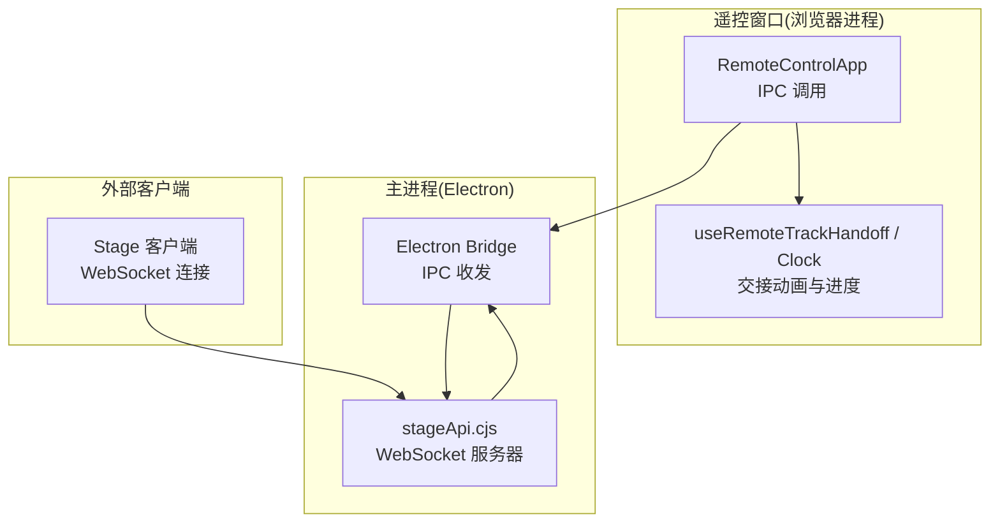
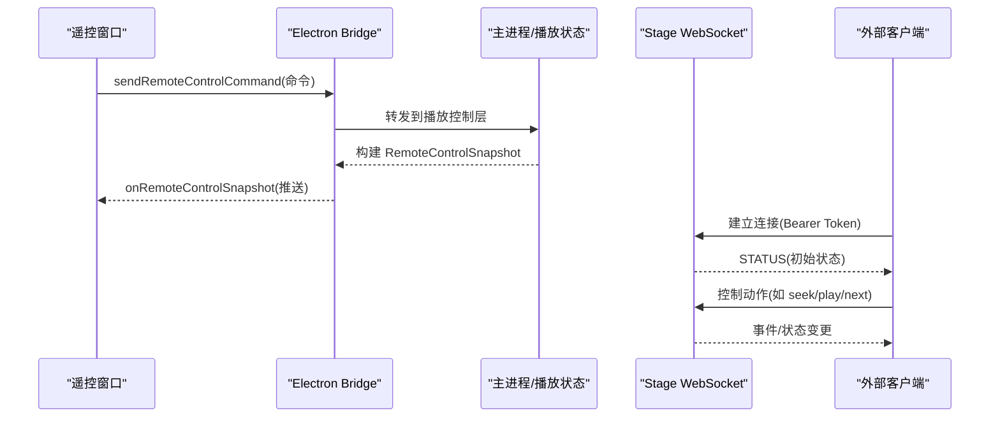
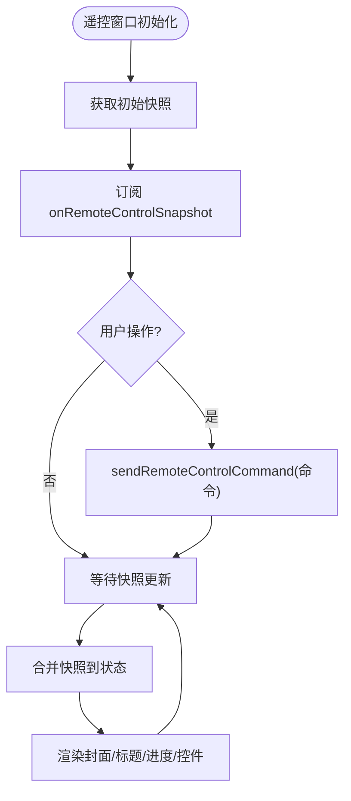
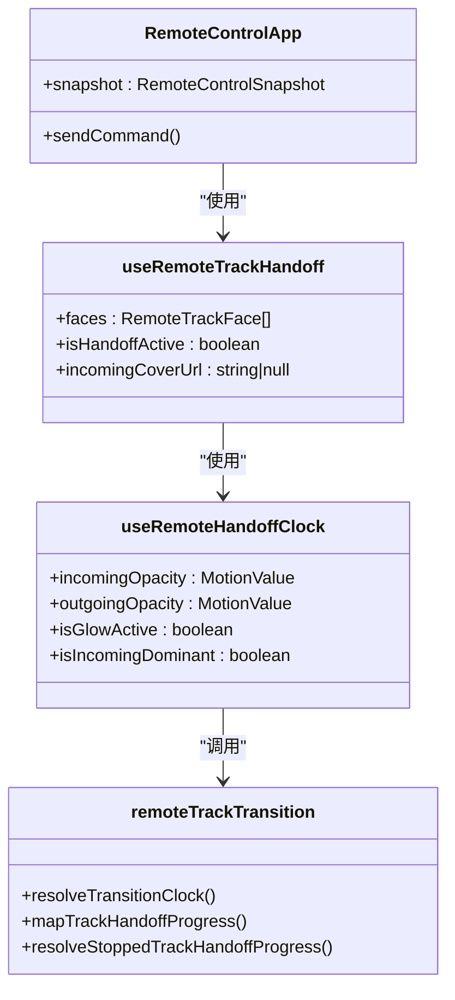
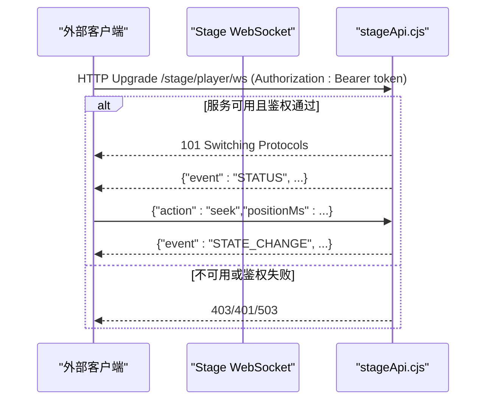
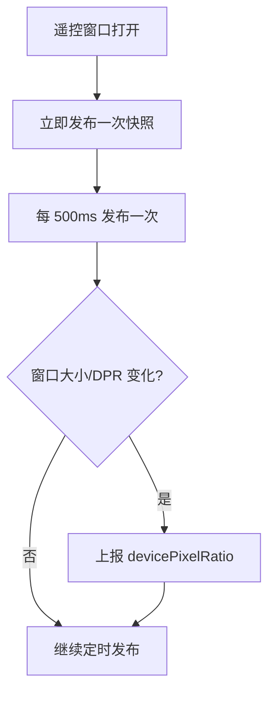
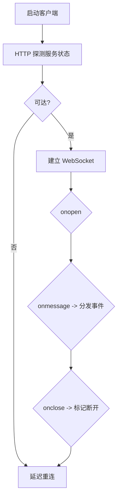
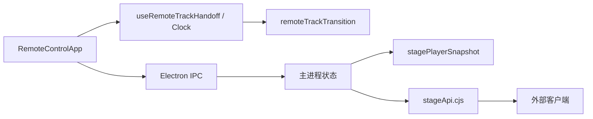

# 远程控制通信

<cite>
**本文引用的文件**
- [src/components/remote/RemoteControlApp.tsx](file://src/components/remote/RemoteControlApp.tsx)
- [src/components/remote/useRemoteTrackHandoff.ts](file://src/components/remote/useRemoteTrackHandoff.ts)
- [src/components/remote/useRemoteHandoffClock.ts](file://src/components/remote/useRemoteHandoffClock.ts)
- [src/components/remote/remoteTrackTransition.ts](file://src/components/remote/remoteTrackTransition.ts)
- [src/types/remoteControl.ts](file://src/types/remoteControl.ts)
- [electron/stageApi.cjs](file://electron/stageApi.cjs)
- [src/hooks/useElectronPlaybackBridge.ts](file://src/hooks/useElectronPlaybackBridge.ts)
- [src/utils/stagePlayerSnapshot.ts](file://src/utils/stagePlayerSnapshot.ts)
- [test/manual/stage-client/main.ts](file://test/manual/stage-client/main.ts)
- [src/services/playerCapProvider.ts](file://src/services/playerCapProvider.ts)
- [src/services/nowPlayingProvider.ts](file://src/services/nowPlayingProvider.ts)
</cite>

## 目录
1. [简介](#简介)
2. [项目结构](#项目结构)
3. [核心组件](#核心组件)
4. [架构总览](#架构总览)
5. [详细组件分析](#详细组件分析)
6. [依赖关系分析](#依赖关系分析)
7. [性能考虑](#性能考虑)
8. [故障排查指南](#故障排查指南)
9. [结论](#结论)
10. [附录：API参考与客户端集成](#附录api参考与客户端集成)

## 简介
本技术文档聚焦 Folia Player 的“远程控制”通信体系，覆盖 Electron 内嵌遥控窗口与主播放进程之间的 IPC 通信、Stage（舞台）模式的 WebSocket 控制通道、以及跨进程的实时状态同步。重点包括：
- 通信架构：IPC 快照订阅 + Stage WebSocket 事件广播/控制
- 消息路由：命令下发、状态快照推送、队列与播放控制
- 安全认证：Bearer Token 校验、服务可用性检查、连接拒绝策略
- 实时模式：双向通信、事件订阅、状态广播
- 连接管理：重连、断线处理、资源清理
- 性能优化：批量发布、节流、带宽与渲染优化
- API 参考与客户端集成指引

## 项目结构
远程控制由两部分组成：
- 遥控窗口 UI：React 组件通过 Electron IPC 向主进程发送控制命令，并订阅主进程的状态快照更新
- Stage 控制通道：基于 WebSocket 的远程接入点，支持外部客户端通过 Bearer Token 鉴权后对播放器进行控制与状态订阅

图表来源
- [src/components/remote/RemoteControlApp.tsx:191-224](file://src/components/remote/RemoteControlApp.tsx#L191-L224)
- [electron/stageApi.cjs:648-675](file://electron/stageApi.cjs#L648-L675)
- [src/hooks/useElectronPlaybackBridge.ts:488-518](file://src/hooks/useElectronPlaybackBridge.ts#L488-L518)

章节来源
- [src/components/remote/RemoteControlApp.tsx:191-224](file://src/components/remote/RemoteControlApp.tsx#L191-L224)
- [electron/stageApi.cjs:648-675](file://electron/stageApi.cjs#L648-L675)
- [src/hooks/useElectronPlaybackBridge.ts:488-518](file://src/hooks/useElectronPlaybackBridge.ts#L488-L518)

## 核心组件
- 遥控窗口应用 RemoteControlApp：负责展示封面、标题、进度条与控制按钮；通过 window.electron.sendRemoteControlCommand 发送控制指令；通过 window.electron.onRemoteControlSnapshot 订阅主进程推送的 RemoteControlSnapshot
- 歌曲交接 Hook useRemoteTrackHandoff：根据快照中的 trackKey/nextTrackKey 与过渡 cue，计算当前与下一首的“面”，驱动淡入淡出与方向性切换
- 交接时钟 useRemoteHandoffClock：将服务端 cue 的时间轴映射为平滑的不透明度变化，并在 crossover 点切换背景主导色
- 过渡算法 remoteTrackTransition：提供时间进度映射、停止态回退等纯函数逻辑
- 类型定义 remoteControl.ts：定义 RemoteControlCommand、RemoteControlSnapshot、RemoteTrackTransition 等共享数据结构
- Stage 服务器 stageApi.cjs：提供 /stage/player/ws 的 WebSocket 升级入口，校验 Bearer Token，维护连接集合，广播 STATUS 事件
- 播放桥接 useElectronPlaybackBridge：在遥控窗口打开时以固定间隔发布快照，避免频繁 IPC 开销
- 快照构建 utils/stagePlayerSnapshot.ts：聚合当前播放、队列、能力集等信息，供控制端消费

章节来源
- [src/components/remote/RemoteControlApp.tsx:191-224](file://src/components/remote/RemoteControlApp.tsx#L191-L224)
- [src/components/remote/useRemoteTrackHandoff.ts:46-169](file://src/components/remote/useRemoteTrackHandoff.ts#L46-L169)
- [src/components/remote/useRemoteHandoffClock.ts:41-157](file://src/components/remote/useRemoteHandoffClock.ts#L41-L157)
- [src/components/remote/remoteTrackTransition.ts:41-106](file://src/components/remote/remoteTrackTransition.ts#L41-L106)
- [src/types/remoteControl.ts:17-79](file://src/types/remoteControl.ts#L17-L79)
- [electron/stageApi.cjs:648-675](file://electron/stageApi.cjs#L648-L675)
- [src/hooks/useElectronPlaybackBridge.ts:488-518](file://src/hooks/useElectronPlaybackBridge.ts#L488-L518)
- [src/utils/stagePlayerSnapshot.ts:219-244](file://src/utils/stagePlayerSnapshot.ts#L219-L244)

## 架构总览
远程控制采用“本地 IPC + 可选远程 WebSocket”的双通道设计：
- 本地 IPC：遥控窗口与主进程之间通过 Electron IPC 进行命令下发与快照订阅，适合桌面端内嵌场景
- 远程 WebSocket：Stage 模式暴露 /stage/player/ws，外部客户端通过 Bearer Token 鉴权后建立连接，接收状态事件并发送控制动作

图表来源
- [src/components/remote/RemoteControlApp.tsx:191-224](file://src/components/remote/RemoteControlApp.tsx#L191-L224)
- [electron/stageApi.cjs:648-675](file://electron/stageApi.cjs#L648-L675)
- [test/manual/stage-client/main.ts:570-619](file://test/manual/stage-client/main.ts#L570-L619)

## 详细组件分析

### 遥控窗口与 IPC 快照机制
- 遥控窗口启动时读取初始快照，并订阅 onRemoteControlSnapshot 增量更新
- 控制命令通过 sendRemoteControlCommand 下发，包含播放/暂停、上一首/下一首、seek、循环模式切换、窗口尺寸/置顶/透明模式、视频导出控制、点赞切换等
- 快照字段涵盖曲目信息、播放状态、循环模式、可操作能力、过渡 cue、导出状态、歌词偏移、是否白天模式、窗口属性等

图表来源
- [src/components/remote/RemoteControlApp.tsx:191-224](file://src/components/remote/RemoteControlApp.tsx#L191-L224)
- [src/types/remoteControl.ts:17-79](file://src/types/remoteControl.ts#L17-L79)

章节来源
- [src/components/remote/RemoteControlApp.tsx:191-224](file://src/components/remote/RemoteControlApp.tsx#L191-L224)
- [src/types/remoteControl.ts:17-79](file://src/types/remoteControl.ts#L17-L79)

### 歌曲交接与进度提示
- 当存在 trackTransition cue 时，useRemoteTrackHandoff 锁定一组 A→B 的交接对，确保即使队列被修改，视觉仍与音频一致
- useRemoteHandoffClock 将 cue 的开始时间与时长映射为平滑进度，使用 MotionValue 驱动不透明度变化，避免阶梯感
- 在 crossover 点切换背景主导色，使视觉与音频混音点对齐
- 停止态下根据 pair 与当前曲目 key 决定停留在起点或终点，防止闪烁

图表来源
- [src/components/remote/useRemoteTrackHandoff.ts:46-169](file://src/components/remote/useRemoteTrackHandoff.ts#L46-L169)
- [src/components/remote/useRemoteHandoffClock.ts:41-157](file://src/components/remote/useRemoteHandoffClock.ts#L41-L157)
- [src/components/remote/remoteTrackTransition.ts:41-106](file://src/components/remote/remoteTrackTransition.ts#L41-L106)

章节来源
- [src/components/remote/useRemoteTrackHandoff.ts:46-169](file://src/components/remote/useRemoteTrackHandoff.ts#L46-L169)
- [src/components/remote/useRemoteHandoffClock.ts:41-157](file://src/components/remote/useRemoteHandoffClock.ts#L41-L157)
- [src/components/remote/remoteTrackTransition.ts:41-106](file://src/components/remote/remoteTrackTransition.ts#L41-L106)

### Stage WebSocket 控制通道与安全认证
- 升级路径：/stage/player/ws，仅在该路径接受升级
- 服务可用性：若 Stage 未启用则返回 503
- 鉴权：请求头携带 Authorization: Bearer <token>，校验失败返回 401
- 连接管理：维护 stagePlayerWebSockets 集合，关闭时清理并销毁服务器实例
- 事件广播：STATUS 事件携带当前播放器状态，后续控制动作触发状态变更事件

图表来源
- [electron/stageApi.cjs:648-675](file://electron/stageApi.cjs#L648-L675)
- [test/manual/stage-client/main.ts:570-619](file://test/manual/stage-client/main.ts#L570-L619)

章节来源
- [electron/stageApi.cjs:648-675](file://electron/stageApi.cjs#L648-L675)
- [test/manual/stage-client/main.ts:570-619](file://test/manual/stage-client/main.ts#L570-L619)

### 实时状态同步与批量发布
- 遥控窗口打开时，主进程以 500ms 间隔发布快照，减少 IPC 频率
- 仅在设备像素比变化时上报 DPR，避免不必要的往返
- 快照包含控制能力、队列信息与当前播放项，便于客户端做权限与界面适配

图表来源
- [src/hooks/useElectronPlaybackBridge.ts:488-518](file://src/hooks/useElectronPlaybackBridge.ts#L488-L518)
- [src/utils/stagePlayerSnapshot.ts:219-244](file://src/utils/stagePlayerSnapshot.ts#L219-L244)

章节来源
- [src/hooks/useElectronPlaybackBridge.ts:488-518](file://src/hooks/useElectronPlaybackBridge.ts#L488-L518)
- [src/utils/stagePlayerSnapshot.ts:219-244](file://src/utils/stagePlayerSnapshot.ts#L219-L244)

### 通用 WebSocket 客户端与重连机制
- NowPlaying 与 PlayerCap 服务均实现统一的 WebSocket 客户端模式：探测服务状态、建立连接、错误处理、自动重连
- 重连策略：断开后延迟重试，避免风暴；连接成功后回调通知上层
- 适用于需要稳定长连接的扩展功能模块

图表来源
- [src/services/nowPlayingProvider.ts:300-345](file://src/services/nowPlayingProvider.ts#L300-L345)
- [src/services/playerCapProvider.ts:107-195](file://src/services/playerCapProvider.ts#L107-L195)

章节来源
- [src/services/nowPlayingProvider.ts:300-345](file://src/services/nowPlayingProvider.ts#L300-L345)
- [src/services/playerCapProvider.ts:107-195](file://src/services/playerCapProvider.ts#L107-L195)

## 依赖关系分析
- 遥控窗口依赖 Electron IPC 与 React 状态管理，通过 Hooks 组合交接逻辑与动画
- 主进程通过 stageApi.cjs 暴露 WebSocket 接口，集中管理连接与事件广播
- 快照构建依赖播放状态、队列、能力集等数据源，统一封装为结构化对象
- 外部客户端通过 test/manual/stage-client/main.ts 示例连接与服务交互

图表来源
- [src/components/remote/RemoteControlApp.tsx:191-224](file://src/components/remote/RemoteControlApp.tsx#L191-L224)
- [src/components/remote/useRemoteTrackHandoff.ts:46-169](file://src/components/remote/useRemoteTrackHandoff.ts#L46-L169)
- [src/components/remote/remoteTrackTransition.ts:41-106](file://src/components/remote/remoteTrackTransition.ts#L41-L106)
- [src/utils/stagePlayerSnapshot.ts:219-244](file://src/utils/stagePlayerSnapshot.ts#L219-L244)
- [electron/stageApi.cjs:648-675](file://electron/stageApi.cjs#L648-L675)

章节来源
- [src/components/remote/RemoteControlApp.tsx:191-224](file://src/components/remote/RemoteControlApp.tsx#L191-L224)
- [src/components/remote/useRemoteTrackHandoff.ts:46-169](file://src/components/remote/useRemoteTrackHandoff.ts#L46-L169)
- [src/components/remote/remoteTrackTransition.ts:41-106](file://src/components/remote/remoteTrackTransition.ts#L41-L106)
- [src/utils/stagePlayerSnapshot.ts:219-244](file://src/utils/stagePlayerSnapshot.ts#L219-L244)
- [electron/stageApi.cjs:648-675](file://electron/stageApi.cjs#L648-L675)

## 性能考虑
- 快照发布节流：遥控窗口打开后以 500ms 间隔发布，降低 IPC 压力
- 条件上报：仅在 DPR 变化时上报设备像素比，减少无效往返
- 交接动画优化：使用 MotionValue 与 useTransform 驱动不透明度，避免频繁 setState
- 封面复用：交接期间复用已解码封面 URL，减少重复加载
- 连接稳定性：WebSocket 客户端具备探测、重连与断线回调，避免连接风暴
- 带宽优化：按需发布歌词偏移与歌词数据，避免每次全量传输

[本节为通用指导，无需具体文件引用]

## 故障排查指南
- 无法连接 Stage：检查服务是否启用、Token 是否正确、路径是否为 /stage/player/ws
- 鉴权失败：确认 Authorization 头格式为 Bearer <token>，服务端会返回 401
- 连接不稳定：查看客户端日志，确认 onerror/onclose 回调；检查重连定时器是否生效
- 快照不同步：确认遥控窗口是否订阅 onRemoteControlSnapshot；检查发布间隔与窗口大小变化上报
- 交接异常：核对 trackTransition cue 的 startedAtMs/durationSec/crossover 是否有效；检查 useRemoteHandoffClock 的停止态回退逻辑

章节来源
- [electron/stageApi.cjs:648-675](file://electron/stageApi.cjs#L648-L675)
- [test/manual/stage-client/main.ts:570-619](file://test/manual/stage-client/main.ts#L570-L619)
- [src/hooks/useElectronPlaybackBridge.ts:488-518](file://src/hooks/useElectronPlaybackBridge.ts#L488-L518)
- [src/components/remote/useRemoteHandoffClock.ts:41-157](file://src/components/remote/useRemoteHandoffClock.ts#L41-L157)

## 结论
Folia Player 的远程控制通信通过“本地 IPC + 远程 WebSocket”的组合，实现了高可靠、低延迟的控制与状态同步。遥控窗口专注于桌面端体验，Stage 模式提供标准化的远程接入点，配合严格的鉴权与连接管理，满足多场景下的远程控制需求。交接动画与快照发布策略进一步提升了用户体验与系统性能。

[本节为总结，无需具体文件引用]

## 附录：API参考与客户端集成

### 遥控窗口 IPC 命令
- 播放控制：play-pause、play、pause、previous、next
- 定位：seek(time)
- 循环模式：cycle-loop-mode
- 窗口控制：resize-main-window(width,height)、set-main-window-border-visible(visible)、set-main-window-click-through(enabled)、set-main-window-always-on-top(enabled)
- 透明模式：set-transparent-mode-enabled(enabled)、disable-transparent-mode
- 播放器 Chrome 可见性：cycle-player-chrome-visibility-mode
- 视频导出：open-export、start-export(preset,startMode)、stop-export、cancel-export
- 互动：toggle-like

章节来源
- [src/types/remoteControl.ts:17-36](file://src/types/remoteControl.ts#L17-L36)
- [src/components/remote/RemoteControlApp.tsx:191-224](file://src/components/remote/RemoteControlApp.tsx#L191-L224)

### 遥控窗口快照字段
- 基础信息：hasTrack、trackKey、title、artist、coverUrl
- 播放状态：currentTime、duration、playerState、loopMode、canGoPrevious、canGoNext
- 邻居曲目：prevTrackKey/Title/Artist/CoverUrl、nextTrackKey/Title/Artist/CoverUrl
- 过渡：trackTransition(startedAtMs、durationSec、crossover)
- 控制限制：controlsDisabled
- 舞台与导出：isStageActive、exportState
- 外观与窗口：transparentModeEnabled、mainWindowClickThroughEnabled、mainWindowAlwaysOnTop、mainWindowBorderVisible、playerChromeHidden、playerChromeVisibilityMode、mainWindowWidth、mainWindowHeight
- 歌词：lyrics、lyricOffsetMs
- 喜欢状态：isLiked、canLike、likeUnavailableProvider
- 时间戳：updatedAt、isDaylight

章节来源
- [src/types/remoteControl.ts:38-79](file://src/types/remoteControl.ts#L38-L79)

### Stage WebSocket 协议
- 路径：/stage/player/ws
- 鉴权：Authorization: Bearer <token>
- 事件：
  - STATUS：初始状态，包含当前播放、队列、能力集等
  - STATE_CHANGE：状态变更事件（由控制动作触发）
- 控制动作：seek、play、pause、resume、previous、next、队列操作（append、insertNext、remove、move、select、clear）

章节来源
- [electron/stageApi.cjs:648-675](file://electron/stageApi.cjs#L648-L675)
- [src/utils/stagePlayerSnapshot.ts:219-244](file://src/utils/stagePlayerSnapshot.ts#L219-L244)
- [test/manual/stage-client/main.ts:570-619](file://test/manual/stage-client/main.ts#L570-L619)

### 客户端集成步骤
- 构造 WebSocket URL：从 base URL 与 token 生成连接地址
- 建立连接：监听 open/message/close/error 事件
- 鉴权：在请求头中携带 Authorization: Bearer <token>
- 订阅事件：处理 STATUS 与 STATE_CHANGE 事件，更新本地状态
- 发送控制：按协议发送控制动作，如 seek、play、next 等
- 重连策略：断开后延迟重连，避免风暴

章节来源
- [test/manual/stage-client/main.ts:570-619](file://test/manual/stage-client/main.ts#L570-L619)
- [src/services/playerCapProvider.ts:107-195](file://src/services/playerCapProvider.ts#L107-L195)
- [src/services/nowPlayingProvider.ts:300-345](file://src/services/nowPlayingProvider.ts#L300-L345)