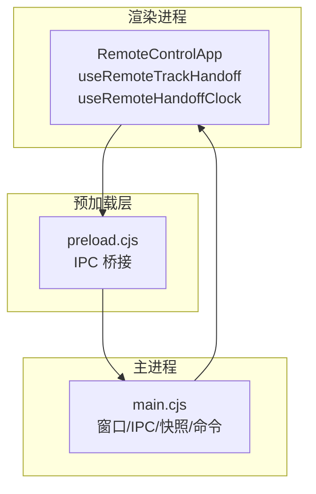
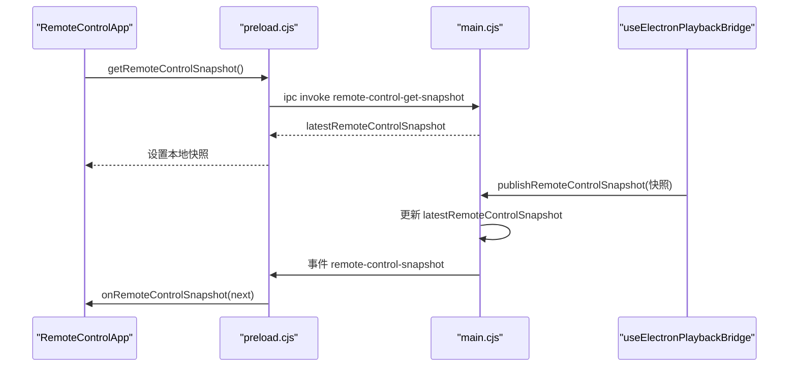
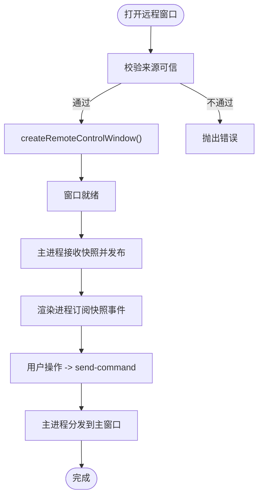
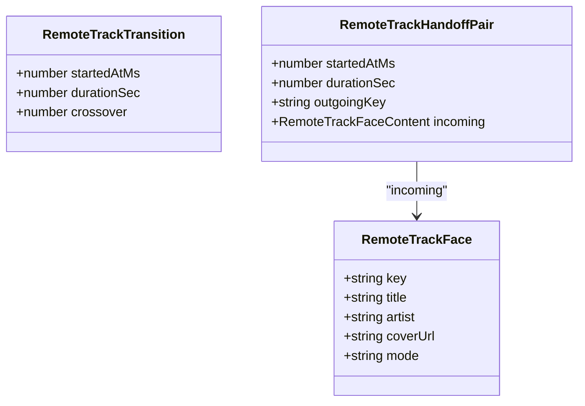
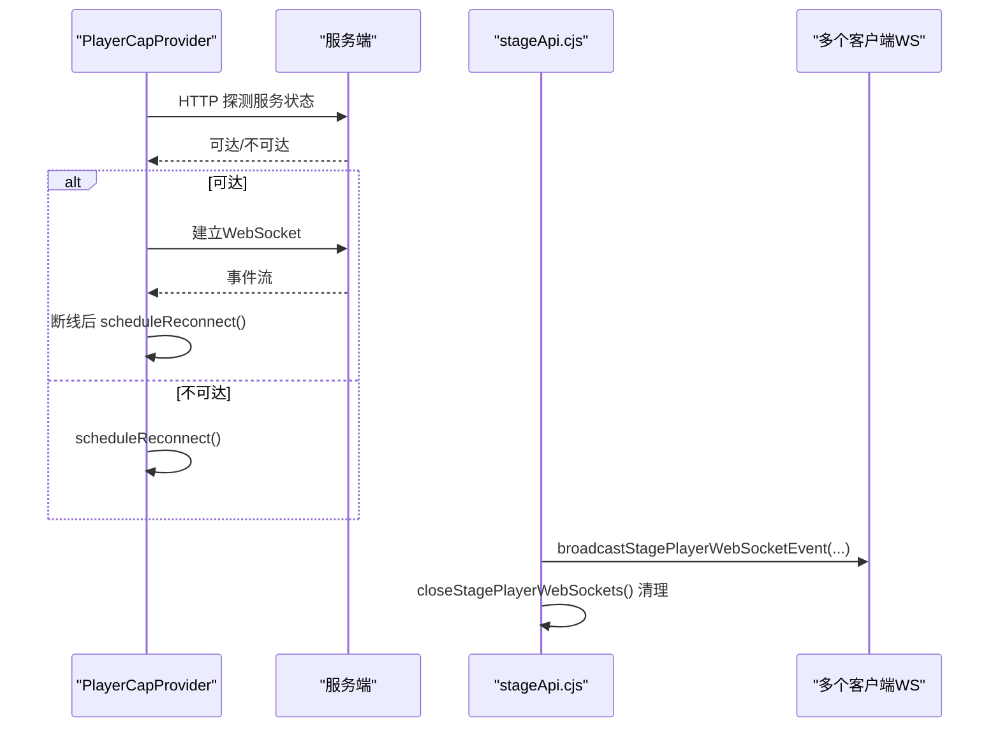
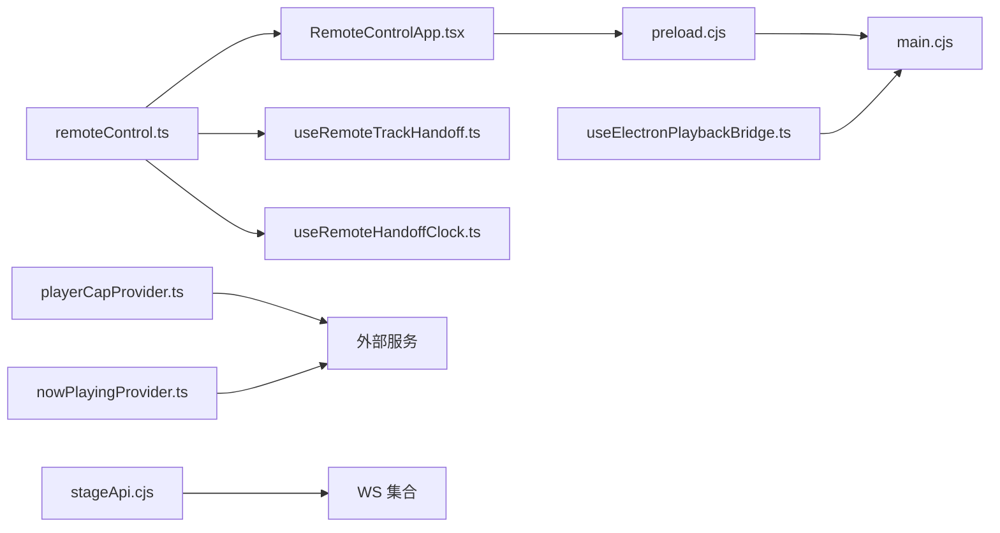

# 连接管理

<cite>
**本文引用的文件**
- [RemoteControlApp.tsx](file://src/components/remote/RemoteControlApp.tsx)
- [useRemoteTrackHandoff.ts](file://src/components/remote/useRemoteTrackHandoff.ts)
- [useRemoteHandoffClock.ts](file://src/components/remote/useRemoteHandoffClock.ts)
- [remoteTrackTransition.ts](file://src/components/remote/remoteTrackTransition.ts)
- [remoteControl.ts](file://src/types/remoteControl.ts)
- [preload.cjs](file://electron/preload.cjs)
- [main.cjs](file://electron/main.cjs)
- [useElectronPlaybackBridge.ts](file://src/hooks/useElectronPlaybackBridge.ts)
- [vite-env.d.ts](file://src/vite-env.d.ts)
- [playerCapProvider.ts](file://src/services/playerCapProvider.ts)
- [nowPlayingProvider.ts](file://src/services/nowPlayingProvider.ts)
- [stageApi.cjs](file://electron/stageApi.cjs)
- [windowsWallpaperController.cjs](file://electron/windowsWallpaperController.cjs)
</cite>

## 目录
1. [简介](#简介)
2. [项目结构](#项目结构)
3. [核心组件](#核心组件)
4. [架构总览](#架构总览)
5. [详细组件分析](#详细组件分析)
6. [依赖关系分析](#依赖关系分析)
7. [性能考虑](#性能考虑)
8. [故障排查指南](#故障排查指南)
9. [结论](#结论)
10. [附录：配置与调优](#附录：配置与调优)

## 简介
本技术文档聚焦 Folia Player 的“远程控制”连接管理，覆盖 Electron 主进程与渲染进程之间的 IPC 通信、远程窗口（Remote Control Window）的生命周期、状态同步机制，以及与 Stage/Now Playing 等 WebSocket 连接的建立、维护、重连策略。重点说明：
- 连接生命周期：初始化、心跳检测、自动重连、销毁
- 多连接支持：并发连接、连接池、资源清理
- 安全验证：令牌校验、会话绑定、权限检查
- 状态监控与错误处理：稳定性与可靠性保障
- 配置选项与性能调优：可观测性与优化建议

## 项目结构
远程控制由三部分组成：
- 渲染进程 UI：RemoteControlApp 及其 Hook，负责展示与控制
- Electron 预加载层：暴露 IPC 桥接方法
- Electron 主进程：窗口管理、IPC 路由、快照发布与命令分发

图表来源
- [RemoteControlApp.tsx:191-224](file://src/components/remote/RemoteControlApp.tsx#L191-L224)
- [preload.cjs:212-222](file://electron/preload.cjs#L212-L222)
- [main.cjs:5036-5176](file://electron/main.cjs#L5036-L5176)

章节来源
- [RemoteControlApp.tsx:191-224](file://src/components/remote/RemoteControlApp.tsx#L191-L224)
- [preload.cjs:212-222](file://electron/preload.cjs#L212-L222)
- [main.cjs:5036-5176](file://electron/main.cjs#L5036-L5176)

## 核心组件
- 远程控制 UI 与交互：RemoteControlApp 通过 IPC 订阅快照并发送控制命令
- 轨道交接动画：useRemoteTrackHandoff + useRemoteHandoffClock + remoteTrackTransition 协作实现平滑过渡
- 数据契约：remoteControl.ts 定义 RemoteControlSnapshot 与 RemoteControlCommand
- 预加载桥接：preload.cjs 暴露 send/get/on 系列 IPC 方法
- 主进程路由：main.cjs 负责窗口创建、权限校验、快照广播、命令分发
- 播放侧推送：useElectronPlaybackBridge 定时发布快照到主进程
- 外部 WebSocket 能力：playerCapProvider、nowPlayingProvider、stageApi 提供 WS 连接与重连

章节来源
- [remoteControl.ts:17-79](file://src/types/remoteControl.ts#L17-L79)
- [RemoteControlApp.tsx:191-224](file://src/components/remote/RemoteControlApp.tsx#L191-L224)
- [useElectronPlaybackBridge.ts:488-518](file://src/hooks/useElectronPlaybackBridge.ts#L488-L518)
- [preload.cjs:212-222](file://electron/preload.cjs#L212-L222)
- [main.cjs:5036-5176](file://electron/main.cjs#L5036-L5176)

## 架构总览
远程控制采用“主进程集中式快照 + 渲染进程订阅”的模式，结合 IPC 双向通信；同时，Stage/Now Playing 使用 WebSocket 进行跨进程或跨设备的数据同步。

图表来源
- [RemoteControlApp.tsx:191-224](file://src/components/remote/RemoteControlApp.tsx#L191-L224)
- [preload.cjs:212-222](file://electron/preload.cjs#L212-L222)
- [main.cjs:5097-5124](file://electron/main.cjs#L5097-L5124)
- [useElectronPlaybackBridge.ts:488-518](file://src/hooks/useElectronPlaybackBridge.ts#L488-L518)

## 详细组件分析

### 远程控制窗口生命周期与 IPC 通道
- 打开/关闭/切换：通过 main.cjs 的 remote-control-open/toggle/close 处理，包含来源可信校验
- 置顶状态：remote-control-get-always-on-top/set-always-on-top
- 快照发布与读取：publish-snapshot/get-snapshot，主进程维护最新快照并广播
- 命令分发：send-command，仅允许来自受信任的远程窗口内容

图表来源
- [main.cjs:5036-5176](file://electron/main.cjs#L5036-L5176)
- [RemoteControlApp.tsx:191-224](file://src/components/remote/RemoteControlApp.tsx#L191-L224)

章节来源
- [main.cjs:5036-5176](file://electron/main.cjs#L5036-L5176)
- [RemoteControlApp.tsx:191-224](file://src/components/remote/RemoteControlApp.tsx#L191-L224)

### 轨道交接与进度提示（AutoMix/Crossfade）
- 交接数据契约：RemoteTrackTransition（startedAtMs、durationSec、crossover）
- 时间轴计算：resolveTransitionClock/mapTrackHandoffProgress/resolveStoppedTrackHandoffProgress
- 渲染驱动：useRemoteHandoffClock 基于 MotionValue 平滑推进，useRemoteTrackHandoff 决定当前/下一首面与方向性过渡

图表来源
- [remoteControl.ts:8-15](file://src/types/remoteControl.ts#L8-L15)
- [remoteTrackTransition.ts:17-39](file://src/components/remote/remoteTrackTransition.ts#L17-L39)

章节来源
- [remoteControl.ts:8-15](file://src/types/remoteControl.ts#L8-L15)
- [remoteTrackTransition.ts:41-105](file://src/components/remote/remoteTrackTransition.ts#L41-L105)
- [useRemoteHandoffClock.ts:41-156](file://src/components/remote/useRemoteHandoffClock.ts#L41-L156)
- [useRemoteTrackHandoff.ts:46-168](file://src/components/remote/useRemoteTrackHandoff.ts#L46-L168)

### 播放侧快照推送与频率控制
- 当远程窗口开启时，useElectronPlaybackBridge 每 500ms 调用 publishRemoteControlSnapshot 推送快照
- 仅在远程窗口打开时启用，避免无效开销
- 同时上报 DPR 变化，减少不必要的 IPC 往返

章节来源
- [useElectronPlaybackBridge.ts:488-518](file://src/hooks/useElectronPlaybackBridge.ts#L488-L518)

### 外部 WebSocket 连接：PlayerCap 与 Now Playing
- PlayerCapProvider：HTTP 探测服务可用性 -> 建立 WS -> 消息解析 -> 断线重连（带 generation 防竞态）
- NowPlayingProvider：WS 连接、消息处理、断线重连、进度回放重置
- Stage API：主进程维护 stagePlayerWebSockets 集合，统一广播与关闭

图表来源
- [playerCapProvider.ts:107-195](file://src/services/playerCapProvider.ts#L107-L195)
- [nowPlayingProvider.ts:300-329](file://src/services/nowPlayingProvider.ts#L300-L329)
- [stageApi.cjs:582-619](file://electron/stageApi.cjs#L582-L619)

章节来源
- [playerCapProvider.ts:107-195](file://src/services/playerCapProvider.ts#L107-L195)
- [nowPlayingProvider.ts:300-329](file://src/services/nowPlayingProvider.ts#L300-L329)
- [stageApi.cjs:582-619](file://electron/stageApi.cjs#L582-L619)

### 心跳与健壮性（辅助进程示例）
- windowsWallpaperController 通过心跳监测子进程健康，超时则终止并重试，具备崩溃循环保护与降级开关
- 该模式可借鉴用于其他长驻进程或外部服务的健康检查

章节来源
- [windowsWallpaperController.cjs:99-221](file://electron/windowsWallpaperController.cjs#L99-L221)

## 依赖关系分析
- 类型契约：remoteControl.ts 被 RemoteControlApp、Hook 与主进程共享
- 渲染层依赖：RemoteControlApp 依赖 preload.cjs 暴露的 IPC 方法
- 主进程依赖：main.cjs 维护窗口、快照、命令分发，并调用主窗口能力
- 播放侧依赖：useElectronPlaybackBridge 向主进程推送快照
- 外部依赖：playerCapProvider、nowPlayingProvider、stageApi 提供 WS 能力

图表来源
- [remoteControl.ts:17-79](file://src/types/remoteControl.ts#L17-L79)
- [RemoteControlApp.tsx:191-224](file://src/components/remote/RemoteControlApp.tsx#L191-L224)
- [preload.cjs:212-222](file://electron/preload.cjs#L212-L222)
- [main.cjs:5036-5176](file://electron/main.cjs#L5036-L5176)
- [useElectronPlaybackBridge.ts:488-518](file://src/hooks/useElectronPlaybackBridge.ts#L488-L518)
- [playerCapProvider.ts:107-195](file://src/services/playerCapProvider.ts#L107-L195)
- [nowPlayingProvider.ts:300-329](file://src/services/nowPlayingProvider.ts#L300-L329)
- [stageApi.cjs:582-619](file://electron/stageApi.cjs#L582-L619)

章节来源
- [remoteControl.ts:17-79](file://src/types/remoteControl.ts#L17-L79)
- [main.cjs:5036-5176](file://electron/main.cjs#L5036-L5176)
- [playerCapProvider.ts:107-195](file://src/services/playerCapProvider.ts#L107-L195)
- [nowPlayingProvider.ts:300-329](file://src/services/nowPlayingProvider.ts#L300-L329)
- [stageApi.cjs:582-619](file://electron/stageApi.cjs#L582-L619)

## 性能考虑
- 快照推送频率：默认 500ms，可根据场景调整；在远程窗口未打开时禁用推送
- 传输体积：快照中仅包含必要字段，歌词按需包含
- 动画与渲染：交接期使用 MotionValue 驱动，避免频繁 setState 导致的抖动
- 重连策略：PlayerCap/NowPlaying 使用指数退避或固定延迟的重连，避免风暴
- 资源清理：Stage WS 集合统一关闭，防止内存泄漏

[本节为通用指导，无需特定文件引用]

## 故障排查指南
- 无法打开远程窗口：检查主进程是否收到 open/toggle 请求且来源可信
- 无快照更新：确认 useElectronPlaybackBridge 是否在远程窗口打开时启动定时器；检查主进程是否成功广播
- 命令无效：确认 send-command 的来源是否为受信任的远程窗口内容
- WS 断开：查看 playerCapProvider/nowPlayingProvider 的重连日志；检查服务端可达性
- 子进程异常：参考 windowsWallpaperController 的心跳与重试逻辑定位问题

章节来源
- [main.cjs:5036-5176](file://electron/main.cjs#L5036-L5176)
- [useElectronPlaybackBridge.ts:488-518](file://src/hooks/useElectronPlaybackBridge.ts#L488-L518)
- [playerCapProvider.ts:107-195](file://src/services/playerCapProvider.ts#L107-L195)
- [nowPlayingProvider.ts:300-329](file://src/services/nowPlayingProvider.ts#L300-L329)
- [windowsWallpaperController.cjs:99-221](file://electron/windowsWallpaperController.cjs#L99-L221)

## 结论
Folia Player 的远程控制通过“IPC 快照 + 事件订阅”的方式实现了稳定可靠的本地遥控体验；结合 AutoMix/Crossfade 的交接动画，提供了流畅的用户反馈。对于跨进程或跨设备的控制，项目提供了 PlayerCap/Now Playing/Stage 的 WebSocket 方案，具备完善的连接建立、消息处理与自动重连机制。通过严格的主进程权限校验与来源可信检查，保障了安全性。配合合理的推送频率与资源清理策略，整体性能与稳定性得到保障。

[本节为总结，无需特定文件引用]

## 附录：配置与调优
- 快照推送间隔：可在 useElectronPlaybackBridge 中调整发布频率
- 远程窗口行为：通过 main.cjs 的 always-on-top、透明模式、点击穿透等命令进行配置
- WS 重连参数：在 playerCapProvider/nowPlayingProvider 中调整重连延迟与最大重试次数
- 阶段化降级：参考 windowsWallpaperController 的心跳与失败计数，对不稳定模块实施降级

章节来源
- [useElectronPlaybackBridge.ts:488-518](file://src/hooks/useElectronPlaybackBridge.ts#L488-L518)
- [main.cjs:5084-5176](file://electron/main.cjs#L5084-L5176)
- [playerCapProvider.ts:107-195](file://src/services/playerCapProvider.ts#L107-L195)
- [nowPlayingProvider.ts:300-329](file://src/services/nowPlayingProvider.ts#L300-L329)
- [windowsWallpaperController.cjs:99-221](file://electron/windowsWallpaperController.cjs#L99-L221)