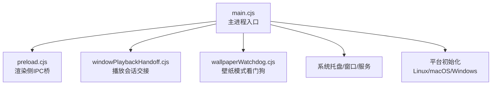
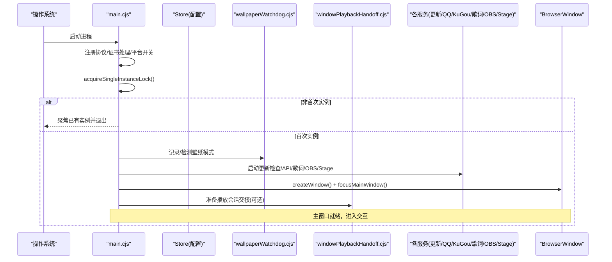
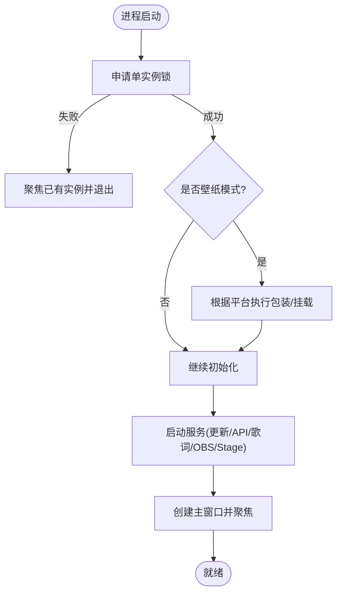
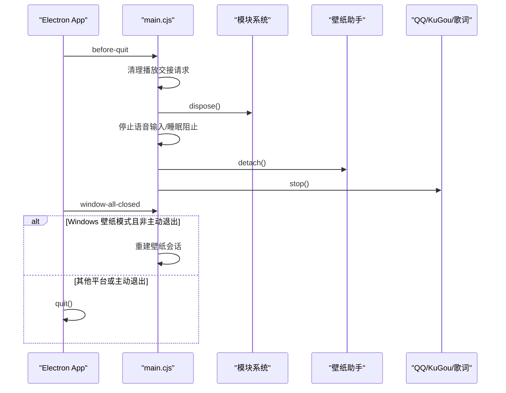
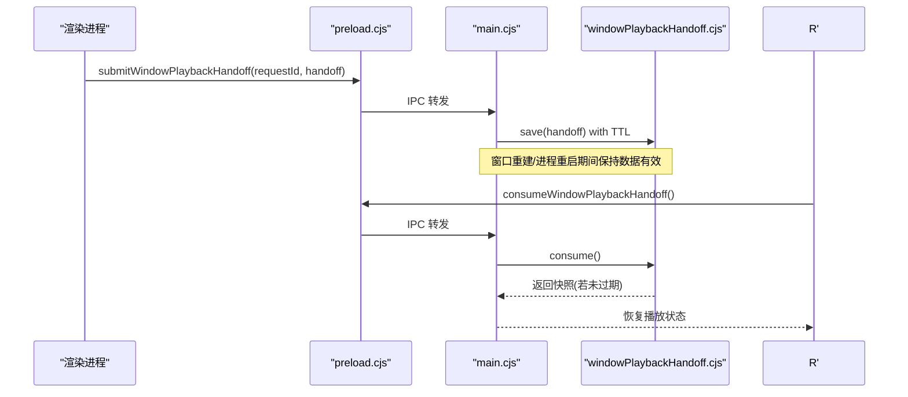
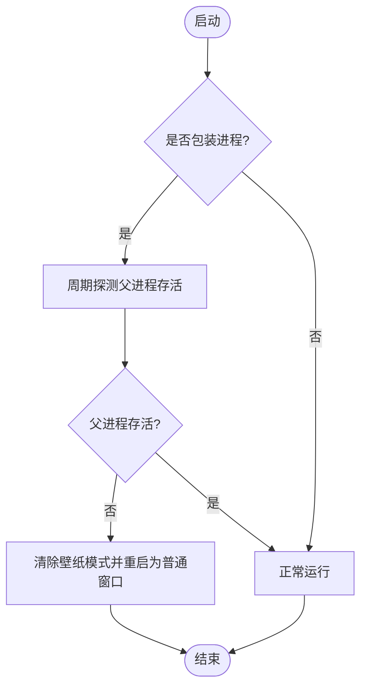
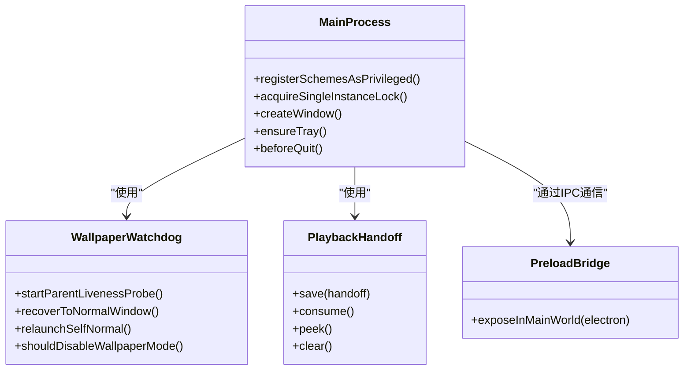
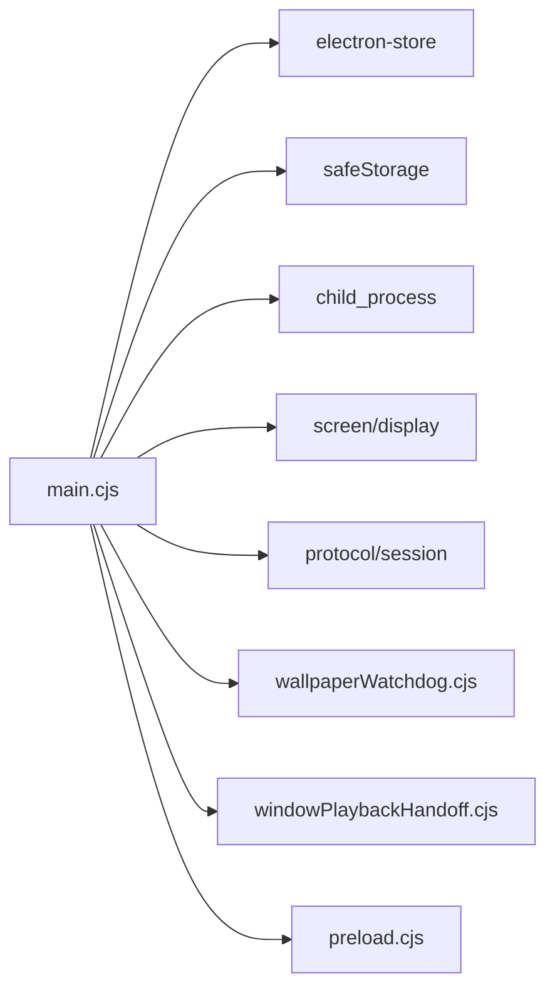

# 主进程生命周期管理

<cite>
**本文引用的文件**
- [electron/main.cjs](file://electron/main.cjs)
- [electron/preload.cjs](file://electron/preload.cjs)
- [electron/wallpaperWatchdog.cjs](file://electron/wallpaperWatchdog.cjs)
- [electron/windowPlaybackHandoff.cjs](file://electron/windowPlaybackHandoff.cjs)
</cite>

## 目录
1. [简介](#简介)
2. [项目结构](#项目结构)
3. [核心组件](#核心组件)
4. [架构总览](#架构总览)
5. [详细组件分析](#详细组件分析)
6. [依赖关系分析](#依赖关系分析)
7. [性能考量](#性能考量)
8. [故障排查指南](#故障排查指南)
9. [结论](#结论)

## 简介
本文聚焦 Folia Player 的主进程生命周期管理，覆盖应用启动、单实例锁、协议注册、平台初始化、窗口与托盘创建、服务启动、退出清理、跨平台差异（Windows/macOS/Linux）、错误恢复与优雅关闭等关键路径。文档以代码级事实为依据，配合时序图、流程图和类图帮助读者理解复杂流程。

## 项目结构
主进程入口位于 electron/main.cjs，负责：
- Electron 应用全局配置与协议注册
- 单实例锁与会话恢复
- 平台相关命令行开关与图形栈选择
- 系统托盘、窗口、更新检查、API 服务、歌词/语音/壁纸模式等子系统初始化
- 退出前资源释放与子进程解绑

preload.cjs 暴露给渲染进程的 IPC 桥接能力，windowPlaybackHandoff.cjs 提供播放会话在窗口重建或进程重启时的短暂持久化，wallpaperWatchdog.cjs 实现壁纸模式的看门狗与自恢复。

**图表来源**
- [electron/main.cjs:41-105](file://electron/main.cjs#L41-L105)
- [electron/main.cjs:4100-4227](file://electron/main.cjs#L4100-L4227)
- [electron/preload.cjs:1-320](file://electron/preload.cjs#L1-L320)
- [electron/windowPlaybackHandoff.cjs:1-102](file://electron/windowPlaybackHandoff.cjs#L1-L102)
- [electron/wallpaperWatchdog.cjs:1-187](file://electron/wallpaperWatchdog.cjs#L1-L187)

**章节来源**
- [electron/main.cjs:41-105](file://electron/main.cjs#L41-L105)
- [electron/main.cjs:4100-4227](file://electron/main.cjs#L4100-L4227)

## 核心组件
- 单实例锁与会话恢复：确保同一时间仅一个主进程运行；在重启/切换模式下通过“播放会话交接”保持播放状态不丢失。
- 协议与权限：注册自定义 scheme 并赋予特权；设置系统代理、CORS 绕过与权限校验。
- 平台初始化：Linux 下处理 Wayland/Vulkan/软件渲染；macOS 下启用 GPU 光栅化；Windows 下支持壁纸模式与 WorkerW 父子窗口。
- 服务与子系统：更新检查、QQ/KuGou API、歌词 API、OBS Browser Source、Stage 服务器、Discord Rich Presence、语音输入暂停监控、显示睡眠阻止等。
- 退出清理：释放壁纸模式关联、停止监控、销毁外部服务、清理待处理的播放交接请求。

**章节来源**
- [electron/main.cjs:568-605](file://electron/main.cjs#L568-L605)
- [electron/main.cjs:1527-1555](file://electron/main.cjs#L1527-L1555)
- [electron/main.cjs:4235-4275](file://electron/main.cjs#L4235-L4275)

## 架构总览
下图展示从进程启动到主窗口就绪的关键阶段，包括单实例锁、协议注册、平台初始化、服务启动与窗口创建。

**图表来源**
- [electron/main.cjs:41-105](file://electron/main.cjs#L41-L105)
- [electron/main.cjs:568-605](file://electron/main.cjs#L568-L605)
- [electron/main.cjs:4100-4227](file://electron/main.cjs#L4100-L4227)

**章节来源**
- [electron/main.cjs:41-105](file://electron/main.cjs#L41-L105)
- [electron/main.cjs:568-605](file://electron/main.cjs#L568-L605)
- [electron/main.cjs:4100-4227](file://electron/main.cjs#L4100-L4227)

## 详细组件分析

### 启动流程与单实例锁
- 单实例锁：使用 requestSingleInstanceLock，并在 relaunch 场景下重试获取，避免竞态导致重复实例。
- second-instance：当检测到第二个实例时，聚焦主窗口并退出当前进程。
- 壁纸模式包装：Wayland 下通过 windowtolayer 包装进程；X11 直接以桌面类型窗口运行；Windows 通过 helper 将窗口挂入 WorkerW。
- 播放会话交接：在窗口重建或进程重启前后，通过短 TTL 的 store-backed 存储保存/消费播放快照，保证体验连贯。

**图表来源**
- [electron/main.cjs:568-605](file://electron/main.cjs#L568-L605)
- [electron/main.cjs:4100-4227](file://electron/main.cjs#L4100-L4227)
- [electron/windowPlaybackHandoff.cjs:11-96](file://electron/windowPlaybackHandoff.cjs#L11-L96)

**章节来源**
- [electron/main.cjs:568-605](file://electron/main.cjs#L568-L605)
- [electron/main.cjs:4100-4227](file://electron/main.cjs#L4100-L4227)
- [electron/windowPlaybackHandoff.cjs:11-96](file://electron/windowPlaybackHandoff.cjs#L11-L96)

### 协议注册与权限控制
- 自定义协议：注册 folia-cover 与 mod 协议为特权 scheme，允许标准 fetch、安全上下文、CORS 与流式传输。
- 证书错误处理：对特定域名证书问题做白名单放行。
- 代理与 CORS：默认使用系统代理并强制刷新；针对 QQ/KuGou 等媒体域名进行响应头调整以支持跨域。
- 权限检查：限制文件系统、字体、剪贴板、扬声器选择、媒体等权限仅对受信任的主窗口内容开放。

**章节来源**
- [electron/main.cjs:41-76](file://electron/main.cjs#L41-L76)
- [electron/main.cjs:1549-1555](file://electron/main.cjs#L1549-L1555)
- [electron/main.cjs:1648-1672](file://electron/main.cjs#L1648-L1672)
- [electron/main.cjs:1674-1699](file://electron/main.cjs#L1674-L1699)

### 平台差异化初始化
- Linux：
  - 密码存储后端选择（解决 Wayland/Vulkan 兼容性问题）
  - 禁用 Vulkan、提示 Ozone 平台、日志级别
  - 软件渲染或 SwiftShader 回退策略
  - 启用 Wayland 窗口装饰
- macOS：
  - 忽略 GPU 黑名单、使用 ANGLE/GL、启用 GPU 光栅化，缓解 Intel+AMD 独显 Retina 卡顿
- Windows：
  - 壁纸模式：WorkerW 父子窗口、鼠标事件注入、桌面刷新、显示变更几何重算
  - 透明背景与厚边框在不同桌面架构下的重建逻辑

**章节来源**
- [electron/main.cjs:78-105](file://electron/main.cjs#L78-L105)
- [electron/main.cjs:132-137](file://electron/main.cjs#L132-L137)
- [electron/main.cjs:242-558](file://electron/main.cjs#L242-L558)

### 服务与子系统启动
- 更新检查：延迟启动，按设置开关控制
- 在线音乐 API：QQ/KuGou 启动与状态监听
- 歌词 API：按需启动
- OBS Browser Source：按需启动，发布配置/时钟/音频
- Stage 服务器：按需启动，对外暴露播放器控制接口
- 托盘：创建托盘图标与菜单，支持显示/隐藏主窗口、打开遥控窗口、点击穿透、壁纸模式切换、重置窗口、退出等
- 其他：语音输入暂停监控、显示睡眠阻止、Discord Rich Presence

**章节来源**
- [electron/main.cjs:4100-4227](file://electron/main.cjs#L4100-L4227)
- [electron/main.cjs:1502-1522](file://electron/main.cjs#L1502-L1522)

### 退出流程与优雅关闭
- before-quit：标记退出、清理播放交接请求、销毁模块系统、停止语音输入暂停监控与显示睡眠阻止、解绑壁纸模式辅助进程、销毁 Discord Presence、停止 QQ API 与歌词 API。
- window-all-closed：在非 macOS 平台关闭窗口后退出；Windows 壁纸模式下若非主动退出则尝试重建会话。
- 进程终止：必要时调用 app.exit() 或在子进程 spawn 成功后退出旧进程。

**图表来源**
- [electron/main.cjs:4235-4275](file://electron/main.cjs#L4235-L4275)

**章节来源**
- [electron/main.cjs:4235-4275](file://electron/main.cjs#L4235-L4275)

### 播放会话交接（窗口重建/进程重启）
- 渲染端捕获当前播放快照并通过 IPC 提交给主进程
- 主进程将快照写入带 TTL 的 store-backed 存储
- 新窗口启动后消费该快照并恢复播放状态

**图表来源**
- [electron/preload.cjs:135-149](file://electron/preload.cjs#L135-L149)
- [electron/windowPlaybackHandoff.cjs:11-96](file://electron/windowPlaybackHandoff.cjs#L11-L96)

**章节来源**
- [electron/preload.cjs:135-149](file://electron/preload.cjs#L135-L149)
- [electron/windowPlaybackHandoff.cjs:11-96](file://electron/windowPlaybackHandoff.cjs#L11-L96)

### 壁纸模式看门狗与自恢复
- 父进程存活探测：周期性检测 windowtolayer 父进程是否存在，异常时恢复到普通窗口
- 崩溃循环保护：统计连续包装启动次数，超过阈值自动关闭壁纸模式
- 正常退出：detach 而非 kill，确保桌面层正确重绘

**图表来源**
- [electron/wallpaperWatchdog.cjs:27-176](file://electron/wallpaperWatchdog.cjs#L27-L176)

**章节来源**
- [electron/wallpaperWatchdog.cjs:27-176](file://electron/wallpaperWatchdog.cjs#L27-L176)

### 类图：关键对象与职责

**图表来源**
- [electron/main.cjs:568-605](file://electron/main.cjs#L568-L605)
- [electron/wallpaperWatchdog.cjs:27-176](file://electron/wallpaperWatchdog.cjs#L27-L176)
- [electron/windowPlaybackHandoff.cjs:11-96](file://electron/windowPlaybackHandoff.cjs#L11-L96)
- [electron/preload.cjs:1-320](file://electron/preload.cjs#L1-L320)

**章节来源**
- [electron/main.cjs:568-605](file://electron/main.cjs#L568-L605)
- [electron/wallpaperWatchdog.cjs:27-176](file://electron/wallpaperWatchdog.cjs#L27-L176)
- [electron/windowPlaybackHandoff.cjs:11-96](file://electron/windowPlaybackHandoff.cjs#L11-L96)
- [electron/preload.cjs:1-320](file://electron/preload.cjs#L1-L320)

## 依赖关系分析
- main.cjs 依赖：
  - electron-store：持久化设置与播放交接数据
  - safeStorage：加密敏感信息（如 KuGou 凭据）
  - child_process：启动 windowtolayer 与 Windows 壁纸助手
  - screen/display：处理显示器热插拔与分辨率变化
  - protocol/session：自定义协议与网络策略
- 内部模块：
  - wallpaperWatchdog.cjs：看门狗与自恢复
  - windowPlaybackHandoff.cjs：播放会话交接
  - preload.cjs：渲染侧 IPC 桥

**图表来源**
- [electron/main.cjs:1-29](file://electron/main.cjs#L1-L29)
- [electron/main.cjs:139-143](file://electron/main.cjs#L139-L143)
- [electron/main.cjs:196-226](file://electron/main.cjs#L196-L226)
- [electron/main.cjs:4100-4227](file://electron/main.cjs#L4100-L4227)

**章节来源**
- [electron/main.cjs:1-29](file://electron/main.cjs#L1-L29)
- [electron/main.cjs:139-143](file://electron/main.cjs#L139-L143)
- [electron/main.cjs:196-226](file://electron/main.cjs#L196-L226)
- [electron/main.cjs:4100-4227](file://electron/main.cjs#L4100-L4227)

## 性能考量
- 内存管理：
  - 播放会话交接使用 TTL 存储，避免长期占用
  - 视频采集服务空闲回收（Chromium 特性），减少残留进程
- GPU 加速：
  - macOS x64 忽略 GPU 黑名单并使用 ANGLE/GL，启用 GPU 光栅化
  - Linux 可降级至 SwiftShader 或软件渲染，规避 Vulkan 不稳定
- 资源加载优化：
  - 系统代理统一配置，减少重复连接
  - 针对媒体域名进行 CORS 头调整，降低跨域失败重试开销
- 定时器与节流：
  - 壁纸模式切换合并触发，避免频繁重建窗口
  - 显示变更几何重算采用防抖，减少重复计算

[本节为通用指导，无需具体文件引用]

## 故障排查指南
- 单实例锁冲突：
  - 现象：重复启动无法进入
  - 排查：确认是否有残留进程；relaunch 场景下会重试获取锁
- 壁纸模式异常：
  - 现象：黑屏/无法交互/桌面闪烁
  - 排查：查看是否触发 shouldDisableWallpaperMode；检查 windowtolayer/helper 二进制是否存在；观察父进程存活探测
- 播放状态丢失：
  - 现象：窗口重建后播放中断
  - 排查：确认播放交接是否保存成功、TTL 是否过期、新窗口是否正确消费
- 网络/CORS 问题：
  - 现象：媒体加载失败
  - 排查：检查代理设置、CORS 头修改是否生效、目标域名是否在白名单

**章节来源**
- [electron/main.cjs:1527-1555](file://electron/main.cjs#L1527-L1555)
- [electron/wallpaperWatchdog.cjs:134-176](file://electron/wallpaperWatchdog.cjs#L134-L176)
- [electron/windowPlaybackHandoff.cjs:11-96](file://electron/windowPlaybackHandoff.cjs#L11-L96)
- [electron/main.cjs:1674-1699](file://electron/main.cjs#L1674-L1699)

## 结论
Folia Player 的主进程生命周期管理围绕“稳定启动、平滑过渡、优雅退出”展开：通过单实例锁与播放会话交接保障多实例与重启一致性；借助看门狗与平台差异化初始化提升壁纸模式稳定性；在退出阶段系统化释放资源，确保用户体验与系统整洁。整体设计兼顾跨平台兼容性与可扩展性，为后续功能演进提供了坚实基础。