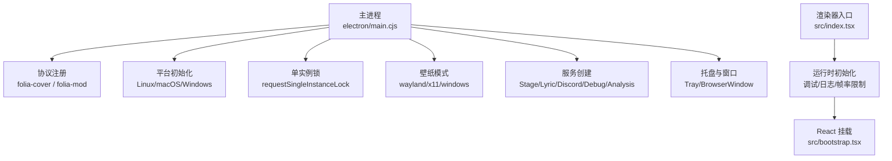
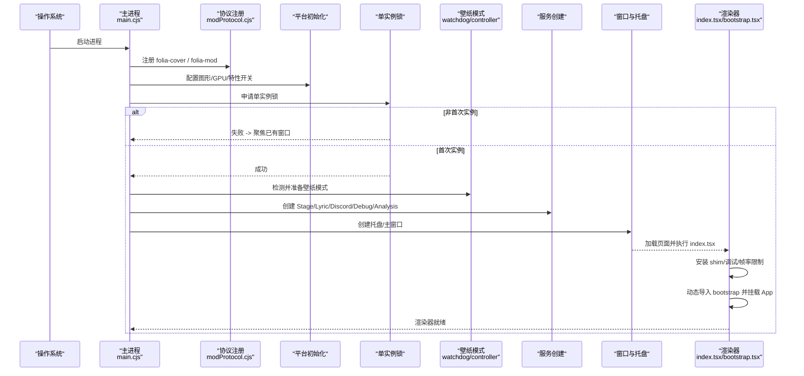
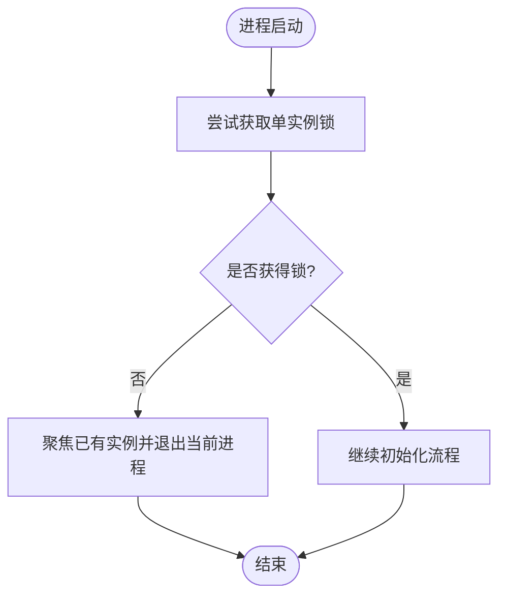
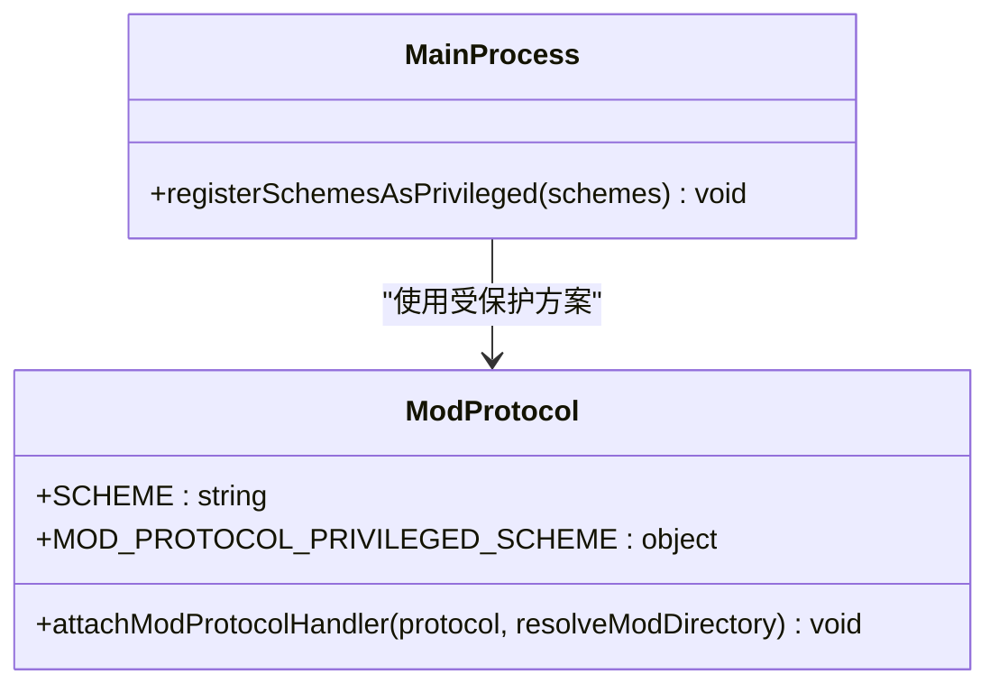
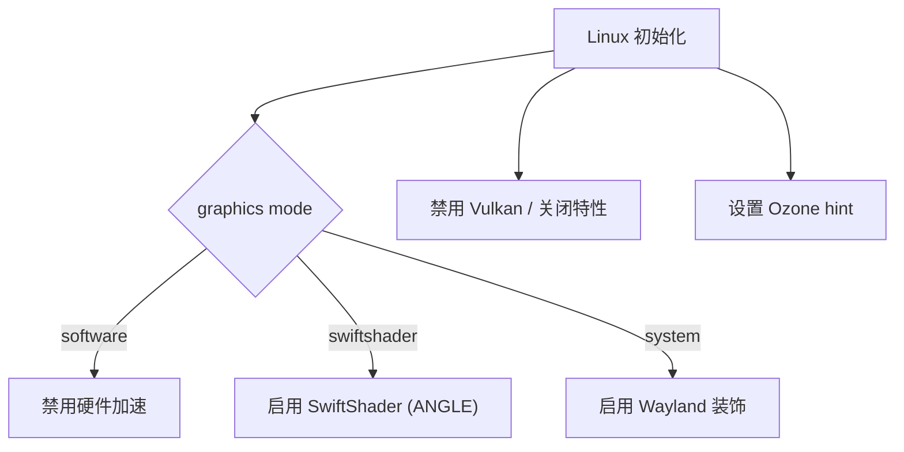
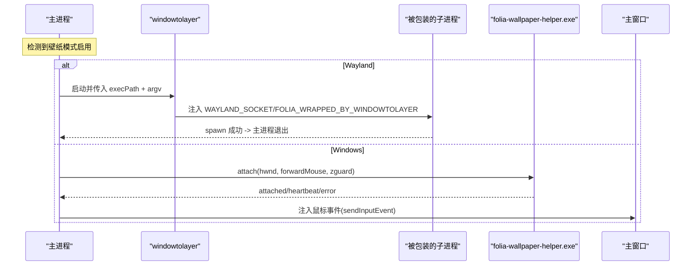
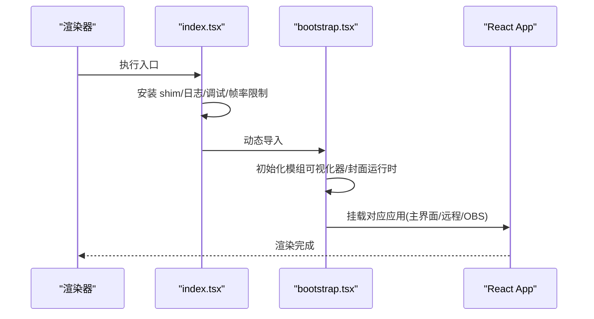
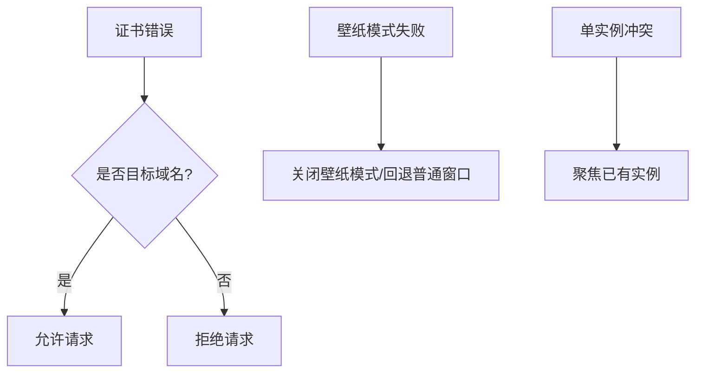
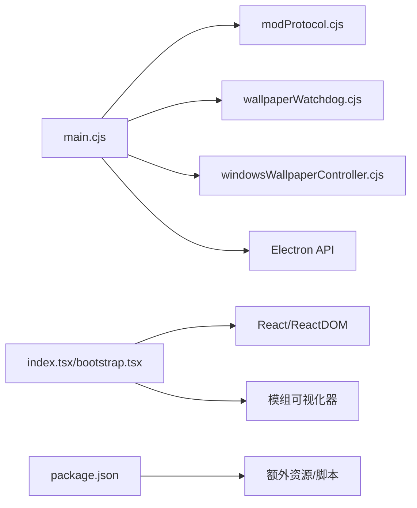

# 应用启动流程

<cite>
**本文引用的文件**
- [electron/main.cjs](file://electron/main.cjs)
- [electron/wallpaperWatchdog.cjs](file://electron/wallpaperWatchdog.cjs)
- [electron/windowsWallpaperController.cjs](file://electron/windowsWallpaperController.cjs)
- [electron/modSystem/modProtocol.cjs](file://electron/modSystem/modProtocol.cjs)
- [src/index.tsx](file://src/index.tsx)
- [src/bootstrap.tsx](file://src/bootstrap.tsx)
- [package.json](file://package.json)
</cite>

## 目录
1. [简介](#简介)
2. [项目结构](#项目结构)
3. [核心组件](#核心组件)
4. [架构总览](#架构总览)
5. [详细组件分析](#详细组件分析)
6. [依赖关系分析](#依赖关系分析)
7. [性能考虑](#性能考虑)
8. [故障排查指南](#故障排查指南)
9. [结论](#结论)
10. [附录](#附录)

## 简介
本文件系统性梳理 Folia Player 的 Electron 桌面端启动流程，覆盖从进程启动到渲染器 ready 前的完整生命周期。重点包括：
- 单实例锁机制与二次实例聚焦策略
- 自定义协议注册（folia-cover、MOD_PROTOCOL_PRIVILEGED_SCHEME）
- 命令行参数与平台特定初始化（Linux 图形模式、macOS GPU 优化、Windows 设置）
- 壁纸模式的跨平台实现：Wayland 进程包装、X11 桌面窗口类型、Windows WorkerW 父进程管理
- 错误处理与恢复：证书错误、协议注册失败、单实例冲突、辅助进程崩溃循环保护
- 性能优化建议：GPU 加速、内存预加载、资源预热

## 项目结构
Folia Player 采用 Electron 多进程架构：
- 主进程入口 electron/main.cjs：负责协议注册、平台初始化、单实例锁、壁纸模式控制、服务创建、托盘与窗口管理等
- 渲染器入口 src/index.tsx 与 src/bootstrap.tsx：安装运行时 shim、调试模块、帧率限制，并挂载 React 应用
- 壁纸守护与控制器：wallpaperWatchdog.cjs（Linux Wayland/X11）、windowsWallpaperController.cjs（Windows）
- 模组协议：modProtocol.cjs 提供受保护的 folia-mod:// 协议用于安全加载 ESM 贡献
- 构建与脚本：package.json 定义开发/打包命令及额外资源

**图表来源**
- [electron/main.cjs:42-54](file://electron/main.cjs#L42-L54)
- [electron/main.cjs:78-137](file://electron/main.cjs#L78-L137)
- [electron/main.cjs:1524-1547](file://electron/main.cjs#L1524-L1547)
- [electron/wallpaperWatchdog.cjs:1-187](file://electron/wallpaperWatchdog.cjs#L1-L187)
- [electron/windowsWallpaperController.cjs:1-465](file://electron/windowsWallpaperController.cjs#L1-L465)
- [electron/modSystem/modProtocol.cjs:1-95](file://electron/modSystem/modProtocol.cjs#L1-L95)
- [src/index.tsx:1-18](file://src/index.tsx#L1-L18)
- [src/bootstrap.tsx:1-72](file://src/bootstrap.tsx#L1-L72)

**章节来源**
- [package.json:13-50](file://package.json#L13-L50)
- [electron/main.cjs:42-137](file://electron/main.cjs#L42-L137)
- [src/index.tsx:1-18](file://src/index.tsx#L1-L18)
- [src/bootstrap.tsx:1-72](file://src/bootstrap.tsx#L1-L72)

## 核心组件
- 协议注册与信任域
  - 统一在启动早期一次性注册 privileged schemes，避免后续覆盖导致权限丢失
  - 包含 folia-cover（封面资源流式访问）与 MOD_PROTOCOL_PRIVILEGED_SCHEME（受控的 folia-mod:// 文件服务）
- 平台初始化
  - Linux：根据环境变量选择 swiftshader/software/system 图形后端；禁用 Vulkan；Ozone hint；必要时启用 Wayland 装饰
  - macOS：针对 Intel Mac + AMD 独显开启 GPU 光栅化与 ANGLE GL 路径
  - Windows：托盘缩略图按钮、任务栏集成等
- 单实例锁
  - requestSingleInstanceLock 保证仅一个实例运行；二次实例聚焦主窗口
  - 支持重启竞态下的重试获取锁（FOLIA_RELAUNCH=1）
- 壁纸模式
  - Wayland：通过 windowtolayer 包装子进程进入底层 shell 层；失败时回退为普通窗口
  - X11：以 _NET_WM_WINDOW_TYPE_DESKTOP 类型窗口呈现，点击穿透受限
  - Windows：通过 folia-wallpaper-helper.exe 将主窗口父子关系挂入 WorkerW；心跳监控与自动重连
- 服务与扩展
  - Stage API、歌词 API、Discord Rich Presence、语音输入暂停、显示休眠阻止、本地封面资产存储、Whisper 对齐、分析主机、调试主机
- 渲染器启动
  - 安装全局 Buffer shim、控制台日志捕获、调试模块、内存采样、可视化帧率限制
  - 动态导入 bootstrap，按 URL 参数挂载不同应用（主界面、远程、OBS 源）

**章节来源**
- [electron/main.cjs:42-54](file://electron/main.cjs#L42-L54)
- [electron/main.cjs:78-137](file://electron/main.cjs#L78-L137)
- [electron/main.cjs:1524-1547](file://electron/main.cjs#L1524-L1547)
- [electron/wallpaperWatchdog.cjs:1-187](file://electron/wallpaperWatchdog.cjs#L1-L187)
- [electron/windowsWallpaperController.cjs:1-465](file://electron/windowsWallpaperController.cjs#L1-L465)
- [electron/modSystem/modProtocol.cjs:1-95](file://electron/modSystem/modProtocol.cjs#L1-L95)
- [src/index.tsx:1-18](file://src/index.tsx#L1-L18)
- [src/bootstrap.tsx:1-72](file://src/bootstrap.tsx#L1-L72)

## 架构总览
下图展示从主进程启动到渲染器 ready 的关键阶段与交互：

**图表来源**
- [electron/main.cjs:42-54](file://electron/main.cjs#L42-L54)
- [electron/main.cjs:78-137](file://electron/main.cjs#L78-L137)
- [electron/main.cjs:1524-1547](file://electron/main.cjs#L1524-L1547)
- [electron/wallpaperWatchdog.cjs:1-187](file://electron/wallpaperWatchdog.cjs#L1-L187)
- [electron/windowsWallpaperController.cjs:1-465](file://electron/windowsWallpaperController.cjs#L1-L465)
- [electron/modSystem/modProtocol.cjs:1-95](file://electron/modSystem/modProtocol.cjs#L1-L95)
- [src/index.tsx:1-18](file://src/index.tsx#L1-L18)
- [src/bootstrap.tsx:1-72](file://src/bootstrap.tsx#L1-L72)

## 详细组件分析

### 单实例锁与二次实例处理
- 使用 requestSingleInstanceLock 确保唯一实例；若失败则聚焦已有主窗口
- 支持重启竞态：当 FOLIA_RELAUNCH=1 时，短暂重试获取锁，避免旧实例退出与锁释放之间的竞争导致新实例失败
- 监听 second-instance 事件，转发焦点到主窗口

**图表来源**
- [electron/main.cjs:1524-1547](file://electron/main.cjs#L1524-L1547)

**章节来源**
- [electron/main.cjs:1524-1547](file://electron/main.cjs#L1524-L1547)

### 协议注册过程（folia-cover、MOD_PROTOCOL_PRIVILEGED_SCHEME）
- 在进程早期一次性调用 registerSchemesAsPrivileged，避免多次调用覆盖之前注册的 scheme 特权
- folia-cover：标准、安全、支持 fetch、CORS、流式传输，便于封面资源高效加载
- folia-mod：严格白名单的文件服务器，仅允许 GET 且限定 .js/.mjs，禁止路径穿越，确保只读取已验证的模组目录

**图表来源**
- [electron/modSystem/modProtocol.cjs:1-95](file://electron/modSystem/modProtocol.cjs#L1-L95)
- [electron/main.cjs:42-54](file://electron/main.cjs#L42-L54)

**章节来源**
- [electron/modSystem/modProtocol.cjs:1-95](file://electron/modSystem/modProtocol.cjs#L1-L95)
- [electron/main.cjs:42-54](file://electron/main.cjs#L42-L54)

### 命令行参数与平台特定初始化
- Linux
  - 根据 ELECTRON_LINUX_PACKAGED_GRAPHICS 与 FOLIA_LINUX_GRAPHICS_MODE 决定 swiftshader/software/system
  - 禁用 Vulkan，设置 Ozone hint，按需启用 Wayland 窗口装饰
- macOS
  - x64 架构下忽略 GPU 黑名单、使用 ANGLE GL、启用 GPU 光栅化，解决 Retina 渲染卡顿
- Windows
  - 托盘缩略图按钮、任务栏图标隐藏、透明背景与置顶等窗口行为

**图表来源**
- [electron/main.cjs:78-105](file://electron/main.cjs#L78-L105)
- [electron/main.cjs:132-137](file://electron/main.cjs#L132-L137)

**章节来源**
- [electron/main.cjs:78-137](file://electron/main.cjs#L78-L137)

### 壁纸模式启动逻辑（Wayland、X11、Windows）
- Wayland
  - 通过 windowtolayer 包装子进程，注入 FOLIA_WRAPPED_BY_WINDOWTOLAYER 与 WAYLAND_SOCKET
  - 子进程成功后原进程退出；失败则记录错误并回退为普通窗口
- X11
  - 以 desktop 类型窗口呈现，无法实现点击穿透（KWin 会提升 KDE 桌面窗口）
- Windows
  - 通过 folia-wallpaper-helper.exe 将主窗口挂入 WorkerW 层
  - 心跳监控（JSONL 事件），失败自动重连；达到阈值后降级并通知前端
  - 鼠标输入转发：将 helper 的虚拟 DPI 坐标转换为窗口相对坐标并通过 sendInputEvent 注入

**图表来源**
- [electron/main.cjs:196-226](file://electron/main.cjs#L196-L226)
- [electron/main.cjs:242-465](file://electron/main.cjs#L242-L465)
- [electron/wallpaperWatchdog.cjs:1-187](file://electron/wallpaperWatchdog.cjs#L1-L187)
- [electron/windowsWallpaperController.cjs:1-465](file://electron/windowsWallpaperController.cjs#L1-L465)

**章节来源**
- [electron/main.cjs:196-465](file://electron/main.cjs#L196-L465)
- [electron/wallpaperWatchdog.cjs:1-187](file://electron/wallpaperWatchdog.cjs#L1-L187)
- [electron/windowsWallpaperController.cjs:1-465](file://electron/windowsWallpaperController.cjs#L1-L465)

### 渲染器启动顺序（index.tsx → bootstrap.tsx）
- index.tsx：安装全局 Buffer shim、控制台日志捕获、调试模块、内存采样、可视化帧率限制
- 动态导入 bootstrap.tsx：按 URL 参数决定挂载 RemoteControlApp/OBS 源或主 App
- 先初始化模组可视化器与本地封面运行时，再渲染根节点，确保设置与资源可用

**图表来源**
- [src/index.tsx:1-18](file://src/index.tsx#L1-L18)
- [src/bootstrap.tsx:1-72](file://src/bootstrap.tsx#L1-L72)

**章节来源**
- [src/index.tsx:1-18](file://src/index.tsx#L1-L18)
- [src/bootstrap.tsx:1-72](file://src/bootstrap.tsx#L1-L72)

### 错误处理与恢复策略
- 证书错误：对特定 Kugou CDN 域名放行常见名称不匹配错误，其他拒绝
- 协议注册失败：由于一次性注册，若失败需检查 privileges 配置与 scheme 名称
- 单实例冲突：二次实例聚焦已有窗口；重启竞态下重试获取锁
- 壁纸模式异常：
  - Wayland：windowtolayer 缺失或 spawn 失败时关闭壁纸模式并回退
  - X11：无法点击穿透，UI 层面屏蔽相关选项
  - Windows：helper 心跳超时或错误触发重连；连续失败达到阈值后降级并通知前端重建窗口

**图表来源**
- [electron/main.cjs:56-76](file://electron/main.cjs#L56-L76)
- [electron/main.cjs:196-226](file://electron/main.cjs#L196-L226)
- [electron/wallpaperWatchdog.cjs:64-78](file://electron/wallpaperWatchdog.cjs#L64-L78)
- [electron/windowsWallpaperController.cjs:147-172](file://electron/windowsWallpaperController.cjs#L147-L172)

**章节来源**
- [electron/main.cjs:56-76](file://electron/main.cjs#L56-L76)
- [electron/main.cjs:196-226](file://electron/main.cjs#L196-L226)
- [electron/wallpaperWatchdog.cjs:64-78](file://electron/wallpaperWatchdog.cjs#L64-L78)
- [electron/windowsWallpaperController.cjs:147-172](file://electron/windowsWallpaperController.cjs#L147-L172)

## 依赖关系分析
- 主进程依赖
  - 协议模块：modProtocol.cjs 提供受保护方案与处理器
  - 壁纸模块：wallpaperWatchdog.cjs（Linux Wayland/X11）、windowsWallpaperController.cjs（Windows）
  - 系统能力：session、protocol、screen、Menu、Tray、powerSaveBlocker、safeStorage 等
- 渲染器依赖
  - React/ReactDOM、i18n、本地封面运行时、模组可视化器
- 构建与打包
  - package.json 中 scripts 与 build.extraResources 指定额外资源（windowtolayer、folia-wallpaper-helper.exe、图标等）

**图表来源**
- [electron/main.cjs:42-54](file://electron/main.cjs#L42-L54)
- [electron/wallpaperWatchdog.cjs:1-187](file://electron/wallpaperWatchdog.cjs#L1-L187)
- [electron/windowsWallpaperController.cjs:1-465](file://electron/windowsWallpaperController.cjs#L1-L465)
- [electron/modSystem/modProtocol.cjs:1-95](file://electron/modSystem/modProtocol.cjs#L1-L95)
- [src/index.tsx:1-18](file://src/index.tsx#L1-L18)
- [src/bootstrap.tsx:1-72](file://src/bootstrap.tsx#L1-L72)
- [package.json:52-180](file://package.json#L52-L180)

**章节来源**
- [package.json:52-180](file://package.json#L52-L180)
- [electron/main.cjs:42-54](file://electron/main.cjs#L42-L54)
- [electron/wallpaperWatchdog.cjs:1-187](file://electron/wallpaperWatchdog.cjs#L1-L187)
- [electron/windowsWallpaperController.cjs:1-465](file://electron/windowsWallpaperController.cjs#L1-L465)
- [electron/modSystem/modProtocol.cjs:1-95](file://electron/modSystem/modProtocol.cjs#L1-L95)
- [src/index.tsx:1-18](file://src/index.tsx#L1-L18)
- [src/bootstrap.tsx:1-72](file://src/bootstrap.tsx#L1-L72)

## 性能考虑
- GPU 加速与渲染优化
  - Linux：优先 system；AppImage 环境建议使用 swiftshader 以避免 GPU 崩溃与模糊问题；必要时软件渲染
  - macOS：启用 GPU 光栅化与 ANGLE GL，缓解 Retina 渲染卡顿
  - Windows：合理设置透明背景与置顶，避免与壁纸层冲突
- 内存与资源预热
  - 本地封面缩略图生成与缓存；音频/封面缓存目录可配置
  - 分析模型权重目录优先级：用户配置 > userData/models > 内置 models
  - 预加载关键资源（如字体、主题、视觉器资源）以减少首屏延迟
- 网络与代理
  - 系统代理会话：ensureSystemProxySession 强制刷新代理配置并关闭连接
  - CORS 放宽：对特定域名（QQ/Kugou/AMLL）响应头放宽，减少跨域失败
- 进程与资源回收
  - 视频采集服务空闲回收：ReleaseVideoSourceProviderIfNotInUse，避免残留 utility 进程
  - 壁纸模式心跳与自动重连，防止僵尸进程占用资源

[本节为通用指导，无需具体文件引用]

## 故障排查指南
- 证书错误
  - 现象：Kugou CDN 证书名称不匹配导致请求失败
  - 处理：对 fs.youthandroid2.kugou.com 放行 ERR_CERT_COMMON_NAME_INVALID；其他拒绝
- 协议注册失败
  - 现象：folia-cover/folia-mod 不可用
  - 处理：确认一次性注册所有 scheme；检查 privileges 配置与 scheme 名称
- 单实例冲突
  - 现象：双击启动无反应或重复启动
  - 处理：聚焦已有实例；重启竞态下重试获取锁
- 壁纸模式异常
  - Wayland：windowtolayer 缺失或 spawn 失败，自动关闭壁纸模式并回退
  - X11：点击穿透不可用，UI 屏蔽相关选项
  - Windows：helper 心跳超时或错误，自动重连；连续失败降级并通知前端重建窗口
- 网络与代理
  - 现象：部分媒体请求失败或跨域受限
  - 处理：检查 ensureSystemProxySession 与 CORS 放宽策略；关注 kugou/qq 域名错误日志

**章节来源**
- [electron/main.cjs:56-76](file://electron/main.cjs#L56-L76)
- [electron/main.cjs:196-226](file://electron/main.cjs#L196-L226)
- [electron/wallpaperWatchdog.cjs:64-78](file://electron/wallpaperWatchdog.cjs#L64-L78)
- [electron/windowsWallpaperController.cjs:147-172](file://electron/windowsWallpaperController.cjs#L147-L172)
- [electron/main.cjs:1674-1724](file://electron/main.cjs#L1674-L1724)

## 结论
Folia Player 的启动流程围绕“稳定、跨平台、可扩展”设计：
- 通过一次性协议注册与严格的受保护方案，保障资源访问的安全性与性能
- 平台差异化初始化确保在不同桌面环境下获得最佳渲染体验
- 单实例锁与重启竞态处理提升用户体验一致性
- 壁纸模式在 Wayland/X11/Windows 上提供一致的桌面级沉浸体验，具备健壮的恢复机制
- 渲染器启动链路清晰，模块化初始化避免阻塞，支持多种运行场景（主界面、远程、OBS 源）
- 性能优化贯穿 GPU、内存、网络与进程管理，兼顾稳定性与效率

[本节为总结性内容，无需具体文件引用]

## 附录
- 构建与脚本
  - dev:electron：开发模式启动 Electron，支持壁纸模式工具链
  - build:electron：打包构建，包含 windowtolayer 与 wallpaper helper
  - extraResources：打包额外资源（图标、desktop 文件、工具二进制）
- 环境变量
  - ELECTRON_LINUX_PACKAGED_GRAPHICS：Linux 打包图形模式开关
  - FOLIA_LINUX_GRAPHICS_MODE：swiftshader/software/system
  - FOLIA_WINDOWTOLAYER_PATH：开发期 windowtolayer 路径覆盖
  - FOLIA_WALLPAPER_HELPER_PATH：开发期 wallpaper helper 路径覆盖
  - FOLIA_WRAPPED_BY_WINDOWTOLAYER：标识被包装的子进程
  - FOLIA_RELAUNCH：重启竞态标记

**章节来源**
- [package.json:37-50](file://package.json#L37-L50)
- [package.json:77-180](file://package.json#L77-L180)
- [electron/main.cjs:183-194](file://electron/main.cjs#L183-L194)
- [electron/main.cjs:282-311](file://electron/main.cjs#L282-L311)