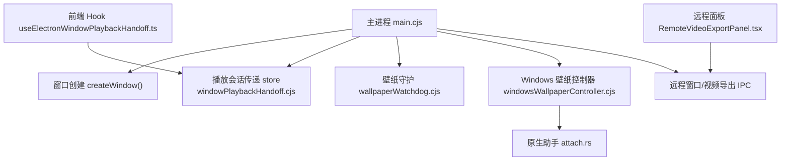
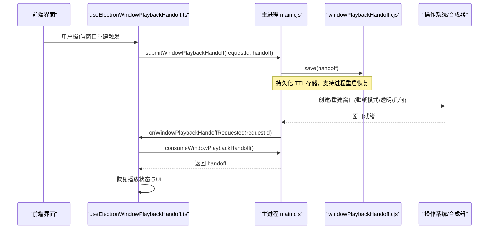
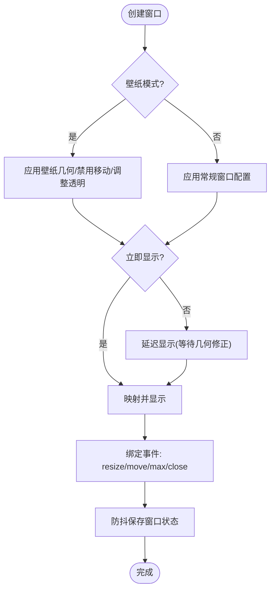
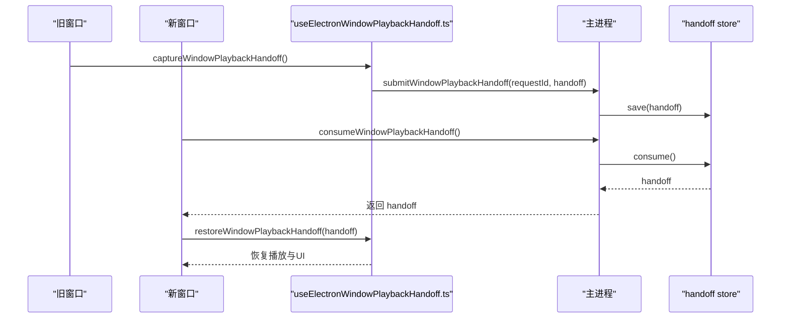
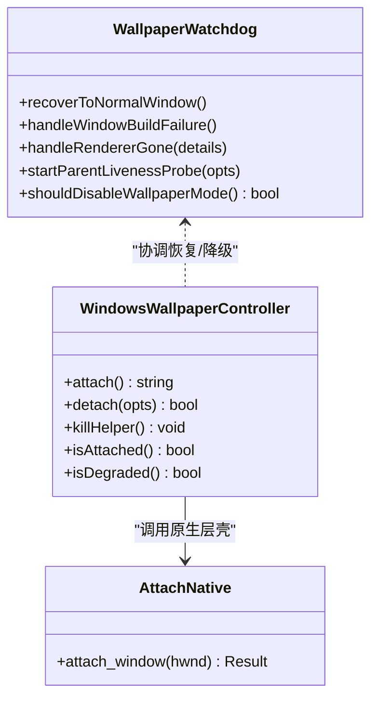
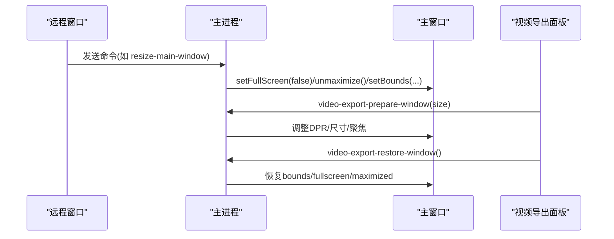
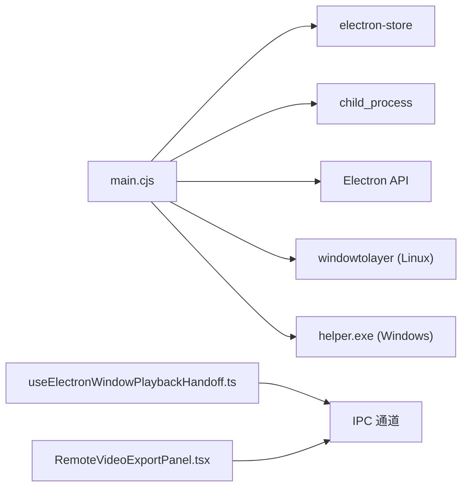

# 窗口管理系统

<cite>
**本文引用的文件**
- [main.cjs](file://electron/main.cjs)
- [windowPlaybackHandoff.cjs](file://electron/windowPlaybackHandoff.cjs)
- [wallpaperWatchdog.cjs](file://electron/wallpaperWatchdog.cjs)
- [windowsWallpaperController.cjs](file://electron/windowsWallpaperController.cjs)
- [attach.rs](file://packaging/windows/wallpaper-helper/src/attach.rs)
- [useElectronWindowPlaybackHandoff.ts](file://src/hooks/useElectronWindowPlaybackHandoff.ts)
- [RemoteVideoExportPanel.tsx](file://src/components/remote/RemoteVideoExportPanel.tsx)
- [package.json](file://package.json)
</cite>

## 目录
1. [简介](#简介)
2. [项目结构](#项目结构)
3. [核心组件](#核心组件)
4. [架构总览](#架构总览)
5. [详细组件分析](#详细组件分析)
6. [依赖关系分析](#依赖关系分析)
7. [性能考虑](#性能考虑)
8. [故障排查指南](#故障排查指南)
9. [结论](#结论)
10. [附录](#附录)

## 简介
本技术文档系统性解析 Folia Player 的窗口管理系统，覆盖主窗口创建与配置、状态持久化与边界恢复、多窗口生命周期（主窗口、远程控制窗口、视频导出窗口）、播放会话跨窗口传递、壁纸模式下的跨平台实现差异（X11/Wayland/Windows WorkerW）、高级交互特性（点击穿透、置顶、任务栏隐藏）以及 UI 与底层窗口状态同步机制。同时给出渲染优化、内存管理与 GPU 加速等最佳实践建议。

## 项目结构
窗口管理相关代码主要分布在 Electron 主进程与前端 Hook/组件中：
- 主进程入口与窗口生命周期：electron/main.cjs
- 播放会话跨进程/重启传递：electron/windowPlaybackHandoff.cjs
- 壁纸模式守护与恢复：electron/wallpaperWatchdog.cjs
- Windows 壁纸辅助进程控制：electron/windowsWallpaperController.cjs
- Windows 原生层壳集成：packaging/windows/wallpaper-helper/src/attach.rs
- 前端侧播放会话捕获与恢复：src/hooks/useElectronWindowPlaybackHandoff.ts
- 远程窗口与视频导出面板：src/components/remote/RemoteVideoExportPanel.tsx
- 构建脚本与打包产物路径：package.json

**图表来源**
- [main.cjs:3832-3986](file://electron/main.cjs#L3832-L3986)
- [windowPlaybackHandoff.cjs:11-96](file://electron/windowPlaybackHandoff.cjs#L11-L96)
- [wallpaperWatchdog.cjs:27-176](file://electron/wallpaperWatchdog.cjs#L27-L176)
- [windowsWallpaperController.cjs:41-456](file://electron/windowsWallpaperController.cjs#L41-L456)
- [attach.rs:147-172](file://packaging/windows/wallpaper-helper/src/attach.rs#L147-L172)
- [useElectronWindowPlaybackHandoff.ts:174-449](file://src/hooks/useElectronWindowPlaybackHandoff.ts#L174-L449)
- [RemoteVideoExportPanel.tsx:1-199](file://src/components/remote/RemoteVideoExportPanel.tsx#L1-L199)

**章节来源**
- [main.cjs:1-140](file://electron/main.cjs#L1-L140)
- [package.json:43-47](file://package.json#L43-L47)

## 核心组件
- 主窗口工厂与配置：createWindow() 负责根据壁纸模式、透明背景、缩放与显示几何计算窗口参数，并注册事件监听与状态保存。
- 播放会话传递：通过 windowPlaybackHandoffStore 在窗口重建或进程重启时缓存并恢复播放快照（歌曲、进度、队列、歌词、UI 状态）。
- 壁纸模式守护：wallpaperWatchdog.cjs 提供 X11/Wayland 场景下的父进程存活探测、崩溃循环保护与自动降级到普通窗口。
- Windows 壁纸控制器：windowsWallpaperController.cjs 管理 folia-wallpaper-helper.exe 子进程，处理心跳、重连、鼠标注入与桌面层级切换。
- 原生层壳集成：attach.rs 负责将窗口父子关系挂入 WorkerW，处理 Win10/Win11 不同桌面架构的差异。
- 前端侧会话恢复：useElectronWindowPlaybackHandoff.ts 捕获当前播放快照并通过 IPC 提交/消费，确保 UI 与底层一致。
- 远程与导出：远程窗口与视频导出面板通过 IPC 驱动主窗口尺寸、全屏/最大化状态与捕获源选择。

**章节来源**
- [main.cjs:3832-3986](file://electron/main.cjs#L3832-L3986)
- [windowPlaybackHandoff.cjs:11-96](file://electron/windowPlaybackHandoff.cjs#L11-L96)
- [wallpaperWatchdog.cjs:27-176](file://electron/wallpaperWatchdog.cjs#L27-L176)
- [windowsWallpaperController.cjs:41-456](file://electron/windowsWallpaperController.cjs#L41-L456)
- [attach.rs:147-172](file://packaging/windows/wallpaper-helper/src/attach.rs#L147-L172)
- [useElectronWindowPlaybackHandoff.ts:174-449](file://src/hooks/useElectronWindowPlaybackHandoff.ts#L174-L449)
- [RemoteVideoExportPanel.tsx:1-199](file://src/components/remote/RemoteVideoExportPanel.tsx#L1-L199)

## 架构总览
Folia 的窗口管理采用“主进程集中控制 + 前端 Hook 协作”的分层架构：
- 主进程负责窗口实例、系统级能力（壁纸模式、任务栏、托盘、屏幕热插拔）与 IPC 路由。
- 前端 Hook 负责采集/恢复播放会话，并在需要时触发主进程重建窗口。
- 壁纸模式通过平台特定组件（Linux Wayland/X11 使用 windowtolayer；Windows 使用 helper.exe）完成桌面层嵌入。
- 多窗口（主窗口、远程窗口、视频导出）通过统一的 IPC 命令与快照机制保持状态一致性。

**图表来源**
- [useElectronWindowPlaybackHandoff.ts:392-449](file://src/hooks/useElectronWindowPlaybackHandoff.ts#L392-L449)
- [main.cjs:4798-4816](file://electron/main.cjs#L4798-L4816)
- [windowPlaybackHandoff.cjs:11-96](file://electron/windowPlaybackHandoff.cjs#L11-L96)

## 详细组件分析

### 主窗口创建与管理
- 窗口配置选项：
  - 壁纸模式：X11 使用 type:'desktop'；Wayland 由 windowtolayer 包裹；Windows 通过 helper 将窗口挂入 WorkerW。
  - 透明背景：根据平台与壁纸模式动态启用，经典桌面模式下强制不透明以避免黑屏。
  - 几何与缩放：延迟显示以修正 KWin 缩放导致的 work-area 裁剪；全屏/最大化状态恢复。
  - 行为开关：alwaysOnTop、skipTaskbar、resizable/movable 在壁纸模式下禁用。
- 状态持久化与边界恢复：
  - 窗口大小/位置/最大化状态在 resize/move/maximize/unmaximize/close 事件中防抖保存。
  - 壁纸窗口跳过持久化，避免覆盖退出壁纸模式后的正常窗口恢复。
- 事件与资源：
  - render-process-gone 触发壁纸守护恢复；Windows 下仅 reload webContents。
  - 托盘菜单刷新、任务栏按钮更新、显示热插拔几何重算。

**图表来源**
- [main.cjs:3832-3986](file://electron/main.cjs#L3832-L3986)
- [main.cjs:1101-1129](file://electron/main.cjs#L1101-L1129)

**章节来源**
- [main.cjs:3832-3986](file://electron/main.cjs#L3832-L3986)
- [main.cjs:1101-1129](file://electron/main.cjs#L1101-L1129)

### 播放会话跨窗口传递
- 捕获：前端 Hook 收集当前播放上下文（音频、歌词、队列、进度、UI 状态），生成 handoff 对象。
- 提交：通过 IPC 提交到主进程，写入带 TTL 的持久化存储，支持进程重启后恢复。
- 请求与消费：新窗口启动后向旧窗口请求 handoff，消费一次并恢复播放与 UI。
- 透明模式切换：切换透明背景时携带 handoff，确保重建窗口后无缝恢复。

**图表来源**
- [useElectronWindowPlaybackHandoff.ts:174-449](file://src/hooks/useElectronWindowPlaybackHandoff.ts#L174-L449)
- [main.cjs:4798-4816](file://electron/main.cjs#L4798-L4816)
- [windowPlaybackHandoff.cjs:11-96](file://electron/windowPlaybackHandoff.cjs#L11-L96)

**章节来源**
- [useElectronWindowPlaybackHandoff.ts:174-449](file://src/hooks/useElectronWindowPlaybackHandoff.ts#L174-L449)
- [main.cjs:4798-4816](file://electron/main.cjs#L4798-L4816)
- [windowPlaybackHandoff.cjs:11-96](file://electron/windowPlaybackHandoff.cjs#L11-L96)

### 壁纸模式跨平台实现
- X11/Wayland：
  - Wayland：通过 windowtolayer 包装进程，设置 layer=bottom 与 interactivity=all，失败时回退到普通窗口。
  - X11：将主窗口类型设为 desktop，覆盖整个工作区；点击穿透不可用（避免被 KDE 桌面窗口覆盖）。
  - 守护：检测父进程存活、渲染崩溃、构建失败，自动降级到普通窗口并重启。
- Windows：
  - 通过 folia-wallpaper-helper.exe 将窗口父子关系挂入 WorkerW，支持 Win10/Win11 两种桌面架构。
  - 运行时 attach/detach，无需进程重启；鼠标输入经 helper 转发至 Chromium 输入管线。
  - 健康监控：心跳超时、WorkerW 销毁、Explorer 重启等事件触发重连或重建。

**图表来源**
- [wallpaperWatchdog.cjs:27-176](file://electron/wallpaperWatchdog.cjs#L27-L176)
- [windowsWallpaperController.cjs:41-456](file://electron/windowsWallpaperController.cjs#L41-L456)
- [attach.rs:147-172](file://packaging/windows/wallpaper-helper/src/attach.rs#L147-L172)

**章节来源**
- [wallpaperWatchdog.cjs:27-176](file://electron/wallpaperWatchdog.cjs#L27-L176)
- [windowsWallpaperController.cjs:41-456](file://electron/windowsWallpaperController.cjs#L41-L456)
- [attach.rs:147-172](file://packaging/windows/wallpaper-helper/src/attach.rs#L147-L172)

### 多窗口生命周期管理
- 主窗口：统一由 createWindow() 创建，支持透明/壁纸/置顶/任务栏隐藏等配置；关闭时清理资源并关闭远程窗口。
- 远程控制窗口：独立 BrowserWindow，固定标题与最小化能力，加载 remote 入口，接收主窗口快照与命令。
- 视频导出窗口：通过 IPC 调整主窗口尺寸、全屏/最大化状态，选择捕获源，完成后恢复原状。

**图表来源**
- [main.cjs:3614-3658](file://electron/main.cjs#L3614-L3658)
- [main.cjs:5148-5175](file://electron/main.cjs#L5148-L5175)
- [main.cjs:5217-5271](file://electron/main.cjs#L5217-L5271)
- [RemoteVideoExportPanel.tsx:1-199](file://src/components/remote/RemoteVideoExportPanel.tsx#L1-L199)

**章节来源**
- [main.cjs:3614-3658](file://electron/main.cjs#L3614-L3658)
- [main.cjs:5148-5175](file://electron/main.cjs#L5148-L5175)
- [main.cjs:5217-5271](file://electron/main.cjs#L5217-L5271)
- [RemoteVideoExportPanel.tsx:1-199](file://src/components/remote/RemoteVideoExportPanel.tsx#L1-L199)

### 高级交互特性
- 点击穿透：
  - 主窗口支持开启/关闭点击穿透，并提供解锁热点区域与悬停计时器，便于临时恢复交互。
  - 壁纸模式下拒绝点击穿透（X11 会穿透到桌面并被提升覆盖；Windows 已无法接收点击）。
- 置顶显示：
  - 主窗口与远程窗口均支持 alwaysOnTop，壁纸模式下对主窗口无效。
- 任务栏隐藏：
  - 主窗口与远程窗口均可 skipTaskbar，配合托盘菜单切换。

**章节来源**
- [main.cjs:720-784](file://electron/main.cjs#L720-L784)
- [main.cjs:3832-3986](file://electron/main.cjs#L3832-L3986)
- [main.cjs:4818-4840](file://electron/main.cjs#L4818-L4840)

### 窗口状态同步机制
- 主进程维护窗口状态（置顶、点击穿透、任务栏隐藏、透明模式），并通过 IPC 通知前端。
- 前端 Hook 订阅变更事件，更新 UI 状态，保证视图与底层一致。
- 远程窗口与主窗口之间通过快照与命令通道保持播放状态同步。

**章节来源**
- [main.cjs:4798-4840](file://electron/main.cjs#L4798-L4840)
- [useElectronWindowPlaybackHandoff.ts:392-449](file://src/hooks/useElectronWindowPlaybackHandoff.ts#L392-L449)

## 依赖关系分析
- 主进程依赖：
  - electron-store 用于持久化设置与 handoff。
  - child_process 用于 spawn windowtolayer 与 helper.exe。
  - screen、BrowserWindow、Tray、dialog 等系统模块。
- 平台依赖：
  - Linux：windowtolayer 二进制（可环境变量覆盖路径）。
  - Windows：folia-wallpaper-helper.exe（可环境变量覆盖路径）。
- 前端依赖：
  - React Hook 封装 IPC 与手递手逻辑。
  - 远程面板通过 IPC 驱动主窗口行为。

**图表来源**
- [main.cjs:1-29](file://electron/main.cjs#L1-L29)
- [package.json:43-47](file://package.json#L43-L47)
- [useElectronWindowPlaybackHandoff.ts:392-449](file://src/hooks/useElectronWindowPlaybackHandoff.ts#L392-L449)
- [RemoteVideoExportPanel.tsx:1-199](file://src/components/remote/RemoteVideoExportPanel.tsx#L1-L199)

**章节来源**
- [main.cjs:1-29](file://electron/main.cjs#L1-L29)
- [package.json:43-47](file://package.json#L43-L47)

## 性能考虑
- 渲染优化：
  - 壁纸模式禁用 backgroundThrottling，确保前台展示流畅。
  - 透明背景与原生模糊仅在支持的平台启用，避免不必要的合成开销。
- 内存管理：
  - 窗口状态保存防抖，减少频繁磁盘写入。
  - handoff 存储带 TTL，过期自动清理，避免持久化膨胀。
- GPU 加速：
  - Linux 支持 system/swiftshader/software 三种图形模式，AppImage 默认 swiftshader 规避 Vulkan 问题。
  - macOS x64 忽略 GPU 黑名单并使用 GL 后端，启用 GPU Rasterization。
- 输入与事件：
  - Windows 壁纸模式通过 sendInputEvent 注入鼠标事件，避免 TrackMouseEvent 抖动导致的高频 enter/leave。
  - 滚动事件按 CSS 像素校准，减少误判与重复计算。

**章节来源**
- [main.cjs:78-137](file://electron/main.cjs#L78-L137)
- [main.cjs:3832-3986](file://electron/main.cjs#L3832-L3986)
- [main.cjs:325-416](file://electron/main.cjs#L325-L416)
- [windowPlaybackHandoff.cjs:11-96](file://electron/windowPlaybackHandoff.cjs#L11-L96)

## 故障排查指南
- 壁纸模式失效：
  - 检查 windowtolayer/helper.exe 是否存在与权限；查看日志中的 missing/error 提示。
  - 若连续失败达到阈值，会自动禁用壁纸模式并降级为普通窗口。
- 渲染崩溃恢复：
  - 壁纸模式下渲染崩溃会尝试恢复；Windows 仅 reload webContents，非致命。
- 点击穿透异常：
  - 确认未处于壁纸模式；检查解锁热点是否激活与悬停计时器。
- 窗口状态不一致：
  - 检查 IPC 命令是否成功执行；确认远程窗口与主窗口之间的快照同步。
- 导出窗口尺寸错误：
  - 校验 exportSize 合法性；确认主窗口非全屏/最大化后再设置 bounds。

**章节来源**
- [wallpaperWatchdog.cjs:80-176](file://electron/wallpaperWatchdog.cjs#L80-L176)
- [windowsWallpaperController.cjs:147-172](file://electron/windowsWallpaperController.cjs#L147-L172)
- [main.cjs:3911-3922](file://electron/main.cjs#L3911-L3922)
- [main.cjs:5217-5271](file://electron/main.cjs#L5217-L5271)

## 结论
Folia 的窗口管理系统通过主进程集中控制与前端 Hook 协作，实现了跨平台的壁纸模式、多窗口生命周期管理、播放会话跨窗口传递与高级交互特性。借助守护与降级机制，系统在异常情况下具备自愈能力；结合渲染优化与内存管理策略，保证了良好的用户体验与稳定性。

## 附录
- 构建与打包：
  - Linux 构建 windowtolayer 与软件渲染开关。
  - Windows 构建 wallpaper-helper 并集成到资源目录。
- 环境变量：
  - FOLIA_WINDOWTOLAYER_PATH、FOLIA_WALLPAPER_HELPER_PATH 用于开发环境覆盖二进制路径。
  - WAYLAND_DISPLAY、FOLIA_WRAPPED_BY_WINDOWTOLAYER 用于识别运行环境与模式。

**章节来源**
- [package.json:43-47](file://package.json#L43-L47)
- [main.cjs:183-226](file://electron/main.cjs#L183-L226)