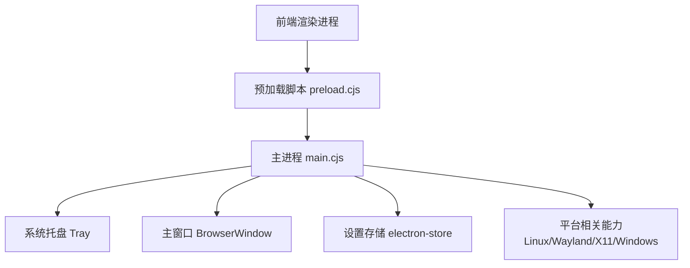
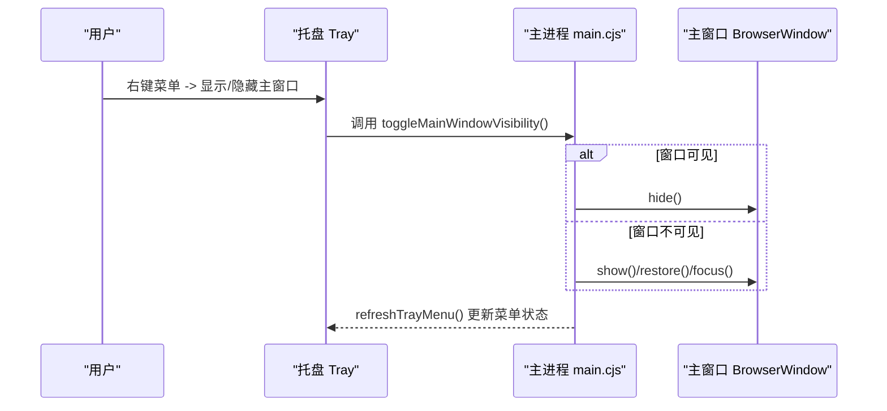
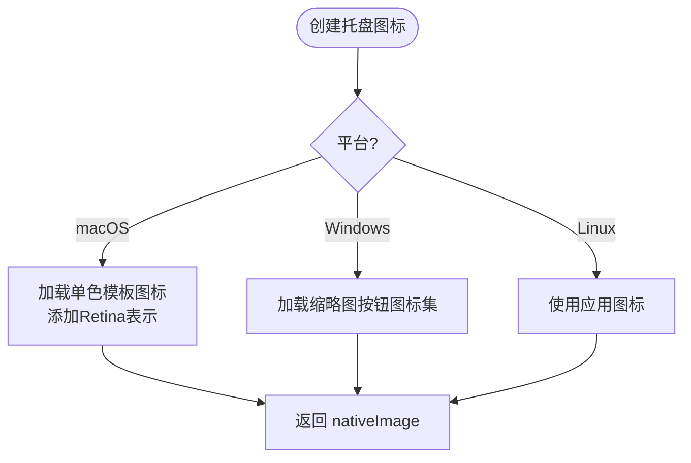
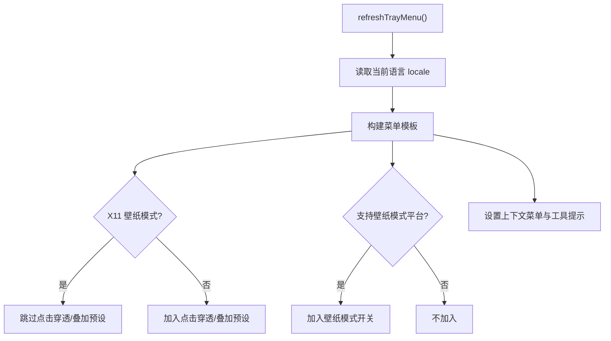
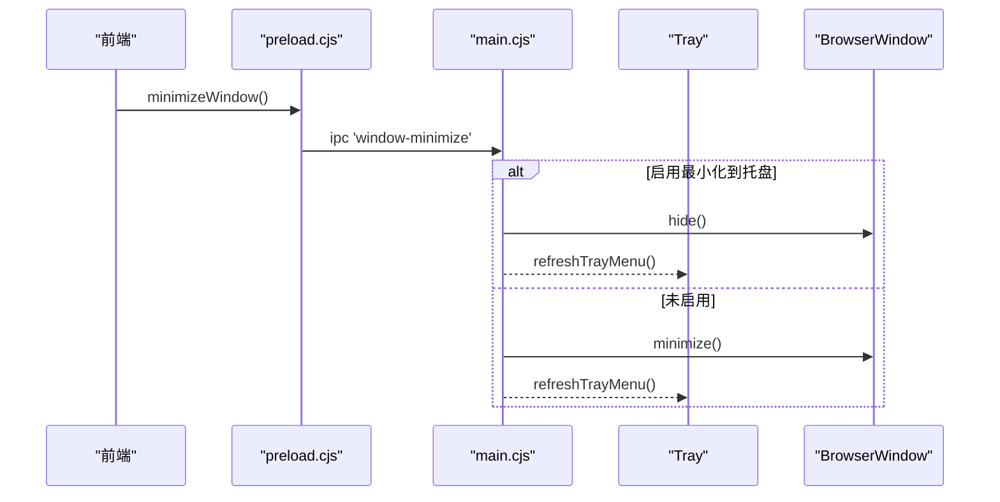
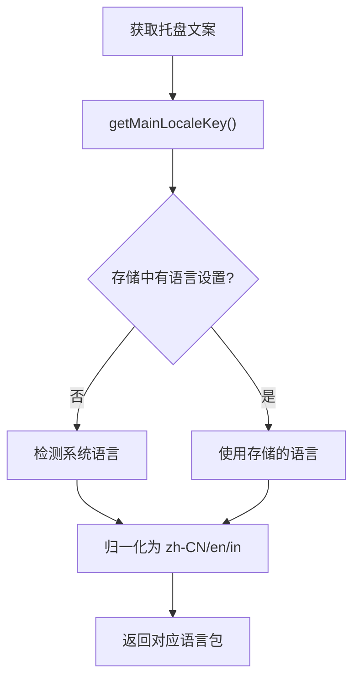
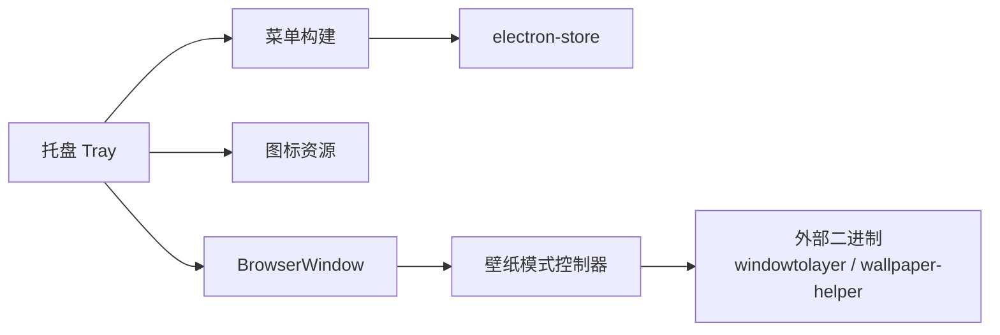

# 系统托盘集成

<cite>
**本文引用的文件**
- [electron/main.cjs](file://electron/main.cjs)
- [electron/preload.cjs](file://electron/preload.cjs)
- [src/components/modal/settings/DesktopSettingsSubview.tsx](file://src/components/modal/settings/DesktopSettingsSubview.tsx)
- [src/components/modal/UserGuidePageContent.tsx](file://src/components/modal/UserGuidePageContent.tsx)
</cite>

## 目录
1. [简介](#简介)
2. [项目结构](#项目结构)
3. [核心组件](#核心组件)
4. [架构总览](#架构总览)
5. [详细组件分析](#详细组件分析)
6. [依赖关系分析](#依赖关系分析)
7. [性能考量](#性能考量)
8. [故障排查指南](#故障排查指南)
9. [结论](#结论)
10. [附录](#附录)

## 简介
本文件系统性梳理 Folia Player 在 Electron 主进程中的系统托盘集成实现，覆盖托盘图标创建与管理、上下文菜单构建与动态更新、用户交互事件处理、多语言本地化、跨平台差异（Windows/macOS/Linux）、与主窗口的联动（最小化到托盘、显示/隐藏切换、状态同步）以及性能优化建议。文档以代码级事实为依据，配合流程图与时序图帮助读者快速理解整体机制与关键路径。

## 项目结构
托盘功能主要由 Electron 主进程集中实现，前端仅通过 IPC 触发窗口控制（如最小化），并在设置界面提供“最小化到托盘”的开关。关键位置如下：
- 托盘生命周期与菜单：electron/main.cjs
- 托盘图标资源与平台适配：electron/main.cjs
- 前端最小化入口：electron/preload.cjs
- 设置项 UI：src/components/modal/settings/DesktopSettingsSubview.tsx
- 用户引导中关于托盘操作的提示：src/components/modal/UserGuidePageContent.tsx

图表来源
- [electron/main.cjs:1400-1500](file://electron/main.cjs#L1400-L1500)
- [electron/preload.cjs:130-140](file://electron/preload.cjs#L130-L140)

章节来源
- [electron/main.cjs:1400-1500](file://electron/main.cjs#L1400-L1500)
- [electron/preload.cjs:130-140](file://electron/preload.cjs#L130-L140)
- [src/components/modal/settings/DesktopSettingsSubview.tsx:156-192](file://src/components/modal/settings/DesktopSettingsSubview.tsx#L156-L192)

## 核心组件
- 托盘实例与菜单管理：ensureTray、refreshTrayMenu
- 托盘图标创建与平台适配：createTrayIconImage、THUMBAR_BUTTON_ICONS（Windows 任务栏缩略图按钮）
- 窗口可见性控制：focusMainWindow、hideMainWindow、toggleMainWindowVisibility
- 最小化到托盘：ipcMain.handle('window-minimize')
- 多语言本地化：getMainLocaleKey/getMainLocale、mainLocale 映射
- 壁纸模式与点击穿透：isWallpaperModeEnabled、setMainWindowClickThroughEnabled、setMainWindowOverlayPreset
- 任务栏图标隐藏：persistMainWindowSkipTaskbarEnabled

章节来源
- [electron/main.cjs:1400-1500](file://electron/main.cjs#L1400-L1500)
- [electron/main.cjs:809-868](file://electron/main.cjs#L809-L868)
- [electron/main.cjs:1286-1344](file://electron/main.cjs#L1286-L1344)
- [electron/main.cjs:4690-4715](file://electron/main.cjs#L4690-L4715)
- [electron/main.cjs:607-717](file://electron/main.cjs#L607-L717)

## 架构总览
托盘作为系统级入口，承载以下职责：
- 图标展示与工具提示
- 右键菜单：显示/隐藏主窗口、打开遥控窗口、点击穿透、叠加预设、壁纸模式、隐藏任务栏图标、退出
- 事件响应：单击托盘图标显示/聚焦主窗口
- 与主窗口状态联动：最小化到托盘、任务栏图标显隐、透明/置顶/穿透等呈现模式
- 多语言：菜单文案根据当前语言动态生成

图表来源
- [electron/main.cjs:1426-1500](file://electron/main.cjs#L1426-L1500)
- [electron/main.cjs:1286-1323](file://electron/main.cjs#L1286-L1323)

章节来源
- [electron/main.cjs:1426-1500](file://electron/main.cjs#L1426-L1500)
- [electron/main.cjs:1286-1323](file://electron/main.cjs#L1286-L1323)

## 详细组件分析

### 托盘图标与资源管理
- macOS：使用模板图片并添加 Retina 表示，确保在不同缩放比例下清晰显示。若资源为空则回退到应用图标。
- Windows：支持任务栏缩略图按钮（上一首/播放/暂停/下一首），按需加载并统一缩放到 16x16。
- Linux：直接使用应用图标路径。

图表来源
- [electron/main.cjs:831-868](file://electron/main.cjs#L831-L868)
- [electron/main.cjs:809-829](file://electron/main.cjs#L809-L829)

章节来源
- [electron/main.cjs:809-868](file://electron/main.cjs#L809-L868)

### 上下文菜单的动态生成
菜单项根据运行环境与设置动态变化：
- 基础项：显示/隐藏主窗口、打开遥控窗口、重置窗口、隐藏任务栏图标、退出
- 条件项：
  - 点击穿透与叠加预设：在非 X11 壁纸模式下可用
  - 壁纸模式：仅在支持平台（Windows/Linux）出现
- 每次状态变更都会刷新菜单，保证勾选框与开关与实际一致

图表来源
- [electron/main.cjs:1426-1500](file://electron/main.cjs#L1426-L1500)

章节来源
- [electron/main.cjs:1426-1500](file://electron/main.cjs#L1426-L1500)

### 用户交互与事件处理
- 托盘单击：若主窗口不可见则聚焦/显示；否则不做操作（由菜单控制隐藏）。
- 最小化到托盘：前端通过 IPC 请求最小化，主进程根据设置决定隐藏到托盘或系统最小化。
- 任务栏图标隐藏：通过设置持久化并立即生效，同时刷新菜单。

图表来源
- [electron/preload.cjs:130-140](file://electron/preload.cjs#L130-L140)
- [electron/main.cjs:4698-4715](file://electron/main.cjs#L4698-L4715)
- [electron/main.cjs:1286-1344](file://electron/main.cjs#L1286-L1344)

章节来源
- [electron/preload.cjs:130-140](file://electron/preload.cjs#L130-L140)
- [electron/main.cjs:4698-4715](file://electron/main.cjs#L4698-L4715)
- [electron/main.cjs:1286-1344](file://electron/main.cjs#L1286-L1344)

### 多语言支持与本地化
- 主进程维护三套托盘文案（zh-CN、en、in），并通过 getMainLocaleKey 从存储或系统语言推断当前语言。
- 菜单文本通过 locale.tray* 键取值，确保首次启动即按系统语言显示。

图表来源
- [electron/main.cjs:607-717](file://electron/main.cjs#L607-L717)

章节来源
- [electron/main.cjs:607-717](file://electron/main.cjs#L607-L717)

### 跨平台兼容性
- Windows：
  - 支持任务栏缩略图按钮（媒体控制）
  - 壁纸模式通过 helper 将窗口嵌入 WorkerW，关闭点击穿透以避免桌面层冲突
  - 运行时可重建窗口以切换壁纸模式
- macOS：
  - 托盘图标使用模板图片，适配深色/浅色与 Retina
  - 无壁纸模式入口
- Linux：
  - Wayland 下通过 windowtolayer 包装进程进入桌面层；X11 下为 _NET_WM_WINDOW_TYPE_DESKTOP
  - 壁纸模式开启时禁用点击穿透，避免点击穿透导致 KDE 桌面被遮挡
  - 图形后端与 Vulkan 等开关针对发行版问题做了兼容处理

章节来源
- [electron/main.cjs:145-226](file://electron/main.cjs#L145-L226)
- [electron/main.cjs:242-311](file://electron/main.cjs#L242-L311)
- [electron/main.cjs:165-176](file://electron/main.cjs#L165-L176)
- [electron/main.cjs:78-105](file://electron/main.cjs#L78-L105)

### 与主窗口的联动
- 显示/隐藏：toggleMainWindowVisibility 统一封装显示、恢复、聚焦与隐藏逻辑，并在变更后刷新托盘菜单。
- 最小化到托盘：通过 IPC 触发，依据设置选择隐藏到托盘或系统最小化。
- 任务栏图标隐藏：持久化后即时应用到窗口，并刷新菜单。
- 叠加预设：一键组合“置顶 + 透明 + 点击穿透”，并提供“重置窗口”恢复默认。

章节来源
- [electron/main.cjs:1286-1344](file://electron/main.cjs#L1286-L1344)
- [electron/main.cjs:1400-1424](file://electron/main.cjs#L1400-L1424)
- [electron/main.cjs:4698-4715](file://electron/main.cjs#L4698-L4715)

### 设置项与用户引导
- 设置页提供“最小化到托盘”开关，描述与文案来自 i18n。
- 用户引导中说明可通过托盘右键菜单进行“点击穿透”的恢复操作，便于用户在窗口控件不可达时快速调整。

章节来源
- [src/components/modal/settings/DesktopSettingsSubview.tsx:156-192](file://src/components/modal/settings/DesktopSettingsSubview.tsx#L156-L192)
- [src/components/modal/UserGuidePageContent.tsx:75-92](file://src/components/modal/UserGuidePageContent.tsx#L75-L92)

## 依赖关系分析
- 托盘模块依赖：
  - 存储 electron-store：读写 MINIMIZE_TO_TRAY、HIDE_TASKBAR_ICON、壁纸模式等设置
  - 平台能力：nativeImage、Tray、Menu、BrowserWindow
  - 外部二进制：windowtolayer（Linux）、folia-wallpaper-helper.exe（Windows）
  - 其他模块：wallpaperWatchdog、windowsWallpaperController、stageApi、modSystem 等（间接影响窗口呈现）

图表来源
- [electron/main.cjs:145-226](file://electron/main.cjs#L145-L226)
- [electron/main.cjs:242-311](file://electron/main.cjs#L242-L311)
- [electron/main.cjs:1426-1500](file://electron/main.cjs#L1426-L1500)

章节来源
- [electron/main.cjs:145-226](file://electron/main.cjs#L145-L226)
- [electron/main.cjs:242-311](file://electron/main.cjs#L242-L311)
- [electron/main.cjs:1426-1500](file://electron/main.cjs#L1426-L1500)

## 性能考量
- 图标缓存
  - Windows 缩略图按钮图标在模块初始化时一次性加载并缓存，避免重复 IO。
  - macOS 模板图标与 Retina 表示在创建时合并，减少后续绘制开销。
- 菜单延迟与节流
  - 菜单在状态变更时刷新，避免频繁重绘；壁纸模式切换采用定时器合并多次快速切换，降低重启频率。
- 内存管理
  - 托盘对象全局单例，避免重复创建；窗口销毁检查防止无效引用。
  - 外部二进制失败时降级并记录日志，避免阻塞主流程。
- 推荐实践
  - 对大图标资源进行按需加载与尺寸裁剪
  - 对高频状态变更（如壁纸模式）做防抖/节流
  - 对托盘菜单项启用 enabled 判断，减少无效渲染

章节来源
- [electron/main.cjs:809-829](file://electron/main.cjs#L809-L829)
- [electron/main.cjs:532-558](file://electron/main.cjs#L532-L558)
- [electron/main.cjs:1502-1522](file://electron/main.cjs#L1502-L1522)

## 故障排查指南
- 托盘图标创建失败
  - 现象：控制台报错无法创建托盘图标
  - 排查：确认平台资源路径存在；macOS 模板图片是否有效；回退逻辑是否生效
  - 参考：托盘创建 try/catch 与回退到应用图标
- 壁纸模式异常
  - 现象：切换壁纸模式失败或崩溃循环
  - 排查：检查外部二进制是否存在；Wayland 环境下是否成功 spawn；失败时是否自动降级
  - 参考：launchWrappedSelf 错误处理与重试计数
- 点击穿透与叠加预设
  - 现象：X11 壁纸模式下点击穿透不可用或行为异常
  - 排查：确认 isX11WallpaperMode 判定；菜单项是否正确屏蔽
  - 参考：菜单条件渲染与 preset 函数
- 最小化到托盘不生效
  - 现象：点击最小化仍显示在任务栏
  - 排查：确认设置项是否启用；IPC 是否到达主进程；壁纸模式下是否走隐藏路径
  - 参考：window-minimize 处理器与 isMinimizeToTrayEnabled

章节来源
- [electron/main.cjs:1502-1522](file://electron/main.cjs#L1502-L1522)
- [electron/main.cjs:199-226](file://electron/main.cjs#L199-L226)
- [electron/main.cjs:1445-1461](file://electron/main.cjs#L1445-L1461)
- [electron/main.cjs:4698-4715](file://electron/main.cjs#L4698-L4715)

## 结论
Folia Player 的系统托盘集成在主进程中实现了完整的生命周期管理、跨平台图标适配、动态菜单构建与多语言支持，并与主窗口紧密联动，提供最小化到托盘、点击穿透、叠加预设、壁纸模式等高级特性。通过合理的资源缓存、状态刷新策略与外部二进制容错机制，保证了在多平台环境下的稳定性与用户体验。建议在扩展新功能时遵循现有模式，保持菜单状态与窗口呈现的一致性，并持续优化性能与可维护性。

## 附录
- 相关设置键（部分）
  - MINIMIZE_TO_TRAY：最小化到托盘开关
  - HIDE_TASKBAR_ICON：隐藏任务栏图标
  - WALLPAPER_MODE_SETTING_KEY：壁纸模式开关
  - TRANSPARENT_PLAYER_BACKGROUND_SETTING_KEY：透明播放器背景
  - MAIN_WINDOW_ALWAYS_ON_TOP_SETTING_KEY：主窗口置顶
- 前端入口
  - 最小化：preload.cjs 暴露 minimizeWindow，供渲染进程调用
  - 设置界面：DesktopSettingsSubview.tsx 提供“最小化到托盘”开关与说明
  - 用户引导：UserGuidePageContent.tsx 说明通过托盘菜单恢复点击穿透

章节来源
- [electron/main.cjs:777-783](file://electron/main.cjs#L777-L783)
- [electron/preload.cjs:130-140](file://electron/preload.cjs#L130-L140)
- [src/components/modal/settings/DesktopSettingsSubview.tsx:156-192](file://src/components/modal/settings/DesktopSettingsSubview.tsx#L156-L192)
- [src/components/modal/UserGuidePageContent.tsx:75-92](file://src/components/modal/UserGuidePageContent.tsx#L75-L92)