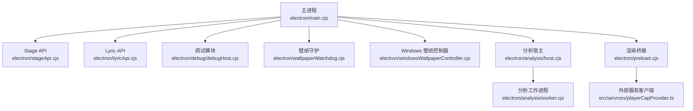
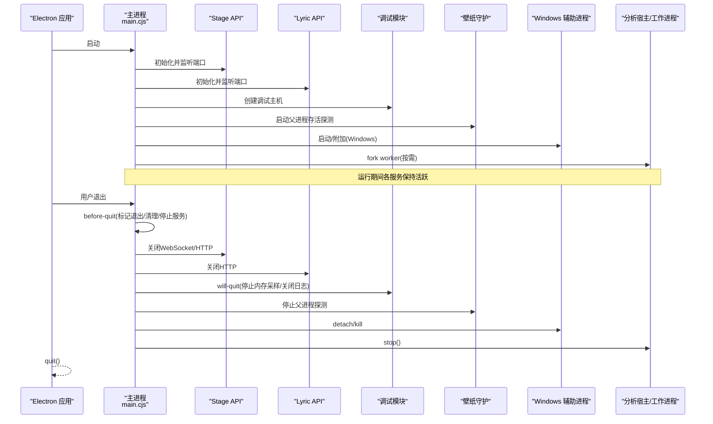
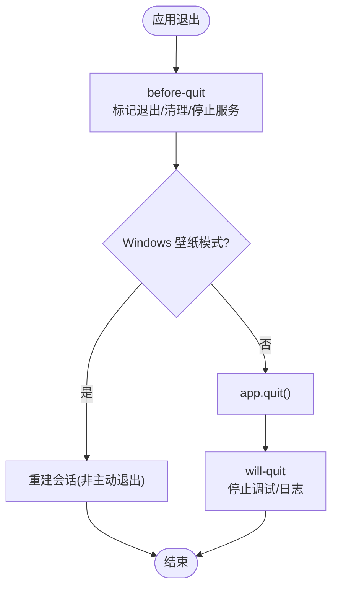
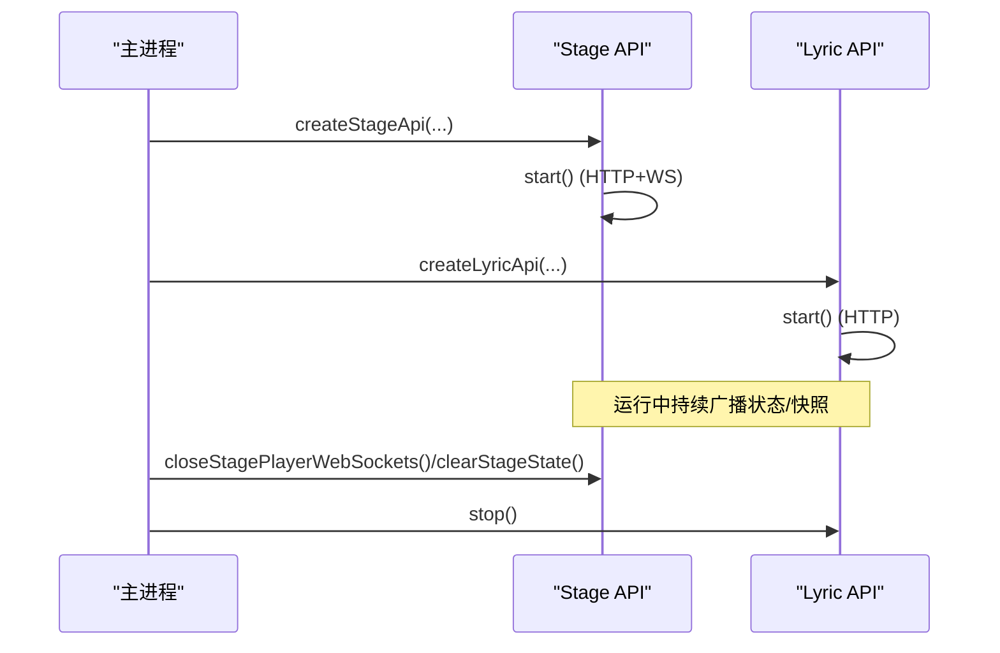
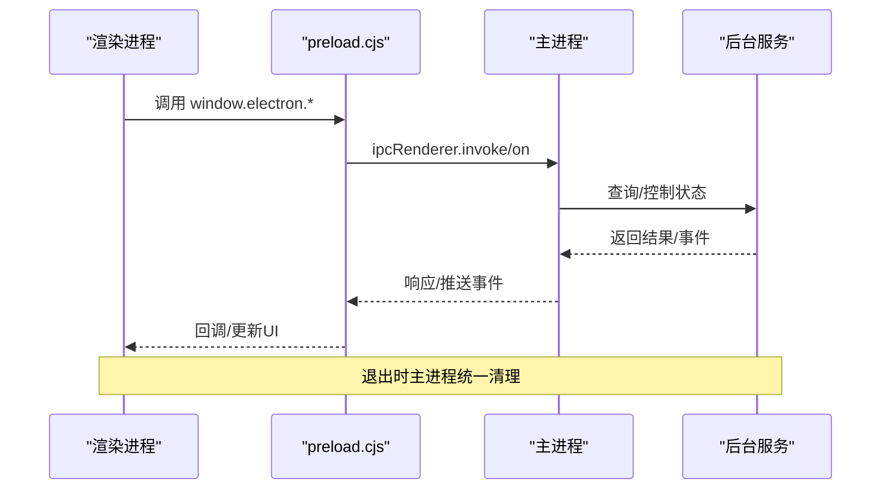
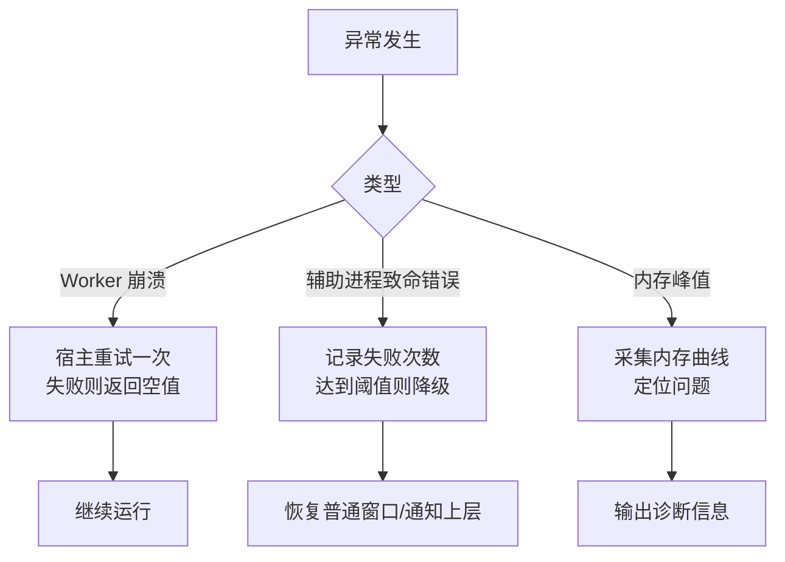
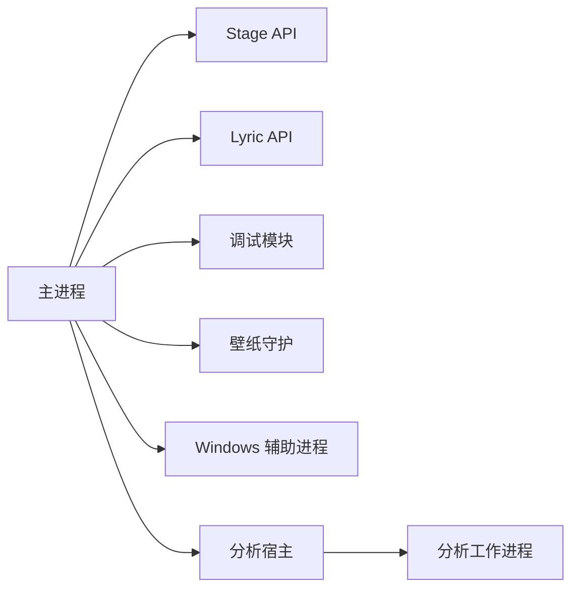

# 进程生命周期事件

<cite>
**本文引用的文件**
- [electron/main.cjs](file://electron/main.cjs)
- [electron/preload.cjs](file://electron/preload.cjs)
- [electron/stageApi.cjs](file://electron/stageApi.cjs)
- [electron/lyricApi.cjs](file://electron/lyricApi.cjs)
- [electron/debug/debugHost.cjs](file://electron/debug/debugHost.cjs)
- [electron/wallpaperWatchdog.cjs](file://electron/wallpaperWatchdog.cjs)
- [electron/windowsWallpaperController.cjs](file://electron/windowsWallpaperController.cjs)
- [electron/analysis/host.cjs](file://electron/analysis/host.cjs)
- [electron/analysis/worker.cjs](file://electron/analysis/worker.cjs)
- [src/services/playerCapProvider.ts](file://src/services/playerCapProvider.ts)
</cite>

## 目录
1. [简介](#简介)
2. [项目结构](#项目结构)
3. [核心组件](#核心组件)
4. [架构总览](#架构总览)
5. [详细组件分析](#详细组件分析)
6. [依赖关系分析](#依赖关系分析)
7. [性能考量](#性能考量)
8. [故障排查指南](#故障排查指南)
9. [结论](#结论)
10. [附录](#附录)

## 简介
本文件聚焦 Folia Player 在 Electron 主进程中的“进程生命周期事件”与“后台服务生命周期管理”，覆盖退出流程（before-quit、will-quit、quit）、异常恢复策略、IPC 连接生命周期、后台服务（OBS Browser Source、Stage API、Lyric API）的启停，以及资源清理、调试与日志、稳定性优化建议。目标是帮助开发者理解应用从启动到退出的完整生命周期，并在复杂场景（如壁纸模式、辅助子进程、本地 HTTP/WebSocket 服务）下保证稳定与可恢复。

## 项目结构
与进程生命周期直接相关的代码主要分布在 electron 目录：
- 主进程入口与全局事件：electron/main.cjs
- 渲染进程桥接与 IPC 暴露：electron/preload.cjs
- 后台服务：
  - Stage API（HTTP + WebSocket）：electron/stageApi.cjs
  - Lyric API（HTTP）：electron/lyricApi.cjs
- 调试与日志：electron/debug/debugHost.cjs
- 壁纸模式守护与 Windows 辅助进程控制：
  - wallpaperWatchdog.cjs
  - windowsWallpaperController.cjs
- 分析子进程（Utility Process）：electron/analysis/host.cjs、electron/analysis/worker.cjs
- 播放器能力提供者（WebSocket 重连）：src/services/playerCapProvider.ts

**图表来源**
- [electron/main.cjs:1-30](file://electron/main.cjs#L1-L30)
- [electron/stageApi.cjs:1-30](file://electron/stageApi.cjs#L1-L30)
- [electron/lyricApi.cjs:1-20](file://electron/lyricApi.cjs#L1-L20)
- [electron/debug/debugHost.cjs:1-20](file://electron/debug/debugHost.cjs#L1-L20)
- [electron/wallpaperWatchdog.cjs:95-134](file://electron/wallpaperWatchdog.cjs#L95-L134)
- [electron/windowsWallpaperController.cjs:121-174](file://electron/windowsWallpaperController.cjs#L121-L174)
- [electron/analysis/host.cjs:85-99](file://electron/analysis/host.cjs#L85-L99)
- [electron/analysis/worker.cjs:107-134](file://electron/analysis/worker.cjs#L107-L134)
- [electron/preload.cjs:1-20](file://electron/preload.cjs#L1-L20)
- [src/services/playerCapProvider.ts:176-195](file://src/services/playerCapProvider.ts#L176-L195)

**章节来源**
- [electron/main.cjs:1-30](file://electron/main.cjs#L1-L30)

## 核心组件
- 主进程生命周期事件处理
  - before-quit：标记退出、清理待处理的窗口交接请求、释放模组系统、停止语音输入暂停监控、显示休眠阻止器、优雅分离 Windows 壁纸助手、销毁 Discord 存在、停止 QQ API、停止 Lyric API。
  - will-quit：关闭调试模块的内存采样与运行时日志。
  - window-all-closed：在非 macOS 平台触发 app.quit；在 Windows 壁纸模式下若非主动退出则重建会话而非直接退出。
- 后台服务
  - Stage API：提供 HTTP 与 WebSocket 接口，维护会话、队列、播放状态，支持令牌鉴权与错误码。
  - Lyric API：提供只读歌词快照 HTTP 接口，支持启用/禁用与端口监听。
- 调试与日志
  - 运行时日志与内存曲线记录，支持开关、轮询间隔、写入模式（追加/覆盖）。
- 壁纸模式与辅助进程
  - Linux Wayland/X11 通过 windowtolayer 包装进程；Windows 通过 helper.exe 将窗口嵌入 WorkerW。
  - 心跳检测、崩溃循环保护、降级回退为普通窗口。
- 分析子进程
  - Utility Process fork worker，空闲时自动停止，模型目录变更或下载完成会重启 worker。
- 外部服务连接
  - PlayerCap 等 WebSocket 客户端具备断开重连与资源释放逻辑。

**章节来源**
- [electron/main.cjs:4235-4275](file://electron/main.cjs#L4235-L4275)
- [electron/debug/debugHost.cjs:293-297](file://electron/debug/debugHost.cjs#L293-L297)
- [electron/stageApi.cjs:169-225](file://electron/stageApi.cjs#L169-L225)
- [electron/lyricApi.cjs:83-100](file://electron/lyricApi.cjs#L83-L100)
- [electron/wallpaperWatchdog.cjs:95-134](file://electron/wallpaperWatchdog.cjs#L95-L134)
- [electron/windowsWallpaperController.cjs:121-174](file://electron/windowsWallpaperController.cjs#L121-L174)
- [electron/analysis/host.cjs:153-179](file://electron/analysis/host.cjs#L153-L179)
- [electron/analysis/worker.cjs:107-134](file://electron/analysis/worker.cjs#L107-L134)
- [src/services/playerCapProvider.ts:176-195](file://src/services/playerCapProvider.ts#L176-L195)

## 架构总览
下图展示主进程与各后台服务、辅助进程、调试模块之间的交互关系，以及退出时的资源释放顺序。

**图表来源**
- [electron/main.cjs:4235-4275](file://electron/main.cjs#L4235-L4275)
- [electron/stageApi.cjs:600-618](file://electron/stageApi.cjs#L600-L618)
- [electron/lyricApi.cjs:165-175](file://electron/lyricApi.cjs#L165-L175)
- [electron/debug/debugHost.cjs:293-297](file://electron/debug/debugHost.cjs#L293-L297)
- [electron/wallpaperWatchdog.cjs:95-134](file://electron/wallpaperWatchdog.cjs#L95-L134)
- [electron/windowsWallpaperController.cjs:121-174](file://electron/windowsWallpaperController.cjs#L121-L174)
- [electron/analysis/host.cjs:195-201](file://electron/analysis/host.cjs#L195-L201)

## 详细组件分析

### 退出事件执行顺序与处理逻辑
- before-quit
  - 设置 isAppQuitting 标志，避免误判窗口销毁为主动退出。
  - 清理窗口播放交接请求。
  - 释放模组系统、停止语音输入暂停监控、显示休眠阻止器。
  - 优雅分离 Windows 壁纸助手（detach），防止桌面层残留帧。
  - 销毁 Discord 存在、停止 QQ API、停止 Lyric API。
- will-quit
  - 停止内存采样定时器、关闭运行时日志与内存日志。
- window-all-closed
  - 非 macOS 平台调用 app.quit。
  - Windows 壁纸模式下若非主动退出，则重建会话而不是退出。

**图表来源**
- [electron/main.cjs:4235-4275](file://electron/main.cjs#L4235-L4275)
- [electron/debug/debugHost.cjs:293-297](file://electron/debug/debugHost.cjs#L293-L297)

**章节来源**
- [electron/main.cjs:4235-4275](file://electron/main.cjs#L4235-L4275)
- [electron/debug/debugHost.cjs:293-297](file://electron/debug/debugHost.cjs#L293-L297)

### 后台服务生命周期控制
- Stage API
  - 启动：根据配置决定是否启用，生成令牌，监听 HTTP 与 WebSocket。
  - 运行：维护当前媒体会话、歌词会话、播放快照、队列差异广播。
  - 停止：关闭所有 WebSocket 连接与服务端，清空状态数据，广播会话清除事件。
- Lyric API
  - 启动：读取启用标志，创建 HTTP 服务器并监听本地端口。
  - 运行：提供 /v1/lyric GET 接口返回脱敏后的歌词快照。
  - 停止：关闭服务器并广播状态变化。

**图表来源**
- [electron/stageApi.cjs:600-618](file://electron/stageApi.cjs#L600-L618)
- [electron/stageApi.cjs:767-785](file://electron/stageApi.cjs#L767-L785)
- [electron/lyricApi.cjs:141-175](file://electron/lyricApi.cjs#L141-L175)

**章节来源**
- [electron/stageApi.cjs:169-225](file://electron/stageApi.cjs#L169-L225)
- [electron/lyricApi.cjs:83-100](file://electron/lyricApi.cjs#L83-L100)
- [electron/stageApi.cjs:600-618](file://electron/stageApi.cjs#L600-L618)
- [electron/lyricApi.cjs:165-175](file://electron/lyricApi.cjs#L165-L175)

### 进程间通信的生命周期管理
- IPC 建立与使用
  - preload 暴露大量 IPC 方法给渲染进程，包括获取/保存设置、更新状态、打开外部链接、缓存操作、服务状态查询与控制等。
  - 主进程通过 ipcMain.handle/on 注册处理器，响应渲染进程请求。
- 断开重连
  - 外部服务（如 PlayerCap）的 WebSocket 客户端在断开后尝试重连，并在关闭时释放事件监听与 socket 引用。
- 资源清理
  - 退出前通过 before-quit 停止服务、断开连接、释放定时器与子进程引用，确保无悬挂资源。

**图表来源**
- [electron/preload.cjs:1-30](file://electron/preload.cjs#L1-L30)
- [electron/main.cjs:4255-4275](file://electron/main.cjs#L4255-L4275)
- [src/services/playerCapProvider.ts:176-195](file://src/services/playerCapProvider.ts#L176-L195)

**章节来源**
- [electron/preload.cjs:1-30](file://electron/preload.cjs#L1-L30)
- [src/services/playerCapProvider.ts:176-195](file://src/services/playerCapProvider.ts#L176-L195)

### 异常处理与恢复策略
- 未捕获异常与崩溃
  - 分析宿主对 worker 崩溃进行重试一次，随后返回空值以避免阻塞下游。
  - Windows 壁纸辅助进程出现致命错误时，记录失败次数，超过阈值则降级并禁用壁纸模式，通知上层恢复。
- 内存溢出与高占用
  - 文档指出 htdemucs 推理峰值来源于 ONNX Runtime 内存复用池，可通过 Python sidecar 关闭复用以降低峰值。
  - 调试模块提供内存采样与曲线记录，便于定位增长与峰值。
- 健康检查与自愈
  - 壁纸守护定期探测父进程存活，异常时恢复到普通窗口。
  - 分析宿主在模型目录变更或下载完成后重启 worker，使新权重生效。

**图表来源**
- [electron/analysis/host.cjs:153-179](file://electron/analysis/host.cjs#L153-L179)
- [electron/windowsWallpaperController.cjs:147-174](file://electron/windowsWallpaperController.cjs#L147-L174)
- [docs/automix-memory-optimization.md:21-24](file://docs/automix-memory-optimization.md#L21-L24)
- [electron/debug/debugHost.cjs:164-195](file://electron/debug/debugHost.cjs#L164-L195)

**章节来源**
- [electron/analysis/host.cjs:153-179](file://electron/analysis/host.cjs#L153-L179)
- [electron/windowsWallpaperController.cjs:147-174](file://electron/windowsWallpaperController.cjs#L147-L174)
- [docs/automix-memory-optimization.md:21-24](file://docs/automix-memory-optimization.md#L21-L24)
- [electron/debug/debugHost.cjs:164-195](file://electron/debug/debugHost.cjs#L164-L195)

### 资源清理机制
- 文件句柄与网络
  - Stage API 关闭 WebSocket 与服务端，清理会话目录与活动文件。
  - Lyric API 关闭 HTTP 服务器。
  - 调试模块关闭运行时日志与内存日志文件。
- 定时器与子进程
  - 壁纸守护停止父进程存活探测定时器。
  - Windows 壁纸控制器终止辅助进程并重置心跳与健康计时器。
  - 分析宿主在 will-quit 时停止 worker。
- 事件监听
  - 渲染进程通过 preload 暴露的方法订阅事件，退出时由主进程统一停止服务，避免悬挂监听。

**章节来源**
- [electron/stageApi.cjs:600-618](file://electron/stageApi.cjs#L600-L618)
- [electron/lyricApi.cjs:165-175](file://electron/lyricApi.cjs#L165-L175)
- [electron/debug/debugHost.cjs:197-201](file://electron/debug/debugHost.cjs#L197-L201)
- [electron/wallpaperWatchdog.cjs:120-134](file://electron/wallpaperWatchdog.cjs#L120-L134)
- [electron/windowsWallpaperController.cjs:130-145](file://electron/windowsWallpaperController.cjs#L130-L145)
- [electron/analysis/host.cjs:195-201](file://electron/analysis/host.cjs#L195-L201)

### 调试与日志记录机制
- 运行时日志
  - 默认关闭，开启后按日期写入 logs/runtime/*.log，支持追加/覆盖模式。
  - 主进程 console 被拦截写入同一文件，便于集中查看。
- 内存监控
  - 默认关闭，开启后每固定间隔采样工作集、CPU、堆信息等，写入 logs/memory/*.jsonl。
  - 支持渲染进程上报自身内存指标，合并到样本中。
- 诊断信息
  - 提供打开日志目录、查询状态、批量写入运行时行等功能。

**章节来源**
- [electron/debug/debugHost.cjs:21-37](file://electron/debug/debugHost.cjs#L21-L37)
- [electron/debug/debugHost.cjs:117-138](file://electron/debug/debugHost.cjs#L117-L138)
- [electron/debug/debugHost.cjs:164-195](file://electron/debug/debugHost.cjs#L164-L195)
- [electron/debug/debugHost.cjs:253-276](file://electron/debug/debugHost.cjs#L253-L276)

## 依赖关系分析
- 主进程依赖
  - Stage API、Lyric API、调试模块、壁纸守护、Windows 壁纸控制器、分析宿主。
- 子进程与外部服务
  - 分析宿主 fork worker；Windows 壁纸模式 spawn 辅助进程；外部服务通过 WebSocket 与 HTTP 接入。
- 耦合与内聚
  - 主进程作为协调者，集中管理生命周期与资源清理，降低子系统耦合度。
  - 各服务自包含启停逻辑，便于独立测试与替换。

**图表来源**
- [electron/main.cjs:1-30](file://electron/main.cjs#L1-L30)
- [electron/stageApi.cjs:1-30](file://electron/stageApi.cjs#L1-L30)
- [electron/lyricApi.cjs:1-20](file://electron/lyricApi.cjs#L1-L20)
- [electron/debug/debugHost.cjs:1-20](file://electron/debug/debugHost.cjs#L1-L20)
- [electron/wallpaperWatchdog.cjs:95-134](file://electron/wallpaperWatchdog.cjs#L95-L134)
- [electron/windowsWallpaperController.cjs:121-174](file://electron/windowsWallpaperController.cjs#L121-L174)
- [electron/analysis/host.cjs:85-99](file://electron/analysis/host.cjs#L85-L99)

**章节来源**
- [electron/main.cjs:1-30](file://electron/main.cjs#L1-L30)

## 性能考量
- 内存峰值控制
  - htdemucs 推理峰值主要来自 ONNX Runtime 内存复用池，建议关闭复用并通过 Python sidecar 执行以降低峰值。
  - 使用调试模块的内存曲线记录定位增长与峰值，避免长期运行导致内存膨胀。
- 子进程与定时器
  - 分析工作进程空闲时自动停止，减少常驻内存占用。
  - 壁纸守护与心跳检测使用 unref 定时器，避免阻止进程退出。
- 网络与 I/O
  - Stage API 与 Lyric API 限制请求体大小与并发，避免资源耗尽。
  - 退出时及时关闭服务器与连接，减少悬挂句柄。

[本节为通用指导，不直接分析具体文件]

## 故障排查指南
- 退出卡住或资源泄露
  - 检查 before-quit 是否调用了所有服务的 stop/close。
  - 确认壁纸守护与 Windows 辅助进程是否正确 detach/kill。
- 服务不可用
  - 检查 Stage/Lyric API 的端口与令牌配置，确认启用标志。
  - 查看调试模块的运行时日志与内存日志，定位错误与异常。
- 崩溃循环
  - 观察 Windows 壁纸辅助进程的失败计数与降级行为，必要时手动禁用壁纸模式。
  - 分析宿主对 worker 崩溃的重试策略，关注模型目录变更后的重启。

**章节来源**
- [electron/main.cjs:4235-4275](file://electron/main.cjs#L4235-L4275)
- [electron/windowsWallpaperController.cjs:147-174](file://electron/windowsWallpaperController.cjs#L147-L174)
- [electron/stageApi.cjs:600-618](file://electron/stageApi.cjs#L600-L618)
- [electron/lyricApi.cjs:165-175](file://electron/lyricApi.cjs#L165-L175)
- [electron/debug/debugHost.cjs:253-276](file://electron/debug/debugHost.cjs#L253-L276)

## 结论
Folia Player 在主进程中通过明确的生命周期事件（before-quit、will-quit、window-all-closed）协调各后台服务与辅助进程，确保退出时资源正确释放。Stage API 与 Lyric API 提供稳定的本地集成能力，调试模块提供运行时与内存的诊断工具。壁纸模式与辅助进程具备健壮的恢复与降级机制。结合内存优化与监控，可在复杂场景下保持应用的稳定性与可维护性。

[本节为总结，不直接分析具体文件]

## 附录
- 关键配置键
  - STAGE_MODE_ENABLED、STAGE_MODE_SOURCE、STAGE_API_TOKEN、STAGE_API_PORT
  - LYRIC_API_ENABLED
  - WALLPAPER_MODE、WALLPAPER_FORWARD_MOUSE、WALLPAPER_ZGUARD
  - ENABLE_UPDATE_CHECK、ENABLE_AUTO_UPDATE、UPDATE_CHANNEL
- 常用 IPC 通道
  - 设置读写、服务状态查询与控制、窗口透明模式、任务栏按钮更新、远程遥控、视频导出、Whisper 对齐进度等。

**章节来源**
- [electron/main.cjs:768-793](file://electron/main.cjs#L768-L793)
- [electron/preload.cjs:73-100](file://electron/preload.cjs#L73-L100)
- [electron/preload.cjs:161-174](file://electron/preload.cjs#L161-L174)
- [electron/preload.cjs:229-246](file://electron/preload.cjs#L229-L246)