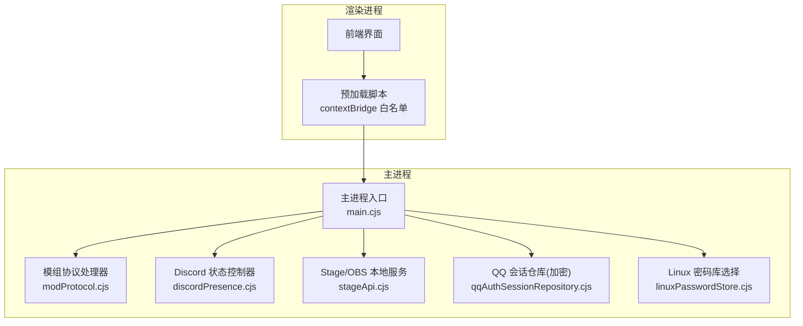
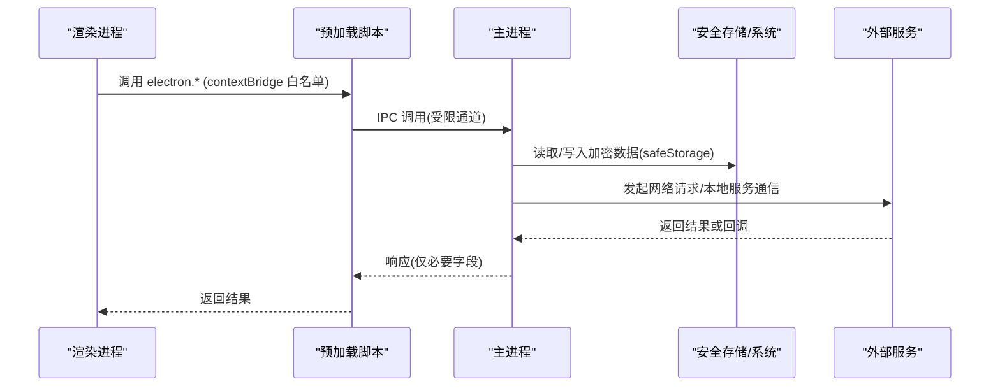
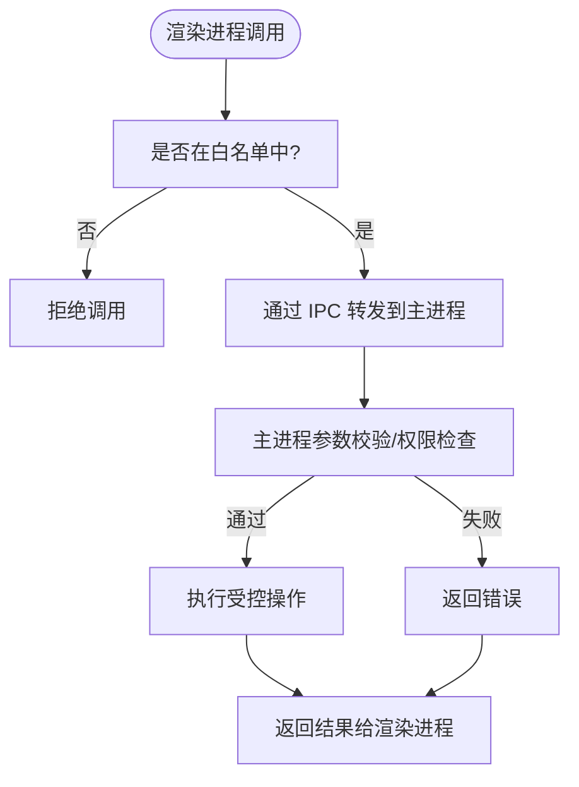
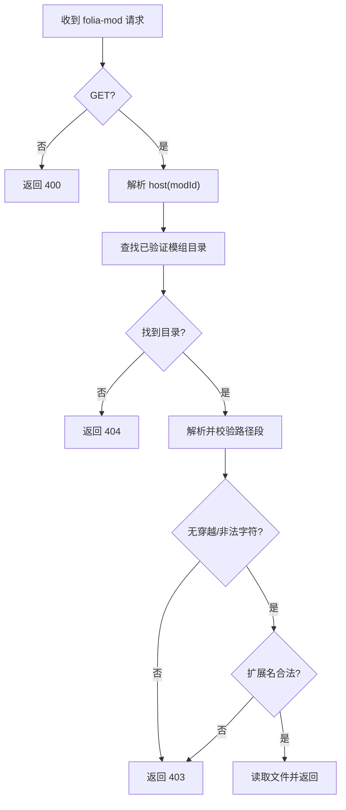
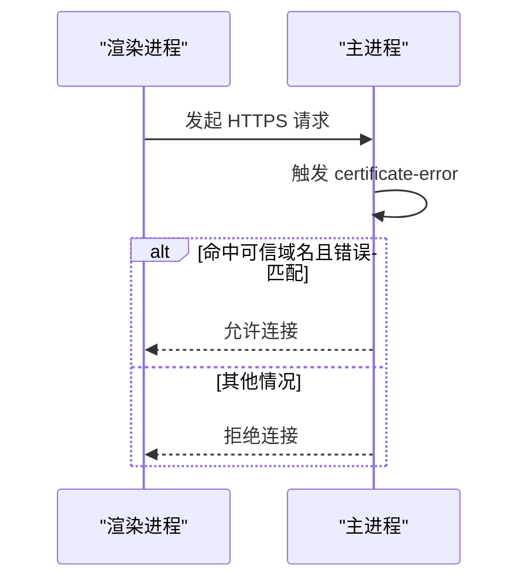
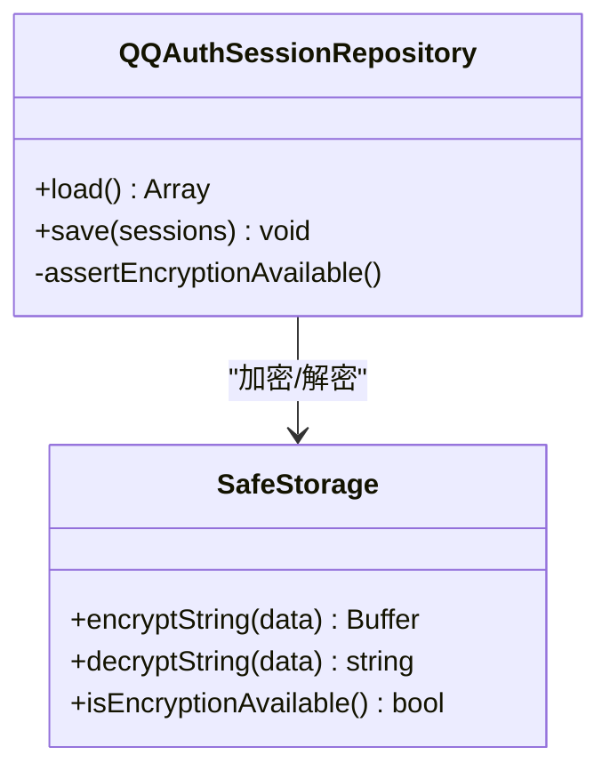
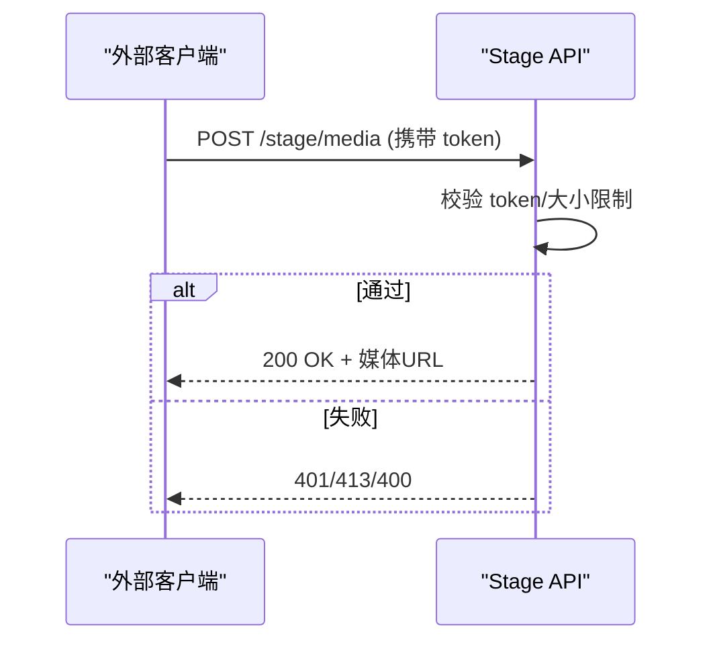
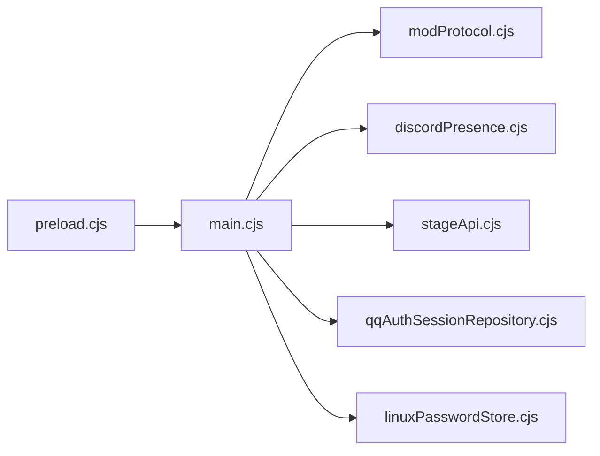

# 安全模型设计

<cite>
**本文引用的文件**
- [electron/main.cjs](file://electron/main.cjs)
- [electron/preload.cjs](file://electron/preload.cjs)
- [electron/modSystem/modProtocol.cjs](file://electron/modSystem/modProtocol.cjs)
- [electron/discordPresence.cjs](file://electron/discordPresence.cjs)
- [electron/stageApi.cjs](file://electron/stageApi.cjs)
- [electron/linuxPasswordStore.cjs](file://electron/linuxPasswordStore.cjs)
- [electron/qqAuthSessionRepository.cjs](file://electron/qqAuthSessionRepository.cjs)
</cite>

## 目录
1. [简介](#简介)
2. [项目结构](#项目结构)
3. [核心组件](#核心组件)
4. [架构总览](#架构总览)
5. [详细组件分析](#详细组件分析)
6. [依赖关系分析](#依赖关系分析)
7. [性能与安全权衡](#性能与安全权衡)
8. [故障排查指南](#故障排查指南)
9. [结论](#结论)
10. [附录](#附录)

## 简介
本技术文档聚焦 Folia Player 的安全模型设计，围绕 Electron 沙箱机制、自定义协议安全处理、网络安全策略、用户数据保护与第三方集成安全展开。重点覆盖：
- 上下文隔离与权限控制（preload 白名单 IPC）
- 内容安全策略与证书校验（HTTPS 证书放行策略）
- 自定义协议安全（folia-cover、folia-mod 模组协议）
- 本地存储加密与会话管理（safeStorage、Linux 密码库选择）
- 第三方集成安全（Discord Rich Presence、OBS/Stage API）
- 安全最佳实践（代码审计、漏洞防护、更新机制）

## 项目结构
Folia Player 采用 Electron 主进程 + 渲染进程的双进程架构，关键安全边界位于主进程与渲染进程之间，通过 preload 暴露最小化能力；同时通过自定义协议与本地服务实现受控的扩展能力。

**图表来源**
- [electron/main.cjs:1-55](file://electron/main.cjs#L1-L55)
- [electron/preload.cjs:1-320](file://electron/preload.cjs#L1-L320)
- [electron/modSystem/modProtocol.cjs:1-95](file://electron/modSystem/modProtocol.cjs#L1-L95)
- [electron/discordPresence.cjs:1-285](file://electron/discordPresence.cjs#L1-L285)
- [electron/stageApi.cjs:1-200](file://electron/stageApi.cjs#L1-L200)
- [electron/qqAuthSessionRepository.cjs:1-84](file://electron/qqAuthSessionRepository.cjs#L1-L84)
- [electron/linuxPasswordStore.cjs:1-53](file://electron/linuxPasswordStore.cjs#L1-L53)

**章节来源**
- [electron/main.cjs:1-55](file://electron/main.cjs#L1-L55)
- [electron/preload.cjs:1-320](file://electron/preload.cjs#L1-L320)

## 核心组件
- 上下文隔离与权限控制：通过 preload 使用 contextBridge 仅暴露必要方法，所有系统级能力均经 IPC 路由到主进程执行。
- 自定义协议安全：注册 folia-cover 与 folia-mod 特权协议，限制可访问资源范围与 MIME 类型，禁止路径穿越。
- 网络安全策略：集中处理 HTTPS 证书错误，仅对特定可信域名放行；其余请求严格遵循 TLS 校验。
- 用户数据保护：敏感凭据在 main 进程内使用 safeStorage 加密持久化；Linux 下显式选择 libsecret 后端，拒绝明文回退。
- 第三方集成安全：Discord Rich Presence 仅推送脱敏后的播放快照；Stage/OBS 本地服务启用端口、令牌与输入限流。

**章节来源**
- [electron/preload.cjs:1-320](file://electron/preload.cjs#L1-L320)
- [electron/main.cjs:38-76](file://electron/main.cjs#L38-L76)
- [electron/modSystem/modProtocol.cjs:1-95](file://electron/modSystem/modProtocol.cjs#L1-L95)
- [electron/qqAuthSessionRepository.cjs:1-84](file://electron/qqAuthSessionRepository.cjs#L1-L84)
- [electron/linuxPasswordStore.cjs:1-53](file://electron/linuxPasswordStore.cjs#L1-L53)
- [electron/discordPresence.cjs:1-285](file://electron/discordPresence.cjs#L1-L285)
- [electron/stageApi.cjs:1-200](file://electron/stageApi.cjs#L1-L200)

## 架构总览
下图展示了从渲染进程到主进程的安全调用链，以及外部服务的交互边界。

**图表来源**
- [electron/preload.cjs:1-320](file://electron/preload.cjs#L1-L320)
- [electron/main.cjs:1-55](file://electron/main.cjs#L1-L55)
- [electron/qqAuthSessionRepository.cjs:1-84](file://electron/qqAuthSessionRepository.cjs#L1-L84)
- [electron/stageApi.cjs:1-200](file://electron/stageApi.cjs#L1-L200)

## 详细组件分析

### 上下文隔离与权限控制（Electron 沙箱）
- 预加载脚本通过 contextBridge.exposeInMainWorld 暴露最小化的 API 集合，所有系统能力（窗口、文件系统、缓存、更新、调试等）均以命名空间形式提供，避免直接暴露全局对象。
- 所有 IPC 调用均在主进程侧进行鉴权与参数校验，渲染进程无法直接访问 Node 模块或系统 API。
- 事件订阅采用一次性监听器清理，防止内存泄漏与越权监听。

**图表来源**
- [electron/preload.cjs:1-320](file://electron/preload.cjs#L1-L320)

**章节来源**
- [electron/preload.cjs:1-320](file://electron/preload.cjs#L1-L320)

### 自定义协议安全处理（folia-cover、folia-mod）
- 在启动时统一注册特权协议，确保 fetch/secure/cors 等开关不被后续重复注册覆盖。
- folia-cover：标准协议、安全模式、支持 Fetch API、CORS 启用、流式传输，用于封面资源加载。
- folia-mod：严格的只读文件服务器，仅允许 GET 请求，限定扩展名（.js/.mjs），拒绝路径穿越与绝对路径，强制 no-store 缓存策略。

**图表来源**
- [electron/modSystem/modProtocol.cjs:1-95](file://electron/modSystem/modProtocol.cjs#L1-L95)
- [electron/main.cjs:38-55](file://electron/main.cjs#L38-L55)

**章节来源**
- [electron/main.cjs:38-55](file://electron/main.cjs#L38-L55)
- [electron/modSystem/modProtocol.cjs:1-95](file://electron/modSystem/modProtocol.cjs#L1-L95)

### 网络安全策略（HTTPS 证书验证与跨域控制）
- 证书错误处理：仅对特定可信主机（如酷狗媒体 CDN）在特定错误场景下放行，其他情况一律拒绝，避免降级为不安全连接。
- 自定义协议 CORS：folia-cover 与 folia-mod 启用 CORS，便于前端资源加载；但仅限应用内部受控协议，不开放任意 origin。
- 本地服务访问控制：Stage/OBS 相关接口绑定 127.0.0.1，配合 Bearer Token 认证与输入大小限制，防止本地滥用。

**图表来源**
- [electron/main.cjs:56-76](file://electron/main.cjs#L56-L76)

**章节来源**
- [electron/main.cjs:56-76](file://electron/main.cjs#L56-L76)

### 用户数据保护机制（本地存储加密、敏感信息处理、会话管理）
- QQ 认证会话：敏感字段（musickey、refresh key、设备上下文）在主进程内使用 safeStorage 加密后持久化；若 Linux 平台检测到 basic_text 明文回退，则主动拒绝保存，保障安全性。
- Linux 密码库选择：在非 KDE 桌面环境下显式设置 gnome-libsecret 后端，避免 Chromium 默认回退到明文存储；KDE 环境保持原检测逻辑以兼容已有凭据。
- 会话生命周期：登出或 TTL 清理会删除密文记录；不可用时降级为内存态，避免泄露。

**图表来源**
- [electron/qqAuthSessionRepository.cjs:1-84](file://electron/qqAuthSessionRepository.cjs#L1-L84)
- [electron/linuxPasswordStore.cjs:1-53](file://electron/linuxPasswordStore.cjs#L1-L53)

**章节来源**
- [electron/qqAuthSessionRepository.cjs:1-84](file://electron/qqAuthSessionRepository.cjs#L1-L84)
- [electron/linuxPasswordStore.cjs:1-53](file://electron/linuxPasswordStore.cjs#L1-L53)

### 第三方集成安全（Discord Rich Presence、OBS/Stage API）
- Discord Rich Presence：仅推送脱敏后的播放快照（标题、艺术家、状态、封面 URL 需为 https 且非本地地址），按固定频率更新，断开自动清理活动。
- OBS/Stage 本地服务：
  - 仅监听 127.0.0.1，配置端口与随机 Bearer Token。
  - 严格限制 JSON Body、multipart 字段/文件数量与大小。
  - WebSocket 升级需校验路径与令牌，未启用服务时拒绝升级。
  - 队列与播放控制具备能力掩码，区分上下文（正常播放、外部源）。

**图表来源**
- [electron/stageApi.cjs:1-200](file://electron/stageApi.cjs#L1-L200)
- [electron/discordPresence.cjs:1-285](file://electron/discordPresence.cjs#L1-L285)

**章节来源**
- [electron/stageApi.cjs:1-200](file://electron/stageApi.cjs#L1-L200)
- [electron/discordPresence.cjs:1-285](file://electron/discordPresence.cjs#L1-L285)

## 依赖关系分析
- 主进程集中管理协议注册、证书校验、本地服务与加密存储；渲染进程仅通过预加载白名单访问。
- 模组系统通过受控协议提供 ESM 模块加载，避免 Node 执行与任意文件读取。
- 第三方集成均经过输入校验与最小权限原则，降低攻击面。

**图表来源**
- [electron/main.cjs:1-55](file://electron/main.cjs#L1-L55)
- [electron/preload.cjs:1-320](file://electron/preload.cjs#L1-L320)
- [electron/modSystem/modProtocol.cjs:1-95](file://electron/modSystem/modProtocol.cjs#L1-L95)
- [electron/discordPresence.cjs:1-285](file://electron/discordPresence.cjs#L1-L285)
- [electron/stageApi.cjs:1-200](file://electron/stageApi.cjs#L1-L200)
- [electron/qqAuthSessionRepository.cjs:1-84](file://electron/qqAuthSessionRepository.cjs#L1-L84)
- [electron/linuxPasswordStore.cjs:1-53](file://electron/linuxPasswordStore.cjs#L1-L53)

**章节来源**
- [electron/main.cjs:1-55](file://electron/main.cjs#L1-L55)

## 性能与安全权衡
- 自定义协议启用 CORS 与流式传输以提升资源加载性能，但仅限于应用内受控协议，避免对外暴露。
- 证书放行策略仅在极小范围内生效，兼顾可用性（CDN 证书问题）与安全（默认拒绝）。
- Stage/OBS 本地服务限制并发与输入大小，防止 DoS 与内存耗尽；WebSocket 按需建立并在关闭时清理。
- Discord 状态更新限频，减少 IPC 与外部进程开销。

[本节为通用指导，无需具体文件引用]

## 故障排查指南
- 自定义协议 403/404：检查模组 ID 是否存在、路径是否包含穿越片段、扩展名是否受支持。
- HTTPS 证书错误：确认目标域名是否在可信白名单内；若非预期，应修复服务端证书而非放宽校验。
- Linux 登录丢失：检查是否处于 KDE 环境或存在 --password-store 参数；必要时设置环境变量指定 gnome-libsecret。
- Stage/OBS 无法连接：确认服务已启用、端口未被占用、Bearer Token 正确；查看 multipart 限制是否触发。
- Discord 状态不更新：检查应用 ID 格式、图片 URL 是否为 https 且非本地地址；确认客户端连接状态。

**章节来源**
- [electron/modSystem/modProtocol.cjs:1-95](file://electron/modSystem/modProtocol.cjs#L1-L95)
- [electron/main.cjs:56-76](file://electron/main.cjs#L56-L76)
- [electron/linuxPasswordStore.cjs:1-53](file://electron/linuxPasswordStore.cjs#L1-L53)
- [electron/stageApi.cjs:1-200](file://electron/stageApi.cjs#L1-L200)
- [electron/discordPresence.cjs:1-285](file://electron/discordPresence.cjs#L1-L285)

## 结论
Folia Player 的安全模型以“最小权限”和“纵深防御”为核心：通过上下文隔离与白名单 IPC 限制渲染进程能力；以受控自定义协议与本地服务实现扩展；在网络层坚持严格证书校验与有限放行；在数据层采用系统级加密与安全的后端选择；在第三方集成中实施输入校验与最小暴露面。整体设计在保证可用性的同时，显著降低了攻击面与风险。

[本节为总结性内容，无需具体文件引用]

## 附录
- 建议的安全开发规范
  - 持续代码审计：关注 IPC 白名单变更、协议处理器路径校验、网络请求白名单。
  - 漏洞防护：对所有外部输入进行类型与长度校验；对文件路径进行规范化与边界检查。
  - 安全更新：优先修复证书与协议相关问题；发布前进行渗透测试与回归测试。
  - 监控与日志：记录异常访问与错误（不含敏感信息），便于快速定位与响应。

[本节为通用指导，无需具体文件引用]