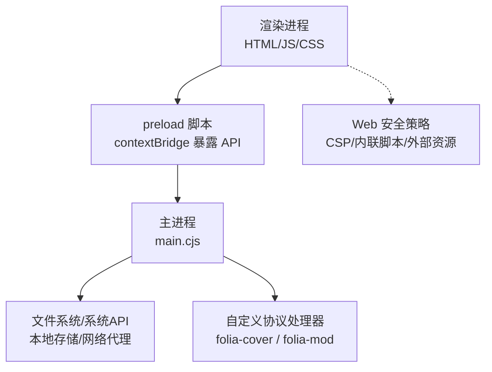
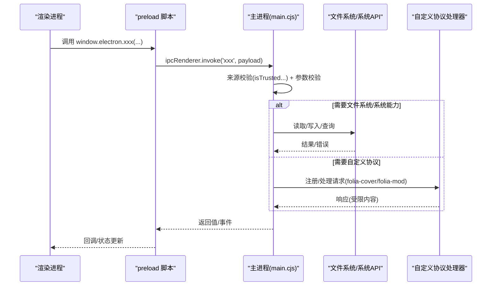
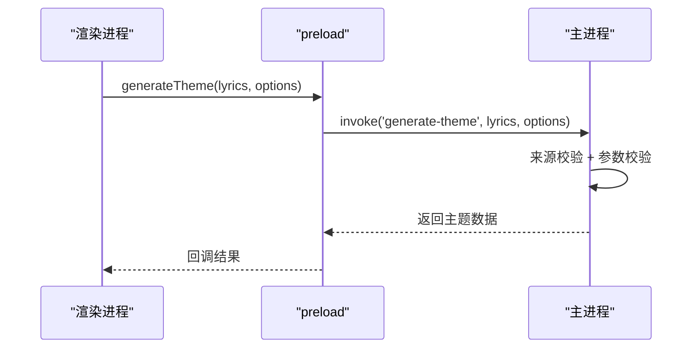
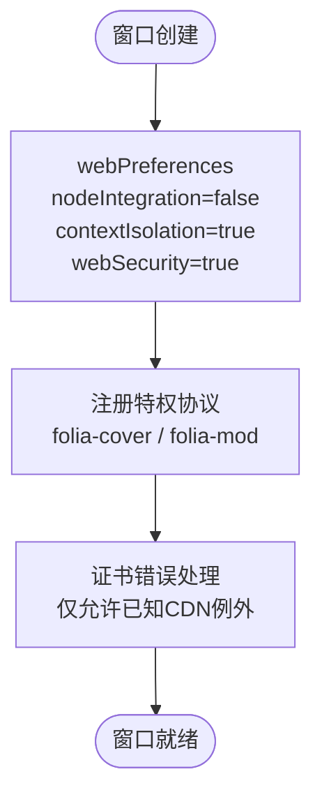
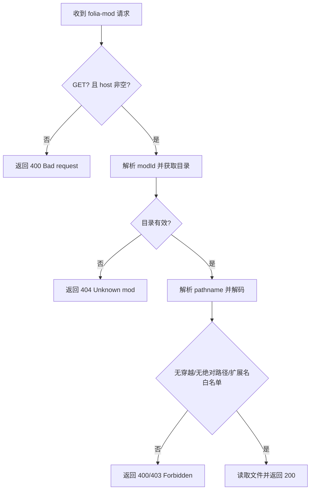
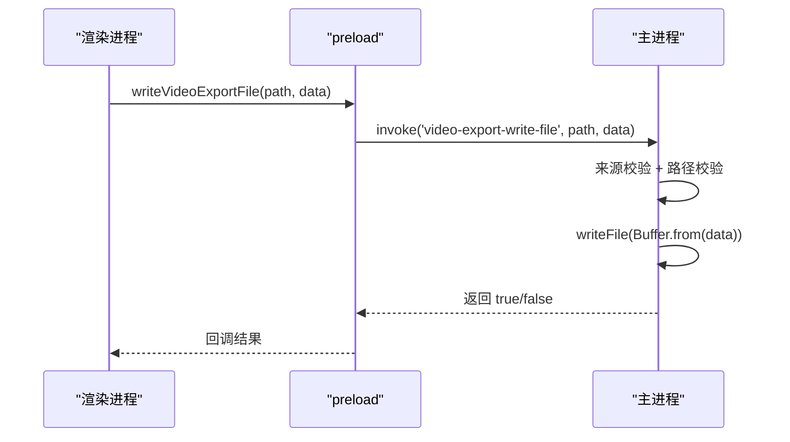
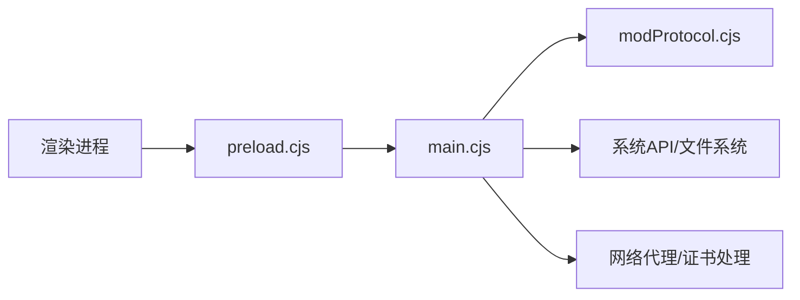

# 沙箱隔离机制

<cite>
**本文引用的文件**
- [electron/main.cjs](file://electron/main.cjs)
- [electron/preload.cjs](file://electron/preload.cjs)
- [electron/modSystem/modProtocol.cjs](file://electron/modSystem/modProtocol.cjs)
- [index.html](file://index.html)
</cite>

## 目录
1. [简介](#简介)
2. [项目结构](#项目结构)
3. [核心组件](#核心组件)
4. [架构总览](#架构总览)
5. [详细组件分析](#详细组件分析)
6. [依赖关系分析](#依赖关系分析)
7. [性能与安全权衡](#性能与安全权衡)
8. [故障排查指南](#故障排查指南)
9. [结论](#结论)
10. [附录：安全最佳实践清单](#附录安全最佳实践清单)

## 简介
本文件系统性解析 Folia Player 在 Electron 环境下的沙箱隔离机制，重点覆盖以下方面：
- 主进程与渲染进程的边界：contextIsolation、nodeIntegration、webSecurity 等配置如何共同构建安全基线。
- preload 脚本的安全作用：通过 contextBridge 暴露最小化 API，实现“仅能用的能力”原则。
- Web 安全策略：CSP、内联脚本限制、外部资源加载控制（结合应用实际 HTML/入口）。
- IPC 通信安全模型：消息验证、权限检查、数据序列化与来源校验。
- 自定义协议安全：folia-cover 与 folia-mod 协议的权限配置与访问限制。
- 沙箱最佳实践：最小权限、输入验证、错误处理、可观测性与回退策略。

## 项目结构
围绕安全的关键文件与职责：
- electron/main.cjs：主进程入口，负责窗口创建、安全相关 BrowserWindow 配置、自定义协议注册、证书错误处理、IPC 路由与权限校验。
- electron/preload.cjs：预加载脚本，使用 contextBridge 向渲染进程暴露受控 API，所有跨进程调用均经 ipcRenderer.invoke/send。
- electron/modSystem/modProtocol.cjs：定义并挂载 folia-mod:// 特权协议处理器，严格白名单与路径穿越防护。
- index.html：应用入口页面，包含 importmap 与运行时脚本注入点，用于理解 CSP 与内联脚本约束。

图表来源
- [electron/main.cjs:3860-3895](file://electron/main.cjs#L3860-L3895)
- [electron/preload.cjs:1-320](file://electron/preload.cjs#L1-L320)
- [electron/modSystem/modProtocol.cjs:1-95](file://electron/modSystem/modProtocol.cjs#L1-L95)
- [index.html:1-38](file://index.html#L1-L38)

章节来源
- [electron/main.cjs:3860-3895](file://electron/main.cjs#L3860-L3895)
- [electron/preload.cjs:1-320](file://electron/preload.cjs#L1-L320)
- [electron/modSystem/modProtocol.cjs:1-95](file://electron/modSystem/modProtocol.cjs#L1-L95)
- [index.html:1-38](file://index.html#L1-L38)

## 核心组件
- 渲染进程安全边界
  - 通过 BrowserWindow.webPreferences 设置 nodeIntegration: false、contextIsolation: true、webSecurity: true，确保渲染进程无法直接访问 Node 模块，且与主进程上下文隔离。
  - preload 作为唯一可信桥接层，将必要能力以最小化方式暴露给渲染进程。
- 预加载脚本（preload）
  - 使用 contextBridge.exposeInMainWorld 暴露有限 API（如 webUtils.getPathForFile、自动混音推理、缓存读写、窗口控制、更新检查、OBS/Stage/Discord 集成等）。
  - 所有操作通过 ipcRenderer.invoke/send 转发到主进程，由主进程统一鉴权与执行。
- 自定义协议
  - folia-cover：标准、安全、支持 fetch、CORS、流式传输，用于封面资源的受控访问。
  - folia-mod：严格只读、白名单扩展名、路径穿越防护、仅服务已验证的 mod 目录内容。
- 主进程 IPC 安全
  - 对敏感接口进行来源校验（isTrustedMainWindowContents/isTrustedRemoteControlContents），拒绝未受信渲染进程调用。
  - 参数类型与范围校验（例如导出尺寸、路径合法性），失败即返回或抛出错误。
- Web 安全策略
  - 入口 HTML 使用 importmap 与运行时脚本注入；无显式 CSP meta 标签，需结合浏览器默认策略与 Electron 行为评估风险。
  - 内联脚本存在（importmap、runtime-config.js、入口模块），应谨慎评估 XSS 风险。

章节来源
- [electron/main.cjs:3860-3895](file://electron/main.cjs#L3860-L3895)
- [electron/preload.cjs:1-320](file://electron/preload.cjs#L1-L320)
- [electron/modSystem/modProtocol.cjs:1-95](file://electron/modSystem/modProtocol.cjs#L1-L95)
- [index.html:1-38](file://index.html#L1-L38)

## 架构总览
下图展示从渲染进程到主进程再到系统能力的完整调用链，以及自定义协议的安全边界。

图表来源
- [electron/preload.cjs:1-320](file://electron/preload.cjs#L1-L320)
- [electron/main.cjs:4696-5314](file://electron/main.cjs#L4696-L5314)
- [electron/modSystem/modProtocol.cjs:1-95](file://electron/modSystem/modProtocol.cjs#L1-L95)

## 详细组件分析

### 预加载脚本的安全作用与最小化原则
- 最小暴露面
  - 仅暴露渲染进程必需的能力，如：
    - 文件路径解析：webUtils.getPathForFile
    - 自动混音推理与模型管理：runBeatThis、separateStems、getAutomixModelsPresent、模型下载/安装/扫描/移除等
    - 调试与诊断：debugGetState、debugSetState、debugOpenLogs、debugWriteRuntimeLines、debugRendererMemory 等
    - 设置与缓存：getSettings/saveSettings、音频/封面缓存读写与清理
    - 窗口与系统：最小化/最大化/全屏/关闭/透明模式/置顶/点击穿透等
    - 第三方集成：OBS、Discord、Lyric API、Stage、语音输入暂停、远程遥控等
    - 更新：获取状态、检查/下载/安装更新
    - 插件系统：mods 列表、启用/禁用、重载、命令调用、导出进度等
- 安全边界
  - 所有能力通过 ipcRenderer.invoke/send 转发至主进程，主进程集中鉴权与执行。
  - 事件订阅采用 onXxx(callback) 形式，提供取消监听方法，避免内存泄漏与僵尸监听器。
- 典型调用流程（示例：生成主题）
  - 渲染进程调用 window.electron.generateTheme(...)
  - preload 通过 ipcRenderer.invoke('generate-theme', lyricsText, options) 转发
  - 主进程校验来源与参数后执行本地 AI 逻辑并返回结果

图表来源
- [electron/preload.cjs:117-118](file://electron/preload.cjs#L117-L118)
- [electron/main.cjs:5312-5314](file://electron/main.cjs#L5312-L5314)

章节来源
- [electron/preload.cjs:1-320](file://electron/preload.cjs#L1-L320)
- [electron/main.cjs:5312-5314](file://electron/main.cjs#L5312-L5314)

### 主进程安全配置与窗口隔离
- 窗口安全偏好
  - nodeIntegration: false：禁止渲染进程直接访问 Node 模块。
  - contextIsolation: true：隔离渲染进程与主进程上下文，防止原型污染等攻击面。
  - webSecurity: true：启用同源策略、CSP、混合内容限制等。
  - preload：指定可信预加载脚本路径，作为唯一桥接层。
- 自定义协议注册
  - folia-cover：standard、secure、supportFetchAPI、corsEnabled、stream，满足封面资源的安全加载需求。
  - folia-mod：由 modProtocol 模块导出特权方案，并在主进程中统一注册。
- 证书错误处理
  - 仅信任特定 CDN 主机名的证书不匹配错误，其他一律拒绝，降低中间人攻击风险。

图表来源
- [electron/main.cjs:3860-3895](file://electron/main.cjs#L3860-L3895)
- [electron/main.cjs:42-54](file://electron/main.cjs#L42-L54)
- [electron/main.cjs:56-76](file://electron/main.cjs#L56-L76)

章节来源
- [electron/main.cjs:3860-3895](file://electron/main.cjs#L3860-L3895)
- [electron/main.cjs:42-54](file://electron/main.cjs#L42-L54)
- [electron/main.cjs:56-76](file://electron/main.cjs#L56-L76)

### 自定义协议安全实现：folia-cover 与 folia-mod
- folia-cover
  - 特权协议，支持标准、安全、fetch、CORS、流式传输，适合封面图片的高效加载。
  - 由主进程统一注册，渲染进程通过 URL 访问，具体内容由主进程或资源管理器决定。
- folia-mod
  - 严格只读、白名单扩展名（.js/.mjs）、路径穿越防护（拒绝 ..、绝对路径、反斜杠）。
  - 仅服务已验证的 mod 目录，未知 mod 返回 404，非法路径返回 400/403。
  - 强制 no-store 缓存头，避免开发期版本污染。

图表来源
- [electron/modSystem/modProtocol.cjs:51-92](file://electron/modSystem/modProtocol.cjs#L51-L92)

章节来源
- [electron/modSystem/modProtocol.cjs:1-95](file://electron/modSystem/modProtocol.cjs#L1-L95)
- [electron/main.cjs:42-54](file://electron/main.cjs#L42-L54)

### IPC 通信安全模型：消息验证、权限检查、数据序列化
- 来源校验
  - isTrustedMainWindowContents/isTrustedRemoteControlContents：确保只有受信任窗口的 webContents 可调用敏感接口。
  - 未受信渲染进程尝试调用时，主进程抛出错误，阻止越权操作。
- 参数校验
  - 严格类型检查与范围限制（例如导出尺寸、路径字符串、布尔开关）。
  - 对可选参数提供默认值与降级逻辑，避免崩溃。
- 数据序列化
  - 使用 ipcRenderer.invoke 的 Promise 语义传递结构化数据；事件通道用于推送状态变更。
  - 对二进制数据（如视频导出文件）使用 Buffer.from(data) 写入，确保类型安全。
- 典型流程（示例：视频导出写文件）
  - 渲染进程调用 writeVideoExportFile(filePath, data)
  - 主进程校验来源与 filePath 合法性，写入文件并返回成功标志

图表来源
- [electron/main.cjs:5278-5289](file://electron/main.cjs#L5278-L5289)

章节来源
- [electron/main.cjs:1593-1609](file://electron/main.cjs#L1593-L1609)
- [electron/main.cjs:4696-5314](file://electron/main.cjs#L4696-L5314)

### Web 安全策略：CSP、内联脚本、外部资源加载
- 现状
  - index.html 未显式设置 CSP meta 标签，依赖浏览器默认策略与 Electron 行为。
  - 存在内联脚本：importmap、/runtime-config.js、入口模块 <script type="module">。
- 风险与建议
  - 建议为生产环境添加严格 CSP，限制 script-src 与 style-src，禁用 unsafe-inline/unsafe-eval。
  - 将动态脚本改为外链或通过后端注入受信任的 nonce/hash。
  - 对外部资源（CDN）使用 allowlist 与 SRI（子资源完整性）校验。
  - 对本地资源（如封面）通过自定义协议与主进程代理，避免直接暴露文件系统。

章节来源
- [index.html:1-38](file://index.html#L1-L38)

## 依赖关系分析
- 组件耦合
  - 渲染进程依赖 preload 暴露的 API；preload 依赖主进程 IPC 路由。
  - 主进程依赖窗口实例、存储、系统 API、自定义协议处理器。
- 直接依赖
  - main.cjs 依赖 preload.cjs（通过 webPreferences.preload）。
  - main.cjs 依赖 modProtocol.cjs（注册特权协议）。
- 间接依赖
  - 渲染进程通过 preload 间接访问文件系统、网络代理、系统能力。
- 潜在循环
  - 当前结构清晰分层，未见明显循环依赖。
- 外部依赖
  - Electron API（BrowserWindow、ipcMain/ipcRenderer、protocol、safeStorage 等）。
  - 第三方库（如 ws、busboy 在 Stage API 中用于本地集成）。

图表来源
- [electron/main.cjs:3860-3895](file://electron/main.cjs#L3860-L3895)
- [electron/preload.cjs:1-320](file://electron/preload.cjs#L1-L320)
- [electron/modSystem/modProtocol.cjs:1-95](file://electron/modSystem/modProtocol.cjs#L1-L95)

章节来源
- [electron/main.cjs:3860-3895](file://electron/main.cjs#L3860-L3895)
- [electron/preload.cjs:1-320](file://electron/preload.cjs#L1-L320)
- [electron/modSystem/modProtocol.cjs:1-95](file://electron/modSystem/modProtocol.cjs#L1-L95)

## 性能与安全权衡
- 性能
  - 背景节流关闭（backgroundThrottling: false）提升动画与可视化性能，但可能增加 CPU/GPU 负载。
  - 自定义协议支持流式传输（stream: true）提升大封面加载效率。
- 安全
  - 严格来源校验与参数验证降低越权与注入风险。
  - 仅信任特定 CDN 证书错误，避免全局放宽 TLS 校验。
  - 自定义协议限制扩展名与路径，防止任意文件读取。
- 建议
  - 在生产环境启用 CSP 与严格的外部资源白名单。
  - 对高频 IPC 调用进行批处理与去抖，减少主进程压力。
  - 对敏感操作增加二次确认与审计日志。

[本节为通用指导，无需具体文件引用]

## 故障排查指南
- 常见问题定位
  - 渲染进程无法访问 Node API：确认 nodeIntegration: false 与 contextIsolation: true 配置正确，并通过 preload 暴露所需能力。
  - 自定义协议无效：检查 protocol.registerSchemesAsPrivileged 是否一次性注册所有方案，避免覆盖导致权限丢失。
  - IPC 调用被拒绝：检查 isTrusted... 来源校验逻辑，确认调用方来自受信任窗口。
  - 证书错误：确认是否命中允许的 CDN 例外，否则应修复证书配置。
- 调试手段
  - 使用 debugGetState/debugOpenLogs 获取主进程状态与日志。
  - 通过 onDebugMemorySample 监控渲染进程内存采样。
  - 对关键 IPC 路径添加日志与异常捕获，便于快速定位问题。

章节来源
- [electron/main.cjs:4696-5314](file://electron/main.cjs#L4696-L5314)
- [electron/preload.cjs:18-48](file://electron/preload.cjs#L18-L48)

## 结论
Folia Player 通过严格的 Electron 安全配置、最小化的 preload 暴露面、受控的自定义协议与健壮的 IPC 鉴权机制，构建了可靠的沙箱隔离体系。建议在后续迭代中进一步强化 Web 安全策略（CSP、内联脚本控制、外部资源白名单），并对高频 IPC 进行性能优化与审计增强，以提升整体安全性与用户体验。

[本节为总结性内容，无需具体文件引用]

## 附录：安全最佳实践清单
- 最小权限原则
  - 仅暴露渲染进程必需能力；按功能域拆分 API，避免单点过宽权限。
- 输入验证
  - 对所有 IPC 参数进行类型、长度、格式与范围校验；拒绝非法输入并记录审计日志。
- 错误处理
  - 统一错误码与消息；对敏感错误仅返回必要信息，避免泄露内部细节。
- 来源校验
  - 所有敏感接口必须校验调用方来源；区分主窗口与远程窗口权限。
- 自定义协议
  - 严格白名单与路径穿越防护；仅服务已验证目录；禁用缓存污染。
- Web 安全策略
  - 启用 CSP；限制内联脚本与外部资源；使用 SRI 校验关键资源。
- 可观测性
  - 关键路径添加日志与指标；定期审查异常与告警。
- 回退与降级
  - 对不可用能力提供降级路径（如模型缺失时返回 null）；保证 UI 稳定。

[本节为通用指导，无需具体文件引用]