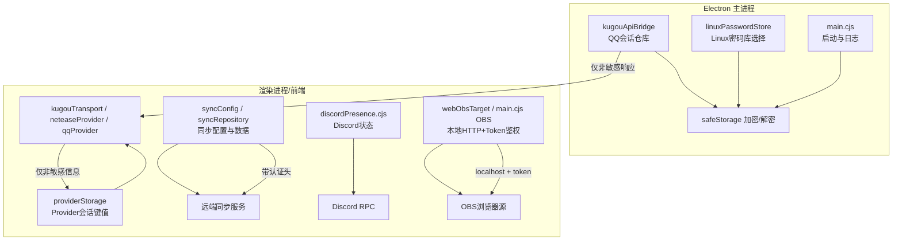
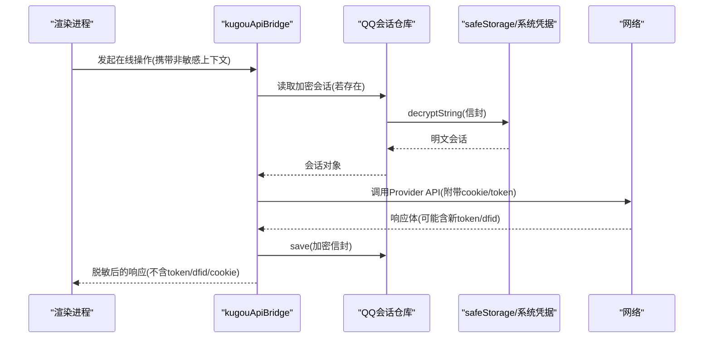
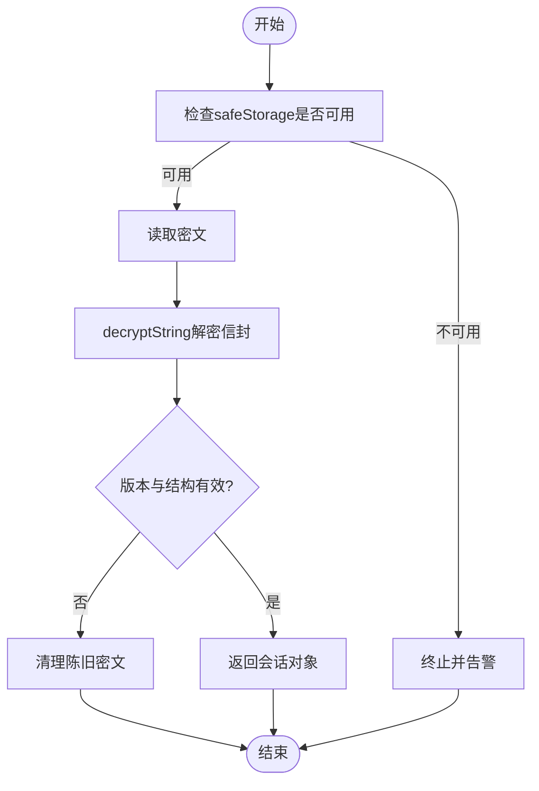
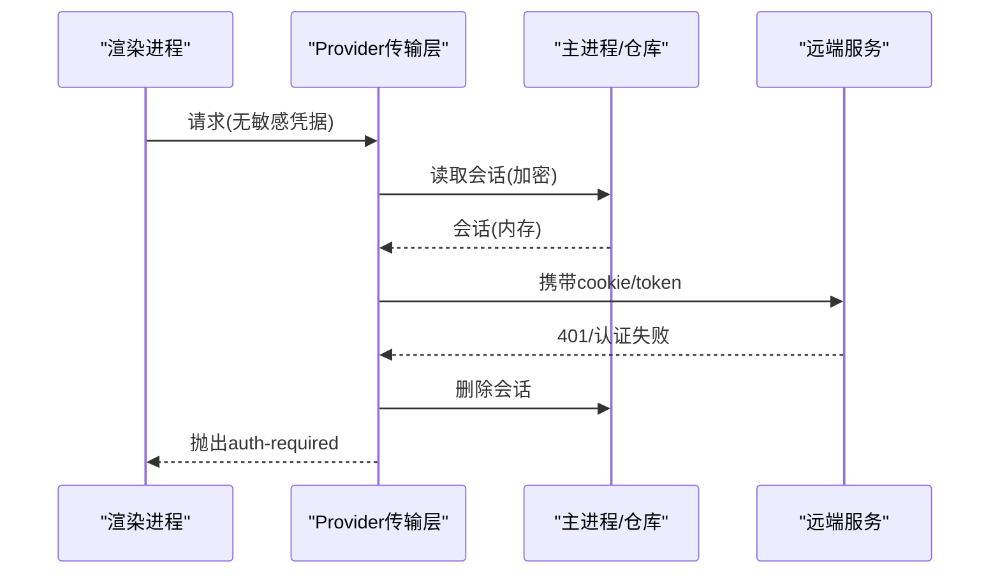
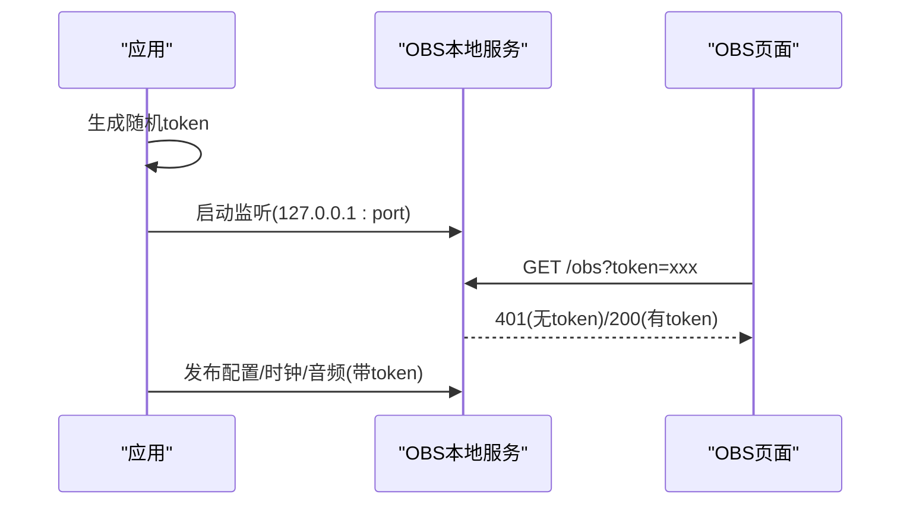
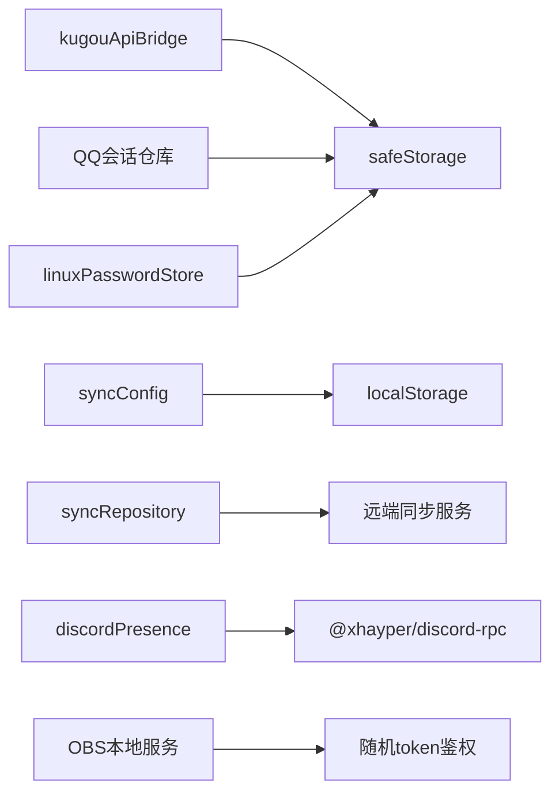

# 用户数据保护

<cite>
**本文引用的文件**
- [electron/kugouApiBridge.cjs](file://electron/kugouApiBridge.cjs)
- [electron/qqAuthSessionRepository.cjs](file://electron/qqAuthSessionRepository.cjs)
- [electron/linuxPasswordStore.cjs](file://electron/linuxPasswordStore.cjs)
- [electron/main.cjs](file://electron/main.cjs)
- [src/services/sync/syncConfig.ts](file://src/services/sync/syncConfig.ts)
- [src/services/sync/syncRepository.ts](file://src/services/sync/syncRepository.ts)
- [src/services/onlineMusic/providerStorage.ts](file://src/services/onlineMusic/providerStorage.ts)
- [src/services/onlineMusic/kugouTransport.ts](file://src/services/onlineMusic/kugouTransport.ts)
- [src/services/onlineMusic/neteaseProvider.ts](file://src/services/onlineMusic/neteaseProvider.ts)
- [src/services/onlineMusic/qqProvider.ts](file://src/services/onlineMusic/qqProvider.ts)
- [electron/discordPresence.cjs](file://electron/discordPresence.cjs)
- [src/components/modal/settings/IntegrationSettingsSubview.tsx](file://src/components/modal/settings/IntegrationSettingsSubview.tsx)
- [src/utils/webObsTarget.ts](file://src/utils/webObsTarget.ts)
- [electron/modSystem/modApi.cjs](file://electron/modSystem/modApi.cjs)
- [test/unit/electron/qqAuthSessionRepository.test.ts](file://test/unit/electron/qqAuthSessionRepository.test.ts)
</cite>

## 目录
1. [简介](#简介)
2. [项目结构](#项目结构)
3. [核心组件](#核心组件)
4. [架构总览](#架构总览)
5. [详细组件分析](#详细组件分析)
6. [依赖关系分析](#依赖关系分析)
7. [性能与安全考量](#性能与安全考量)
8. [故障排查指南](#故障排查指南)
9. [结论](#结论)
10. [附录：最佳实践与合规建议](#附录最佳实践与合规建议)

## 简介
本文件聚焦 Folia Player 的用户数据保护实现，围绕本地存储加密、会话管理、密码安全存储、备份与恢复、第三方集成数据安全以及数据最小化与隐私合规等方面，提供从架构到代码级的系统性说明。重点覆盖 Electron safeStorage 的使用、跨平台密码库选择、在线服务凭据的隔离与脱敏、OBS/Discord 等外部集成的安全边界，以及同步配置与云端数据的传输与落盘策略。

## 项目结构
Folia Player 的安全相关能力主要分布在以下层次：
- Electron 主进程层：负责系统级安全原语（safeStorage）、平台密码库选择、本地令牌持久化、IPC 桥接与敏感数据脱敏。
- 渲染进程/前端层：负责在线 Provider 会话的轻量持久（非敏感字段）、设置与同步配置、UI 交互与状态展示。
- 服务层：在线音乐 Provider 的传输封装、登录态维护、错误码映射与自动登出。
- 同步层：设置与主题等数据的本地缓存、远端拉取/推送、水印与增量同步。
- 第三方集成：Discord Rich Presence、OBS Browser Source 等，遵循最小暴露原则与访问控制。

图表来源
- [electron/kugouApiBridge.cjs:51-125](file://electron/kugouApiBridge.cjs#L51-L125)
- [electron/qqAuthSessionRepository.cjs:10-76](file://electron/qqAuthSessionRepository.cjs#L10-L76)
- [electron/linuxPasswordStore.cjs:30-47](file://electron/linuxPasswordStore.cjs#L30-L47)
- [electron/main.cjs:927-949](file://electron/main.cjs#L927-L949)
- [src/services/sync/syncConfig.ts:49-73](file://src/services/sync/syncConfig.ts#L49-L73)
- [src/services/sync/syncRepository.ts:146-188](file://src/services/sync/syncRepository.ts#L146-L188)
- [electron/discordPresence.cjs:103-226](file://electron/discordPresence.cjs#L103-L226)

章节来源
- [electron/kugouApiBridge.cjs:51-125](file://electron/kugouApiBridge.cjs#L51-L125)
- [electron/qqAuthSessionRepository.cjs:10-76](file://electron/qqAuthSessionRepository.cjs#L10-L76)
- [electron/linuxPasswordStore.cjs:30-47](file://electron/linuxPasswordStore.cjs#L30-L47)
- [electron/main.cjs:927-949](file://electron/main.cjs#L927-L949)
- [src/services/sync/syncConfig.ts:49-73](file://src/services/sync/syncConfig.ts#L49-L73)
- [src/services/sync/syncRepository.ts:146-188](file://src/services/sync/syncRepository.ts#L146-L188)
- [electron/discordPresence.cjs:103-226](file://electron/discordPresence.cjs#L103-L226)

## 核心组件
- 本地存储加密与密钥管理
  - 通过 Electron safeStorage 对敏感会话进行加密落盘；在 Linux 上拒绝 basic_text 后端，避免明文或弱混淆存储。
  - QQ 与酷狗均使用“信封”结构（含版本与敏感载荷），加载时校验版本与结构，失败则清理或降级为内存态。
- 会话管理与自动登出
  - 在线 Provider 的 cookie/token 等敏感信息优先保存在 Electron 主进程并通过 IPC 传递；渲染侧仅保留必要非敏感标识。
  - 当上游返回 401 等认证失效时，自动清理本地会话并标记需要重新登录。
- 密码存储安全
  - Linux：根据桌面环境选择 kwallet/libsecret，避免 fallback 到 basic_text。
  - Windows/macOS：依赖 Electron safeStorage 使用的系统凭据管理器（如 DPAPI/钥匙串）。
- 备份与恢复安全
  - 同步配置与运行状态存储在本地 localStorage，包含 workerBaseUrl 与 authToken；上传/下载时对主题数据进行清洗与指纹比对，减少冗余与泄露面。
- 第三方集成数据安全
  - Discord：仅发布播放快照中的标题、艺术家、封面 URL（经规范化）与时间戳，不发送任何凭据。
  - OBS：本地 HTTP 服务绑定 127.0.0.1，使用随机 token 鉴权，禁止未授权访问。

章节来源
- [electron/kugouApiBridge.cjs:51-125](file://electron/kugouApiBridge.cjs#L51-L125)
- [electron/qqAuthSessionRepository.cjs:10-76](file://electron/qqAuthSessionRepository.cjs#L10-L76)
- [electron/linuxPasswordStore.cjs:30-47](file://electron/linuxPasswordStore.cjs#L30-L47)
- [src/services/onlineMusic/kugouTransport.ts:189-215](file://src/services/onlineMusic/kugouTransport.ts#L189-L215)
- [src/services/onlineMusic/neteaseProvider.ts:301-327](file://src/services/onlineMusic/neteaseProvider.ts#L301-L327)
- [src/services/onlineMusic/qqProvider.ts:372-399](file://src/services/onlineMusic/qqProvider.ts#L372-L399)
- [src/services/sync/syncConfig.ts:49-73](file://src/services/sync/syncConfig.ts#L49-L73)
- [electron/discordPresence.cjs:52-88](file://electron/discordPresence.cjs#L52-L88)
- [electron/main.cjs:927-949](file://electron/main.cjs#L927-L949)

## 架构总览
下图展示了关键安全路径：敏感凭据在主进程加密存储，渲染进程仅持有非敏感片段；在线请求由传输层统一注入会话；第三方集成通过最小暴露与鉴权机制保障安全。

图表来源
- [electron/kugouApiBridge.cjs:168-234](file://electron/kugouApiBridge.cjs#L168-L234)
- [electron/qqAuthSessionRepository.cjs:33-76](file://electron/qqAuthSessionRepository.cjs#L33-L76)

章节来源
- [electron/kugouApiBridge.cjs:168-234](file://electron/kugouApiBridge.cjs#L168-L234)
- [electron/qqAuthSessionRepository.cjs:33-76](file://electron/qqAuthSessionRepository.cjs#L33-L76)

## 详细组件分析

### 本地存储加密与密钥管理（safeStorage）
- 设计要点
  - 所有敏感会话以“信封”形式保存，包含版本号与敏感数据，加载时严格校验。
  - 在 Linux 上检测并拒绝 basic_text 后端，防止凭据落入明文配置文件。
  - 写入前强制检查 isEncryptionAvailable，否则抛出异常并阻止落盘。
- 数据结构与复杂度
  - 信封结构为固定 JSON，读写均为 O(n) 序列化/反序列化，n 为会话条目数。
- 错误处理
  - 加载失败记录事件并回退到内存态；清空陈旧密文以保证一致性。
- 优化建议
  - 可考虑分片存储多账号会话以降低单次加解密开销。

图表来源
- [electron/qqAuthSessionRepository.cjs:10-76](file://electron/qqAuthSessionRepository.cjs#L10-L76)
- [electron/kugouApiBridge.cjs:51-125](file://electron/kugouApiBridge.cjs#L51-L125)

章节来源
- [electron/qqAuthSessionRepository.cjs:10-76](file://electron/qqAuthSessionRepository.cjs#L10-L76)
- [electron/kugouApiBridge.cjs:51-125](file://electron/kugouApiBridge.cjs#L51-L125)
- [test/unit/electron/qqAuthSessionRepository.test.ts:66-91](file://test/unit/electron/qqAuthSessionRepository.test.ts#L66-L91)

### 会话管理（登录态、令牌、自动登出）
- 登录态维护
  - 酷狗：通过 kugouApiBridge 将 cookie/token/dfid 等合并入设备会话并加密保存；渲染侧不再直接持有 token。
  - QQ：服务端凭据（musickey、refresh key、设备上下文）在主进程加密保存；渲染侧仅持有 opaque token。
  - 网易：cookie 写入 Provider 会话存储，用于后续请求。
- 自动登出
  - 当上游返回 401 等认证失败时，清除本地会话并提示重新登录。
- 数据流
  - 渲染进程发起请求 -> 传输层注入会话 -> 主进程加密存取 -> 响应体脱敏后返回渲染进程。

图表来源
- [src/services/onlineMusic/kugouTransport.ts:189-215](file://src/services/onlineMusic/kugouTransport.ts#L189-L215)
- [src/services/onlineMusic/neteaseProvider.ts:301-327](file://src/services/onlineMusic/neteaseProvider.ts#L301-L327)
- [src/services/onlineMusic/qqProvider.ts:372-399](file://src/services/onlineMusic/qqProvider.ts#L372-L399)

章节来源
- [src/services/onlineMusic/kugouTransport.ts:189-215](file://src/services/onlineMusic/kugouTransport.ts#L189-L215)
- [src/services/onlineMusic/neteaseProvider.ts:301-327](file://src/services/onlineMusic/neteaseProvider.ts#L301-L327)
- [src/services/onlineMusic/qqProvider.ts:372-399](file://src/services/onlineMusic/qqProvider.ts#L372-L399)

### 密码存储安全（跨平台）
- Linux
  - 通过 linuxPasswordStore 解析 XDG_CURRENT_DESKTOP 与命令行参数，选择 kwallet 或 gnome-libsecret，避免 Chromium 默认 fallback 到 basic_text。
- Windows/macOS
  - 依赖 Electron safeStorage 使用的系统凭据管理器（如 DPAPI/钥匙串），无需额外配置。
- 启动期检测
  - 主进程启动时检测 safeStorage 可用性并输出警告，便于区分“丢失登录”和“认证Bug”。

章节来源
- [electron/linuxPasswordStore.cjs:30-47](file://electron/linuxPasswordStore.cjs#L30-L47)
- [electron/main.cjs:4088-4097](file://electron/main.cjs#L4088-L4097)

### 备份与恢复安全（配置与敏感信息）
- 本地同步配置
  - 使用 localStorage 保存 workerBaseUrl 与 authToken；提供保存与订阅更新事件的能力。
- 主题与设置同步
  - 通过 syncRepository 进行增量同步，基于指纹与桶哈希减少重复传输；主题内容经过清洗后再上传/下载。
- 数据传输
  - 远端同步需启用并配置 workerBaseUrl 与 authToken；未配置时不会触发同步。

章节来源
- [src/services/sync/syncConfig.ts:49-73](file://src/services/sync/syncConfig.ts#L49-L73)
- [src/services/sync/syncRepository.ts:146-188](file://src/services/sync/syncRepository.ts#L146-L188)
- [src/services/sync/syncRepository.ts:335-459](file://src/services/sync/syncRepository.ts#L335-L459)

### 第三方集成数据安全
- Discord Rich Presence
  - 仅发布播放快照中的标题、艺术家、封面 URL（规范化为 https 且排除本地地址）与起止时间；不发送任何凭据。
  - 支持应用 ID 校验与连接状态管理，断开时清理活动。
- OBS Browser Source
  - 本地 HTTP 服务绑定 127.0.0.1，使用随机 token 鉴权；未携带正确 token 的请求返回 401。
  - 配置与状态通过 IPC 发布，限制可信窗口来源。

图表来源
- [electron/main.cjs:927-949](file://electron/main.cjs#L927-L949)
- [electron/main.cjs:3302-3349](file://electron/main.cjs#L3302-L3349)

章节来源
- [electron/discordPresence.cjs:52-88](file://electron/discordPresence.cjs#L52-L88)
- [electron/discordPresence.cjs:103-226](file://electron/discordPresence.cjs#L103-L226)
- [electron/main.cjs:927-949](file://electron/main.cjs#L927-L949)
- [electron/main.cjs:3302-3349](file://electron/main.cjs#L3302-L3349)
- [src/utils/webObsTarget.ts:28-39](file://src/utils/webObsTarget.ts#L28-L39)

### 模块系统与插件安全
- 模块数据存储
  - 模块 API 提供 get/set/has/delete 方法，写入采用临时文件+原子重命名保证一致性；读取时进行权限校验与克隆，避免引用污染。
- 安全边界
  - 仅允许受信任模块访问，键名必须为非空字符串；非法输入直接拒绝。

章节来源
- [electron/modSystem/modApi.cjs:63-96](file://electron/modSystem/modApi.cjs#L63-L96)

## 依赖关系分析
- 耦合与内聚
  - kugouApiBridge 与 qqAuthSessionRepository 强依赖 safeStorage；与 provider 传输层解耦，仅通过 IPC 传递非敏感数据。
  - syncConfig/syncRepository 与远端服务通过配置驱动，具备开关与重试能力。
- 外部依赖
  - Electron safeStorage、系统凭据管理器（kwallet/libsecret/DPAPI/钥匙串）、@xhayper/discord-rpc、本地 HTTP 服务器。
- 循环依赖
  - 未发现明显循环依赖；各模块职责清晰，通过接口与事件通信。

图表来源
- [electron/kugouApiBridge.cjs:51-125](file://electron/kugouApiBridge.cjs#L51-L125)
- [electron/qqAuthSessionRepository.cjs:10-76](file://electron/qqAuthSessionRepository.cjs#L10-L76)
- [electron/linuxPasswordStore.cjs:30-47](file://electron/linuxPasswordStore.cjs#L30-L47)
- [src/services/sync/syncConfig.ts:49-73](file://src/services/sync/syncConfig.ts#L49-L73)
- [src/services/sync/syncRepository.ts:146-188](file://src/services/sync/syncRepository.ts#L146-L188)
- [electron/discordPresence.cjs:103-226](file://electron/discordPresence.cjs#L103-L226)
- [electron/main.cjs:927-949](file://electron/main.cjs#L927-L949)

章节来源
- [electron/kugouApiBridge.cjs:51-125](file://electron/kugouApiBridge.cjs#L51-L125)
- [electron/qqAuthSessionRepository.cjs:10-76](file://electron/qqAuthSessionRepository.cjs#L10-L76)
- [electron/linuxPasswordStore.cjs:30-47](file://electron/linuxPasswordStore.cjs#L30-L47)
- [src/services/sync/syncConfig.ts:49-73](file://src/services/sync/syncConfig.ts#L49-L73)
- [src/services/sync/syncRepository.ts:146-188](file://src/services/sync/syncRepository.ts#L146-L188)
- [electron/discordPresence.cjs:103-226](file://electron/discordPresence.cjs#L103-L226)
- [electron/main.cjs:927-949](file://electron/main.cjs#L927-L949)

## 性能与安全考量
- 性能
  - 加解密仅在必要时执行（首次 IPC 调用时懒加载），避免启动阻塞。
  - 同步采用指纹与桶哈希对比，减少不必要的数据传输。
- 安全
  - 始终拒绝 basic_text 后端，确保凭据不落盘为明文。
  - 渲染进程不持有敏感凭据，降低 XSS/内存泄露风险。
  - OBS 本地服务仅监听 localhost，配合随机 token 防越权。
  - Discord 活动仅包含公开可见信息，URL 规范化并屏蔽本地地址。

[本节为通用指导，不直接分析具体文件]

## 故障排查指南
- 无法持久化在线账户
  - 检查 safeStorage 是否可用，Linux 是否选择了 basic_text；查看主进程日志中关于“无系统凭据加密”的警告。
- 登录后立即掉线
  - 确认上游是否返回 401；检查传输层是否正确清理本地会话并提示重新登录。
- Discord 状态不更新
  - 检查应用 ID 是否合法、Discord 客户端是否连接；查看 discordPresence 的状态与错误消息。
- OBS 无法访问
  - 确认本地端口与 token 是否正确；浏览器源 URL 是否包含有效 token；未授权将返回 401。

章节来源
- [electron/main.cjs:4088-4097](file://electron/main.cjs#L4088-L4097)
- [src/services/onlineMusic/kugouTransport.ts:189-215](file://src/services/onlineMusic/kugouTransport.ts#L189-L215)
- [electron/discordPresence.cjs:103-226](file://electron/discordPresence.cjs#L103-L226)
- [electron/main.cjs:3302-3349](file://electron/main.cjs#L3302-L3349)

## 结论
Folia Player 在用户数据保护方面采用了分层防御策略：主进程集中管理敏感凭据并使用系统级加密存储；渲染进程仅持有非敏感上下文；在线请求通过传输层统一注入会话；第三方集成遵循最小暴露与鉴权原则；同步功能提供增量与清洗机制。整体设计兼顾安全性与可用性，适合跨平台部署与长期使用。

[本节为总结性内容，不直接分析具体文件]

## 附录：最佳实践与合规建议
- 数据最小化
  - 仅传输与展示必要的非敏感信息；敏感凭据留在主进程并加密存储。
- 隐私保护
  - 对外部集成（Discord/OBS）进行严格的输入校验与输出净化，避免泄露本地资源或内部状态。
- 合规要求
  - 明确告知用户数据用途；提供退出与清理入口；对同步配置与凭据进行最小化存储与及时清理。
- 运维建议
  - 定期审计 safeStorage 后端选择与可用性；监控同步状态与错误；对 OBS 本地服务进行端口与 token 轮换。

[本节为通用指导，不直接分析具体文件]