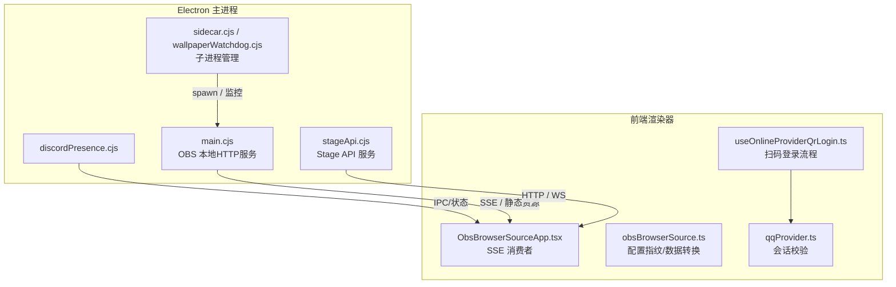
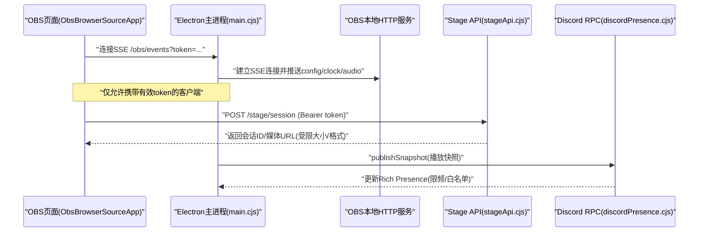
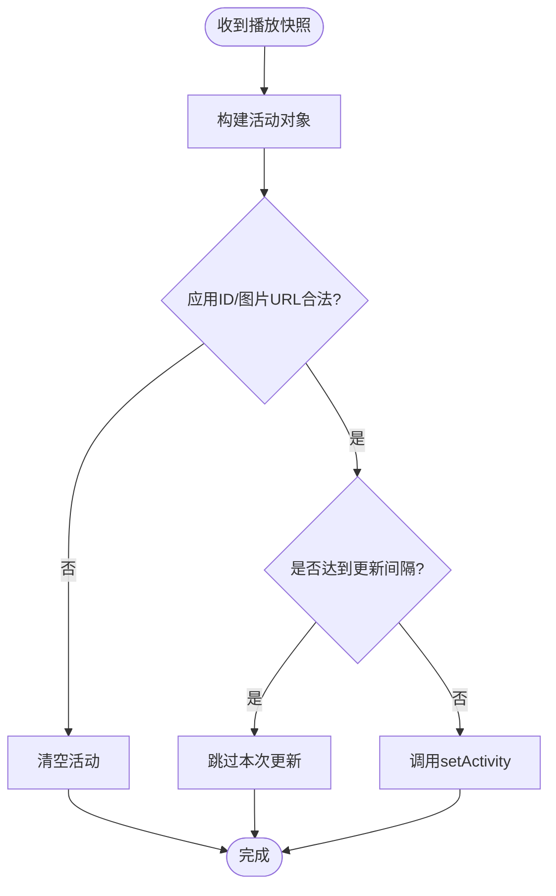
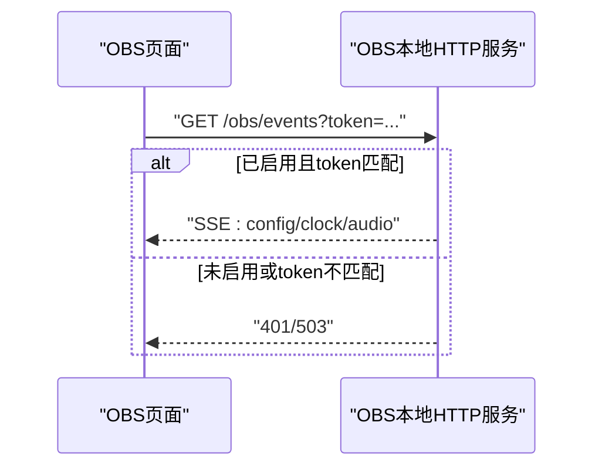
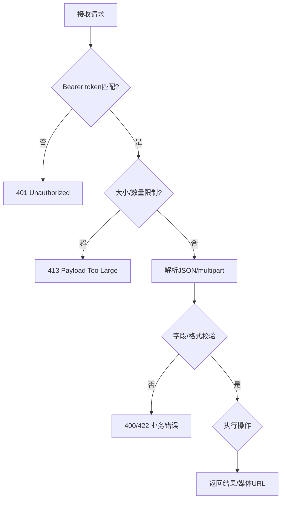
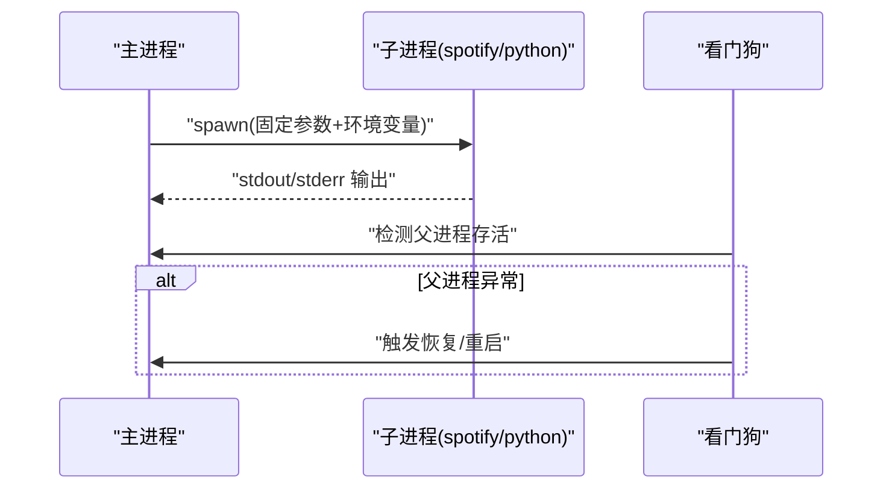
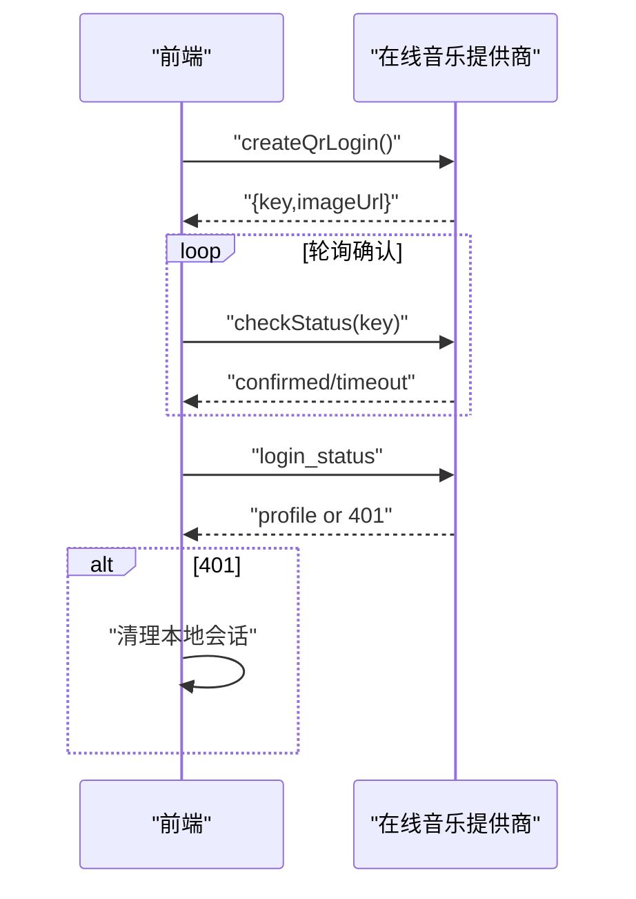
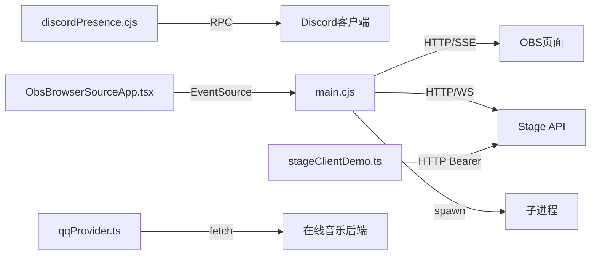

# 第三方集成安全

<cite>
**本文引用的文件**
- [electron/discordPresence.cjs](file://electron/discordPresence.cjs)
- [electron/main.cjs](file://electron/main.cjs)
- [electron/stageApi.cjs](file://electron/stageApi.cjs)
- [src/utils/obsBrowserSource.ts](file://src/utils/obsBrowserSource.ts)
- [src/components/obs/ObsBrowserSourceApp.tsx](file://src/components/obs/ObsBrowserSourceApp.tsx)
- [src/types/obsBrowserSource.ts](file://src/types/obsBrowserSource.ts)
- [test/manual/stage-client/API_SCHEMA.md](file://test/manual/stage-client/API_SCHEMA.md)
- [src/services/onlineMusic/qqProvider.ts](file://src/services/onlineMusic/qqProvider.ts)
- [src/hooks/useOnlineProviderQrLogin.ts](file://src/hooks/useOnlineProviderQrLogin.ts)
- [electron/qqAuthSessionRepository.cjs](file://electron/qqAuthSessionRepository.cjs)
- [electron/wallpaperWatchdog.cjs](file://electron/wallpaperWatchdog.cjs)
- [electron/analysis/sidecar.cjs](file://electron/analysis/sidecar.cjs)
</cite>

## 目录
1. [简介](#简介)
2. [项目结构](#项目结构)
3. [核心组件](#核心组件)
4. [架构总览](#架构总览)
5. [详细组件分析](#详细组件分析)
6. [依赖关系分析](#依赖关系分析)
7. [性能与安全权衡](#性能与安全权衡)
8. [故障排查指南](#故障排查指南)
9. [结论](#结论)
10. [附录：最佳实践清单](#附录：最佳实践清单)

## 简介
本文件聚焦 Folia Player 的第三方集成安全，覆盖以下关键领域：
- Discord Rich Presence 集成的应用 ID、状态同步与隐私保护。
- OBS Browser Source 本地服务器启动、端口绑定、访问控制与跨源请求处理。
- Stage API 的安全设计：令牌验证、请求限流与资源限制、操作权限控制。
- 外部进程通信安全：子进程启动、命令注入防护、资源访问控制。
- 第三方服务认证与授权：OAuth/扫码登录流程、令牌管理与会话校验。
- 集成安全最佳实践：最小权限、输入校验、错误处理与安全审计。

## 项目结构
Folia 将第三方集成拆分为 Electron 主进程模块与前端渲染器模块，通过 IPC、本地 HTTP/WebSocket 和子进程进行交互。关键路径包括：
- Electron 主进程：Discord 状态推送、OBS 浏览器源 HTTP 服务、Stage API 服务、子进程管理。
- 前端渲染器：OBS 页面消费事件流、Stage 客户端示例、在线音乐提供商登录流程。

图表来源
- [electron/discordPresence.cjs:1-285](file://electron/discordPresence.cjs#L1-L285)
- [electron/main.cjs:915-949](file://electron/main.cjs#L915-L949)
- [electron/stageApi.cjs:800-1599](file://electron/stageApi.cjs#L800-L1599)
- [src/components/obs/ObsBrowserSourceApp.tsx:15-23](file://src/components/obs/ObsBrowserSourceApp.tsx#L15-L23)
- [src/utils/obsBrowserSource.ts:15-107](file://src/utils/obsBrowserSource.ts#L15-L107)
- [src/hooks/useOnlineProviderQrLogin.ts:59-91](file://src/hooks/useOnlineProviderQrLogin.ts#L59-L91)
- [src/services/onlineMusic/qqProvider.ts:242-277](file://src/services/onlineMusic/qqProvider.ts#L242-L277)

章节来源
- [electron/discordPresence.cjs:1-285](file://electron/discordPresence.cjs#L1-L285)
- [electron/main.cjs:915-949](file://electron/main.cjs#L915-L949)
- [electron/stageApi.cjs:800-1599](file://electron/stageApi.cjs#L800-L1599)
- [src/components/obs/ObsBrowserSourceApp.tsx:15-23](file://src/components/obs/ObsBrowserSourceApp.tsx#L15-L23)
- [src/utils/obsBrowserSource.ts:15-107](file://src/utils/obsBrowserSource.ts#L15-L107)
- [src/hooks/useOnlineProviderQrLogin.ts:59-91](file://src/hooks/useOnlineProviderQrLogin.ts#L59-L91)
- [src/services/onlineMusic/qqProvider.ts:242-277](file://src/services/onlineMusic/qqProvider.ts#L242-L277)

## 核心组件
- Discord Rich Presence：在主进程中维护并推送播放状态到 Discord，包含应用 ID 校验、图片 URL 白名单与频率限制。
- OBS Browser Source：在 Electron 主进程启动本地 HTTP 服务，使用 SSE 推送配置、时钟与音频频谱；页面侧通过带 token 的 URL 订阅。
- Stage API：提供受保护的 HTTP/WS 接口，支持媒体会话上传、歌词解析、播放控制与队列操作，内置大小限制、令牌鉴权与能力裁剪。
- 外部进程通信：通过 spawn 启动辅助程序（如壁纸层、Python 分析），配合 watchdog 监控生命周期，避免注入与越权。
- 第三方认证：QQ 等在线音乐提供商采用扫码登录与后端会话校验，失败时清理本地会话。

章节来源
- [electron/discordPresence.cjs:1-285](file://electron/discordPresence.cjs#L1-L285)
- [electron/main.cjs:915-949](file://electron/main.cjs#L915-L949)
- [electron/stageApi.cjs:800-1599](file://electron/stageApi.cjs#L800-L1599)
- [electron/analysis/sidecar.cjs:1-60](file://electron/analysis/sidecar.cjs#L1-L60)
- [electron/wallpaperWatchdog.cjs:1-120](file://electron/wallpaperWatchdog.cjs#L1-L120)
- [src/hooks/useOnlineProviderQrLogin.ts:59-91](file://src/hooks/useOnlineProviderQrLogin.ts#L59-L91)
- [src/services/onlineMusic/qqProvider.ts:242-277](file://src/services/onlineMusic/qqProvider.ts#L242-L277)

## 架构总览
下图展示从前端到主进程再到外部服务的调用链与安全边界。

图表来源
- [src/components/obs/ObsBrowserSourceApp.tsx:15-23](file://src/components/obs/ObsBrowserSourceApp.tsx#L15-L23)
- [electron/main.cjs:3263-3349](file://electron/main.cjs#L3263-L3349)
- [electron/stageApi.cjs:800-1599](file://electron/stageApi.cjs#L800-L1599)
- [electron/discordPresence.cjs:103-285](file://electron/discordPresence.cjs#L103-L285)

## 详细组件分析

### Discord Rich Presence 安全实现
- 应用 ID 规范化与校验：仅接受符合长度与数字格式的字符串，空值或非法值将被拒绝。
- 图片 URL 白名单与协议升级：仅允许 http/https 且排除本地回环地址，http 自动升级为 https。
- 状态同步频率限制：基于活动键与时间戳去重，设置最小更新间隔，避免频繁调用 Discord API。
- 错误恢复与断开处理：捕获 Discord 断开与清除活动异常，保证健壮性。

图表来源
- [electron/discordPresence.cjs:8-45](file://electron/discordPresence.cjs#L8-L45)
- [electron/discordPresence.cjs:52-101](file://electron/discordPresence.cjs#L52-L101)
- [electron/discordPresence.cjs:166-285](file://electron/discordPresence.cjs#L166-L285)

章节来源
- [electron/discordPresence.cjs:1-285](file://electron/discordPresence.cjs#L1-L285)

### OBS Browser Source 安全机制
- 本地服务器启动与端口绑定：仅在启用时监听 127.0.0.1，防止外网暴露。
- 访问控制：所有敏感端点要求 token，未启用或无 token 返回 401/503。
- 跨源请求处理：为 SSE 与静态资源设置 CORS 头，便于 OBS 页面加载。
- 前端安全：OBS 页面通过 EventSource 订阅事件，仅信任带 token 的连接。

图表来源
- [electron/main.cjs:915-949](file://electron/main.cjs#L915-L949)
- [electron/main.cjs:3263-3349](file://electron/main.cjs#L3263-L3349)
- [src/components/obs/ObsBrowserSourceApp.tsx:15-23](file://src/components/obs/ObsBrowserSourceApp.tsx#L15-L23)

章节来源
- [electron/main.cjs:915-949](file://electron/main.cjs#L915-L949)
- [electron/main.cjs:3263-3349](file://electron/main.cjs#L3263-L3349)
- [src/components/obs/ObsBrowserSourceApp.tsx:15-23](file://src/components/obs/ObsBrowserSourceApp.tsx#L15-L23)
- [src/utils/obsBrowserSource.ts:15-107](file://src/utils/obsBrowserSource.ts#L15-L107)
- [src/types/obsBrowserSource.ts:29-128](file://src/types/obsBrowserSource.ts#L29-L128)

### Stage API 安全设计
- 令牌验证：所有非健康检查接口需 Authorization: Bearer <token>，WebSocket 同时支持查询参数 token。
- 请求体与多部分限制：JSON 主体与 multipart 字段/文件数量与大小均有限制，超限返回 413。
- 媒体与歌词解析：上传音频后提取内嵌歌词与封面，严格校验歌词格式与来源。
- 操作权限控制：根据 playbackContext 裁剪控制能力（如 external-playback-source 不可编辑队列）。
- 超时与取消：外部播放与控制请求设置超时，避免阻塞。

图表来源
- [electron/stageApi.cjs:800-890](file://electron/stageApi.cjs#L800-L890)
- [electron/stageApi.cjs:892-915](file://electron/stageApi.cjs#L892-L915)
- [electron/stageApi.cjs:917-1031](file://electron/stageApi.cjs#L917-L1031)
- [electron/stageApi.cjs:1033-1061](file://electron/stageApi.cjs#L1033-L1061)
- [electron/stageApi.cjs:1133-1274](file://electron/stageApi.cjs#L1133-L1274)
- [electron/stageApi.cjs:1489-1546](file://electron/stageApi.cjs#L1489-L1546)

章节来源
- [electron/stageApi.cjs:800-1599](file://electron/stageApi.cjs#L800-L1599)
- [test/manual/stage-client/API_SCHEMA.md:1-805](file://test/manual/stage-client/API_SCHEMA.md#L1-L805)

### 外部进程通信安全
- 子进程启动：使用 spawn 启动辅助程序（如 windowtolayer、Python sidecar），传递最小必要参数与环境变量。
- 命令注入防护：固定命令行参数，避免拼接用户输入；对二进制路径进行校验。
- 资源访问控制：子进程独立 stdio，必要时 detached；主进程负责生命周期管理。
- 看门狗与恢复：watchdog 探测父进程存活，崩溃时重启或降级。

图表来源
- [electron/main.cjs:197-229](file://electron/main.cjs#L197-L229)
- [electron/analysis/sidecar.cjs:1-60](file://electron/analysis/sidecar.cjs#L1-L60)
- [electron/wallpaperWatchdog.cjs:1-120](file://electron/wallpaperWatchdog.cjs#L1-L120)

章节来源
- [electron/main.cjs:197-229](file://electron/main.cjs#L197-L229)
- [electron/analysis/sidecar.cjs:1-60](file://electron/analysis/sidecar.cjs#L1-L60)
- [electron/wallpaperWatchdog.cjs:1-120](file://electron/wallpaperWatchdog.cjs#L1-L120)

### 第三方服务认证与授权
- 扫码登录流程：前端发起创建二维码，轮询确认，成功后获取会话。
- 会话校验：后端返回 401 表示会话失效，前端清理本地存储。
- 令牌管理：服务端生成随机 token，客户端以 Bearer 形式发送。

图表来源
- [src/hooks/useOnlineProviderQrLogin.ts:59-91](file://src/hooks/useOnlineProviderQrLogin.ts#L59-L91)
- [src/services/onlineMusic/qqProvider.ts:242-277](file://src/services/onlineMusic/qqProvider.ts#L242-L277)

章节来源
- [src/hooks/useOnlineProviderQrLogin.ts:59-91](file://src/hooks/useOnlineProviderQrLogin.ts#L59-L91)
- [src/services/onlineMusic/qqProvider.ts:242-277](file://src/services/onlineMusic/qqProvider.ts#L242-L277)
- [electron/qqAuthSessionRepository.cjs:1-91](file://electron/qqAuthSessionRepository.cjs#L1-L91)

## 依赖关系分析
- 主进程依赖：
  - Discord：通过 @xhayper/discord-rpc 库建立 IPC 连接。
  - OBS：Node http 模块提供本地服务，EventSource 由浏览器环境消费。
  - Stage：ws + http 提供 HTTP/WS，busboy 解析 multipart。
  - 子进程：child_process.spawn 启动外部程序。
- 前端依赖：
  - OBS 页面：EventSource 消费 SSE，类型定义来自 obsBrowserSource.ts。
  - Stage 客户端：示例中构造 Bearer 请求并校验输入。
  - 在线音乐：fetch 调用后端接口，处理 401 与重试。

图表来源
- [electron/discordPresence.cjs:195-225](file://electron/discordPresence.cjs#L195-L225)
- [electron/main.cjs:3263-3349](file://electron/main.cjs#L3263-L3349)
- [electron/stageApi.cjs:800-890](file://electron/stageApi.cjs#L800-L890)
- [src/components/obs/ObsBrowserSourceApp.tsx:112-145](file://src/components/obs/ObsBrowserSourceApp.tsx#L112-L145)
- [src/services/onlineMusic/qqProvider.ts:242-277](file://src/services/onlineMusic/qqProvider.ts#L242-L277)

章节来源
- [electron/discordPresence.cjs:195-225](file://electron/discordPresence.cjs#L195-L225)
- [electron/main.cjs:3263-3349](file://electron/main.cjs#L3263-L3349)
- [electron/stageApi.cjs:800-890](file://electron/stageApi.cjs#L800-L890)
- [src/components/obs/ObsBrowserSourceApp.tsx:112-145](file://src/components/obs/ObsBrowserSourceApp.tsx#L112-L145)
- [src/services/onlineMusic/qqProvider.ts:242-277](file://src/services/onlineMusic/qqProvider.ts#L242-L277)

## 性能与安全权衡
- Discord 更新频率：通过活动键与时间戳去重，降低网络开销与 Discord API 压力。
- OBS 配置指纹：计算配置签名以避免重复发布，减少内存峰值与渲染抖动。
- Stage 多部分限制：限制字段与文件大小，防止恶意大请求导致内存耗尽。
- 子进程隔离：将 CPU 密集任务放入子进程，保持主线程响应性。

章节来源
- [electron/discordPresence.cjs:90-101](file://electron/discordPresence.cjs#L90-L101)
- [src/utils/obsBrowserSource.ts:15-107](file://src/utils/obsBrowserSource.ts#L15-L107)
- [electron/stageApi.cjs:917-1031](file://electron/stageApi.cjs#L917-L1031)
- [electron/analysis/sidecar.cjs:1-60](file://electron/analysis/sidecar.cjs#L1-L60)

## 故障排查指南
- Discord 连接失败：检查应用 ID 是否配置正确，查看错误消息并确认 Discord 客户端可用。
- OBS 无法连接：确认本地端口未被占用，检查 token 是否一致，查看 401/503 响应。
- Stage 请求失败：核对 Bearer token，检查请求体大小与格式，关注 413/400/422 错误码。
- 子进程异常：查看 spawn 错误日志，确认二进制路径存在且可执行，检查 watchdog 是否触发恢复。

章节来源
- [electron/discordPresence.cjs:166-225](file://electron/discordPresence.cjs#L166-L225)
- [electron/main.cjs:3263-3349](file://electron/main.cjs#L3263-L3349)
- [electron/stageApi.cjs:800-890](file://electron/stageApi.cjs#L800-L890)
- [electron/main.cjs:197-229](file://electron/main.cjs#L197-L229)

## 结论
Folia 的第三方集成在多个层面实现了安全加固：严格的输入校验、令牌鉴权、资源限制、跨源控制与子进程隔离。这些措施共同保障了本地服务的安全性、稳定性与用户体验。建议在后续开发中继续遵循最小权限原则、持续审计日志与强化错误处理。

## 附录：最佳实践清单
- 最小权限：仅授予必要的 API 与文件系统访问。
- 输入验证：对所有外部输入进行类型、范围与格式校验。
- 错误处理：统一错误码与消息，记录上下文以便审计。
- 安全审计：定期审查令牌轮换、访问日志与异常告警。
- 性能优化：使用去重、限流与分页，避免资源浪费。