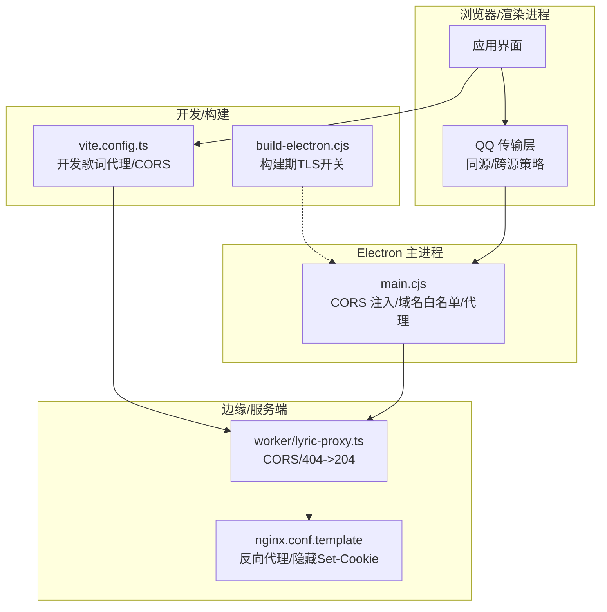
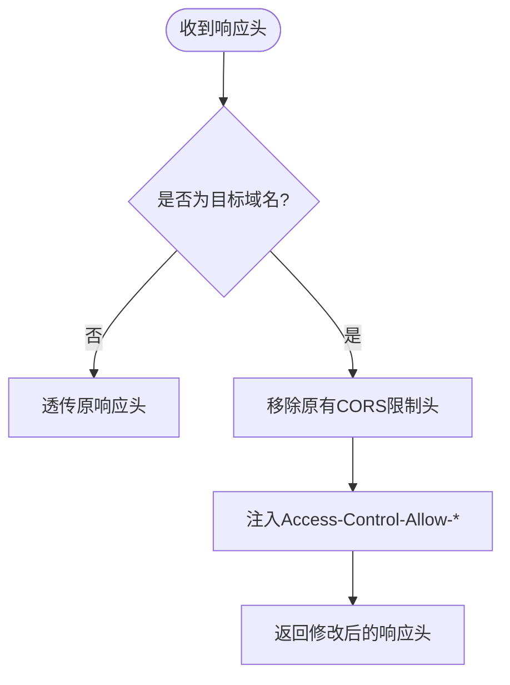
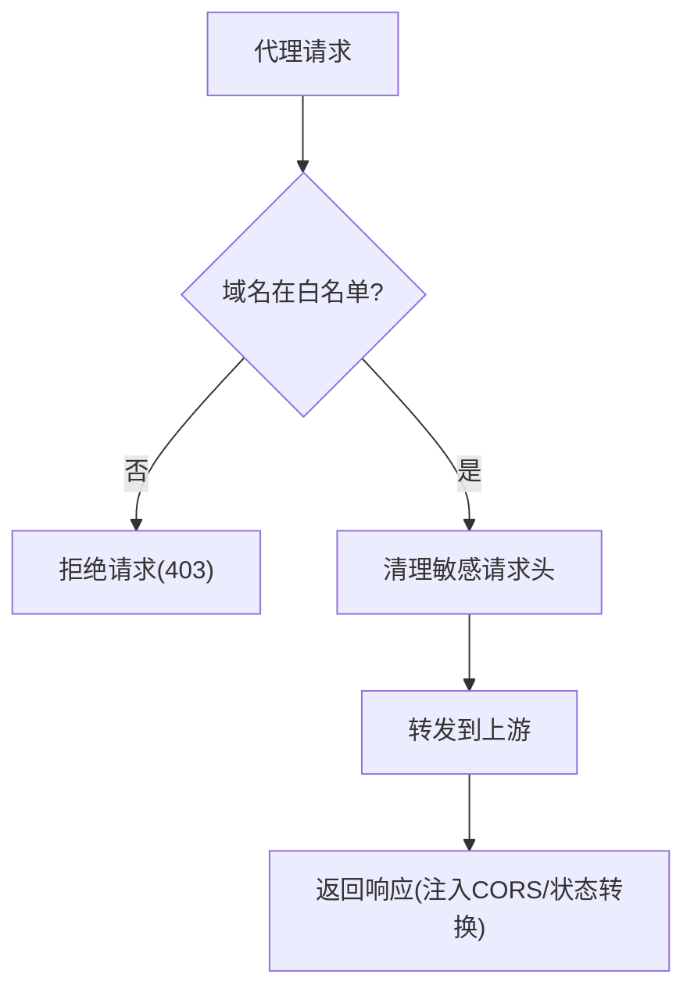
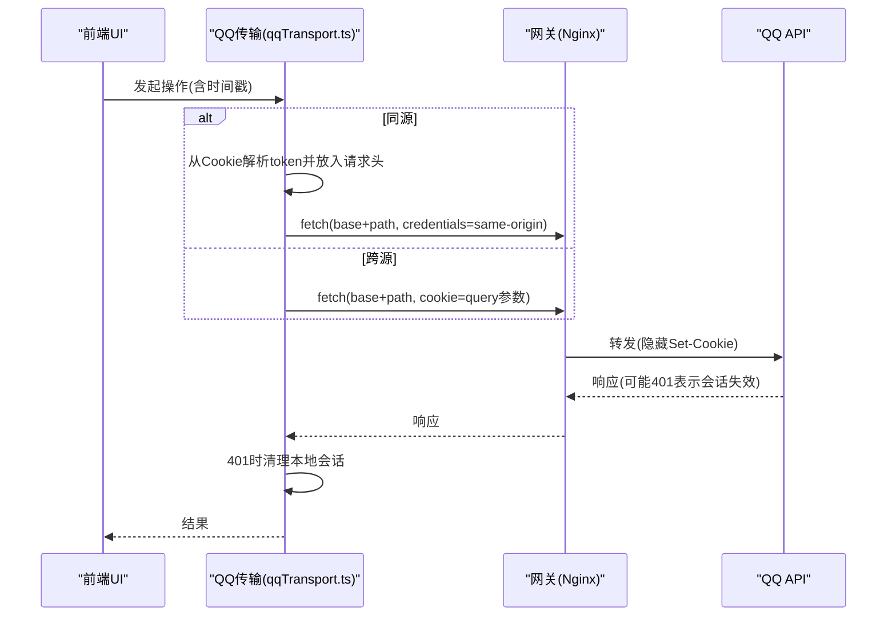
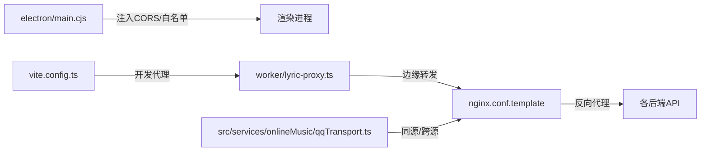

# 网络安全策略

<cite>
**本文引用的文件**
- [electron/main.cjs](file://electron/main.cjs)
- [vite.config.ts](file://vite.config.ts)
- [worker/lyric-proxy.ts](file://worker/lyric-proxy.ts)
- [deploy/docker/gateway/nginx.conf.template](file://deploy/docker/gateway/nginx.conf.template)
- [build-electron.cjs](file://build-electron.cjs)
- [electron/kugouApiBridge.cjs](file://electron/kugouApiBridge.cjs)
- [electron/qqAuthSessionRepository.cjs](file://electron/qqAuthSessionRepository.cjs)
- [src/services/onlineMusic/qqTransport.ts](file://src/services/onlineMusic/qqTransport.ts)
- [src/hooks/useOnlineProviderQrLogin.ts](file://src/hooks/useOnlineProviderQrLogin.ts)
- [src/components/visualizer/backgrounds/url/UrlBackgroundLayer.tsx](file://src/components/visualizer/backgrounds/url/UrlBackgroundLayer.tsx)
- [electron/modSystem/modProtocol.cjs](file://electron/modSystem/modProtocol.cjs)
</cite>

## 目录
1. [简介](#简介)
2. [项目结构](#项目结构)
3. [核心组件](#核心组件)
4. [架构总览](#架构总览)
5. [详细组件分析](#详细组件分析)
6. [依赖关系分析](#依赖关系分析)
7. [性能与安全注意事项](#性能与安全注意事项)
8. [故障排查指南](#故障排查指南)
9. [结论](#结论)
10. [附录](#附录)

## 简介
本文件聚焦 Folia Player 的网络安全策略，覆盖 HTTPS 证书验证、CORS 跨域控制、网络请求安全过滤、代理与网关配置、第三方服务集成（在线音乐提供商、OAuth/扫码登录）以及最佳实践。文档以代码级事实为依据，提供可视化图示与可操作的排障建议，帮助开发者在保持功能的同时强化安全性。

## 项目结构
本项目在网络层涉及多个层次：
- Electron 主进程：全局 CORS 响应头注入、域名白名单校验、歌词代理、错误监听等。
- Vite 开发服务器插件：开发环境下的歌词代理、CORS 预检处理、域名白名单。
- Cloudflare Worker 歌词代理：生产/边缘侧转发、CORS 头注入、特定域名 404 转 204。
- Nginx 网关：反向代理到各后端 API，隐藏敏感 Cookie，设置转发头。
- 前端运行时：同源/跨源请求策略、会话头传递、Cookie 处理。
- 构建脚本：构建期环境变量控制 TLS 行为（仅用于构建场景）。



**图表来源**
- [electron/main.cjs:1674-1750](file://electron/main.cjs#L1674-L1750)
- [vite.config.ts:11-49](file://vite.config.ts#L11-L49)
- [worker/lyric-proxy.ts:80-110](file://worker/lyric-proxy.ts#L80-L110)
- [deploy/docker/gateway/nginx.conf.template:42-79](file://deploy/docker/gateway/nginx.conf.template#L42-L79)
- [build-electron.cjs:1-6](file://build-electron.cjs#L1-L6)

**章节来源**
- [electron/main.cjs:1674-1750](file://electron/main.cjs#L1674-L1750)
- [vite.config.ts:11-49](file://vite.config.ts#L11-L49)
- [worker/lyric-proxy.ts:80-110](file://worker/lyric-proxy.ts#L80-L110)
- [deploy/docker/gateway/nginx.conf.template:42-79](file://deploy/docker/gateway/nginx.conf.template#L42-L79)
- [build-electron.cjs:1-6](file://build-electron.cjs#L1-L6)

## 核心组件
- 全局 CORS 响应头注入与域名白名单：在 Electron 主进程中针对特定域名注入宽松 CORS 头，便于跨域访问媒体资源。
- 歌词代理与域名白名单：开发环境与生产/边缘侧均实现严格的域名白名单校验，并统一注入 CORS 头。
- 网关反向代理：Nginx 将 /netease、/kugou、/qq、/api 路由至对应后端，隐藏 Set-Cookie 并设置转发头。
- 会话与认证持久化：QQ/KuGou 会话数据通过安全存储加密保存，避免明文落盘。
- 构建期 TLS 控制：构建脚本设置环境变量以适配企业代理或自签证书环境（仅限构建流程）。

**章节来源**
- [electron/main.cjs:1674-1750](file://electron/main.cjs#L1674-L1750)
- [vite.config.ts:11-49](file://vite.config.ts#L11-L49)
- [worker/lyric-proxy.ts:80-110](file://worker/lyric-proxy.ts#L80-L110)
- [deploy/docker/gateway/nginx.conf.template:42-79](file://deploy/docker/gateway/nginx.conf.template#L42-L79)
- [electron/kugouApiBridge.cjs:65-101](file://electron/kugouApiBridge.cjs#L65-L101)
- [electron/qqAuthSessionRepository.cjs:10-26](file://electron/qqAuthSessionRepository.cjs#L10-L26)
- [build-electron.cjs:1-6](file://build-electron.cjs#L1-L6)

## 架构总览
下图展示了从前端发起网络请求到最终到达上游服务的完整路径，以及在各层的安全控制点。

```mermaid
sequenceDiagram
participant FE as "前端(渲染进程)"
participant EP as "Electron 主进程(main.cjs)"
participant VP as "Vite 开发代理(vite.config.ts)"
participant WP as "Worker 歌词代理(worker/lyric-proxy.ts)"
participant NG as "Nginx 网关(nginx.conf.template)"
participant API as "上游API"
FE->>VP : 开发环境 /api/lyric-proxy?url=...
VP->>VP : 域名白名单校验 + 预检OPTIONS
VP->>WP : 转发请求(携带清理后的Headers)
WP->>WP : 注入CORS头, 404->204(特定域名)
WP->>NG : 转发到后端API
NG->>API : 反向代理(隐藏Set-Cookie, 设置X-Forwarded-*)
API-->>NG : 响应
NG-->>WP : 响应
WP-->>VP : 响应(CORS已注入)
VP-->>FE : 响应(可跨域读取)
Note over FE,API : 生产环境可通过Nginx直接代理到各API; 跨域由上游或边缘层处理
```

**图表来源**
- [vite.config.ts:68-137](file://vite.config.ts#L68-L137)
- [worker/lyric-proxy.ts:80-110](file://worker/lyric-proxy.ts#L80-L110)
- [deploy/docker/gateway/nginx.conf.template:42-79](file://deploy/docker/gateway/nginx.conf.template#L42-L79)

## 详细组件分析

### HTTPS 证书验证与证书错误处理
- 构建期 TLS 控制：构建脚本设置环境变量以允许不验证证书，适用于企业代理或自签证书环境。该设置仅在构建阶段生效，不应在生产运行环境中启用。
- 证书错误事件：当前仓库未在主进程中显式注册 certificate-error 事件处理器；如需自定义证书信任策略，可在 Electron 主进程中添加相应监听并在白名单中放行受信任证书。
- 风险与建议：
  - 避免在生产环境关闭证书验证。
  - 若必须支持内部 CA，建议使用系统信任链或应用内固定证书（pinning），而非全局放宽验证。

**章节来源**
- [build-electron.cjs:1-6](file://build-electron.cjs#L1-L6)

### CORS 跨域资源共享控制
- Electron 主进程：对指定域名（如 qq.com、kugou.com 及其子域、y.gtimg.cn、amll-ttml-db.stevexmh.net）在响应头中移除原有 CORS 限制并注入宽松头，使渲染进程可跨域读取媒体等资源。
- 开发环境代理：Vite 插件为 /api/lyric-proxy 提供预检 OPTIONS 处理，并注入统一的 CORS 头集合，同时严格校验目标主机名白名单。
- 边缘代理：Cloudflare Worker 在返回响应时注入 CORS 头，并对特定数据库域名在 404 时返回 204，避免前端报错。
- 网关层：Nginx 隐藏 Set-Cookie 并设置 X-Forwarded-* 头，确保后端正确识别协议与客户端信息。



**图表来源**
- [electron/main.cjs:1674-1737](file://electron/main.cjs#L1674-L1737)
- [vite.config.ts:11-49](file://vite.config.ts#L11-L49)
- [worker/lyric-proxy.ts:80-110](file://worker/lyric-proxy.ts#L80-L110)

**章节来源**
- [electron/main.cjs:1674-1737](file://electron/main.cjs#L1674-L1737)
- [vite.config.ts:11-49](file://vite.config.ts#L11-L49)
- [worker/lyric-proxy.ts:80-110](file://worker/lyric-proxy.ts#L80-L110)
- [deploy/docker/gateway/nginx.conf.template:42-79](file://deploy/docker/gateway/nginx.conf.template#L42-L79)

### 网络请求安全过滤（URL 白名单、域名验证、请求拦截）
- 域名白名单：歌词代理在开发与生产环境均使用白名单函数校验目标主机名，拒绝非预期域名。
- 请求头清洗：代理层删除 host、connection、content-length、origin、referer 等敏感或不必要头部，防止泄露上下文。
- 资源类型过滤：Electron 主进程对酷狗媒体请求进行错误监听与日志记录，便于定位网络问题。
- 模块协议安全：自定义协议加载模块时，禁止路径穿越与绝对路径，限制在已验证模块目录内访问。



**图表来源**
- [vite.config.ts:34-49](file://vite.config.ts#L34-L49)
- [vite.config.ts:68-137](file://vite.config.ts#L68-L137)
- [electron/main.cjs:1739-1750](file://electron/main.cjs#L1739-L1750)
- [electron/modSystem/modProtocol.cjs:51-69](file://electron/modSystem/modProtocol.cjs#L51-L69)

**章节来源**
- [vite.config.ts:34-49](file://vite.config.ts#L34-L49)
- [vite.config.ts:68-137](file://vite.config.ts#L68-L137)
- [electron/main.cjs:1739-1750](file://electron/main.cjs#L1739-L1750)
- [electron/modSystem/modProtocol.cjs:51-69](file://electron/modSystem/modProtocol.cjs#L51-L69)

### 代理与网络配置的安全考虑
- 网关反向代理：Nginx 将外部请求转发到内部 API，隐藏 Set-Cookie，设置 Host/X-Forwarded-*，减少敏感信息泄露。
- 代理认证与加密：当前配置未暴露代理认证机制；建议在网关层启用基本认证或基于令牌的身份校验，并使用 HTTPS 终止于网关。
- 流量监控：Nginx 输出访问日志到标准输出，便于集中采集与分析。
- 连接缓冲：网易二维码登录存在大 Set-Cookie 头，网关调整了缓冲区大小以避免截断。

**章节来源**
- [deploy/docker/gateway/nginx.conf.template:42-79](file://deploy/docker/gateway/nginx.conf.template#L42-L79)

### 第三方服务集成的安全处理
- QQ 传输层：
  - 同源请求：使用 same-origin 凭据模式，并通过自定义头传递会话令牌；跨源请求则省略凭据，避免浏览器自动携带 Cookie。
  - 会话清理：当令牌无效时主动清理本地会话，降低越权风险。
- 扫码登录：
  - 前端钩子负责创建二维码、轮询确认状态、释放会话，确保生命周期可控。
- KuGou 桥接：
  - 会话 Cookie 合并与持久化，使用安全存储加密保存，拒绝无加密后端（Linux basic_text）。
- 安全存储：
  - QQ 认证会话通过 safeStorage 加密后写入 electron-store，避免明文落盘；在不可用时执行清理逻辑。



**图表来源**
- [src/services/onlineMusic/qqTransport.ts:202-229](file://src/services/onlineMusic/qqTransport.ts#L202-L229)
- [deploy/docker/gateway/nginx.conf.template:64-71](file://deploy/docker/gateway/nginx.conf.template#L64-L71)

**章节来源**
- [src/services/onlineMusic/qqTransport.ts:202-229](file://src/services/onlineMusic/qqTransport.ts#L202-L229)
- [src/hooks/useOnlineProviderQrLogin.ts:59-91](file://src/hooks/useOnlineProviderQrLogin.ts#L59-L91)
- [electron/kugouApiBridge.cjs:65-101](file://electron/kugouApiBridge.cjs#L65-L101)
- [electron/qqAuthSessionRepository.cjs:10-26](file://electron/qqAuthSessionRepository.cjs#L10-L26)

### 嵌入内容与 iframe 安全
- 可视化背景 URL 使用 iframe 加载，并启用 sandbox 限制脚本执行能力，降低恶意内容风险。
- 叠加半透明遮罩保证歌词可读性，不影响安全属性。

**章节来源**
- [src/components/visualizer/backgrounds/url/UrlBackgroundLayer.tsx:63-89](file://src/components/visualizer/backgrounds/url/UrlBackgroundLayer.tsx#L63-L89)

## 依赖关系分析
- 主进程与代理：Electron 主进程通过 webRequest 拦截响应头，配合域名白名单实现跨域兼容；歌词代理在开发与生产两端保持一致的白名单策略。
- 网关与后端：Nginx 作为统一入口，屏蔽敏感头并转发到各后端服务，保证前后端解耦与安全边界。
- 前端与传输层：根据部署形态选择同源/跨源策略，确保会话令牌不被泄露到不受控的上下文中。



**图表来源**
- [electron/main.cjs:1674-1750](file://electron/main.cjs#L1674-L1750)
- [vite.config.ts:68-137](file://vite.config.ts#L68-L137)
- [worker/lyric-proxy.ts:80-110](file://worker/lyric-proxy.ts#L80-L110)
- [deploy/docker/gateway/nginx.conf.template:42-79](file://deploy/docker/gateway/nginx.conf.template#L42-L79)
- [src/services/onlineMusic/qqTransport.ts:202-229](file://src/services/onlineMusic/qqTransport.ts#L202-L229)

**章节来源**
- [electron/main.cjs:1674-1750](file://electron/main.cjs#L1674-L1750)
- [vite.config.ts:68-137](file://vite.config.ts#L68-L137)
- [worker/lyric-proxy.ts:80-110](file://worker/lyric-proxy.ts#L80-L110)
- [deploy/docker/gateway/nginx.conf.template:42-79](file://deploy/docker/gateway/nginx.conf.template#L42-L79)
- [src/services/onlineMusic/qqTransport.ts:202-229](file://src/services/onlineMusic/qqTransport.ts#L202-L229)

## 性能与安全注意事项
- 证书验证：生产环境务必启用严格证书验证；仅在构建脚本中按需放宽，避免影响运行期。
- CORS 最小权限：尽量限定允许的 Origin、Methods、Headers，避免使用通配符扩大攻击面。
- 请求超时与重试：为所有出站请求设置合理超时与重试上限，防止资源耗尽。
- 敏感头清理：代理层持续审查并清理不必要的请求头，减少信息泄露。
- 会话管理：及时清理过期或无效会话，避免重放与越权。
- 网关加固：启用 HTTPS、HSTS、限流与访问控制列表，集中审计日志。

[本节为通用指导，无需具体文件引用]

## 故障排查指南
- 跨域失败：检查目标域名是否在白名单内，确认响应头是否正确注入；查看 Electron 主进程的 onHeadersReceived 回调与 Vite 开发代理的 OPTIONS 处理。
- 404 转 204：对于特定数据库域名，代理会将 404 转换为 204，若出现异常请检查域名匹配逻辑。
- 会话丢失：若收到 401，检查前端是否按策略清理本地会话；确认网关是否隐藏了 Set-Cookie 导致后端无法识别。
- 构建期 TLS 问题：确认仅在构建脚本中设置了相关环境变量；若运行期仍受影响，请检查是否有其他进程或配置覆盖了默认行为。

**章节来源**
- [electron/main.cjs:1674-1750](file://electron/main.cjs#L1674-L1750)
- [vite.config.ts:68-137](file://vite.config.ts#L68-L137)
- [worker/lyric-proxy.ts:80-110](file://worker/lyric-proxy.ts#L80-L110)
- [src/services/onlineMusic/qqTransport.ts:202-229](file://src/services/onlineMusic/qqTransport.ts#L202-L229)
- [build-electron.cjs:1-6](file://build-electron.cjs#L1-L6)

## 结论
Folia Player 在网络层通过多层白名单、CORS 注入、网关反向代理与会话加密等手段构建了较为完善的安全边界。建议在后续迭代中进一步收紧 CORS 策略、引入更细粒度的访问控制与审计机制，并确保生产环境始终启用严格的证书验证与传输加密。

## 附录
- 域名白名单参考：qq.com、*.qq.com、y.gtimg.cn、kugou.com、*.kugou.com、kgimg.com、*.kgimg.com、amll-ttml-db.stevexmh.net。
- 关键配置位置：
  - Electron 主进程 CORS 注入与白名单：[electron/main.cjs:1674-1750](file://electron/main.cjs#L1674-L1750)
  - 开发歌词代理与预检：[vite.config.ts:68-137](file://vite.config.ts#L68-L137)
  - 边缘歌词代理与 404 转换：[worker/lyric-proxy.ts:80-110](file://worker/lyric-proxy.ts#L80-L110)
  - 网关反向代理与隐藏 Cookie：[deploy/docker/gateway/nginx.conf.template:42-79](file://deploy/docker/gateway/nginx.conf.template#L42-L79)
  - 构建期 TLS 控制：[build-electron.cjs:1-6](file://build-electron.cjs#L1-L6)
  - QQ 传输层同源/跨源策略：[src/services/onlineMusic/qqTransport.ts:202-229](file://src/services/onlineMusic/qqTransport.ts#L202-L229)
  - 会话安全存储：[electron/qqAuthSessionRepository.cjs:10-26](file://electron/qqAuthSessionRepository.cjs#L10-L26)、[electron/kugouApiBridge.cjs:65-101](file://electron/kugouApiBridge.cjs#L65-L101)