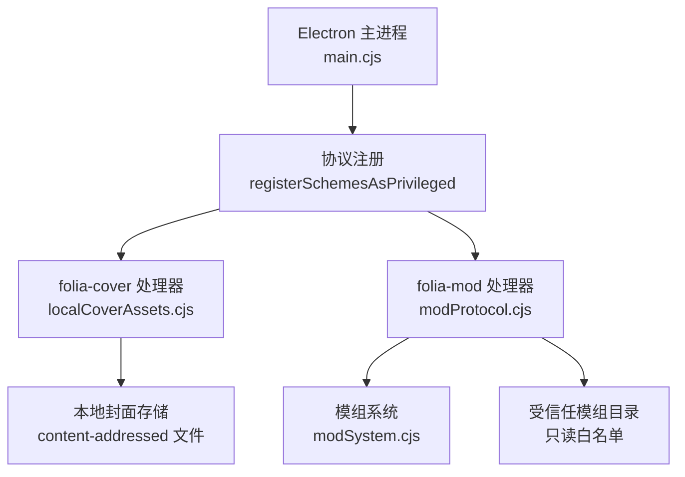
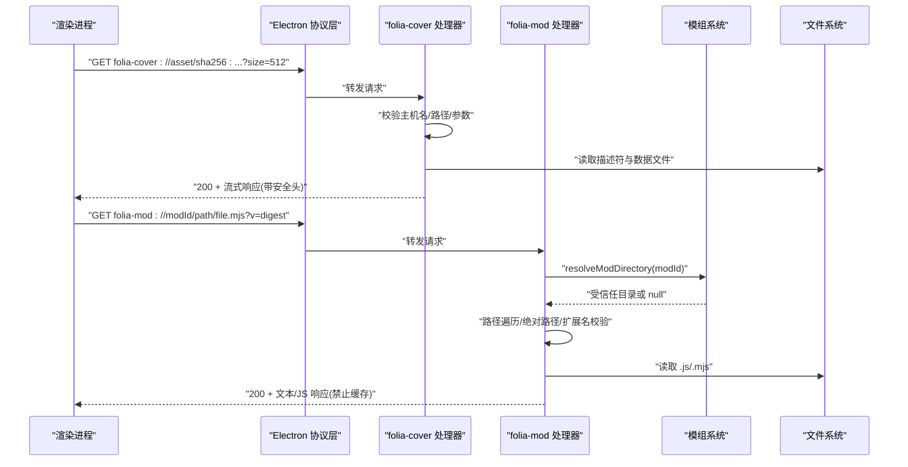
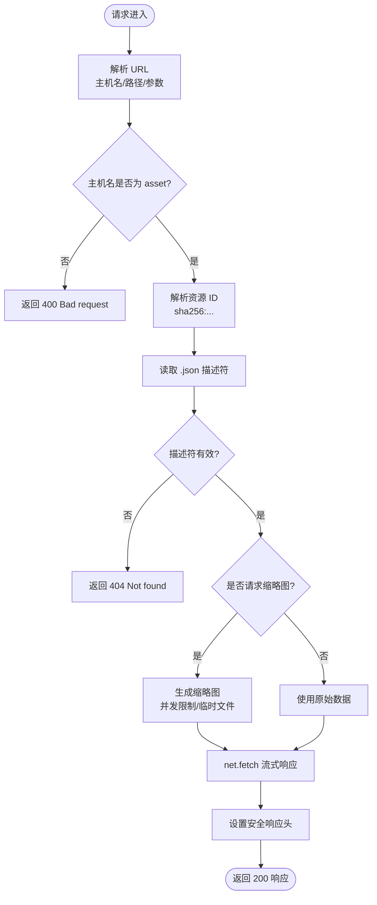
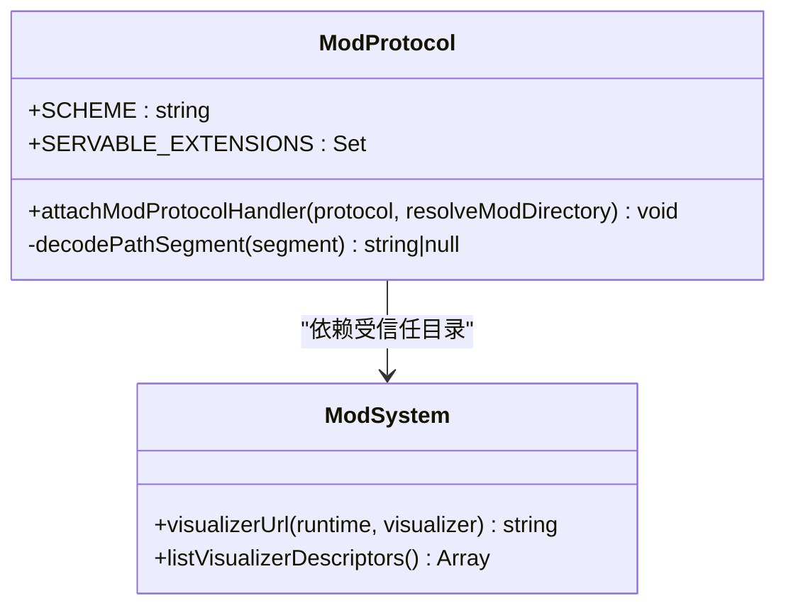
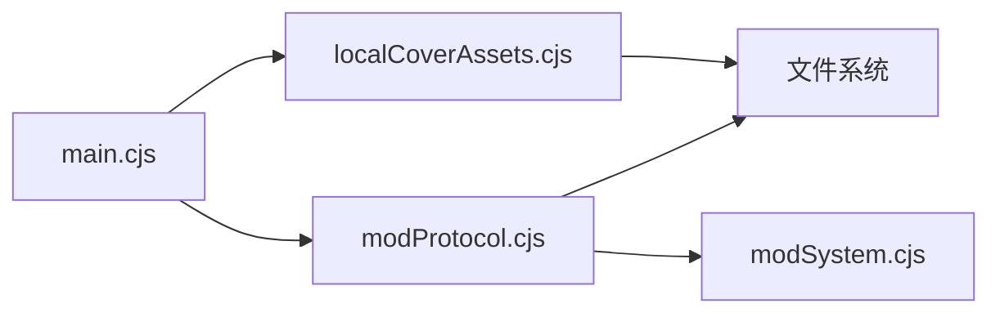

# 自定义协议安全

<cite>
**本文引用的文件**
- [main.cjs](file://electron/main.cjs)
- [modProtocol.cjs](file://electron/modSystem/modProtocol.cjs)
- [localCoverAssets.cjs](file://electron/localCoverAssets.cjs)
- [modSystem.cjs](file://electron/modSystem/modSystem.cjs)
</cite>

## 目录
1. [简介](#简介)
2. [项目结构](#项目结构)
3. [核心组件](#核心组件)
4. [架构总览](#架构总览)
5. [详细组件分析](#详细组件分析)
6. [依赖关系分析](#依赖关系分析)
7. [性能与安全考量](#性能与安全考量)
8. [故障排查指南](#故障排查指南)
9. [结论](#结论)
10. [附录：自定义协议开发安全指南](#附录自定义协议开发安全指南)

## 简介
本技术文档聚焦 Folia Player 的自定义协议安全，围绕以下目标展开：
- 深入解析 folia-cover 协议的安全实现：封面图片的安全加载、URL 校验、资源访问控制与流式响应。
- 详细说明模组协议（MOD_PROTOCOL_PRIVILEGED_SCHEME）的安全设计：模组来源验证、执行权限控制、沙箱隔离与最小暴露面。
- 解释协议注册的安全配置：registerSchemesAsPrivileged 的参数设置、标准协议权限、HTTPS 支持、CORS 配置等。
- 梳理协议请求处理流程：URL 解析、参数校验、路径遍历防护、文件类型白名单、最终响应头安全策略。
- 提供审计日志建议与最佳实践：记录所有协议访问行为以便安全监控，并给出输入验证、路径遍历防护、恶意代码检测等安全开发规范。

## 项目结构
Folia Player 在 Electron 主进程中统一注册自定义协议，并通过模块化的处理器对请求进行严格校验与响应：
- 协议注册入口位于主进程初始化阶段，集中声明所有自定义协议的权限开关。
- folia-cover 协议由本地封面资产模块提供处理器，负责内容寻址、缩略图生成与流式返回。
- folia-mod 协议由模组系统提供处理器，仅允许读取已发现且通过校验的模组目录中的 JS/ESM 文件。

图表来源
- [main.cjs:38-54](file://electron/main.cjs#L38-L54)
- [localCoverAssets.cjs:187-217](file://electron/localCoverAssets.cjs#L187-L217)
- [modProtocol.cjs:51-92](file://electron/modSystem/modProtocol.cjs#L51-L92)
- [modSystem.cjs:1-12](file://electron/modSystem/modSystem.cjs#L1-L12)

章节来源
- [main.cjs:38-54](file://electron/main.cjs#L38-L54)

## 核心组件
- 协议注册与权限配置：在主进程启动时一次性注册所有自定义协议，避免多次调用覆盖导致权限丢失。
- folia-cover 协议处理器：基于内容地址（SHA-256）的本地封面资源访问，严格的 MIME 白名单与缩略图尺寸限制，流式响应与缓存控制。
- folia-mod 协议处理器：只读、白名单扩展名、路径遍历防护、绝对路径拒绝、受控于模组系统的已验证模组目录。
- 模组系统：发现、校验、哈希、信任绑定与启用确认；将模组贡献以受限 URL 暴露给渲染进程，但不执行 Node 代码。

章节来源
- [main.cjs:38-54](file://electron/main.cjs#L38-L54)
- [localCoverAssets.cjs:9-48](file://electron/localCoverAssets.cjs#L9-L48)
- [modProtocol.cjs:13-36](file://electron/modSystem/modProtocol.cjs#L13-L36)
- [modSystem.cjs:1-12](file://electron/modSystem/modSystem.cjs#L1-L12)

## 架构总览
下图展示了从浏览器发起的协议请求到主进程处理的完整链路，以及关键安全校验点。

图表来源
- [localCoverAssets.cjs:187-217](file://electron/localCoverAssets.cjs#L187-L217)
- [modProtocol.cjs:51-92](file://electron/modSystem/modProtocol.cjs#L51-L92)
- [modSystem.cjs:333-337](file://electron/modSystem/modSystem.cjs#L333-L337)

## 详细组件分析

### folia-cover 协议安全实现
- 内容寻址与元数据校验：使用 SHA-256 作为资源 ID，读取对应的 .bin 与 .json 描述符，校验 id、mimeType、size 等字段，确保资源完整性与类型合法性。
- 参数与路径校验：强制主机名为 asset，路径段解码后作为资源 ID，查询参数 size 限定为 512 或 1024，其他值被拒绝。
- 缩略图生成与并发控制：按需生成缩略图，限制并发任务数，临时文件原子替换，失败清理。
- 响应头安全：设置 Cache-Control 为长期可缓存且不可变，Content-Type 严格匹配，X-Content-Type-Options 防止嗅探。
- 流式响应：通过 net.fetch 将本地文件以流方式返回，减少内存占用。

图表来源
- [localCoverAssets.cjs:20-48](file://electron/localCoverAssets.cjs#L20-L48)
- [localCoverAssets.cjs:71-88](file://electron/localCoverAssets.cjs#L71-L88)
- [localCoverAssets.cjs:92-127](file://electron/localCoverAssets.cjs#L92-L127)
- [localCoverAssets.cjs:187-217](file://electron/localCoverAssets.cjs#L187-L217)

章节来源
- [localCoverAssets.cjs:9-48](file://electron/localCoverAssets.cjs#L9-L48)
- [localCoverAssets.cjs:71-88](file://electron/localCoverAssets.cjs#L71-L88)
- [localCoverAssets.cjs:92-127](file://electron/localCoverAssets.cjs#L92-L127)
- [localCoverAssets.cjs:187-217](file://electron/localCoverAssets.cjs#L187-L217)

### 模组协议（MOD_PROTOCOL_PRIVILEGED_SCHEME）安全设计
- 协议权限：standard、secure、supportFetchAPI、corsEnabled、stream 全部开启，使渲染进程可通过 fetch 获取模组贡献，但仅限于只读文件服务。
- 来源验证：resolveModDirectory 必须返回受信任的模组目录，未知模组直接拒绝。
- 路径与扩展名白名单：拒绝路径遍历（..）、反斜杠、绝对路径；仅允许 .js 与 .mjs 扩展名。
- 安全响应头：Content-Type 明确指定，Cache-Control 设置为 no-store，避免缓存陈旧版本。
- 执行边界：协议本身不执行 Node 代码，仅在渲染进程动态导入 ESM 贡献，风险面受限于浏览器沙箱。

图表来源
- [modProtocol.cjs:13-36](file://electron/modSystem/modProtocol.cjs#L13-L36)
- [modProtocol.cjs:51-92](file://electron/modSystem/modProtocol.cjs#L51-L92)
- [modSystem.cjs:333-337](file://electron/modSystem/modSystem.cjs#L333-L337)

章节来源
- [modProtocol.cjs:13-36](file://electron/modSystem/modProtocol.cjs#L13-L36)
- [modProtocol.cjs:51-92](file://electron/modSystem/modProtocol.cjs#L51-L92)
- [modSystem.cjs:333-337](file://electron/modSystem/modSystem.cjs#L333-L337)

### 协议注册的安全配置
- 一次性注册：所有自定义协议必须在一次 registerSchemesAsPrivileged 调用中注册，避免后续调用覆盖之前的权限。
- 权限项说明：
  - standard: true，遵循标准协议语义。
  - secure: true，视为 HTTPS 上下文，提升安全性。
  - supportFetchAPI: true，允许渲染进程通过 fetch 访问。
  - corsEnabled: true，允许跨域请求（用于本地资源）。
  - stream: true，支持流式响应，降低大文件内存占用。
- HTTPS 证书例外：仅对特定 CDN 主机名在特定错误场景下放宽证书检查，保持其余网络请求的 TLS 校验。

章节来源
- [main.cjs:38-54](file://electron/main.cjs#L38-L54)
- [main.cjs:56-76](file://electron/main.cjs#L56-L76)

### 协议请求处理流程与防护机制
- URL 解析：使用 URL API 解析请求，严格校验主机名与路径段。
- 参数验证：缩略图尺寸限定为固定集合；资源 ID 必须符合正则模式。
- 路径安全检查：拒绝路径遍历、绝对路径、反斜杠；最终路径需以受控目录开头。
- 文件类型白名单：仅允许 .js/.mjs；封面资源 MIME 类型白名单。
- 响应头安全：禁用嗅探、合理缓存策略、明确 Content-Type。
- 错误处理：非法请求返回 400/403/404，异常捕获返回 500。

章节来源
- [localCoverAssets.cjs:20-48](file://electron/localCoverAssets.cjs#L20-L48)
- [localCoverAssets.cjs:187-217](file://electron/localCoverAssets.cjs#L187-L217)
- [modProtocol.cjs:51-92](file://electron/modSystem/modProtocol.cjs#L51-L92)

## 依赖关系分析
- main.cjs 依赖 localCoverAssets.cjs 与 modProtocol.cjs，并在启动时完成协议注册。
- modSystem.cjs 管理模组生命周期、信任绑定与可视化贡献，modProtocol.cjs 为其提供安全的文件服务。
- 各处理器之间无直接耦合，通过 Electron 协议层解耦，便于独立测试与维护。

图表来源
- [main.cjs:38-54](file://electron/main.cjs#L38-L54)
- [localCoverAssets.cjs:187-217](file://electron/localCoverAssets.cjs#L187-L217)
- [modProtocol.cjs:51-92](file://electron/modSystem/modProtocol.cjs#L51-L92)
- [modSystem.cjs:1-12](file://electron/modSystem/modSystem.cjs#L1-L12)

章节来源
- [main.cjs:38-54](file://electron/main.cjs#L38-L54)

## 性能与安全考量
- 性能优化：
  - 缩略图生成采用并发限制与去重，避免重复计算。
  - 流式响应减少大文件内存占用。
  - 缓存策略区分开发（no-store）与生产（immutable），平衡更新与性能。
- 安全加固：
  - 内容寻址确保资源完整性。
  - 白名单与严格校验防止路径遍历与注入。
  - 最小权限原则：协议仅暴露必要能力，执行边界清晰。
  - 证书例外最小化，仅针对已知可信场景。

## 故障排查指南
- 400 Bad request：URL 解析失败、主机名不符、方法非 GET、路径包含非法字符或绝对路径。
- 403 Forbidden：文件类型不在白名单、路径越界。
- 404 Not found：资源不存在、描述符无效。
- 500 Internal server error：内部异常，查看日志定位具体原因。
- 常见问题：
  - 缩略图未生成：检查并发队列与临时文件写入权限。
  - 模组无法加载：确认模组已启用且 digest 匹配，路径与扩展名合法。

章节来源
- [localCoverAssets.cjs:187-217](file://electron/localCoverAssets.cjs#L187-L217)
- [modProtocol.cjs:51-92](file://electron/modSystem/modProtocol.cjs#L51-L92)

## 结论
Folia Player 的自定义协议安全设计体现了“最小暴露面、严格校验、内容寻址、流式响应”的原则。folia-cover 与 folia-mod 两个协议分别面向本地资源与模组贡献，均实现了细粒度的访问控制与安全防护。通过一次性注册协议权限、限制 HTTPS 证书例外、白名单与路径校验，系统在功能性与安全性之间取得良好平衡。建议在后续迭代中持续完善审计日志与监控告警，进一步提升可观测性与应急响应能力。

## 附录：自定义协议开发安全指南
- 输入验证：对所有 URL 参数进行强类型与格式校验，拒绝非法值。
- 路径遍历防护：拒绝 ..、绝对路径、反斜杠；最终路径必须以受控目录开头。
- 文件类型白名单：仅允许必要的扩展名与 MIME 类型。
- 执行边界：协议处理器不应执行 Node 代码，尽量在渲染进程沙箱内运行。
- 缓存策略：开发环境禁用缓存，生产环境使用 immutable 缓存。
- 安全响应头：设置 X-Content-Type-Options: nosniff，明确 Content-Type。
- 审计日志：记录所有协议访问行为（时间、来源、资源、结果），便于安全监控与取证。
- 错误处理：区分客户端错误与服务端错误，避免泄露敏感信息。
- 证书例外：仅对已知可信域名与错误场景放宽，默认保持严格 TLS 校验。