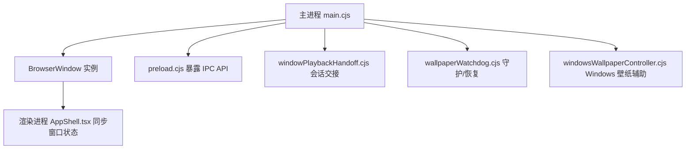
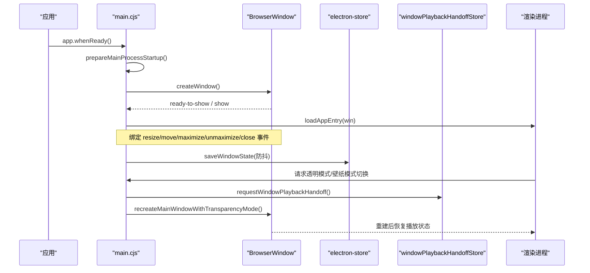
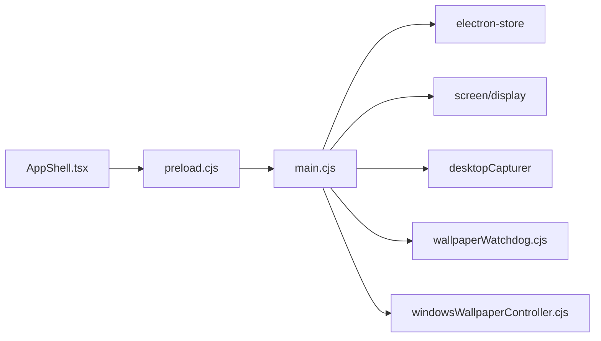

# 主窗口生命周期管理

<cite>
**本文引用的文件**
- [electron/main.cjs](file://electron/main.cjs)
- [electron/preload.cjs](file://electron/preload.cjs)
- [electron/windowPlaybackHandoff.cjs](file://electron/windowPlaybackHandoff.cjs)
- [electron/wallpaperWatchdog.cjs](file://electron/wallpaperWatchdog.cjs)
- [electron/windowsWallpaperController.cjs](file://electron/windowsWallpaperController.cjs)
- [src/components/app/AppShell.tsx](file://src/components/app/AppShell.tsx)
</cite>

## 目录
1. [简介](#简介)
2. [项目结构](#项目结构)
3. [核心组件](#核心组件)
4. [架构总览](#架构总览)
5. [详细组件分析](#详细组件分析)
6. [依赖关系分析](#依赖关系分析)
7. [性能考量](#性能考量)
8. [故障排查指南](#故障排查指南)
9. [结论](#结论)
10. [附录](#附录)

## 简介
本技术文档聚焦 Folia Player 的主窗口生命周期管理，覆盖窗口的创建、初始化、显示、隐藏、销毁全流程；详细说明窗口配置（大小、位置、透明度、置顶等）与状态持久化策略；解释窗口事件处理（焦点变化、尺寸调整、关闭等）；梳理跨平台差异与适配方案（Windows、macOS、Linux），并给出 GPU 加速、内存管理与渲染优化等最佳实践。

## 项目结构
主窗口生命周期由 Electron 主进程集中编排，关键职责划分如下：
- 主进程入口与窗口工厂：负责窗口创建、配置、事件绑定、状态持久化、跨平台特性开关。
- 预加载脚本：向渲染进程暴露受控 IPC API，用于控制窗口行为（最小化/最大化/全屏/关闭/透明模式等）。
- 播放会话交接：在窗口重建或进程重启时保持播放状态不丢失。
- 壁纸模式守护：在 Linux Wayland/X11 与 Windows 上实现“桌面层”窗口，提供点击穿透、鼠标注入、自动恢复等能力。
- 渲染侧 UI：根据窗口状态同步 UI（如是否最大化、圆角应用等）。

图表来源
- [electron/main.cjs:3832-3986](file://electron/main.cjs#L3832-L3986)
- [electron/preload.cjs:135-155](file://electron/preload.cjs#L135-L155)
- [electron/windowPlaybackHandoff.cjs:11-96](file://electron/windowPlaybackHandoff.cjs#L11-L96)
- [electron/wallpaperWatchdog.cjs:27-176](file://electron/wallpaperWatchdog.cjs#L27-L176)
- [electron/windowsWallpaperController.cjs:373-408](file://electron/windowsWallpaperController.cjs#L373-L408)
- [src/components/app/AppShell.tsx:45-76](file://src/components/app/AppShell.tsx#L45-L76)

章节来源
- [electron/main.cjs:3832-4200](file://electron/main.cjs#L3832-L4200)
- [electron/preload.cjs:1-320](file://electron/preload.cjs#L1-L320)

## 核心组件
- 主窗口工厂 createWindow：统一构建 BrowserWindow，处理壁纸模式几何、透明/模糊、置顶、任务栏跳过、最小/高尺寸限制、webPreferences 安全选项等。
- 窗口状态持久化：保存/恢复 WINDOW_BOUNDS、WINDOW_IS_MAXIMIZED，防抖写入，避免频繁 IO。
- 窗口事件监听：resize/move/maximize/unmaximize/close 等事件触发状态保存；show/hide/minimize/restore 刷新托盘菜单。
- 播放会话交接 windowPlaybackHandoffStore：在窗口重建或进程重启期间缓存播放快照，支持 TTL 与可选持久化存储。
- 壁纸模式守护：检测并处理渲染崩溃、父进程异常、WorkerW 断开等情况，必要时降级为普通窗口或重建窗口。
- 渲染侧状态同步：AppShell 通过 IPC 查询窗口是否最大化，以决定是否应用自定义圆角等样式。

章节来源
- [electron/main.cjs:1029-1129](file://electron/main.cjs#L1029-L1129)
- [electron/main.cjs:3832-3986](file://electron/main.cjs#L3832-L3986)
- [electron/windowPlaybackHandoff.cjs:11-96](file://electron/windowPlaybackHandoff.cjs#L11-L96)
- [electron/wallpaperWatchdog.cjs:27-176](file://electron/wallpaperWatchdog.cjs#L27-L176)
- [src/components/app/AppShell.tsx:45-76](file://src/components/app/AppShell.tsx#L45-L76)

## 架构总览
主窗口生命周期围绕 createWindow 展开，贯穿启动、运行期切换、退出三个阶段。关键交互包括：
- 启动阶段：app.whenReady 后调用 createWindow，设置托盘、置顶、点击穿透、Windows 缩略按钮等。
- 运行期：用户操作或设置变更可能触发 recreateMainWindowWithTransparencyMode，进行透明模式切换或壁纸模式切换，期间使用播放会话交接保证体验连贯。
- 退出阶段：close/closed 事件清理资源、停止防休眠、关闭远程窗口、刷新托盘。

图表来源
- [electron/main.cjs:4073-4200](file://electron/main.cjs#L4073-L4200)
- [electron/main.cjs:3832-3986](file://electron/main.cjs#L3832-L3986)
- [electron/windowPlaybackHandoff.cjs:11-96](file://electron/windowPlaybackHandoff.cjs#L11-L96)

## 详细组件分析

### 窗口创建与初始化
- 窗口参数：
  - 尺寸与位置：从 store 读取 WINDOW_BOUNDS，确保可见于当前屏幕工作区；壁纸模式下强制全屏几何。
  - 无边框与阴影：frame:false，非透明时 hasShadow:true。
  - 透明与模糊：根据 enable_player_page_native_blur 与平台特性启用 macOS vibrancy 或 Windows backgroundMaterial(acrylic)。
  - 置顶：alwaysOnTop 在非壁纸模式下可配置。
  - 任务栏：skipTaskbar 可隐藏任务栏图标。
  - webPreferences：禁用 nodeIntegration、启用 contextIsolation、webSecurity、backgroundThrottling:false。
- 壁纸模式特殊处理：
  - X11：type:'desktop'，全屏覆盖，不可移动/调整大小。
  - Windows：helper 将窗口 parent 到 WorkerW，运行时可切换透明/不透明，必要时重建窗口。
- 事件绑定：
  - resize/move：防抖保存窗口几何。
  - maximize/unmaximize/close：立即保存状态。
  - show/hide/minimize/restore：刷新托盘菜单。
  - render-process-gone：壁纸模式下根据平台策略重载或重建窗口。

章节来源
- [electron/main.cjs:3832-3986](file://electron/main.cjs#L3832-L3986)
- [electron/main.cjs:1029-1129](file://electron/main.cjs#L1029-L1129)

### 窗口显示与隐藏
- 显示时机：
  - 正常模式：showImmediately=true 直接显示。
  - X11 桌面窗口：先 setBounds 再 show，避免被 work area 裁剪。
- 隐藏逻辑：
  - 托盘菜单可切换显示/隐藏。
  - 最小化时更新托盘菜单状态。
- 托盘联动：
  - 托盘菜单项包含显示/隐藏、打开遥控窗口、点击穿透、壁纸模式、重置窗口、隐藏任务栏图标、退出等。

章节来源
- [electron/main.cjs:3832-3986](file://electron/main.cjs#L3832-L3986)

### 窗口销毁与资源清理
- close 事件：保存最终窗口状态。
- closed 事件：
  - 清空 mainWindow 引用。
  - 停止防休眠模块。
  - 关闭点击穿透解锁悬停监控。
  - 关闭远程窗口。
  - 刷新托盘菜单。

章节来源
- [electron/main.cjs:3966-3986](file://electron/main.cjs#L3966-L3986)

### 窗口配置选项管理
- 窗口大小与位置：
  - 默认尺寸：width:1200, height:800。
  - 最小尺寸：minWidth:350, minHeight:100。
  - ensureWindowBoundsVisible：校验并修正超出屏幕的坐标。
- 透明度与模糊：
  - transparent：根据透明背景设置与平台能力决定。
  - native blur：macOS vibrancy、Windows acrylic。
- 置顶状态：
  - alwaysOnTop：非壁纸模式可配置。
- 任务栏与托盘：
  - skipTaskbar：隐藏任务栏图标。
  - thumbar：Windows 任务栏缩略图按钮（上一曲/播放暂停/下一曲）。

章节来源
- [electron/main.cjs:757-762](file://electron/main.cjs#L757-L762)
- [electron/main.cjs:1029-1129](file://electron/main.cjs#L1029-L1129)
- [electron/main.cjs:3832-3986](file://electron/main.cjs#L3832-L3986)

### 窗口状态持久化机制
- 保存策略：
  - 防抖保存：WINDOW_STATE_SAVE_DEBOUNCE_MS 合并多次 resize/move。
  - 仅保存非最大化时的 bounds；最大化时只保存 isMaximized。
  - 壁纸模式窗口不持久化几何，避免干扰后续恢复。
- 恢复策略：
  - getStoredWindowState：读取 WINDOW_BOUNDS 与 WINDOW_IS_MAXIMIZED，缺失则回退默认。
  - ensureWindowBoundsVisible：确保窗口位于可见显示器工作区内。

章节来源
- [electron/main.cjs:1029-1129](file://electron/main.cjs#L1029-L1129)

### 窗口事件处理
- 尺寸调整：
  - resize/move：防抖保存窗口几何。
  - maximize/unmaximize：立即保存状态。
- 关闭事件：
  - close：保存最终状态。
  - closed：清理资源、关闭远程窗口、刷新托盘。
- 焦点与可见性：
  - show/hide/minimize/restore：刷新托盘菜单。
- 渲染进程崩溃：
  - render-process-gone：壁纸模式下根据平台策略重载或重建窗口。

章节来源
- [electron/main.cjs:3954-3986](file://electron/main.cjs#L3954-L3986)

### 跨平台差异与适配
- Windows：
  - 壁纸模式：通过 helper.exe 将窗口 parent 到 WorkerW，支持鼠标注入、Z-order 保护、显示热插拔重设几何。
  - 透明模式：经典桌面不支持透明，需重建窗口；raised 模式支持透明。
  - 任务栏缩略图按钮：Windows 专属功能。
- macOS：
  - 原生模糊：vibrancy:'fullscreen-ui'。
  - GPU 优化：忽略 GPU 黑名单、启用 GL 后端与光栅化。
- Linux：
  - Wayland/X11：X11 使用 type:'desktop'；Wayland 通过 windowtolayer 子进程包装。
  - 图形后端：支持 system/swiftshader/software 三种模式，禁用 Vulkan 以提升兼容性。

章节来源
- [electron/main.cjs:78-137](file://electron/main.cjs#L78-L137)
- [electron/main.cjs:3832-3986](file://electron/main.cjs#L3832-L3986)
- [electron/windowsWallpaperController.cjs:373-408](file://electron/windowsWallpaperController.cjs#L373-L408)

### 播放会话交接（手递手）
- 目的：在窗口重建或进程重启时保持播放进度、曲目与播放状态。
- 机制：
  - 请求方：requestWindowPlaybackHandoff 生成 requestId，等待渲染提交 handoff。
  - 接收方：consumeWindowPlaybackHandoff 消费并恢复。
  - 持久化：可选 electron-store 作为后备，TTL 过期自动清理。

章节来源
- [electron/windowPlaybackHandoff.cjs:11-96](file://electron/windowPlaybackHandoff.cjs#L11-L96)

## 依赖关系分析
- main.cjs 依赖：
  - electron-store：持久化窗口状态与应用设置。
  - screen/display：获取显示器信息，计算窗口几何。
  - desktopCapturer：主窗口捕获源（视频导出）。
  - powerSaveBlocker：防止播放期间系统休眠。
  - wallpaperWatchdog/windowsWallpaperController：壁纸模式守护与控制。
  - stageApi/lyricApi/discordPresence：外部服务集成。
- preload.cjs 暴露 IPC：
  - 窗口控制：最小化、最大化、全屏、关闭、透明模式切换。
  - 状态查询：是否最大化、点击穿透、置顶等。
  - 其他：更新、缓存、OBS、歌词 API、Whisper 对齐等。
- AppShell.tsx：
  - 通过 window.electron.isWindowMaximized 同步 UI 圆角等样式。

图表来源
- [electron/main.cjs:3832-4200](file://electron/main.cjs#L3832-L4200)
- [electron/preload.cjs:135-155](file://electron/preload.cjs#L135-L155)
- [src/components/app/AppShell.tsx:45-76](file://src/components/app/AppShell.tsx#L45-L76)

章节来源
- [electron/main.cjs:3832-4200](file://electron/main.cjs#L3832-L4200)
- [electron/preload.cjs:135-155](file://electron/preload.cjs#L135-L155)
- [src/components/app/AppShell.tsx:45-76](file://src/components/app/AppShell.tsx#L45-L76)

## 性能考量
- GPU 加速与渲染优化：
  - macOS：忽略 GPU 黑名单、启用 GL 后端与光栅化，缓解 Intel Mac + AMD 独显 Retina 卡顿。
  - Linux：按环境选择 system/swiftshader/software 图形后端，禁用 Vulkan 提升兼容性。
  - 透明/模糊：按需启用 native blur，避免不必要的合成开销。
- 内存管理：
  - 渲染崩溃恢复：壁纸模式下优先 reload webContents，减少重建成本。
  - 会话交接：TTL 过期自动清理，避免长期占用存储。
- 事件节流：
  - 窗口状态保存防抖，降低磁盘 IO。
  - 显示热插拔几何重设合并，避免频繁 helper 调用。

章节来源
- [electron/main.cjs:78-137](file://electron/main.cjs#L78-L137)
- [electron/main.cjs:1078-1129](file://electron/main.cjs#L1078-L1129)
- [electron/main.cjs:3912-3922](file://electron/main.cjs#L3912-L3922)

## 故障排查指南
- 窗口创建失败：
  - 现象：壁纸模式无法进入或窗口未显示。
  - 处理：watchdog.handleWindowBuildFailure 触发降级或重建。
- 渲染进程崩溃：
  - 现象：页面白屏或无响应。
  - 处理：壁纸模式下 reload webContents；非壁纸模式可重建窗口。
- 壁纸模式异常：
  - 现象：桌面层窗口失去焦点或鼠标无效。
  - 处理：检查 helper 二进制是否存在；重新 attach；必要时重建窗口。
- 状态恢复异常：
  - 现象：重启后窗口位置/最大化状态不正确。
  - 处理：检查 WINDOW_BOUNDS/WINDOW_IS_MAXIMIZED 是否有效；ensureWindowBoundsVisible 是否修正成功。

章节来源
- [electron/main.cjs:3897-3922](file://electron/main.cjs#L3897-L3922)
- [electron/wallpaperWatchdog.cjs:27-176](file://electron/wallpaperWatchdog.cjs#L27-L176)

## 结论
Folia Player 的主窗口生命周期管理以主进程为核心，结合预加载 IPC、播放会话交接与壁纸模式守护，实现了跨平台的稳定窗口行为。通过合理的配置选项、状态持久化与事件处理，保证了用户体验的一致性与可靠性。性能方面针对各平台进行了 GPU 加速与渲染优化，并通过防抖与 TTL 机制降低资源消耗。

## 附录
- 常用 IPC 接口（渲染侧）：
  - 窗口控制：minimizeWindow、toggleMaximizeWindow、toggleFullscreenWindow、closeWindow。
  - 透明模式：getWindowTransparentMode、setWindowTransparentMode。
  - 置顶与点击穿透：getMainWindowAlwaysOnTop、setMainWindowAlwaysOnTop、getMainWindowClickThroughEnabled、setMainWindowClickThroughEnabled。
- 相关常量：
  - DEFAULT_WINDOW_BOUNDS：默认窗口尺寸。
  - WINDOW_STATE_SAVE_DEBOUNCE_MS：状态保存防抖间隔。

章节来源
- [electron/preload.cjs:135-155](file://electron/preload.cjs#L135-L155)
- [electron/main.cjs:757-762](file://electron/main.cjs#L757-L762)