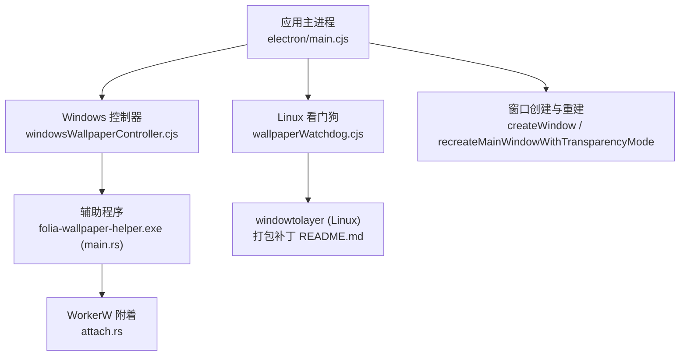
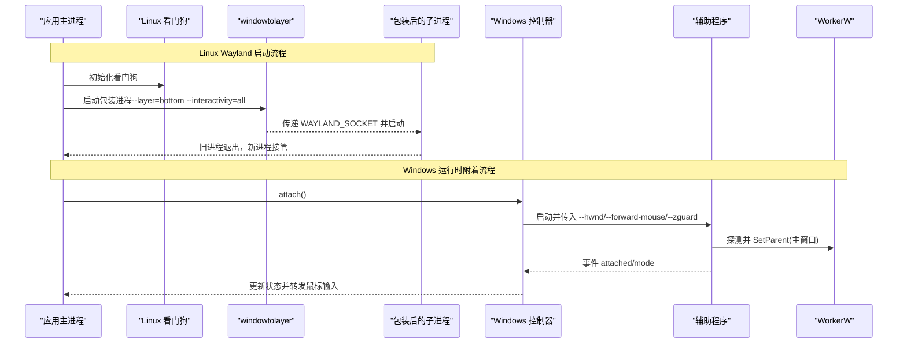
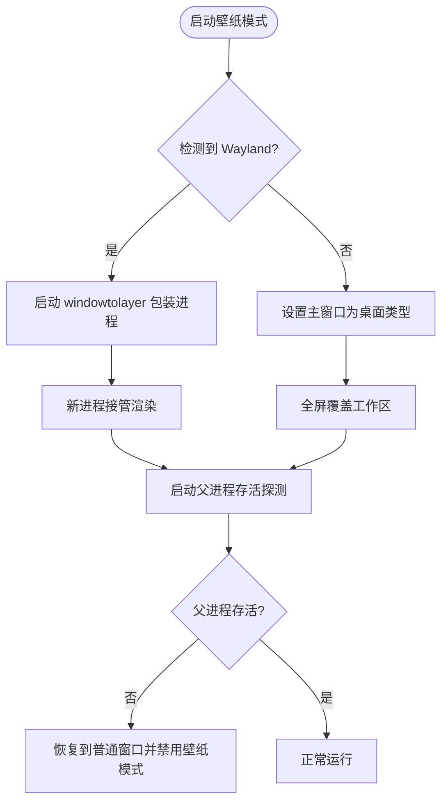
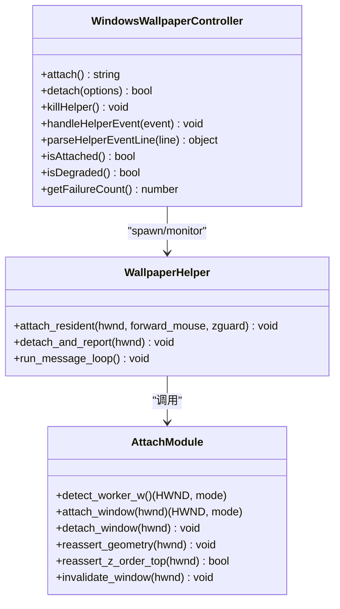
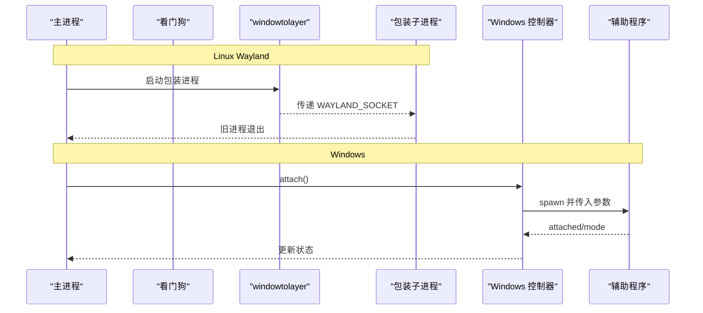
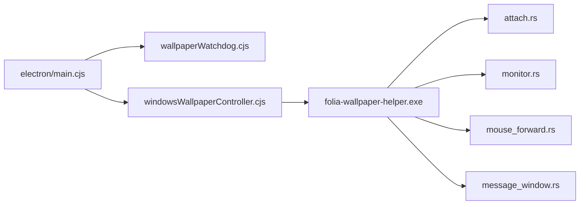

# 壁纸模式窗口

<cite>
**本文引用的文件**   
- [electron/main.cjs](file://electron/main.cjs)
- [electron/wallpaperWatchdog.cjs](file://electron/wallpaperWatchdog.cjs)
- [electron/windowsWallpaperController.cjs](file://electron/windowsWallpaperController.cjs)
- [packaging/windows/wallpaper-helper/src/main.rs](file://packaging/windows/wallpaper-helper/src/main.rs)
- [packaging/windows/wallpaper-helper/src/attach.rs](file://packaging/windows/wallpaper-helper/src/attach.rs)
- [packaging/linux/patches/README.md](file://packaging/linux/patches/README.md)
</cite>

## 目录
1. [简介](#简介)
2. [项目结构](#项目结构)
3. [核心组件](#核心组件)
4. [架构总览](#架构总览)
5. [详细组件分析](#详细组件分析)
6. [依赖关系分析](#依赖关系分析)
7. [性能考量](#性能考量)
8. [故障排除指南](#故障排除指南)
9. [结论](#结论)
10. [附录](#附录)

## 简介
本技术文档聚焦 Folia Player 的“壁纸模式”窗口实现，覆盖 Linux（Wayland/X11）与 Windows 平台下的差异化处理机制。重点包括：
- Wayland 下通过 windowtolayer 将进程包装为底层图层；X11 下将主窗口设为桌面类型窗口。
- Windows 下通过 folia-wallpaper-helper.exe 将 Electron 主窗口父化到 WorkerW 层级，实现桌面集成、鼠标事件穿透与层级管理。
- 启动流程中的进程包装、子进程管理与崩溃恢复机制。
- 壁纸模式下窗口的透明度、点击穿透、置顶状态等属性配置策略。
- 监控与健康检查机制，保障壁纸窗口的稳定性与可靠性。
- 故障排除与调试建议。

## 项目结构
壁纸模式相关代码主要分布在以下位置：
- electron/main.cjs：入口与平台分支、设置键、窗口创建与重建、托盘菜单、Windows 鼠标注入、显示变更处理等。
- electron/wallpaperWatchdog.cjs：Linux 壁纸模式的看门狗与恢复逻辑（进程存活探测、崩溃循环保护）。
- electron/windowsWallpaperController.cjs：Windows 壁纸模式控制器，负责 helper 子进程生命周期、心跳检测、重连与降级。
- packaging/windows/wallpaper-helper/src/*：Rust 实现的辅助程序，负责 WorkerW 发现与父子关系切换、几何与层级维护、鼠标转发、消息循环等。
- packaging/linux/patches/README.md：对 windowtolayer 的补丁说明，确保仅主窗口进入壁纸图层并增强健壮性。

图表来源
- [electron/main.cjs:145-240](file://electron/main.cjs#L145-L240)
- [electron/wallpaperWatchdog.cjs:27-176](file://electron/wallpaperWatchdog.cjs#L27-L176)
- [electron/windowsWallpaperController.cjs:41-456](file://electron/windowsWallpaperController.cjs#L41-L456)
- [packaging/windows/wallpaper-helper/src/main.rs:24-175](file://packaging/windows/wallpaper-helper/src/main.rs#L24-L175)
- [packaging/windows/wallpaper-helper/src/attach.rs:147-190](file://packaging/windows/wallpaper-helper/src/attach.rs#L147-L190)
- [packaging/linux/patches/README.md:1-53](file://packaging/linux/patches/README.md#L1-L53)

章节来源
- [electron/main.cjs:145-240](file://electron/main.cjs#L145-L240)
- [electron/wallpaperWatchdog.cjs:27-176](file://electron/wallpaperWatchdog.cjs#L27-L176)
- [electron/windowsWallpaperController.cjs:41-456](file://electron/windowsWallpaperController.cjs#L41-L456)
- [packaging/windows/wallpaper-helper/src/main.rs:24-175](file://packaging/windows/wallpaper-helper/src/main.rs#L24-L175)
- [packaging/windows/wallpaper-helper/src/attach.rs:147-190](file://packaging/windows/wallpaper-helper/src/attach.rs#L147-L190)
- [packaging/linux/patches/README.md:1-53](file://packaging/linux/patches/README.md#L1-L53)

## 核心组件
- 入口与平台分支（electron/main.cjs）
  - 定义壁纸模式开关与 Windows 专用开关（转发鼠标、Z 序守卫）。
  - 提供 isX11WallpaperMode、isWallpaperWrapped、resolveWindowToLayerPath、launchWrappedSelf 等方法。
  - 创建并初始化 wallpaperWatchdog 与 windowsWallpaper 控制器。
  - 窗口创建时根据平台与模式选择 geometry、是否延迟显示、是否透明等。
  - Windows 路径下实现鼠标输入注入、显示热插拔几何同步。
- Linux 看门狗（electron/wallpaperWatchdog.cjs）
  - 判断是否处于壁纸模式或已包装状态。
  - 提供 recoverToNormalWindow、handleWindowBuildFailure、handleRendererGone、startParentLivenessProbe。
  - 崩溃循环保护：记录连续包装启动次数，超过阈值后禁用壁纸模式。
- Windows 控制器（electron/windowsWallpaperController.cjs）
  - 解析 JSONL 事件、心跳监测、失败计数与降级。
  - attach/detach 生命周期管理，健康重置与重连调度。
  - 读取 store 中的 forwardMouse/zguard 选项，控制 helper 行为。
- Windows 辅助程序（packaging/windows/wallpaper-helper/src/*）
  - main.rs：命令解析、attach_resident、detach_and_report、消息循环。
  - attach.rs：WorkerW 探测（经典/raised）、SetParent/SetParent(NULL)、几何与 Z 序维护、刷新桌面壁纸。
- Linux 补丁（packaging/linux/patches/README.md）
  - 仅主窗口进入壁纸图层，其他窗口正常透传。
  - 增强 windowtolayer 对不支持请求的健壮性。

章节来源
- [electron/main.cjs:145-240](file://electron/main.cjs#L145-L240)
- [electron/wallpaperWatchdog.cjs:27-176](file://electron/wallpaperWatchdog.cjs#L27-L176)
- [electron/windowsWallpaperController.cjs:41-456](file://electron/windowsWallpaperController.cjs#L41-L456)
- [packaging/windows/wallpaper-helper/src/main.rs:24-175](file://packaging/windows/wallpaper-helper/src/main.rs#L24-L175)
- [packaging/windows/wallpaper-helper/src/attach.rs:147-190](file://packaging/windows/wallpaper-helper/src/attach.rs#L147-L190)
- [packaging/linux/patches/README.md:1-53](file://packaging/linux/patches/README.md#L1-L53)

## 架构总览
壁纸模式在不同平台采用不同策略：
- Linux Wayland：通过 windowtolayer 将当前进程包装为底层图层，新进程继承 WAYLAND_SOCKET 并在底层渲染。
- Linux X11：将主窗口设置为桌面类型窗口，覆盖工作区，无法启用点击穿透以避免 KDE 桌面窗口被覆盖。
- Windows：通过 folia-wallpaper-helper.exe 将现有 Electron 主窗口父化到 WorkerW 层级，实现桌面集成；同时支持鼠标事件转发与 Z 序守卫。

图表来源
- [electron/main.cjs:196-226](file://electron/main.cjs#L196-L226)
- [electron/wallpaperWatchdog.cjs:27-176](file://electron/wallpaperWatchdog.cjs#L27-L176)
- [electron/windowsWallpaperController.cjs:259-353](file://electron/windowsWallpaperController.cjs#L259-L353)
- [packaging/windows/wallpaper-helper/src/main.rs:111-175](file://packaging/windows/wallpaper-helper/src/main.rs#L111-L175)
- [packaging/windows/wallpaper-helper/src/attach.rs:147-190](file://packaging/windows/wallpaper-helper/src/attach.rs#L147-L190)

## 详细组件分析

### Linux 壁纸模式（Wayland/X11）
- 启动与包装
  - 通过 resolveWindowToLayerPath 定位二进制，缺失则禁用壁纸模式。
  - launchWrappedSelf 以 --layer=bottom --interactivity=all 启动 windowtolayer，并传入 FOLIA_WRAPPED_BY_WINDOWTOLAYER=1 与 FOLIA_RELAUNCH=1。
  - 包装成功后旧进程退出，新进程在底层图层渲染。
- X11 特殊处理
  - isX11WallpaperMode 在非 Wayland 环境下将主窗口设为桌面类型窗口，全屏覆盖工作区。
  - 由于桌面窗口共享层且无合成背景，点击穿透不可用，避免 KDE 桌面窗口被覆盖。
- 看门狗与恢复
  - startParentLivenessProbe 周期性探测父进程（wtl）存活，若父进程异常退出则恢复到普通窗口。
  - handleWindowBuildFailure/handleRendererGone 在构建失败或渲染器崩溃时触发恢复。
  - 崩溃循环保护：记录连续包装启动次数，超过阈值后禁用壁纸模式，防止重启循环。
- 窗口属性
  - 创建窗口时根据 isX11WallpaperMode 选择 desktop 类型与全屏 geometry。
  - 置顶状态在壁纸模式下被拒绝，避免与桌面层级冲突。
  - 点击穿透在 X11 壁纸模式下被拒绝。

图表来源
- [electron/main.cjs:183-226](file://electron/main.cjs#L183-L226)
- [electron/wallpaperWatchdog.cjs:27-176](file://electron/wallpaperWatchdog.cjs#L27-L176)
- [packaging/linux/patches/README.md:17-46](file://packaging/linux/patches/README.md#L17-L46)

章节来源
- [electron/main.cjs:183-226](file://electron/main.cjs#L183-L226)
- [electron/wallpaperWatchdog.cjs:27-176](file://electron/wallpaperWatchdog.cjs#L27-L176)
- [packaging/linux/patches/README.md:17-46](file://packaging/linux/patches/README.md#L17-L46)

### Windows 壁纸模式（WorkerW 父窗口机制）
- 控制器与辅助程序
  - createWindowsWallpaperController 负责 spawn helper、解析 JSONL 事件、心跳检测、失败计数与降级。
  - 辅助程序 main.rs 解析命令并执行 attach_resident，安装 monitor 与可选 mouse_forward，进入消息循环。
- WorkerW 附着与层级管理
  - attach.rs 探测经典/raised 两种 WorkerW 架构，必要时向 Progman 发送私有消息以生成 WorkerW。
  - normalize_styles 调整样式以适应子窗口语义，SetParent(hwnd, worker_w) 完成附着。
  - reassert_geometry/reassert_z_order_top 保证几何与 Z 序正确，invalidate_window 清理残留帧。
- 鼠标事件穿透与转发
  - 辅助程序通过 Raw Input 捕获桌面鼠标事件，JSONL 上报给主进程。
  - 主进程将坐标转换为窗口相对坐标并通过 sendInputEvent 注入 Chromium 输入管线，避免 TrackMouseEvent 导致的 hover 撕裂。
- 健康检查与崩溃恢复
  - 心跳超时后 killHelper 并尝试重新 attach；多次失败触发降级，禁用壁纸模式。
  - 健康计时器在成功附着并保持一段时间后重置失败计数。
- 窗口属性与重建
  - 透明支持取决于 attach mode（raised 支持透明，classic 强制不透明）。
  - 重建窗口前 detach 旧窗口，避免最后帧停留在桌面层。

图表来源
- [electron/windowsWallpaperController.cjs:41-456](file://electron/windowsWallpaperController.cjs#L41-L456)
- [packaging/windows/wallpaper-helper/src/main.rs:24-175](file://packaging/windows/wallpaper-helper/src/main.rs#L24-L175)
- [packaging/windows/wallpaper-helper/src/attach.rs:147-190](file://packaging/windows/wallpaper-helper/src/attach.rs#L147-L190)

章节来源
- [electron/windowsWallpaperController.cjs:41-456](file://electron/windowsWallpaperController.cjs#L41-L456)
- [packaging/windows/wallpaper-helper/src/main.rs:24-175](file://packaging/windows/wallpaper-helper/src/main.rs#L24-L175)
- [packaging/windows/wallpaper-helper/src/attach.rs:147-190](file://packaging/windows/wallpaper-helper/src/attach.rs#L147-L190)

### 启动流程与进程模型
- Linux Wayland
  - 主进程启动 windowtolayer，传入参数与包装后的 Folia 子进程。
  - 子进程继承 WAYLAND_SOCKET，在底层图层渲染；旧进程退出。
  - 看门狗持续探测父进程存活，异常时恢复到普通窗口。
- Linux X11
  - 直接设置主窗口类型为桌面窗口，全屏覆盖工作区。
  - 点击穿透不可用，避免 KDE 桌面窗口被覆盖。
- Windows
  - 控制器 spawn 辅助程序，传入 hwnd 与选项。
  - 辅助程序附着到 WorkerW，报告 attached/mode，主进程更新状态。
  - 心跳检测与失败计数保障稳定性，多次失败后降级。

图表来源
- [electron/main.cjs:196-226](file://electron/main.cjs#L196-L226)
- [electron/wallpaperWatchdog.cjs:27-176](file://electron/wallpaperWatchdog.cjs#L27-L176)
- [electron/windowsWallpaperController.cjs:259-353](file://electron/windowsWallpaperController.cjs#L259-L353)
- [packaging/windows/wallpaper-helper/src/main.rs:111-175](file://packaging/windows/wallpaper-helper/src/main.rs#L111-L175)

章节来源
- [electron/main.cjs:196-226](file://electron/main.cjs#L196-L226)
- [electron/wallpaperWatchdog.cjs:27-176](file://electron/wallpaperWatchdog.cjs#L27-L176)
- [electron/windowsWallpaperController.cjs:259-353](file://electron/windowsWallpaperController.cjs#L259-L353)
- [packaging/windows/wallpaper-helper/src/main.rs:111-175](file://packaging/windows/wallpaper-helper/src/main.rs#L111-L175)

### 窗口属性配置
- 透明度
  - Windows raised 模式支持透明；classic 模式强制不透明，避免表面丢失导致黑屏。
  - 重建窗口时根据 attach mode 与用户偏好同步透明设置。
- 点击穿透
  - X11 壁纸模式拒绝点击穿透，避免 KDE 桌面窗口被覆盖。
  - Windows 壁纸模式拒绝点击穿透，因为 SetParent 后点击不会到达窗口。
- 置顶状态
  - 壁纸模式下拒绝置顶，避免与桌面层级冲突。
- 全屏几何
  - X11 与 Windows 壁纸模式均使用全屏 primary display 几何，必要时延迟显示以确保尺寸正确。

章节来源
- [electron/main.cjs:263-280](file://electron/main.cjs#L263-L280)
- [electron/main.cjs:1376-1389](file://electron/main.cjs#L1376-L1389)
- [electron/main.cjs:3832-3847](file://electron/main.cjs#L3832-L3847)

### 监控与健康检查
- Linux
  - 父进程存活探测：周期性探测 wtl 是否存在，异常时恢复到普通窗口。
  - 渲染器崩溃与窗口构建失败触发恢复。
  - 崩溃循环保护：记录连续包装启动次数，超过阈值后禁用壁纸模式。
- Windows
  - 心跳检测：每 5s 接收一次事件，超时 15s 视为异常并尝试重连。
  - 失败计数与降级：多次失败后禁用壁纸模式，等待健康计时器重置。
  - 健康计时器：成功附着并保持一定时间后重置失败计数。

章节来源
- [electron/wallpaperWatchdog.cjs:27-176](file://electron/wallpaperWatchdog.cjs#L27-L176)
- [electron/windowsWallpaperController.cjs:106-192](file://electron/windowsWallpaperController.cjs#L106-L192)

## 依赖关系分析
- electron/main.cjs 依赖：
  - wallpaperWatchdog.cjs：Linux 壁纸模式看门狗。
  - windowsWallpaperController.cjs：Windows 壁纸模式控制器。
  - 系统 API：child_process.spawn、electron-store、Electron 主进程 API。
- windowsWallpaperController.cjs 依赖：
  - 辅助程序：folia-wallpaper-helper.exe（Rust 实现）。
  - 系统 API：child_process.spawn、定时器、store。
- 辅助程序依赖：
  - Windows API：FindWindow/ExA、SetParent、SendMessageTimeoutW、MonitorFromWindow 等。
  - 模块：attach.rs、monitor.rs、mouse_forward.rs、message_window.rs。

图表来源
- [electron/main.cjs:145-240](file://electron/main.cjs#L145-L240)
- [electron/windowsWallpaperController.cjs:41-456](file://electron/windowsWallpaperController.cjs#L41-L456)
- [packaging/windows/wallpaper-helper/src/main.rs:24-175](file://packaging/windows/wallpaper-helper/src/main.rs#L24-L175)

章节来源
- [electron/main.cjs:145-240](file://electron/main.cjs#L145-L240)
- [electron/windowsWallpaperController.cjs:41-456](file://electron/windowsWallpaperController.cjs#L41-L456)
- [packaging/windows/wallpaper-helper/src/main.rs:24-175](file://packaging/windows/wallpaper-helper/src/main.rs#L24-L175)

## 性能考量
- Linux Wayland 包装过程涉及进程切换与 socket 传递，需确保 windowtolayer 二进制可用且权限正确。
- X11 桌面窗口无合成背景，避免点击穿透以减少 KDE 桌面窗口覆盖风险。
- Windows 鼠标转发在高频率移动场景下通过 sendInputEvent 注入，避免 TrackMouseEvent 导致的 hover 撕裂。
- 心跳检测与失败计数有助于快速恢复异常，但需平衡重试频率与资源占用。
- 透明模式在 classic 模式下不可用，避免表面丢失导致黑屏。

[本节提供一般性指导，无需特定文件分析]

## 故障排除指南
- Linux Wayland
  - 检查 windowtolayer 二进制是否存在与可执行权限。
  - 查看包装进程是否成功启动，日志中是否有 ENOENT/EACCES 错误。
  - 若父进程异常退出，看门狗应自动恢复到普通窗口。
- Linux X11
  - 确认主窗口已设置为桌面类型并全屏覆盖工作区。
  - 点击穿透不可用，避免 KDE 桌面窗口被覆盖。
- Windows
  - 检查辅助程序是否成功启动并报告 attached 事件。
  - 若心跳超时，控制器会尝试重连；多次失败后禁用壁纸模式。
  - 透明模式仅在 raised 模式下支持，classic 模式强制不透明。
  - 显示热插拔或分辨率变化时，几何需重新断言。

章节来源
- [electron/main.cjs:196-226](file://electron/main.cjs#L196-L226)
- [electron/wallpaperWatchdog.cjs:27-176](file://electron/wallpaperWatchdog.cjs#L27-L176)
- [electron/windowsWallpaperController.cjs:106-192](file://electron/windowsWallpaperController.cjs#L106-L192)
- [packaging/windows/wallpaper-helper/src/main.rs:111-175](file://packaging/windows/wallpaper-helper/src/main.rs#L111-L175)

## 结论
Folia Player 的壁纸模式在不同平台采用了针对性的实现策略：
- Linux Wayland 通过 windowtolayer 将进程包装为底层图层，X11 通过桌面类型窗口实现全屏覆盖。
- Windows 通过辅助程序将主窗口父化到 WorkerW 层级，实现桌面集成、鼠标事件穿透与层级管理。
- 看门狗与控制器提供了健壮的监控与健康检查机制，确保壁纸窗口的稳定性与可靠性。
- 窗口属性配置考虑了平台差异，避免与桌面层级冲突。
- 故障排除指南帮助用户快速定位与解决问题。

[本节总结内容，无需特定文件分析]

## 附录
- 相关设置键
  - wallpaper_mode：启用/禁用壁纸模式。
  - wallpaper_forward_mouse：Windows 下是否转发鼠标事件。
  - wallpaper_zguard：Windows 下是否启用 Z 序守卫。
  - wallpaper_windows_attach_mode：Windows 下附着模式（classic/raised）。
- 相关文件
  - electron/main.cjs：入口与平台分支。
  - electron/wallpaperWatchdog.cjs：Linux 看门狗。
  - electron/windowsWallpaperController.cjs：Windows 控制器。
  - packaging/windows/wallpaper-helper/src/*：辅助程序实现。
  - packaging/linux/patches/README.md：Linux 补丁说明。

[本节为附录信息，无需特定文件分析]