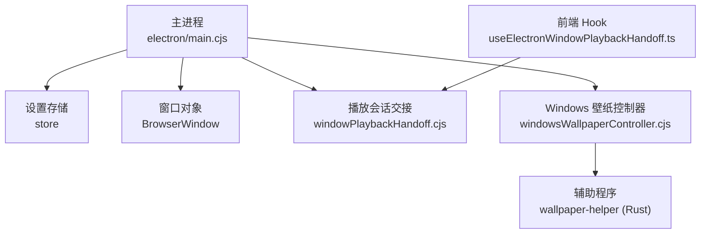
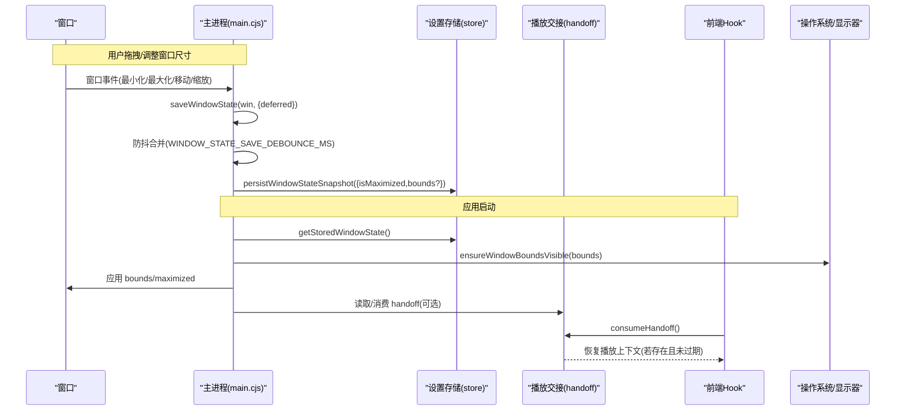
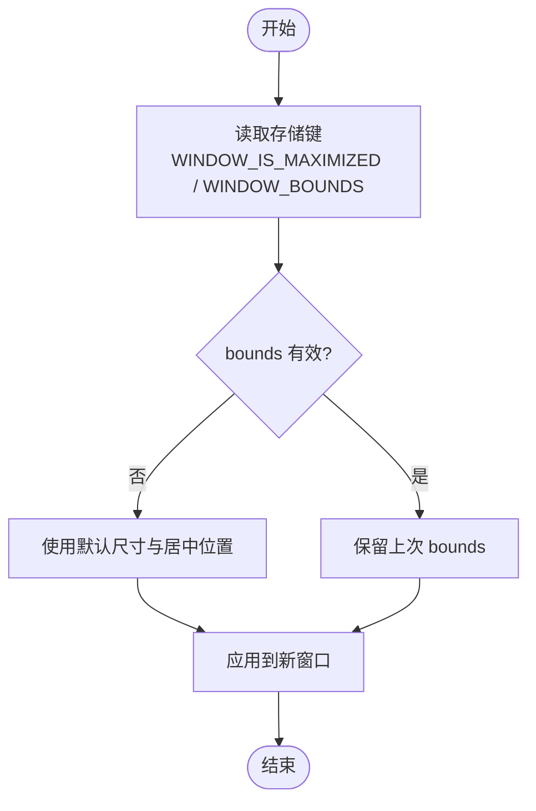
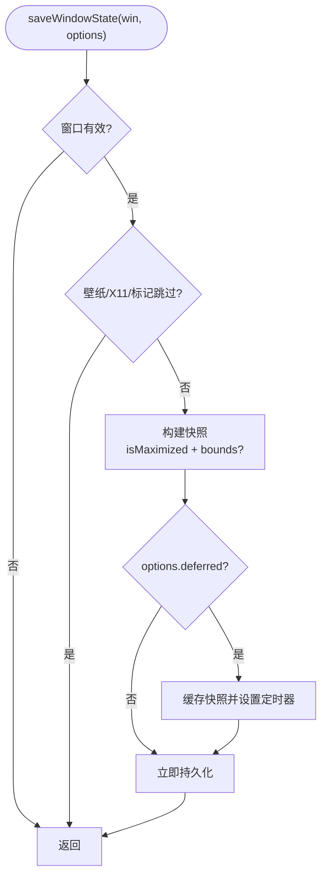
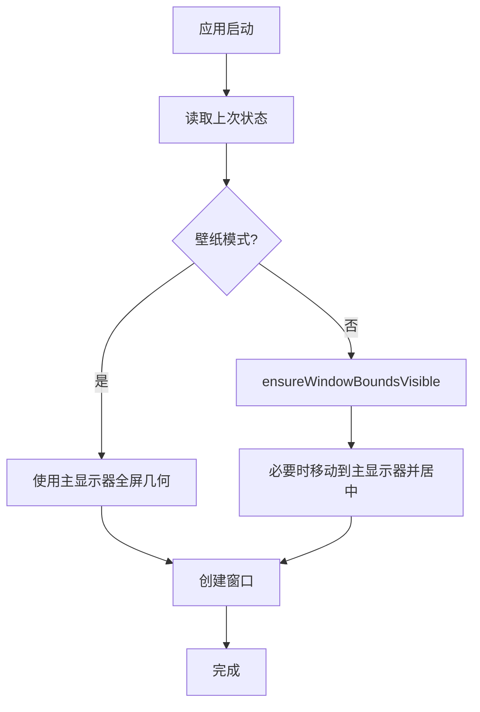
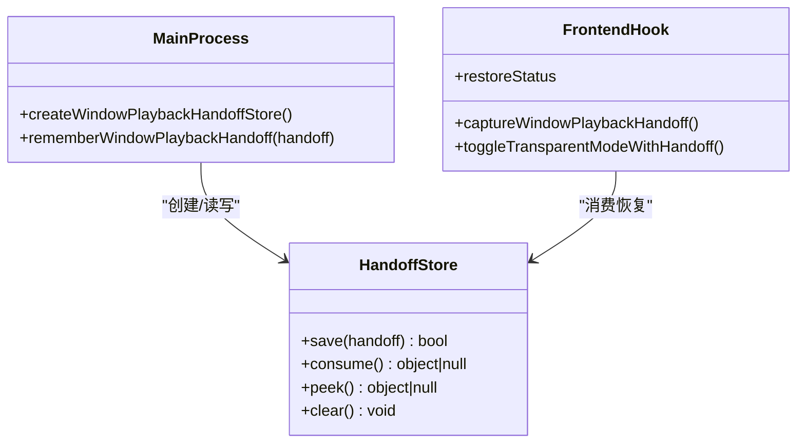
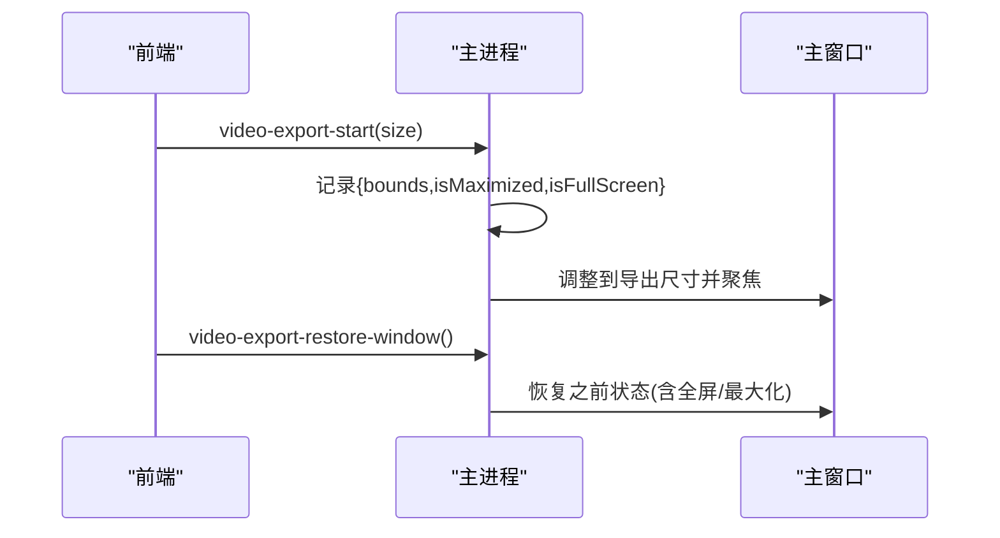
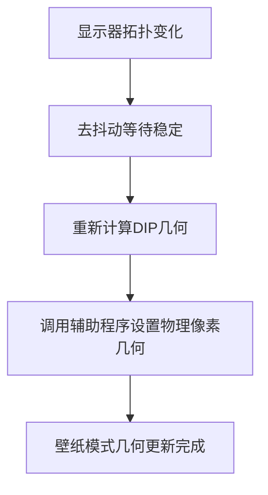
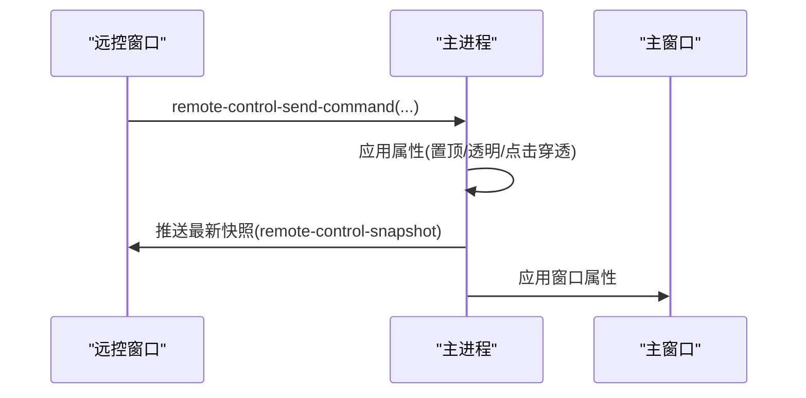

# 窗口状态持久化

<cite>
**本文引用的文件**
- [electron/main.cjs](file://electron/main.cjs)
- [electron/windowPlaybackHandoff.cjs](file://electron/windowPlaybackHandoff.cjs)
- [src/hooks/useElectronWindowPlaybackHandoff.ts](file://src/hooks/useElectronWindowPlaybackHandoff.ts)
- [electron/windowsWallpaperController.cjs](file://electron/windowsWallpaperController.cjs)
- [packaging/windows/wallpaper-helper/src/attach.rs](file://packaging/windows/wallpaper-helper/src/attach.rs)
- [test/unit/electron/windowPlaybackHandoff.test.ts](file://test/unit/electron/windowPlaybackHandoff.test.ts)
</cite>

## 目录
1. [简介](#简介)
2. [项目结构](#项目结构)
3. [核心组件](#核心组件)
4. [架构总览](#架构总览)
5. [详细组件分析](#详细组件分析)
6. [依赖关系分析](#依赖关系分析)
7. [性能考虑](#性能考虑)
8. [故障排查指南](#故障排查指南)
9. [结论](#结论)
10. [附录](#附录)

## 简介
本技术文档聚焦 Folia Player 的“窗口状态持久化系统”，覆盖以下关键主题：
- 数据结构定义：窗口位置、大小、最大化状态等属性的存储格式。
- 保存策略：防抖机制、自动保存时机与手动保存触发条件。
- 恢复机制：应用启动时的状态加载、多显示器环境下的位置适配与异常状态处理。
- 窗口间同步：主窗口与远程窗口、视频导出窗口之间的状态一致性保证。
- 版本兼容与迁移：对历史键名与默认值的兼容处理。
- 性能优化与故障恢复：减少磁盘写入、避免错误模式导致的状态污染，以及崩溃/重建后的自愈流程。

## 项目结构
围绕窗口状态持久化的代码主要分布在 Electron 主进程与前端桥接层：
- 主进程负责窗口创建、状态读取/写入、显示适配、壁纸模式与透明模式切换、视频导出窗口状态暂存与恢复。
- 播放会话交接（handoff）模块提供跨进程重启的短时持久化能力，用于在壁纸模式或透明模式重建时保持播放上下文。
- 前端通过 Hook 发起握手并消费恢复结果，确保 UI 侧感知到恢复状态。



**图示来源**
- [electron/main.cjs:736-761](file://electron/main.cjs#L736-L761)
- [electron/windowPlaybackHandoff.cjs:11-97](file://electron/windowPlaybackHandoff.cjs#L11-L97)
- [electron/windowsWallpaperController.cjs:59-90](file://electron/windowsWallpaperController.cjs#L59-L90)
- [packaging/windows/wallpaper-helper/src/attach.rs:245-283](file://packaging/windows/wallpaper-helper/src/attach.rs#L245-L283)

**章节来源**
- [electron/main.cjs:736-761](file://electron/main.cjs#L736-L761)
- [electron/windowPlaybackHandoff.cjs:11-97](file://electron/windowPlaybackHandoff.cjs#L11-L97)
- [electron/windowsWallpaperController.cjs:59-90](file://electron/windowsWallpaperController.cjs#L59-L90)
- [packaging/windows/wallpaper-helper/src/attach.rs:245-283](file://packaging/windows/wallpaper-helper/src/attach.rs#L245-L283)

## 核心组件
- 窗口状态快照与持久化：采集窗口是否最大化与边界（bounds），按防抖合并后写入设置存储。
- 窗口状态读取与显示适配：启动时从存储读取上次状态，校验可见性并在多显示器环境下调整至主显示器工作区居中。
- 播放会话交接（handoff）：以 TTL 为生命周期的短临会话数据，支持内存与可选持久化存储，用于透明/壁纸模式重建或进程重启时恢复播放上下文。
- Windows 壁纸模式几何重放：在显示拓扑变化时重新计算并填充显示器物理像素区域。
- 视频导出窗口状态暂存与恢复：临时保存主窗口导出前的状态，完成后恢复。

**章节来源**
- [electron/main.cjs:1029-1092](file://electron/main.cjs#L1029-L1092)
- [electron/main.cjs:1101-1129](file://electron/main.cjs#L1101-L1129)
- [electron/windowPlaybackHandoff.cjs:11-97](file://electron/windowPlaybackHandoff.cjs#L11-L97)
- [electron/windowsWallpaperController.cjs:373-408](file://electron/windowsWallpaperController.cjs#L373-L408)
- [packaging/windows/wallpaper-helper/src/attach.rs:245-283](file://packaging/windows/wallpaper-helper/src/attach.rs#L245-L283)
- [electron/main.cjs:5227-5271](file://electron/main.cjs#L5227-L5271)

## 架构总览
下图展示了窗口状态从采集、防抖保存到持久化，再到启动恢复与显示适配的完整链路，以及壁纸模式下几何重放与播放会话交接的协作。



**图示来源**
- [electron/main.cjs:1101-1129](file://electron/main.cjs#L1101-L1129)
- [electron/main.cjs:1029-1076](file://electron/main.cjs#L1029-L1076)
- [electron/windowPlaybackHandoff.cjs:11-97](file://electron/windowPlaybackHandoff.cjs#L11-L97)
- [src/hooks/useElectronWindowPlaybackHandoff.ts:430-449](file://src/hooks/useElectronWindowPlaybackHandoff.ts#L430-L449)

## 详细组件分析

### 窗口状态数据结构与存储格式
- 存储键名
  - WINDOW_IS_MAXIMIZED：布尔值，表示上次是否为最大化。
  - WINDOW_BOUNDS：对象，包含 width、height、x、y；仅在非最大化时写入。
- 默认值
  - 当读取不到有效 bounds 时回退到内置默认尺寸与居中位置。
- 读取逻辑
  - 启动时读取上述两个键，构造初始窗口配置。
- 写入逻辑
  - 仅当窗口非最大化时才写入 bounds；最大化时只写 isMaximized。



**图示来源**
- [electron/main.cjs:1029-1076](file://electron/main.cjs#L1029-L1076)
- [electron/main.cjs:1078-1092](file://electron/main.cjs#L1078-L1092)

**章节来源**
- [electron/main.cjs:1029-1092](file://electron/main.cjs#L1029-L1092)

### 保存策略与防抖机制
- 触发时机
  - 窗口事件（如 resize、move、minimize/restore）时调用 saveWindowState。
  - 可传入 deferred 选项启用防抖保存。
- 防抖实现
  - pendingWindowStateSave 缓存最新快照，windowStateSaveTimer 延迟执行持久化，时间常量为 WINDOW_STATE_SAVE_DEBOUNCE_MS。
  - 每次新的保存请求会清除旧定时器并重置计时，避免频繁写入。
- 特殊场景跳过
  - 壁纸模式窗口（X11 或 Windows 标记）不保存几何，以免干扰退出壁纸模式后的正常窗口恢复。
  - 已销毁窗口直接忽略。



**图示来源**
- [electron/main.cjs:1101-1129](file://electron/main.cjs#L1101-L1129)

**章节来源**
- [electron/main.cjs:1101-1129](file://electron/main.cjs#L1101-L1129)

### 启动恢复与多显示器适配
- 启动恢复
  - 读取 storedBounds 与 storedMaximized，结合壁纸模式决定是否使用屏幕全屏几何。
  - 经典桌面壁纸窗口必须不透明，重建时会检测透明度需求并修正。
- 多显示器适配
  - ensureWindowBoundsVisible 检查上次 bounds 是否与任意显示器工作区有重叠；若无，则将其移动到主显示器工作区并居中。
  - 壁纸模式在显示拓扑变化时通过辅助程序重新填充显示器物理像素区域。



**图示来源**
- [electron/main.cjs:3847-3867](file://electron/main.cjs#L3847-L3867)
- [electron/main.cjs:1044-1076](file://electron/main.cjs#L1044-L1076)
- [packaging/windows/wallpaper-helper/src/attach.rs:245-283](file://packaging/windows/wallpaper-helper/src/attach.rs#L245-L283)

**章节来源**
- [electron/main.cjs:3847-3867](file://electron/main.cjs#L3847-L3867)
- [electron/main.cjs:1044-1076](file://electron/main.cjs#L1044-L1076)
- [packaging/windows/wallpaper-helper/src/attach.rs:245-283](file://packaging/windows/wallpaper-helper/src/attach.rs#L245-L283)

### 播放会话交接（跨进程/重建恢复）
- 设计目标
  - 在透明/壁纸模式重建或进程重启期间，保持播放进度、歌曲与播放状态的一致性。
- 生命周期
  - 以 TTL（默认毫秒级）控制有效期，支持内存态与可选持久化（基于 store）。
  - save 写入当前会话与过期时间；consume 消费并清理；peek 仅查看不清理。
- 前端集成
  - 前端 Hook 在 Electron 环境中尝试消费 handoff，成功则恢复播放上下文，失败则降级为无恢复。



**图示来源**
- [electron/windowPlaybackHandoff.cjs:11-97](file://electron/windowPlaybackHandoff.cjs#L11-L97)
- [src/hooks/useElectronWindowPlaybackHandoff.ts:430-449](file://src/hooks/useElectronWindowPlaybackHandoff.ts#L430-L449)

**章节来源**
- [electron/windowPlaybackHandoff.cjs:11-97](file://electron/windowPlaybackHandoff.cjs#L11-L97)
- [src/hooks/useElectronWindowPlaybackHandoff.ts:430-449](file://src/hooks/useElectronWindowPlaybackHandoff.ts#L430-L449)
- [test/unit/electron/windowPlaybackHandoff.test.ts:73-106](file://test/unit/electron/windowPlaybackHandoff.test.ts#L73-L106)

### 视频导出窗口状态一致性
- 导出前
  - 记录主窗口当前的 bounds、是否最大化、是否全屏。
  - 将主窗口调整为适合导出尺寸的矩形并聚焦。
- 导出后
  - 通过 IPC 恢复主窗口到导出前的状态（包括全屏/最大化）。
- 安全校验
  - 仅信任的主窗口渲染器可触发恢复，防止不受信内容篡改。



**图示来源**
- [electron/main.cjs:5227-5271](file://electron/main.cjs#L5227-L5271)

**章节来源**
- [electron/main.cjs:5227-5271](file://electron/main.cjs#L5227-L5271)

### 壁纸模式与几何重放
- 显示拓扑变化
  - 监听显示器变更事件，去抖动后重新计算并填充显示器物理像素区域。
- 辅助程序职责
  - 根据窗口所在显示器获取工作区信息，设置窗口位置与尺寸，确保壁纸模式正确覆盖。
- 健康监控
  - 壁纸控制器维护心跳与健康重置，失败时进行降级与恢复。



**图示来源**
- [electron/main.cjs:4158-4175](file://electron/main.cjs#L4158-L4175)
- [packaging/windows/wallpaper-helper/src/attach.rs:245-283](file://packaging/windows/wallpaper-helper/src/attach.rs#L245-L283)
- [electron/windowsWallpaperController.cjs:373-408](file://electron/windowsWallpaperController.cjs#L373-L408)

**章节来源**
- [electron/main.cjs:4158-4175](file://electron/main.cjs#L4158-L4175)
- [packaging/windows/wallpaper-helper/src/attach.rs:245-283](file://packaging/windows/wallpaper-helper/src/attach.rs#L245-L283)
- [electron/windowsWallpaperController.cjs:373-408](file://electron/windowsWallpaperController.cjs#L373-L408)

### 窗口间状态同步（主窗口与远程窗口）
- 远控窗口属性
  - 始终置顶、任务栏隐藏等属性在主进程集中管理，并通过快照推送给远控窗口。
- 命令通道
  - 远控窗口通过 IPC 发送命令（如设置透明模式、置顶、点击穿透），主进程统一应用并广播状态。
- 一致性保障
  - 所有影响窗口呈现的属性变更都会更新远程快照，确保远控界面与主窗口状态一致。



**图示来源**
- [electron/main.cjs:1343-1389](file://electron/main.cjs#L1343-L1389)
- [electron/main.cjs:5118-5175](file://electron/main.cjs#L5118-L5175)

**章节来源**
- [electron/main.cjs:1343-1389](file://electron/main.cjs#L1343-L1389)
- [electron/main.cjs:5118-5175](file://electron/main.cjs#L5118-L5175)

## 依赖关系分析
- 主进程依赖
  - 设置存储（store）：用于持久化窗口状态与相关开关。
  - BrowserWindow：窗口实例，承载状态采集与恢复。
  - 播放会话交接（handoff）：跨进程/重建的短时持久化。
  - Windows 壁纸控制器与辅助程序：处理壁纸模式几何与健壮性。
- 前端依赖
  - useElectronWindowPlaybackHandoff：消费 handoff 并驱动 UI 恢复。

```mermaid
graph LR
Store["设置存储(store)"] <- --> Main["主进程(main.cjs)"]
Win["BrowserWindow"] <- --> Main
Handoff["windowPlaybackHandoff.cjs"] <- --> Main
FW["前端Hook(useElectronWindowPlaybackHandoff.ts)"] <- --> Handoff
WC["windowsWallpaperController.cjs"] <- --> Main
Helper["wallpaper-helper(Rust)"] <- --> WC
```

**图示来源**
- [electron/main.cjs:736-761](file://electron/main.cjs#L736-L761)
- [electron/windowPlaybackHandoff.cjs:11-97](file://electron/windowPlaybackHandoff.cjs#L11-L97)
- [electron/windowsWallpaperController.cjs:59-90](file://electron/windowsWallpaperController.cjs#L59-L90)
- [src/hooks/useElectronWindowPlaybackHandoff.ts:430-449](file://src/hooks/useElectronWindowPlaybackHandoff.ts#L430-L449)

**章节来源**
- [electron/main.cjs:736-761](file://electron/main.cjs#L736-L761)
- [electron/windowPlaybackHandoff.cjs:11-97](file://electron/windowPlaybackHandoff.cjs#L11-L97)
- [electron/windowsWallpaperController.cjs:59-90](file://electron/windowsWallpaperController.cjs#L59-L90)
- [src/hooks/useElectronWindowPlaybackHandoff.ts:430-449](file://src/hooks/useElectronWindowPlaybackHandoff.ts#L430-L449)

## 性能考虑
- 防抖保存
  - 通过 WINDOW_STATE_SAVE_DEBOUNCE_MS 合并高频窗口事件，显著降低磁盘写入次数。
- 条件写入
  - 最大化时不写入 bounds，减少无效数据；壁纸模式窗口跳过几何保存，避免状态污染。
- 健康监控与降级
  - 壁纸模式失败计数与健康重置，避免反复失败导致的资源浪费。
- 显示拓扑去抖
  - 显示器变更事件聚合后一次性重放几何，减少重复计算与绘制。

[本节为通用指导，无需具体文件引用]

## 故障排查指南
- 窗口位置异常
  - 检查 ensureWindowBoundsVisible 是否将窗口移动到主显示器；确认上次 bounds 是否有效。
- 壁纸模式几何不正确
  - 确认辅助程序是否成功运行；检查 reassert_geometry 调用路径与显示器拓扑事件。
- 播放上下文丢失
  - 检查 handoff 是否被消费或过期；确认 TTL 与持久化存储是否可用。
- 视频导出后主窗口状态未恢复
  - 确认 IPC 调用方是否受信任；检查 videoExportWindowRestoreState 是否存在。

**章节来源**
- [electron/main.cjs:1044-1076](file://electron/main.cjs#L1044-L1076)
- [packaging/windows/wallpaper-helper/src/attach.rs:245-283](file://packaging/windows/wallpaper-helper/src/attach.rs#L245-L283)
- [electron/windowPlaybackHandoff.cjs:11-97](file://electron/windowPlaybackHandoff.cjs#L11-L97)
- [electron/main.cjs:5227-5271](file://electron/main.cjs#L5227-L5271)

## 结论
Folia Player 的窗口状态持久化系统通过简洁的数据结构与稳健的保存/恢复流程，实现了跨平台、多显示器与壁纸模式下的可靠体验。防抖机制与条件写入保障了性能，播放会话交接确保了重建过程中的连续性，而壁纸模式的几何重放与故障恢复进一步提升了鲁棒性。未来可在更多维度扩展状态字段（如透明度、置顶状态）的持久化与同步，同时保持向后兼容与性能优先的原则。

## 附录
- 键名约定
  - WINDOW_IS_MAXIMIZED：布尔值。
  - WINDOW_BOUNDS：对象 {width, height, x, y}。
- 默认行为
  - 无有效 bounds 时使用默认尺寸并居中于主显示器工作区。
- 兼容性
  - 读取时进行类型与范围校验，失败则回退默认值。

[本节为概念性说明，无需具体文件引用]