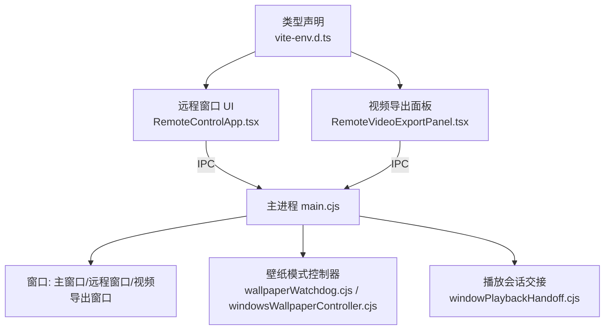
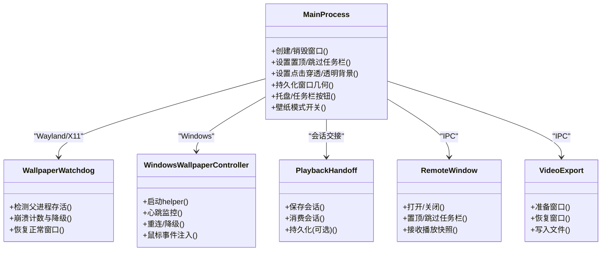
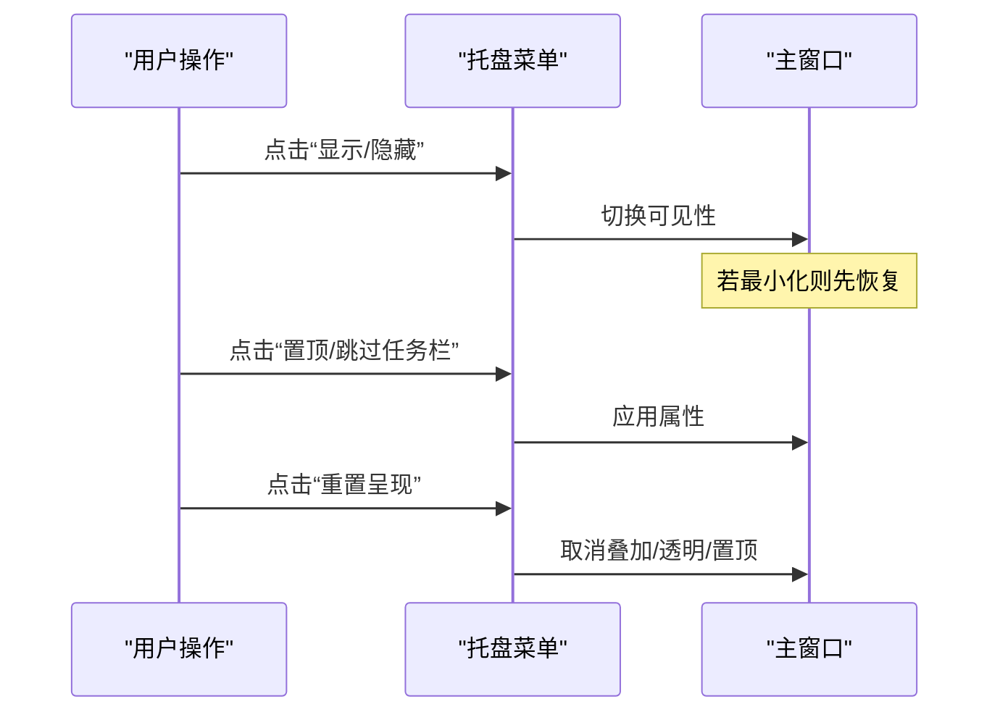
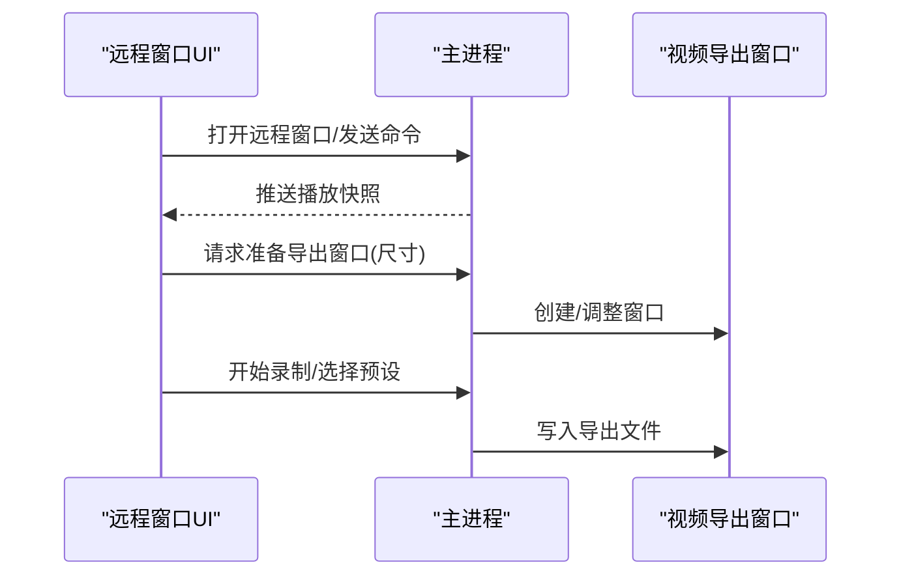
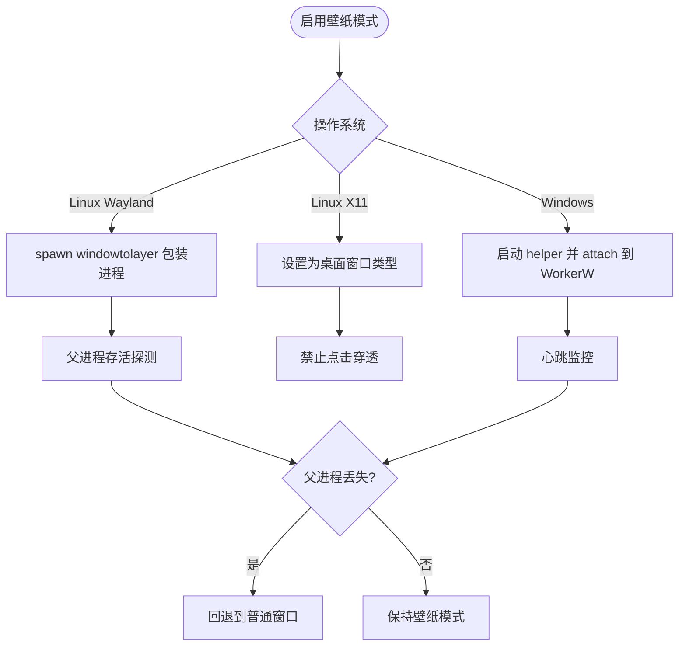
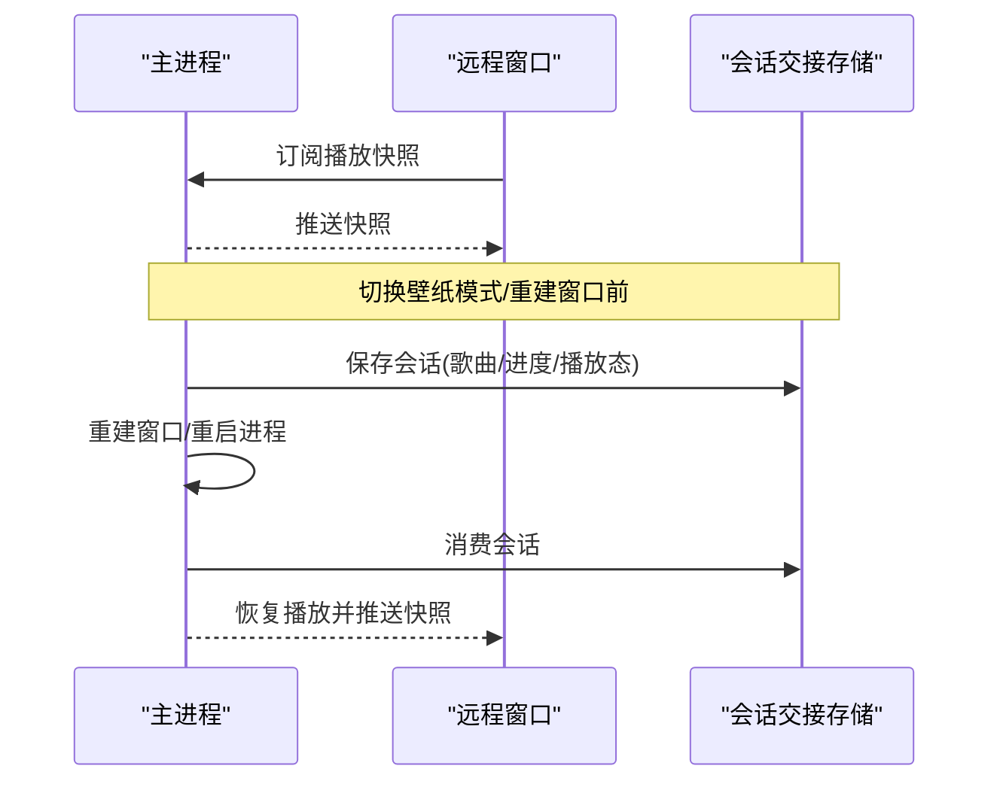
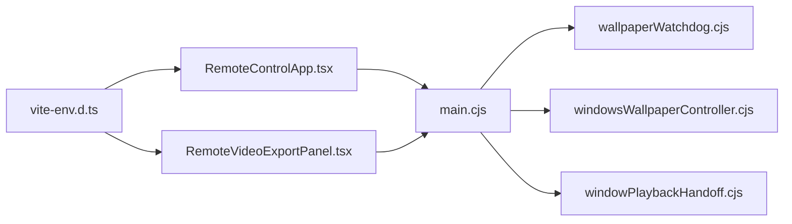

# 窗口管理系统

<cite>
**本文引用的文件**
- [electron/main.cjs](file://electron/main.cjs)
- [electron/windowPlaybackHandoff.cjs](file://electron/windowPlaybackHandoff.cjs)
- [electron/wallpaperWatchdog.cjs](file://electron/wallpaperWatchdog.cjs)
- [electron/windowsWallpaperController.cjs](file://electron/windowsWallpaperController.cjs)
- [src/components/remote/RemoteControlApp.tsx](file://src/components/remote/RemoteControlApp.tsx)
- [src/components/remote/RemoteVideoExportPanel.tsx](file://src/components/remote/RemoteVideoExportPanel.tsx)
- [src/vite-env.d.ts](file://src/vite-env.d.ts)
</cite>

## 目录
1. [简介](#简介)
2. [项目结构](#项目结构)
3. [核心组件](#核心组件)
4. [架构总览](#架构总览)
5. [详细组件分析](#详细组件分析)
6. [依赖关系分析](#依赖关系分析)
7. [性能考虑](#性能考虑)
8. [故障排查指南](#故障排查指南)
9. [结论](#结论)
10. [附录](#附录)

## 简介
本技术文档聚焦 Folia Player 的窗口管理系统，覆盖主窗口、远程窗口与视频导出窗口的生命周期管理（创建、显示、隐藏、销毁）、窗口状态管理与持久化（位置、大小、透明度、置顶等），以及壁纸模式的特殊处理（Wayland/X11/Windows WorkerW）。同时说明窗口间通信与数据同步机制（播放状态传递、切换时数据保持），并总结跨平台特性支持与性能优化策略。

## 项目结构
围绕窗口管理的代码主要分布在 Electron 主进程与前端渲染层：
- 主进程负责窗口实例管理、系统级能力（托盘、任务栏缩略按钮、权限、代理、更新检查）以及壁纸模式控制。
- 渲染层提供远程控制界面与视频导出面板，通过 IPC 与主进程交互。

图表来源
- [electron/main.cjs:1-800](file://electron/main.cjs#L1-L800)
- [electron/wallpaperWatchdog.cjs:1-187](file://electron/wallpaperWatchdog.cjs#L1-L187)
- [electron/windowsWallpaperController.cjs:1-465](file://electron/windowsWallpaperController.cjs#L1-L465)
- [electron/windowPlaybackHandoff.cjs:1-102](file://electron/windowPlaybackHandoff.cjs#L1-L102)
- [src/components/remote/RemoteControlApp.tsx:1-916](file://src/components/remote/RemoteControlApp.tsx#L1-L916)
- [src/components/remote/RemoteVideoExportPanel.tsx:1-199](file://src/components/remote/RemoteVideoExportPanel.tsx#L1-L199)
- [src/vite-env.d.ts:817-850](file://src/vite-env.d.ts#L817-L850)

章节来源
- [electron/main.cjs:1-800](file://electron/main.cjs#L1-L800)
- [electron/main.cjs:800-1599](file://electron/main.cjs#L800-L1599)
- [electron/main.cjs:1600-2399](file://electron/main.cjs#L1600-L2399)
- [electron/main.cjs:2400-3199](file://electron/main.cjs#L2400-L3199)

## 核心组件
- 主窗口管理器：负责主窗口创建、显示/隐藏、置顶、跳过任务栏、点击穿透、透明背景、窗口几何持久化与恢复。
- 远程窗口管理器：创建独立的“遥控”窗口，支持置顶、跳过任务栏、与主窗口同步播放快照。
- 视频导出窗口：由主进程准备/恢复/写入文件，渲染层通过 IPC 调用。
- 壁纸模式控制器：
  - Wayland/X11：通过外部工具将进程包装为桌面层窗口；崩溃检测与自动回退到普通窗口。
  - Windows：通过 helper 子进程将主窗口父化到 WorkerW 层，支持鼠标事件注入与重连。
- 播放会话交接：在窗口重建或进程重启时保存/恢复播放状态（歌曲、进度、播放态），保证无缝体验。

章节来源
- [electron/main.cjs:720-800](file://electron/main.cjs#L720-L800)
- [electron/main.cjs:1029-1129](file://electron/main.cjs#L1029-L1129)
- [electron/main.cjs:1329-1424](file://electron/main.cjs#L1329-L1424)
- [electron/windowPlaybackHandoff.cjs:1-102](file://electron/windowPlaybackHandoff.cjs#L1-L102)
- [electron/wallpaperWatchdog.cjs:1-187](file://electron/wallpaperWatchdog.cjs#L1-L187)
- [electron/windowsWallpaperController.cjs:1-465](file://electron/windowsWallpaperController.cjs#L1-L465)

## 架构总览
下图展示窗口管理相关模块之间的职责与交互关系。

图表来源
- [electron/main.cjs:1-800](file://electron/main.cjs#L1-L800)
- [electron/wallpaperWatchdog.cjs:1-187](file://electron/wallpaperWatchdog.cjs#L1-L187)
- [electron/windowsWallpaperController.cjs:1-465](file://electron/windowsWallpaperController.cjs#L1-L465)
- [electron/windowPlaybackHandoff.cjs:1-102](file://electron/windowPlaybackHandoff.cjs#L1-L102)

## 详细组件分析

### 主窗口生命周期与状态管理
- 创建与加载：根据开发/打包环境加载不同入口，统一使用 loadFile/loadURL。
- 显示/隐藏/聚焦：提供 show/hide/focus 封装，最小化时先恢复再操作。
- 置顶与跳过任务栏：读取配置后应用，并在托盘菜单中可切换。
- 点击穿透与透明背景：用于叠加场景；壁纸模式下拒绝点击穿透以避免冲突。
- 窗口几何持久化：防抖保存最大化状态与非最大化时的 bounds，避免壁纸模式下的错误覆盖。
- 托盘与任务栏缩略按钮：Windows 下提供上一曲/播放暂停/下一曲快捷按钮。

图表来源
- [electron/main.cjs:1284-1323](file://electron/main.cjs#L1284-L1323)
- [electron/main.cjs:1329-1424](file://electron/main.cjs#L1329-L1424)
- [electron/main.cjs:1426-1500](file://electron/main.cjs#L1426-L1500)

章节来源
- [electron/main.cjs:1284-1323](file://electron/main.cjs#L1284-L1323)
- [electron/main.cjs:1329-1424](file://electron/main.cjs#L1329-L1424)
- [electron/main.cjs:1426-1500](file://electron/main.cjs#L1426-L1500)
- [electron/main.cjs:1029-1129](file://electron/main.cjs#L1029-L1129)

### 远程窗口与视频导出窗口
- 远程窗口：独立窗口承载控制面板，支持置顶、跳过任务栏，订阅主窗口播放快照以同步状态。
- 视频导出窗口：渲染层通过 IPC 调用 prepare/restore/write，主进程负责窗口准备与文件写入。

图表来源
- [src/components/remote/RemoteControlApp.tsx:1-916](file://src/components/remote/RemoteControlApp.tsx#L1-L916)
- [src/components/remote/RemoteVideoExportPanel.tsx:1-199](file://src/components/remote/RemoteVideoExportPanel.tsx#L1-L199)
- [src/vite-env.d.ts:817-850](file://src/vite-env.d.ts#L817-L850)

章节来源
- [src/components/remote/RemoteControlApp.tsx:1-916](file://src/components/remote/RemoteControlApp.tsx#L1-L916)
- [src/components/remote/RemoteVideoExportPanel.tsx:1-199](file://src/components/remote/RemoteVideoExportPanel.tsx#L1-L199)
- [src/vite-env.d.ts:817-850](file://src/vite-env.d.ts#L817-L850)

### 壁纸模式：Wayland/X11/Windows
- Wayland：通过外部工具将当前进程包装为桌面层窗口；若包装失败或父进程丢失，自动回退到普通窗口。
- X11：以桌面窗口类型运行，禁用点击穿透以避免与桌面层级冲突。
- Windows：通过 helper 子进程将主窗口父化到 WorkerW 层；支持鼠标事件注入、心跳监控、自动重连与降级。

图表来源
- [electron/main.cjs:145-226](file://electron/main.cjs#L145-L226)
- [electron/wallpaperWatchdog.cjs:1-187](file://electron/wallpaperWatchdog.cjs#L1-L187)
- [electron/windowsWallpaperController.cjs:1-465](file://electron/windowsWallpaperController.cjs#L1-L465)

章节来源
- [electron/main.cjs:145-226](file://electron/main.cjs#L145-L226)
- [electron/main.cjs:242-558](file://electron/main.cjs#L242-L558)
- [electron/wallpaperWatchdog.cjs:1-187](file://electron/wallpaperWatchdog.cjs#L1-L187)
- [electron/windowsWallpaperController.cjs:1-465](file://electron/windowsWallpaperController.cjs#L1-L465)

### 窗口间通信与数据同步
- 播放快照：主进程向远程窗口推送播放状态（曲目、封面、时间、播放态等），实现多窗口一致视图。
- 会话交接：在窗口重建或进程重启（如壁纸模式切换）时，通过短生命周期的交接存储保存/恢复播放状态，确保无缝衔接。
- 远程控制命令：远程窗口通过 IPC 发送控制指令，主进程执行并广播结果。

图表来源
- [electron/windowPlaybackHandoff.cjs:1-102](file://electron/windowPlaybackHandoff.cjs#L1-L102)
- [src/components/remote/RemoteControlApp.tsx:1-916](file://src/components/remote/RemoteControlApp.tsx#L1-L916)
- [src/vite-env.d.ts:817-850](file://src/vite-env.d.ts#L817-L850)

章节来源
- [electron/windowPlaybackHandoff.cjs:1-102](file://electron/windowPlaybackHandoff.cjs#L1-L102)
- [src/components/remote/RemoteControlApp.tsx:1-916](file://src/components/remote/RemoteControlApp.tsx#L1-L916)
- [src/vite-env.d.ts:817-850](file://src/vite-env.d.ts#L817-L850)

### 跨平台窗口特性与适配
- Linux Wayland：启用原生装饰、必要时使用软件渲染或 SwiftShader 规避 GPU 问题；壁纸模式通过外部工具包装。
- Linux X11：以桌面窗口类型运行，禁用点击穿透。
- Windows：任务栏缩略按钮、WorkerW 父化、鼠标事件注入、透明背景在不同桌面架构下的差异处理。
- macOS：菜单栏图标模板图、GPU 加速优化（特定架构）。

章节来源
- [electron/main.cjs:78-137](file://electron/main.cjs#L78-L137)
- [electron/main.cjs:831-868](file://electron/main.cjs#L831-L868)
- [electron/main.cjs:1131-1188](file://electron/main.cjs#L1131-L1188)
- [electron/main.cjs:242-558](file://electron/main.cjs#L242-L558)

## 依赖关系分析
- 主进程依赖壁纸模式控制器（Wayland/X11/Windows）以实现桌面层窗口能力。
- 播放会话交接模块被壁纸模式切换流程调用，确保重建/重启后状态不丢失。
- 远程窗口与视频导出功能通过 IPC 与主进程交互，类型定义集中在前端环境声明中。

图表来源
- [electron/main.cjs:1-800](file://electron/main.cjs#L1-L800)
- [electron/wallpaperWatchdog.cjs:1-187](file://electron/wallpaperWatchdog.cjs#L1-L187)
- [electron/windowsWallpaperController.cjs:1-465](file://electron/windowsWallpaperController.cjs#L1-L465)
- [electron/windowPlaybackHandoff.cjs:1-102](file://electron/windowPlaybackHandoff.cjs#L1-L102)
- [src/components/remote/RemoteControlApp.tsx:1-916](file://src/components/remote/RemoteControlApp.tsx#L1-L916)
- [src/components/remote/RemoteVideoExportPanel.tsx:1-199](file://src/components/remote/RemoteVideoExportPanel.tsx#L1-L199)
- [src/vite-env.d.ts:817-850](file://src/vite-env.d.ts#L817-L850)

章节来源
- [electron/main.cjs:1-800](file://electron/main.cjs#L1-L800)
- [electron/wallpaperWatchdog.cjs:1-187](file://electron/wallpaperWatchdog.cjs#L1-L187)
- [electron/windowsWallpaperController.cjs:1-465](file://electron/windowsWallpaperController.cjs#L1-L465)
- [electron/windowPlaybackHandoff.cjs:1-102](file://electron/windowPlaybackHandoff.cjs#L1-L102)
- [src/components/remote/RemoteControlApp.tsx:1-916](file://src/components/remote/RemoteControlApp.tsx#L1-L916)
- [src/components/remote/RemoteVideoExportPanel.tsx:1-199](file://src/components/remote/RemoteVideoExportPanel.tsx#L1-L199)
- [src/vite-env.d.ts:817-850](file://src/vite-env.d.ts#L817-L850)

## 性能考虑
- GPU 加速与渲染优化：
  - Linux 下根据运行时选择 system/swiftshader/software 图形后端，必要时禁用 Vulkan 或使用 Angle/SwiftShader 提升稳定性。
  - macOS x64 下启用 GPU 光栅化与忽略 GPU 黑名单，缓解 Retina 屏幕渲染卡顿。
- 内存与缓存：
  - 音频与封面缓存按最近使用策略清理，防止磁盘膨胀。
  - 窗口几何保存采用防抖，减少频繁写入。
- 输入与合成：
  - Windows 壁纸模式通过 sendInputEvent 注入鼠标事件，避免 TrackMouseEvent 导致的悬停撕裂。
  - 壁纸模式在 X11 下禁用点击穿透，避免与桌面层级竞争导致额外合成开销。

[本节为通用性能建议，无需具体文件引用]

## 故障排查指南
- 壁纸模式不可用：
  - 检查外部二进制是否存在（windowtolayer 或 folia-wallpaper-helper.exe），缺失时会禁用壁纸模式并通知渲染层。
  - 查看心跳超时与重连日志，确认 helper 是否持续响应。
- 窗口几何异常：
  - 确认是否在壁纸模式下保存了窗口几何（应跳过），否则退出壁纸模式后可能恢复到错误位置。
- 播放状态丢失：
  - 检查会话交接存储是否成功保存/消费，TTL 过期会导致无法恢复。
- 权限与网络：
  - 文件系统/媒体/字体等权限需通过主进程校验放行；代理与 CORS 头针对特定域名放宽。

章节来源
- [electron/wallpaperWatchdog.cjs:1-187](file://electron/wallpaperWatchdog.cjs#L1-L187)
- [electron/windowsWallpaperController.cjs:1-465](file://electron/windowsWallpaperController.cjs#L1-L465)
- [electron/main.cjs:1029-1129](file://electron/main.cjs#L1029-L1129)
- [electron/windowPlaybackHandoff.cjs:1-102](file://electron/windowPlaybackHandoff.cjs#L1-L102)
- [electron/main.cjs:1648-1724](file://electron/main.cjs#L1648-L1724)

## 结论
Folia Player 的窗口管理系统通过主进程集中管控窗口生命周期与系统特性，结合壁纸模式专用控制器与播放会话交接机制，实现了跨平台的一致体验与高鲁棒性。远程窗口与视频导出窗口通过 IPC 与主进程协同工作，保证了多窗口间的状态同步与操作流畅。未来可继续优化 GPU 路径与内存占用，进一步提升复杂可视化场景下的性能表现。

## 附录
- 关键 IPC 接口（渲染侧）：
  - 远程控制：打开/关闭/置顶/获取快照/发送命令等。
  - 视频导出：准备窗口/恢复窗口/选择保存路径/写入文件等。
- 配置键示例：
  - 壁纸模式开关、转发鼠标、Z 轴保护、透明背景、置顶、跳过任务栏等。

章节来源
- [src/vite-env.d.ts:817-850](file://src/vite-env.d.ts#L817-L850)
- [electron/main.cjs:894-913](file://electron/main.cjs#L894-L913)