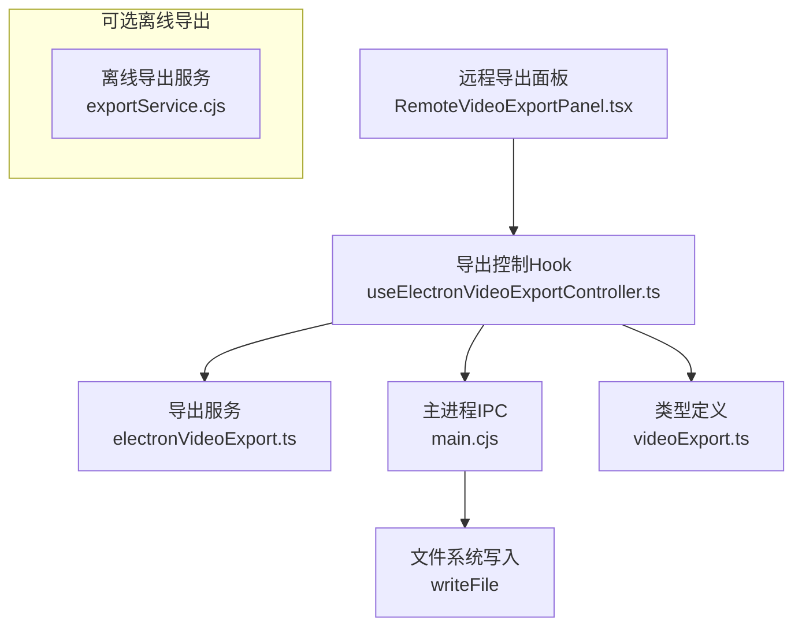
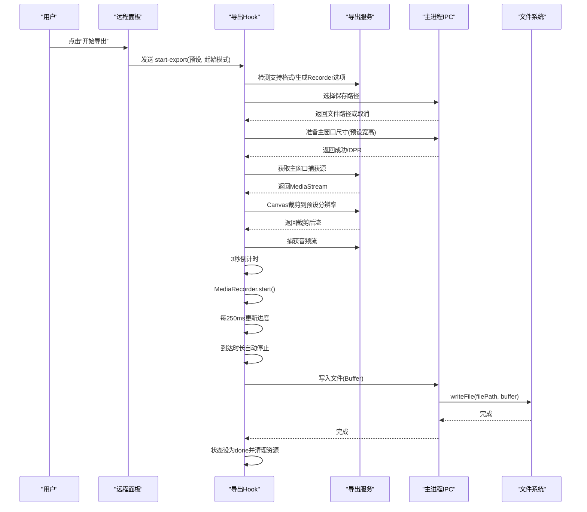
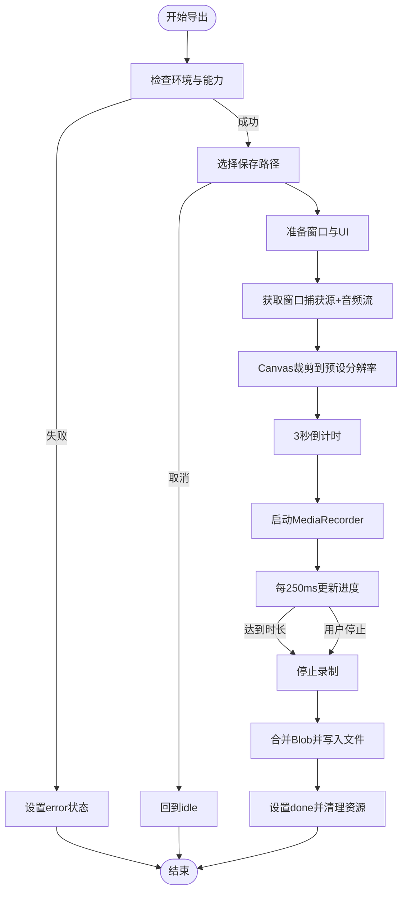
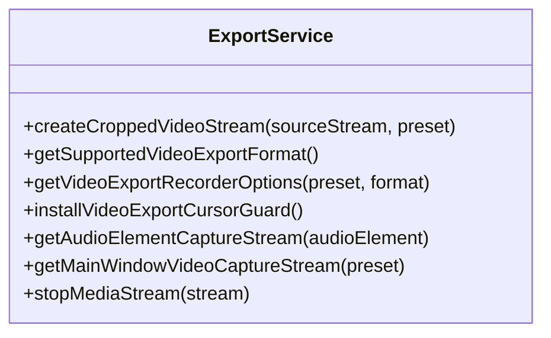
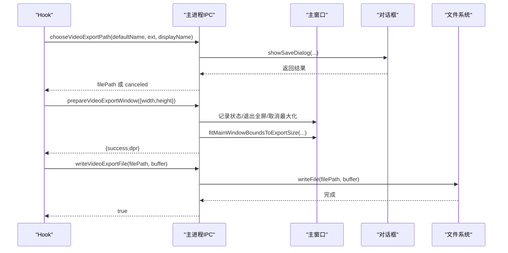
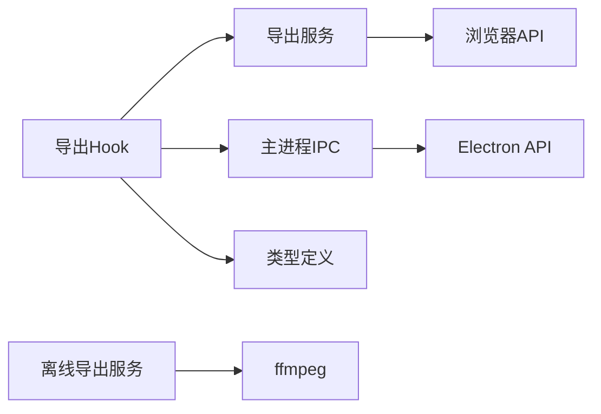

# 视频导出窗口

<cite>
**本文引用的文件**
- [electron/main.cjs](file://electron/main.cjs)
- [src/hooks/useElectronVideoExportController.ts](file://src/hooks/useElectronVideoExportController.ts)
- [src/services/electronVideoExport.ts](file://src/services/electronVideoExport.ts)
- [src/types/videoExport.ts](file://src/types/videoExport.ts)
- [src/components/remote/RemoteVideoExportPanel.tsx](file://src/components/remote/RemoteVideoExportPanel.tsx)
- [src/components/remote/RemoteControlApp.tsx](file://src/components/remote/RemoteControlApp.tsx)
- [electron/modSystem/exportService.cjs](file://electron/modSystem/exportService.cjs)
</cite>

## 目录
1. [简介](#简介)
2. [项目结构](#项目结构)
3. [核心组件](#核心组件)
4. [架构总览](#架构总览)
5. [详细组件分析](#详细组件分析)
6. [依赖关系分析](#依赖关系分析)
7. [性能考量](#性能考量)
8. [故障排除指南](#故障排除指南)
9. [结论](#结论)

## 简介
本技术文档聚焦于 Folia Player 的视频导出窗口管理系统，覆盖以下关键主题：
- 视频导出窗口的创建、配置与生命周期管理（大小、位置、显示状态）
- 导出过程中的窗口状态管理（进度、错误处理、用户交互）
- 与主播放器的数据同步机制（确保导出内容与当前播放状态一致）
- 性能优化策略（内存管理与渲染优化）
- 错误处理与恢复机制
- 调试工具与故障排除方法

该子系统由前端 Hook、服务层、IPC 主进程以及可选的离线导出服务共同组成，目标是提供稳定、高质量且可中断的视频导出体验。

## 项目结构
围绕视频导出的关键代码分布在以下模块：
- 前端控制 Hook：负责导出流程编排、状态机推进、媒体流采集与回收
- 服务层：封装浏览器/Chromium 录制能力、Canvas 裁剪、格式探测等
- 主进程 IPC：负责窗口尺寸适配、保存对话框、文件写入、捕获源获取
- 类型定义：导出预设、状态、开始模式等共享类型
- 远程面板：用于触发/控制导出流程的用户界面
- 可选离线导出服务：基于 off-screen 窗口 + ffmpeg 的高级导出路径

图表来源
- [src/components/remote/RemoteVideoExportPanel.tsx:55-162](file://src/components/remote/RemoteVideoExportPanel.tsx#L55-L162)
- [src/hooks/useElectronVideoExportController.ts:41-336](file://src/hooks/useElectronVideoExportController.ts#L41-L336)
- [src/services/electronVideoExport.ts:1-301](file://src/services/electronVideoExport.ts#L1-L301)
- [electron/main.cjs:5178-5289](file://electron/main.cjs#L5178-L5289)
- [src/types/videoExport.ts:1-108](file://src/types/videoExport.ts#L1-L108)
- [electron/modSystem/exportService.cjs:40-196](file://electron/modSystem/exportService.cjs#L40-L196)

章节来源
- [src/components/remote/RemoteVideoExportPanel.tsx:55-162](file://src/components/remote/RemoteVideoExportPanel.tsx#L55-L162)
- [src/hooks/useElectronVideoExportController.ts:41-336](file://src/hooks/useElectronVideoExportController.ts#L41-L336)
- [src/services/electronVideoExport.ts:1-301](file://src/services/electronVideoExport.ts#L1-L301)
- [electron/main.cjs:5178-5289](file://electron/main.cjs#L5178-L5289)
- [src/types/videoExport.ts:1-108](file://src/types/videoExport.ts#L1-L108)
- [electron/modSystem/exportService.cjs:40-196](file://electron/modSystem/exportService.cjs#L40-L196)

## 核心组件
- 导出控制 Hook（useElectronVideoExportController）
  - 职责：编排导出流程、维护状态机、管理媒体流与定时器、调用 IPC、清理资源
  - 关键点：倒计时、进度轮询、自动停止、错误与取消分支、最终化与落盘
- 导出服务（electronVideoExport）
  - 职责：格式探测、Recorder 选项生成、Canvas 裁剪流、音频流捕获、光标隐藏、窗口捕获源获取
  - 关键点：纯整数裁剪避免黑边、按分辨率动态码率、帧率限制、流回收
- 主进程 IPC（main.cjs）
  - 职责：选择保存路径、准备/恢复主窗口尺寸与状态、写入文件、获取捕获源
  - 关键点：安全校验、DWM 边框补偿、bounds/content 对齐、全屏/最大化状态恢复
- 类型定义（videoExport.ts）
  - 职责：导出状态、预设、开始模式、默认值与校验
  - 关键点：预设范围钳制、方向判定、空闲状态工厂
- 远程面板（RemoteVideoExportPanel / RemoteControlApp）
  - 职责：用户操作入口、状态展示、命令下发、预设切换与窗口尺寸调整
- 可选离线导出服务（exportService.cjs）
  - 职责：off-screen 透明窗口驱动可视化器，逐帧捕获并编码为 MOV（含 Alpha）
  - 关键点：进程/窗口确定性销毁、参数校验、ffmpeg 集成

章节来源
- [src/hooks/useElectronVideoExportController.ts:41-336](file://src/hooks/useElectronVideoExportController.ts#L41-L336)
- [src/services/electronVideoExport.ts:1-301](file://src/services/electronVideoExport.ts#L1-L301)
- [electron/main.cjs:5178-5289](file://electron/main.cjs#L5178-L5289)
- [src/types/videoExport.ts:1-108](file://src/types/videoExport.ts#L1-L108)
- [src/components/remote/RemoteVideoExportPanel.tsx:55-162](file://src/components/remote/RemoteVideoExportPanel.tsx#L55-L162)
- [src/components/remote/RemoteControlApp.tsx:329-365](file://src/components/remote/RemoteControlApp.tsx#L329-L365)
- [electron/modSystem/exportService.cjs:40-196](file://electron/modSystem/exportService.cjs#L40-L196)

## 架构总览
视频导出采用“前端 Hook + 服务层 + 主进程 IPC”的分层架构，保证：
- 前端专注状态机与用户体验
- 服务层屏蔽平台差异与底层 API
- 主进程负责系统级能力（窗口、文件、捕获源）

图表来源
- [src/hooks/useElectronVideoExportController.ts:67-290](file://src/hooks/useElectronVideoExportController.ts#L67-L290)
- [src/services/electronVideoExport.ts:23-157](file://src/services/electronVideoExport.ts#L23-L157)
- [electron/main.cjs:5178-5289](file://electron/main.cjs#L5178-L5289)

## 详细组件分析

### 导出控制 Hook（useElectronVideoExportController）
- 生命周期
  - 初始化：读取当前音频元素与歌曲元信息，检查 Electron 能力
  - 准备阶段：选择保存路径、隐藏播放器控件、暂停播放、重置时间轴（可选从开头）
  - 窗口准备：通过 IPC 将主窗口调整为导出尺寸，记录原始状态以便恢复
  - 采集阶段：获取主窗口捕获源，Canvas 裁剪至目标分辨率，合并音频流
  - 录制阶段：启动 MediaRecorder，定时更新进度，到达时长或手动停止时结束
  - 收尾阶段：合并数据块为 Blob，写入文件，设置完成状态，清理所有资源并恢复窗口
- 状态机
  - idle → preparing → countdown → recording → finalizing → done
  - 任意阶段可进入 error；recording 可被 stop/cancel 中断
- 数据同步
  - 使用 audioElement.currentTime 作为唯一时钟，确保导出画面与播放时间一致
  - 导出期间暂停播放，结束后恢复原时间与循环设置
- 错误与取消
  - 捕获异常并设置 error 状态；取消时清空状态并释放资源
  - 自动计时器在完成后重置状态，避免 UI 长期停留在终态

图表来源
- [src/hooks/useElectronVideoExportController.ts:67-290](file://src/hooks/useElectronVideoExportController.ts#L67-L290)

章节来源
- [src/hooks/useElectronVideoExportController.ts:67-290](file://src/hooks/useElectronVideoExportController.ts#L67-L290)

### 导出服务（electronVideoExport）
- 功能要点
  - 格式探测：优先 MP4（avc1/mp4a），回退 WebM（vp8/vp9/opus）
  - Recorder 选项：根据分辨率计算视频码率，固定音频码率
  - Canvas 裁剪：以 cover 模式进行整数裁剪，避免黑边；若源小于目标则回退到缩放
  - 光标隐藏：注入样式禁用光标绘制，避免录制中出现鼠标指针
  - 流回收：正确停止所有轨道，释放 video/canvas 节点
- 性能优化
  - 仅在主线程进行必要的 Canvas 绘制，使用 requestAnimationFrame 控制帧率
  - 避免不必要的缩放，尽量使用纯裁剪路径
  - 根据像素数量动态调整视频码率，平衡质量与体积

图表来源
- [src/services/electronVideoExport.ts:23-157](file://src/services/electronVideoExport.ts#L23-L157)
- [src/services/electronVideoExport.ts:192-237](file://src/services/electronVideoExport.ts#L192-L237)
- [src/services/electronVideoExport.ts:239-301](file://src/services/electronVideoExport.ts#L239-L301)

章节来源
- [src/services/electronVideoExport.ts:23-157](file://src/services/electronVideoExport.ts#L23-L157)
- [src/services/electronVideoExport.ts:192-237](file://src/services/electronVideoExport.ts#L192-L237)
- [src/services/electronVideoExport.ts:239-301](file://src/services/electronVideoExport.ts#L239-L301)

### 主进程 IPC（main.cjs）
- 能力清单
  - 选择保存路径：安全过滤扩展名与文件名，默认保存到系统视频目录
  - 准备窗口：记录全屏/最大化状态，调整 bounds 以匹配导出尺寸，处理 DWM 边框
  - 恢复窗口：还原 bounds 与状态
  - 写入文件：将 Buffer 写入指定路径
  - 获取捕获源：返回主窗口捕获源 ID
- 窗口尺寸适配
  - sanitizeVideoExportSize：钳制宽高范围
  - fitMainWindowBoundsToExportSize：搜索合适 bounds，消除装饰边框影响，返回 DPR
- 安全性
  - 所有 IPC 均校验来源是否可信，防止非受信任渲染进程越权

图表来源
- [electron/main.cjs:5178-5289](file://electron/main.cjs#L5178-L5289)
- [electron/main.cjs:3660-3690](file://electron/main.cjs#L3660-L3690)

章节来源
- [electron/main.cjs:5178-5289](file://electron/main.cjs#L5178-L5289)
- [electron/main.cjs:3660-3690](file://electron/main.cjs#L3660-L3690)

### 类型定义（videoExport.ts）
- 导出状态：idle/preparing/countdown/recording/finalizing/done/error
- 预设：id/label/width/height/orientation，支持最小/最大范围钳制与偶数对齐
- 开始模式：from-start/current
- 默认值：三组预设（横屏两档、竖屏一档），空闲状态工厂

章节来源
- [src/types/videoExport.ts:1-108](file://src/types/videoExport.ts#L1-L108)

### 远程面板与命令（RemoteVideoExportPanel / RemoteControlApp）
- 面板展示：不同状态对应文案与动画指示（准备中、倒计时、录制中、保存中）
- 命令下发：start-export、stop-export、cancel-export、resize-main-window
- 预设切换：实时调整主窗口尺寸，便于预览导出效果

章节来源
- [src/components/remote/RemoteVideoExportPanel.tsx:55-162](file://src/components/remote/RemoteVideoExportPanel.tsx#L55-L162)
- [src/components/remote/RemoteControlApp.tsx:329-365](file://src/components/remote/RemoteControlApp.tsx#L329-L365)

### 可选离线导出服务（exportService.cjs）
- 设计目标：稳定性优先，off-screen 透明窗口驱动可视化器，逐帧捕获并通过 ffmpeg 编码为 MOV（ProRes 4444，带 Alpha）
- 参数校验：宽高、帧率、时长上限等限制，防止意外长时渲染
- 资源管理：每个会话独立进程/窗口，成功/失败/取消均确定性销毁

章节来源
- [electron/modSystem/exportService.cjs:15-39](file://electron/modSystem/exportService.cjs#L15-L39)
- [electron/modSystem/exportService.cjs:40-196](file://electron/modSystem/exportService.cjs#L40-L196)

## 依赖关系分析
- 前端 Hook 依赖服务层提供的媒体能力与工具函数
- 服务层依赖浏览器/Chromium API（MediaRecorder、Canvas、getUserMedia/desktopCapturer）
- 主进程 IPC 依赖 Electron 能力（BrowserWindow、dialog、fs）
- 类型定义贯穿前后端，保证数据结构一致性
- 可选离线导出服务依赖 ffmpeg 与 off-screen 窗口能力

图表来源
- [src/hooks/useElectronVideoExportController.ts:41-336](file://src/hooks/useElectronVideoExportController.ts#L41-L336)
- [src/services/electronVideoExport.ts:1-301](file://src/services/electronVideoExport.ts#L1-L301)
- [electron/main.cjs:5178-5289](file://electron/main.cjs#L5178-L5289)
- [electron/modSystem/exportService.cjs:40-196](file://electron/modSystem/exportService.cjs#L40-L196)

章节来源
- [src/hooks/useElectronVideoExportController.ts:41-336](file://src/hooks/useElectronVideoExportController.ts#L41-L336)
- [src/services/electronVideoExport.ts:1-301](file://src/services/electronVideoExport.ts#L1-L301)
- [electron/main.cjs:5178-5289](file://electron/main.cjs#L5178-L5289)
- [electron/modSystem/exportService.cjs:40-196](file://electron/modSystem/exportService.cjs#L40-L196)

## 性能考量
- 渲染优化
  - 使用 Canvas 纯整数裁剪避免缩放与黑边，减少重采样开销
  - 仅在必要时启用高保真插值（回退路径），正常路径 scale=1.0
  - 使用 requestAnimationFrame 控制绘制频率，避免过度刷新
- 内存管理
  - 严格回收所有媒体轨道与 DOM 节点（video、canvas）
  - 导出结束后立即停止并释放捕获源，避免资源泄漏
  - 合理设置视频码率，依据分辨率动态调整，平衡质量与内存占用
- I/O 优化
  - 主进程直接写入 Buffer，避免中间文件
  - 使用系统视频目录作为默认保存路径，减少权限问题
- 窗口适配
  - 通过 bounds/content 对齐消除 DWM 边框影响，确保捕获区域精确
  - 记录并恢复全屏/最大化状态，避免影响用户工作区

[本节为通用性能指导，不直接分析具体文件]

## 故障排除指南
- 常见问题定位
  - 无可用导出格式：检查浏览器对 MP4/WebM 编解码支持
  - 无法捕获主窗口：确认已获取有效捕获源 ID，检查平台权限
  - 黑边或拉伸：检查 Canvas 裁剪逻辑与窗口 bounds 适配是否正确
  - 导出失败：查看错误消息，确认文件路径可写、磁盘空间充足
- 恢复机制
  - 取消导出：清除状态、释放资源、恢复窗口与播放状态
  - 错误恢复：自动重置状态，允许重试
- 调试建议
  - 观察控制台日志：捕获原生分辨率、裁剪模式、DPR 等信息
  - 验证窗口尺寸：确认 prepare/restore 流程正确执行
  - 检查资源释放：确保所有轨道停止、DOM 移除

章节来源
- [src/services/electronVideoExport.ts:23-157](file://src/services/electronVideoExport.ts#L23-L157)
- [src/hooks/useElectronVideoExportController.ts:258-289](file://src/hooks/useElectronVideoExportController.ts#L258-L289)
- [electron/main.cjs:5178-5289](file://electron/main.cjs#L5178-L5289)

## 结论
Folia Player 的视频导出窗口管理系统通过清晰的分层设计与严格的资源管理，实现了稳定、高质量且可中断的导出体验。前端 Hook 负责状态机与用户体验，服务层屏蔽平台差异，主进程 IPC 提供系统级能力。通过 Canvas 裁剪、窗口尺寸适配与动态码率策略，系统在多平台上保持了良好的一致性与性能。结合完善的错误处理与恢复机制，以及可选的离线导出服务，满足了不同场景下的导出需求。