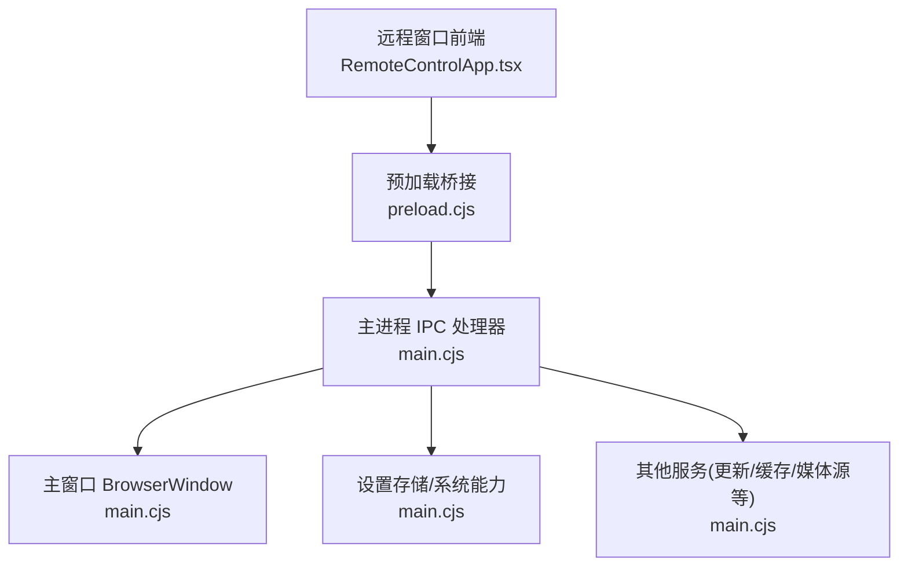
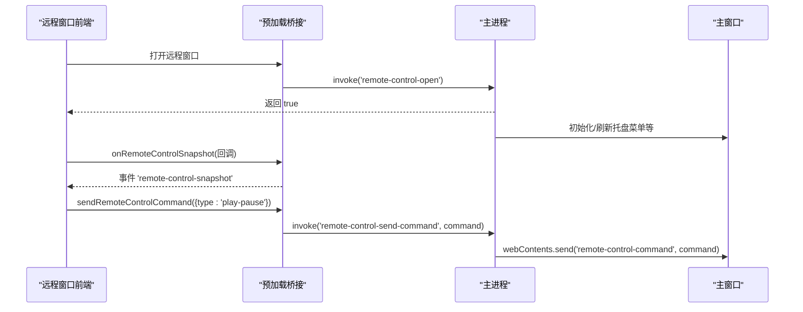
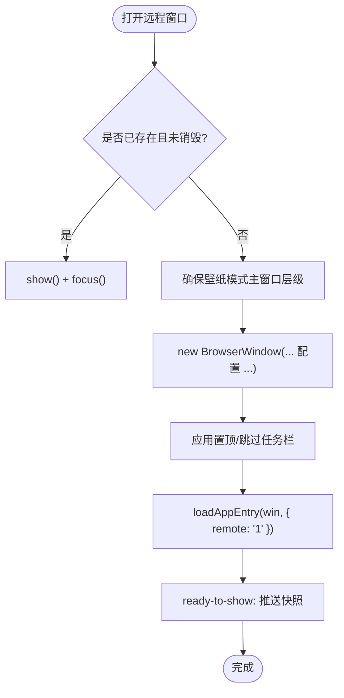
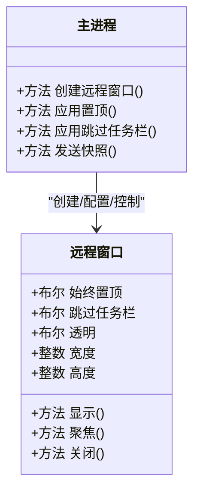
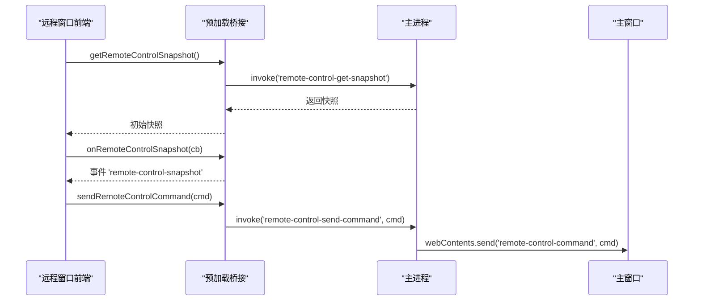
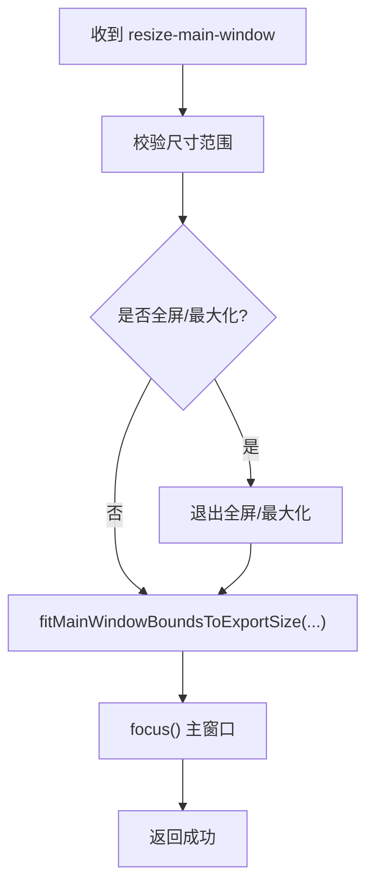
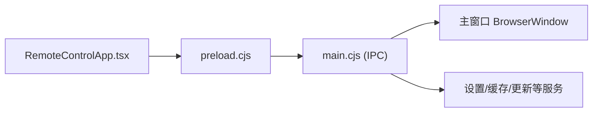

# 远程窗口管理

<cite>
**本文引用的文件**
- [electron/main.cjs](file://electron/main.cjs)
- [electron/preload.cjs](file://electron/preload.cjs)
- [src/components/remote/RemoteControlApp.tsx](file://src/components/remote/RemoteControlApp.tsx)
- [src/types/remoteControl.ts](file://src/types/remoteControl.ts)
</cite>

## 目录
1. [简介](#简介)
2. [项目结构](#项目结构)
3. [核心组件](#核心组件)
4. [架构总览](#架构总览)
5. [详细组件分析](#详细组件分析)
6. [依赖关系分析](#依赖关系分析)
7. [性能与资源优化](#性能与资源优化)
8. [安全与权限控制](#安全与权限控制)
9. [故障排除指南](#故障排除指南)
10. [结论](#结论)

## 简介
本技术文档聚焦 Folia Player 的“远程窗口”（Remote Control Window）管理系统，系统性解析其创建、配置、生命周期管理、与主窗口的通信机制、特殊能力（始终置顶、跳过任务栏等）、资源管理与内存优化策略，以及安全与调试排障要点。远程窗口是一个独立的 BrowserWindow，用于在桌面层提供对单一真实播放器实例的轻量控制界面，并通过 IPC 与主进程及主窗口进行状态同步与指令下发。

## 项目结构
围绕远程窗口管理的代码主要分布在以下位置：
- 主进程侧：窗口创建、属性设置、IPC 处理器、快照广播、命令分发、与主窗口交互逻辑集中在 electron/main.cjs。
- 预加载脚本：向渲染进程暴露受控 API，屏蔽原生 Electron 对象，集中封装 IPC 调用，位于 electron/preload.cjs。
- 远程窗口前端：React 应用 RemoteControlApp.tsx，负责 UI、用户交互、本地状态与 IPC 调用。
- 类型定义：remoteControl.ts 定义了远程窗口与主进程之间的消息契约（命令与快照）。

**图表来源**
- [electron/main.cjs:3590-3658](file://electron/main.cjs#L3590-L3658)
- [electron/preload.cjs:205-222](file://electron/preload.cjs#L205-L222)
- [src/components/remote/RemoteControlApp.tsx:42-44](file://src/components/remote/RemoteControlApp.tsx#L42-L44)

**章节来源**
- [electron/main.cjs:3590-3658](file://electron/main.cjs#L3590-L3658)
- [electron/preload.cjs:205-222](file://electron/preload.cjs#L205-L222)
- [src/components/remote/RemoteControlApp.tsx:42-44](file://src/components/remote/RemoteControlApp.tsx#L42-L44)

## 核心组件
- 远程窗口 BrowserWindow：无框、透明、固定尺寸、可置顶、可跳过任务栏，由主进程统一创建与管理。
- 预加载桥接：将 window.electron 暴露给远程窗口前端，仅开放必要方法（打开/关闭/切换、获取/设置置顶、发送命令、获取快照等）。
- 远程窗口前端：基于 React 的控制面板，订阅快照、发送控制命令、调整背景模式、触发主窗口尺寸适配等。
- 主进程 IPC：处理远程窗口相关的所有请求，校验来源可信性，执行窗口操作、状态广播、命令转发到主窗口。

**章节来源**
- [electron/main.cjs:3590-3658](file://electron/main.cjs#L3590-L3658)
- [electron/preload.cjs:205-222](file://electron/preload.cjs#L205-L222)
- [src/components/remote/RemoteControlApp.tsx:191-224](file://src/components/remote/RemoteControlApp.tsx#L191-L224)
- [src/types/remoteControl.ts:17-36](file://src/types/remoteControl.ts#L17-L36)

## 架构总览
远程窗口通过 IPC 与主进程通信，主进程作为唯一可信入口，负责：
- 创建/显示/隐藏/销毁远程窗口
- 维护远程窗口属性（置顶、跳过任务栏）
- 接收远程窗口发来的控制命令并转发至主窗口
- 维护最新快照并推送给远程窗口
- 与主窗口进行状态同步（如点击穿透、置顶、透明模式等）

**图表来源**
- [electron/preload.cjs:205-222](file://electron/preload.cjs#L205-L222)
- [electron/main.cjs:5036-5043](file://electron/main.cjs#L5036-L5043)
- [electron/main.cjs:5126-5176](file://electron/main.cjs#L5126-L5176)
- [electron/main.cjs:3567-3574](file://electron/main.cjs#L3567-L3574)

**章节来源**
- [electron/main.cjs:3567-3574](file://electron/main.cjs#L3567-L3574)
- [electron/main.cjs:5036-5043](file://electron/main.cjs#L5036-L5043)
- [electron/main.cjs:5126-5176](file://electron/main.cjs#L5126-L5176)
- [electron/preload.cjs:205-222](file://electron/preload.cjs#L205-L222)

## 详细组件分析

### 远程窗口创建与生命周期
- 创建：主进程通过 createRemoteControlWindow 新建 BrowserWindow，设置无框、透明、固定宽高、置顶、跳过任务栏等属性，并注入 preload 脚本。
- 显示/聚焦：若已存在则直接 show/focus；首次创建时确保壁纸模式下主窗口层级正确，再创建远程窗口。
- 关闭：仅允许来自远程窗口自身的 close 请求，防止不可信渲染进程关闭。
- 事件：监听 page-title-updated 强制标题为固定值；ready-to-show 时应用置顶/任务栏设置并推送最新快照；closed 时清理引用。

**图表来源**
- [electron/main.cjs:3590-3658](file://electron/main.cjs#L3590-L3658)

**章节来源**
- [electron/main.cjs:3590-3658](file://electron/main.cjs#L3590-L3658)

### 远程窗口属性与特殊功能
- 始终置顶：支持在主进程侧读取/设置，持久化到设置项，实时应用到远程窗口。
- 跳过任务栏：支持在主进程侧读取/设置，实时应用到远程窗口。
- 透明与无框：远程窗口使用透明背景和无边框，提升悬浮体验。
- 固定尺寸：默认宽高与最小/最大尺寸限制，避免误缩放。

**图表来源**
- [electron/main.cjs:3590-3658](file://electron/main.cjs#L3590-L3658)
- [electron/main.cjs:5072-5095](file://electron/main.cjs#L5072-L5095)

**章节来源**
- [electron/main.cjs:3590-3658](file://electron/main.cjs#L3590-L3658)
- [electron/main.cjs:5072-5095](file://electron/main.cjs#L5072-L5095)

### IPC 消息传递与数据同步
- 打开/切换/关闭远程窗口：通过 preload 暴露的 open/toggle/close 调用主进程 IPC。
- 快照订阅：主进程维护 latestRemoteControlSnapshot，并在变更时通过 send 推送 'remote-control-snapshot' 事件。
- 命令下发：远程窗口发送命令（播放/暂停/上一首/下一首/拖动进度/循环模式/主窗口尺寸调整/透明模式开关/导出控制/点赞等），主进程校验来源后转发到主窗口。
- 主窗口状态共享：快照中包含主窗口点击穿透、置顶、边框可见性等状态，供远程窗口 UI 反映。

**图表来源**
- [electron/preload.cjs:205-222](file://electron/preload.cjs#L205-L222)
- [electron/main.cjs:5097-5124](file://electron/main.cjs#L5097-L5124)
- [electron/main.cjs:5126-5176](file://electron/main.cjs#L5126-L5176)
- [electron/main.cjs:3567-3574](file://electron/main.cjs#L3567-L3574)

**章节来源**
- [electron/preload.cjs:205-222](file://electron/preload.cjs#L205-L222)
- [electron/main.cjs:5097-5124](file://electron/main.cjs#L5097-L5124)
- [electron/main.cjs:5126-5176](file://electron/main.cjs#L5126-L5176)
- [electron/main.cjs:3567-3574](file://electron/main.cjs#L3567-L3574)

### 主窗口尺寸与导出适配
- 远程窗口可触发主窗口尺寸调整，以匹配视频导出预设分辨率。
- 主进程通过 fitMainWindowBoundsToExportSize 计算 CSS 内容与物理像素边界，消除 DWM 装饰带来的偏差，确保捕获源比例一致。
- 支持全屏/最大化退出后再恢复，保证导出期间画面稳定。

**图表来源**
- [electron/main.cjs:5148-5168](file://electron/main.cjs#L5148-L5168)
- [electron/main.cjs:3683-3807](file://electron/main.cjs#L3683-L3807)

**章节来源**
- [electron/main.cjs:5148-5168](file://electron/main.cjs#L5148-L5168)
- [electron/main.cjs:3683-3807](file://electron/main.cjs#L3683-L3807)

### 远程窗口前端交互
- 背景模式：默认/封面色/透明三种，支持本地存储记忆。
- 置顶切换：调用 setRemoteControlAlwaysOnTop，主进程持久化并应用。
- 播放控制：通过 sendRemoteControlCommand 下发命令，主窗口响应。
- 歌词覆盖：悬停延迟显示歌词覆盖层，提升信息密度。
- 导出面板：选择预设或自定义宽高，触发主窗口尺寸适配。

**章节来源**
- [src/components/remote/RemoteControlApp.tsx:111-189](file://src/components/remote/RemoteControlApp.tsx#L111-L189)
- [src/components/remote/RemoteControlApp.tsx:407-415](file://src/components/remote/RemoteControlApp.tsx#L407-L415)
- [src/components/remote/RemoteControlApp.tsx:328-370](file://src/components/remote/RemoteControlApp.tsx#L328-L370)

## 依赖关系分析
- 远程窗口前端依赖预加载桥接提供的 window.electron API。
- 预加载桥接依赖 Electron 的 ipcRenderer 与 contextBridge。
- 主进程依赖 BrowserWindow、ipcMain、Store、屏幕/会话/更新/缓存等服务。
- 远程窗口与主窗口通过 IPC 解耦，主进程作为权威状态源与调度中心。

**图表来源**
- [electron/preload.cjs:1-320](file://electron/preload.cjs#L1-L320)
- [electron/main.cjs:4277-4464](file://electron/main.cjs#L4277-L4464)

**章节来源**
- [electron/preload.cjs:1-320](file://electron/preload.cjs#L1-L320)
- [electron/main.cjs:4277-4464](file://electron/main.cjs#L4277-L4464)

## 性能与资源优化
- 远程窗口固定尺寸与最小/最大尺寸限制，减少重排与重绘开销。
- 透明背景与无框设计降低合成复杂度，同时保持悬浮体验。
- 快照采用增量合并（保留歌词字段等），避免重复传输大对象。
- 主窗口导出尺寸适配通过精确计算与多次微调，避免黑边与缩放失真，提高录制质量。
- 壁纸模式下确保主窗口层级与几何，避免意外成为壁纸表面导致渲染异常。

[本节为通用性能讨论，不直接分析具体文件]

## 安全与权限控制
- 来源校验：所有敏感 IPC 均检查 sender 是否为可信的主窗口或远程窗口渲染进程，否则抛出错误。
- 最小权限暴露：预加载仅暴露必要 API，禁止直接访问 Node/Electron 内部对象。
- 远程窗口关闭保护：仅允许远程窗口自身关闭，防止外部页面恶意关闭。
- 设置写入保护：部分设置项需要可信来源才能修改（如 OBS/Lyrics/Discord 等）。
- 协议与证书：注册自定义协议与信任特定 CDN 证书错误，保障本地资源与安全访问。

**章节来源**
- [electron/main.cjs:5036-5043](file://electron/main.cjs#L5036-L5043)
- [electron/main.cjs:5059-5070](file://electron/main.cjs#L5059-L5070)
- [electron/main.cjs:5072-5095](file://electron/main.cjs#L5072-L5095)
- [electron/main.cjs:4277-4464](file://electron/main.cjs#L4277-L4464)
- [electron/main.cjs:42-76](file://electron/main.cjs#L42-L76)

## 故障排除指南
- 无法打开远程窗口：检查主进程是否已创建主窗口；确认来源可信；查看托盘菜单与 IPC 日志。
- 远程窗口置顶无效：确认设置项 REMOTE_CONTROL_ALWAYS_ON_TOP 已保存；检查 applyRemoteControlAlwaysOnTop 是否被调用。
- 跳过任务栏无效：确认 REMOTE_CONTROL_SKIP_TASKBAR 设置生效；检查 applyRemoteControlSkipTaskbar 是否被调用。
- 主窗口尺寸调整失败：检查 sanitizeVideoExportSize 是否通过；确认非全屏/最大化；查看 fitMainWindowBoundsToExportSize 返回值。
- 快照不同步：确认主进程 latestRemoteControlSnapshot 已更新；检查 sendRemoteControlSnapshot 是否执行；确认远程窗口订阅了 onRemoteControlSnapshot。
- 壁纸模式异常：检查 ensureWallpaperLayerHeldByMainWindow；确认窗口层级与几何；必要时重建主窗口。

**章节来源**
- [electron/main.cjs:3590-3658](file://electron/main.cjs#L3590-L3658)
- [electron/main.cjs:5072-5095](file://electron/main.cjs#L5072-L5095)
- [electron/main.cjs:5148-5168](file://electron/main.cjs#L5148-L5168)
- [electron/main.cjs:3567-3574](file://electron/main.cjs#L3567-L3574)
- [electron/main.cjs:3581-3588](file://electron/main.cjs#L3581-L3588)

## 结论
Folia Player 的远程窗口管理系统通过清晰的分层与严格的 IPC 权限控制，实现了轻量、安全、高效的跨窗口控制。远程窗口专注于 UI 与交互，主进程负责窗口生命周期、状态同步与命令路由，主窗口承载实际播放逻辑。借助精确的尺寸适配与透明的视觉设计，系统在多平台下提供了稳定的悬浮控制体验。未来可进一步扩展更多远程控制能力（如快捷键映射、更丰富的导出选项），并保持现有安全与性能基线。