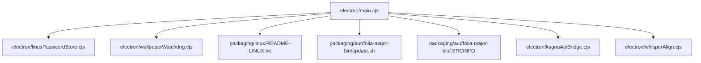
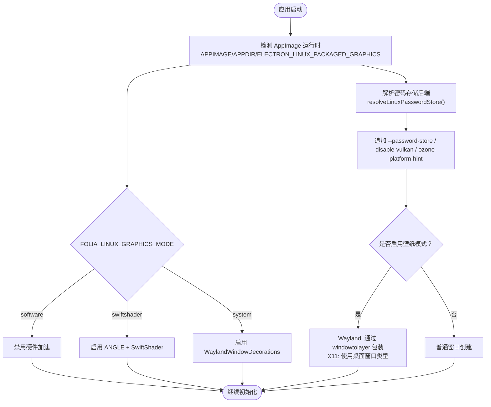
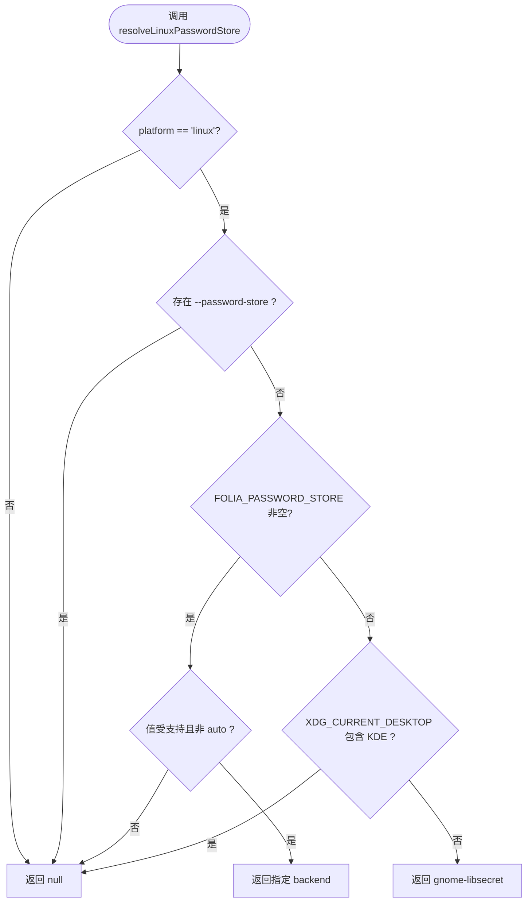
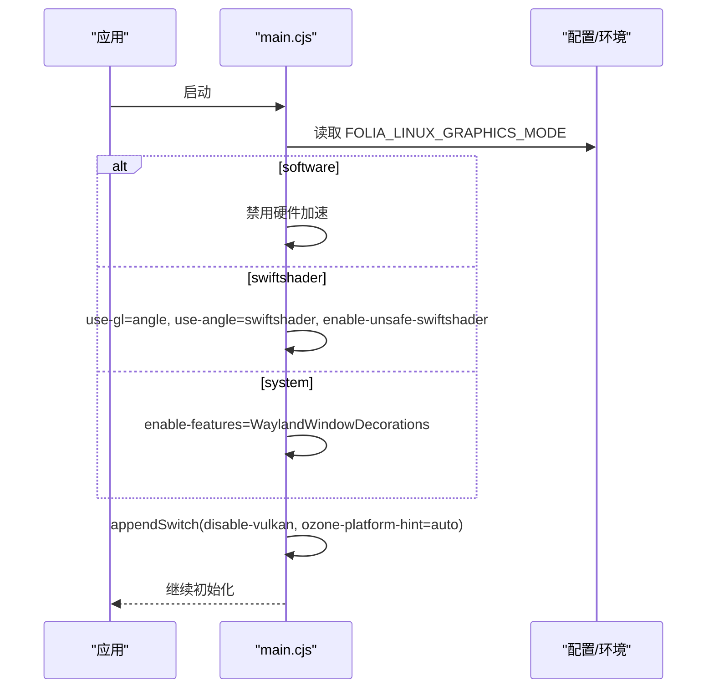
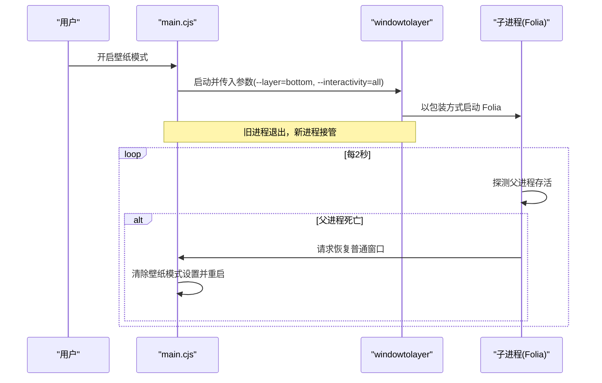
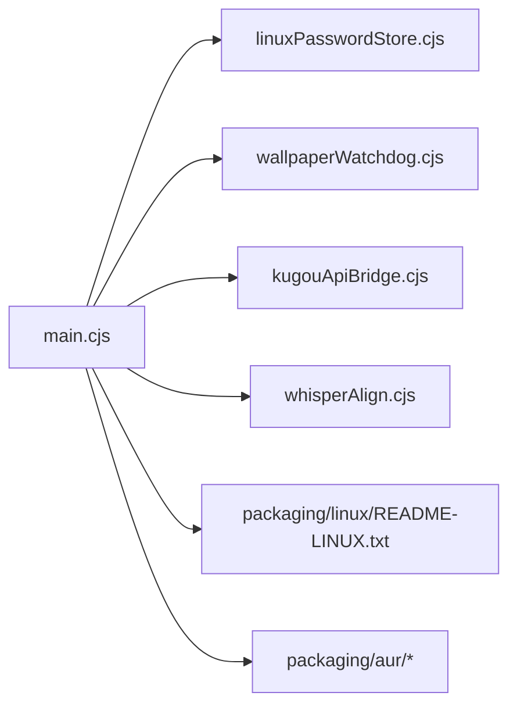

# Linux平台适配

<cite>
**本文引用的文件**
- [electron/main.cjs](file://electron/main.cjs)
- [electron/linuxPasswordStore.cjs](file://electron/linuxPasswordStore.cjs)
- [electron/wallpaperWatchdog.cjs](file://electron/wallpaperWatchdog.cjs)
- [packaging/linux/README-LINUX.txt](file://packaging/linux/README-LINUX.txt)
- [packaging/aur/folia-major-bin/update.sh](file://packaging/aur/folia-major-bin/update.sh)
- [packaging/aur/folia-major-bin/.SRCINFO](file://packaging/aur/folia-major-bin/.SRCINFO)
- [electron/kugouApiBridge.cjs](file://electron/kugouApiBridge.cjs)
- [electron/whisperAlign.cjs](file://electron/whisperAlign.cjs)
- [test/unit/electron/linuxPasswordStore.test.ts](file://test/unit/electron/linuxPasswordStore.test.ts)
- [test/unit/electron/wallpaperWatchdog.test.ts](file://test/unit/electron/wallpaperWatchdog.test.ts)
</cite>

## 目录
1. [简介](#简介)
2. [项目结构](#项目结构)
3. [核心组件](#核心组件)
4. [架构总览](#架构总览)
5. [详细组件分析](#详细组件分析)
6. [依赖关系分析](#依赖关系分析)
7. [性能考虑](#性能考虑)
8. [故障排除指南](#故障排除指南)
9. [结论](#结论)
10. [附录](#附录)

## 简介
本文件聚焦 Folia Player 在 Linux 平台的适配实现，覆盖 AppImage 运行时检测、Wayland/X11 环境识别、密码存储后端选择、图形栈处理（Wayland 窗口装饰、X11 桌面窗口类型、Vulkan 禁用策略、SwiftShader 软件渲染）、桌面环境集成（KDE Plasma、GNOME、XFCE 等）、文件系统差异（路径分隔符、权限模型、符号链接）、发行版适配（AUR、依赖项）以及性能调优与测试排障。文档以代码级事实为依据，辅以流程图与时序图帮助理解。

## 项目结构
Linux 相关能力主要分布在 Electron 主进程与打包资源中：
- 启动期参数与环境探测：electron/main.cjs
- 密码存储后端选择：electron/linuxPasswordStore.cjs
- 壁纸模式与守护逻辑：electron/wallpaperWatchdog.cjs
- Linux 使用说明与图形模式说明：packaging/linux/README-LINUX.txt
- AUR 包元数据与更新脚本：packaging/aur/*
- 安全存储断言与跨平台二进制安装：electron/kugouApiBridge.cjs、electron/whisperAlign.cjs

**图表来源**
- [electron/main.cjs:78-105](file://electron/main.cjs#L78-L105)
- [electron/linuxPasswordStore.cjs:34-47](file://electron/linuxPasswordStore.cjs#L34-L47)
- [electron/wallpaperWatchdog.cjs:23-25](file://electron/wallpaperWatchdog.cjs#L23-L25)
- [packaging/linux/README-LINUX.txt:25-41](file://packaging/linux/README-LINUX.txt#L25-L41)
- [packaging/aur/folia-major-bin/update.sh:31-35](file://packaging/aur/folia-major-bin/update.sh#L31-L35)
- [packaging/aur/folia-major-bin/.SRCINFO:8-12](file://packaging/aur/folia-major-bin/.SRCINFO#L8-L12)
- [electron/kugouApiBridge.cjs:55-68](file://electron/kugouApiBridge.cjs#L55-L68)
- [electron/whisperAlign.cjs:1580-1804](file://electron/whisperAlign.cjs#L1580-L1804)

**章节来源**
- [electron/main.cjs:78-105](file://electron/main.cjs#L78-L105)
- [electron/linuxPasswordStore.cjs:34-47](file://electron/linuxPasswordStore.cjs#L34-L47)
- [electron/wallpaperWatchdog.cjs:23-25](file://electron/wallpaperWatchdog.cjs#L23-L25)
- [packaging/linux/README-LINUX.txt:25-41](file://packaging/linux/README-LINUX.txt#L25-L41)
- [packaging/aur/folia-major-bin/update.sh:31-35](file://packaging/aur/folia-major-bin/update.sh#L31-L35)
- [packaging/aur/folia-major-bin/.SRCINFO:8-12](file://packaging/aur/folia-major-bin/.SRCINFO#L8-L12)
- [electron/kugouApiBridge.cjs:55-68](file://electron/kugouApiBridge.cjs#L55-L68)
- [electron/whisperAlign.cjs:1580-1804](file://electron/whisperAlign.cjs#L1580-L1804)

## 核心组件
- Linux 启动期参数注入：在 Linux 平台下，应用启动时根据运行环境与配置设置 Chromium 开关，包括禁用 Vulkan、提示 Ozone 平台、启用 Wayland 窗口装饰或切换至 SwiftShader 软件渲染。
- 密码存储后端选择：在非 KDE 桌面环境下显式选择 gnome-libsecret，避免 Chromium 对未知桌面回退到明文 basic_text；KDE 会话保持 Chromium 自身检测以兼容 kwallet。
- 壁纸模式与守护：支持 Wayland 通过 windowtolayer 包装为 wlr-layer-shell bottom 层，X11 下将主窗口映射为桌面窗口类型；提供父进程存活探测、崩溃循环保护与自动恢复。
- 安全存储断言：拒绝 Linux 上 basic_text 明文后端，保证在线账户凭据不写入明文配置。
- 可执行与依赖管理：AUR 包声明系统依赖；Whisper/FFmpeg 安装流程在非 Windows 平台设置可执行位并复制 .so 动态库。

**章节来源**
- [electron/main.cjs:78-105](file://electron/main.cjs#L78-L105)
- [electron/linuxPasswordStore.cjs:34-47](file://electron/linuxPasswordStore.cjs#L34-L47)
- [electron/wallpaperWatchdog.cjs:23-25](file://electron/wallpaperWatchdog.cjs#L23-L25)
- [electron/kugouApiBridge.cjs:55-68](file://electron/kugouApiBridge.cjs#L55-L68)
- [electron/whisperAlign.cjs:1580-1804](file://electron/whisperAlign.cjs#L1580-L1804)

## 架构总览
下图展示 Linux 启动期的关键决策点：AppImage 运行时检测、图形模式选择、密码后端选择、壁纸模式分支。

**图表来源**
- [electron/main.cjs:29-36](file://electron/main.cjs#L29-L36)
- [electron/main.cjs:78-105](file://electron/main.cjs#L78-L105)
- [electron/linuxPasswordStore.cjs:34-47](file://electron/linuxPasswordStore.cjs#L34-L47)
- [electron/wallpaperWatchdog.cjs:23-25](file://electron/wallpaperWatchdog.cjs#L23-L25)

## 详细组件分析

### 密码存储后端选择（Linux）
- 目标：在非 KDE 桌面（如 Hyprland、sway、i3 等）强制使用 gnome-libsecret，避免 Chromium 默认回退到 basic_text 明文存储导致登录态丢失。
- 规则：
  - 若命令行已显式指定 --password-store，则尊重用户选择，不覆盖。
  - 环境变量 FOLIA_PASSWORD_STORE 支持覆盖，仅接受受支持的 backend（basic、gnome-libsecret、kwallet、kwallet5、kwallet6），auto 表示交由 Chromium 判断。
  - KDE 会话保留 Chromium 自身检测，以维持 kwallet 的凭据一致性。
- 验证：单元测试覆盖了未知桌面选择 libsecret、KDE 保留原生检测、GNOME 家族强制 libsecret、显式参数优先、环境变量过滤与跨平台无操作等场景。

**图表来源**
- [electron/linuxPasswordStore.cjs:34-47](file://electron/linuxPasswordStore.cjs#L34-L47)

**章节来源**
- [electron/linuxPasswordStore.cjs:34-47](file://electron/linuxPasswordStore.cjs#L34-L47)
- [test/unit/electron/linuxPasswordStore.test.ts:19-51](file://test/unit/electron/linuxPasswordStore.test.ts#L19-L51)

### 图形栈处理（Wayland/X11/Vulkan/SwiftShader）
- Vulkan 禁用：Linux 平台统一禁用 Vulkan 及对应特性，避免驱动/合成器兼容性问题。
- Ozone 平台提示：设置为 auto，让 Chromium 自动选择合适后端。
- 图形模式：
  - software：完全禁用硬件加速，最稳定但性能较低。
  - swiftshader：通过 ANGLE + SwiftShader 走软件 GL，适合 AppImage 等容器化运行时出现模糊/透明度异常或 GPU 崩溃的场景。
  - system：启用 WaylandWindowDecorations，走系统图形路径。
- 环境变量：FOLIA_LINUX_GRAPHICS_MODE 控制行为；ELECTRON_LINUX_PACKAGED_GRAPHICS=true 用于调试非标准 AppImage 运行时。

**图表来源**
- [electron/main.cjs:78-105](file://electron/main.cjs#L78-L105)
- [packaging/linux/README-LINUX.txt:25-34](file://packaging/linux/README-LINUX.txt#L25-L34)

**章节来源**
- [electron/main.cjs:78-105](file://electron/main.cjs#L78-L105)
- [packaging/linux/README-LINUX.txt:25-34](file://packaging/linux/README-LINUX.txt#L25-L34)

### 壁纸模式（Wayland 与 X11）
- Wayland：通过外部工具 windowtolayer 将应用包装为 wlr-layer-shell bottom 层表面，实现“桌面歌词壁纸”效果。
- X11：将主窗口映射为 _NET_WM_WINDOW_TYPE_DESKTOP，使其沉入桌面层。
- 守护与恢复：
  - 周期性探测父进程（windowtolayer）存活状态，若父进程死亡则自动恢复为普通窗口。
  - 记录连续崩溃次数，超过阈值后自动关闭壁纸模式，防止重启循环。
  - 窗口构建失败或渲染进程崩溃时，尝试从壁纸模式恢复到普通窗口。

**图表来源**
- [electron/main.cjs:196-226](file://electron/main.cjs#L196-L226)
- [electron/wallpaperWatchdog.cjs:27-132](file://electron/wallpaperWatchdog.cjs#L27-L132)
- [electron/wallpaperWatchdog.cjs:134-164](file://electron/wallpaperWatchdog.cjs#L134-L164)

**章节来源**
- [electron/main.cjs:196-226](file://electron/main.cjs#L196-L226)
- [electron/wallpaperWatchdog.cjs:27-164](file://electron/wallpaperWatchdog.cjs#L27-L164)
- [test/unit/electron/wallpaperWatchdog.test.ts:1-35](file://test/unit/electron/wallpaperWatchdog.test.ts#L1-L35)

### 桌面环境集成（KDE、GNOME、XFCE 等）
- KDE Plasma：保留 Chromium 自身密码后端检测，确保 kwallet 凭据一致；壁纸模式在 X11 下与 KWin 桌面窗口共享层级，点击穿透被拒绝以避免遮挡桌面。
- GNOME/GNOME 家族：强制使用 gnome-libsecret，保证 Secret Service 可用。
- 其他桌面（Hyprland、sway、i3 等）：视为未识别桌面，默认选择 gnome-libsecret。
- 桌面入口：提供 .desktop 模板与 AUR 包元数据，便于系统集成。

**章节来源**
- [electron/linuxPasswordStore.cjs:34-47](file://electron/linuxPasswordStore.cjs#L34-L47)
- [electron/main.cjs:165-176](file://electron/main.cjs#L165-L176)
- [packaging/linux/README-LINUX.txt:36-41](file://packaging/linux/README-LINUX.txt#L36-L41)
- [packaging/aur/folia-major-bin/update.sh:31-35](file://packaging/aur/folia-major-bin/update.sh#L31-L35)
- [packaging/aur/folia-major-bin/.SRCINFO:8-12](file://packaging/aur/folia-major-bin/.SRCINFO#L8-L12)

### 文件系统差异（路径、权限、符号链接）
- 路径分隔符：模块内部使用 Node path 进行拼接与校验，确保跨平台兼容性。
- 权限模型：在非 Windows 平台安装可执行文件时设置可执行位（0o755）。
- 符号链接：在计算模块内容指纹时遍历目录并记录符号链接目标，限制最大文件数与总大小，防止不可验证内容。

**章节来源**
- [electron/whisperAlign.cjs:1580-1804](file://electron/whisperAlign.cjs#L1580-L1804)
- [electron/modSystem/modDigest.cjs:32-60](file://electron/modSystem/modDigest.cjs#L32-L60)

### 发行版适配（Ubuntu、Fedora、Arch Linux 等）
- Arch Linux：AUR 包声明 alsa-lib、gtk3、libxss、nss 等依赖，并提供 desktop 与图标；update.sh 自动同步版本与哈希。
- Ubuntu/Fedora：遵循通用 Linux 运行时要求；图形栈通过禁用 Vulkan 与可选 SwiftShader 提升兼容性。
- 桌面集成：提供 .desktop 模板与 AUR 包，便于各发行版集成。

**章节来源**
- [packaging/aur/folia-major-bin/update.sh:10-48](file://packaging/aur/folia-major-bin/update.sh#L10-L48)
- [packaging/aur/folia-major-bin/.SRCINFO:8-12](file://packaging/aur/folia-major-bin/.SRCINFO#L8-L12)
- [packaging/linux/README-LINUX.txt:25-41](file://packaging/linux/README-LINUX.txt#L25-L41)

## 依赖关系分析
- main.cjs 作为启动中枢，依赖 linuxPasswordStore.cjs 决定密码后端，依赖 wallpaperWatchdog.cjs 管理壁纸模式生命周期。
- kugouApiBridge.cjs 与 whisperAlign.cjs 分别负责凭据持久化断言与跨平台二进制安装，均涉及 Linux 平台特定逻辑。
- packaging/linux 与 packaging/aur 提供运行时说明与打包元数据，影响部署与用户体验。

**图表来源**
- [electron/main.cjs:26-29](file://electron/main.cjs#L26-L29)
- [electron/main.cjs:78-105](file://electron/main.cjs#L78-L105)
- [electron/kugouApiBridge.cjs:55-68](file://electron/kugouApiBridge.cjs#L55-L68)
- [electron/whisperAlign.cjs:1580-1804](file://electron/whisperAlign.cjs#L1580-L1804)
- [packaging/linux/README-LINUX.txt:25-41](file://packaging/linux/README-LINUX.txt#L25-L41)
- [packaging/aur/folia-major-bin/update.sh:31-35](file://packaging/aur/folia-major-bin/update.sh#L31-L35)

**章节来源**
- [electron/main.cjs:26-29](file://electron/main.cjs#L26-L29)
- [electron/main.cjs:78-105](file://electron/main.cjs#L78-L105)
- [electron/kugouApiBridge.cjs:55-68](file://electron/kugouApiBridge.cjs#L55-L68)
- [electron/whisperAlign.cjs:1580-1804](file://electron/whisperAlign.cjs#L1580-L1804)
- [packaging/linux/README-LINUX.txt:25-41](file://packaging/linux/README-LINUX.txt#L25-L41)
- [packaging/aur/folia-major-bin/update.sh:31-35](file://packaging/aur/folia-major-bin/update.sh#L31-L35)

## 性能考虑
- 图形栈：
  - 禁用 Vulkan 降低驱动兼容风险；在 AppImage 等容器化环境中优先 SwiftShader 软件渲染，避免 GPU 崩溃与透明/模糊异常。
  - 在系统图形路径下启用 Wayland 窗口装饰以获得更好的合成体验。
- 内存与 I/O：
  - 非 Windows 平台安装可执行文件时设置可执行位，减少运行时权限问题。
  - 模块内容指纹计算限制文件数量与总大小，防止过大或不可信内容影响稳定性。
- 建议：
  - 遇到黑屏/崩溃优先尝试 swiftshader；仍不稳定再切换到 software。
  - 在 Wayland 下若需调试，可使用 ELECTRON_LINUX_PACKAGED_GRAPHICS=true 观察行为。

[本节为通用指导，不直接分析具体文件]

## 故障排除指南
- 图形问题：
  - 现象：黑屏、模糊/透明度异常、GPU 崩溃。
  - 处理：设置 FOLIA_LINUX_GRAPHICS_MODE=swiftshader；若仍不稳定，改为 software；必要时使用 ELECTRON_LINUX_PACKAGED_GRAPHICS=true 调试。
- 壁纸模式异常：
  - 现象：无法进入壁纸模式、频繁崩溃循环。
  - 处理：检查 windowtolayer 二进制是否存在；查看日志中的“windowtolayer missing/spawn failed”；确认 WAYLAND_DISPLAY 是否存在（X11 下不应设置）；等待守护逻辑自动恢复或手动关闭壁纸模式。
- 密码存储问题：
  - 现象：登录后凭据不持久。
  - 处理：确认桌面是否为 KDE（保留 kwallet）或非 KDE（强制 gnome-libsecret）；可通过 FOLIA_PASSWORD_STORE 显式指定受支持的 backend；避免 basic_text 明文后端。
- 依赖缺失：
  - 现象：AUR 安装后无法运行。
  - 处理：确保 alsa-lib、gtk3、libxss、nss 等依赖已安装；检查 .desktop 与图标路径是否正确。

**章节来源**
- [packaging/linux/README-LINUX.txt:25-41](file://packaging/linux/README-LINUX.txt#L25-L41)
- [electron/main.cjs:196-226](file://electron/main.cjs#L196-L226)
- [electron/linuxPasswordStore.cjs:34-47](file://electron/linuxPasswordStore.cjs#L34-L47)
- [packaging/aur/folia-major-bin/.SRCINFO:8-12](file://packaging/aur/folia-major-bin/.SRCINFO#L8-L12)

## 结论
Folia Player 在 Linux 平台通过启动期参数注入、密码后端选择、壁纸模式与守护机制、图形栈降级策略以及 AUR 打包支持，实现了较完善的桌面集成与兼容性保障。针对常见图形问题提供了明确的降级路径；通过守护逻辑与崩溃循环保护提升了壁纸模式的健壮性；通过安全存储断言避免了明文凭据泄露。建议在部署时结合发行版依赖管理与环境变量策略，以获得最佳稳定性与性能。

[本节为总结性内容，不直接分析具体文件]

## 附录
- 环境变量参考：
  - FOLIA_LINUX_GRAPHICS_MODE：system | swiftshader | software
  - ELECTRON_LINUX_PACKAGED_GRAPHICS：true | false（调试用）
  - FOLIA_PASSWORD_STORE：basic | gnome-libsecret | kwallet | kwallet5 | kwallet6 | auto
  - WAYLAND_DISPLAY：存在表示 Wayland 环境
- 命令示例（概念性）：
  - 使用 SwiftShader：FOLIA_LINUX_GRAPHICS_MODE=swiftshader ./folia-major
  - 强制软件渲染：FOLIA_LINUX_GRAPHICS_MODE=software ./folia-major
  - 指定密码后端：FOLIA_PASSWORD_STORE=gnome-libsecret ./folia-major

[本节为补充信息，不直接分析具体文件]