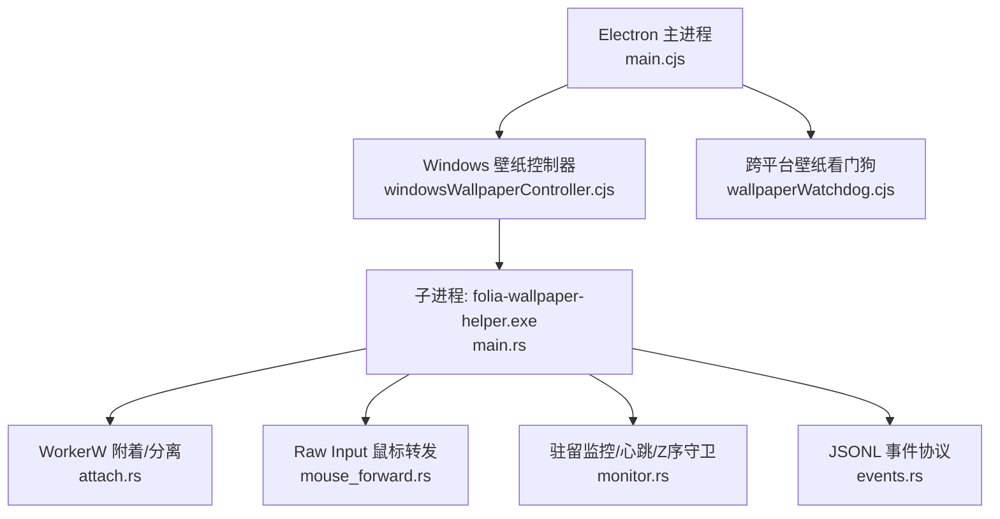
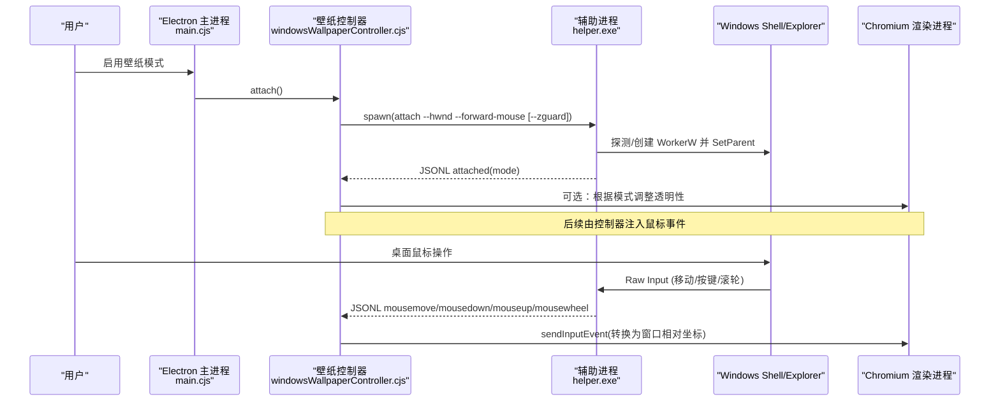
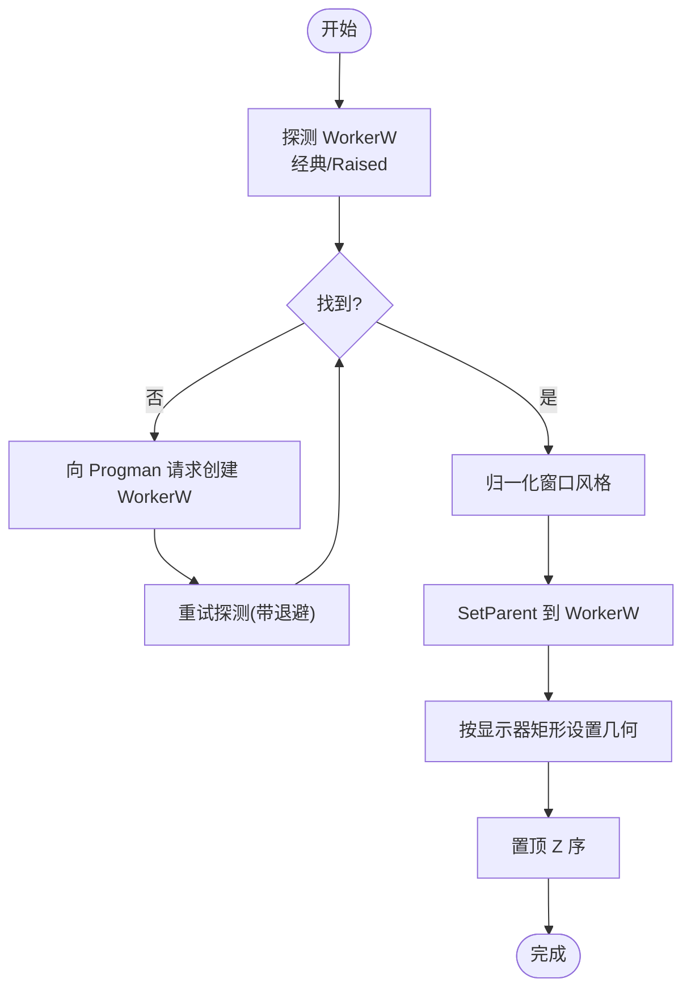
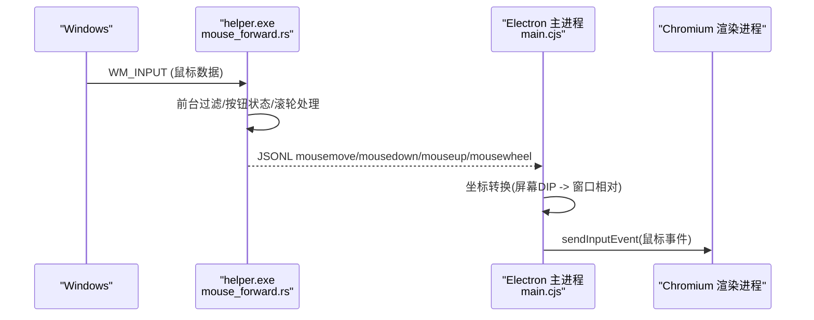
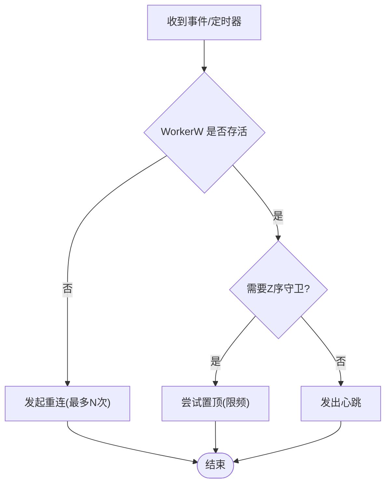
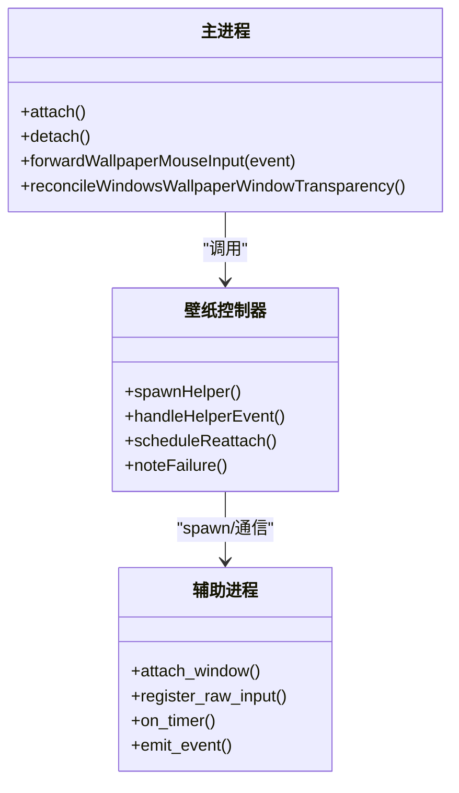
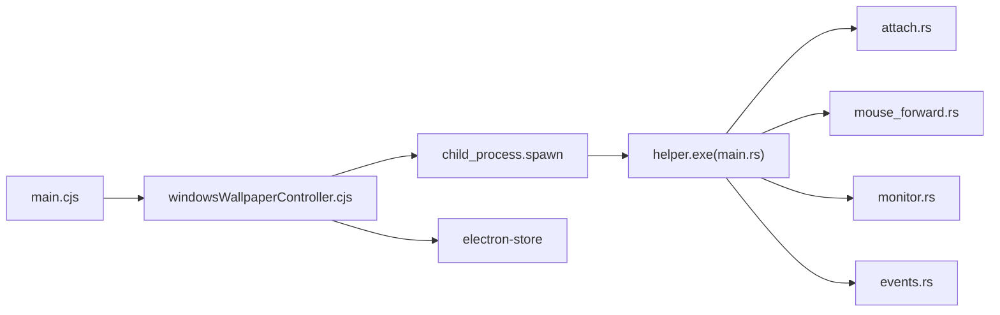

# Windows平台适配

<cite>
**本文引用的文件**
- [electron/main.cjs](file://electron/main.cjs)
- [electron/windowsWallpaperController.cjs](file://electron/windowsWallpaperController.cjs)
- [packaging/windows/wallpaper-helper/src/main.rs](file://packaging/windows/wallpaper-helper/src/main.rs)
- [packaging/windows/wallpaper-helper/src/attach.rs](file://packaging/windows/wallpaper-helper/src/attach.rs)
- [packaging/windows/wallpaper-helper/src/mouse_forward.rs](file://packaging/windows/wallpaper-helper/src/mouse_forward.rs)
- [packaging/windows/wallpaper-helper/src/monitor.rs](file://packaging/windows/wallpaper-helper/src/monitor.rs)
- [packaging/windows/wallpaper-helper/src/events.rs](file://packaging/windows/wallpaper-helper/src/events.rs)
- [packaging/windows/wallpaper-helper/Cargo.toml](file://packaging/windows/wallpaper-helper/Cargo.toml)
- [electron/wallpaperWatchdog.cjs](file://electron/wallpaperWatchdog.cjs)
</cite>

## 目录
1. [简介](#简介)
2. [项目结构](#项目结构)
3. [核心组件](#核心组件)
4. [架构总览](#架构总览)
5. [详细组件分析](#详细组件分析)
6. [依赖关系分析](#依赖关系分析)
7. [性能考量](#性能考量)
8. [故障排查指南](#故障排查指南)
9. [结论](#结论)
10. [附录](#附录)

## 简介
本文件聚焦 Folia Player 在 Windows 平台的适配实现，重点解析以下能力：
- WorkerW 父窗口机制与桌面壁纸模式（将主窗口嵌入到桌面图标层之下）
- 鼠标事件注入（通过 Raw Input 捕获桌面输入并转发至 Chromium 渲染进程）
- DPI 感知处理（几何尺寸使用物理像素，坐标保持 DIP）
- 与 Electron 主进程的协作、心跳监控、崩溃循环保护与自动重连
- 图形渲染优化思路（GPU/DirectX/WebGPU 的权衡与配置）
- 系统集成要点（任务栏、通知、文件关联、注册表等）
- 性能调优（内存、IPC、资源清理）
- 测试与调试方法（日志、监控、问题定位）

## 项目结构
Windows 壁纸模式由两部分组成：
- Electron 主进程侧：负责启动/管理辅助进程、解析 JSONL 事件、注入鼠标输入、维护状态机与降级策略。
- Rust 辅助进程（folia-wallpaper-helper.exe）：负责 WorkerW 探测与父子关系切换、Z序守卫、Raw Input 采集、心跳上报。

图表来源
- [electron/main.cjs:242-311](file://electron/main.cjs#L242-L311)
- [electron/windowsWallpaperController.cjs:41-70](file://electron/windowsWallpaperController.cjs#L41-L70)
- [packaging/windows/wallpaper-helper/src/main.rs:24-88](file://packaging/windows/wallpaper-helper/src/main.rs#L24-L88)
- [packaging/windows/wallpaper-helper/src/attach.rs:147-190](file://packaging/windows/wallpaper-helper/src/attach.rs#L147-L190)
- [packaging/windows/wallpaper-helper/src/mouse_forward.rs:103-132](file://packaging/windows/wallpaper-helper/src/mouse_forward.rs#L103-L132)
- [packaging/windows/wallpaper-helper/src/monitor.rs:69-90](file://packaging/windows/wallpaper-helper/src/monitor.rs#L69-L90)
- [packaging/windows/wallpaper-helper/src/events.rs:6-44](file://packaging/windows/wallpaper-helper/src/events.rs#L6-L44)
- [electron/wallpaperWatchdog.cjs:27-46](file://electron/wallpaperWatchdog.cjs#L27-L46)

章节来源
- [electron/main.cjs:242-311](file://electron/main.cjs#L242-L311)
- [electron/windowsWallpaperController.cjs:41-70](file://electron/windowsWallpaperController.cjs#L41-L70)
- [packaging/windows/wallpaper-helper/src/main.rs:24-88](file://packaging/windows/wallpaper-helper/src/main.rs#L24-L88)

## 核心组件
- Windows 壁纸控制器（CJS）：封装子进程生命周期、心跳超时、崩溃循环保护、重连调度、鼠标事件注入、透明窗口重建协调。
- 辅助进程（Rust）：实现 WorkerW 探测/附着、风格归一化、几何恢复、Z序守卫、Raw Input 采集、JSONL 事件输出。
- 事件协议（JSONL）：定义 attached/heartbeat/mousemove/mousedown/mouseup/mousewheel/error 等事件，作为主进程与辅助进程之间的契约。
- 跨平台壁纸看门狗：提供通用“崩溃循环保护”和“回退为普通窗口”的策略，Windows 路径复用其失败计数与降级思想。

章节来源
- [electron/windowsWallpaperController.cjs:41-70](file://electron/windowsWallpaperController.cjs#L41-L70)
- [packaging/windows/wallpaper-helper/src/events.rs:6-44](file://packaging/windows/wallpaper-helper/src/events.rs#L6-L44)
- [electron/wallpaperWatchdog.cjs:134-164](file://electron/wallpaperWatchdog.cjs#L134-L164)

## 架构总览
下图展示从用户启用壁纸模式到主窗口被嵌入 WorkerW 的完整流程，以及鼠标输入如何从系统 Raw Input 进入 Chromium 渲染层。

图表来源
- [electron/main.cjs:242-311](file://electron/main.cjs#L242-L311)
- [electron/windowsWallpaperController.cjs:259-353](file://electron/windowsWallpaperController.cjs#L259-L353)
- [packaging/windows/wallpaper-helper/src/main.rs:79-88](file://packaging/windows/wallpaper-helper/src/main.rs#L79-L88)
- [packaging/windows/wallpaper-helper/src/attach.rs:147-190](file://packaging/windows/wallpaper-helper/src/attach.rs#L147-L190)
- [packaging/windows/wallpaper-helper/src/mouse_forward.rs:103-132](file://packaging/windows/wallpaper-helper/src/mouse_forward.rs#L103-L132)
- [electron/main.cjs:325-400](file://electron/main.cjs#L325-L400)

## 详细组件分析

### WorkerW 附着与分离（attach.rs）
- 双架构探测：先尝试经典 WorkerW（Win10/早期 Win11），再尝试 Raised Desktop（Win11 24H2+）。
- 风格归一化：将 Electron 主窗口设置为子窗口样式，去除影响壁纸模式的扩展样式；分离时还原。
- 几何恢复：在物理像素上下文下计算目标显示器矩形，并设置到 WorkerW 客户区坐标。
- Z序置顶：确保 Folia 窗口位于 WorkerW 子树顶层，避免被其他壁纸软件覆盖。
- 安全陷阱：仅在不存在 WorkerW 时才向 Progman 发送私有消息以创建新 WorkerW，避免重复触发导致层级重建。

图表来源
- [packaging/windows/wallpaper-helper/src/attach.rs:50-119](file://packaging/windows/wallpaper-helper/src/attach.rs#L50-L119)
- [packaging/windows/wallpaper-helper/src/attach.rs:147-190](file://packaging/windows/wallpaper-helper/src/attach.rs#L147-L190)
- [packaging/windows/wallpaper-helper/src/attach.rs:226-298](file://packaging/windows/wallpaper-helper/src/attach.rs#L226-L298)

章节来源
- [packaging/windows/wallpaper-helper/src/attach.rs:50-119](file://packaging/windows/wallpaper-helper/src/attach.rs#L50-L119)
- [packaging/windows/wallpaper-helper/src/attach.rs:147-190](file://packaging/windows/wallpaper-helper/src/attach.rs#L147-L190)
- [packaging/windows/wallpaper-helper/src/attach.rs:226-298](file://packaging/windows/wallpaper-helper/src/attach.rs#L226-L298)

### 鼠标事件注入（mouse_forward.rs + main.cjs）
- 原始输入采集：通过 RegisterRawInputDevices 订阅鼠标，WM_INPUT 中读取 RAWINPUT。
- 前台过滤：仅当桌面处于前台（或图标层 WorkerW/Progman 在前台）时报告移动与滚轮；拖拽期间放宽限制以避免卡住按下态。
- 移动合并：约 60Hz 定时器合并移动事件，降低 IPC 压力。
- 主进程注入：将 96-DPI 虚拟屏幕坐标转换为窗口相对坐标后，通过 sendInputEvent 注入 Chromium，避免直接 PostMessage 导致的 TrackMouseEvent 抖动。
- 双击合成：基于时间戳与距离阈值合成 clickCount。

图表来源
- [packaging/windows/wallpaper-helper/src/mouse_forward.rs:103-132](file://packaging/windows/wallpaper-helper/src/mouse_forward.rs#L103-L132)
- [packaging/windows/wallpaper-helper/src/mouse_forward.rs:134-211](file://packaging/windows/wallpaper-helper/src/mouse_forward.rs#L134-L211)
- [packaging/windows/wallpaper-helper/src/mouse_forward.rs:213-260](file://packaging/windows/wallpaper-helper/src/mouse_forward.rs#L213-L260)
- [electron/main.cjs:325-400](file://electron/main.cjs#L325-L400)

章节来源
- [packaging/windows/wallpaper-helper/src/mouse_forward.rs:103-132](file://packaging/windows/wallpaper-helper/src/mouse_forward.rs#L103-L132)
- [packaging/windows/wallpaper-helper/src/mouse_forward.rs:134-211](file://packaging/windows/wallpaper-helper/src/mouse_forward.rs#L134-L211)
- [packaging/windows/wallpaper-helper/src/mouse_forward.rs:213-260](file://packaging/windows/wallpaper-helper/src/mouse_forward.rs#L213-L260)
- [electron/main.cjs:325-400](file://electron/main.cjs#L325-L400)

### 驻留监控与重连（monitor.rs）
- 事件钩子：监听 EVENT_OBJECT_DESTROY 与 EVENT_OBJECT_REORDER，检测 WorkerW 销毁与其他壁纸软件的 Z 序竞争。
- 任务栏重建：通过 TaskbarCreated 广播与 Shell_TrayWnd PID 变化判断 Explorer 重启，触发重连。
- 心跳：定时发出 heartbeat，供主进程看门狗判定存活。
- 重连线程：独立线程执行最多 N 次重试，避免阻塞消息循环。

图表来源
- [packaging/windows/wallpaper-helper/src/monitor.rs:69-90](file://packaging/windows/wallpaper-helper/src/monitor.rs#L69-L90)
- [packaging/windows/wallpaper-helper/src/monitor.rs:120-155](file://packaging/windows/wallpaper-helper/src/monitor.rs#L120-L155)
- [packaging/windows/wallpaper-helper/src/monitor.rs:157-201](file://packaging/windows/wallpaper-helper/src/monitor.rs#L157-L201)
- [packaging/windows/wallpaper-helper/src/monitor.rs:203-301](file://packaging/windows/wallpaper-helper/src/monitor.rs#L203-L301)

章节来源
- [packaging/windows/wallpaper-helper/src/monitor.rs:69-90](file://packaging/windows/wallpaper-helper/src/monitor.rs#L69-L90)
- [packaging/windows/wallpaper-helper/src/monitor.rs:120-155](file://packaging/windows/wallpaper-helper/src/monitor.rs#L120-L155)
- [packaging/windows/wallpaper-helper/src/monitor.rs:157-201](file://packaging/windows/wallpaper-helper/src/monitor.rs#L157-L201)
- [packaging/windows/wallpaper-helper/src/monitor.rs:203-301](file://packaging/windows/wallpaper-helper/src/monitor.rs#L203-L301)

### 事件协议（events.rs）
- 事件类型：attached/heartbeat/workerw-destroyed/explorer-restarted/reasserted/moved/detached/refreshed/mousemove/mousedown/mouseup/mousewheel/error。
- 错误分类：kind 字段用于区分结构性错误（如 window-destroyed），主进程据此决定是否需要重建窗口。
- 序列化：纯字符串构建，便于跨平台单元测试。

章节来源
- [packaging/windows/wallpaper-helper/src/events.rs:6-44](file://packaging/windows/wallpaper-helper/src/events.rs#L6-L44)
- [packaging/windows/wallpaper-helper/src/events.rs:89-140](file://packaging/windows/wallpaper-helper/src/events.rs#L89-L140)

### 主进程集成与控制流（main.cjs + windowsWallpaperController.cjs）
- 启动辅助进程：传入 --hwnd/--forward-mouse/--zguard，建立 stdout JSONL 管道。
- 心跳看门狗：周期性检查 lastEventAt，超时则终止并尝试重连。
- 崩溃循环保护：记录失败次数，超过阈值禁用壁纸模式并回调 onDegrade。
- 鼠标注入：将 helper 报告的 96-DPI 坐标转为窗口相对坐标，调用 sendInputEvent。
- 透明性协调：raised 模式支持透明，classic 模式需重建为不透明窗口。

图表来源
- [electron/main.cjs:242-311](file://electron/main.cjs#L242-L311)
- [electron/main.cjs:325-400](file://electron/main.cjs#L325-L400)
- [electron/windowsWallpaperController.cjs:41-70](file://electron/windowsWallpaperController.cjs#L41-L70)
- [electron/windowsWallpaperController.cjs:207-257](file://electron/windowsWallpaperController.cjs#L207-L257)
- [electron/windowsWallpaperController.cjs:259-353](file://electron/windowsWallpaperController.cjs#L259-L353)

章节来源
- [electron/main.cjs:242-311](file://electron/main.cjs#L242-L311)
- [electron/main.cjs:325-400](file://electron/main.cjs#L325-L400)
- [electron/windowsWallpaperController.cjs:207-257](file://electron/windowsWallpaperController.cjs#L207-L257)
- [electron/windowsWallpaperController.cjs:259-353](file://electron/windowsWallpaperController.cjs#L259-L353)

## 依赖关系分析
- 辅助进程依赖 Windows SDK（windows-rs crate），仅 cfg(windows) 编译，保证非 Windows 环境可运行测试。
- 主进程依赖 electron-store 持久化失败计数与模式开关；依赖 child_process 启动辅助进程。
- 事件协议是双方唯一耦合点，变更需同步更新解析与序列化逻辑。

图表来源
- [packaging/windows/wallpaper-helper/Cargo.toml:1-26](file://packaging/windows/wallpaper-helper/Cargo.toml#L1-L26)
- [electron/windowsWallpaperController.cjs:41-70](file://electron/windowsWallpaperController.cjs#L41-L70)
- [electron/main.cjs:242-311](file://electron/main.cjs#L242-L311)

章节来源
- [packaging/windows/wallpaper-helper/Cargo.toml:1-26](file://packaging/windows/wallpaper-helper/Cargo.toml#L1-L26)
- [electron/windowsWallpaperController.cjs:41-70](file://electron/windowsWallpaperController.cjs#L41-L70)

## 性能考量
- 鼠标事件合并：约 60Hz 合并移动事件，降低 IPC 与渲染压力，避免高频抖动。
- 前台过滤：仅在桌面前台转发移动与滚轮，减少无效事件。
- DPI 处理：几何计算使用物理像素，坐标保持 DIP，避免缩放导致的偏移。
- GPU/推理后端：
  - 视频源释放：启用 ReleaseVideoSourceProviderIfNotInUse 以减少空闲占用。
  - macOS 特定优化（参考）：忽略 GPU 黑名单、使用 GL、启用 GPU 光栅化；Windows 上建议关注 DirectML/WebGPU 选择与内存模式开关，避免高 VRAM 占用与长时推理阻塞 UI。
- 资源清理：辅助进程退出时刷新桌面壁纸并失效 WorkerW 区域，防止残留帧。

章节来源
- [electron/main.cjs:128-137](file://electron/main.cjs#L128-L137)
- [packaging/windows/wallpaper-helper/src/mouse_forward.rs:40-44](file://packaging/windows/wallpaper-helper/src/mouse_forward.rs#L40-L44)
- [packaging/windows/wallpaper-helper/src/attach.rs:226-243](file://packaging/windows/wallpaper-helper/src/attach.rs#L226-L243)
- [packaging/windows/wallpaper-helper/src/attach.rs:214-224](file://packaging/windows/wallpaper-helper/src/attach.rs#L214-L224)

## 故障排查指南
- 常见症状与定位
  - 无法附着：检查 Progman/WorkerW 是否存在，确认 attach_window 返回值与错误信息。
  - 鼠标无响应：确认 forward_mouse 已启用，前台过滤条件满足，sendInputEvent 参数正确。
  - 频繁崩溃/重连：查看心跳超时与失败计数，必要时触发降级。
  - 透明黑屏：classic 模式下需重建为不透明窗口；raised 模式才支持透明。
- 日志与调试
  - 辅助进程 stderr/stdout JSONL 事件是主要诊断来源。
  - 主进程日志包含 spawn/attach/reattach/kill 等关键节点。
  - 使用环境变量覆盖二进制路径（FOLIA_WALLPAPER_HELPER_PATH）进行本地调试。
- 恢复策略
  - 自动重连：monitor 会多次尝试重新附着。
  - 降级：连续失败达到阈值后禁用壁纸模式，交由上层恢复。

章节来源
- [electron/windowsWallpaperController.cjs:99-128](file://electron/windowsWallpaperController.cjs#L99-L128)
- [electron/windowsWallpaperController.cjs:147-172](file://electron/windowsWallpaperController.cjs#L147-L172)
- [packaging/windows/wallpaper-helper/src/monitor.rs:236-301](file://packaging/windows/wallpaper-helper/src/monitor.rs#L236-L301)
- [electron/main.cjs:282-311](file://electron/main.cjs#L282-L311)

## 结论
Folia Player 的 Windows 壁纸模式通过独立的 Rust 辅助进程实现了稳定的 WorkerW 附着、鼠标输入转发与健壮的重连机制。主进程侧提供心跳监控、崩溃循环保护与渲染优化协调。该设计在保证交互体验的同时，兼顾了不同 Windows 版本与多壁纸软件共存场景下的稳定性。

## 附录
- 关键设置键
  - wallpaper_mode：是否启用壁纸模式
  - wallpaper_forward_mouse：是否转发鼠标输入
  - wallpaper_zguard：是否启用 Z 序守卫
  - wallpaper_windows_attach_mode：上次附着模式（classic/raised）
- 环境变量
  - FOLIA_WALLPAPER_HELPER_PATH：覆盖辅助进程路径
  - FOLIA_WINDOWTOLAYER_PATH：Linux/Wayland 包装器路径（与 Windows 无关）
- 相关命令
  - helper.exe attach --hwnd <n> [--forward-mouse] [--zguard]
  - helper.exe detach --hwnd <n>
  - helper.exe refresh
  - helper.exe move --hwnd <n>

章节来源
- [electron/main.cjs:145-163](file://electron/main.cjs#L145-L163)
- [electron/main.cjs:282-311](file://electron/main.cjs#L282-L311)
- [packaging/windows/wallpaper-helper/src/main.rs:24-37](file://packaging/windows/wallpaper-helper/src/main.rs#L24-L37)