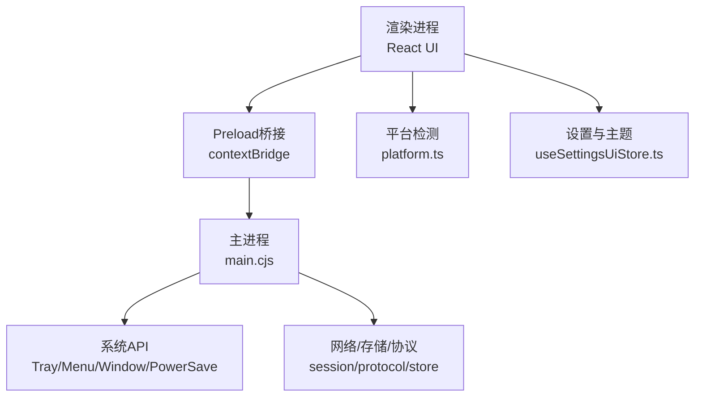
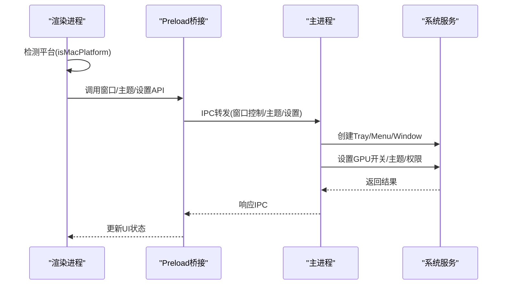
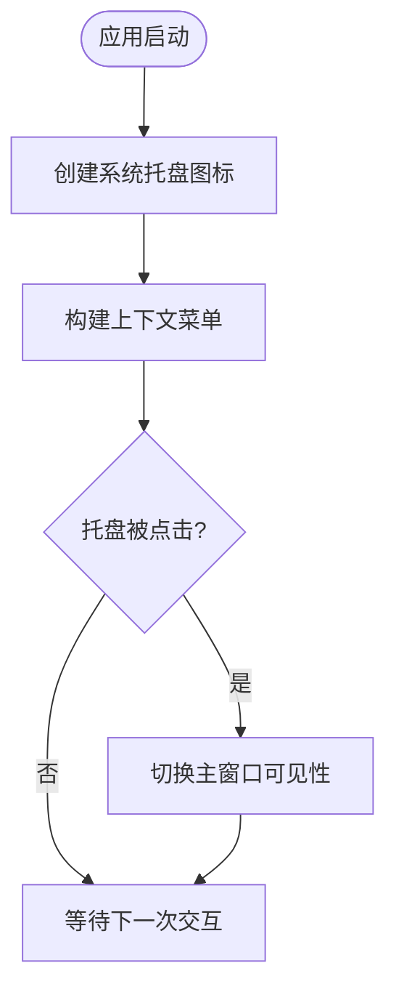
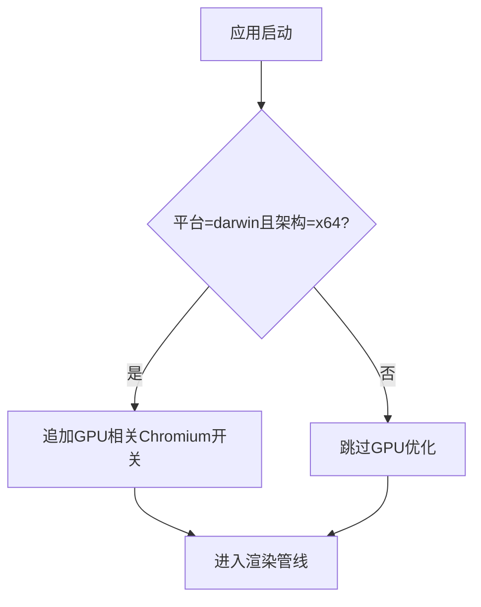
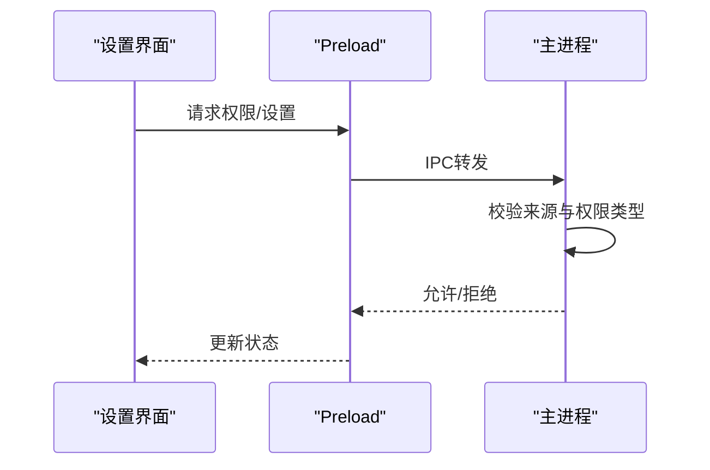
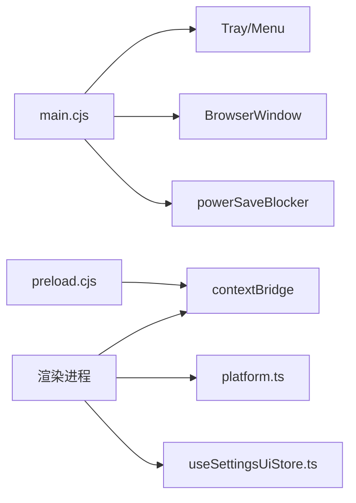

# macOS平台适配

<cite>
**本文引用的文件**
- [electron/main.cjs](file://electron/main.cjs)
- [electron/preload.cjs](file://electron/preload.cjs)
- [src/utils/platform.ts](file://src/utils/platform.ts)
- [electron/displaySleepBlocker.cjs](file://electron/displaySleepBlocker.cjs)
- [electron/voiceInputPause.cjs](file://electron/voiceInputPause.cjs)
- [electron/modSystem/exportService.cjs](file://electron/modSystem/exportService.cjs)
- [src/stores/useSettingsUiStore.ts](file://src/stores/useSettingsUiStore.ts)
- [src/components/modal/settings/DesktopSettingsSubview.tsx](file://src/components/modal/settings/DesktopSettingsSubview.tsx)
</cite>

## 目录
1. [简介](#简介)
2. [项目结构](#项目结构)
3. [核心组件](#核心组件)
4. [架构总览](#架构总览)
5. [详细组件分析](#详细组件分析)
6. [依赖关系分析](#依赖关系分析)
7. [性能考量](#性能考量)
8. [故障排查指南](#故障排查指南)
9. [结论](#结论)
10. [附录](#附录)

## 简介
本文件面向Folia Player在macOS平台的适配与优化，聚焦以下方面：
- 菜单栏与Dock集成（系统托盘、窗口控制、主题跟随）
- 图形渲染优化（GPU加速开关、Intel Mac + AMD独显的卡顿缓解策略）
- 系统集成特性（权限模型、媒体会话、显示休眠控制等）
- 性能优化（内存、电池、后台任务）
- 测试与调试（Xcode/控制台日志、性能分析建议）

说明：本项目基于Electron构建跨平台桌面应用。macOS相关能力主要通过Electron API实现；部分平台专属功能（如壁纸模式、Windows麦克风监听）不在macOS启用。

## 项目结构
与macOS适配直接相关的代码主要分布在：
- Electron主进程：启动参数、菜单/托盘、窗口属性、权限处理、更新与代理等
- Preload桥接：向渲染进程暴露安全API（平台信息、设置、窗口控制、主题等）
- 渲染层：平台检测、设置UI、主题跟随系统明暗

图表来源
- [electron/main.cjs:1-137](file://electron/main.cjs#L1-L137)
- [electron/preload.cjs:1-150](file://electron/preload.cjs#L1-L150)
- [src/utils/platform.ts:1-24](file://src/utils/platform.ts#L1-L24)
- [src/stores/useSettingsUiStore.ts:2561-2583](file://src/stores/useSettingsUiStore.ts#L2561-L2583)

章节来源
- [electron/main.cjs:1-137](file://electron/main.cjs#L1-L137)
- [electron/preload.cjs:1-150](file://electron/preload.cjs#L1-L150)
- [src/utils/platform.ts:1-24](file://src/utils/platform.ts#L1-L24)
- [src/stores/useSettingsUiStore.ts:2561-2583](file://src/stores/useSettingsUiStore.ts#L2561-L2583)

## 核心组件
- 平台检测与快捷键映射：统一判断是否为macOS，并将“Ctrl”语义映射为Cmd键提示与事件处理
- 菜单栏/托盘与窗口控制：创建系统托盘图标与菜单，提供最小化/最大化/全屏/关闭等能力
- 主题跟随系统：支持跟随系统明暗模式并同步到原生主题
- GPU加速与渲染优化：针对Intel Mac + AMD独显场景开启特定Chromium开关以缓解Retina下卡顿
- 显示休眠阻止：播放期间阻止屏幕休眠，提升体验
- 权限与安全：集中处理文件系统、字体、剪贴板、音频媒体等权限请求

章节来源
- [src/utils/platform.ts:1-24](file://src/utils/platform.ts#L1-L24)
- [electron/main.cjs:809-866](file://electron/main.cjs#L809-L866)
- [electron/main.cjs:1500-1522](file://electron/main.cjs#L1500-L1522)
- [electron/main.cjs:1557-1672](file://electron/main.cjs#L1557-L1672)
- [electron/displaySleepBlocker.cjs:1-25](file://electron/displaySleepBlocker.cjs#L1-L25)
- [src/stores/useSettingsUiStore.ts:2561-2583](file://src/stores/useSettingsUiStore.ts#L2561-L2583)

## 架构总览
下图展示macOS适配的关键交互路径：渲染层通过平台检测决定UI行为；通过preload调用主进程能力；主进程负责系统级能力（托盘、窗口、主题、权限、GPU开关）。

图表来源
- [electron/main.cjs:128-137](file://electron/main.cjs#L128-L137)
- [electron/main.cjs:809-866](file://electron/main.cjs#L809-L866)
- [electron/preload.cjs:135-150](file://electron/preload.cjs#L135-L150)
- [src/utils/platform.ts:1-24](file://src/utils/platform.ts#L1-L24)

## 详细组件分析

### 菜单栏与Dock集成（托盘、窗口控制、主题跟随）
- 托盘图标与菜单：在macOS上优先使用模板图标（单色、透明背景），并加载@2x资源以适配Retina；点击托盘可切换主窗口可见性
- 窗口控制：提供最小化、最大化、全屏、关闭等能力，便于Dock/菜单栏操作
- 主题跟随系统：当用户选择“跟随系统”时，将原生主题设置为system；否则根据偏好设置为light/dark

图表来源
- [electron/main.cjs:809-866](file://electron/main.cjs#L809-L866)
- [electron/main.cjs:1500-1522](file://electron/main.cjs#L1500-L1522)

章节来源
- [electron/main.cjs:809-866](file://electron/main.cjs#L809-L866)
- [electron/main.cjs:1500-1522](file://electron/main.cjs#L1500-L1522)
- [src/stores/useSettingsUiStore.ts:2561-2583](file://src/stores/useSettingsUiStore.ts#L2561-L2583)

### 图形渲染优化（Metal/GPU加速与Intel+AMD卡顿缓解）
- 针对Intel Mac + AMD独立显卡在Retina屏下的渲染卡顿问题，主进程在启动时追加Chromium开关：忽略GPU黑名单、使用ANGLE GL后端、启用GPU光栅化
- 这些开关有助于规避某些驱动/合成器路径上的兼容性问题，改善高DPI下的帧率与掉帧现象
- 注意：该优化仅在darwin且x64架构下生效

图表来源
- [electron/main.cjs:128-137](file://electron/main.cjs#L128-L137)

章节来源
- [electron/main.cjs:128-137](file://electron/main.cjs#L128-L137)

### 系统集成特性（权限、媒体会话、显示休眠）
- 权限管理：集中处理文件系统、字体访问、剪贴板写入、扬声器选择、音频媒体等权限请求，仅对受信任的主窗口内容放行
- 显示休眠阻止：播放期间阻止屏幕休眠，避免长时间播放时被锁屏打断
- 媒体会话：通过预加载桥接暴露媒体控制接口，便于系统与第三方工具（如OBS、遥控窗口）协作

图表来源
- [electron/main.cjs:1557-1672](file://electron/main.cjs#L1557-L1672)
- [electron/preload.cjs:135-150](file://electron/preload.cjs#L135-L150)

章节来源
- [electron/main.cjs:1557-1672](file://electron/main.cjs#L1557-L1672)
- [electron/displaySleepBlocker.cjs:1-25](file://electron/displaySleepBlocker.cjs#L1-L25)
- [electron/preload.cjs:135-150](file://electron/preload.cjs#L135-L150)

### 平台检测与快捷键映射
- 使用navigator.userAgent判断是否macOS，统一处理“Ctrl”语义为Cmd，并在UI中显示正确的修饰键提示
- 保证键盘快捷键在不同平台的一致性

章节来源
- [src/utils/platform.ts:1-24](file://src/utils/platform.ts#L1-L24)

### 桌面设置与平台特性开关
- 桌面端设置项包含托盘行为、自动隐藏任务栏图标、最小化到托盘、开机自启等；这些选项在macOS上同样适用（除平台专属功能外）
- 壁纸模式在macOS未实现，因此相关入口会被屏蔽

章节来源
- [src/components/modal/settings/DesktopSettingsSubview.tsx:156-175](file://src/components/modal/settings/DesktopSettingsSubview.tsx#L156-L175)

## 依赖关系分析
- 主进程依赖Electron模块（app、BrowserWindow、Tray、nativeImage、powerSaveBlocker等）
- Preload通过contextBridge向渲染进程暴露受限API集合
- 渲染进程通过平台检测与设置库协调UI与系统行为

图表来源
- [electron/main.cjs:1-137](file://electron/main.cjs#L1-L137)
- [electron/preload.cjs:1-150](file://electron/preload.cjs#L1-L150)
- [src/utils/platform.ts:1-24](file://src/utils/platform.ts#L1-L24)
- [src/stores/useSettingsUiStore.ts:2561-2583](file://src/stores/useSettingsUiStore.ts#L2561-L2583)

章节来源
- [electron/main.cjs:1-137](file://electron/main.cjs#L1-L137)
- [electron/preload.cjs:1-150](file://electron/preload.cjs#L1-L150)
- [src/utils/platform.ts:1-24](file://src/utils/platform.ts#L1-L24)
- [src/stores/useSettingsUiStore.ts:2561-2583](file://src/stores/useSettingsUiStore.ts#L2561-L2583)

## 性能考量
- GPU加速与渲染路径：在Intel Mac + AMD独显环境下启用特定Chromium开关，减少高DPI渲染卡顿
- 内存与计算：分析侧推理模块在非GPU路径上保持CPU执行以避免抢占GPU资源；此策略适用于多任务并发场景
- 电池与功耗：播放期间阻止屏幕休眠可减少中断；合理控制动画与后台任务可降低能耗
- 导出与像素格式：在macOS导出时使用rgba像素格式，确保Alpha通道正确

章节来源
- [electron/main.cjs:128-137](file://electron/main.cjs#L128-L137)
- [electron/analysis/worker.cjs:48-174](file://electron/analysis/worker.cjs#L48-L174)
- [electron/modSystem/exportService.cjs:195-195](file://electron/modSystem/exportService.cjs#L195-L195)

## 故障排查指南
- 托盘图标异常：检查模板图标是否存在及@2x资源是否正确打包；确认Tray创建流程无异常
- 主题不跟随系统：确认“跟随系统”已启用，且主进程成功设置原生主题
- 播放时屏幕休眠：确认显示休眠阻止功能已激活，且在播放生命周期内保持active
- 权限被拒绝：检查权限请求来源是否为主窗口，以及权限类型是否在白名单内
- Windows麦克风监听：该功能仅在Windows平台启用，macOS不适用

章节来源
- [electron/main.cjs:809-866](file://electron/main.cjs#L809-L866)
- [electron/main.cjs:1500-1522](file://electron/main.cjs#L1500-L1522)
- [electron/displaySleepBlocker.cjs:1-25](file://electron/displaySleepBlocker.cjs#L1-L25)
- [electron/main.cjs:1557-1672](file://electron/main.cjs#L1557-L1672)
- [electron/voiceInputPause.cjs:107-112](file://electron/voiceInputPause.cjs#L107-L112)

## 结论
Folia Player在macOS平台的适配围绕Electron提供的系统能力展开：通过托盘与窗口控制实现原生体验，利用GPU相关Chromium开关缓解特定硬件组合下的渲染问题，并通过权限与显示休眠控制保障播放稳定性。对于Spotlight、Quick Look、AirDrop、iCloud等深度系统集成，当前仓库未见直接实现；如需扩展，可在主进程中结合macOS原生框架或外部工具链进行集成。

## 附录
- 常用调试入口
  - 控制台日志：通过开发者工具查看渲染进程日志；主进程日志可通过控制台输出定位
  - 性能分析：使用Xcode Instruments或Chrome DevTools Performance面板分析帧率与内存占用
  - 主题与平台：在设置中切换明暗模式并观察原生主题变化；通过平台检测验证快捷键提示
- 注意事项
  - 壁纸模式在macOS未实现，相关设置将被屏蔽
  - Windows麦克风监听仅在Windows平台启用