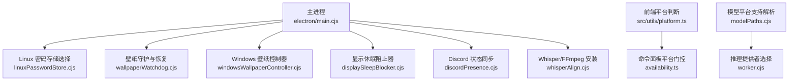
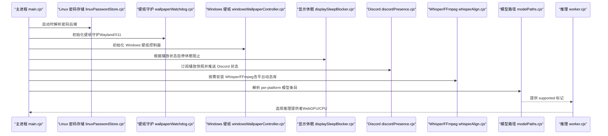
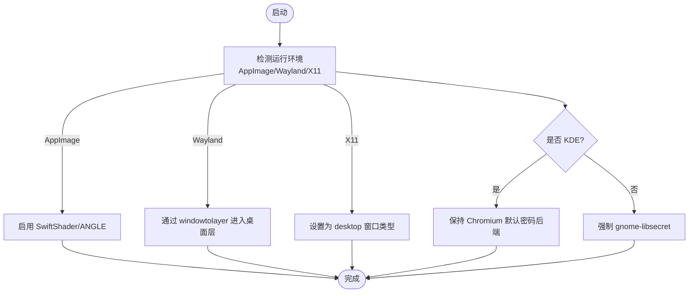
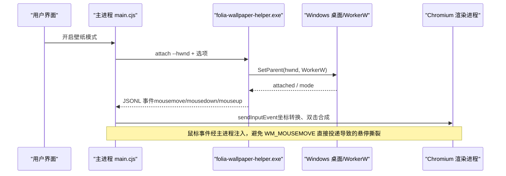
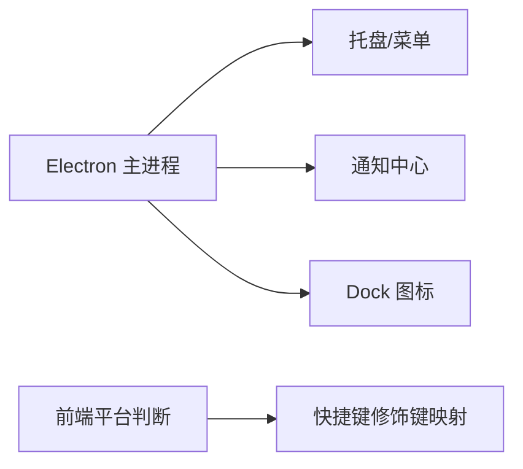
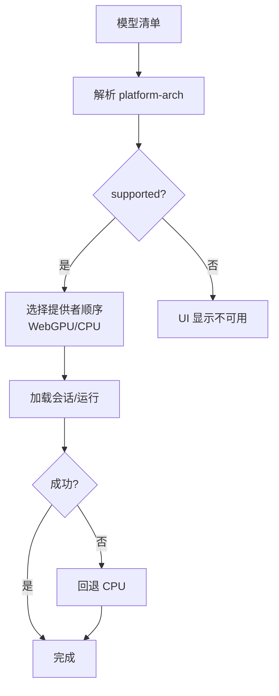
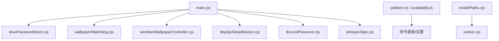

# 跨平台兼容性

<cite>
**本文引用的文件**
- [electron/main.cjs](file://electron/main.cjs)
- [electron/windowsWallpaperController.cjs](file://electron/windowsWallpaperController.cjs)
- [electron/wallpaperWatchdog.cjs](file://electron/wallpaperWatchdog.cjs)
- [electron/linuxPasswordStore.cjs](file://electron/linuxPasswordStore.cjs)
- [packaging/linux/build-windowtolayer.mjs](file://packaging/linux/build-windowtolayer.mjs)
- [src/utils/platform.ts](file://src/utils/platform.ts)
- [src/components/command-palette/availability.ts](file://src/components/command-palette/availability.ts)
- [electron/discordPresence.cjs](file://electron/discordPresence.cjs)
- [electron/displaySleepBlocker.cjs](file://electron/displaySleepBlocker.cjs)
- [electron/whisperAlign.cjs](file://electron/whisperAlign.cjs)
- [electron/analysis/modelPaths.cjs](file://electron/analysis/modelPaths.cjs)
- [electron/analysis/worker.cjs](file://electron/analysis/worker.cjs)
- [docs/automix-memory-optimization.md](file://docs/automix-memory-optimization.md)
</cite>

## 目录
1. [简介](#简介)
2. [项目结构](#项目结构)
3. [核心组件](#核心组件)
4. [架构总览](#架构总览)
5. [详细组件分析](#详细组件分析)
6. [依赖关系分析](#依赖关系分析)
7. [性能考量](#性能考量)
8. [故障排查指南](#故障排查指南)
9. [结论](#结论)
10. [附录](#附录)

## 简介
本文件系统性梳理 Folia Player 在 Windows、macOS、Linux 三大平台的跨平台兼容实现，覆盖系统 API 调用、文件系统操作、图形渲染与桌面集成等关键维度。重点说明：
- Linux 的 AppImage 运行时检测、Wayland/X11 环境识别、密码存储后端选择等特性；
- Windows 的桌面壁纸模式（WorkerW 父窗口机制、鼠标事件注入、DPI 感知）；
- macOS 的系统集成（菜单栏、通知中心、Dock 图标等）；
- 各平台 GPU 加速、内存管理与 I/O 优化策略；
- 平台兼容性测试与质量保证建议。

## 项目结构
Folia Player 基于 Electron 构建，主进程逻辑集中在 electron 目录，前端能力位于 src，平台特定二进制与打包脚本位于 packaging。跨平台适配的关键点包括：
- 启动期命令行参数与特性开关（如 Vulkan、Wayland、ANGLE/SwiftShader）；
- 平台特定的子系统控制器（Windows 壁纸助手、Linux 密码存储、macOS 系统集成）；
- 资源与模型按平台分发（manifest 中 per-platform 条目）。

**图示来源**
- [electron/main.cjs:78-137](file://electron/main.cjs#L78-L137)
- [electron/linuxPasswordStore.cjs:34-47](file://electron/linuxPasswordStore.cjs#L34-L47)
- [electron/wallpaperWatchdog.cjs:15-25](file://electron/wallpaperWatchdog.cjs#L15-L25)
- [electron/windowsWallpaperController.cjs:41-70](file://electron/windowsWallpaperController.cjs#L41-L70)
- [electron/displaySleepBlocker.cjs:1-25](file://electron/displaySleepBlocker.cjs#L1-L25)
- [electron/discordPresence.cjs:103-141](file://electron/discordPresence.cjs#L103-L141)
- [electron/whisperAlign.cjs:1568-1814](file://electron/whisperAlign.cjs#L1568-L1814)
- [src/utils/platform.ts:1-25](file://src/utils/platform.ts#L1-L25)
- [src/components/command-palette/availability.ts:1-56](file://src/components/command-palette/availability.ts#L1-L56)
- [electron/analysis/modelPaths.cjs:82-104](file://electron/analysis/modelPaths.cjs#L82-L104)
- [electron/analysis/worker.cjs:48-84](file://electron/analysis/worker.cjs#L48-L84)

**章节来源**
- [electron/main.cjs:78-137](file://electron/main.cjs#L78-L137)
- [electron/linuxPasswordStore.cjs:34-47](file://electron/linuxPasswordStore.cjs#L34-L47)
- [electron/wallpaperWatchdog.cjs:15-25](file://electron/wallpaperWatchdog.cjs#L15-L25)
- [electron/windowsWallpaperController.cjs:41-70](file://electron/windowsWallpaperController.cjs#L41-L70)
- [electron/displaySleepBlocker.cjs:1-25](file://electron/displaySleepBlocker.cjs#L1-L25)
- [electron/discordPresence.cjs:103-141](file://electron/discordPresence.cjs#L103-L141)
- [electron/whisperAlign.cjs:1568-1814](file://electron/whisperAlign.cjs#L1568-L1814)
- [src/utils/platform.ts:1-25](file://src/utils/platform.ts#L1-L25)
- [src/components/command-palette/availability.ts:1-56](file://src/components/command-palette/availability.ts#L1-L56)
- [electron/analysis/modelPaths.cjs:82-104](file://electron/analysis/modelPaths.cjs#L82-L104)
- [electron/analysis/worker.cjs:48-84](file://electron/analysis/worker.cjs#L48-L84)

## 核心组件
- 启动期平台适配与图形栈配置：根据平台与环境变量设置 Chromium 行为（Vulkan、Wayland、ANGLE/SwiftShader），保障在不同桌面环境与发行版上的稳定性。
- Linux 密码存储后端选择：在非 KDE 环境下显式启用 gnome-libsecret，避免明文回退导致登录态丢失。
- 壁纸模式（Linux Wayland/X11）：通过 windowtolayer 将窗口沉入桌面层，配合 watchdog 进行存活探测与异常恢复。
- 壁纸模式（Windows）：通过 folia-wallpaper-helper.exe 将主窗口挂到 WorkerW 层，并注入鼠标事件以模拟点击穿透交互。
- 显示休眠阻止：播放期间阻止屏幕休眠，提升用户体验。
- Discord Rich Presence：在主进程维护播放状态，跨平台一致地更新 Discord 客户端。
- Whisper/FFmpeg 自动安装：按平台复制所需动态库并设置执行权限，确保语音对齐与媒体处理可用。
- 模型平台支持与推理提供者选择：按 platform-arch 匹配可下载项，并在 worker 中选择 WebGPU/CPU 等提供者。

**章节来源**
- [electron/main.cjs:78-137](file://electron/main.cjs#L78-L137)
- [electron/linuxPasswordStore.cjs:34-47](file://electron/linuxPasswordStore.cjs#L34-L47)
- [electron/wallpaperWatchdog.cjs:15-25](file://electron/wallpaperWatchdog.cjs#L15-L25)
- [electron/windowsWallpaperController.cjs:41-70](file://electron/windowsWallpaperController.cjs#L41-L70)
- [electron/displaySleepBlocker.cjs:1-25](file://electron/displaySleepBlocker.cjs#L1-L25)
- [electron/discordPresence.cjs:103-141](file://electron/discordPresence.cjs#L103-L141)
- [electron/whisperAlign.cjs:1568-1814](file://electron/whisperAlign.cjs#L1568-L1814)
- [electron/analysis/modelPaths.cjs:82-104](file://electron/analysis/modelPaths.cjs#L82-L104)
- [electron/analysis/worker.cjs:48-84](file://electron/analysis/worker.cjs#L48-L84)

## 架构总览
下图展示主进程与各平台适配模块的协作关系，以及前端对平台能力的门控。

**图示来源**
- [electron/main.cjs:78-137](file://electron/main.cjs#L78-L137)
- [electron/linuxPasswordStore.cjs:34-47](file://electron/linuxPasswordStore.cjs#L34-L47)
- [electron/wallpaperWatchdog.cjs:15-25](file://electron/wallpaperWatchdog.cjs#L15-L25)
- [electron/windowsWallpaperController.cjs:41-70](file://electron/windowsWallpaperController.cjs#L41-L70)
- [electron/displaySleepBlocker.cjs:1-25](file://electron/displaySleepBlocker.cjs#L1-L25)
- [electron/discordPresence.cjs:103-141](file://electron/discordPresence.cjs#L103-L141)
- [electron/whisperAlign.cjs:1568-1814](file://electron/whisperAlign.cjs#L1568-L1814)
- [electron/analysis/modelPaths.cjs:82-104](file://electron/analysis/modelPaths.cjs#L82-L104)
- [electron/analysis/worker.cjs:48-84](file://electron/analysis/worker.cjs#L48-L84)

## 详细组件分析

### Linux 平台适配
- AppImage 运行时检测：通过环境变量 APPIMAGE/APPDIR 或调试标志识别 AppImage 环境，用于后续图形栈选择。
- Wayland/X11 环境识别：依据 WAYLAND_DISPLAY 是否存在区分 Wayland 与 X11；X11 下使用 desktop 类型窗口，Wayland 下通过 windowtolayer 进入 wlr-layer-shell。
- 密码存储后端选择：非 KDE 桌面显式启用 gnome-libsecret，避免 basic_text 明文回退导致的登录态丢失。
- 图形栈调优：禁用 Vulkan，必要时启用 SwiftShader（AppImage）或软件渲染，保证模糊/透明度与 GPU 崩溃问题得到缓解。

**图示来源**
- [electron/main.cjs:29-36](file://electron/main.cjs#L29-L36)
- [electron/main.cjs:78-105](file://electron/main.cjs#L78-L105)
- [electron/linuxPasswordStore.cjs:34-47](file://electron/linuxPasswordStore.cjs#L34-L47)
- [packaging/linux/build-windowtolayer.mjs:1-24](file://packaging/linux/build-windowtolayer.mjs#L1-L24)

**章节来源**
- [electron/main.cjs:29-36](file://electron/main.cjs#L29-L36)
- [electron/main.cjs:78-105](file://electron/main.cjs#L78-L105)
- [electron/linuxPasswordStore.cjs:34-47](file://electron/linuxPasswordStore.cjs#L34-L47)
- [packaging/linux/build-windowtolayer.mjs:1-24](file://packaging/linux/build-windowtolayer.mjs#L1-L24)

### Windows 平台：桌面壁纸模式
- WorkerW 父窗口机制：通过 folia-wallpaper-helper.exe 将主窗口 parent 到 WorkerW，使其成为桌面背景的一部分。
- 鼠标事件注入：helper 上报原始鼠标事件，主进程将其转换为 Chromium 输入事件注入到渲染进程，避免 TrackMouseEvent 导致的悬停撕裂。
- DPI 感知：helper 线程 DPI 上下文切换，几何重设时使用物理 DPI，确保在不同缩放比例下正确填充显示器区域。
- 透明性与重建：经典模式（Win10/早期 Win11）需不透明窗口；raised 模式（Win11 24H2+）支持透明。切换模式时重建窗口以保持边框与内容一致性。

**图示来源**
- [electron/main.cjs:242-451](file://electron/main.cjs#L242-L451)
- [electron/windowsWallpaperController.cjs:207-257](file://electron/windowsWallpaperController.cjs#L207-L257)
- [packaging/windows/wallpaper-helper/src/attach.rs:232-264](file://packaging/windows/wallpaper-helper/src/attach.rs#L232-L264)

**章节来源**
- [electron/main.cjs:242-451](file://electron/main.cjs#L242-L451)
- [electron/windowsWallpaperController.cjs:207-257](file://electron/windowsWallpaperController.cjs#L207-L257)
- [packaging/windows/wallpaper-helper/src/attach.rs:232-264](file://packaging/windows/wallpaper-helper/src/attach.rs#L232-L264)

### macOS 平台：系统集成
- 菜单栏/托盘与通知：Electron 原生能力可用于创建菜单栏、托盘菜单与通知中心消息；本项目在主进程中集成托盘与相关功能入口。
- Dock 图标：Electron 应用默认具备 Dock 图标；可通过 native 能力控制可见性。
- 快捷键与修饰键：前端统一通过平台判断将 ctrl 映射为 Cmd（macOS）或 Ctrl（其他平台），保证快捷键提示与行为一致。

**图示来源**
- [electron/main.cjs:1-20](file://electron/main.cjs#L1-L20)
- [src/utils/platform.ts:1-25](file://src/utils/platform.ts#L1-L25)

**章节来源**
- [electron/main.cjs:1-20](file://electron/main.cjs#L1-L20)
- [src/utils/platform.ts:1-25](file://src/utils/platform.ts#L1-L25)

### 跨平台推理与模型管理
- 模型平台支持：manifest 中的 per-platform 条目按 platform-arch 解析，返回 supported 标记供 UI 展示与决策。
- 推理提供者选择：worker 内按模型设定优先级尝试 WebGPU/CPU 等提供者，失败则回退 CPU，保证弱机可用性。
- 内存优化：htdemucs 推理迁移至 Python sidecar，关闭 ORT 内存复用，显著降低峰值内存占用。

**图示来源**
- [electron/analysis/modelPaths.cjs:82-104](file://electron/analysis/modelPaths.cjs#L82-L104)
- [electron/analysis/worker.cjs:48-84](file://electron/analysis/worker.cjs#L48-L84)
- [docs/automix-memory-optimization.md:1-140](file://docs/automix-memory-optimization.md#L1-L140)

**章节来源**
- [electron/analysis/modelPaths.cjs:82-104](file://electron/analysis/modelPaths.cjs#L82-L104)
- [electron/analysis/worker.cjs:48-84](file://electron/analysis/worker.cjs#L48-L84)
- [docs/automix-memory-optimization.md:1-140](file://docs/automix-memory-optimization.md#L1-L140)

## 依赖关系分析
- 主进程依赖多个平台特定模块：Linux 密码存储、壁纸守护、Windows 壁纸控制器、显示休眠阻止、Discord 状态同步、Whisper/FFmpeg 安装。
- 前端通过平台判断与命令面板门控，屏蔽/暴露平台相关功能。
- 模型与推理在 worker 中解耦，按平台与硬件能力选择最优路径。

**图示来源**
- [electron/main.cjs:78-137](file://electron/main.cjs#L78-L137)
- [electron/linuxPasswordStore.cjs:34-47](file://electron/linuxPasswordStore.cjs#L34-L47)
- [electron/wallpaperWatchdog.cjs:15-25](file://electron/wallpaperWatchdog.cjs#L15-L25)
- [electron/windowsWallpaperController.cjs:41-70](file://electron/windowsWallpaperController.cjs#L41-L70)
- [electron/displaySleepBlocker.cjs:1-25](file://electron/displaySleepBlocker.cjs#L1-L25)
- [electron/discordPresence.cjs:103-141](file://electron/discordPresence.cjs#L103-L141)
- [electron/whisperAlign.cjs:1568-1814](file://electron/whisperAlign.cjs#L1568-L1814)
- [src/utils/platform.ts:1-25](file://src/utils/platform.ts#L1-L25)
- [src/components/command-palette/availability.ts:1-56](file://src/components/command-palette/availability.ts#L1-L56)
- [electron/analysis/modelPaths.cjs:82-104](file://electron/analysis/modelPaths.cjs#L82-L104)
- [electron/analysis/worker.cjs:48-84](file://electron/analysis/worker.cjs#L48-L84)

**章节来源**
- [electron/main.cjs:78-137](file://electron/main.cjs#L78-L137)
- [electron/linuxPasswordStore.cjs:34-47](file://electron/linuxPasswordStore.cjs#L34-L47)
- [electron/wallpaperWatchdog.cjs:15-25](file://electron/wallpaperWatchdog.cjs#L15-L25)
- [electron/windowsWallpaperController.cjs:41-70](file://electron/windowsWallpaperController.cjs#L41-L70)
- [electron/displaySleepBlocker.cjs:1-25](file://electron/displaySleepBlocker.cjs#L1-L25)
- [electron/discordPresence.cjs:103-141](file://electron/discordPresence.cjs#L103-L141)
- [electron/whisperAlign.cjs:1568-1814](file://electron/whisperAlign.cjs#L1568-L1814)
- [src/utils/platform.ts:1-25](file://src/utils/platform.ts#L1-L25)
- [src/components/command-palette/availability.ts:1-56](file://src/components/command-palette/availability.ts#L1-L56)
- [electron/analysis/modelPaths.cjs:82-104](file://electron/analysis/modelPaths.cjs#L82-L104)
- [electron/analysis/worker.cjs:48-84](file://electron/analysis/worker.cjs#L48-L84)

## 性能考量
- GPU 加速与图形栈：
  - Linux：禁用 Vulkan，AppImage 下启用 SwiftShader/ANGLE，必要时软件渲染以保证稳定。
  - macOS：针对 Intel Mac + AMD 独显场景启用忽略 GPU 黑名单、GL 后端与 GPU 光栅化。
- 内存管理：
  - htdemucs 推理迁移至 Python sidecar，关闭 ORT 内存复用，显著降低峰值内存占用。
  - 推理会话持久化与进程退出即还内存策略，减少常驻开销。
- I/O 优化：
  - Whisper/FFmpeg 安装时按平台复制必要动态库并设置执行权限，避免运行时缺失导致的失败。
  - 模型与运行时按平台 manifest 精准下载，减少不必要资源。

**章节来源**
- [electron/main.cjs:78-137](file://electron/main.cjs#L78-L137)
- [electron/whisperAlign.cjs:1568-1814](file://electron/whisperAlign.cjs#L1568-L1814)
- [docs/automix-memory-optimization.md:1-140](file://docs/automix-memory-optimization.md#L1-L140)

## 故障排查指南
- Linux 壁纸模式失效：
  - 检查 windowtolayer 二进制是否存在与可执行权限；查看日志中“missing”或“spawn failed”。
  - 确认 WAYLAND_DISPLAY 存在与否以区分 Wayland/X11 路径；X11 下应使用 desktop 窗口类型。
- Windows 壁纸模式异常：
  - 检查 helper 进程心跳超时与错误事件；若反复失败，会自动降级并关闭壁纸模式。
  - 确认 DPI 感知与几何重设是否正确；不同缩放比例下可能出现黑屏或错位。
- 密码存储问题：
  - 非 KDE 桌面应启用 gnome-libsecret；若仍失败，检查 Secret Service 是否响应。
- 显示休眠未阻止：
  - 播放期间确认 powerSaveBlocker 已启动；停止播放后应释放。
- Discord 状态不更新：
  - 检查 applicationId 是否有效；连接断开时会有错误状态输出。

**章节来源**
- [electron/wallpaperWatchdog.cjs:64-78](file://electron/wallpaperWatchdog.cjs#L64-L78)
- [electron/windowsWallpaperController.cjs:147-172](file://electron/windowsWallpaperController.cjs#L147-L172)
- [electron/linuxPasswordStore.cjs:34-47](file://electron/linuxPasswordStore.cjs#L34-L47)
- [electron/displaySleepBlocker.cjs:1-25](file://electron/displaySleepBlocker.cjs#L1-L25)
- [electron/discordPresence.cjs:166-226](file://electron/discordPresence.cjs#L166-L226)

## 结论
Folia Player 通过主进程集中化的平台适配与模块化设计，实现了在 Windows、macOS、Linux 上的稳定运行与丰富桌面集成。Linux 侧重 AppImage/Wayland/X11 兼容与密码存储后端选择；Windows 提供完整的壁纸模式与鼠标事件注入；macOS 利用 Electron 原生能力进行系统集成。结合模型平台支持与推理提供者选择，以及内存与 I/O 优化策略，整体体验在各平台上保持一致且高效。

## 附录
- 平台门控与命令面板：前端通过 platform.ts 与 availability.ts 实现跨平台能力门控，确保仅在合适平台暴露功能。
- 文档参考：内存优化方案详见 automix-memory-optimization.md，涵盖推理路径、侧车进程与性能指标。

**章节来源**
- [src/utils/platform.ts:1-25](file://src/utils/platform.ts#L1-L25)
- [src/components/command-palette/availability.ts:1-56](file://src/components/command-palette/availability.ts#L1-L56)
- [docs/automix-memory-optimization.md:1-140](file://docs/automix-memory-optimization.md#L1-L140)