# 跨平台工具函数

<cite>
**本文引用的文件**
- [src/utils/platform.ts](file://src/utils/platform.ts)
- [src/components/command-palette/availability.ts](file://src/components/command-palette/availability.ts)
- [src/hooks/useElectronDisplaySleepBlocker.ts](file://src/hooks/useElectronDisplaySleepBlocker.ts)
- [src/hooks/useAudioOutputDevices.ts](file://src/hooks/useAudioOutputDevices.ts)
- [src/utils/mediaSessionSync.ts](file://src/utils/mediaSessionSync.ts)
- [src/services/runtimeConfig.ts](file://src/services/runtimeConfig.ts)
- [public/runtime-config.js](file://public/runtime-config.js)
- [electron/main.cjs](file://electron/main.cjs)
- [electron/stageApi.cjs](file://electron/stageApi.cjs)
- [electron/whisperAlign.cjs](file://electron/whisperAlign.cjs)
- [electron/analysis/modelPaths.cjs](file://electron/analysis/modelPaths.cjs)
- [src/services/localMusicService.ts](file://src/services/localMusicService.ts)
- [src/services/onlineMusic/kugouTransport.ts](file://src/services/onlineMusic/kugouTransport.ts)
- [src/services/onlineMusic/qqProvider.ts](file://src/services/onlineMusic/qqProvider.ts)
- [src/hooks/useOnlineProviderQrLogin.ts](file://src/hooks/useOnlineProviderQrLogin.ts)
- [playwright.config.ts](file://playwright.config.ts)
- [vitest.config.ts](file://vitest.config.ts)
- [test/manual/visualizer-memory-probe.mjs](file://test/manual/visualizer-memory-probe.mjs)
- [docs/automix-memory-optimization.md](file://docs/automix-memory-optimization.md)
</cite>

## 目录
1. [简介](#简介)
2. [项目结构](#项目结构)
3. [核心组件](#核心组件)
4. [架构总览](#架构总览)
5. [详细组件分析](#详细组件分析)
6. [依赖关系分析](#依赖关系分析)
7. [性能考量](#性能考量)
8. [故障排查指南](#故障排查指南)
9. [结论](#结论)
10. [附录](#附录)

## 简介
本技术文档聚焦 Folia Player 的跨平台工具函数与抽象层，覆盖以下关键主题：
- 平台检测与运行时配置管理（浏览器/Electron/Web）
- 跨平台兼容性统一接口（显示休眠阻止、音频输出设备枚举、媒体会话同步）
- 跨平台文件操作抽象（路径处理、权限检查、文件系统 API 封装）
- 跨平台网络请求适配（代理设置、证书/CORS、超时与重试）
- 跨平台性能监控（内存、CPU、渲染性能）
- 跨平台测试框架（单元测试、集成测试、端到端测试的平台适配）
- 跨平台开发最佳实践（代码组织、条件编译、动态加载）

## 项目结构
Folia Player 将跨平台能力拆分为“前端通用工具 + Electron 桥接 + 后端/Stage 服务”三层：
- 前端通用工具：平台识别、媒体会话、运行时配置、音频设备枚举等
- Electron 桥接：系统级能力（显示休眠阻止、权限控制、CORS/代理、本地资源访问）
- Stage/后端：文件上传、分片下载、模型与运行时分发、FFmpeg 安装等

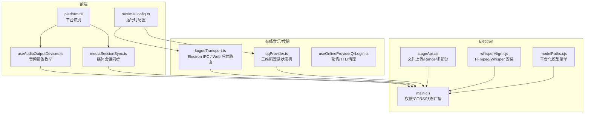

图表来源
- [src/utils/platform.ts:1-25](file://src/utils/platform.ts#L1-L25)
- [src/hooks/useAudioOutputDevices.ts:1-220](file://src/hooks/useAudioOutputDevices.ts#L1-L220)
- [src/utils/mediaSessionSync.ts:1-97](file://src/utils/mediaSessionSync.ts#L1-L97)
- [src/services/runtimeConfig.ts:1-17](file://src/services/runtimeConfig.ts#L1-L17)
- [electron/main.cjs:1637-1677](file://electron/main.cjs#L1637-L1677)
- [electron/stageApi.cjs:833-981](file://electron/stageApi.cjs#L833-L981)
- [electron/whisperAlign.cjs:1780-1814](file://electron/whisperAlign.cjs#L1780-L1814)
- [electron/analysis/modelPaths.cjs:78-104](file://electron/analysis/modelPaths.cjs#L78-L104)
- [src/services/onlineMusic/kugouTransport.ts:212-237](file://src/services/onlineMusic/kugouTransport.ts#L212-L237)
- [src/services/onlineMusic/qqProvider.ts:346-375](file://src/services/onlineMusic/qqProvider.ts#L346-L375)
- [src/hooks/useOnlineProviderQrLogin.ts:44-171](file://src/hooks/useOnlineProviderQrLogin.ts#L44-L171)

章节来源
- [src/utils/platform.ts:1-25](file://src/utils/platform.ts#L1-L25)
- [src/components/command-palette/availability.ts:1-56](file://src/components/command-palette/availability.ts#L1-L56)
- [src/services/runtimeConfig.ts:1-17](file://src/services/runtimeConfig.ts#L1-L17)
- [public/runtime-config.js:1-2](file://public/runtime-config.js#L1-L2)

## 核心组件
- 平台识别与快捷键修饰键映射：基于 UA 判断 macOS，统一主/次修饰键语义，避免 UI 与逻辑对平台认知不一致。
- 命令面板平台门控：按 web/electron/win/mac/linux 声明式过滤命令可用性，便于在 Node/SSR 环境保持行为稳定。
- 运行时配置：优先读取 Docker 注入的 window.__FOLIA_RUNTIME_CONFIG__，回退到构建期 Vite 变量，统一 AI Provider 选择。
- 显示休眠阻止：React Hook 将播放状态与 Electron 的系统级阻止休眠开关同步。
- 音频输出设备枚举：惰性加载、缓存、设备变更监听、权限探测以获取设备名，避免不必要的媒体服务占用。
- 媒体会话同步：校验位置与元数据有效性，安全地发布 artwork URL，保证平台锁屏/通知中心一致。
- 网络传输适配：Kugou/QQ 等 provider 通过 Electron IPC 或 Web 后端路由，屏蔽底层差异。
- 文件与模型：Stage 提供分片下载与多部分上传；Whisper/FFmpeg 安装与平台化模型清单支持桌面端离线能力。

章节来源
- [src/utils/platform.ts:1-25](file://src/utils/platform.ts#L1-L25)
- [src/components/command-palette/availability.ts:1-56](file://src/components/command-palette/availability.ts#L1-L56)
- [src/services/runtimeConfig.ts:1-17](file://src/services/runtimeConfig.ts#L1-L17)
- [src/hooks/useElectronDisplaySleepBlocker.ts:1-15](file://src/hooks/useElectronDisplaySleepBlocker.ts#L1-L15)
- [src/hooks/useAudioOutputDevices.ts:1-220](file://src/hooks/useAudioOutputDevices.ts#L1-L220)
- [src/utils/mediaSessionSync.ts:1-97](file://src/utils/mediaSessionSync.ts#L1-L97)
- [src/services/onlineMusic/kugouTransport.ts:212-237](file://src/services/onlineMusic/kugouTransport.ts#L212-L237)
- [electron/stageApi.cjs:833-981](file://electron/stageApi.cjs#L833-L981)
- [electron/whisperAlign.cjs:1780-1814](file://electron/whisperAlign.cjs#L1780-L1814)
- [electron/analysis/modelPaths.cjs:78-104](file://electron/analysis/modelPaths.cjs#L78-L104)

## 架构总览
跨平台能力通过“统一接口 + 平台实现”的方式解耦：
- 统一接口：如 useAudioOutputDevices、mediaSessionSync、runtimeConfig、command palette availability
- 平台实现：Electron 主进程负责系统权限、CORS、代理、本地文件与模型分发；Web 端使用标准 API 或后端服务

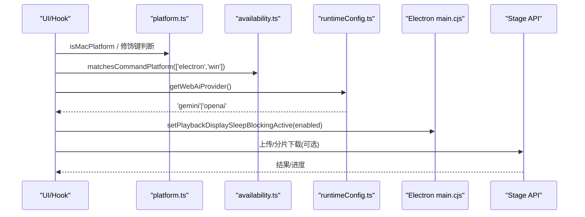

图表来源
- [src/utils/platform.ts:1-25](file://src/utils/platform.ts#L1-L25)
- [src/components/command-palette/availability.ts:1-56](file://src/components/command-palette/availability.ts#L1-L56)
- [src/services/runtimeConfig.ts:1-17](file://src/services/runtimeConfig.ts#L1-L17)
- [src/hooks/useElectronDisplaySleepBlocker.ts:1-15](file://src/hooks/useElectronDisplaySleepBlocker.ts#L1-L15)
- [electron/stageApi.cjs:833-981](file://electron/stageApi.cjs#L833-L981)

## 详细组件分析

### 平台检测与命令门控
- 平台识别：通过 navigator.userAgent 判断 macOS，统一主/次修饰键语义，确保快捷键提示与行为一致。
- 命令可用性：根据运行环境（web/electron）与 OS（win/mac/linux）声明式过滤命令，Node/SSR 下默认保留全部命令以避免测试误判。

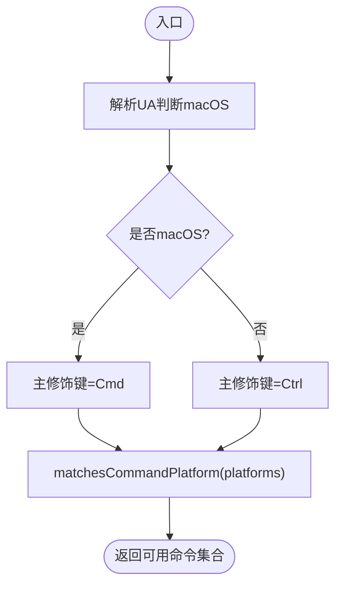

图表来源
- [src/utils/platform.ts:1-25](file://src/utils/platform.ts#L1-L25)
- [src/components/command-palette/availability.ts:1-56](file://src/components/command-palette/availability.ts#L1-L56)

章节来源
- [src/utils/platform.ts:1-25](file://src/utils/platform.ts#L1-L25)
- [src/components/command-palette/availability.ts:1-56](file://src/components/command-palette/availability.ts#L1-L56)

### 运行时配置与环境变量
- 优先级：Docker 注入的 window.__FOLIA_RUNTIME_CONFIG__.aiProvider > 构建期 Vite 变量
- 归一化：仅接受 openai/gemini，其他值归一为 gemini
- 空壳配置：public/runtime-config.js 提供默认空对象，便于非 Docker 部署继续由环境变量驱动

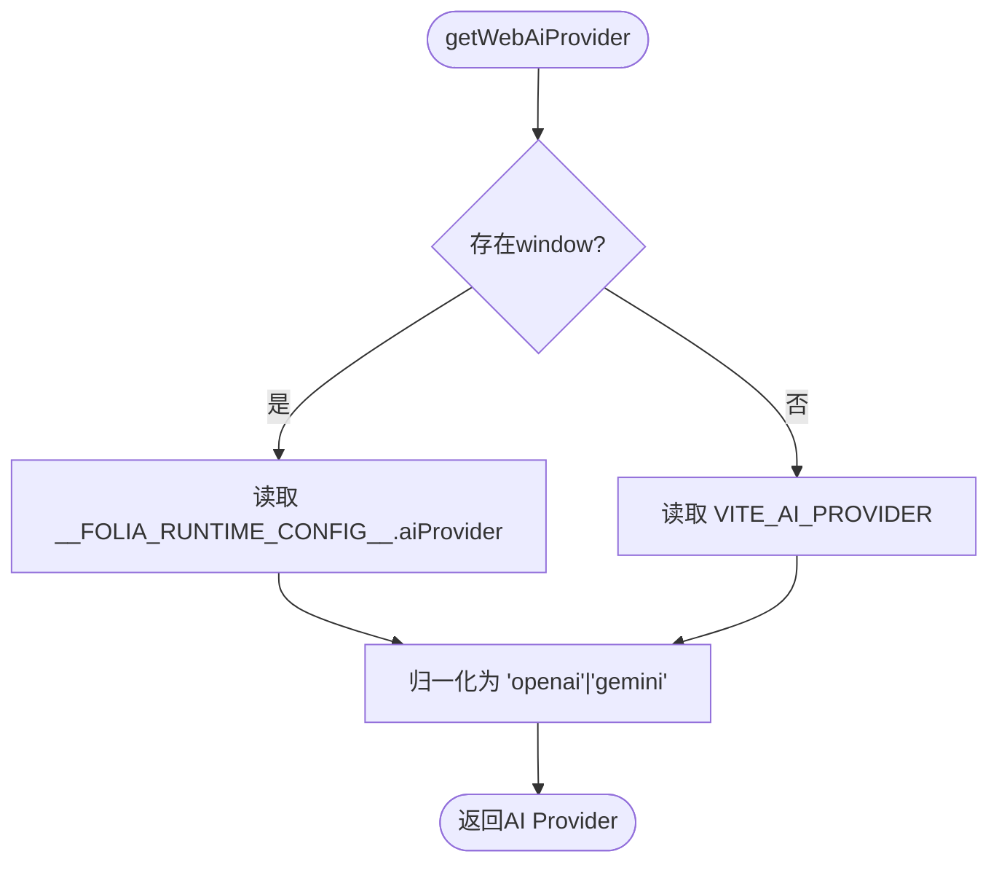

图表来源
- [src/services/runtimeConfig.ts:1-17](file://src/services/runtimeConfig.ts#L1-L17)
- [public/runtime-config.js:1-2](file://public/runtime-config.js#L1-L2)

章节来源
- [src/services/runtimeConfig.ts:1-17](file://src/services/runtimeConfig.ts#L1-L17)
- [public/runtime-config.js:1-2](file://public/runtime-config.js#L1-L2)

### 显示休眠阻止器（Electron）
- React Hook 将“启用+正在播放”两个条件组合后调用 Electron 暴露的 setPlaybackDisplaySleepBlockingActive
- 卸载时主动关闭阻止，避免残留影响系统电源策略

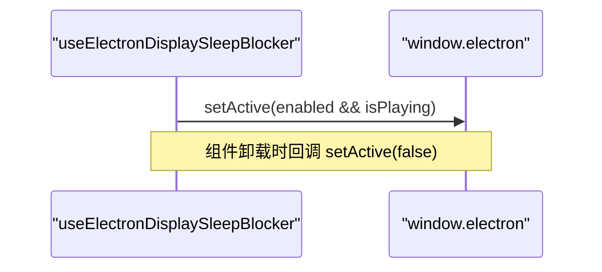

图表来源
- [src/hooks/useElectronDisplaySleepBlocker.ts:1-15](file://src/hooks/useElectronDisplaySleepBlocker.ts#L1-L15)

章节来源
- [src/hooks/useElectronDisplaySleepBlocker.ts:1-15](file://src/hooks/useElectronDisplaySleepBlocker.ts#L1-L15)

### 音频输出设备检测（跨平台）
- 惰性枚举：仅在用户打开设备选择器时触发，避免启动即占用媒体服务
- 权限探测：若设备名缺失，尝试 getUserMedia({audio:true}) 以解锁设备标签
- 设备变更：订阅 devicechange 并在离开界面时取消，释放 Chromium 视频捕获服务
- 缓存与持久化：缓存设备列表与当前选中设备名称，提升体验一致性

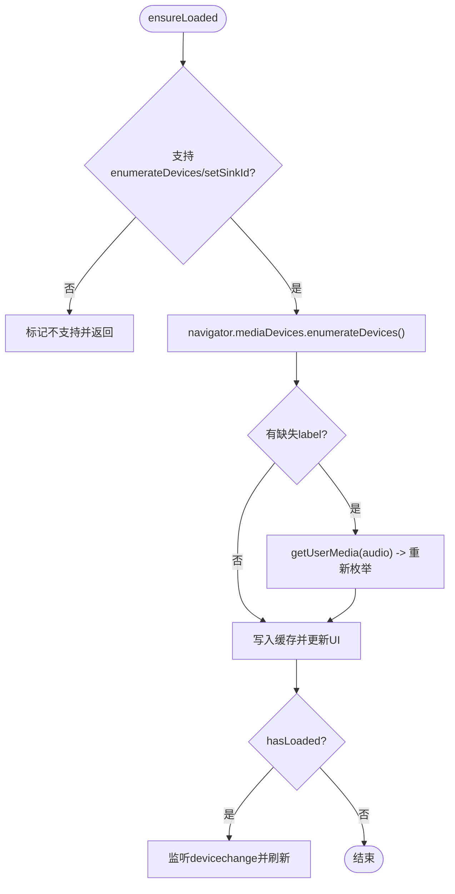

图表来源
- [src/hooks/useAudioOutputDevices.ts:1-220](file://src/hooks/useAudioOutputDevices.ts#L1-L220)

章节来源
- [src/hooks/useAudioOutputDevices.ts:1-220](file://src/hooks/useAudioOutputDevices.ts#L1-L220)

### 媒体会话同步（跨平台）
- 位置校验：确保 duration 有效且 currentTime 在范围内，否则不发布
- 源匹配：比较 currentSrc 与期望源，防止旧事件污染新曲目
- 封面协议白名单：仅允许 http/https/data/blob 协议，相对 URL 交由调用方处理
- 发布顺序：先 setPositionState，再设置 metadata，避免 Chromium 清空平台会话

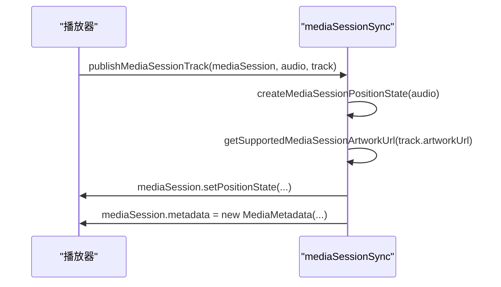

图表来源
- [src/utils/mediaSessionSync.ts:1-97](file://src/utils/mediaSessionSync.ts#L1-L97)

章节来源
- [src/utils/mediaSessionSync.ts:1-97](file://src/utils/mediaSessionSync.ts#L1-L97)

### 跨平台文件操作抽象
- 权限检查：通过 FileSystemDirectoryHandle.queryPermission 确认读权限后再恢复文件句柄
- 路径处理：从持久化的根目录名与相对路径重建文件句柄，失败则回退
- 权限边界：Electron 主进程通过 setPermissionCheckHandler/setPermissionRequestHandler 限制仅受信任的主窗口可访问文件系统

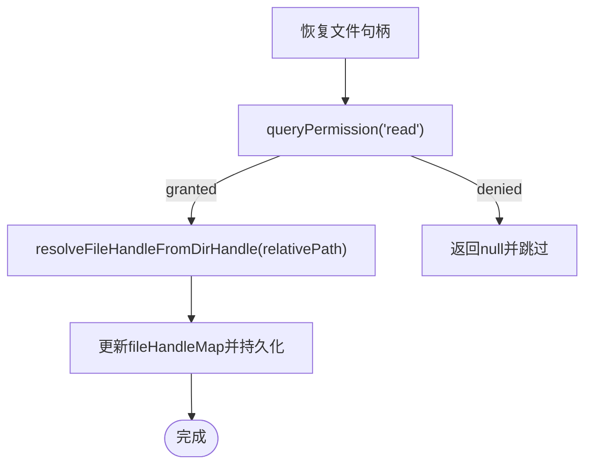

图表来源
- [src/services/localMusicService.ts:1437-1473](file://src/services/localMusicService.ts#L1437-L1473)
- [electron/main.cjs:1637-1677](file://electron/main.cjs#L1637-L1677)

章节来源
- [src/services/localMusicService.ts:1437-1473](file://src/services/localMusicService.ts#L1437-L1473)
- [electron/main.cjs:1637-1677](file://electron/main.cjs#L1637-L1677)

### 跨平台网络请求适配
- Kugou：优先走 Electron IPC（window.electron.kugouRequest），否则回退到 Web 后端；在 IPC 边界剥离敏感字段
- QQ：provider 侧维护通道探测与 TTL，前端 hook 负责轮询、TTL 超时与清理
- CORS/代理：Electron 主进程可配置 CORS 绕过与代理策略；Playwright 配置中注入 NO_PROXY 以适配本地调试

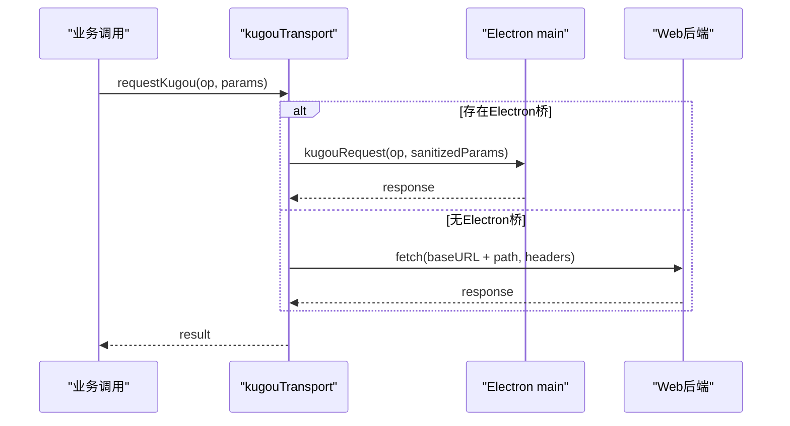

图表来源
- [src/services/onlineMusic/kugouTransport.ts:212-237](file://src/services/onlineMusic/kugouTransport.ts#L212-L237)
- [src/hooks/useOnlineProviderQrLogin.ts:44-171](file://src/hooks/useOnlineProviderQrLogin.ts#L44-L171)
- [playwright.config.ts:1-52](file://playwright.config.ts#L1-L52)

章节来源
- [src/services/onlineMusic/kugouTransport.ts:212-237](file://src/services/onlineMusic/kugouTransport.ts#L212-L237)
- [src/services/onlineMusic/qqProvider.ts:346-375](file://src/services/onlineMusic/qqProvider.ts#L346-L375)
- [src/hooks/useOnlineProviderQrLogin.ts:44-171](file://src/hooks/useOnlineProviderQrLogin.ts#L44-L171)
- [playwright.config.ts:1-52](file://playwright.config.ts#L1-L52)

### 模型与运行时（桌面端）
- 平台化清单：manifest 中的 models 按 process.platform-process.arch 区分变体，返回 supported 标志供 UI 展示
- FFmpeg/Whisper：安装流程复制二进制与依赖库，非 Windows 设置执行位，完成后更新全局路径
- 工作集采样：通过 app.getAppMetrics() 采集各进程工作集，用于定位峰值来源（如 htdemucs）

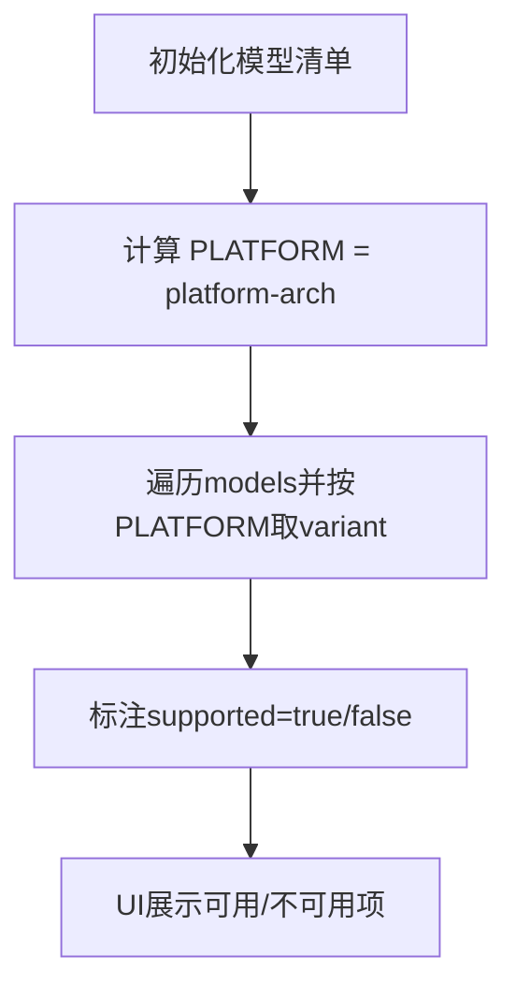

图表来源
- [electron/analysis/modelPaths.cjs:78-104](file://electron/analysis/modelPaths.cjs#L78-L104)
- [electron/whisperAlign.cjs:1780-1814](file://electron/whisperAlign.cjs#L1780-L1814)

章节来源
- [electron/analysis/modelPaths.cjs:78-104](file://electron/analysis/modelPaths.cjs#L78-L104)
- [electron/whisperAlign.cjs:1780-1814](file://electron/whisperAlign.cjs#L1780-L1814)

### 文件上传与分片下载（Stage）
- Range 下载：解析 bytes= 范围头，返回 206 与 Content-Range
- 多部分上传：限制文件大小，超限销毁流并删除临时文件，抛出结构化错误
- CORS：响应头开放必要方法与头部，便于跨域场景

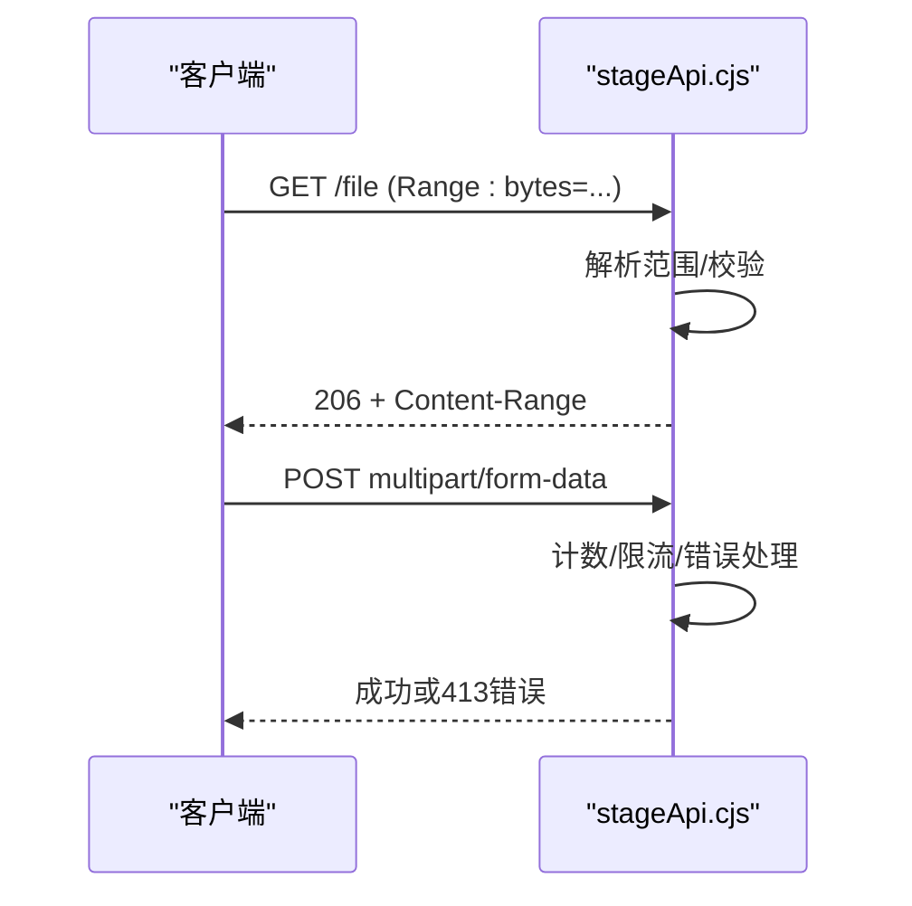

图表来源
- [electron/stageApi.cjs:833-981](file://electron/stageApi.cjs#L833-L981)

章节来源
- [electron/stageApi.cjs:833-981](file://electron/stageApi.cjs#L833-L981)

## 依赖关系分析
- 低耦合：平台检测与命令门控独立于业务逻辑；运行时配置集中管理，避免散落的 import.meta.env 使用
- 明确边界：Electron 主进程负责系统能力与权限，前端通过 Hook/Utils 调用，避免直接耦合
- 可扩展性：新增 provider 只需实现 transport 与 availability，无需改动上层 UI

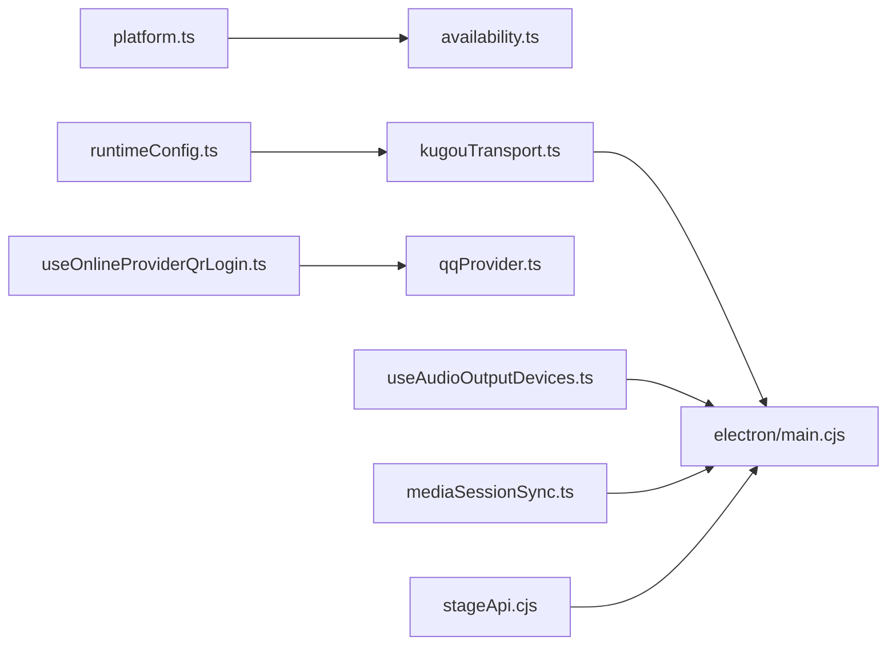

图表来源
- [src/utils/platform.ts:1-25](file://src/utils/platform.ts#L1-L25)
- [src/components/command-palette/availability.ts:1-56](file://src/components/command-palette/availability.ts#L1-L56)
- [src/services/runtimeConfig.ts:1-17](file://src/services/runtimeConfig.ts#L1-L17)
- [src/services/onlineMusic/kugouTransport.ts:212-237](file://src/services/onlineMusic/kugouTransport.ts#L212-L237)
- [src/hooks/useOnlineProviderQrLogin.ts:44-171](file://src/hooks/useOnlineProviderQrLogin.ts#L44-L171)
- [src/services/onlineMusic/qqProvider.ts:346-375](file://src/services/onlineMusic/qqProvider.ts#L346-L375)
- [src/hooks/useAudioOutputDevices.ts:1-220](file://src/hooks/useAudioOutputDevices.ts#L1-L220)
- [src/utils/mediaSessionSync.ts:1-97](file://src/utils/mediaSessionSync.ts#L1-L97)
- [electron/stageApi.cjs:833-981](file://electron/stageApi.cjs#L833-L981)
- [electron/main.cjs:1637-1677](file://electron/main.cjs#L1637-L1677)

章节来源
- [src/utils/platform.ts:1-25](file://src/utils/platform.ts#L1-L25)
- [src/components/command-palette/availability.ts:1-56](file://src/components/command-palette/availability.ts#L1-L56)
- [src/services/runtimeConfig.ts:1-17](file://src/services/runtimeConfig.ts#L1-L17)
- [src/services/onlineMusic/kugouTransport.ts:212-237](file://src/services/onlineMusic/kugouTransport.ts#L212-L237)
- [src/hooks/useOnlineProviderQrLogin.ts:44-171](file://src/hooks/useOnlineProviderQrLogin.ts#L44-L171)
- [src/services/onlineMusic/qqProvider.ts:346-375](file://src/services/onlineMusic/qqProvider.ts#L346-L375)
- [src/hooks/useAudioOutputDevices.ts:1-220](file://src/hooks/useAudioOutputDevices.ts#L1-L220)
- [src/utils/mediaSessionSync.ts:1-97](file://src/utils/mediaSessionSync.ts#L1-L97)
- [electron/stageApi.cjs:833-981](file://electron/stageApi.cjs#L833-L981)
- [electron/main.cjs:1637-1677](file://electron/main.cjs#L1637-L1677)

## 性能考量
- 内存监控：主进程定时采集应用指标，按进程类型聚合工作集，区分峰值/均值/地板，避免简单相加导致误判
- 渲染性能：可视化模块内存探针脚本通过 Playwright 启动浏览器，按进程采样工作集，辅助定位 GPU/renderer/browser 增长
- 模型推理：htdemucs 推理期间内存尖峰显著，需关注运行时参数与缓存策略，必要时切换 CPU 路径或按需下载 Python 运行时

章节来源
- [docs/automix-memory-optimization.md:21-39](file://docs/automix-memory-optimization.md#L21-L39)
- [test/manual/visualizer-memory-probe.mjs:1-38](file://test/manual/visualizer-memory-probe.mjs#L1-L38)

## 故障排查指南
- 音频设备为空或无标签：检查是否已授予麦克风权限；确认 enumerateDevices 支持；必要时触发权限探测
- 媒体会话未更新：确认音频元素 readyState 与 duration 有效；核对 currentSrc 与期望源一致；封面协议是否在白名单
- 文件访问被拒：确认请求来自受信任主窗口；检查文件系统权限处理器是否放行
- 网络请求失败：检查 Electron 代理/CORS 配置；确认 Web 后端 base URL 正确；查看 provider 的 availability 与 TTL
- 模型不可用：检查 manifest 中 supported 标志；确认 FFmpeg/Whisper 已安装；验证平台架构匹配

章节来源
- [src/hooks/useAudioOutputDevices.ts:1-220](file://src/hooks/useAudioOutputDevices.ts#L1-L220)
- [src/utils/mediaSessionSync.ts:1-97](file://src/utils/mediaSessionSync.ts#L1-L97)
- [electron/main.cjs:1637-1677](file://electron/main.cjs#L1637-L1677)
- [electron/stageApi.cjs:833-981](file://electron/stageApi.cjs#L833-L981)
- [electron/whisperAlign.cjs:1780-1814](file://electron/whisperAlign.cjs#L1780-L1814)
- [electron/analysis/modelPaths.cjs:78-104](file://electron/analysis/modelPaths.cjs#L78-L104)

## 结论
本项目通过清晰的跨平台抽象层与明确的职责边界，实现了：
- 统一的平台检测与命令门控，减少分支复杂度
- 集中的运行时配置与环境变量管理，提升部署灵活性
- 稳定的跨平台交互（休眠阻止、音频设备、媒体会话）
- 健壮的文件与网络适配（权限、CORS、代理、分片/多部分）
- 完善的性能监控与测试体系，支撑复杂多媒体场景

## 附录
- 测试框架与平台适配
  - 单元测试：Vitest 配置指向 test/unit，环境为 node，便于纯逻辑测试
  - 端到端测试：Playwright 配置注入 NO_PROXY，启动 dev server 并截图对比，支持自定义 Chromium 可执行路径
- 开发最佳实践
  - 代码组织：将平台相关逻辑下沉至 utils/hooks，业务层只消费统一接口
  - 条件编译：通过 availability.ts 声明式过滤命令，避免运行时大量 if-else
  - 动态加载：模型与运行时按需下载，结合 manifest 的 supported 标志进行 UI 引导

章节来源
- [vitest.config.ts:1-18](file://vitest.config.ts#L1-L18)
- [playwright.config.ts:1-52](file://playwright.config.ts#L1-L52)
- [src/components/command-palette/availability.ts:1-56](file://src/components/command-palette/availability.ts#L1-L56)