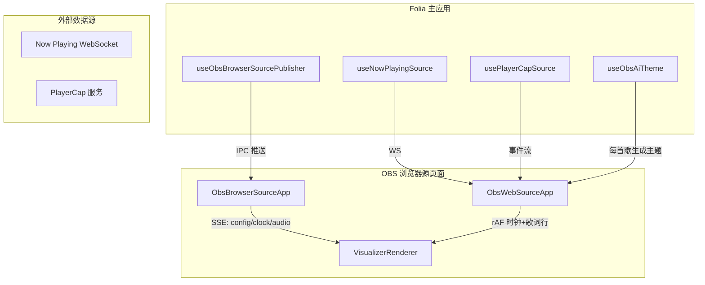
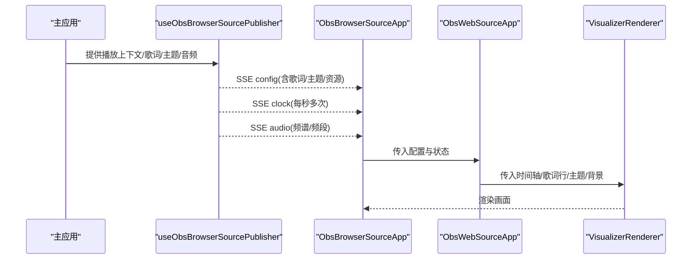
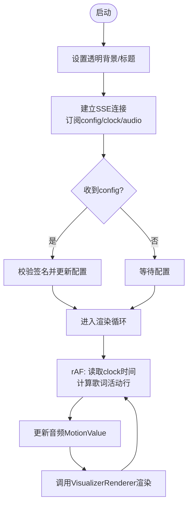
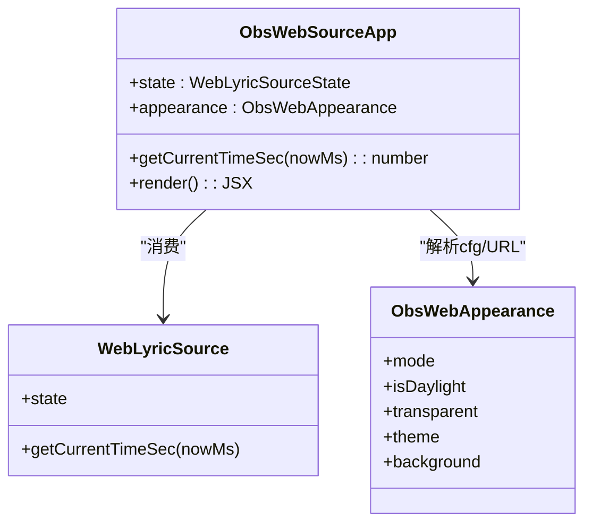
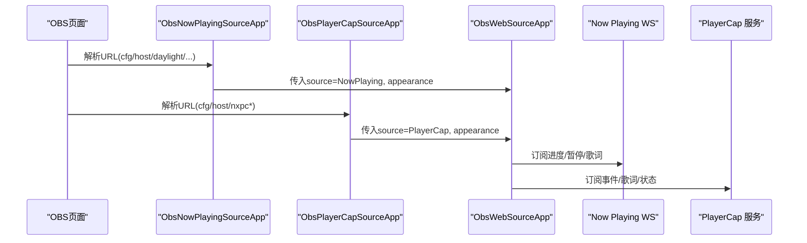
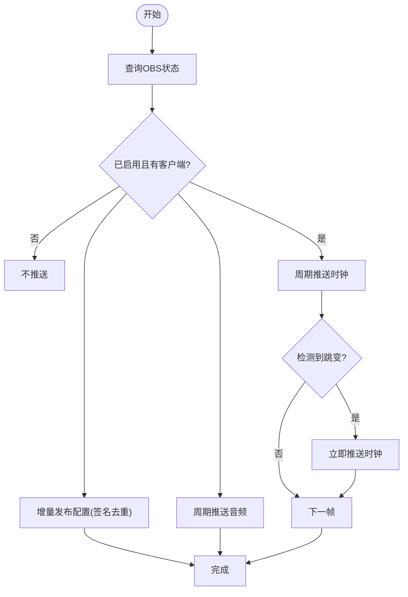
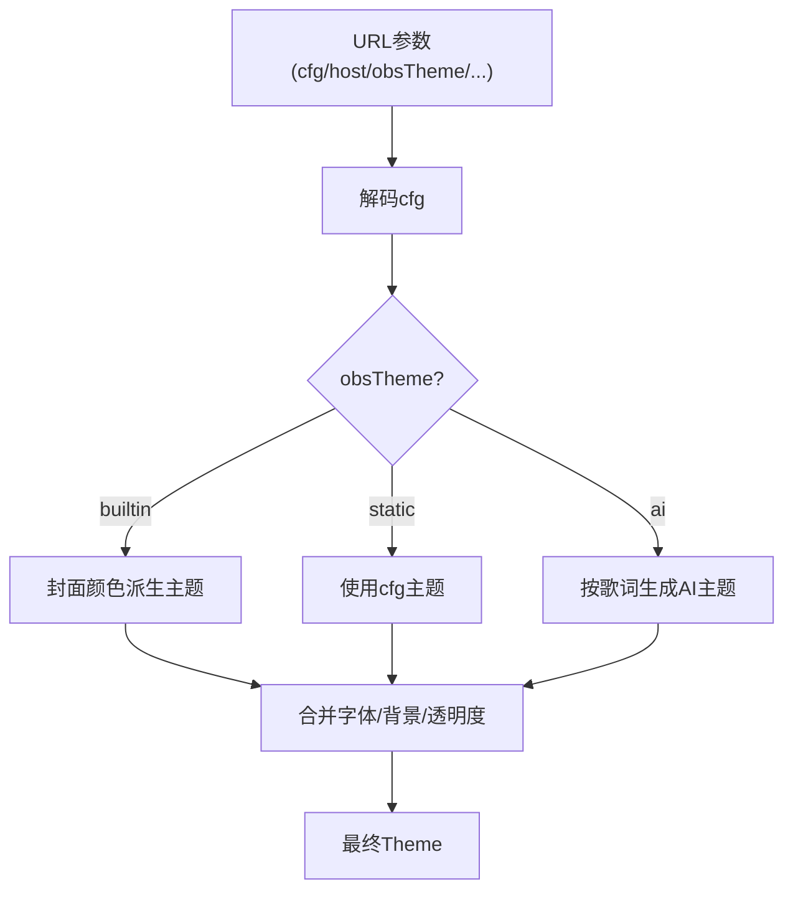
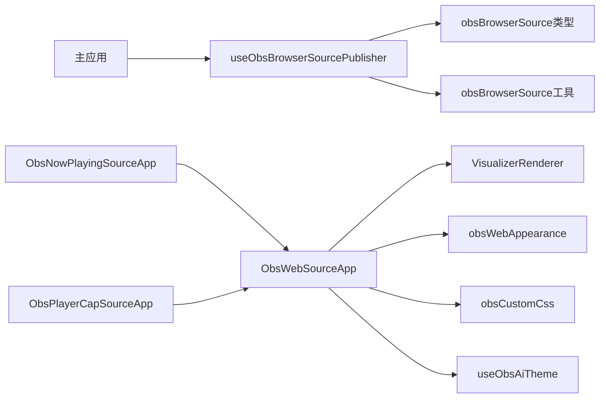

# OBS集成接口

<cite>
**本文引用的文件**
- [ObsBrowserSourceApp.tsx](file://src/components/obs/ObsBrowserSourceApp.tsx)
- [ObsNowPlayingSourceApp.tsx](file://src/components/obs/ObsNowPlayingSourceApp.tsx)
- [ObsPlayerCapSourceApp.tsx](file://src/components/obs/ObsPlayerCapSourceApp.tsx)
- [ObsWebSourceApp.tsx](file://src/components/obs/ObsWebSourceApp.tsx)
- [useObsBrowserSourcePublisher.ts](file://src/hooks/useObsBrowserSourcePublisher.ts)
- [obsBrowserSource.ts](file://src/utils/obsBrowserSource.ts)
- [obsBrowserSource类型定义](file://src/types/obsBrowserSource.ts)
- [useNowPlayingSource.ts](file://src/hooks/useNowPlayingSource.ts)
- [usePlayerCapSource.ts](file://src/hooks/usePlayerCapSource.ts)
- [obsWebAppearance.ts](file://src/utils/obsWebAppearance.ts)
- [currentObsUrl.ts](file://src/utils/currentObsUrl.ts)
- [obsUrl.ts](file://src/utils/obsUrl.ts)
- [obsCustomCss.ts](file://src/utils/obsCustomCss.ts)
- [ObsCopyUrlButton.tsx](file://src/components/shared/ObsCopyUrlButton.tsx)
- [useObsAiTheme.ts](file://src/hooks/useObsAiTheme.ts)
</cite>

## 目录
1. [简介](#简介)
2. [项目结构](#项目结构)
3. [核心组件](#核心组件)
4. [架构总览](#架构总览)
5. [详细组件分析](#详细组件分析)
6. [依赖关系分析](#依赖关系分析)
7. [性能考量](#性能考量)
8. [故障排除指南](#故障排除指南)
9. [结论](#结论)
10. [附录](#附录)

## 简介
本技术文档聚焦 Folia Player 的 OBS 浏览器源集成能力，系统解析以下关键主题：
- OBS Browser Source 集成机制与页面渲染管线
- 实时数据推送（播放时钟、音频频谱、歌词与封面）
- 多数据源接入（Now Playing、PlayerCap）与统一壳层 ObsWebSourceApp
- 外观配置与动态主题（静态/封面衍生/AI生成）
- 自定义资源注入（背景、人像、表情/头像）通过“自定义 CSS”字段传输
- 完整的 OBS 场景配置步骤、最佳实践与常见问题排查

## 项目结构
OBS 集成分为两条路径：
- 本地直连型：ObsBrowserSourceApp + useObsBrowserSourcePublisher，基于 Electron IPC 将主窗口的播放状态、音频数据与配置推送到本地 OBS 浏览器源页面。
- Web 源型：ObsNowPlayingSourceApp / ObsPlayerCapSourceApp 作为入口，驱动统一的 ObsWebSourceApp 壳层，消费 WebLyricSource 并复用同一可视化渲染管线。

图表来源
- [ObsBrowserSourceApp.tsx:112-166](file://src/components/obs/ObsBrowserSourceApp.tsx#L112-L166)
- [ObsWebSourceApp.tsx:161-180](file://src/components/obs/ObsWebSourceApp.tsx#L161-L180)
- [useObsBrowserSourcePublisher.ts:355-424](file://src/hooks/useObsBrowserSourcePublisher.ts#L355-L424)
- [useNowPlayingSource.ts:34-103](file://src/hooks/useNowPlayingSource.ts#L34-L103)
- [usePlayerCapSource.ts:44-92](file://src/hooks/usePlayerCapSource.ts#L44-L92)
- [useObsAiTheme.ts:34-84](file://src/hooks/useObsAiTheme.ts#L34-L84)

章节来源
- [ObsBrowserSourceApp.tsx:1-228](file://src/components/obs/ObsBrowserSourceApp.tsx#L1-L228)
- [ObsWebSourceApp.tsx:1-266](file://src/components/obs/ObsWebSourceApp.tsx#L1-L266)
- [useObsBrowserSourcePublisher.ts:1-432](file://src/hooks/useObsBrowserSourcePublisher.ts#L1-L432)
- [useNowPlayingSource.ts:1-111](file://src/hooks/useNowPlayingSource.ts#L1-L111)
- [usePlayerCapSource.ts:1-98](file://src/hooks/usePlayerCapSource.ts#L1-L98)
- [useObsAiTheme.ts:1-88](file://src/hooks/useObsAiTheme.ts#L1-L88)

## 核心组件
- ObsBrowserSourceApp：本地直连型 OBS 页面，通过 SSE 订阅 config/clock/audio 事件，驱动可视化渲染。
- ObsWebSourceApp：源无关的 OBS 壳层，接收 WebLyricSource 与外观配置，统一处理缩放、主题、歌词行定位与渲染。
- ObsNowPlayingSourceApp / ObsPlayerCapSourceApp：分别桥接 Now Playing 与 PlayerCap 数据源到 ObsWebSourceApp。
- useObsBrowserSourcePublisher：主应用侧发布器，按固定频率推送时钟与音频，增量发布配置，并处理图片资源跨上下文转换。
- obsBrowserSource 工具：配置签名去重、时钟时间插值、频谱降采样、blob URL 转 data URL 等。
- obsWebAppearance：解析 URL 参数与 cfg 短码，构建外观配置；支持静态/封面衍生/AI 三种主题模式。
- obsCustomCss：将上传的背景/人像/表情/头像以 data URL 形式通过“自定义 CSS”注入到 OBS 页面。
- currentObsUrl / obsUrl：构建 OBS 链接，包含 cfg、host、透明背景、主题模式等参数。
- ObsCopyUrlButton：在设置中一键复制当前 OBS 链接，支持切换主题模式。
- useObsAiTheme：在 OBS 页面内根据歌词为每首歌生成 AI 主题。

章节来源
- [ObsBrowserSourceApp.tsx:25-228](file://src/components/obs/ObsBrowserSourceApp.tsx#L25-L228)
- [ObsWebSourceApp.tsx:26-266](file://src/components/obs/ObsWebSourceApp.tsx#L26-L266)
- [ObsNowPlayingSourceApp.tsx:1-27](file://src/components/obs/ObsNowPlayingSourceApp.tsx#L1-L27)
- [ObsPlayerCapSourceApp.tsx:1-51](file://src/components/obs/ObsPlayerCapSourceApp.tsx#L1-L51)
- [useObsBrowserSourcePublisher.ts:127-432](file://src/hooks/useObsBrowserSourcePublisher.ts#L127-L432)
- [obsBrowserSource.ts:15-269](file://src/utils/obsBrowserSource.ts#L15-L269)
- [obsWebAppearance.ts:1-182](file://src/utils/obsWebAppearance.ts#L1-L182)
- [obsCustomCss.ts:1-361](file://src/utils/obsCustomCss.ts#L1-L361)
- [currentObsUrl.ts:1-57](file://src/utils/currentObsUrl.ts#L1-L57)
- [obsUrl.ts:1-42](file://src/utils/obsUrl.ts#L1-L42)
- [ObsCopyUrlButton.tsx:1-164](file://src/components/shared/ObsCopyUrlButton.tsx#L1-L164)
- [useObsAiTheme.ts:1-88](file://src/hooks/useObsAiTheme.ts#L1-L88)

## 架构总览
OBS 集成采用“发布者-订阅者 + 统一渲染壳层”的架构：
- 发布者（主应用）：useObsBrowserSourcePublisher 定时推送时钟与音频，按需发布配置；将 blob URL 转换为 data URL 或可跨域访问的资源。
- 订阅者（OBS 页面）：ObsBrowserSourceApp 通过 SSE 接收事件；ObsWebSourceApp 通过 WebLyricSource 获取歌词与轨道信息。
- 渲染层：VisualizerRenderer 复用主窗口可视化管线，支持 4K 缩放、透明背景、歌词高亮与多种视觉模式。
- 外观与主题：obsWebAppearance 解析 cfg 与 URL 参数；useObsAiTheme 可在 OBS 页面内按歌词生成主题；obsCustomCss 通过 CSS 变量注入大资源。

图表来源
- [useObsBrowserSourcePublisher.ts:355-424](file://src/hooks/useObsBrowserSourcePublisher.ts#L355-L424)
- [ObsBrowserSourceApp.tsx:112-166](file://src/components/obs/ObsBrowserSourceApp.tsx#L112-L166)
- [ObsWebSourceApp.tsx:161-266](file://src/components/obs/ObsWebSourceApp.tsx#L161-L266)

## 详细组件分析

### 组件A：ObsBrowserSourceApp（本地直连型浏览器源）
- 功能要点
  - 使用 EventSource 连接 /obs/events，订阅 config/clock/audio 三类事件。
  - 监听窗口尺寸变化，计算缩放比例，重写 devicePixelRatio/innerWidth/innerHeight，使子组件按 1920x1080 布局但原生 4K 栅格化。
  - 维护 currentTime、audioPower、频段与频谱 MotionValue，驱动可视化渲染。
  - 基于歌词时间与活动行索引，精确同步歌词高亮。
- 关键流程
  - 初始化：设置透明背景、标题，建立 SSE 连接。
  - 配置更新：比较配置签名，避免重复渲染。
  - 时钟推进：requestAnimationFrame 循环，读取最新歌词时间并计算活动行。
  - 音频数据：将音频功率、频段、频谱写入 MotionValue，供可视化使用。

图表来源
- [ObsBrowserSourceApp.tsx:54-166](file://src/components/obs/ObsBrowserSourceApp.tsx#L54-L166)
- [obsBrowserSource.ts:166-183](file://src/utils/obsBrowserSource.ts#L166-L183)

章节来源
- [ObsBrowserSourceApp.tsx:25-228](file://src/components/obs/ObsBrowserSourceApp.tsx#L25-L228)
- [obsBrowserSource.ts:97-183](file://src/utils/obsBrowserSource.ts#L97-L183)

### 组件B：ObsWebSourceApp（源无关壳层）
- 功能要点
  - 接收 WebLyricSource（Now Playing 或 PlayerCap），统一处理 rAF 时钟与歌词行定位。
  - 主题优先级：AI 主题 > cfg 主题 > 封面颜色派生主题。
  - 支持从“自定义 CSS”字段读取上传资源（背景、人像、表情/头像）。
  - 4K 缩放策略与 ObsBrowserSourceApp 一致。
- 关键流程
  - 初始化：透明背景、读取 CSS 资产、计算缩放。
  - 主题选择：根据 cfg 与 cover 颜色生成内置双主题；若启用 AI 则优先使用 AI 主题。
  - 渲染：将主题、歌词、背景、字幕样式等传递给 VisualizerRenderer。

图表来源
- [ObsWebSourceApp.tsx:26-266](file://src/components/obs/ObsWebSourceApp.tsx#L26-L266)
- [obsWebAppearance.ts:26-182](file://src/utils/obsWebAppearance.ts#L26-L182)

章节来源
- [ObsWebSourceApp.tsx:34-266](file://src/components/obs/ObsWebSourceApp.tsx#L34-L266)
- [obsWebAppearance.ts:66-182](file://src/utils/obsWebAppearance.ts#L66-L182)

### 组件C：ObsNowPlayingSourceApp / ObsPlayerCapSourceApp（数据源桥接）
- ObsNowPlayingSourceApp
  - 解析 URL 参数，构造 appearance，使用 useNowPlayingSource 连接 Now Playing WebSocket，将结果注入 ObsWebSourceApp。
- ObsPlayerCapSourceApp
  - 解析额外参数（player/timeBasis/sticky），使用 usePlayerCapSource 连接 PlayerCap 服务，映射为 WebLyricSource 后注入 ObsWebSourceApp。

图表来源
- [ObsNowPlayingSourceApp.tsx:12-24](file://src/components/obs/ObsNowPlayingSourceApp.tsx#L12-L24)
- [ObsPlayerCapSourceApp.tsx:33-47](file://src/components/obs/ObsPlayerCapSourceApp.tsx#L33-L47)
- [useNowPlayingSource.ts:34-103](file://src/hooks/useNowPlayingSource.ts#L34-L103)
- [usePlayerCapSource.ts:44-92](file://src/hooks/usePlayerCapSource.ts#L44-L92)

章节来源
- [ObsNowPlayingSourceApp.tsx:1-27](file://src/components/obs/ObsNowPlayingSourceApp.tsx#L1-L27)
- [ObsPlayerCapSourceApp.tsx:1-51](file://src/components/obs/ObsPlayerCapSourceApp.tsx#L1-L51)
- [useNowPlayingSource.ts:1-111](file://src/hooks/useNowPlayingSource.ts#L1-L111)
- [usePlayerCapSource.ts:1-98](file://src/hooks/usePlayerCapSource.ts#L1-L98)

### 组件D：useObsBrowserSourcePublisher（主应用发布器）
- 功能要点
  - 周期性推送时钟（约 250ms）与音频（约 50ms）。
  - 配置发布使用签名去重与待发布跟踪，避免重复传输。
  - 检测 seek-like 跳转，必要时立即刷新时钟。
  - 将 blob URL 封面与图片资源转换为 data URL，确保跨上下文可读。
- 关键数据结构
  - ObsBrowserSourceConfig/Clock/Audio：定义配置、时钟与音频载荷。
  - 频谱降采样至 256 维，降低带宽与序列化开销。

图表来源
- [useObsBrowserSourcePublisher.ts:179-424](file://src/hooks/useObsBrowserSourcePublisher.ts#L179-L424)
- [obsBrowserSource.ts:114-148](file://src/utils/obsBrowserSource.ts#L114-L148)
- [obsBrowserSource.ts:185-209](file://src/utils/obsBrowserSource.ts#L185-L209)

章节来源
- [useObsBrowserSourcePublisher.ts:127-432](file://src/hooks/useObsBrowserSourcePublisher.ts#L127-L432)
- [obsBrowserSource.ts:15-269](file://src/utils/obsBrowserSource.ts#L15-L269)
- [obsBrowserSource类型定义:29-128](file://src/types/obsBrowserSource.ts#L29-L128)

### 组件E：外观与主题（obsWebAppearance 与 useObsAiTheme）
- 外观解析
  - parseObsWebParams：提取 host、cfg、daylight、transparent、visualizer、obsTheme。
  - buildObsAppearanceFromShortcode：解码 cfg，构建背景、字体、透明度、模式等；支持覆盖 mode。
- 动态主题
  - 静态：cfg 携带主题，直接烧录。
  - 内置：根据封面颜色派生双主题。
  - AI：在 OBS 页面内根据歌词文本生成主题，防抖并缓存每首歌一次。
- 自定义资源
  - obsCustomCss：将上传资源编码为 data URL，通过 CSS 变量注入；读取时回写到 shell 用于背景与人像渲染。

图表来源
- [obsWebAppearance.ts:66-182](file://src/utils/obsWebAppearance.ts#L66-L182)
- [useObsAiTheme.ts:34-84](file://src/hooks/useObsAiTheme.ts#L34-L84)
- [obsCustomCss.ts:218-305](file://src/utils/obsCustomCss.ts#L218-L305)

章节来源
- [obsWebAppearance.ts:1-182](file://src/utils/obsWebAppearance.ts#L1-L182)
- [useObsAiTheme.ts:1-88](file://src/hooks/useObsAiTheme.ts#L1-L88)
- [obsCustomCss.ts:1-361](file://src/utils/obsCustomCss.ts#L1-L361)

### 组件F：OBS 链接构建与复制（currentObsUrl / obsUrl / ObsCopyUrlButton）
- currentObsUrl：根据当前设置构建 OBS 链接，包含 cfg、host、透明背景、主题模式标记。
- obsUrl：纯字符串工具，构建/解析 cfg 片段与完整 URL。
- ObsCopyUrlButton：在设置界面提供复制按钮与主题模式下拉菜单，便于快速分享。

章节来源
- [currentObsUrl.ts:1-57](file://src/utils/currentObsUrl.ts#L1-L57)
- [obsUrl.ts:1-42](file://src/utils/obsUrl.ts#L1-L42)
- [ObsCopyUrlButton.tsx:1-164](file://src/components/shared/ObsCopyUrlButton.tsx#L1-L164)

## 依赖关系分析
- 组件耦合
  - ObsBrowserSourceApp 依赖 useObsBrowserSourcePublisher 提供的 SSE 事件；ObsWebSourceApp 依赖 WebLyricSource 抽象。
  - 外观模块 obsWebAppearance 被多个入口组件复用；obsCustomCss 在 shell 中读取 CSS 变量。
- 外部依赖
  - Now Playing WebSocket、PlayerCap 服务、Electron IPC（本地直连型）、Gemini API（AI 主题）。
- 潜在循环
  - 无直接循环依赖；各模块职责清晰，通过接口与类型解耦。

图表来源
- [useObsBrowserSourcePublisher.ts:127-432](file://src/hooks/useObsBrowserSourcePublisher.ts#L127-L432)
- [ObsWebSourceApp.tsx:26-266](file://src/components/obs/ObsWebSourceApp.tsx#L26-L266)
- [obsWebAppearance.ts:1-182](file://src/utils/obsWebAppearance.ts#L1-L182)
- [obsCustomCss.ts:1-361](file://src/utils/obsCustomCss.ts#L1-L361)
- [useObsAiTheme.ts:1-88](file://src/hooks/useObsAiTheme.ts#L1-L88)

章节来源
- [useObsBrowserSourcePublisher.ts:127-432](file://src/hooks/useObsBrowserSourcePublisher.ts#L127-L432)
- [ObsWebSourceApp.tsx:26-266](file://src/components/obs/ObsWebSourceApp.tsx#L26-L266)
- [obsWebAppearance.ts:1-182](file://src/utils/obsWebAppearance.ts#L1-L182)
- [obsCustomCss.ts:1-361](file://src/utils/obsCustomCss.ts#L1-L361)
- [useObsAiTheme.ts:1-88](file://src/hooks/useObsAiTheme.ts#L1-L88)

## 性能考量
- 时钟与音频推送频率
  - 时钟约 250ms 一次，音频约 50ms 一次，兼顾流畅与带宽。
- 配置发布去重
  - 使用轻量指纹与待发布跟踪，避免重复传输大型配置。
- 频谱降采样
  - 频谱降至 256 维，减少序列化与网络负载。
- 资源跨上下文
  - blob URL 转为 data URL，避免跨源不可读问题。
- 4K 缩放
  - 重写 devicePixelRatio 与窗口尺寸，保持布局一致性同时提升文字清晰度。
- 自定义 CSS 预算
  - 对 GIF 等资源进行降级与总量限制，防止 OBS 编辑器卡顿。

[本节为通用性能建议，无需具体文件引用]

## 故障排除指南
- 无法连接 Folia
  - 检查 OBS 浏览器源 URL 是否正确，确认 token/端口参数。
  - 确认主应用已启用 OBS 浏览器源且存在客户端连接。
- 画面空白或黑屏
  - 检查透明背景与主题配置；确认 cfg 是否有效。
  - 若使用 AI 主题，确认歌词已到达且生成成功。
- 歌词不同步
  - 检查时钟推送是否正常；确认 lyricOffsetMs 设置。
  - 若发生 seek，确认是否触发即时时钟刷新。
- 音频频谱无响应
  - 确认音频推送已启用；检查频谱数据是否为空。
- 自定义资源未显示
  - 确认已将生成的 CSS 粘贴到 OBS 的“自定义 CSS”字段。
  - 检查 CSS 变量是否被正确读取；注意 GIF 可能因预算降级为静态图。
- 主题不符合预期
  - 检查 obsTheme 模式（static/builtin/ai）与 daylight/transparent 参数。
  - 若使用 cfg，确认主题是否被动态模式覆盖。

章节来源
- [ObsBrowserSourceApp.tsx:112-166](file://src/components/obs/ObsBrowserSourceApp.tsx#L112-L166)
- [useObsBrowserSourcePublisher.ts:355-424](file://src/hooks/useObsBrowserSourcePublisher.ts#L355-L424)
- [obsBrowserSource.ts:166-209](file://src/utils/obsBrowserSource.ts#L166-L209)
- [obsCustomCss.ts:218-305](file://src/utils/obsCustomCss.ts#L218-L305)
- [obsWebAppearance.ts:66-182](file://src/utils/obsWebAppearance.ts#L66-L182)

## 结论
Folia 的 OBS 集成通过“发布者-订阅者 + 统一壳层”的架构，实现了稳定高效的浏览器源渲染。其核心优势包括：
- 多数据源接入（Now Playing/PlayerCap）与统一渲染管线
- 精细的实时同步（时钟、音频、歌词）与高性能优化
- 灵活的外观与主题体系（静态/封面衍生/AI）
- 通过“自定义 CSS”安全传输大资源，适配 OBS 的限制
- 完善的链接构建与复制体验，便于分享与复用

## 附录
- OBS 场景配置步骤（示例）
  - 添加“浏览器源”，输入由 currentObsUrl 生成的 URL。
  - 选择合适分辨率（推荐 1920x1080 或 4K），勾选透明背景（如需）。
  - 将生成的 CSS 粘贴到“自定义 CSS”字段，以启用上传资源。
  - 根据需要调整主题模式（static/builtin/ai）与昼夜模式。
- 最佳实践
  - 使用 builtin 或 ai 模式获得更贴合封面的主题。
  - 控制自定义资源大小，避免超过 CSS 预算导致降级。
  - 合理设置歌词偏移，保证歌词与音乐同步。
  - 在直播中监控 OBS 客户端数量与连接状态，确保渲染稳定。

[本节为概念性指导，无需具体文件引用]