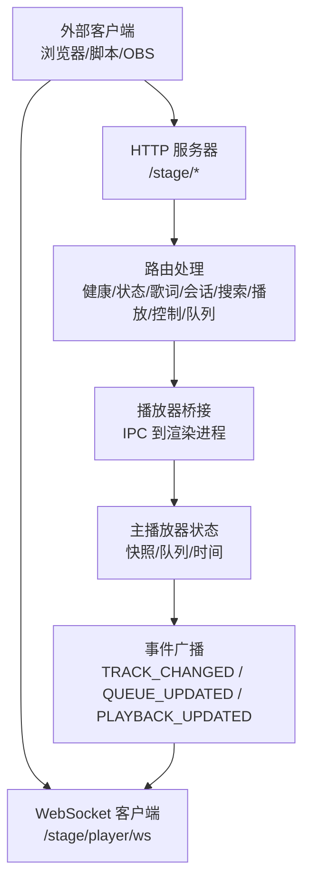
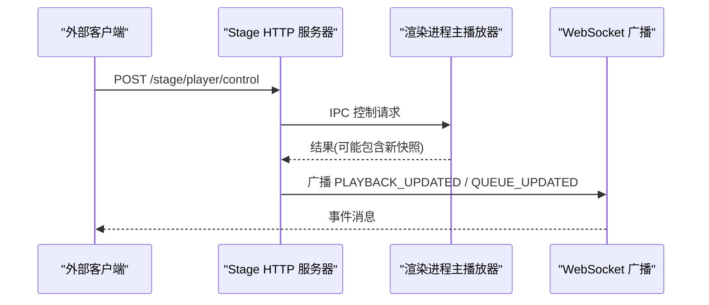
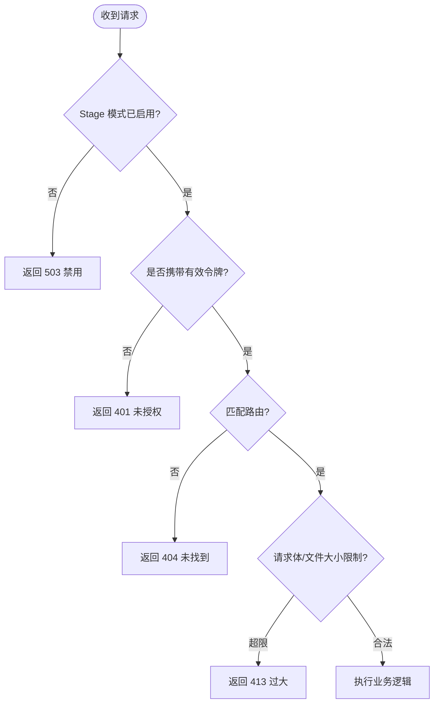
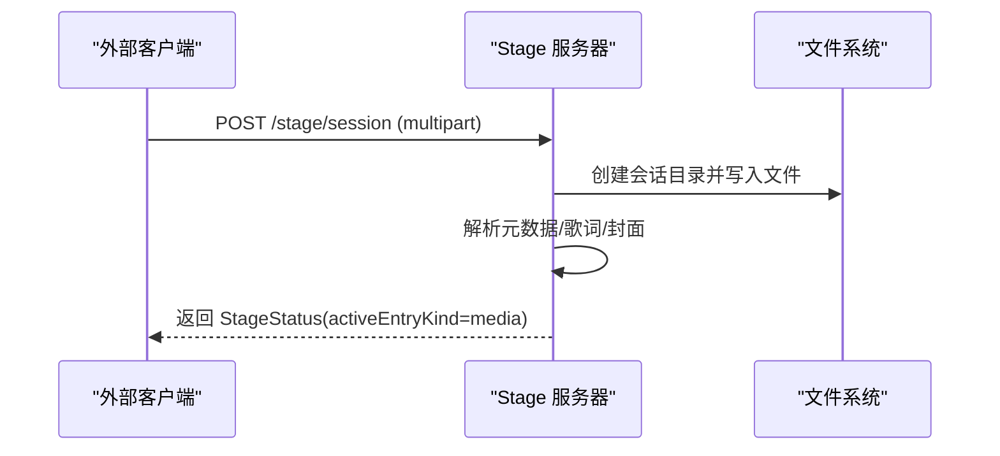
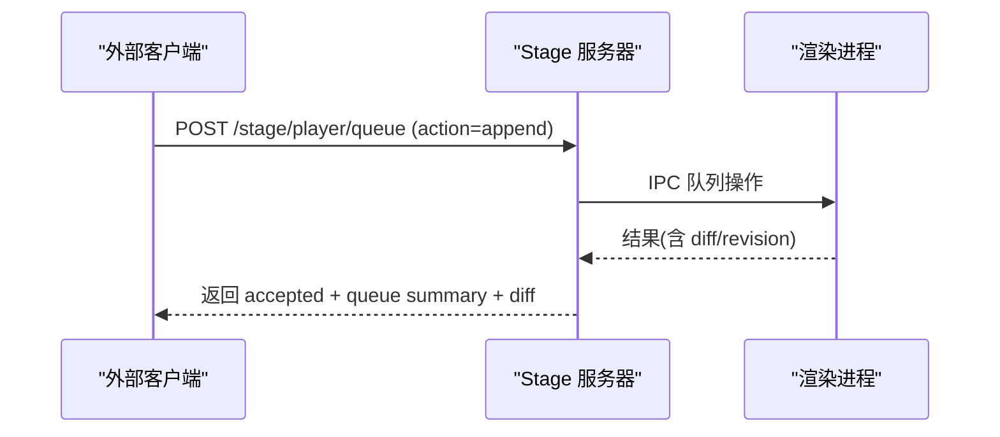
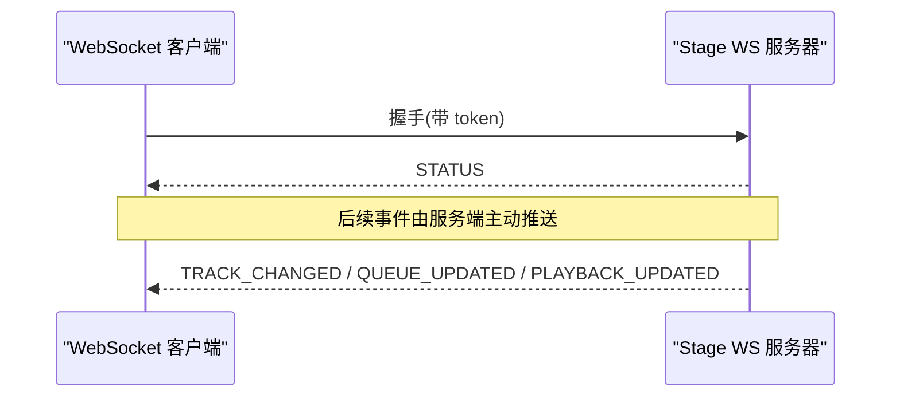
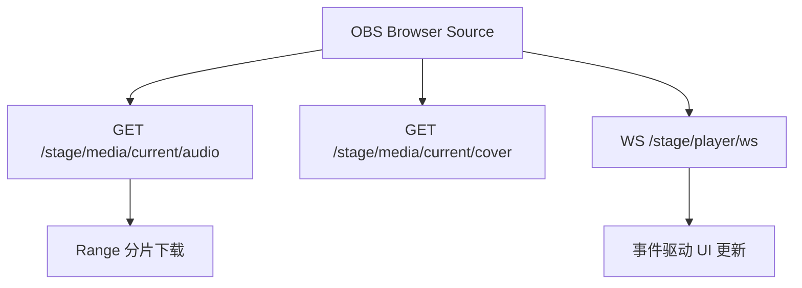
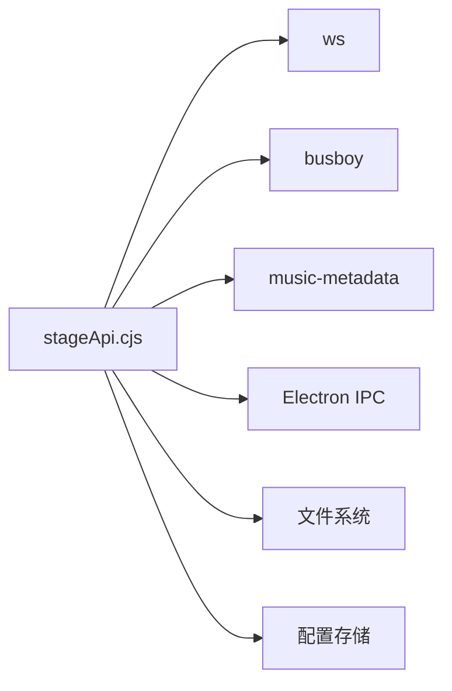

# Stage API接口

<cite>
**本文引用的文件**
- [electron/stageApi.cjs](file://electron/stageApi.cjs)
- [stage-client.html](file://stage-client.html)
- [test/manual/stage-client/API_SCHEMA.md](file://test/manual/stage-client/API_SCHEMA.md)
- [test/manual/stage-client/main.ts](file://test/manual/stage-client/main.ts)
</cite>

## 目录
1. [简介](#简介)
2. [项目结构](#项目结构)
3. [核心组件](#核心组件)
4. [架构总览](#架构总览)
5. [详细组件分析](#详细组件分析)
6. [依赖关系分析](#依赖关系分析)
7. [性能与限制](#性能与限制)
8. [故障排查指南](#故障排查指南)
9. [结论](#结论)
10. [附录：API参考](#附录api参考)

## 简介
本技术文档面向本地桌面端 Folia Player 的 Stage API，系统性说明其设计理念、RESTful 接口、WebSocket 实时事件、OBS Browser Source 集成方式、外部应用控制能力以及认证与安全机制。文档同时提供完整的端点定义、请求/响应格式、错误码说明，并附带客户端集成示例与最佳实践。

Stage API 通过本地 HTTP 服务器暴露受控入口，允许外部工具向 Folia 推送歌词或媒体会话，搜索并点播歌曲，查询与控制播放状态与队列，并通过 WebSocket 订阅播放器事件。该设计将“外部输入”和“主播放器”解耦，以事件驱动的方式保证数据一致性与可观测性。

## 项目结构
- 服务端实现位于 Electron 进程，提供 HTTP 路由、鉴权、多部分上传解析、媒体会话管理、播放器快照发布与 WebSocket 广播。
- 前端调试与文档页面提供交互式调用界面，自动生成 cURL 示例与请求预览，便于联调。
- 协议 Schema 文档定义了所有请求与响应的类型、字段约束与错误码。

图表来源
- [electron/stageApi.cjs:1837-2041](file://electron/stageApi.cjs#L1837-L2041)
- [electron/stageApi.cjs:648-676](file://electron/stageApi.cjs#L648-L676)
- [electron/stageApi.cjs:573-641](file://electron/stageApi.cjs#L573-L641)

章节来源
- [electron/stageApi.cjs:169-2176](file://electron/stageApi.cjs#L169-L2176)
- [stage-client.html:1-690](file://stage-client.html#L1-L690)
- [test/manual/stage-client/API_SCHEMA.md:1-889](file://test/manual/stage-client/API_SCHEMA.md#L1-L889)

## 核心组件
- HTTP 服务与路由：监听本地端口，处理健康检查、状态查询、歌词/媒体会话写入、搜索、播放、控制、队列操作与状态清理。
- 认证与授权：Bearer Token 校验，支持 Header 与查询参数两种方式；WebSocket 连接同样需要令牌。
- 媒体会话管理：支持 JSON 与 multipart/form-data 两种提交方式；自动提取音频内嵌歌词、封面与元数据；维护会话工作目录与资源索引。
- 播放器快照与事件：统一规范化播放器快照，按变更类型广播 TRACK_CHANGED、QUEUE_UPDATED、PLAYBACK_UPDATED 等事件。
- 外部控制桥接：通过 IPC 将控制指令转发至渲染进程的主播放器，等待响应并返回差异信息（diff）与队列修订号。
- 配置与生命周期：根据设置动态启停服务、生成/轮换令牌、清理会话资源。

章节来源
- [electron/stageApi.cjs:211-241](file://electron/stageApi.cjs#L211-L241)
- [electron/stageApi.cjs:892-915](file://electron/stageApi.cjs#L892-L915)
- [electron/stageApi.cjs:917-1031](file://electron/stageApi.cjs#L917-L1031)
- [electron/stageApi.cjs:1133-1274](file://electron/stageApi.cjs#L1133-L1274)
- [electron/stageApi.cjs:573-641](file://electron/stageApi.cjs#L573-L641)
- [electron/stageApi.cjs:1489-1605](file://electron/stageApi.cjs#L1489-L1605)
- [electron/stageApi.cjs:2071-2127](file://electron/stageApi.cjs#L2071-L2127)

## 架构总览
Stage API 采用“外部输入 + 主播放器”的双通道模型：
- 外部输入通道：通过 /stage/lyrics 与 /stage/session 注入歌词或媒体会话，形成当前 Stage 输入。
- 主播放器通道：通过 /stage/player/* 读取/控制主播放器状态与队列，并以 WebSocket 推送事件。

图表来源
- [electron/stageApi.cjs:1732-1758](file://electron/stageApi.cjs#L1732-L1758)
- [electron/stageApi.cjs:1519-1581](file://electron/stageApi.cjs#L1519-L1581)
- [electron/stageApi.cjs:573-641](file://electron/stageApi.cjs#L573-L641)

## 详细组件分析

### 认证与安全机制
- 令牌获取与验证：从存储中读取或生成随机 Bearer Token；所有非健康接口需携带 Authorization: Bearer <token>，WebSocket 支持 ?token= 或 Header。
- 请求体大小限制：JSON 请求体上限为 2 MiB；multipart field 单字段上限 2 MiB，单文件上限 1 GiB，最多 3 个文件、10 个 field、10 个 part。
- 跨域与范围请求：HTTP 响应启用 CORS；文件下载支持 Range 分片，返回 206 与 Content-Range。
- 安全路径：未启用 Stage 模式时拒绝访问；未匹配路由返回 404；未授权返回 401。

图表来源
- [electron/stageApi.cjs:1851-1866](file://electron/stageApi.cjs#L1851-L1866)
- [electron/stageApi.cjs:870-890](file://electron/stageApi.cjs#L870-L890)
- [electron/stageApi.cjs:917-1031](file://electron/stageApi.cjs#L917-L1031)
- [electron/stageApi.cjs:825-868](file://electron/stageApi.cjs#L825-L868)

章节来源
- [electron/stageApi.cjs:211-241](file://electron/stageApi.cjs#L211-L241)
- [electron/stageApi.cjs:892-915](file://electron/stageApi.cjs#L892-L915)
- [electron/stageApi.cjs:870-890](file://electron/stageApi.cjs#L870-L890)
- [electron/stageApi.cjs:917-1031](file://electron/stageApi.cjs#L917-L1031)
- [electron/stageApi.cjs:825-868](file://electron/stageApi.cjs#L825-L868)

### 歌词与会话管理
- 歌词会话：POST /stage/lyrics 接收 parser-compatible lyricSource，支持 local、embedded、navidrome、netease、qrc 等类型；成功后 activeEntryKind 切换为 lyrics。
- 媒体会话：POST /stage/session 支持 JSON 与 multipart；可从 URL 拉流或上传本地文件；服务端尝试读取音频内嵌歌词、封面与元数据；成功后 activeEntryKind 切换为 media。
- 资源管理：每个会话拥有独立工作目录，保留最近 N 个会话资产，避免磁盘膨胀。

图表来源
- [electron/stageApi.cjs:1976-2007](file://electron/stageApi.cjs#L1976-L2007)
- [electron/stageApi.cjs:1133-1274](file://electron/stageApi.cjs#L1133-L1274)
- [electron/stageApi.cjs:690-745](file://electron/stageApi.cjs#L690-L745)

章节来源
- [electron/stageApi.cjs:1948-1974](file://electron/stageApi.cjs#L1948-L1974)
- [electron/stageApi.cjs:1976-2007](file://electron/stageApi.cjs#L1976-L2007)
- [electron/stageApi.cjs:1133-1274](file://electron/stageApi.cjs#L1133-L1274)
- [electron/stageApi.cjs:690-745](file://electron/stageApi.cjs#L690-L745)

### 播放器控制与队列管理
- 控制能力：根据 playbackContext 动态计算 controlCapabilities 与 queueCapabilities；在 stage-session 或 external-playback-source 上下文下可能受限。
- 控制动作：next、prev、pause、resume、seek；seek 要求非负 positionMs。
- 队列操作：append、insert-next、remove、move、select、clear；支持分页 GET /stage/player/queue，默认窗口 100，最大 500；around=current 围绕当前项计算偏移。
- 差异更新：队列编辑返回 diff，包含 baseRevision、revision、ops；若 requiresReload=true，客户端应重新拉取队列。

图表来源
- [electron/stageApi.cjs:1760-1835](file://electron/stageApi.cjs#L1760-L1835)
- [electron/stageApi.cjs:1519-1581](file://electron/stageApi.cjs#L1519-L1581)
- [electron/stageApi.cjs:538-559](file://electron/stageApi.cjs#L538-L559)

章节来源
- [electron/stageApi.cjs:315-341](file://electron/stageApi.cjs#L315-L341)
- [electron/stageApi.cjs:1732-1758](file://electron/stageApi.cjs#L1732-L1758)
- [electron/stageApi.cjs:1760-1835](file://electron/stageApi.cjs#L1760-L1835)
- [electron/stageApi.cjs:538-559](file://electron/stageApi.cjs#L538-L559)

### WebSocket 实时通信
- 连接地址：ws://127.0.0.1:<port>/stage/player/ws，支持 ?token= 或 Authorization: Bearer。
- 事件类型：
  - STATUS：初始状态
  - TRACK_CHANGED：曲目变化
  - QUEUE_UPDATED：队列变化
  - PLAYBACK_UPDATED：播放时间与状态更新
- 断开与重连：令牌变更后主动关闭连接；客户端需处理 close 事件并重连。

图表来源
- [electron/stageApi.cjs:648-676](file://electron/stageApi.cjs#L648-L676)
- [electron/stageApi.cjs:573-641](file://electron/stageApi.cjs#L573-L641)

章节来源
- [electron/stageApi.cjs:648-676](file://electron/stageApi.cjs#L648-L676)
- [electron/stageApi.cjs:573-641](file://electron/stageApi.cjs#L573-L641)

### OBS Browser Source 集成
- 媒体源：使用 /stage/session 推送音频 URL 或本地文件，服务端会生成本地 Stage media URL（如 /stage/media/current/audio），供浏览器源直接引用。
- 封面源：上传或内嵌封面后，可通过 /stage/media/current/cover 或 /stage/media/session/{sessionId}/cover 获取。
- 实时数据：通过 WebSocket 订阅播放事件，驱动 UI 刷新；或通过轮询 /stage/player/time 校准进度。
- 音频流处理：服务端支持 Range 请求，适合浏览器边下边播；上传音频时自动提取内嵌歌词与封面，减少重复传输。

图表来源
- [electron/stageApi.cjs:259-274](file://electron/stageApi.cjs#L259-L274)
- [electron/stageApi.cjs:1868-1913](file://electron/stageApi.cjs#L1868-L1913)
- [electron/stageApi.cjs:825-868](file://electron/stageApi.cjs#L825-L868)
- [electron/stageApi.cjs:648-676](file://electron/stageApi.cjs#L648-L676)

章节来源
- [electron/stageApi.cjs:259-274](file://electron/stageApi.cjs#L259-L274)
- [electron/stageApi.cjs:1868-1913](file://electron/stageApi.cjs#L1868-L1913)
- [electron/stageApi.cjs:825-868](file://electron/stageApi.cjs#L825-L868)
- [electron/stageApi.cjs:648-676](file://electron/stageApi.cjs#L648-L676)

### 外部应用控制接口
- 搜索：POST /stage/player/search，返回标准化歌曲列表，可直接用于点播或入队。
- 播放：POST /stage/player/play，支持立即播放或追加到队列；返回去重与影响数量。
- 控制：POST /stage/player/control，发送 next、prev、pause、resume、seek。
- 队列：GET/POST /stage/player/queue，读取与编辑队列，支持分页与 around=current。
- 状态：GET /stage/player/status 与 /stage/player/time，读取快照与精确时间。

章节来源
- [electron/stageApi.cjs:1657-1703](file://electron/stageApi.cjs#L1657-L1703)
- [electron/stageApi.cjs:1732-1758](file://electron/stageApi.cjs#L1732-L1758)
- [electron/stageApi.cjs:1779-1835](file://electron/stageApi.cjs#L1779-L1835)
- [electron/stageApi.cjs:1925-1937](file://electron/stageApi.cjs#L1925-L1937)

## 依赖关系分析
- 内部依赖：
  - 存储与配置：端口、令牌、Stage 模式开关与来源。
  - 文件系统：会话工作目录、临时文件、资源索引。
  - IPC：与渲染进程主播放器通信，执行播放、控制与队列操作。
  - 网络：可选调用本地网易云 API 进行默认搜索。
- 外部依赖：
  - ws：WebSocket 服务器。
  - busboy：multipart/form-data 解析。
  - music-metadata：解析上传音频的元数据与内嵌歌词/封面。

图表来源
- [electron/stageApi.cjs:1-8](file://electron/stageApi.cjs#L1-L8)
- [electron/stageApi.cjs:787-792](file://electron/stageApi.cjs#L787-L792)
- [electron/stageApi.cjs:1462-1487](file://electron/stageApi.cjs#L1462-L1487)

章节来源
- [electron/stageApi.cjs:1-8](file://electron/stageApi.cjs#L1-L8)
- [electron/stageApi.cjs:787-792](file://electron/stageApi.cjs#L787-L792)
- [electron/stageApi.cjs:1462-1487](file://electron/stageApi.cjs#L1462-L1487)

## 性能与限制
- 请求体限制：JSON 最大 2 MiB；multipart field 最大 2 MiB；单文件最大 1 GiB；最多 3 个文件、10 个 field、10 个 part。
- 队列窗口：默认 100 条，最大 500 条；around=current 可围绕当前项计算偏移。
- 超时控制：外部播放请求默认 15 秒；播放器控制/队列请求默认 10 秒。
- 资源清理：仅保留最近 N 个会话资产，避免磁盘占用增长。
- 时间补偿：播放中 positionMs 基于 sampledAtMs 推算，确保精度。

章节来源
- [electron/stageApi.cjs:14-25](file://electron/stageApi.cjs#L14-L25)
- [electron/stageApi.cjs:538-559](file://electron/stageApi.cjs#L538-L559)
- [electron/stageApi.cjs:714-729](file://electron/stageApi.cjs#L714-L729)
- [electron/stageApi.cjs:431-446](file://electron/stageApi.cjs#L431-L446)

## 故障排查指南
- 401 未授权：检查 Authorization: Bearer 或 ?token= 是否正确；确认 Stage 模式已启用。
- 404 未找到：路由不存在或未启用 Stage 模式；检查基础地址与端口。
- 409 不支持：当前播放上下文不允许该控制或队列动作；查看 controlCapabilities/queueCapabilities。
- 413 过大：请求体或文件超过限制；拆分请求或降低文件大小。
- 503 不可用：Stage 服务未启动或主窗口不可用；检查设置与服务生命周期。
- 504 超时：播放器未在限定时间内响应；重试或检查主进程状态。
- 502 被拒绝：渲染进程拒绝请求；检查权限与上下文。

章节来源
- [electron/stageApi.cjs:1851-1866](file://electron/stageApi.cjs#L1851-L1866)
- [electron/stageApi.cjs:1705-1730](file://electron/stageApi.cjs#L1705-L1730)
- [electron/stageApi.cjs:870-890](file://electron/stageApi.cjs#L870-L890)
- [electron/stageApi.cjs:1489-1517](file://electron/stageApi.cjs#L1489-L1517)
- [electron/stageApi.cjs:1519-1581](file://electron/stageApi.cjs#L1519-L1581)

## 结论
Stage API 以清晰的 RESTful 边界与事件驱动模型，实现了外部工具对 Folia 播放器的可控集成。通过严格的认证、限流与资源管理，保障了本地集成的安全性与稳定性。结合 WebSocket 与队列 diff，客户端可实现高效、低延迟的状态同步与编辑体验。对于 OBS Browser Source 等场景，提供了稳定的媒体源与实时事件支持。

## 附录：API参考

### 通用约定
- 除 /stage/health 外，所有 HTTP 接口需携带 Authorization: Bearer <token>。
- WebSocket 支持 Authorization: Bearer 或 ?token=。
- JSON 请求使用 application/json；/stage/session 支持 multipart/form-data。
- 时间字段单位为毫秒；sampledAtMs、updatedAt 为 Unix epoch 毫秒。

章节来源
- [test/manual/stage-client/API_SCHEMA.md:5-12](file://test/manual/stage-client/API_SCHEMA.md#L5-L12)

### 端点清单
- GET /stage/health：健康检查，无需鉴权。
- GET /stage/status：读取当前 Stage 输入状态。
- POST /stage/lyrics：推送歌词会话。
- POST /stage/session：推送媒体会话（JSON 或 multipart）。
- POST /stage/player/search：搜索歌曲。
- POST /stage/player/play：触发播放或追加队列。
- GET /stage/player/status：读取播放器状态（摘要）。
- GET /stage/player/time：读取精确播放时间。
- POST /stage/player/control：发送控制指令。
- GET/POST /stage/player/queue：读取/编辑队列。
- WS /stage/player/ws：订阅播放器事件。
- DELETE /stage/state：清空当前 Stage 输入。

章节来源
- [stage-client.html:18-33](file://stage-client.html#L18-L33)
- [test/manual/stage-client/API_SCHEMA.md:302-800](file://test/manual/stage-client/API_SCHEMA.md#L302-L800)

### 关键数据结构
- StageStatus：enabled、modeEnabled、source、port、token、activeEntryKind、lyricsSession、mediaSession。
- StageLyricsSession：title、artist、album、lyricSource、updatedAt。
- StageMediaSession：id、title、artist、album、durationMs、coverUrl、audioUrl、audioSrc、audioMimeType、coverMimeType、lyricsText、lyricsFormat、updatedAt。
- StagePlayerSnapshot：playbackContext、current、playerState、positionMs、durationMs、sampledAtMs、updatedAt、controlCapabilities、queueCapabilities、queue。
- StagePlayerQueueDiff：baseRevision、revision、ops、requiresReload。

章节来源
- [test/manual/stage-client/API_SCHEMA.md:45-301](file://test/manual/stage-client/API_SCHEMA.md#L45-L301)

### 错误码速查
- 400：INVALID_STAGE_*（JSON 解析失败、字段不合法）。
- 401：Unauthorized（未携带或无效令牌）。
- 404：Not found（路由不存在）。
- 409：STAGE_PLAYER_*_UNSUPPORTED（上下文不支持）。
- 413：STAGE_BODY_TOO_LARGE / STAGE_FILE_TOO_LARGE（请求体或文件过大）。
- 502：NETEASE_SEARCH_FAILED / STAGE_PLAYER_REQUEST_REJECTED（下游失败或被拒绝）。
- 503：Stage 未启用或服务不可用。
- 504：STAGE_PLAY_TIMEOUT / STAGE_PLAYER_REQUEST_TIMEOUT（超时）。

章节来源
- [test/manual/stage-client/API_SCHEMA.md:372-379](file://test/manual/stage-client/API_SCHEMA.md#L372-L379)
- [test/manual/stage-client/API_SCHEMA.md:456-468](file://test/manual/stage-client/API_SCHEMA.md#L456-L468)
- [test/manual/stage-client/API_SCHEMA.md:516-524](file://test/manual/stage-client/API_SCHEMA.md#L516-L524)
- [test/manual/stage-client/API_SCHEMA.md:567-577](file://test/manual/stage-client/API_SCHEMA.md#L567-L577)
- [test/manual/stage-client/API_SCHEMA.md:652-663](file://test/manual/stage-client/API_SCHEMA.md#L652-L663)
- [test/manual/stage-client/API_SCHEMA.md:772-782](file://test/manual/stage-client/API_SCHEMA.md#L772-L782)

### 客户端集成示例与最佳实践
- 使用 stage-client.html 提供的交互式文档页面，自动生成 cURL 与请求预览，快速验证接口。
- 优先使用 WebSocket 订阅事件，减少轮询开销；令牌变更后需重连。
- 队列编辑时关注 diff.revision 与 requiresReload，必要时重新拉取队列。
- 上传音频时利用内嵌歌词与封面，减少额外传输；注意文件大小与数量限制。
- 控制指令前查询 controlCapabilities/queueCapabilities，避免在不支持的上下文中操作。

章节来源
- [stage-client.html:1-690](file://stage-client.html#L1-L690)
- [test/manual/stage-client/main.ts:1-761](file://test/manual/stage-client/main.ts#L1-L761)