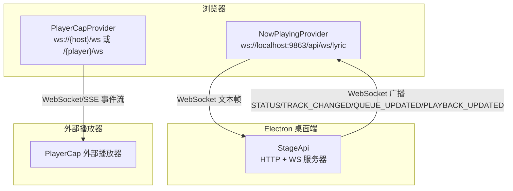
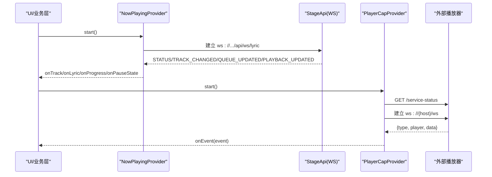
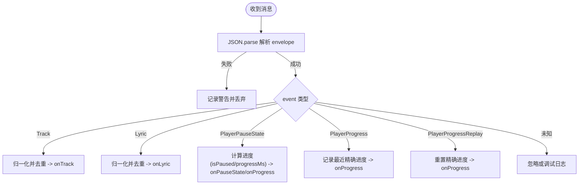
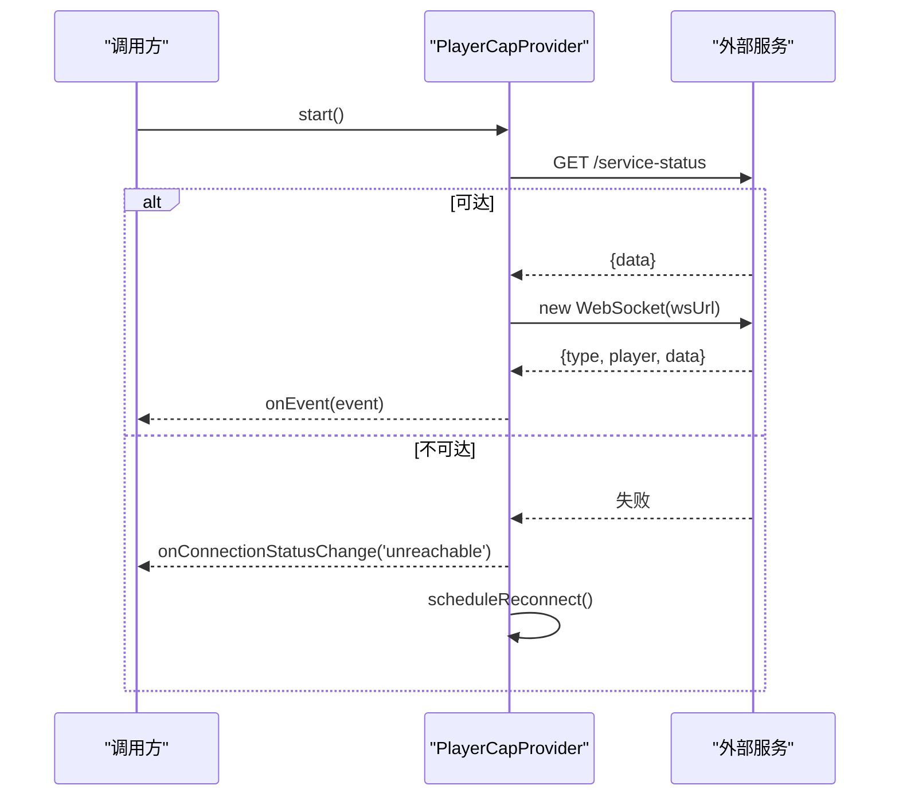
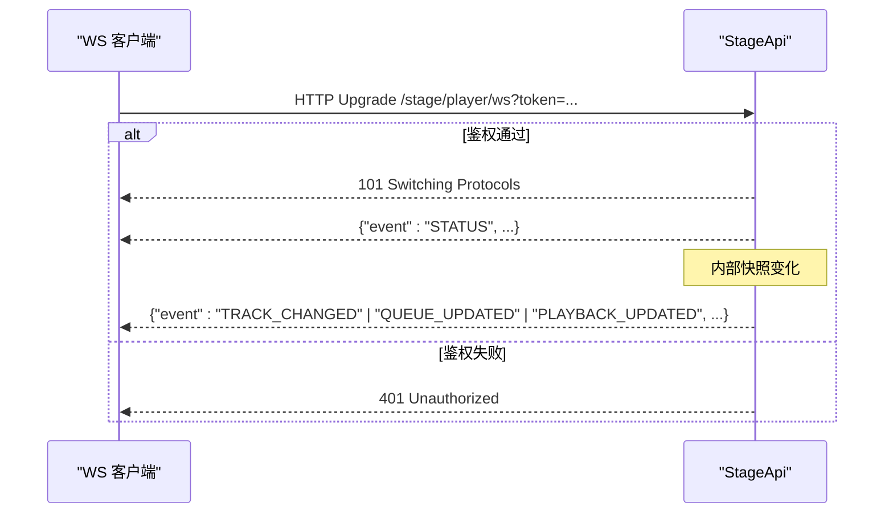
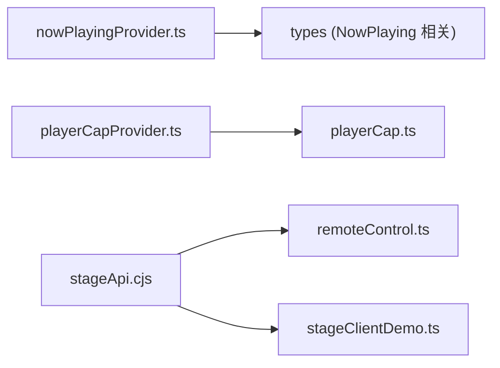

# WebSocket实时通信

<cite>
**本文引用的文件**
- [nowPlayingProvider.ts](file://src/services/nowPlayingProvider.ts)
- [playerCapProvider.ts](file://src/services/playerCapProvider.ts)
- [stageApi.cjs](file://electron/stageApi.cjs)
- [remoteControl.ts](file://src/types/remoteControl.ts)
- [playerCap.ts](file://src/types/playerCap.ts)
- [stageClientDemo.ts](file://src/utils/stageClientDemo.ts)
- [main.ts（手动调试客户端）](file://test/manual/stage-client/main.ts)
</cite>

## 目录
1. [简介](#简介)
2. [项目结构](#项目结构)
3. [核心组件](#核心组件)
4. [架构总览](#架构总览)
5. [详细组件分析](#详细组件分析)
6. [依赖关系分析](#依赖关系分析)
7. [性能考量](#性能考量)
8. [故障排查指南](#故障排查指南)
9. [结论](#结论)
10. [附录：消息协议与调试工具](#附录消息协议与调试工具)

## 简介
本技术文档聚焦 Folia Player 的 WebSocket 实时通信能力，覆盖三类通道：
- Now Playing 歌词与播放状态推送（浏览器侧订阅）
- Stage API 播放器状态与队列变更广播（桌面端本地服务）
- PlayerCap 外部播放器事件流（WS/SSE 黑盒接入）

文档将深入解析连接建立、握手与鉴权、连接管理、心跳与重连策略；说明事件驱动架构的事件类型、消息格式、错误处理；并给出客户端集成最佳实践、完整消息协议规范与调试方法。

## 项目结构
围绕 WebSocket 的核心代码分布在以下位置：
- 浏览器侧提供者：Now Playing 与 PlayerCap 两个 WS 消费者
- Electron 服务端：Stage API 提供 HTTP + WS 接口，负责播放器快照广播与鉴权升级
- 类型与工具：统一的消息类型定义、请求构建器与调试客户端

图表来源
- [nowPlayingProvider.ts:3-7](file://src/services/nowPlayingProvider.ts#L3-L7)
- [playerCapProvider.ts:10-14](file://src/services/playerCapProvider.ts#L10-L14)
- [stageApi.cjs:648-676](file://electron/stageApi.cjs#L648-L676)

章节来源
- [nowPlayingProvider.ts:1-489](file://src/services/nowPlayingProvider.ts#L1-L489)
- [playerCapProvider.ts:1-196](file://src/services/playerCapProvider.ts#L1-L196)
- [stageApi.cjs:1-800](file://electron/stageApi.cjs#L1-L800)

## 核心组件
- NowPlayingProvider：维护与本地 Now Playing 服务的 WebSocket 连接，接收 Track/Lyric/进度/暂停状态等事件，去重后回调上层 UI。
- PlayerCapProvider：先通过 HTTP GET /service-status 探测服务可用性，再建立 WebSocket 连接；对事件进行轻量解析并透传。
- StageApi（Electron）：提供 /stage/player/ws 的 WebSocket 端点，基于 Bearer Token 鉴权，周期性广播播放器快照（STATUS/TRACK_CHANGED/QUEUE_UPDATED/PLAYBACK_UPDATED）。

章节来源
- [nowPlayingProvider.ts:236-489](file://src/services/nowPlayingProvider.ts#L236-L489)
- [playerCapProvider.ts:45-196](file://src/services/playerCapProvider.ts#L45-L196)
- [stageApi.cjs:572-676](file://electron/stageApi.cjs#L572-L676)

## 架构总览
Folia 的实时通信采用“事件驱动 + 多通道”的混合架构：
- 浏览器侧以 Provider 封装连接生命周期与消息分发，屏蔽底层差异
- Electron 侧集中管理播放器快照与队列变化，按最小必要原则广播事件
- 外部播放器通过 PlayerCap 暴露标准事件模型，被统一消费

图表来源
- [nowPlayingProvider.ts:300-330](file://src/services/nowPlayingProvider.ts#L300-L330)
- [stageApi.cjs:648-676](file://electron/stageApi.cjs#L648-L676)
- [playerCapProvider.ts:107-150](file://src/services/playerCapProvider.ts#L107-L150)

## 详细组件分析

### NowPlayingProvider（歌词与播放状态）
- 连接建立：构造 wsUrl 并 new WebSocket；onopen 更新连接状态；onerror/onclose 触发重连
- 消息处理：解析 envelope {event, data}，分派到 Track/Lyric/PlayerPauseState/PlayerProgress/PlayerProgressReplay
- 去重与归一化：对 track/lyric 做相等性比较，避免重复回调；对时长单位（秒/毫秒）与进度值进行安全归一
- 重连策略：固定延迟定时器重试；stop 时清理定时器与 socket 引用

图表来源
- [nowPlayingProvider.ts:332-461](file://src/services/nowPlayingProvider.ts#L332-L461)

章节来源
- [nowPlayingProvider.ts:3-489](file://src/services/nowPlayingProvider.ts#L3-L489)

### PlayerCapProvider（外部播放器事件）
- 探测阶段：GET /service-status 超时保护，不可达则进入 unreachable 并重试
- 连接阶段：根据 host 与可选 player 拼接 wsUrl；onopen 标记已连接；onclose 触发一次 onDisconnect 并持续重连
- 事件解析：仅校验 type 字段存在，其余交由调用方处理；支持 generation 令牌防止并发竞态

图表来源
- [playerCapProvider.ts:16-30](file://src/services/playerCapProvider.ts#L16-L30)
- [playerCapProvider.ts:107-150](file://src/services/playerCapProvider.ts#L107-L150)

章节来源
- [playerCapProvider.ts:1-196](file://src/services/playerCapProvider.ts#L1-L196)
- [playerCap.ts:1-122](file://src/types/playerCap.ts#L1-L122)

### StageApi（桌面端 WS 广播）
- 鉴权与升级：路径 /stage/player/ws，需携带 Bearer Token；未启用或未鉴权直接拒绝升级
- 连接管理：维护 Set<WebSocket>，首次连接发送 STATUS；关闭时从集合移除
- 事件广播：当当前曲目、队列或播放状态发生变化时，分别广播 TRACK_CHANGED/QUEUE_UPDATED/PLAYBACK_UPDATED；默认也周期性广播 STATUS

图表来源
- [stageApi.cjs:648-676](file://electron/stageApi.cjs#L648-L676)
- [stageApi.cjs:572-619](file://electron/stageApi.cjs#L572-L619)

章节来源
- [stageApi.cjs:1-800](file://electron/stageApi.cjs#L1-L800)

## 依赖关系分析
- NowPlayingProvider 依赖 wsUrl 常量与类型定义，向 UI 暴露稳定的回调接口
- PlayerCapProvider 依赖 HTTP 探测与 WS 构建函数，解耦外部播放器实现
- StageApi 依赖 Electron 主进程窗口与存储配置，集中管理播放器快照与队列
- 类型与工具：remoteControl.ts 定义遥控窗口快照结构；stageClientDemo.ts 提供统一的请求构建与 WS URL 生成

图表来源
- [nowPlayingProvider.ts:1-55](file://src/services/nowPlayingProvider.ts#L1-L55)
- [playerCapProvider.ts:1-43](file://src/services/playerCapProvider.ts#L1-L43)
- [remoteControl.ts:1-80](file://src/types/remoteControl.ts#L1-L80)
- [stageClientDemo.ts:526-535](file://src/utils/stageClientDemo.ts#L526-L535)

章节来源
- [remoteControl.ts:1-80](file://src/types/remoteControl.ts#L1-L80)
- [stageClientDemo.ts:1-536](file://src/utils/stageClientDemo.ts#L1-L536)

## 性能考量
- 去重与节流：NowPlayingProvider 对 track/lyric 使用浅比较去重；进度更新区分 precise/coarse，减少高频渲染压力
- 时间锚定：PlayerCap 在 resume/pause 事件中携带真实 position，前端据此重新锚定插值，避免跳迁闪烁
- 最小广播：StageApi 仅在关键维度变化时广播对应事件，降低网络与渲染开销
- 探测优先：PlayerCapProvider 先 HTTP 探测再建 WS，避免无效连接抖动

[本节为通用指导，不直接分析具体文件]

## 故障排查指南
- 连接失败
  - NowPlaying：检查 wsUrl 是否可达；查看 onerror/onclose 回调与重连定时器
  - PlayerCap：确认 /service-status 可达；若 unreachable 会定时重试
  - Stage：确认启用 stage 模式且 token 正确；未鉴权会返回 401
- 消息解析失败
  - NowPlaying：非字符串或 JSON 解析失败会被记录并丢弃
  - PlayerCap：缺少 type 字段的事件将被忽略
- 断开与重连
  - 三者均在 onclose 中执行重连逻辑；注意 stop/destroy 会清理定时器与引用
- 调试建议
  - 使用内置手动调试客户端连接 /stage/player/ws，观察事件流与状态
  - 开启 Provider debug 开关，打印原始报文与状态变更

章节来源
- [nowPlayingProvider.ts:332-349](file://src/services/nowPlayingProvider.ts#L332-L349)
- [playerCapProvider.ts:152-163](file://src/services/playerCapProvider.ts#L152-L163)
- [stageApi.cjs:648-676](file://electron/stageApi.cjs#L648-L676)
- [main.ts（手动调试客户端）:570-619](file://test/manual/stage-client/main.ts#L570-L619)

## 结论
Folia 的 WebSocket 实时通信以 Provider 抽象为核心，结合 Stage 的集中式快照广播与 PlayerCap 的外部事件接入，形成稳定、可扩展的实时数据通道。通过严格的鉴权、去重与重连机制，兼顾了可靠性与性能。配合调试工具与类型约束，可快速定位问题并集成第三方播放器。

[本节为总结，不直接分析具体文件]

## 附录：消息协议与调试工具

### 协议总览
- Now Playing（ws://localhost:9863/api/ws/lyric）
  - 信封：{ event, data }
  - 事件：Track / Lyric / PlayerPauseState / PlayerProgress / PlayerProgressReplay
  - 用途：歌词同步、播放状态与进度推送
- Stage（ws://{baseUrl}/stage/player/ws?token=...）
  - 鉴权：Authorization: Bearer <token>
  - 事件：STATUS / TRACK_CHANGED / QUEUE_UPDATED / PLAYBACK_UPDATED
  - 用途：桌面端播放器状态与队列变化的实时广播
- PlayerCap（ws://{host}/ws 或 /{player}/ws）
  - 信封：{ type, player, data }
  - 事件：status_update / song_info_update / lyric_update / all_lyrics / lyric_idle / playback_pause / playback_resume / player_switch / player_clear
  - 用途：外部播放器事件流接入

章节来源
- [nowPlayingProvider.ts:8-41](file://src/services/nowPlayingProvider.ts#L8-L41)
- [stageApi.cjs:572-676](file://electron/stageApi.cjs#L572-L676)
- [playerCap.ts:5-22](file://src/types/playerCap.ts#L5-L22)

### 客户端集成要点
- 连接建立
  - NowPlaying：new WebSocket(buildNowPlayingWsUrl(host))
  - Stage：buildStagePlayerWebSocketUrl(baseUrl, token)
  - PlayerCap：fetchPlayerCapServiceStatus(host) 成功后 new WebSocket(buildPlayerCapWsUrl(host, player))
- 事件监听
  - 订阅 onTrack/onLyric/onProgress/onPauseState（NowPlaying）
  - 订阅 onEvent（PlayerCap），按 type 分发
  - 订阅 STATUS/TRACK_CHANGED/QUEUE_UPDATED/PLAYBACK_UPDATED（Stage）
- 错误与重连
  - 捕获 onerror/onclose，使用 Provider 的重连逻辑
  - 对于 Stage，确保 token 有效；否则 401 导致无法升级

章节来源
- [nowPlayingProvider.ts:300-330](file://src/services/nowPlayingProvider.ts#L300-L330)
- [playerCapProvider.ts:107-150](file://src/services/playerCapProvider.ts#L107-L150)
- [stageClientDemo.ts:526-535](file://src/utils/stageClientDemo.ts#L526-L535)

### 调试工具使用方法
- 打开手动调试页面 test/manual/stage-client/main.ts
- 输入 baseUrl 与 token，点击 connect-player-ws 连接 /stage/player/ws
- 在日志区查看 STATUS/TRACK_CHANGED/QUEUE_UPDATED/PLAYBACK_UPDATED 等事件
- 可通过 buildStagePlayerTimeRequest/buildStagePlayerQueueGetRequest 等辅助函数验证 HTTP 接口

章节来源
- [main.ts（手动调试客户端）:570-619](file://test/manual/stage-client/main.ts#L570-L619)
- [stageClientDemo.ts:417-496](file://src/utils/stageClientDemo.ts#L417-L496)