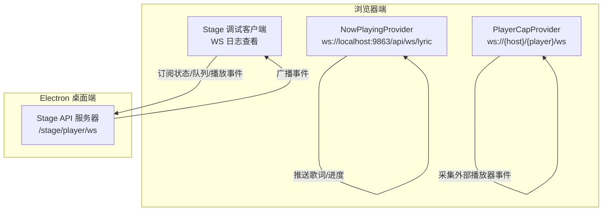
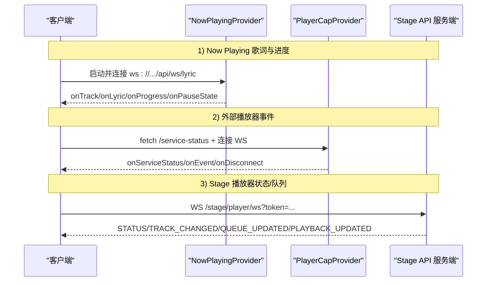
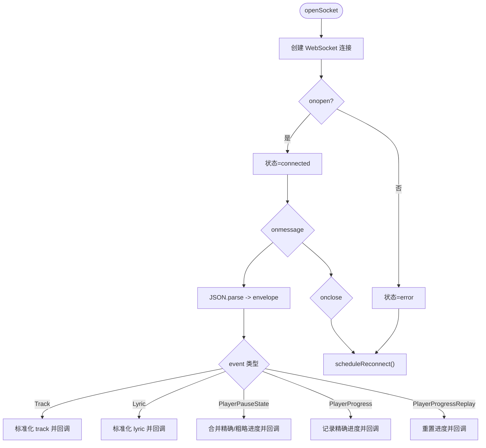
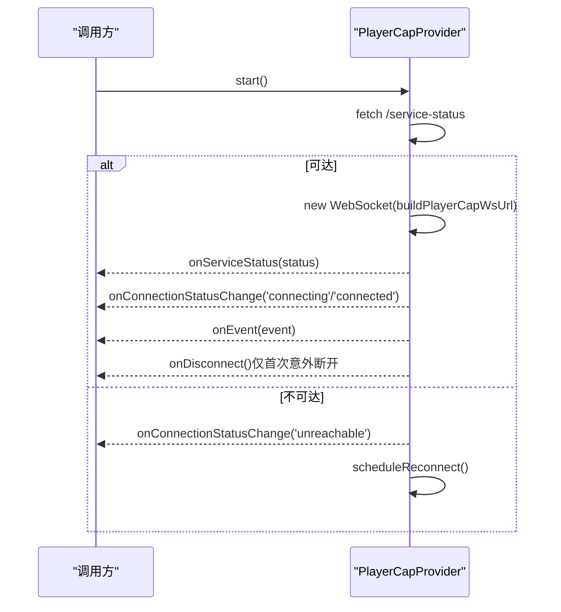
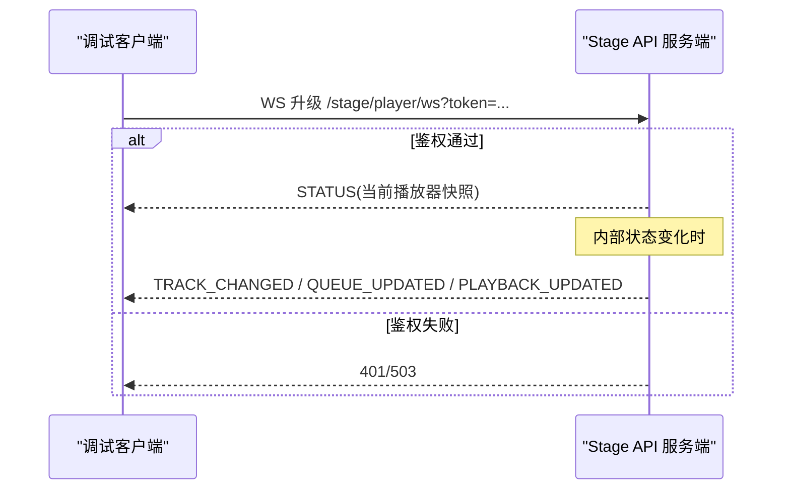
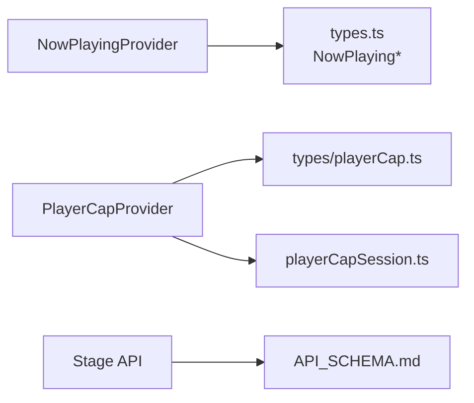

# WebSocket实时通信

<cite>
**本文引用的文件**
- [nowPlayingProvider.ts](file://src/services/nowPlayingProvider.ts)
- [playerCapProvider.ts](file://src/services/playerCapProvider.ts)
- [stageApi.cjs](file://electron/stageApi.cjs)
- [API_SCHEMA.md](file://test/manual/stage-client/API_SCHEMA.md)
- [main.ts（手动调试客户端）](file://test/manual/stage-client/main.ts)
- [types.ts](file://src/types.ts)
- [appPlayback.ts](file://src/types/appPlayback.ts)
- [playerCapSession.ts](file://src/utils/playerCapSession.ts)
</cite>

## 目录
1. [简介](#简介)
2. [项目结构](#项目结构)
3. [核心组件](#核心组件)
4. [架构总览](#架构总览)
5. [详细组件分析](#详细组件分析)
6. [依赖关系分析](#依赖关系分析)
7. [性能与可靠性](#性能与可靠性)
8. [故障排查指南](#故障排查指南)
9. [结论](#结论)
10. [附录：事件与消息格式](#附录事件与消息格式)

## 简介
本文件面向 Folia Player 的 WebSocket 实时通信，覆盖三类通道：
- Now Playing 歌词与播放状态推送（浏览器端订阅）
- Stage 播放器状态与队列事件（桌面端本地服务）
- PlayerCap 外部播放器能力采集（OBS/第三方播放器）

文档重点包括：连接建立、握手与鉴权、事件消息格式、连接生命周期管理（重连、异常处理）、以及客户端集成与调试方法。

## 项目结构
Folia 的 WebSocket 实时通信由“服务端”和“客户端”两部分组成：
- 服务端
  - Electron 进程内 Stage API 提供 WS 广播（/stage/player/ws），负责将当前播放状态、队列变更、时间推进等事件推送到所有已连接的客户端。
  - 通过 HTTP 接口暴露健康检查、状态查询、控制指令、队列操作等。
- 客户端
  - NowPlayingProvider：浏览器端订阅 Now Playing 歌词与进度事件。
  - PlayerCapProvider：浏览器端先探测服务可用性，再连接 WS 获取外部播放器事件。
  - 手动调试工具：test/manual/stage-client/main.ts，用于连接 Stage WS 并可视化日志。

图表来源
- [nowPlayingProvider.ts:300-330](file://src/services/nowPlayingProvider.ts#L300-L330)
- [playerCapProvider.ts:107-150](file://src/services/playerCapProvider.ts#L107-L150)
- [stageApi.cjs:648-676](file://electron/stageApi.cjs#L648-L676)
- [API_SCHEMA.md:783-797](file://test/manual/stage-client/API_SCHEMA.md#L783-L797)

章节来源
- [nowPlayingProvider.ts:1-489](file://src/services/nowPlayingProvider.ts#L1-L489)
- [playerCapProvider.ts:1-196](file://src/services/playerCapProvider.ts#L1-L196)
- [stageApi.cjs:1-800](file://electron/stageApi.cjs#L1-L800)
- [API_SCHEMA.md:1-800](file://test/manual/stage-client/API_SCHEMA.md#L1-L800)

## 核心组件
- NowPlayingProvider
  - 职责：连接 Now Playing 歌词 WS，解析 Track/Lyric/PlayerProgress/PlayerPauseState 等事件，输出标准化快照与回调。
  - 关键特性：去抖比较（track/lyric 相等不重复触发）、精确/粗略进度融合、自动重连。
- PlayerCapProvider
  - 职责：先 HTTP 探测服务可用性，再连接 WS 接收外部播放器事件；支持 host/player 动态切换与重连。
  - 关键特性：generation 令牌防竞态、一次性断开通知、可配置超时。
- Stage API（服务端）
  - 职责：维护 stagePlayerWebSockets，按 TRACK_CHANGED/QUEUE_UPDATED/PLAYBACK_UPDATED 等事件广播；提供鉴权与关闭逻辑。
  - 关键特性：基于 token 的 WS 升级校验、批量关闭、统一事件载荷。

章节来源
- [nowPlayingProvider.ts:236-489](file://src/services/nowPlayingProvider.ts#L236-L489)
- [playerCapProvider.ts:45-196](file://src/services/playerCapProvider.ts#L45-L196)
- [stageApi.cjs:572-676](file://electron/stageApi.cjs#L572-L676)

## 架构总览
下图展示三类通道的端到端流程：客户端发起连接或订阅，服务端在收到内部状态变化时广播事件；客户端对事件进行解析与状态同步。

图表来源
- [nowPlayingProvider.ts:300-330](file://src/services/nowPlayingProvider.ts#L300-L330)
- [playerCapProvider.ts:107-150](file://src/services/playerCapProvider.ts#L107-L150)
- [stageApi.cjs:648-676](file://electron/stageApi.cjs#L648-L676)
- [API_SCHEMA.md:783-797](file://test/manual/stage-client/API_SCHEMA.md#L783-L797)

## 详细组件分析

### NowPlayingProvider（歌词与进度）
- 连接与重连
  - 使用固定 URL 常量构建 wsUrl，连接后更新连接状态；onclose 时调度重连。
- 消息处理
  - 解析 envelope { event, data }，分发到 Track/Lyric/PlayerPauseState/PlayerProgress/PlayerProgressReplay。
  - 对 track/lyric 做相等性比较，避免重复回调。
  - 进度融合：优先使用最近精确进度，否则回退到粗略进度。
- 生命周期
  - start/stop 管理 socket 与定时器；stop 时重置快照并回调空值。

图表来源
- [nowPlayingProvider.ts:300-489](file://src/services/nowPlayingProvider.ts#L300-L489)

章节来源
- [nowPlayingProvider.ts:1-489](file://src/services/nowPlayingProvider.ts#L1-L489)

### PlayerCapProvider（外部播放器事件）
- 服务探测
  - 先 GET /service-status，失败则进入 unreachable 并重试。
- 连接与重连
  - 构造 WS URL（可选 pin 到具体 player），onclose 触发重连；首次成功连接后，断开会触发一次 onDisconnect。
- 事件处理
  - 解析 { type, player, data }，透传给上层回调。

图表来源
- [playerCapProvider.ts:107-196](file://src/services/playerCapProvider.ts#L107-L196)

章节来源
- [playerCapProvider.ts:1-196](file://src/services/playerCapProvider.ts#L1-L196)

### Stage API 服务端（WS 广播）
- 鉴权与升级
  - 路径 /stage/player/ws，支持 query token 或 Authorization Bearer。
  - 未启用或鉴权失败直接拒绝升级。
- 事件广播
  - 维护 stagePlayerWebSockets 集合，按 TRACK_CHANGED/QUEUE_UPDATED/PLAYBACK_UPDATED 广播。
  - 初始连接发送 STATUS。
- 关闭管理
  - closeStagePlayerWebSockets 批量关闭并清理 Server。

图表来源
- [stageApi.cjs:648-676](file://electron/stageApi.cjs#L648-L676)
- [stageApi.cjs:572-619](file://electron/stageApi.cjs#L572-L619)
- [API_SCHEMA.md:783-800](file://test/manual/stage-client/API_SCHEMA.md#L783-L800)

章节来源
- [stageApi.cjs:1-800](file://electron/stageApi.cjs#L1-L800)
- [API_SCHEMA.md:1-800](file://test/manual/stage-client/API_SCHEMA.md#L1-L800)

### 手动调试客户端（Stage WS 测试）
- 功能
  - 构建 WS URL（支持 token），连接后以时间戳日志显示消息内容。
  - 支持手动断开与错误提示。
- 用途
  - 快速验证 Stage 服务是否可用、事件是否正确推送、鉴权是否生效。

章节来源
- [main.ts（手动调试客户端）:570-632](file://test/manual/stage-client/main.ts#L570-L632)

## 依赖关系分析
- NowPlayingProvider
  - 依赖类型定义：NowPlayingLyricPayload、NowPlayingTrackSnapshot、NowPlayingConnectionStatus。
  - 输出：标准化后的 track/lyric/pause/progress，供 UI 消费。
- PlayerCapProvider
  - 依赖类型定义：PlayerCapEvent、PlayerCapServiceStatusData、PlayerCapConnectionStatus。
  - 输出：原始事件透传，由上层 session 层（playerCapSession）进一步规约为播放状态。
- Stage API
  - 依赖：ws、http、fs 等 Node 模块；维护播放快照与队列摘要；对外暴露 HTTP+WS 契约。

图表来源
- [nowPlayingProvider.ts:1-489](file://src/services/nowPlayingProvider.ts#L1-L489)
- [playerCapProvider.ts:1-196](file://src/services/playerCapProvider.ts#L1-L196)
- [playerCapSession.ts:1-27](file://src/utils/playerCapSession.ts#L1-L27)
- [API_SCHEMA.md:1-800](file://test/manual/stage-client/API_SCHEMA.md#L1-L800)

章节来源
- [types.ts:1-200](file://src/types.ts#L1-L200)
- [appPlayback.ts:1-114](file://src/types/appPlayback.ts#L1-L114)

## 性能与可靠性
- 重连策略
  - NowPlayingProvider：固定间隔重连，避免风暴式重试。
  - PlayerCapProvider：HTTP 探测后再建 WS，减少无效连接；带 generation 令牌防止并发竞态。
- 数据一致性
  - NowPlayingProvider：track/lyric 相等性比较，避免重复渲染；进度融合降低抖动。
  - Stage API：基于 revision 的队列 diff，必要时要求客户端重新拉取队列。
- 资源释放
  - 停止时清理事件监听器与定时器；Stage 侧批量关闭 WS 并清理 Server。
- 鉴权与安全
  - Stage WS 支持 token 或 Authorization Header；未启用或鉴权失败直接拒绝升级。

[本节为通用指导，无需特定文件引用]

## 故障排查指南
- 无法连接
  - 检查端口与协议（ws:// 或 wss://），确认 Stage 已启用且 token 正确。
  - 使用调试客户端 main.ts 观察 open/close/error 事件。
- 频繁断开
  - 关注 onclose 的 code/reason；检查网络与代理设置。
  - 对于 PlayerCapProvider，确认 /service-status 可达。
- 事件缺失或错乱
  - 核对事件类型与字段；Stage 侧若返回 requiresReload，应重新拉取队列。
  - NowPlayingProvider 中注意精确/粗略进度的切换逻辑。
- 鉴权失败
  - 确保 token 一致；Stage WS 支持 ?token= 或 Authorization: Bearer <token>。

章节来源
- [stageApi.cjs:648-676](file://electron/stageApi.cjs#L648-L676)
- [API_SCHEMA.md:783-800](file://test/manual/stage-client/API_SCHEMA.md#L783-L800)
- [main.ts（手动调试客户端）:570-632](file://test/manual/stage-client/main.ts#L570-L632)

## 结论
Folia 的 WebSocket 实时通信围绕三类通道构建：Now Playing 歌词与进度、Stage 播放器状态与队列、PlayerCap 外部播放器事件。各通道均具备鉴权、重连、异常处理与资源释放机制，并通过标准化事件与快照提升稳定性与可观测性。借助内置调试客户端与清晰的 API 契约，开发者可以快速集成与排障。

[本节为总结，无需特定文件引用]

## 附录：事件与消息格式

### Now Playing 事件
- 信封格式
  - { event, data }
- 事件类型
  - Track：当前曲目信息
  - Lyric：歌词信息（含翻译/卡拉OK）
  - PlayerPauseState：暂停/播放状态与粗略进度
  - PlayerProgress：精确进度
  - PlayerProgressReplay：进度复位

章节来源
- [nowPlayingProvider.ts:332-461](file://src/services/nowPlayingProvider.ts#L332-L461)

### Stage 播放器事件
- 连接
  - WS /stage/player/ws，支持 ?token= 或 Authorization: Bearer <token>
- 事件
  - STATUS：初始状态快照
  - TRACK_CHANGED：曲目变更
  - QUEUE_UPDATED：队列变更（可能包含 diff）
  - PLAYBACK_UPDATED：播放时间与状态更新

章节来源
- [API_SCHEMA.md:783-800](file://test/manual/stage-client/API_SCHEMA.md#L783-L800)
- [stageApi.cjs:572-676](file://electron/stageApi.cjs#L572-L676)

### PlayerCap 事件
- 信封格式
  - { type, player, data }
- 常见类型
  - status_update、song_info_update、lyric_update、all_lyrics、lyric_idle、playback_pause、playback_resume、player_switch、player_clear

章节来源
- [playerCapProvider.ts:152-163](file://src/services/playerCapProvider.ts#L152-L163)
- [types/playerCap.ts:1-33](file://src/types/playerCap.ts#L1-L33)