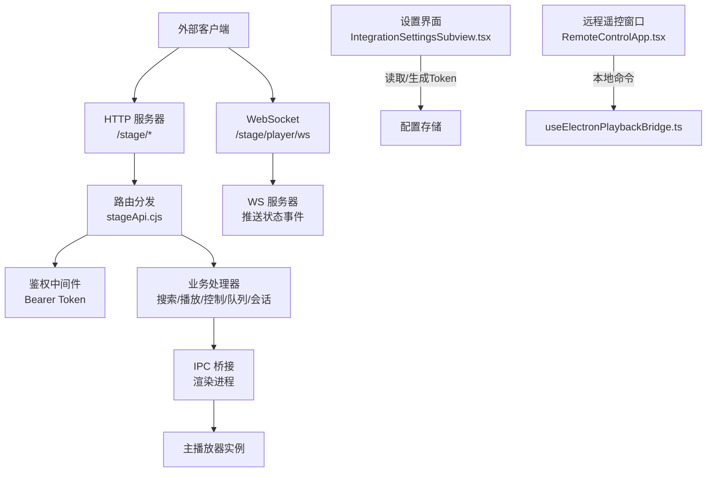
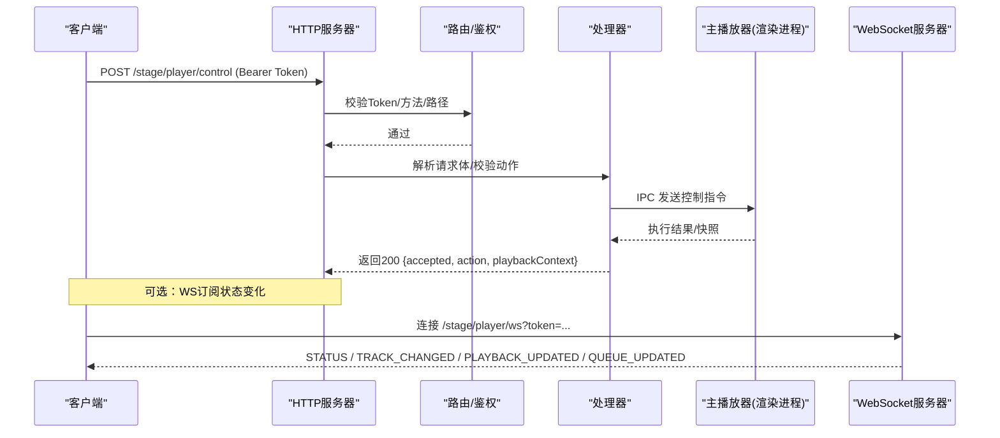
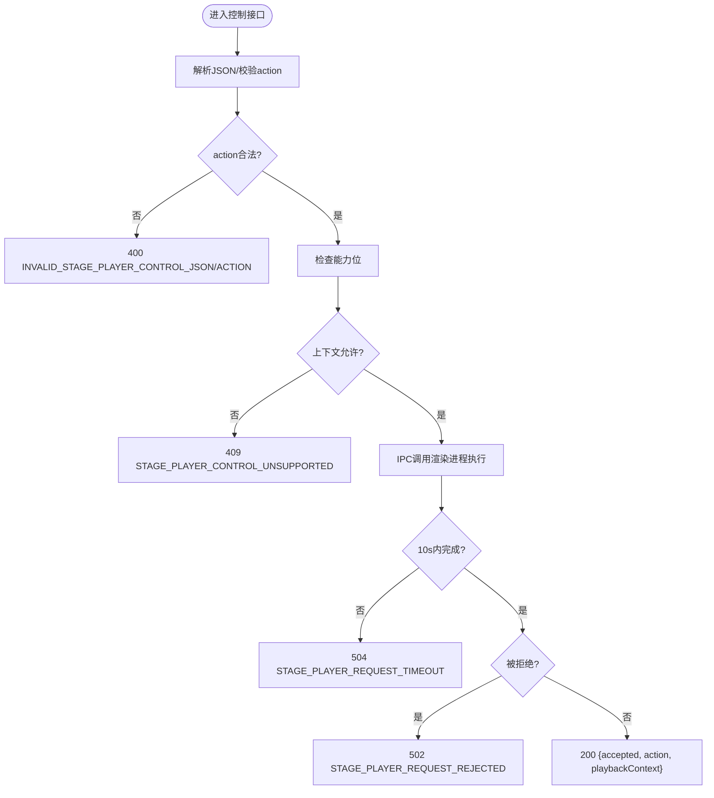
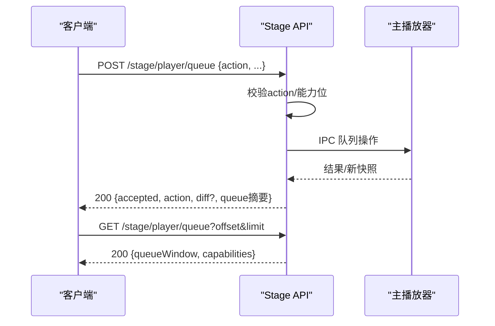
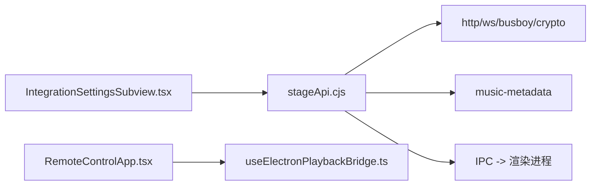

# 外部控制接口

<cite>
**本文引用的文件**
- [electron/stageApi.cjs](file://electron/stageApi.cjs)
- [test/manual/stage-client/API_SCHEMA.md](file://test/manual/stage-client/API_SCHEMA.md)
- [src/types/remoteControl.ts](file://src/types/remoteControl.ts)
- [src/components/remote/RemoteControlApp.tsx](file://src/components/remote/RemoteControlApp.tsx)
- [src/hooks/useElectronPlaybackBridge.ts](file://src/hooks/useElectronPlaybackBridge.ts)
- [src/components/modal/settings/IntegrationSettingsSubview.tsx](file://src/components/modal/settings/IntegrationSettingsSubview.tsx)
</cite>

## 目录
1. [简介](#简介)
2. [项目结构](#项目结构)
3. [核心组件](#核心组件)
4. [架构总览](#架构总览)
5. [详细组件分析](#详细组件分析)
6. [依赖关系分析](#依赖关系分析)
7. [性能与限制](#性能与限制)
8. [故障排查指南](#故障排查指南)
9. [结论](#结论)
10. [附录：API参考与客户端集成示例](#附录api参考与客户端集成示例)

## 简介
本技术文档面向希望以 RESTful API 和 WebSocket 方式远程控制 Folia Player 的开发者。文档覆盖以下主题：
- HTTP 端点定义、请求/响应格式、错误处理机制
- 播放控制 API（播放、暂停、跳转、音量等）
- 队列管理 API（添加、删除、调整顺序、选择、清空）
- 认证与安全机制（Bearer Token、权限控制、请求限制）
- 完整 API 参考与客户端集成示例

Folia 在桌面端内置一个本地 Stage API 服务，默认监听本机地址，提供对外部工具可控的播放器能力，包括搜索、播放、控制、队列编辑以及状态订阅。

## 项目结构
Stage API 由 Electron 进程中的 Node.js 模块实现，并通过 HTTP 服务器暴露路由；同时通过 IPC 与渲染进程交互，驱动主播放器行为。前端侧提供远程遥控窗口与设置界面，用于生成/复制 Token、查看端口与启用开关。

图表来源
- [electron/stageApi.cjs:169-241](file://electron/stageApi.cjs#L169-L241)
- [electron/stageApi.cjs:2082-2114](file://electron/stageApi.cjs#L2082-L2114)
- [src/components/modal/settings/IntegrationSettingsSubview.tsx:519-538](file://src/components/modal/settings/IntegrationSettingsSubview.tsx#L519-L538)
- [src/components/remote/RemoteControlApp.tsx:1-29](file://src/components/remote/RemoteControlApp.tsx#L1-L29)
- [src/hooks/useElectronPlaybackBridge.ts:613-710](file://src/hooks/useElectronPlaybackBridge.ts#L613-L710)

章节来源
- [electron/stageApi.cjs:169-241](file://electron/stageApi.cjs#L169-L241)
- [electron/stageApi.cjs:2082-2114](file://electron/stageApi.cjs#L2082-L2114)
- [src/components/modal/settings/IntegrationSettingsSubview.tsx:519-538](file://src/components/modal/settings/IntegrationSettingsSubview.tsx#L519-L538)
- [src/components/remote/RemoteControlApp.tsx:1-29](file://src/components/remote/RemoteControlApp.tsx#L1-L29)
- [src/hooks/useElectronPlaybackBridge.ts:613-710](file://src/hooks/useElectronPlaybackBridge.ts#L613-L710)

## 核心组件
- Stage API 服务器：基于 Node http + ws，提供 /stage/* 路由，支持 JSON 与 multipart 上传，具备请求体大小限制与超时控制。
- 认证与权限：除健康检查外，所有 HTTP 接口需要 Bearer Token；WebSocket 支持 Header 或查询参数传 token。
- 播放控制：支持 next、prev、pause、resume、seek；是否可用取决于当前播放上下文的能力位。
- 队列管理：支持 append、insert-next、remove、move、select、clear；返回 diff 与 revision，便于增量同步。
- 状态订阅：WebSocket 推送 STATUS、TRACK_CHANGED、PLAYBACK_UPDATED、QUEUE_UPDATED 事件。
- 歌词与会话：支持注入歌词会话或媒体会话（JSON 或 multipart），并维护 activeEntryKind。

章节来源
- [electron/stageApi.cjs:14-54](file://electron/stageApi.cjs#L14-L54)
- [electron/stageApi.cjs:227-241](file://electron/stageApi.cjs#L227-L241)
- [test/manual/stage-client/API_SCHEMA.md:5-12](file://test/manual/stage-client/API_SCHEMA.md#L5-L12)
- [test/manual/stage-client/API_SCHEMA.md:783-863](file://test/manual/stage-client/API_SCHEMA.md#L783-L863)

## 架构总览
Stage API 作为“外部控制面”，将外部请求转换为对主播放器的操作，并通过 WebSocket 将状态变化推送到客户端。

图表来源
- [electron/stageApi.cjs:1732-1746](file://electron/stageApi.cjs#L1732-L1746)
- [electron/stageApi.cjs:2082-2114](file://electron/stageApi.cjs#L2082-L2114)
- [test/manual/stage-client/API_SCHEMA.md:618-663](file://test/manual/stage-client/API_SCHEMA.md#L618-L663)
- [test/manual/stage-client/API_SCHEMA.md:783-863](file://test/manual/stage-client/API_SCHEMA.md#L783-L863)

## 详细组件分析

### 认证与安全机制
- Token 获取与再生成：
  - 首次未设置时自动生成随机 Base64url Token 并持久化到配置存储。
  - 支持重新生成 Token，并在变更后关闭现有 WebSocket 连接。
- 鉴权规则：
  - 除 GET /stage/health 外，所有 HTTP 接口需 Authorization: Bearer <token>。
  - WebSocket 支持两种传参方式：Header 或 ?token=...。
- 请求限制：
  - JSON 请求体上限：2 MiB。
  - multipart 单个 field 上限：2 MiB；单个文件上限：1 GiB；最多 3 个文件、10 个 field、10 个 part。
- 安全建议：
  - 仅在本机访问（默认监听 127.0.0.1）。
  - 定期轮换 Token，避免泄露。
  - 结合防火墙/代理限制访问来源。

章节来源
- [electron/stageApi.cjs:227-241](file://electron/stageApi.cjs#L227-L241)
- [electron/stageApi.cjs:2141-2154](file://electron/stageApi.cjs#L2141-L2154)
- [test/manual/stage-client/API_SCHEMA.md:5-12](file://test/manual/stage-client/API_SCHEMA.md#L5-L12)
- [test/manual/stage-client/API_SCHEMA.md:800-805](file://test/manual/stage-client/API_SCHEMA.md#L800-L805)

### 播放控制 API
- 端点：POST /stage/player/control
- 动作：next、prev、pause、resume、seek（seek 需 positionMs）
- 能力检测：根据当前播放上下文的能力位决定允许的动作；不支持则返回 409。
- 超时：播放器响应超时为 10 秒。
- 典型流程：
  - 客户端携带 Token 发送控制指令。
  - 服务端校验动作合法性与能力位，转发至渲染进程执行。
  - 返回 accepted 与当前上下文。

图表来源
- [electron/stageApi.cjs:1713-1746](file://electron/stageApi.cjs#L1713-L1746)
- [test/manual/stage-client/API_SCHEMA.md:618-663](file://test/manual/stage-client/API_SCHEMA.md#L618-L663)

章节来源
- [electron/stageApi.cjs:1713-1746](file://electron/stageApi.cjs#L1713-L1746)
- [test/manual/stage-client/API_SCHEMA.md:618-663](file://test/manual/stage-client/API_SCHEMA.md#L618-L663)

### 队列管理 API
- 端点：GET /stage/player/queue（分页）、POST /stage/player/queue（编辑）
- 动作：append、insert-next、remove、move、select、clear
- 能力检测：根据 queueCapabilities 判断可执行动作。
- 增量同步：返回 diff 与 revision；若 requiresReload 为 true，应重新拉取完整队列。
- 分页参数：offset、limit（1..500）、around=current（围绕当前项计算 offset）。

图表来源
- [test/manual/stage-client/API_SCHEMA.md:664-781](file://test/manual/stage-client/API_SCHEMA.md#L664-L781)
- [electron/stageApi.cjs:1592-1605](file://electron/stageApi.cjs#L1592-L1605)

章节来源
- [test/manual/stage-client/API_SCHEMA.md:664-781](file://test/manual/stage-client/API_SCHEMA.md#L664-L781)
- [electron/stageApi.cjs:1592-1605](file://electron/stageApi.cjs#L1592-L1605)

### 搜索与播放
- 搜索：POST /stage/player/search，返回候选歌曲列表，供后续播放或追加队列使用。
- 播放：POST /stage/player/play，支持 appendToQueue 模式不打断当前播放；返回队列差异 diff。
- 超时：播放请求超时为 15 秒。

章节来源
- [test/manual/stage-client/API_SCHEMA.md:469-577](file://test/manual/stage-client/API_SCHEMA.md#L469-L577)

### 状态与时间
- 状态：GET /stage/player/status 返回播放器快照（含能力位与队列摘要）。
- 时间校准：GET /stage/player/time 返回当前时间与状态，适合高频轮询。
- 事件订阅：WS /stage/player/ws 推送 STATUS、TRACK_CHANGED、PLAYBACK_UPDATED、QUEUE_UPDATED。

章节来源
- [test/manual/stage-client/API_SCHEMA.md:578-617](file://test/manual/stage-client/API_SCHEMA.md#L578-L617)
- [test/manual/stage-client/API_SCHEMA.md:783-863](file://test/manual/stage-client/API_SCHEMA.md#L783-L863)

### 歌词与会话注入
- 歌词：POST /stage/lyrics，写入 parser-compatible 歌词载荷，切换 activeEntryKind 为 lyrics。
- 媒体会话：POST /stage/session，支持 JSON 或 multipart（音频、歌词、封面），切换 activeEntryKind 为 media。
- 清理：DELETE /stage/state 清空当前外部输入状态。

章节来源
- [test/manual/stage-client/API_SCHEMA.md:342-468](file://test/manual/stage-client/API_SCHEMA.md#L342-L468)
- [test/manual/stage-client/API_SCHEMA.md:865-889](file://test/manual/stage-client/API_SCHEMA.md#L865-L889)

### 音量调节说明
- 当前 Stage API 未暴露独立的音量调节 HTTP 端点。
- 音量控制可通过应用内部遥控通道（Electron 远程窗口）或命令面板实现；该通道属于应用内通信，不对外暴露为公开 REST 接口。
- 若需外部控制音量，可在上层封装自定义协议或通过扩展 Stage API 新增端点。

章节来源
- [src/types/remoteControl.ts:17-36](file://src/types/remoteControl.ts#L17-L36)
- [src/components/remote/RemoteControlApp.tsx:1-29](file://src/components/remote/RemoteControlApp.tsx#L1-L29)
- [src/hooks/useElectronPlaybackBridge.ts:613-710](file://src/hooks/useElectronPlaybackBridge.ts#L613-L710)

## 依赖关系分析
- Stage API 依赖：
  - Node http/ws 构建 HTTP 与 WebSocket 服务。
  - Busboy 处理 multipart 上传。
  - crypto 生成 Token。
  - music-metadata 解析上传音频元数据。
- 运行时依赖：
  - 与渲染进程的 IPC 通信，驱动主播放器。
  - 配置存储（store）保存 Token、端口、模式开关等。
- 前端依赖：
  - 设置界面展示 Stage 状态、Token、端口并提供复制功能。
  - 远程遥控窗口通过本地命令与播放桥接交互。

图表来源
- [electron/stageApi.cjs:1-25](file://electron/stageApi.cjs#L1-L25)
- [electron/stageApi.cjs:787-792](file://electron/stageApi.cjs#L787-L792)
- [src/components/modal/settings/IntegrationSettingsSubview.tsx:519-538](file://src/components/modal/settings/IntegrationSettingsSubview.tsx#L519-L538)
- [src/components/remote/RemoteControlApp.tsx:1-29](file://src/components/remote/RemoteControlApp.tsx#L1-L29)
- [src/hooks/useElectronPlaybackBridge.ts:613-710](file://src/hooks/useElectronPlaybackBridge.ts#L613-L710)

章节来源
- [electron/stageApi.cjs:1-25](file://electron/stageApi.cjs#L1-L25)
- [electron/stageApi.cjs:787-792](file://electron/stageApi.cjs#L787-L792)
- [src/components/modal/settings/IntegrationSettingsSubview.tsx:519-538](file://src/components/modal/settings/IntegrationSettingsSubview.tsx#L519-L538)
- [src/components/remote/RemoteControlApp.tsx:1-29](file://src/components/remote/RemoteControlApp.tsx#L1-L29)
- [src/hooks/useElectronPlaybackBridge.ts:613-710](file://src/hooks/useElectronPlaybackBridge.ts#L613-L710)

## 性能与限制
- 请求体限制：
  - JSON 最大 2 MiB。
  - multipart 单字段最大 2 MiB，单文件最大 1 GiB，最多 3 个文件、10 个 field、10 个 part。
- 超时控制：
  - 播放请求 15 秒超时。
  - 控制/队列请求 10 秒超时。
- 队列分页：
  - limit 范围 1..500，默认 100。
  - around=current 可围绕当前项计算偏移。
- 资源清理：
  - 会话工作目录会按保留策略清理，避免磁盘占用。

章节来源
- [electron/stageApi.cjs:14-25](file://electron/stageApi.cjs#L14-L25)
- [electron/stageApi.cjs:690-715](file://electron/stageApi.cjs#L690-L715)
- [test/manual/stage-client/API_SCHEMA.md:441-447](file://test/manual/stage-client/API_SCHEMA.md#L441-L447)
- [test/manual/stage-client/API_SCHEMA.md:668-682](file://test/manual/stage-client/API_SCHEMA.md#L668-L682)

## 故障排查指南
- 401 Unauthorized：
  - 检查 Authorization 头是否包含正确的 Bearer Token。
  - 确认 Stage 已启用且端口正确。
- 409 Conflict：
  - 当前播放上下文不支持该动作（如只读模式）。
  - 检查 controlCapabilities/queueCapabilities。
- 503 Service Unavailable：
  - Stage 未启用或主窗口不可用。
- 504 Request Timeout：
  - 播放器未在限定时间内响应，重试或检查主窗口状态。
- 502 Request Rejected：
  - 渲染进程拒绝请求，检查上下文与权限。
- 413 Body Too Large：
  - 请求体或文件超过限制，拆分或压缩。

章节来源
- [test/manual/stage-client/API_SCHEMA.md:800-805](file://test/manual/stage-client/API_SCHEMA.md#L800-L805)
- [test/manual/stage-client/API_SCHEMA.md:652-663](file://test/manual/stage-client/API_SCHEMA.md#L652-L663)
- [test/manual/stage-client/API_SCHEMA.md:772-781](file://test/manual/stage-client/API_SCHEMA.md#L772-L781)
- [electron/stageApi.cjs:56-64](file://electron/stageApi.cjs#L56-L64)

## 结论
Folia 的 Stage API 提供了稳定、可扩展的外部控制能力，涵盖搜索、播放、控制、队列管理与状态订阅。通过 Bearer Token 鉴权与严格的请求限制，确保本地集成的安全性与稳定性。对于音量控制等未暴露的端点，可通过应用内遥控通道或扩展 API 实现。

## 附录：API参考与客户端集成示例

### 通用约定
- 基础地址：http://127.0.0.1:<port>/stage/*（端口以设置为准）
- 鉴权：Authorization: Bearer <token>（健康检查除外）
- Content-Type：application/json（部分接口支持 multipart/form-data）
- 时间字段：毫秒；sampledAtMs/updatedAt 为 Unix epoch 毫秒

章节来源
- [test/manual/stage-client/API_SCHEMA.md:5-12](file://test/manual/stage-client/API_SCHEMA.md#L5-L12)

### 端点清单
- GET /stage/health：连通性探测，无需鉴权
- GET /stage/status：读取 Stage 状态
- POST /stage/lyrics：写入歌词会话
- POST /stage/session：写入媒体会话（JSON/multipart）
- DELETE /stage/state：清空外部输入状态
- POST /stage/player/search：搜索歌曲
- POST /stage/player/play：播放或追加队列
- GET /stage/player/status：播放器快照
- GET /stage/player/time：时间校准
- POST /stage/player/control：控制指令（next/prev/pause/resume/seek）
- GET /stage/player/queue：分页读取队列
- POST /stage/player/queue：队列编辑（append/insert-next/remove/move/select/clear）
- WS /stage/player/ws：状态事件订阅

章节来源
- [test/manual/stage-client/API_SCHEMA.md:302-889](file://test/manual/stage-client/API_SCHEMA.md#L302-L889)

### 客户端集成步骤（示例）
- 获取 Token 与端口：
  - 在设置界面中启用 Stage 模式，复制 Token 与地址。
- 发起控制请求：
  - 使用 HTTP 客户端发送带 Bearer Token 的请求到对应端点。
- 订阅状态：
  - 建立 WebSocket 连接，接收 STATUS/TRACK_CHANGED/PLAYBACK_UPDATED/QUEUE_UPDATED。
- 队列同步：
  - 使用 diff/revision 进行增量更新；必要时重拉完整队列。

章节来源
- [src/components/modal/settings/IntegrationSettingsSubview.tsx:519-538](file://src/components/modal/settings/IntegrationSettingsSubview.tsx#L519-L538)
- [test/manual/stage-client/API_SCHEMA.md:783-863](file://test/manual/stage-client/API_SCHEMA.md#L783-L863)