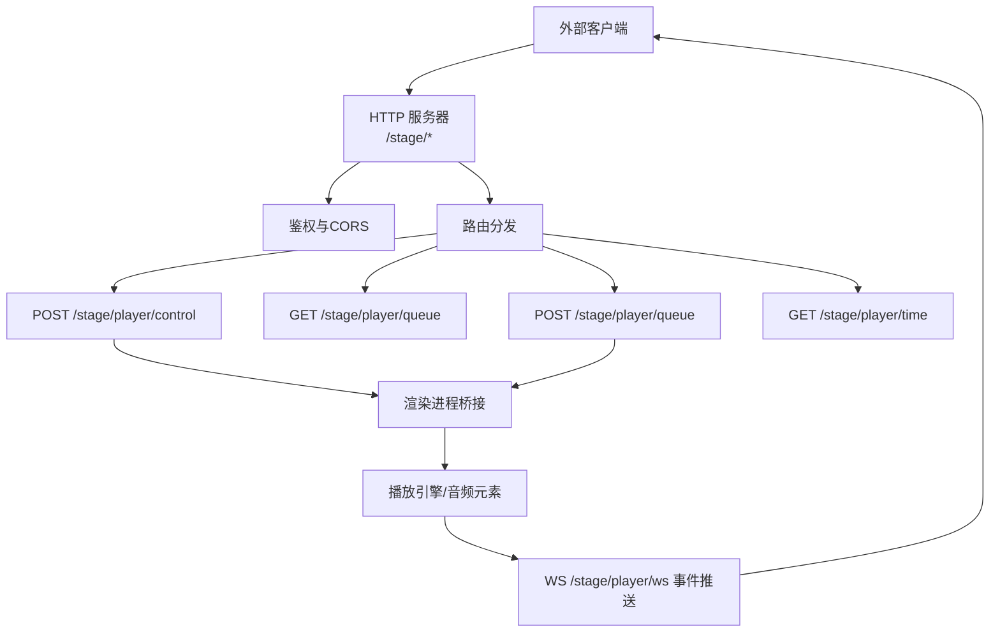
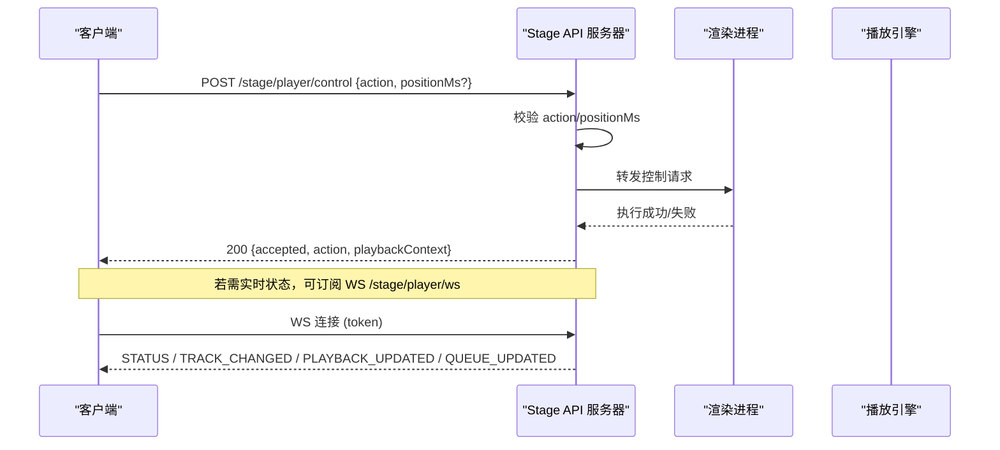
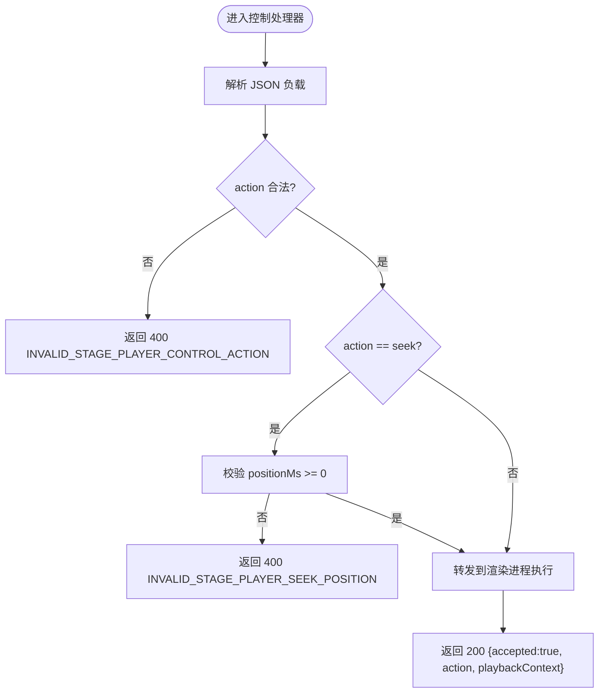
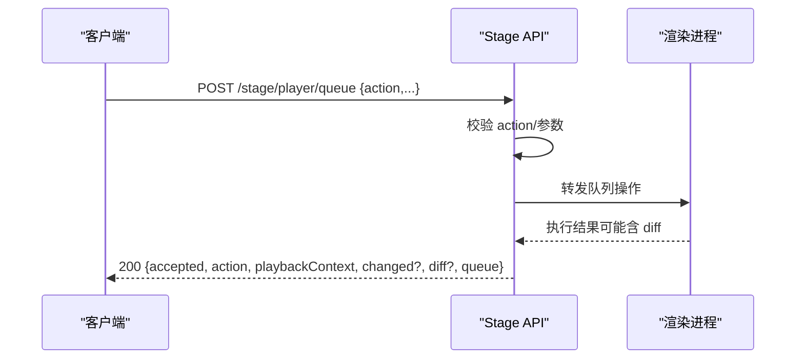
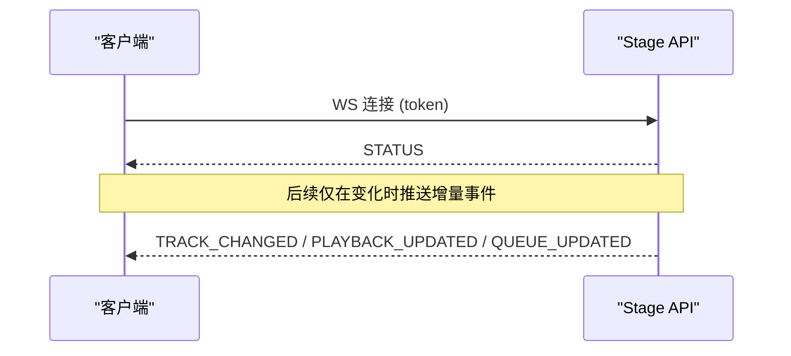
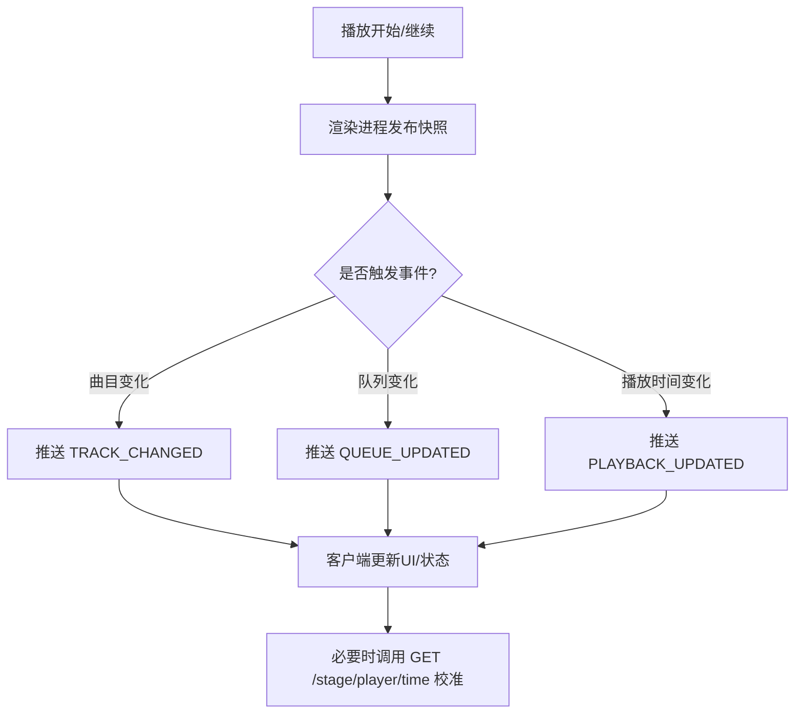
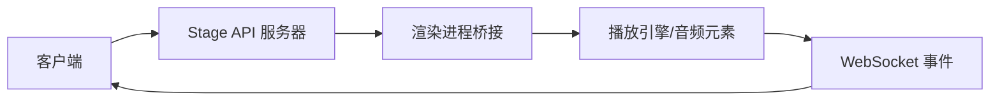

# 播放控制API

<cite>
**本文引用的文件**
- [electron/stageApi.cjs](file://electron/stageApi.cjs)
- [test/manual/stage-client/API_SCHEMA.md](file://test/manual/stage-client/API_SCHEMA.md)
- [src/hooks/useElectronPlaybackBridge.ts](file://src/hooks/useElectronPlaybackBridge.ts)
- [src/utils/stageClientDemo.ts](file://src/utils/stageClientDemo.ts)
- [src/types/remoteControl.ts](file://src/types/remoteControl.ts)
- [src/components/panelTab/controls/VolumeRow.tsx](file://src/components/panelTab/controls/VolumeRow.tsx)
- [src/stores/useSettingsUiStore.ts](file://src/stores/useSettingsUiStore.ts)
- [src/services/playerCapProvider.ts](file://src/services/playerCapProvider.ts)
- [src/types/playerCap.ts](file://src/types/playerCap.ts)
</cite>

## 目录
1. [简介](#简介)
2. [项目结构](#项目结构)
3. [核心组件](#核心组件)
4. [架构总览](#架构总览)
5. [详细组件分析](#详细组件分析)
6. [依赖关系分析](#依赖关系分析)
7. [性能考虑](#性能考虑)
8. [故障排查指南](#故障排查指南)
9. [结论](#结论)
10. [附录](#附录)

## 简介
本技术文档聚焦 Folia Player 的“播放控制 API”，面向外部集成与二次开发，覆盖以下能力：
- 播放控制：播放、暂停、上一首、下一首、跳转（seek）
- 队列管理：追加、插入、删除、移动、选择、清空
- 状态同步：实时状态更新、位置同步、播放进度跟踪
- 认证与安全：Bearer Token 鉴权、CORS 预检
- 错误处理：统一错误码与 HTTP 状态码约定
- 集成实践：请求头设置、重试策略、最佳实践

该 API 以本地 HTTP 服务形式暴露，默认端口可在设置中配置。所有接口（除健康检查外）均要求携带 Bearer Token 进行鉴权。

## 项目结构
播放控制相关代码主要分布在以下模块：
- electron/stageApi.cjs：Stage API 服务端实现，负责路由、鉴权、参数校验、转发到渲染进程并广播事件
- test/manual/stage-client/API_SCHEMA.md：官方 API Schema，定义端点、请求/响应结构与错误码
- src/hooks/useElectronPlaybackBridge.ts：Electron 桥接层，将 Stage 控制指令落地为实际播放行为（如 seek、resume）
- src/utils/stageClientDemo.ts：客户端请求构造工具，演示如何拼装控制请求
- src/types/remoteControl.ts：远程遥控窗口使用的播放快照与控制命令类型
- src/components/panelTab/controls/VolumeRow.tsx：音量 UI 控件（用于本地交互，非 HTTP API）
- src/stores/useSettingsUiStore.ts：音量等设置持久化与切换逻辑
- src/services/playerCapProvider.ts 与 src/types/playerCap.ts：第三方播放器能力发现与连接（可选扩展）

**图示来源**
- [electron/stageApi.cjs:1837-1946](file://electron/stageApi.cjs#L1837-L1946)
- [electron/stageApi.cjs:620-641](file://electron/stageApi.cjs#L620-L641)

**章节来源**
- [electron/stageApi.cjs:1-200](file://electron/stageApi.cjs#L1-L200)
- [test/manual/stage-client/API_SCHEMA.md:1-12](file://test/manual/stage-client/API_SCHEMA.md#L1-L12)

## 核心组件
- 播放控制处理器：解析 action（next/prev/pause/resume/seek），校验参数，转发至渲染进程执行，返回接受结果
- 队列处理器：支持 append/insert-next/remove/move/select/clear，返回变更摘要或 diff
- 时间查询：返回当前播放位置、时长、采样时间，并在播放中进行时间补偿
- WebSocket 事件：TRACK_CHANGED、PLAYBACK_UPDATED、QUEUE_UPDATED、STATUS
- 鉴权与 CORS：所有接口（除健康检查）需要 Authorization: Bearer <token>；OPTIONS 预检放行必要头与方法

**章节来源**
- [electron/stageApi.cjs:1713-1758](file://electron/stageApi.cjs#L1713-L1758)
- [electron/stageApi.cjs:1805-1835](file://electron/stageApi.cjs#L1805-L1835)
- [electron/stageApi.cjs:1930-1937](file://electron/stageApi.cjs#L1930-L1937)
- [electron/stageApi.cjs:620-641](file://electron/stageApi.cjs#L620-L641)
- [test/manual/stage-client/API_SCHEMA.md:600-663](file://test/manual/stage-client/API_SCHEMA.md#L600-L663)
- [test/manual/stage-client/API_SCHEMA.md:664-781](file://test/manual/stage-client/API_SCHEMA.md#L664-L781)
- [test/manual/stage-client/API_SCHEMA.md:783-863](file://test/manual/stage-client/API_SCHEMA.md#L783-L863)

## 架构总览
Stage API 作为桌面端本地服务，提供 HTTP + WebSocket 双通道：
- HTTP 用于控制指令与数据读取
- WebSocket 用于增量事件推送（曲目变化、播放时间更新、队列变化）

**图示来源**
- [electron/stageApi.cjs:1732-1758](file://electron/stageApi.cjs#L1732-L1758)
- [electron/stageApi.cjs:620-641](file://electron/stageApi.cjs#L620-L641)
- [test/manual/stage-client/API_SCHEMA.md:618-663](file://test/manual/stage-client/API_SCHEMA.md#L618-L663)
- [test/manual/stage-client/API_SCHEMA.md:783-863](file://test/manual/stage-client/API_SCHEMA.md#L783-L863)

## 详细组件分析

### 播放控制端点：POST /stage/player/control
- 功能：发送播放控制指令（next/prev/pause/resume/seek）
- 请求体字段：
  - action：枚举值，必填
  - positionMs：当 action=seek 时必填，必须为非负整数
- 响应：
  - accepted：true
  - action：本次动作
  - playbackContext：接受指令时的播放上下文
- 错误：
  - 400：JSON 解析失败、非法 action、非法 seek 位置
  - 409：当前上下文不支持该动作
  - 503：Stage 不可用
  - 504：超时
  - 502：渲染进程拒绝

**图示来源**
- [electron/stageApi.cjs:1732-1758](file://electron/stageApi.cjs#L1732-L1758)
- [test/manual/stage-client/API_SCHEMA.md:618-663](file://test/manual/stage-client/API_SCHEMA.md#L618-L663)

**章节来源**
- [electron/stageApi.cjs:1713-1758](file://electron/stageApi.cjs#L1713-L1758)
- [test/manual/stage-client/API_SCHEMA.md:618-663](file://test/manual/stage-client/API_SCHEMA.md#L618-L663)

### 队列操作端点：GET/POST /stage/player/queue
- GET：分页读取队列详情，支持 offset/limit/around=current
- POST：编辑队列，支持 append/insert-next/remove/move/select/clear
- 响应包含：
  - playbackContext、queueCapabilities
  - queue：摘要或窗口（items、offset、limit、returned、hasMore、nextOffset）
  - 变更反馈：changed/deduplicated/affectedCount/diff（diff 可能要求重新拉取）

**图示来源**
- [electron/stageApi.cjs:1805-1835](file://electron/stageApi.cjs#L1805-L1835)
- [test/manual/stage-client/API_SCHEMA.md:664-781](file://test/manual/stage-client/API_SCHEMA.md#L664-L781)

**章节来源**
- [electron/stageApi.cjs:1760-1835](file://electron/stageApi.cjs#L1760-L1835)
- [test/manual/stage-client/API_SCHEMA.md:664-781](file://test/manual/stage-client/API_SCHEMA.md#L664-L781)

### 时间查询端点：GET /stage/player/time
- 返回：playbackContext、playerState、positionMs、durationMs、sampledAtMs
- 说明：播放中会进行时间补偿，positionMs 限制在 durationMs 内

**章节来源**
- [electron/stageApi.cjs:1930-1933](file://electron/stageApi.cjs#L1930-L1933)
- [test/manual/stage-client/API_SCHEMA.md:600-617](file://test/manual/stage-client/API_SCHEMA.md#L600-L617)

### WebSocket 事件：WS /stage/player/ws
- 连接方式：ws://host:port/stage/player/ws?token=<token> 或 Authorization: Bearer <token>
- 事件：
  - STATUS：完整快照（不含完整 items）
  - TRACK_CHANGED：曲目/状态/能力/队列摘要变化
  - PLAYBACK_UPDATED：播放时间与状态更新
  - QUEUE_UPDATED：队列摘要变化（前后对比）

**图示来源**
- [electron/stageApi.cjs:620-641](file://electron/stageApi.cjs#L620-L641)
- [test/manual/stage-client/API_SCHEMA.md:783-863](file://test/manual/stage-client/API_SCHEMA.md#L783-L863)

**章节来源**
- [test/manual/stage-client/API_SCHEMA.md:783-863](file://test/manual/stage-client/API_SCHEMA.md#L783-L863)

### 播放状态同步机制
- 实时状态更新：通过 WebSocket 推送 TRACK_CHANGED、PLAYBACK_UPDATED、QUEUE_UPDATED
- 位置同步：GET /stage/player/time 返回 positionMs，并在播放中做时间补偿
- 播放进度跟踪：客户端可结合 sampledAtMs 计算漂移，必要时轮询 time 接口校准

**图示来源**
- [electron/stageApi.cjs:620-641](file://electron/stageApi.cjs#L620-L641)
- [test/manual/stage-client/API_SCHEMA.md:807-863](file://test/manual/stage-client/API_SCHEMA.md#L807-L863)

**章节来源**
- [electron/stageApi.cjs:620-641](file://electron/stageApi.cjs#L620-L641)
- [test/manual/stage-client/API_SCHEMA.md:807-863](file://test/manual/stage-client/API_SCHEMA.md#L807-L863)

### 音量调节与本地集成
- HTTP API 未直接暴露音量控制端点；音量通过本地 UI 与设置存储管理
- VolumeRow 组件提供滑块与百分比显示，配合 useSettingsUiStore 持久化音量与静音状态
- 如需远程控制音量，可通过 Electron 桥接或 Media Session 控制路径间接实现

**章节来源**
- [src/components/panelTab/controls/VolumeRow.tsx:1-99](file://src/components/panelTab/controls/VolumeRow.tsx#L1-L99)
- [src/stores/useSettingsUiStore.ts:3377-3449](file://src/stores/useSettingsUiStore.ts#L3377-L3449)

### 认证与请求头
- 所有接口（除健康检查）需要 Authorization: Bearer <token>
- 请求体使用 Content-Type: application/json
- OPTIONS 预检允许跨域访问，放行 Authorization 与 Content-Type

**章节来源**
- [test/manual/stage-client/API_SCHEMA.md:5-12](file://test/manual/stage-client/API_SCHEMA.md#L5-L12)
- [electron/stageApi.cjs:1841-1848](file://electron/stageApi.cjs#L1841-L1848)
- [electron/stageApi.cjs:1915-1918](file://electron/stageApi.cjs#L1915-L1918)

### 客户端请求构造示例
- 使用 stageClientDemo 中的构建函数生成控制请求，自动附加 Bearer 头与 JSON 体
- 示例：构建 seek 请求时，确保 positionMs 为整数且非负

**章节来源**
- [src/utils/stageClientDemo.ts:446-480](file://src/utils/stageClientDemo.ts#L446-L480)

### 远程遥控与播放快照
- RemoteControlSnapshot 描述远程窗口可见的播放快照，包括 trackKey、currentTime、duration、playerState、loopMode 等
- 可用于多窗口/多设备场景下的状态一致性展示

**章节来源**
- [src/types/remoteControl.ts:1-80](file://src/types/remoteControl.ts#L1-L80)

### 第三方播放器能力发现（可选）
- PlayerCapProvider 提供 service-status 查询与 WebSocket 事件订阅，用于发现外部播放器能力与连接状态
- 适用于集成第三方播放器或扩展播放源的场景

**章节来源**
- [src/services/playerCapProvider.ts:22-56](file://src/services/playerCapProvider.ts#L22-L56)
- [src/types/playerCap.ts:85-121](file://src/types/playerCap.ts#L85-L121)

## 依赖关系分析
- Stage API 依赖 Electron 主进程提供的窗口与设置能力
- 控制指令最终由渲染进程执行，并通过 WebSocket 广播事件
- 客户端通过 HTTP 与 WS 两种通道协作：HTTP 用于控制与数据读取，WS 用于实时事件

**图示来源**
- [electron/stageApi.cjs:1837-1946](file://electron/stageApi.cjs#L1837-L1946)
- [electron/stageApi.cjs:620-641](file://electron/stageApi.cjs#L620-L641)

**章节来源**
- [electron/stageApi.cjs:1837-1946](file://electron/stageApi.cjs#L1837-L1946)
- [electron/stageApi.cjs:620-641](file://electron/stageApi.cjs#L620-L641)

## 性能考虑
- 时间补偿：GET /stage/player/time 在播放中返回补偿后的 positionMs，减少客户端计算负担
- 增量事件：WebSocket 仅推送变化事件，降低带宽与处理开销
- 队列分页：GET /stage/player/queue 支持 offset/limit，避免一次性加载大量数据
- 超时与拒绝：控制与队列请求有超时与拒绝机制，防止阻塞

[本节为通用指导，不直接分析具体文件]

## 故障排查指南
- 401 Unauthorized：检查 Authorization 头是否正确
- 400 错误：检查 JSON 格式、action 枚举、seek 位置合法性
- 409 错误：当前播放上下文不支持该动作，查看 controlCapabilities/queueCapabilities
- 503 Service Unavailable：Stage 未启用或主窗口不可用
- 504 Timeout：播放器未在 10 秒内响应，检查渲染进程状态
- 502 Rejected：渲染进程拒绝请求，查看日志与桥接逻辑

**章节来源**
- [test/manual/stage-client/API_SCHEMA.md:652-663](file://test/manual/stage-client/API_SCHEMA.md#L652-L663)
- [test/manual/stage-client/API_SCHEMA.md:772-781](file://test/manual/stage-client/API_SCHEMA.md#L772-L781)
- [electron/stageApi.cjs:1713-1758](file://electron/stageApi.cjs#L1713-L1758)
- [electron/stageApi.cjs:1805-1835](file://electron/stageApi.cjs#L1805-L1835)

## 结论
Folia Player 的播放控制 API 提供了稳定、清晰的 HTTP + WebSocket 契约，支持完整的播放控制、队列管理与状态同步。通过统一的错误码与鉴权机制，便于外部系统集成。建议采用 WebSocket 进行实时状态同步，并结合 HTTP 进行控制与数据读取，以获得最佳体验与性能。

[本节为总结性内容，不直接分析具体文件]

## 附录
- 常用端点速查：
  - POST /stage/player/control：播放控制
  - GET /stage/player/queue：读取队列
  - POST /stage/player/queue：编辑队列
  - GET /stage/player/time：查询播放时间
  - WS /stage/player/ws：订阅事件
- 最佳实践：
  - 始终携带 Authorization: Bearer <token>
  - 使用 Content-Type: application/json
  - 对 seek 操作确保 positionMs 为非负整数
  - 利用 WebSocket 增量事件减少轮询
  - 遇到 409/503/504 时实施退避重试

[本节为补充信息，不直接分析具体文件]