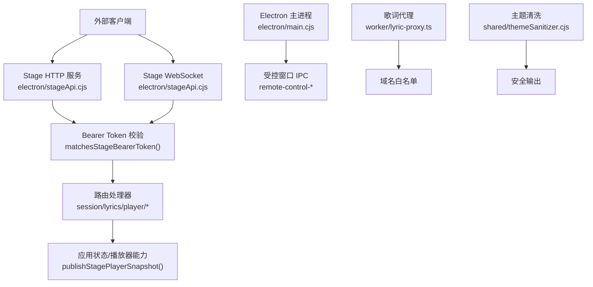
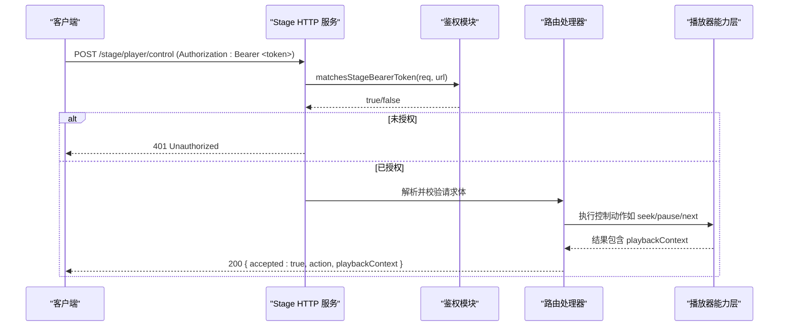
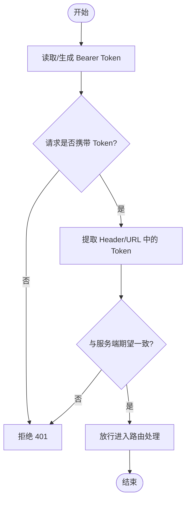
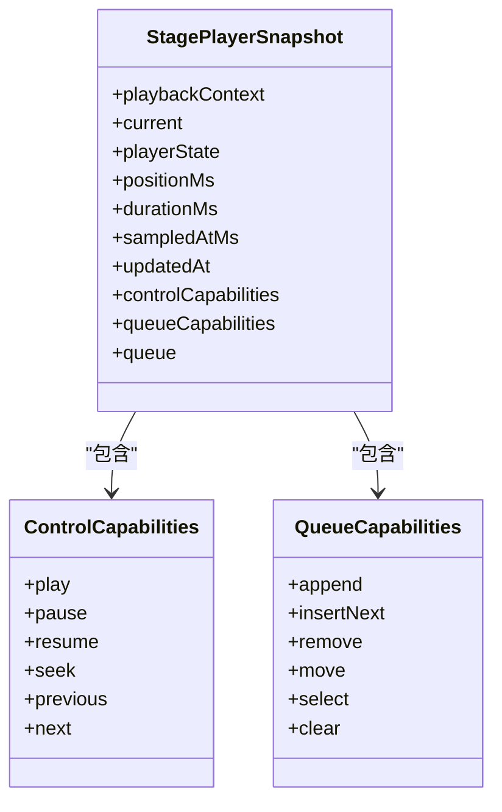
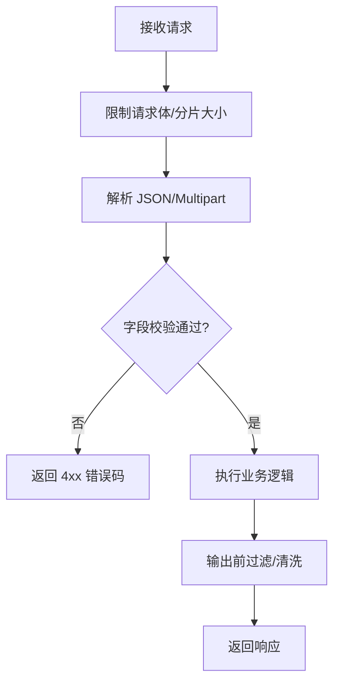
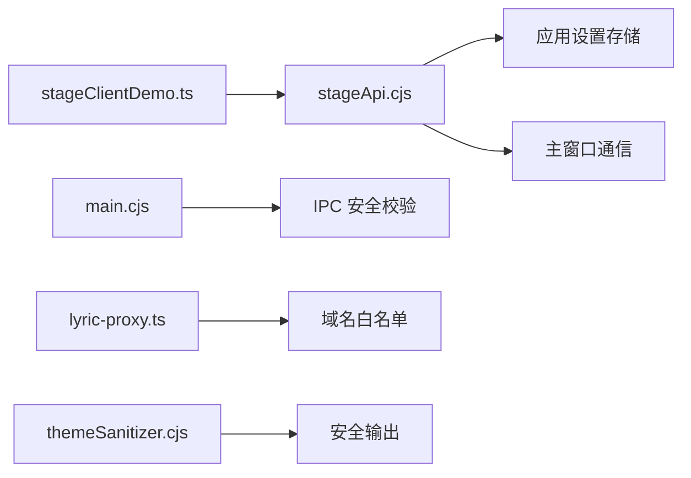

# 认证与安全

<cite>
**本文引用的文件**
- [electron/stageApi.cjs](file://electron/stageApi.cjs)
- [src/utils/stageClientDemo.ts](file://src/utils/stageClientDemo.ts)
- [test/manual/stage-client/API_SCHEMA.md](file://test/manual/stage-client/API_SCHEMA.md)
- [electron/main.cjs](file://electron/main.cjs)
- [worker/lyric-proxy.ts](file://worker/lyric-proxy.ts)
- [shared/themeSanitizer.cjs](file://shared/themeSanitizer.cjs)
- [electron/modSystem/modApi.cjs](file://electron/modSystem/modApi.cjs)
- [electron/modSystem/modSystem.cjs](file://electron/modSystem/modSystem.cjs)
</cite>

## 目录
1. [简介](#简介)
2. [项目结构](#项目结构)
3. [核心组件](#核心组件)
4. [架构总览](#架构总览)
5. [详细组件分析](#详细组件分析)
6. [依赖关系分析](#依赖关系分析)
7. [性能与资源限制](#性能与资源限制)
8. [故障排查指南](#故障排查指南)
9. [结论](#结论)
10. [附录：安全配置与最佳实践](#附录：安全配置与最佳实践)

## 简介
本文件聚焦 Folia Player 的“外部控制接口”（Stage API）的认证与安全机制，系统性说明 Bearer Token 的生成、存储、验证流程；权限控制模型（基于播放上下文的能力位）；请求安全措施（输入校验、输出过滤、防攻击保护）；以及安全配置与最佳实践（Token 管理、网络安全、日志审计）。文档面向开发者与集成方，帮助安全地接入本地 Stage API。

## 项目结构
与认证与安全直接相关的代码主要分布在以下位置：
- 服务端实现：electron/stageApi.cjs（HTTP/WS 服务、鉴权、输入校验、CORS、限流与大小限制、会话清理等）
- 客户端工具：src/utils/stageClientDemo.ts（构造请求、前置校验、Bearer 头构建）
- 契约文档：test/manual/stage-client/API_SCHEMA.md（接口约定、错误码、鉴权方式）
- Electron 主进程安全：electron/main.cjs（IPC 可信来源校验、CORS 绕过策略、权限拦截）
- 歌词代理安全：worker/lyric-proxy.ts（域名白名单、头部过滤、CORS 响应头）
- 主题数据清洗：shared/themeSanitizer.cjs（颜色值白名单、默认回退）
- 模组权限：electron/modSystem/modApi.cjs、modSystem.cjs（声明式权限、最小权限、失败关闭）

图表来源
- [electron/stageApi.cjs:892-915](file://electron/stageApi.cjs#L892-L915)
- [electron/stageApi.cjs:227-241](file://electron/stageApi.cjs#L227-L241)
- [electron/stageApi.cjs:802-868](file://electron/stageApi.cjs#L802-L868)
- [electron/main.cjs:1637-1752](file://electron/main.cjs#L1637-L1752)
- [worker/lyric-proxy.ts:39-110](file://worker/lyric-proxy.ts#L39-L110)
- [shared/themeSanitizer.cjs:1-57](file://shared/themeSanitizer.cjs#L1-L57)

章节来源
- [electron/stageApi.cjs:1-241](file://electron/stageApi.cjs#L1-L241)
- [electron/stageApi.cjs:802-915](file://electron/stageApi.cjs#L802-L915)
- [electron/main.cjs:1637-1752](file://electron/main.cjs#L1637-L1752)
- [worker/lyric-proxy.ts:39-110](file://worker/lyric-proxy.ts#L39-L110)
- [shared/themeSanitizer.cjs:1-57](file://shared/themeSanitizer.cjs#L1-L57)

## 核心组件
- Bearer Token 生命周期
  - 生成：随机令牌，持久化到应用设置中，供后续请求校验。
  - 存储：通过 store 存取，支持按需生成或重新生成。
  - 验证：从 Authorization 头或查询参数提取并比对。
- 权限控制模型
  - 基于播放上下文的“能力位”（controlCapabilities/queueCapabilities），由服务端根据当前上下文动态计算。
  - 不同上下文（normal-playback、stage-session、external-playback-source）对控制与队列操作有不同限制。
- 请求安全
  - 输入校验：严格枚举、类型与范围检查；JSON 与 multipart 分别限制大小与数量。
  - 输出过滤：统一 JSON 响应体结构；二进制/文件响应附带 CORS 头；主题等敏感数据经清洗。
  - 防攻击：请求体大小限制、文件上传限制、字节范围校验、超时与取消、会话清理。
- 网络安全
  - 仅监听本地地址；CORS 允许跨域但需 Token；WebSocket 支持 Header 与 URL 两种鉴权。
  - 歌词代理域名白名单与头部过滤。
- 日志与审计
  - 关键事件记录（Token 生成/变更、会话创建/清理、错误与异常）。

章节来源
- [electron/stageApi.cjs:227-241](file://electron/stageApi.cjs#L227-L241)
- [electron/stageApi.cjs:892-915](file://electron/stageApi.cjs#L892-L915)
- [electron/stageApi.cjs:315-341](file://electron/stageApi.cjs#L315-L341)
- [electron/stageApi.cjs:870-890](file://electron/stageApi.cjs#L870-L890)
- [electron/stageApi.cjs:917-1031](file://electron/stageApi.cjs#L917-L1031)
- [electron/stageApi.cjs:825-868](file://electron/stageApi.cjs#L825-L868)
- [worker/lyric-proxy.ts:39-110](file://worker/lyric-proxy.ts#L39-L110)

## 架构总览
Stage API 作为桌面端本地 HTTP/WS 服务，提供歌词注入、媒体会话、搜索、播放控制与队列编辑等能力。所有非健康检查接口均需 Bearer Token。服务端在入口处进行鉴权与输入校验，随后将请求转发至主播放器能力层，并以标准化响应返回。

图表来源
- [electron/stageApi.cjs:892-915](file://electron/stageApi.cjs#L892-L915)
- [electron/stageApi.cjs:802-868](file://electron/stageApi.cjs#L802-L868)
- [test/manual/stage-client/API_SCHEMA.md:618-663](file://test/manual/stage-client/API_SCHEMA.md#L618-L663)

章节来源
- [electron/stageApi.cjs:802-915](file://electron/stageApi.cjs#L802-L915)
- [test/manual/stage-client/API_SCHEMA.md:618-663](file://test/manual/stage-client/API_SCHEMA.md#L618-L663)

## 详细组件分析

### Bearer Token 认证流程
- 生成与存储
  - 首次访问时若缺失则生成随机令牌并写入设置；支持手动重新生成。
  - 令牌变更后主动断开已连接的 WebSocket，强制下游刷新凭证。
- 提取与校验
  - 支持从 Authorization 头或查询参数中提取；与服务端期望令牌逐字比较。
  - 未匹配即拒绝连接或请求。
- 客户端侧
  - 客户端工具负责构造 Authorization 头并进行基础参数校验。

图表来源
- [electron/stageApi.cjs:227-241](file://electron/stageApi.cjs#L227-L241)
- [electron/stageApi.cjs:892-915](file://electron/stageApi.cjs#L892-L915)
- [src/utils/stageClientDemo.ts:88-103](file://src/utils/stageClientDemo.ts#L88-L103)

章节来源
- [electron/stageApi.cjs:227-241](file://electron/stageApi.cjs#L227-L241)
- [electron/stageApi.cjs:892-915](file://electron/stageApi.cjs#L892-L915)
- [src/utils/stageClientDemo.ts:88-103](file://src/utils/stageClientDemo.ts#L88-L103)
- [test/manual/stage-client/API_SCHEMA.md:783-805](file://test/manual/stage-client/API_SCHEMA.md#L783-L805)

### 权限控制模型（能力位）
- 播放上下文
  - normal-playback：可编辑队列、完整控制。
  - stage-session / external-playback-source：可能只读或受限控制。
- 能力位
  - controlCapabilities：play/pause/resume/seek/previous/next。
  - queueCapabilities：append/insert-next/remove/move/select/clear。
- 服务端根据上下文与当前播放项动态计算能力位，并在响应中返回，客户端据此决定可用操作。

图表来源
- [electron/stageApi.cjs:315-341](file://electron/stageApi.cjs#L315-L341)
- [electron/stageApi.cjs:394-415](file://electron/stageApi.cjs#L394-L415)
- [test/manual/stage-client/API_SCHEMA.md:207-283](file://test/manual/stage-client/API_SCHEMA.md#L207-L283)

章节来源
- [electron/stageApi.cjs:315-341](file://electron/stageApi.cjs#L315-L341)
- [electron/stageApi.cjs:394-415](file://electron/stageApi.cjs#L394-L415)
- [test/manual/stage-client/API_SCHEMA.md:207-283](file://test/manual/stage-client/API_SCHEMA.md#L207-L283)

### 请求安全措施
- 输入校验
  - 枚举白名单：action、lyricsFormat、playbackContext、playerState 等。
  - 数值范围：positionMs 非负、limit/offset 边界、队列长度限制。
  - 互斥字段：audioUrl 与 audioFile 二选一；lyricsText 与 lyricsFile 二选一。
  - JSON 解析失败、非法字段均返回明确错误码。
- 输出过滤
  - 统一 JSON 响应结构；二进制/文件响应附带标准 CORS 头。
  - 主题等用户可控数据经 sanitizer 清洗后输出。
- 防攻击保护
  - 请求体大小限制（JSON 2 MiB）、multipart field/file/part 数量与大小限制。
  - 字节范围 Range 校验，越界返回 416。
  - 请求超时与取消：播放/控制请求有超时，取消时清理待处理请求。
  - 会话清理：保留最近 N 个会话，自动删除旧工作目录。

图表来源
- [electron/stageApi.cjs:870-890](file://electron/stageApi.cjs#L870-L890)
- [electron/stageApi.cjs:917-1031](file://electron/stageApi.cjs#L917-L1031)
- [electron/stageApi.cjs:825-868](file://electron/stageApi.cjs#L825-L868)
- [shared/themeSanitizer.cjs:1-57](file://shared/themeSanitizer.cjs#L1-L57)

章节来源
- [electron/stageApi.cjs:870-890](file://electron/stageApi.cjs#L870-L890)
- [electron/stageApi.cjs:917-1031](file://electron/stageApi.cjs#L917-L1031)
- [electron/stageApi.cjs:825-868](file://electron/stageApi.cjs#L825-L868)
- [shared/themeSanitizer.cjs:1-57](file://shared/themeSanitizer.cjs#L1-L57)

### 网络安全与 IPC 安全
- 网络
  - 服务仅绑定本地地址；CORS 开放但要求 Token。
  - WebSocket 支持 Authorization 头与 ?token= 两种方式。
- Electron 主进程
  - IPC 调用需来自可信来源（主窗口或远程控件窗口），否则抛出错误。
  - 针对特定域名（如音乐平台）进行 CORS 响应头覆盖以兼容跨域媒体加载。
- 歌词代理
  - 仅允许白名单域名；过滤不需要的请求头；为响应添加 CORS 头。

章节来源
- [electron/stageApi.cjs:2082-2114](file://electron/stageApi.cjs#L2082-L2114)
- [electron/stageApi.cjs:648-676](file://electron/stageApi.cjs#L648-L676)
- [electron/main.cjs:1637-1752](file://electron/main.cjs#L1637-L1752)
- [worker/lyric-proxy.ts:39-110](file://worker/lyric-proxy.ts#L39-L110)

### 日志与审计
- 关键事件：Token 生成/变更、会话创建/清理、错误与异常。
- 建议：在生产环境集中收集日志，避免记录敏感信息（如 Token 明文）。

章节来源
- [electron/stageApi.cjs:227-241](file://electron/stageApi.cjs#L227-L241)
- [electron/stageApi.cjs:714-729](file://electron/stageApi.cjs#L714-L729)
- [electron/stageApi.cjs:2082-2114](file://electron/stageApi.cjs#L2082-L2114)

## 依赖关系分析
- Stage API 依赖 Electron 的 store、app 路径、主窗口通信能力。
- 客户端工具依赖统一的校验函数与 Bearer 头构造器。
- 主进程 IPC 安全依赖来源校验与权限拦截。
- 歌词代理依赖域名白名单与 CORS 头注入。
- 主题清洗依赖颜色白名单与默认回退。

图表来源
- [electron/stageApi.cjs:227-241](file://electron/stageApi.cjs#L227-L241)
- [electron/stageApi.cjs:2082-2114](file://electron/stageApi.cjs#L2082-L2114)
- [electron/main.cjs:1637-1752](file://electron/main.cjs#L1637-L1752)
- [worker/lyric-proxy.ts:39-110](file://worker/lyric-proxy.ts#L39-L110)
- [shared/themeSanitizer.cjs:1-57](file://shared/themeSanitizer.cjs#L1-L57)

章节来源
- [electron/stageApi.cjs:2082-2114](file://electron/stageApi.cjs#L2082-L2114)
- [electron/main.cjs:1637-1752](file://electron/main.cjs#L1637-L1752)
- [worker/lyric-proxy.ts:39-110](file://worker/lyric-proxy.ts#L39-L110)
- [shared/themeSanitizer.cjs:1-57](file://shared/themeSanitizer.cjs#L1-L57)

## 性能与资源限制
- 请求体与分片限制：防止大体积请求导致内存耗尽。
- 队列分页与最大限制：避免一次性拉取过多数据。
- 字节范围支持：提升大文件传输效率。
- 会话保留上限：自动清理旧会话工作目录，释放磁盘空间。
- 超时与取消：控制长耗时操作的资源占用。

章节来源
- [electron/stageApi.cjs:14-25](file://electron/stageApi.cjs#L14-L25)
- [electron/stageApi.cjs:870-890](file://electron/stageApi.cjs#L870-L890)
- [electron/stageApi.cjs:917-1031](file://electron/stageApi.cjs#L917-L1031)
- [electron/stageApi.cjs:714-729](file://electron/stageApi.cjs#L714-L729)

## 故障排查指南
- 401 未授权
  - 检查 Authorization 头或查询参数是否携带正确 Token。
  - 确认服务端已启用 Stage 模式且端口可达。
- 400 参数错误
  - 核对 action、lyricsFormat、positionMs 等字段是否符合枚举与范围。
  - 检查互斥字段是否冲突（如同时传 audioUrl 与 audioFile）。
- 413/416 请求过大或范围无效
  - 降低请求体大小或分段传输；修正 Range 头。
- 503 服务不可用
  - 确认 Stage 服务已启动；主窗口可用。
- 504 超时
  - 检查播放器响应时间；必要时重试或降级。

章节来源
- [test/manual/stage-client/API_SCHEMA.md:799-805](file://test/manual/stage-client/API_SCHEMA.md#L799-L805)
- [test/manual/stage-client/API_SCHEMA.md:372-379](file://test/manual/stage-client/API_SCHEMA.md#L372-L379)
- [test/manual/stage-client/API_SCHEMA.md:456-468](file://test/manual/stage-client/API_SCHEMA.md#L456-L468)
- [test/manual/stage-client/API_SCHEMA.md:567-577](file://test/manual/stage-client/API_SCHEMA.md#L567-L577)
- [test/manual/stage-client/API_SCHEMA.md:652-663](file://test/manual/stage-client/API_SCHEMA.md#L652-L663)
- [test/manual/stage-client/API_SCHEMA.md:772-782](file://test/manual/stage-client/API_SCHEMA.md#L772-L782)

## 结论
Folia 的 Stage API 采用轻量而严格的本地 Bearer Token 认证，结合播放上下文的细粒度能力位控制，实现了对外部控制的精准授权。服务端在入口完成全面的输入校验与资源限制，并通过 CORS、IPC 安全与域名白名单等多层防护保障安全性。配合清晰的错误码与日志，便于集成方快速定位问题。生产部署时应遵循附录中的安全配置与最佳实践，确保 Token 安全、网络隔离与审计完备。

## 附录：安全配置与最佳实践
- Token 管理
  - 使用强随机 Token，定期轮换；变更后立即断开 WebSocket 连接。
  - 仅在本地回环地址暴露服务；避免公网暴露。
  - 不在日志中记录 Token 明文。
- 网络安全
  - 保持 CORS 最小化；仅允许必要方法与头部。
  - 使用 HTTPS 反向代理（如需）并启用 HSTS。
  - 歌词代理仅允许白名单域名，过滤敏感头部。
- 输入与输出
  - 对所有外部输入进行白名单校验与范围限制。
  - 对用户可控数据（如主题）进行清洗后再输出。
- 日志与审计
  - 记录鉴权失败、参数错误、资源超限等关键事件。
  - 集中收集日志，设置告警阈值。
- 权限与最小特权
  - 基于播放上下文的最小权限原则；仅暴露必要能力位。
  - 模组系统采用声明式权限与失败关闭策略，避免越权。

章节来源
- [electron/stageApi.cjs:227-241](file://electron/stageApi.cjs#L227-L241)
- [electron/stageApi.cjs:802-868](file://electron/stageApi.cjs#L802-L868)
- [worker/lyric-proxy.ts:39-110](file://worker/lyric-proxy.ts#L39-L110)
- [shared/themeSanitizer.cjs:1-57](file://shared/themeSanitizer.cjs#L1-L57)
- [electron/modSystem/modApi.cjs:33-66](file://electron/modSystem/modApi.cjs#L33-L66)
- [electron/modSystem/modSystem.cjs:54-97](file://electron/modSystem/modSystem.cjs#L54-L97)