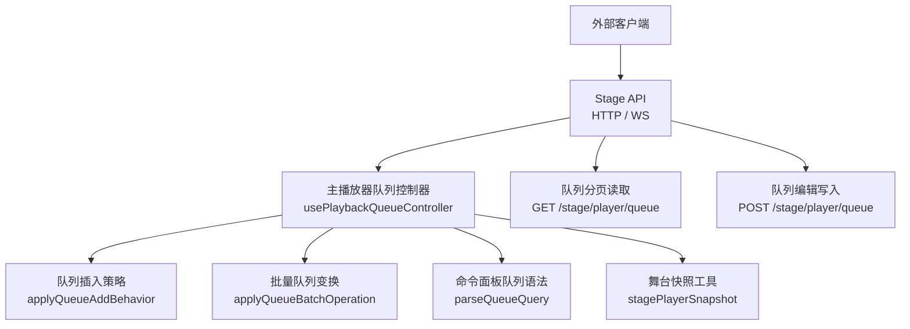
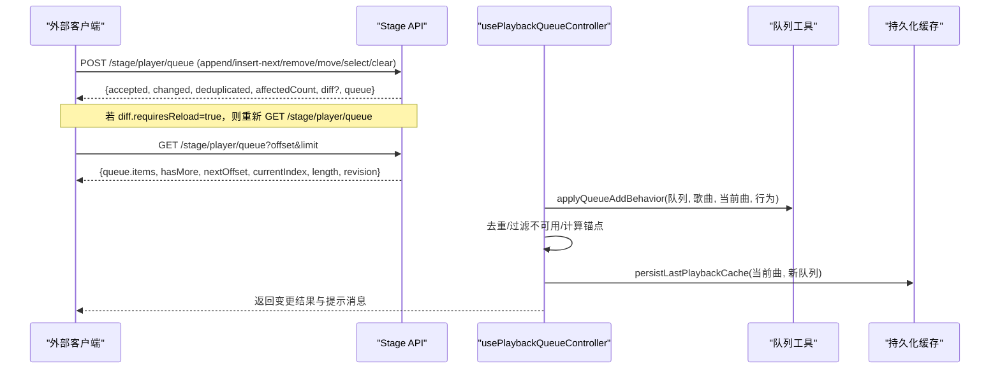
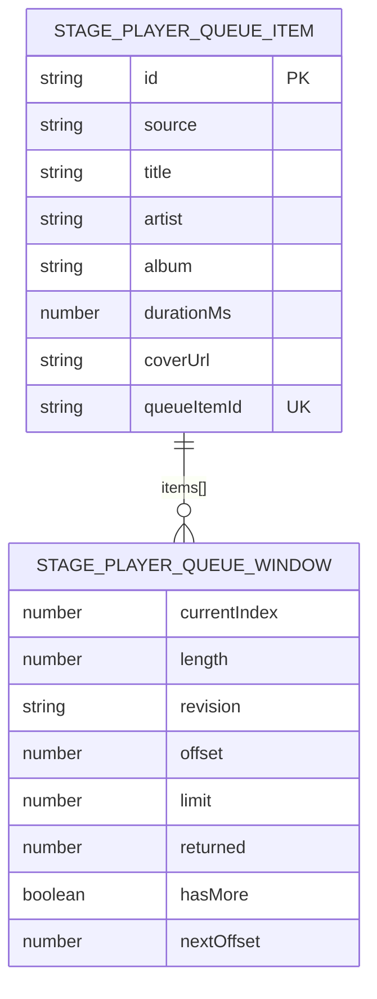
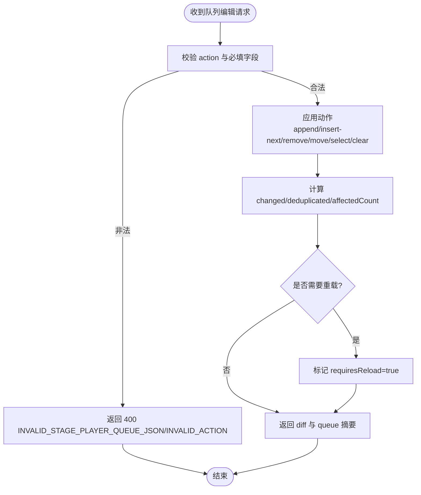
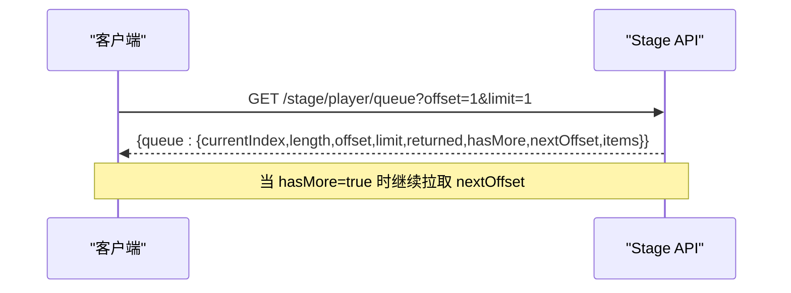
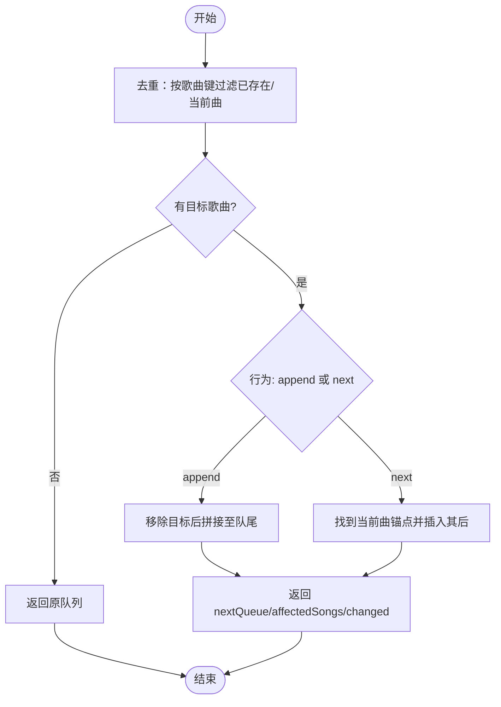
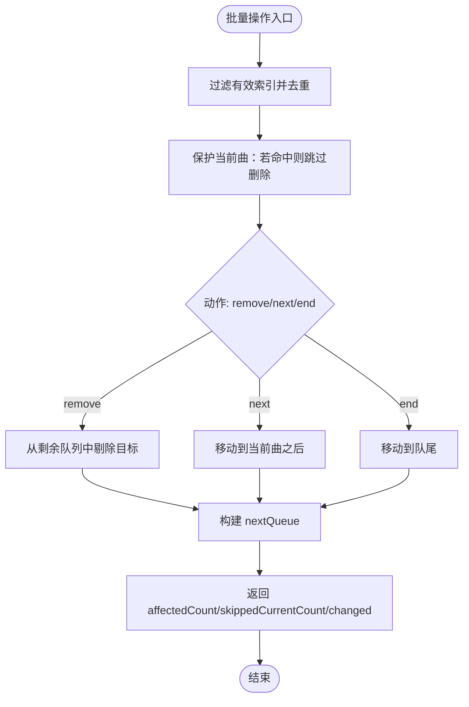
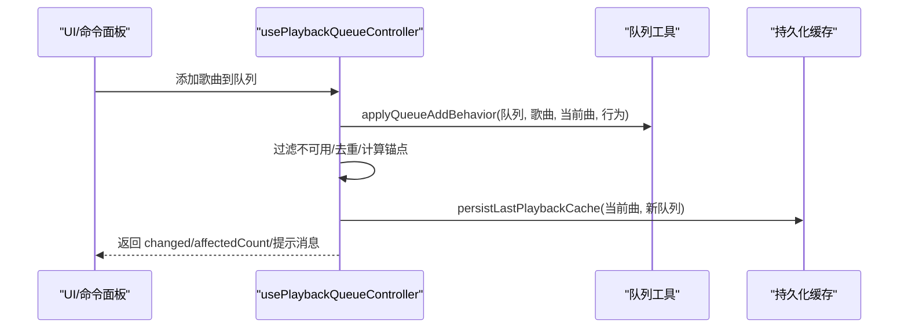
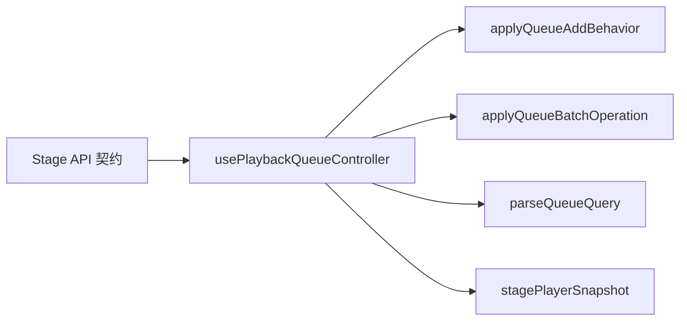

# 队列管理API

<cite>
**本文引用的文件**
- [API_SCHEMA.md](file://test/manual/stage-client/API_SCHEMA.md)
- [stageApi.test.ts](file://test/unit/stage/stageApi.test.ts)
- [usePlaybackQueueController.ts](file://src/hooks/usePlaybackQueueController.ts)
- [queueAddBehavior.ts](file://src/utils/queueAddBehavior.ts)
- [queueBatchOperations.ts](file://src/utils/queueBatchOperations.ts)
- [createQueueMutations.ts](file://src/components/app/player-panel/createQueueMutations.ts)
- [queueQuery.ts](file://src/components/command-palette/queueQuery.ts)
- [stagePlayerSnapshot.ts](file://src/utils/stagePlayerSnapshot.ts)
- [stageClientDemo.ts](file://src/utils/stageClientDemo.ts)
</cite>

## 目录
1. [简介](#简介)
2. [项目结构](#项目结构)
3. [核心组件](#核心组件)
4. [架构总览](#架构总览)
5. [详细组件分析](#详细组件分析)
6. [依赖关系分析](#依赖关系分析)
7. [性能考虑](#性能考虑)
8. [故障排查指南](#故障排查指南)
9. [结论](#结论)
10. [附录：完整API参考与示例](#附录完整api参考与示例)

## 简介
本技术文档聚焦 Folia Player 的“队列管理API”，覆盖以下目标：
- HTTP 端点：添加歌曲、删除曲目、调整顺序、清空队列等。
- 队列项数据结构、索引操作与批量操作接口。
- 队列状态同步机制：增量更新（diff）、版本控制（revision）、冲突解决（requiresReload）。
- 完整 API 参考与使用示例，包括错误处理与性能优化建议。

该文档基于仓库中的 Stage API 契约与前端队列逻辑实现进行整理，确保读者既能理解外部 HTTP 接口，也能掌握内部队列变更的核心算法与行为。

## 项目结构
与队列管理相关的代码主要分布在如下位置：
- 外部 HTTP 接口契约与测试：Stage API 文档与单元测试
- 前端队列控制器与工具：React Hook、队列插入策略、批量操作、命令面板语法
- 舞台模式快照与客户端构建器：用于获取/构造队列请求



图表来源
- [API_SCHEMA.md:664-781](file://test/manual/stage-client/API_SCHEMA.md#L664-L781)
- [usePlaybackQueueController.ts:217-287](file://src/hooks/usePlaybackQueueController.ts#L217-L287)
- [queueAddBehavior.ts:14-83](file://src/utils/queueAddBehavior.ts#L14-L83)
- [queueBatchOperations.ts:23-68](file://src/utils/queueBatchOperations.ts#L23-L68)
- [queueQuery.ts:9-66](file://src/components/command-palette/queueQuery.ts#L9-L66)
- [stagePlayerSnapshot.ts:84-84](file://src/utils/stagePlayerSnapshot.ts#L84-L84)

章节来源
- [API_SCHEMA.md:664-781](file://test/manual/stage-client/API_SCHEMA.md#L664-L781)
- [usePlaybackQueueController.ts:217-287](file://src/hooks/usePlaybackQueueController.ts#L217-L287)
- [queueAddBehavior.ts:14-83](file://src/utils/queueAddBehavior.ts#L14-L83)
- [queueBatchOperations.ts:23-68](file://src/utils/queueBatchOperations.ts#L23-L68)
- [queueQuery.ts:9-66](file://src/components/command-palette/queueQuery.ts#L9-L66)
- [stagePlayerSnapshot.ts:84-84](file://src/utils/stagePlayerSnapshot.ts#L84-L84)

## 核心组件
- Stage API 队列读写端点：提供分页查询与编辑能力，支持 append、insert-next、remove、move、select、clear。
- 队列插入策略：根据用户偏好将歌曲追加到队尾或当前播放项之后，并去重。
- 批量队列变换：原子化地对多个索引执行 remove/next/end，保护当前播放项不被误删。
- 命令面板队列语法：解析 remove/next/end 等操作标志与筛选维度（artist/album），便于快速批量操作。
- 舞台模式快照与客户端构建：辅助构造队列查询请求与解析队列项下标映射。

章节来源
- [API_SCHEMA.md:664-781](file://test/manual/stage-client/API_SCHEMA.md#L664-L781)
- [usePlaybackQueueController.ts:217-287](file://src/hooks/usePlaybackQueueController.ts#L217-L287)
- [queueAddBehavior.ts:14-83](file://src/utils/queueAddBehavior.ts#L14-L83)
- [queueBatchOperations.ts:23-68](file://src/utils/queueBatchOperations.ts#L23-L68)
- [queueQuery.ts:9-66](file://src/components/command-palette/queueQuery.ts#L9-L66)
- [stageClientDemo.ts:471-480](file://src/utils/stageClientDemo.ts#L471-L480)

## 架构总览
Folia 的队列管理由“外部 Stage API”和“内部队列控制器”共同组成：
- 外部客户端通过 HTTP 调用 Stage API 对队列进行增删改查。
- 内部 React Hook 负责统一队列行为（插入策略、去重、不可用歌曲处理、预取等），并与持久化缓存交互。
- 批量操作与命令面板语法为上层 UI 提供高效的操作入口。
- 舞台模式通过 diff + revision 实现增量同步，必要时回退到全量拉取。



图表来源
- [API_SCHEMA.md:664-781](file://test/manual/stage-client/API_SCHEMA.md#L664-L781)
- [usePlaybackQueueController.ts:217-287](file://src/hooks/usePlaybackQueueController.ts#L217-L287)
- [queueAddBehavior.ts:14-83](file://src/utils/queueAddBehavior.ts#L14-L83)

## 详细组件分析

### 队列数据模型与分页窗口
- 队列项包含当前播放信息以及队列项唯一标识（queueItemId）。
- 分页窗口包含 offset、limit、returned、hasMore、nextOffset，支持围绕当前项的 around=current 模式。
- 摘要包含 currentIndex、length、revision（可选内容摘要）。



图表来源
- [API_SCHEMA.md:238-255](file://test/manual/stage-client/API_SCHEMA.md#L238-L255)
- [API_SCHEMA.md:684-706](file://test/manual/stage-client/API_SCHEMA.md#L684-L706)

章节来源
- [API_SCHEMA.md:238-255](file://test/manual/stage-client/API_SCHEMA.md#L238-L255)
- [API_SCHEMA.md:684-706](file://test/manual/stage-client/API_SCHEMA.md#L684-L706)

### 队列编辑端点（POST /stage/player/queue）
- 支持的 action：append、insert-next、remove、move、select、clear。
- 字段约束：
  - append/insert-next：至少提供 songId 或非空 songIds。
  - remove：至少提供 queueItemId 或 index。
  - move：至少提供 fromQueueItemId 或 fromIndex，且必须提供 toIndex。
  - select：至少提供 queueItemId 或 index。
  - clear：无需额外字段。
- 响应包含 changed、deduplicated、affectedCount、diff（可选）、queue 摘要。



图表来源
- [API_SCHEMA.md:708-781](file://test/manual/stage-client/API_SCHEMA.md#L708-L781)

章节来源
- [API_SCHEMA.md:708-781](file://test/manual/stage-client/API_SCHEMA.md#L708-L781)

### 队列读取端点（GET /stage/player/queue）
- 查询参数：offset、limit、around=current。
- 响应：队列窗口 items、currentIndex、length、revision、分页信息。
- 测试用例验证了分页窗口语义与 nextOffset 的计算。



图表来源
- [API_SCHEMA.md:664-706](file://test/manual/stage-client/API_SCHEMA.md#L664-L706)
- [stageApi.test.ts:638-674](file://test/unit/stage/stageApi.test.ts#L638-L674)

章节来源
- [API_SCHEMA.md:664-706](file://test/manual/stage-client/API_SCHEMA.md#L664-L706)
- [stageApi.test.ts:638-674](file://test/unit/stage/stageApi.test.ts#L638-L674)

### 队列插入策略（applyQueueAddBehavior）
- 行为类型：append（队尾）或 next（当前曲之后）。
- 去重：按歌曲键值去重，避免重复插入。
- 锚点：以当前曲为锚点插入其后；若无当前曲则插到队首。
- 返回值：nextQueue、affectedSongs、changed。



图表来源
- [queueAddBehavior.ts:14-83](file://src/utils/queueAddBehavior.ts#L14-L83)

章节来源
- [queueAddBehavior.ts:14-83](file://src/utils/queueAddBehavior.ts#L14-L83)

### 批量队列变换（applyQueueBatchOperation）
- 支持动作：remove、next、end。
- 保护当前曲：若目标包含当前曲，跳过删除并计数。
- 保持相对顺序：移动时按原始队列顺序插入到目标位置。
- 返回值：nextQueue、affectedCount、skippedCurrentCount、changed。



图表来源
- [queueBatchOperations.ts:23-68](file://src/utils/queueBatchOperations.ts#L23-L68)

章节来源
- [queueBatchOperations.ts:23-68](file://src/utils/queueBatchOperations.ts#L23-L68)

### 命令面板队列语法（parseQueueQuery）
- 支持标志：remove（别名 rm/delete）、next、end。
- 支持维度：artist、album。
- 输出：action、facetKind、facetValue、isBareFacet、text、filterInput。

```mermaid
classDiagram
class QueueBatchAction {
<<enum>>
"remove | next | end"
}
class QueueFacetKind {
<<enum>>
"artist | album"
}
class ParsedQueueQuery {
+action : QueueBatchAction|null
+actionDraft : string|null
+facetKind : QueueFacetKind|null
+facetValue : string
+facetDraft : string|null
+isBareFacet : boolean
+text : string
+filterInput : string
}
ParsedQueueQuery --> QueueBatchAction : "使用"
ParsedQueueQuery --> QueueFacetKind : "使用"
```

图表来源
- [queueQuery.ts:9-66](file://src/components/command-palette/queueQuery.ts#L9-L66)

章节来源
- [queueQuery.ts:9-66](file://src/components/command-palette/queueQuery.ts#L9-L66)

### 前端队列控制器（usePlaybackQueueController）
- 统一队列行为：追加策略、去重、不可用歌曲处理、预取、主题恢复、歌词加载。
- 与持久化缓存交互：保存最近播放与队列以便恢复。
- 与 Stage API 集成：在 Stage 模式下维护主播放快照，并在变更后持久化。



图表来源
- [usePlaybackQueueController.ts:217-287](file://src/hooks/usePlaybackQueueController.ts#L217-L287)
- [queueAddBehavior.ts:14-83](file://src/utils/queueAddBehavior.ts#L14-L83)

章节来源
- [usePlaybackQueueController.ts:217-287](file://src/hooks/usePlaybackQueueController.ts#L217-L287)
- [queueAddBehavior.ts:14-83](file://src/utils/queueAddBehavior.ts#L14-L83)

### 前端批量操作封装（createQueueMutations）
- 封装 remove、moveToEnd、moveToNext、批量操作。
- 调用 transformQueueBatch（即 applyQueueBatchOperation）并更新队列顺序。
- 反馈用户状态消息（成功/影响数量）。

章节来源
- [createQueueMutations.ts:64-125](file://src/components/app/player-panel/createQueueMutations.ts#L64-L125)
- [queueBatchOperations.ts:23-68](file://src/utils/queueBatchOperations.ts#L23-L68)

### 舞台模式队列索引映射（resolveStagePlayerQueueItemIndex）
- 将队列项 ID 映射到队列下标，便于精确操作。
- 与 Stage API 的 queueItemId 配合使用。

章节来源
- [stagePlayerSnapshot.ts:84-84](file://src/utils/stagePlayerSnapshot.ts#L84-L84)

## 依赖关系分析
- Stage API 契约定义了队列操作的输入输出与错误码，是外部客户端与内部播放器的契约边界。
- 前端队列控制器依赖队列插入策略与批量变换工具，保证一致的行为与性能。
- 命令面板语法为 UI 层提供声明式操作表达，降低复杂操作的实现成本。
- 舞台模式快照工具辅助客户端构建与解析队列相关请求。



图表来源
- [API_SCHEMA.md:664-781](file://test/manual/stage-client/API_SCHEMA.md#L664-L781)
- [usePlaybackQueueController.ts:217-287](file://src/hooks/usePlaybackQueueController.ts#L217-L287)
- [queueAddBehavior.ts:14-83](file://src/utils/queueAddBehavior.ts#L14-L83)
- [queueBatchOperations.ts:23-68](file://src/utils/queueBatchOperations.ts#L23-L68)
- [queueQuery.ts:9-66](file://src/components/command-palette/queueQuery.ts#L9-L66)
- [stagePlayerSnapshot.ts:84-84](file://src/utils/stagePlayerSnapshot.ts#L84-L84)

章节来源
- [API_SCHEMA.md:664-781](file://test/manual/stage-client/API_SCHEMA.md#L664-L781)
- [usePlaybackQueueController.ts:217-287](file://src/hooks/usePlaybackQueueController.ts#L217-L287)
- [queueAddBehavior.ts:14-83](file://src/utils/queueAddBehavior.ts#L14-L83)
- [queueBatchOperations.ts:23-68](file://src/utils/queueBatchOperations.ts#L23-L68)
- [queueQuery.ts:9-66](file://src/components/command-palette/queueQuery.ts#L9-L66)
- [stagePlayerSnapshot.ts:84-84](file://src/utils/stagePlayerSnapshot.ts#L84-L84)

## 性能考虑
- 分页读取：合理设置 limit（1..500），避免一次性拉取过大队列；使用 around=current 提升当前上下文体验。
- 增量同步：优先应用 diff.ops；当 requiresReload=true 时再全量拉取，减少网络与渲染开销。
- 去重与过滤：插入前按歌曲键去重并过滤不可用歌曲，减少无效操作与后续重试。
- 批量操作：使用 applyQueueBatchOperation 原子化执行，保护当前曲并维持相对顺序，避免多次重排。
- 预取与缓存：利用预取服务与本地缓存减少加载延迟；持久化最近播放与队列以便快速恢复。

[本节为通用性能指导，不直接分析具体文件]

## 故障排查指南
- 鉴权失败：除健康检查外，所有 HTTP 接口需携带 Authorization: Bearer <token>。
- 请求体过大：JSON 请求体上限 2 MiB；multipart 单个文件上限 1 GiB。
- 动作不支持：当前播放上下文可能限制队列操作，需检查 queueCapabilities。
- 超时与拒绝：注意 10 秒/15 秒超时与渲染进程拒绝的错误码。
- 增量失效：若 diff.requiresReload=true，应忽略 ops 并重新 GET /stage/player/queue。

章节来源
- [API_SCHEMA.md:6-12](file://test/manual/stage-client/API_SCHEMA.md#L6-L12)
- [API_SCHEMA.md:441-467](file://test/manual/stage-client/API_SCHEMA.md#L441-L467)
- [API_SCHEMA.md:772-781](file://test/manual/stage-client/API_SCHEMA.md#L772-L781)

## 结论
Folia 的队列管理通过 Stage API 提供稳定、可扩展的外部接口，同时在前端实现了统一的队列行为与高效的批量操作。借助 diff + revision 的增量同步机制，可在保证一致性的前提下优化性能。结合去重、不可用歌曲处理与预取缓存，整体体验流畅可靠。

[本节为总结性内容，不直接分析具体文件]

## 附录：完整API参考与示例

### 队列读取（GET /stage/player/queue）
- 查询参数：offset、limit、around=current。
- 响应：队列窗口、分页信息、当前项与长度、revision。
- 示例：分页拉取队列项，hasMore 为真时继续拉取 nextOffset。

章节来源
- [API_SCHEMA.md:664-706](file://test/manual/stage-client/API_SCHEMA.md#L664-L706)
- [stageApi.test.ts:638-674](file://test/unit/stage/stageApi.test.ts#L638-L674)

### 队列编辑（POST /stage/player/queue）
- 动作：append、insert-next、remove、move、select、clear。
- 字段：songId/songIds、queueItemId/fromQueueItemId/fromIndex/toIndex/index。
- 响应：accepted、changed、deduplicated、affectedCount、diff（可选）、queue 摘要。
- 示例：批量追加多首歌曲，或按索引删除/移动。

章节来源
- [API_SCHEMA.md:708-781](file://test/manual/stage-client/API_SCHEMA.md#L708-L781)

### 队列状态同步（diff + revision）
- baseRevision：编辑前的队列版本。
- revision：编辑后的队列版本。
- ops：可顺序应用的紧凑操作（insert/remove/move/clear/select）。
- requiresReload：无法安全表达变化时要求全量拉取。

章节来源
- [API_SCHEMA.md:257-300](file://test/manual/stage-client/API_SCHEMA.md#L257-L300)

### 前端队列操作示例
- 添加歌曲到队列：使用 applyQueueAddBehavior 决定插入位置与去重。
- 批量删除/移动：使用 applyQueueBatchOperation 原子化执行，保护当前曲。
- 命令面板语法：使用 parseQueueQuery 解析 remove/next/end 与 artist/album 维度。

章节来源
- [usePlaybackQueueController.ts:217-287](file://src/hooks/usePlaybackQueueController.ts#L217-L287)
- [queueAddBehavior.ts:14-83](file://src/utils/queueAddBehavior.ts#L14-L83)
- [queueBatchOperations.ts:23-68](file://src/utils/queueBatchOperations.ts#L23-L68)
- [queueQuery.ts:9-66](file://src/components/command-palette/queueQuery.ts#L9-L66)

### 错误处理要点
- 400：JSON 解析失败、字段不合法、动作不支持。
- 409：当前上下文不支持队列操作。
- 503：主窗口不可用或 Stage 服务停止。
- 504：请求超时。
- 502：渲染进程拒绝。

章节来源
- [API_SCHEMA.md:772-781](file://test/manual/stage-client/API_SCHEMA.md#L772-L781)