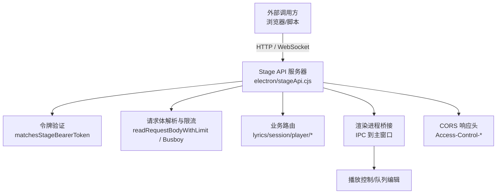
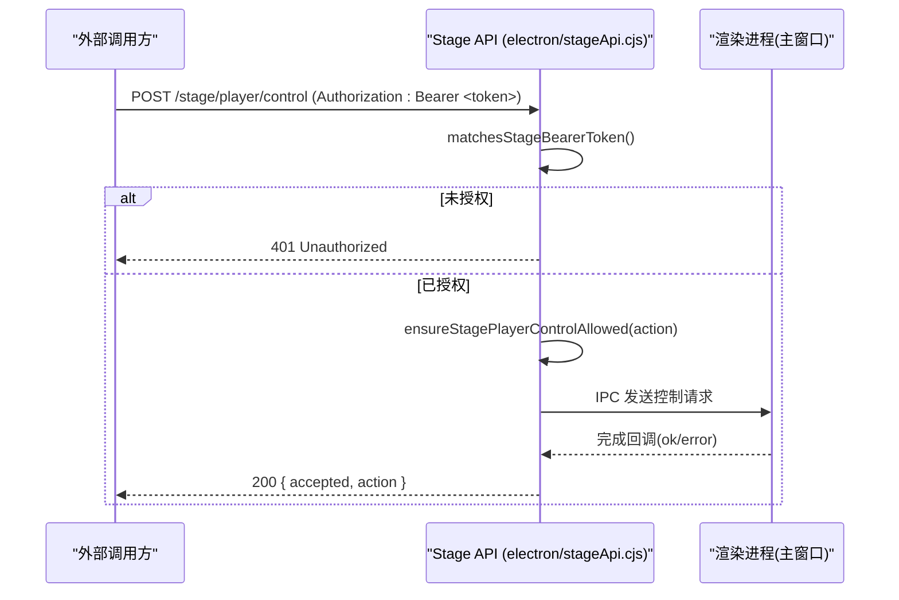
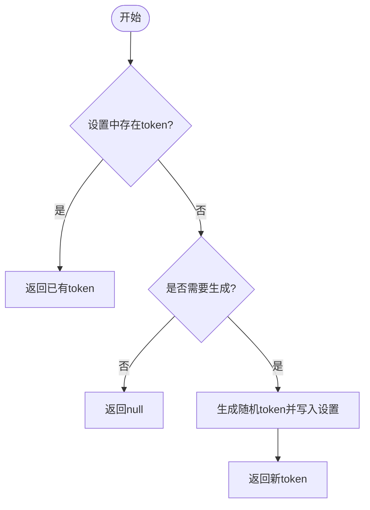
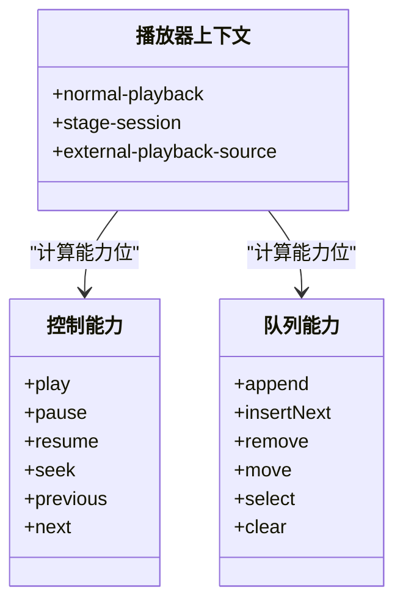
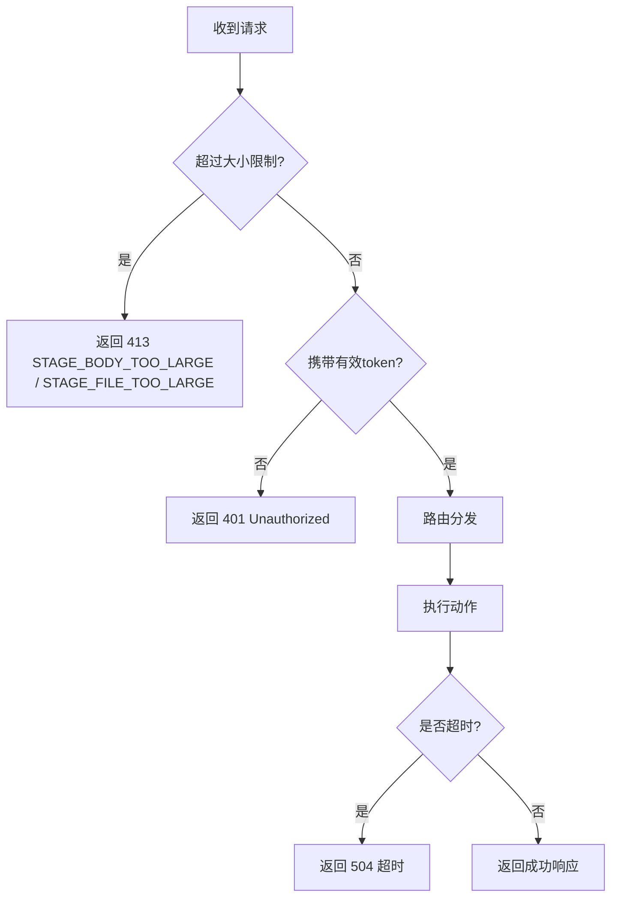
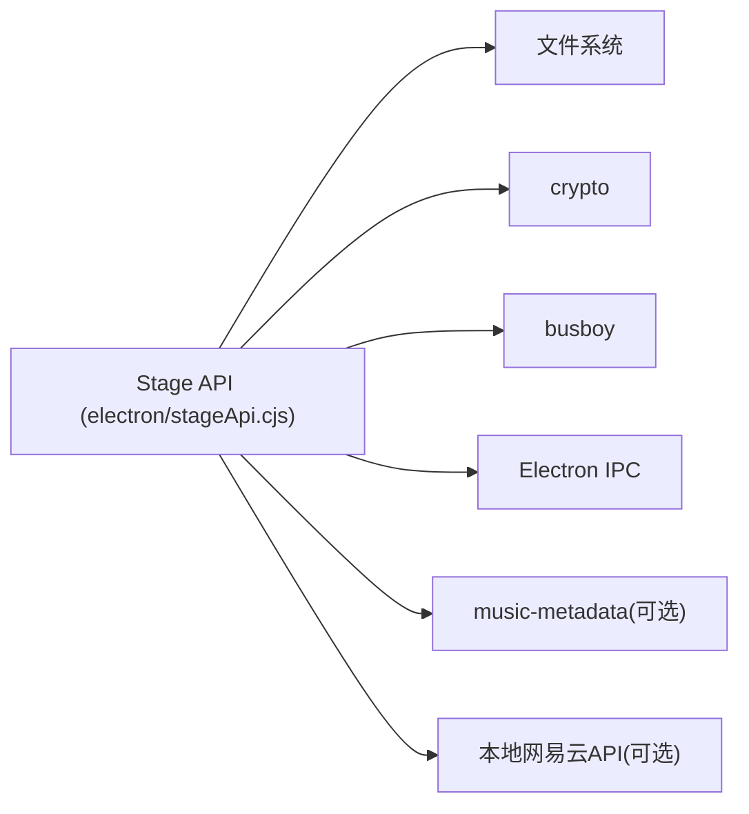

# 认证与安全机制

<cite>
**本文引用的文件**
- [electron/stageApi.cjs](file://electron/stageApi.cjs)
- [test/manual/stage-client/API_SCHEMA.md](file://test/manual/stage-client/API_SCHEMA.md)
- [src/utils/stageClientDemo.ts](file://src/utils/stageClientDemo.ts)
- [test/unit/stage/stageApi.test.ts](file://test/unit/stage/stageApi.test.ts)
</cite>

## 目录
1. [简介](#简介)
2. [项目结构](#项目结构)
3. [核心组件](#核心组件)
4. [架构总览](#架构总览)
5. [详细组件分析](#详细组件分析)
6. [依赖关系分析](#依赖关系分析)
7. [性能与限制](#性能与限制)
8. [故障排查指南](#故障排查指南)
9. [结论](#结论)
10. [附录：安全配置与测试建议](#附录：安全配置与测试建议)

## 简介
本文件聚焦 Folia Player Stage API 的认证与安全机制，围绕 Bearer Token 的生命周期管理、权限控制策略、请求限制与防护措施、以及安全配置与测试方法展开。Stage API 是桌面端本地服务，默认监听 127.0.0.1，用于外部工具向 Folia 注入歌词或媒体会话，并控制播放器状态与队列。其安全模型以“进程内本地服务 + Bearer Token”为核心，配合严格的输入校验、大小限制、错误码体系与跨域响应头，确保仅受控客户端可访问敏感能力。

## 项目结构
Stage API 的核心实现位于 Electron 主进程的本地 HTTP/WebSocket 服务中，相关契约与客户端辅助函数分别由文档与前端工具模块提供；单元测试覆盖关键鉴权与参数校验路径。

图表来源
- [electron/stageApi.cjs:802-868](file://electron/stageApi.cjs#L802-L868)
- [electron/stageApi.cjs:892-915](file://electron/stageApi.cjs#L892-L915)
- [electron/stageApi.cjs:917-1031](file://electron/stageApi.cjs#L917-L1031)
- [test/manual/stage-client/API_SCHEMA.md:5-12](file://test/manual/stage-client/API_SCHEMA.md#L5-L12)

章节来源
- [electron/stageApi.cjs:1-25](file://electron/stageApi.cjs#L1-L25)
- [test/manual/stage-client/API_SCHEMA.md:1-12](file://test/manual/stage-client/API_SCHEMA.md#L1-L12)

## 核心组件
- 令牌生成与存储：基于系统随机数生成 base64url 字符串，持久化到应用设置键中，支持按需生成与重新生成。
- 令牌提取与匹配：从 HTTP Authorization 头或查询参数中提取 token，并与服务端当前 token 进行严格相等比较。
- 请求体限制：JSON 请求体与 multipart 字段/文件均有限制，超限返回 413。
- 权限控制：通过“播放上下文 + 能力位”控制控制与队列操作是否允许。
- 错误处理：统一错误类型与错误码，便于客户端识别与重试。
- 跨域与协议：所有响应附带 CORS 头；WebSocket 连接同样需要鉴权。

章节来源
- [electron/stageApi.cjs:227-241](file://electron/stageApi.cjs#L227-L241)
- [electron/stageApi.cjs:892-915](file://electron/stageApi.cjs#L892-L915)
- [electron/stageApi.cjs:870-890](file://electron/stageApi.cjs#L870-L890)
- [electron/stageApi.cjs:1713-1730](file://electron/stageApi.cjs#L1713-L1730)
- [electron/stageApi.cjs:56-64](file://electron/stageApi.cjs#L56-L64)
- [electron/stageApi.cjs:802-868](file://electron/stageApi.cjs#L802-L868)

## 架构总览
Stage API 作为本地 HTTP/WebSocket 服务运行在桌面端，所有写操作与敏感读操作均需携带有效 Bearer Token。健康检查接口无需鉴权。请求进入后先进行令牌校验，再按路由分发至歌词、媒体会话、播放器控制与队列等子模块。各子模块对入参进行严格归一化与校验，并通过 IPC 与渲染进程交互执行实际播放与队列变更。

图表来源
- [electron/stageApi.cjs:892-915](file://electron/stageApi.cjs#L892-L915)
- [electron/stageApi.cjs:1713-1747](file://electron/stageApi.cjs#L1713-L1747)
- [electron/stageApi.cjs:1519-1546](file://electron/stageApi.cjs#L1519-L1546)
- [test/manual/stage-client/API_SCHEMA.md:618-663](file://test/manual/stage-client/API_SCHEMA.md#L618-L663)

## 详细组件分析

### Bearer Token 生命周期管理
- 生成：当设置中不存在 token 且需要时，使用加密安全的随机源生成 base64url 字符串并写入设置。
- 获取：读取设置中的 token；若为空则返回 null。
- 匹配：从请求的 Authorization 头或查询参数中提取 token，与服务端当前 token 做严格相等比较。
- 重新生成：支持主动重新生成 token，并在变更后关闭现有 WebSocket 连接，必要时重启服务。

图表来源
- [electron/stageApi.cjs:227-241](file://electron/stageApi.cjs#L227-L241)
- [electron/stageApi.cjs:2141-2154](file://electron/stageApi.cjs#L2141-L2154)

章节来源
- [electron/stageApi.cjs:227-241](file://electron/stageApi.cjs#L227-L241)
- [electron/stageApi.cjs:892-915](file://electron/stageApi.cjs#L892-L915)
- [electron/stageApi.cjs:2141-2154](file://electron/stageApi.cjs#L2141-L2154)

### 权限控制系统（访问级别与操作权限）
- 播放上下文：normal-playback、stage-session、external-playback-source。不同上下文对控制与队列能力开放程度不同。
- 能力位：controlCapabilities 与 queueCapabilities 根据上下文动态计算，决定具体动作是否允许。
- 动作白名单：控制动作 next/prev/pause/resume/seek 与队列动作 append/insert-next/remove/move/select/clear 均有映射与校验。
- 拒绝策略：不支持的动作或上下文会返回明确的 409 错误码与原因。

图表来源
- [electron/stageApi.cjs:309-341](file://electron/stageApi.cjs#L309-L341)
- [electron/stageApi.cjs:40-54](file://electron/stageApi.cjs#L40-L54)
- [electron/stageApi.cjs:1713-1730](file://electron/stageApi.cjs#L1713-L1730)

章节来源
- [electron/stageApi.cjs:309-341](file://electron/stageApi.cjs#L309-L341)
- [electron/stageApi.cjs:1713-1730](file://electron/stageApi.cjs#L1713-L1730)
- [test/manual/stage-client/API_SCHEMA.md:207-300](file://test/manual/stage-client/API_SCHEMA.md#L207-L300)

### 请求限制与防护措施
- 请求体大小限制：JSON 请求体上限为 2 MiB，multipart field 单字段上限 2 MiB，文件上限 1 GiB，同时限制文件数量、part 数量与 field 数量。
- 字节范围支持：媒体资源支持 Range 请求，非法范围返回 416。
- 跨域控制：所有响应包含 Access-Control-Allow-Origin/Headers/Methods，便于本地 Web 客户端跨域访问。
- 未授权防护：除健康检查外，所有接口需携带有效 Bearer Token；WebSocket 连接也需鉴权。
- 超时保护：外部播放与控制请求有超时时间，避免阻塞。

图表来源
- [electron/stageApi.cjs:870-890](file://electron/stageApi.cjs#L870-L890)
- [electron/stageApi.cjs:917-1031](file://electron/stageApi.cjs#L917-L1031)
- [electron/stageApi.cjs:825-868](file://electron/stageApi.cjs#L825-L868)
- [electron/stageApi.cjs:1519-1546](file://electron/stageApi.cjs#L1519-L1546)
- [test/manual/stage-client/API_SCHEMA.md:441-467](file://test/manual/stage-client/API_SCHEMA.md#L441-L467)

章节来源
- [electron/stageApi.cjs:870-890](file://electron/stageApi.cjs#L870-L890)
- [electron/stageApi.cjs:917-1031](file://electron/stageApi.cjs#L917-L1031)
- [electron/stageApi.cjs:825-868](file://electron/stageApi.cjs#L825-L868)
- [test/manual/stage-client/API_SCHEMA.md:441-467](file://test/manual/stage-client/API_SCHEMA.md#L441-L467)

### 错误处理与审计日志
- 统一错误类型：StageApiError 携带 statusCode、code、details，便于客户端区分错误类型与重试策略。
- 常见错误码：如 INVALID_STAGE_JSON、INVALID_LYRICS_FORMAT、STAGE_BODY_TOO_LARGE、STAGE_PLAYER_CONTROL_UNSUPPORTED、STAGE_PLAY_TIMEOUT 等。
- 日志记录：生成/重新生成 token、会话创建、异常清理等操作均输出结构化日志，便于问题定位。

章节来源
- [electron/stageApi.cjs:56-64](file://electron/stageApi.cjs#L56-L64)
- [electron/stageApi.cjs:794-800](file://electron/stageApi.cjs#L794-L800)
- [electron/stageApi.cjs:202-209](file://electron/stageApi.cjs#L202-L209)
- [test/manual/stage-client/API_SCHEMA.md:372-379](file://test/manual/stage-client/API_SCHEMA.md#L372-L379)
- [test/manual/stage-client/API_SCHEMA.md:456-467](file://test/manual/stage-client/API_SCHEMA.md#L456-L467)

### 客户端侧前置校验与最佳实践
- 客户端应在发起请求前进行基础校验（地址、token、必填字段、枚举值），减少无效请求到达服务端。
- 构建请求时使用统一的 Bearer 头构造器，避免遗漏或格式错误。
- 对于大文件或复杂表单，优先使用 multipart 并遵循服务端限制。

章节来源
- [src/utils/stageClientDemo.ts:88-103](file://src/utils/stageClientDemo.ts#L88-L103)
- [src/utils/stageClientDemo.ts:105-158](file://src/utils/stageClientDemo.ts#L105-L158)
- [src/utils/stageClientDemo.ts:173-234](file://src/utils/stageClientDemo.ts#L173-L234)
- [src/utils/stageClientDemo.ts:239-535](file://src/utils/stageClientDemo.ts#L239-L535)

## 依赖关系分析
- 内部依赖：
  - 文件系统：读写会话工作目录、临时文件与媒体资源。
  - 加密模块：生成安全随机 token。
  - 流式上传：Busboy 解析 multipart，带大小与数量限制。
  - IPC：与渲染进程通信执行播放控制与队列编辑。
  - 可选音乐元数据解析：从上传音频中提取歌词与封面。
- 外部依赖：
  - 本地网易云 API（可选）：用于搜索歌曲。
  - 浏览器/脚本客户端：通过 HTTP/WebSocket 调用 Stage API。

图表来源
- [electron/stageApi.cjs:1-7](file://electron/stageApi.cjs#L1-L7)
- [electron/stageApi.cjs:787-792](file://electron/stageApi.cjs#L787-L792)
- [electron/stageApi.cjs:1462-1487](file://electron/stageApi.cjs#L1462-L1487)
- [electron/stageApi.cjs:1519-1546](file://electron/stageApi.cjs#L1519-L1546)

章节来源
- [electron/stageApi.cjs:1-7](file://electron/stageApi.cjs#L1-L7)
- [electron/stageApi.cjs:787-792](file://electron/stageApi.cjs#L787-L792)
- [electron/stageApi.cjs:1462-1487](file://electron/stageApi.cjs#L1462-L1487)
- [electron/stageApi.cjs:1519-1546](file://electron/stageApi.cjs#L1519-L1546)

## 性能与限制
- 请求体与文件大小限制防止内存耗尽与磁盘滥用。
- 队列分页与 around=current 优化减少不必要的数据传输。
- 时间补偿：播放中 positionMs 基于 sampledAtMs 进行补偿，提高时间同步精度。
- 超时控制：外部播放与控制请求具备超时，避免长时间挂起。

章节来源
- [electron/stageApi.cjs:870-890](file://electron/stageApi.cjs#L870-L890)
- [electron/stageApi.cjs:538-559](file://electron/stageApi.cjs#L538-L559)
- [electron/stageApi.cjs:431-446](file://electron/stageApi.cjs#L431-L446)
- [electron/stageApi.cjs:1519-1546](file://electron/stageApi.cjs#L1519-L1546)

## 故障排查指南
- 401 未授权：确认请求携带了正确的 Authorization: Bearer <token>，或 WebSocket URL 中包含 ?token=。
- 413 请求体过大：检查 JSON 或 multipart 是否超过限制，拆分或压缩数据。
- 416 范围无效：检查 Range 头格式与取值是否在文件范围内。
- 409 不支持的动作：确认当前播放上下文是否允许该控制或队列操作。
- 504 超时：检查渲染进程是否响应，或网络/IPC 是否阻塞。
- 502 被拒绝：渲染进程拒绝执行，查看上游错误信息。

章节来源
- [test/manual/stage-client/API_SCHEMA.md:302-329](file://test/manual/stage-client/API_SCHEMA.md#L302-L329)
- [test/manual/stage-client/API_SCHEMA.md:456-467](file://test/manual/stage-client/API_SCHEMA.md#L456-L467)
- [test/manual/stage-client/API_SCHEMA.md:618-663](file://test/manual/stage-client/API_SCHEMA.md#L618-L663)
- [test/manual/stage-client/API_SCHEMA.md:772-781](file://test/manual/stage-client/API_SCHEMA.md#L772-L781)

## 结论
Folia Player Stage API 采用“本地服务 + Bearer Token”的安全模型，结合严格的输入校验、大小限制、能力位权限控制与统一的错误码体系，为外部集成提供了可控、可观测、可扩展的接口。通过客户端前置校验与服务端多重防护，可有效降低误用与攻击面。建议在部署与使用中遵循本文的安全配置与测试建议，确保稳定与安全。

## 附录：安全配置与测试建议
- Token 管理最佳实践
  - 定期重新生成 token，尤其在怀疑泄露或环境变更时。
  - 仅在可信本地环境中启用 Stage API，避免暴露到公网。
  - 将 token 作为最小权限凭证传递，避免在日志或 URL 中明文打印。
- 常见威胁防护
  - 防重放：由于是本地服务，建议结合会话 ID 或一次性 token 扩展。
  - 防越权：严格依据 controlCapabilities/queueCapabilities 判断动作合法性。
  - 防溢出：利用内置大小限制与范围校验，避免恶意请求导致资源耗尽。
- 安全审计日志
  - 关注 token 生成/重新生成、会话创建/清理、异常拒绝等关键事件。
  - 结合应用日志平台收集结构化日志，便于追踪与告警。
- 安全测试方法
  - 使用提供的客户端辅助函数构建请求，确保头部与参数正确。
  - 针对鉴权失败、参数非法、大小超限、上下文不支持等场景编写用例。
  - 使用单元测试覆盖关键路径，例如 seek 位置校验、控制动作白名单等。
- 漏洞扫描工具使用建议
  - 对本地 HTTP 接口进行渗透测试，重点验证鉴权绕过、CSRF、XSS（若嵌入页面）、路径穿越（文件下载）。
  - 对 multipart 上传进行边界测试，验证大小限制与文件类型过滤。
  - 对 WebSocket 连接进行鉴权与消息格式校验测试。

章节来源
- [electron/stageApi.cjs:227-241](file://electron/stageApi.cjs#L227-L241)
- [electron/stageApi.cjs:870-890](file://electron/stageApi.cjs#L870-L890)
- [electron/stageApi.cjs:1713-1730](file://electron/stageApi.cjs#L1713-L1730)
- [src/utils/stageClientDemo.ts:88-103](file://src/utils/stageClientDemo.ts#L88-L103)
- [test/unit/stage/stageApi.test.ts:604-635](file://test/unit/stage/stageApi.test.ts#L604-L635)