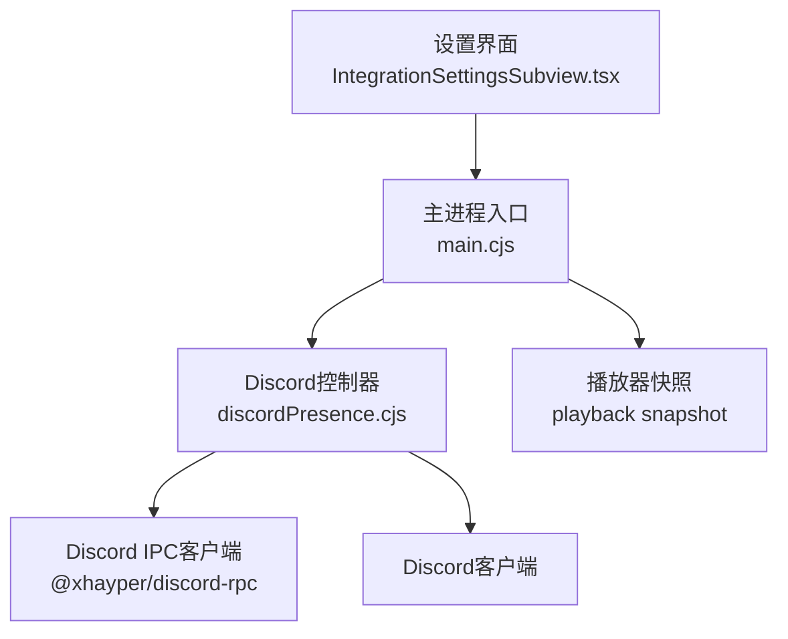
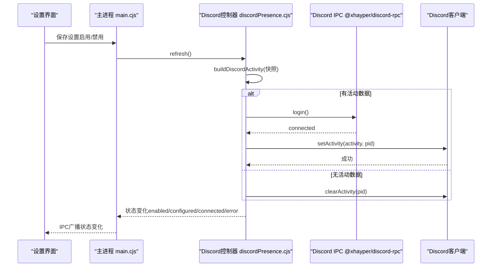
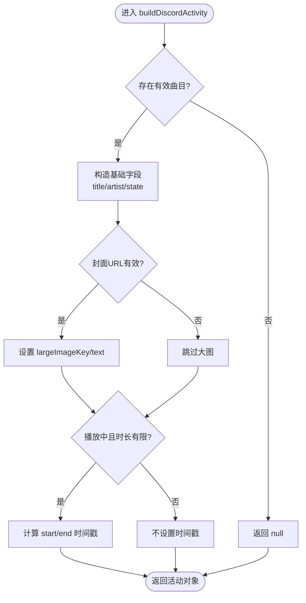
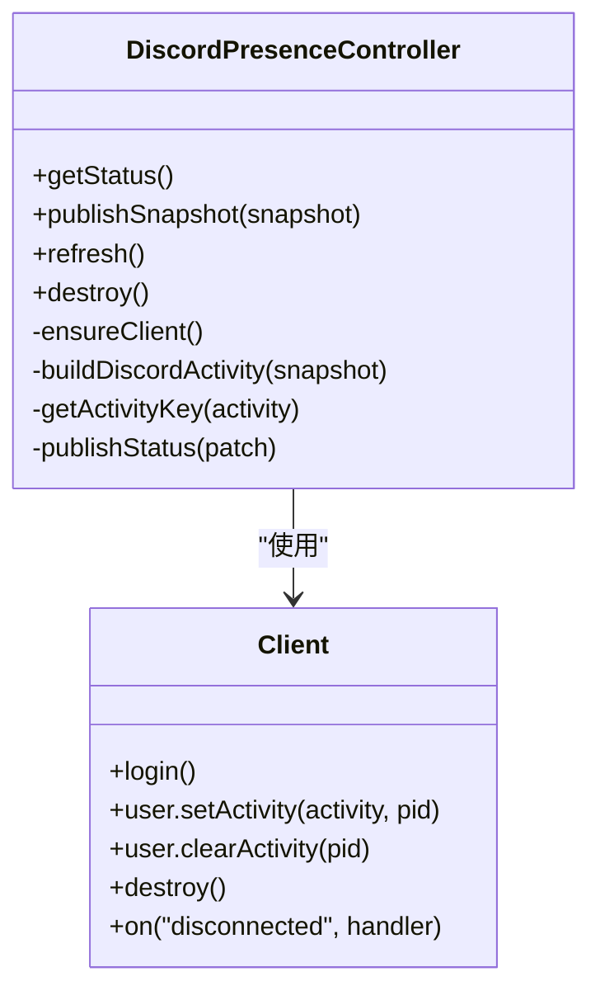
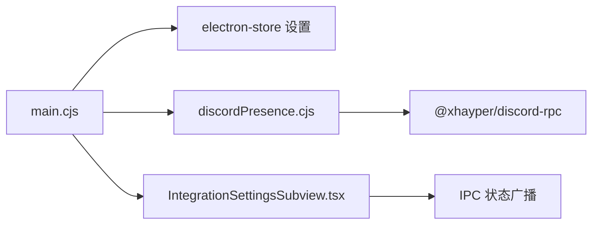

# Discord Rich Presence集成

<cite>
**本文引用的文件**
- [electron/discordPresence.cjs](file://electron/discordPresence.cjs)
- [electron/main.cjs](file://electron/main.cjs)
- [src/components/modal/settings/IntegrationSettingsSubview.tsx](file://src/components/modal/settings/IntegrationSettingsSubview.tsx)
- [test/unit/discordPresence.test.ts](file://test/unit/discordPresence.test.ts)
</cite>

## 目录
1. [简介](#简介)
2. [项目结构](#项目结构)
3. [核心组件](#核心组件)
4. [架构总览](#架构总览)
5. [详细组件分析](#详细组件分析)
6. [依赖关系分析](#依赖关系分析)
7. [性能考虑](#性能考虑)
8. [故障排除指南](#故障排除指南)
9. [结论](#结论)
10. [附录](#附录)

## 简介
本文件面向Folia Player的Discord Rich Presence（富活动状态）集成，系统性说明如何在桌面端将当前播放信息同步到Discord客户端。内容涵盖：
- 活动信息同步：标题、艺术家、播放状态、封面图片、时间戳等字段构建与更新策略
- Discord客户端连接管理：应用ID配置、连接状态监控、自动重连机制
- 安全考量：URL校验、本地地址过滤、图片资源管理
- 配置选项与自定义设置：启用开关、默认应用ID、前端展示与状态反馈
- 错误处理与排障：常见连接与显示问题的定位与解决

## 项目结构
Discord Rich Presence相关代码主要位于Electron主进程与前端设置界面：
- 主进程模块负责创建并维护Discord客户端实例、构建活动数据、控制更新频率、处理连接事件
- 主进程通过IPC将状态变化推送给渲染进程，供设置页展示
- 前端设置页提供启用/禁用开关与状态提示

图表来源
- [electron/main.cjs:992-1000](file://electron/main.cjs#L992-L1000)
- [electron/discordPresence.cjs:103-276](file://electron/discordPresence.cjs#L103-L276)
- [src/components/modal/settings/IntegrationSettingsSubview.tsx:357-395](file://src/components/modal/settings/IntegrationSettingsSubview.tsx#L357-L395)

章节来源
- [electron/main.cjs:992-1000](file://electron/main.cjs#L992-L1000)
- [electron/discordPresence.cjs:1-285](file://electron/discordPresence.cjs#L1-L285)
- [src/components/modal/settings/IntegrationSettingsSubview.tsx:357-395](file://src/components/modal/settings/IntegrationSettingsSubview.tsx#L357-L395)

## 核心组件
- Discord活动构建器：根据播放器快照生成Discord活动对象，包含标题、艺术家、播放状态、封面图、开始/结束时间戳等
- Discord控制器：封装客户端生命周期、连接重试、状态发布、防抖更新、清理逻辑
- 主进程集成：初始化控制器、监听设置变更、刷新活动、向渲染进程广播状态
- 前端设置面板：提供启用开关、状态指示、错误消息展示

章节来源
- [electron/discordPresence.cjs:52-101](file://electron/discordPresence.cjs#L52-L101)
- [electron/discordPresence.cjs:103-276](file://electron/discordPresence.cjs#L103-L276)
- [electron/main.cjs:992-1000](file://electron/main.cjs#L992-L1000)
- [src/components/modal/settings/IntegrationSettingsSubview.tsx:357-395](file://src/components/modal/settings/IntegrationSettingsSubview.tsx#L357-L395)

## 架构总览
下图展示了从播放器快照到Discord客户端的完整调用链，包括状态发布、连接建立与活动更新流程。

图表来源
- [electron/main.cjs:992-1000](file://electron/main.cjs#L992-L1000)
- [electron/main.cjs:4454-4457](file://electron/main.cjs#L4454-L4457)
- [electron/discordPresence.cjs:166-226](file://electron/discordPresence.cjs#L166-L226)
- [electron/discordPresence.cjs:228-264](file://electron/discordPresence.cjs#L228-L264)

## 详细组件分析

### 活动数据构建逻辑
- 输入：播放器快照（包含是否有曲目、标题、艺术家、播放状态、时长、当前时间、封面URL、更新时间戳）
- 输出：Discord活动对象（名称、类型、详情、状态、大图键与文本、小图文本、实例标志、开始/结束时间戳）
- 规则要点：
  - 标题与艺术家截断至128字符；缺失艺术家时回退为“Folia”
  - 播放状态映射为PLAYING或PAUSED；暂停时状态前缀“Paused - ”
  - 封面URL需通过安全校验（仅允许http/https且非本地主机），否则不设置大图
  - 仅在播放中且时长有限时计算startTimestamp与endTimestamp，基于快照时间与当前播放进度推导
  - 使用去重键避免重复更新（比较details/state/largeImageKey/start/end）

图表来源
- [electron/discordPresence.cjs:52-88](file://electron/discordPresence.cjs#L52-L88)
- [electron/discordPresence.cjs:90-101](file://electron/discordPresence.cjs#L90-L101)

章节来源
- [electron/discordPresence.cjs:52-101](file://electron/discordPresence.cjs#L52-L101)
- [test/unit/discordPresence.test.ts:20-84](file://test/unit/discordPresence.test.ts#L20-L84)

### Discord客户端连接管理
- 应用ID配置：
  - 默认应用ID在模块内定义，主进程通过回调提供
  - 应用ID规范化：仅接受16-24位数字字符串，去除空白
- 连接建立与状态：
  - 使用@xhayper/discord-rpc以IPC方式连接Discord
  - 监听disconnected事件，更新连接状态
  - 登录成功后标记connected并清除错误
- 自动重连与并发保护：
  - 若已有连接且应用ID未变则复用
  - 连接过程中缓存Promise，避免重复登录
  - 销毁时清理活动并关闭客户端
- 状态发布：
  - 内部维护status对象（enabled/configured/connected/error/applicationId/updatedAt）
  - 通过onStatusChange回调通知上层

图表来源
- [electron/discordPresence.cjs:103-276](file://electron/discordPresence.cjs#L103-L276)

章节来源
- [electron/discordPresence.cjs:8-14](file://electron/discordPresence.cjs#L8-L14)
- [electron/discordPresence.cjs:166-226](file://electron/discordPresence.cjs#L166-L226)
- [electron/main.cjs:992-1000](file://electron/main.cjs#L992-L1000)

### 活动更新与防抖
- 更新节流：同一活动键在DISCORD_PRESENCE_UPDATE_INTERVAL_MS毫秒内不重复发送
- 去重键：由details/state/largeImageKey/start/end组成，确保最小化网络开销
- 清空活动：当无有效活动时调用clearActivity，保持Discord状态一致

章节来源
- [electron/discordPresence.cjs:1-3](file://electron/discordPresence.cjs#L1-L3)
- [electron/discordPresence.cjs:90-101](file://electron/discordPresence.cjs#L90-L101)
- [electron/discordPresence.cjs:228-264](file://electron/discordPresence.cjs#L228-L264)

### 安全考虑
- URL验证：
  - 仅允许http/https协议
  - 拒绝本地主机（localhost、127.0.0.1、::1及*.localhost）
  - 将http强制升级为https
- 本地地址过滤：防止加载不可达或潜在敏感资源
- 图片资源管理：无效或不安全的封面URL将被忽略，避免设置largeImageKey

章节来源
- [electron/discordPresence.cjs:16-45](file://electron/discordPresence.cjs#L16-L45)
- [test/unit/discordPresence.test.ts:27-33](file://test/unit/discordPresence.test.ts#L27-L33)

### 配置选项与自定义设置
- 启用开关：
  - 存储键：DISCORD_RICH_PRESENCE_ENABLED
  - 主进程读取该键决定isEnabled
  - 设置变更后触发refresh并广播状态
- 应用ID：
  - 默认值在模块内定义，主进程通过回调注入
  - 支持外部传入但会被规范化校验
- 前端展示：
  - 设置页提供启用开关与状态指示（已连接/未连接/错误）
  - 错误信息直接来自控制器状态

章节来源
- [electron/main.cjs:776-776](file://electron/main.cjs#L776-L776)
- [electron/main.cjs:992-1000](file://electron/main.cjs#L992-L1000)
- [electron/main.cjs:4454-4457](file://electron/main.cjs#L4454-L4457)
- [src/components/modal/settings/IntegrationSettingsSubview.tsx:357-395](file://src/components/modal/settings/IntegrationSettingsSubview.tsx#L357-L395)

## 依赖关系分析
- 主进程依赖：
  - 读取electron-store中的设置项
  - 通过IPC与渲染进程通信
  - 引入Discord控制器模块
- 控制器依赖：
  - @xhayper/discord-rpc用于与Discord IPC通信
  - 依赖播放器快照作为输入
- 前端依赖：
  - 读取主进程广播的状态，渲染设置面板

图表来源
- [electron/main.cjs:992-1000](file://electron/main.cjs#L992-L1000)
- [electron/discordPresence.cjs:195-226](file://electron/discordPresence.cjs#L195-L226)
- [src/components/modal/settings/IntegrationSettingsSubview.tsx:357-395](file://src/components/modal/settings/IntegrationSettingsSubview.tsx#L357-L395)

章节来源
- [electron/main.cjs:992-1000](file://electron/main.cjs#L992-L1000)
- [electron/discordPresence.cjs:195-226](file://electron/discordPresence.cjs#L195-L226)
- [src/components/modal/settings/IntegrationSettingsSubview.tsx:357-395](file://src/components/modal/settings/IntegrationSettingsSubview.tsx#L357-L395)

## 性能考虑
- 更新节流：通过固定间隔限制setActivity调用频率，降低IPC与Discord压力
- 去重键：仅在活动字段变化时更新，避免冗余请求
- 连接复用：相同应用ID下复用客户端实例，减少登录开销
- 资源安全：快速过滤无效URL，避免不必要的网络请求

[本节为通用指导，无需特定文件引用]

## 故障排除指南
常见问题与处理建议：
- 无法连接Discord：
  - 检查是否安装了Discord客户端且处于登录状态
  - 查看控制器状态中的error字段，确认是否为“Discord disconnected.”或其他错误
  - 确认应用ID有效（16-24位数字）
- 活动未显示或显示为空：
  - 确认播放器快照包含有效曲目与标题
  - 检查封面URL是否被安全校验过滤（本地地址或非http/https）
  - 确认启用开关已打开且主进程已读取最新设置
- 频繁更新导致卡顿：
  - 控制器已内置节流与去重，如仍异常请检查上游快照推送频率
- 设置变更后未生效：
  - 主进程在保存设置后调用refresh并广播状态，确认IPC通道正常

章节来源
- [electron/discordPresence.cjs:166-226](file://electron/discordPresence.cjs#L166-L226)
- [electron/discordPresence.cjs:228-264](file://electron/discordPresence.cjs#L228-L264)
- [electron/main.cjs:4454-4457](file://electron/main.cjs#L4454-L4457)
- [src/components/modal/settings/IntegrationSettingsSubview.tsx:357-395](file://src/components/modal/settings/IntegrationSettingsSubview.tsx#L357-L395)

## 结论
Folia Player的Discord Rich Presence集成在主进程中实现了稳健的连接管理、安全的活动数据构建与高效的更新策略。通过设置开关与状态广播，用户可直观地控制与监控功能行为。结合单元测试覆盖的关键路径，整体实现具备较好的可靠性与可维护性。

[本节为总结，无需特定文件引用]

## 附录
- 关键常量与默认值：
  - DISCORD_PRESENCE_UPDATE_INTERVAL_MS：活动更新节流间隔
  - DEFAULT_DISCORD_APPLICATION_ID：默认Discord应用ID
- 测试用例覆盖：
  - 应用ID规范化
  - 封面URL安全校验
  - 活动构建与时间戳计算
  - 暂停状态下的行为

章节来源
- [electron/discordPresence.cjs:1-3](file://electron/discordPresence.cjs#L1-L3)
- [test/unit/discordPresence.test.ts:20-84](file://test/unit/discordPresence.test.ts#L20-L84)