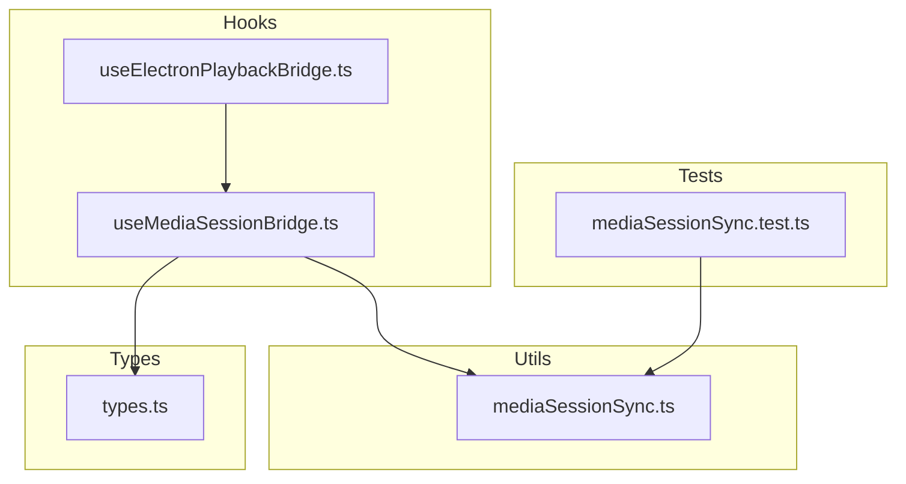
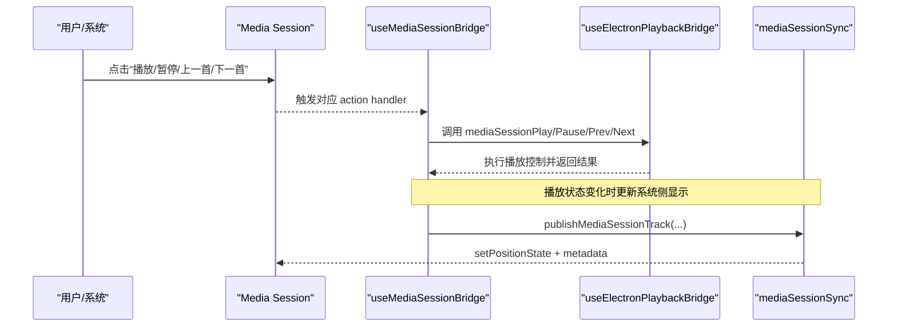
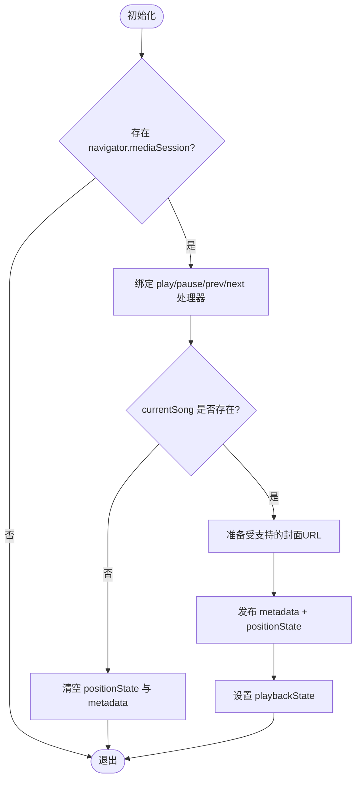
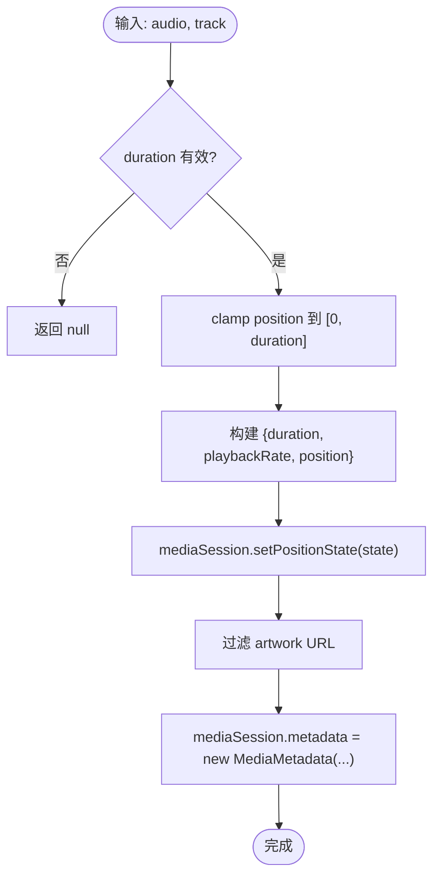
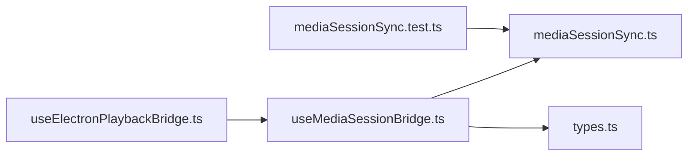

# 媒体会话API集成

<cite>
**本文引用的文件**
- [useMediaSessionBridge.ts](file://src/hooks/useMediaSessionBridge.ts)
- [mediaSessionSync.ts](file://src/utils/mediaSessionSync.ts)
- [useElectronPlaybackBridge.ts](file://src/hooks/useElectronPlaybackBridge.ts)
- [types.ts](file://src/types.ts)
- [mediaSessionSync.test.ts](file://test/unit/utils/mediaSessionSync.test.ts)
</cite>

## 目录
1. [简介](#简介)
2. [项目结构](#项目结构)
3. [核心组件](#核心组件)
4. [架构总览](#架构总览)
5. [详细组件分析](#详细组件分析)
6. [依赖关系分析](#依赖关系分析)
7. [性能考量](#性能考量)
8. [故障排除指南](#故障排除指南)
9. [结论](#结论)
10. [附录：使用模式与示例路径](#附录使用模式与示例路径)

## 简介
本技术文档聚焦 Folia Player 对 Web 媒体会话 API（Media Session）的集成方案，覆盖系统级媒体控制、锁屏/通知栏信息展示、耳机按键响应、播放状态同步、元数据更新、进度跟踪、事件处理、跨平台兼容性以及调试与排错方法。文档基于仓库中的实际实现进行解析，并提供可视化图示与可追溯的文件来源，帮助开发者在应用中正确集成媒体会话功能。

## 项目结构
围绕媒体会话的核心代码主要分布在以下位置：
- hooks 层：负责将播放器状态桥接到 Media Session，并绑定系统级动作处理器
- utils 层：提供媒体会话元数据与进度状态的发布工具函数
- 类型定义：统一播放器与阶段化播放的状态模型
- 测试：验证媒体会话工具函数的行为与边界条件

**图表来源**
- [useMediaSessionBridge.ts:1-210](file://src/hooks/useMediaSessionBridge.ts#L1-L210)
- [mediaSessionSync.ts:1-97](file://src/utils/mediaSessionSync.ts#L1-L97)
- [useElectronPlaybackBridge.ts:52-83](file://src/hooks/useElectronPlaybackBridge.ts#L52-L83)
- [types.ts:197-254](file://src/types.ts#L197-L254)
- [mediaSessionSync.test.ts:1-108](file://test/unit/utils/mediaSessionSync.test.ts#L1-L108)

**章节来源**
- [useMediaSessionBridge.ts:1-210](file://src/hooks/useMediaSessionBridge.ts#L1-L210)
- [mediaSessionSync.ts:1-97](file://src/utils/mediaSessionSync.ts#L1-L97)
- [useElectronPlaybackBridge.ts:52-83](file://src/hooks/useElectronPlaybackBridge.ts#L52-L83)
- [types.ts:197-254](file://src/types.ts#L197-L254)
- [mediaSessionSync.test.ts:1-108](file://test/unit/utils/mediaSessionSync.test.ts#L1-L108)

## 核心组件
- useMediaSessionBridge：React Hook，负责监听播放器状态变化，设置 Media Session 的动作处理器（播放/暂停/上一首/下一首），并维护播放状态与元数据同步。
- mediaSessionSync：工具模块，封装了媒体会话元数据构建、受支持的封面协议过滤、进度状态计算与发布顺序保证等能力。
- useElectronPlaybackBridge：在 Electron 环境下桥接任务栏控件、语音输入暂停恢复、远程命令等，间接调用媒体会话控制。
- types：定义 StageMediaSession 等类型，用于描述媒体会话上下文与阶段化播放状态。

**章节来源**
- [useMediaSessionBridge.ts:13-36](file://src/hooks/useMediaSessionBridge.ts#L13-L36)
- [mediaSessionSync.ts:3-97](file://src/utils/mediaSessionSync.ts#L3-L97)
- [useElectronPlaybackBridge.ts:52-83](file://src/hooks/useElectronPlaybackBridge.ts#L52-L83)
- [types.ts:197-254](file://src/types.ts#L197-L254)

## 架构总览
下图展示了从系统级交互到应用内部播放控制的完整链路：用户通过系统媒体面板或耳机按键触发操作，Media Session 回调进入 useMediaSessionBridge，再调用上层播放控制；同时，播放器的状态变化会反写回 Media Session，确保系统侧显示与应用内播放一致。

**图表来源**
- [useMediaSessionBridge.ts:58-107](file://src/hooks/useMediaSessionBridge.ts#L58-L107)
- [useMediaSessionBridge.ts:131-192](file://src/hooks/useMediaSessionBridge.ts#L131-L192)
- [mediaSessionSync.ts:75-97](file://src/utils/mediaSessionSync.ts#L75-L97)
- [useElectronPlaybackBridge.ts:424-488](file://src/hooks/useElectronPlaybackBridge.ts#L424-L488)

## 详细组件分析

### 组件A：useMediaSessionBridge（媒体会话桥接 Hook）
职责
- 检测浏览器是否支持 Media Session，安全地绑定/解绑动作处理器
- 将系统级播放/暂停/上一首/下一首事件转发给上层播放控制器
- 根据当前歌曲与音频元素状态，发布元数据与进度到 Media Session
- 处理 Electron 自定义协议封面的兼容问题（转换为 blob URL）
- 同步 playbackState 为 playing/paused/none

关键流程
- 动作处理器绑定：play/pause/previoustrack/nexttrack，均检查“禁止控制”标志与音频元素可用性
- 元数据发布：在 loadedmetadata/durationchange/playing 事件后发布，确保时间线可用
- 封面适配：当封面协议不被支持时，抓取资源并转为 blob URL 后再发布
- 播放状态：根据 isNowPlayingStageActive 与当前播放状态设置 playbackState

**图表来源**
- [useMediaSessionBridge.ts:53-107](file://src/hooks/useMediaSessionBridge.ts#L53-L107)
- [useMediaSessionBridge.ts:109-192](file://src/hooks/useMediaSessionBridge.ts#L109-L192)
- [useMediaSessionBridge.ts:194-208](file://src/hooks/useMediaSessionBridge.ts#L194-L208)

**章节来源**
- [useMediaSessionBridge.ts:53-107](file://src/hooks/useMediaSessionBridge.ts#L53-L107)
- [useMediaSessionBridge.ts:109-192](file://src/hooks/useMediaSessionBridge.ts#L109-L192)
- [useMediaSessionBridge.ts:194-208](file://src/hooks/useMediaSessionBridge.ts#L194-L208)

### 组件B：mediaSessionSync（媒体会话同步工具）
职责
- 过滤受支持的封面协议（http/https/data/blob），拒绝 Electron 自定义协议
- 校验音频源就绪状态，避免旧源的延迟事件污染新源
- 计算并限制 positionState 的 position/playbackRate/duration
- 保证先发布 positionState，再替换 metadata，防止 Chromium 清理会话

关键函数
- getSupportedMediaSessionArtworkUrl：规范化并过滤封面 URL
- isMediaSessionSourceReady：判断当前 audio 元素是否已准备好且匹配预期源
- createMediaSessionPositionState：生成合法的 MediaPositionState
- publishMediaSessionTrack：按顺序发布 positionState 与 metadata

**图表来源**
- [mediaSessionSync.ts:22-35](file://src/utils/mediaSessionSync.ts#L22-L35)
- [mediaSessionSync.ts:37-52](file://src/utils/mediaSessionSync.ts#L37-L52)
- [mediaSessionSync.ts:54-73](file://src/utils/mediaSessionSync.ts#L54-L73)
- [mediaSessionSync.ts:75-97](file://src/utils/mediaSessionSync.ts#L75-L97)

**章节来源**
- [mediaSessionSync.ts:22-97](file://src/utils/mediaSessionSync.ts#L22-L97)

### 组件C：useElectronPlaybackBridge（Electron 环境下的播放桥接）
职责
- 在 Electron 窗口中更新任务栏控件
- 处理语音输入状态变化导致的自动暂停/恢复
- 接收远程命令（如 seek/resume）并调用媒体会话控制
- 与 stage/playercap 等外部播放源协同，保持状态一致

关键点
- 语音输入激活时暂停播放，结束后若仍为暂停则恢复播放
- 远程命令中的 resume/seek 最终落到媒体会话控制或音频元素 seek
- 任务栏控件随播放状态、队列、循环模式等变化而更新

**章节来源**
- [useElectronPlaybackBridge.ts:424-488](file://src/hooks/useElectronPlaybackBridge.ts#L424-L488)
- [useElectronPlaybackBridge.ts:636-710](file://src/hooks/useElectronPlaybackBridge.ts#L636-L710)

### 组件D：类型与上下文（types.ts）
职责
- 定义 StageMediaSession、StageStatus 等类型，用于描述阶段化播放与媒体会话上下文
- 提供播放上下文、队列能力、控制能力等结构化字段，便于上层逻辑判断与渲染

**章节来源**
- [types.ts:197-254](file://src/types.ts#L197-L254)

## 依赖关系分析
- useMediaSessionBridge 依赖 mediaSessionSync 提供的工具函数，以安全地发布元数据与进度
- useElectronPlaybackBridge 在 Electron 环境中调用媒体会话控制，并与任务栏、远程命令、语音输入等子系统协作
- 类型定义贯穿各组件，确保状态一致性

**图表来源**
- [useElectronPlaybackBridge.ts:52-83](file://src/hooks/useElectronPlaybackBridge.ts#L52-L83)
- [useMediaSessionBridge.ts:1-11](file://src/hooks/useMediaSessionBridge.ts#L1-L11)
- [mediaSessionSync.ts:1-97](file://src/utils/mediaSessionSync.ts#L1-L97)
- [types.ts:197-254](file://src/types.ts#L197-L254)
- [mediaSessionSync.test.ts:1-108](file://test/unit/utils/mediaSessionSync.test.ts#L1-L108)

**章节来源**
- [useElectronPlaybackBridge.ts:52-83](file://src/hooks/useElectronPlaybackBridge.ts#L52-L83)
- [useMediaSessionBridge.ts:1-11](file://src/hooks/useMediaSessionBridge.ts#L1-L11)
- [mediaSessionSync.ts:1-97](file://src/utils/mediaSessionSync.ts#L1-L97)
- [types.ts:197-254](file://src/types.ts#L197-L254)
- [mediaSessionSync.test.ts:1-108](file://test/unit/utils/mediaSessionSync.test.ts#L1-L108)

## 性能考量
- 仅在音频元素时间线可用时发布媒体会话元数据，避免无效更新
- 封面资源按需抓取并转为 blob URL，减少不受支持协议的开销
- 使用 clamp 与校验确保 positionState 合法，降低系统侧异常风险
- 在 Electron 中谨慎处理任务栏控件更新频率，避免频繁重绘

[本节为通用指导，不直接分析具体文件]

## 故障排除指南
常见问题与定位建议
- 系统面板无元数据或封面
  - 检查 isMediaSessionSourceReady 是否返回 true，确认音频元素 readyState 与 duration 有效
  - 确认封面 URL 协议受支持（http/https/data/blob），否则需转换为 blob URL
  - 参考测试用例验证封面协议过滤与发布顺序
- 播放状态不同步
  - 检查 playbackState 设置逻辑，确认 isNowPlayingStageActive 与当前播放状态映射正确
  - 在 Electron 中检查语音输入状态变化是否导致意外暂停/恢复
- 动作处理器未生效
  - 确认 setActionHandlerSafely 成功绑定，且未处于“禁止控制”状态
  - 检查上层播放控制器是否正确暴露 mediaSessionPlay/Pause/Prev/Next

相关实现参考
- 动作处理器绑定与清理：[useMediaSessionBridge.ts:58-107](file://src/hooks/useMediaSessionBridge.ts#L58-L107)
- 元数据发布与封面兼容：[useMediaSessionBridge.ts:131-192](file://src/hooks/useMediaSessionBridge.ts#L131-L192)
- 进度状态计算与发布顺序：[mediaSessionSync.ts:54-97](file://src/utils/mediaSessionSync.ts#L54-L97)
- Electron 语音输入暂停恢复：[useElectronPlaybackBridge.ts:424-488](file://src/hooks/useElectronPlaybackBridge.ts#L424-L488)
- 单元测试覆盖：[mediaSessionSync.test.ts:1-108](file://test/unit/utils/mediaSessionSync.test.ts#L1-L108)

**章节来源**
- [useMediaSessionBridge.ts:58-107](file://src/hooks/useMediaSessionBridge.ts#L58-L107)
- [useMediaSessionBridge.ts:131-192](file://src/hooks/useMediaSessionBridge.ts#L131-L192)
- [mediaSessionSync.ts:54-97](file://src/utils/mediaSessionSync.ts#L54-L97)
- [useElectronPlaybackBridge.ts:424-488](file://src/hooks/useElectronPlaybackBridge.ts#L424-L488)
- [mediaSessionSync.test.ts:1-108](file://test/unit/utils/mediaSessionSync.test.ts#L1-L108)

## 结论
Folia Player 通过 useMediaSessionBridge 与 mediaSessionSync 的组合，实现了稳定、安全的 Web 媒体会话 API 集成。其设计重点在于：
- 严格的时间线与源匹配，避免旧事件污染
- 受支持的封面协议过滤与临时 blob URL 转换，提升跨平台兼容性
- 明确的发布顺序（先 positionState，后 metadata），保障系统侧会话完整性
- 在 Electron 环境下与任务栏、语音输入、远程命令等子系统的良好协作

该方案为系统级媒体控制、锁屏信息显示、耳机按键响应提供了可靠基础，适用于多操作系统与浏览器的差异适配场景。

[本节为总结性内容，不直接分析具体文件]

## 附录：使用模式与示例路径
- 绑定系统级动作处理器与清理：[useMediaSessionBridge.ts:58-107](file://src/hooks/useMediaSessionBridge.ts#L58-L107)
- 发布元数据与进度（含封面兼容）：[useMediaSessionBridge.ts:131-192](file://src/hooks/useMediaSessionBridge.ts#L131-L192)
- 设置播放状态（playing/paused/none）：[useMediaSessionBridge.ts:194-208](file://src/hooks/useMediaSessionBridge.ts#L194-L208)
- 工具函数：受支持封面协议过滤、源就绪校验、positionState 计算与发布：[mediaSessionSync.ts:22-97](file://src/utils/mediaSessionSync.ts#L22-L97)
- Electron 环境下的任务栏控件与语音输入处理：[useElectronPlaybackBridge.ts:424-488](file://src/hooks/useElectronPlaybackBridge.ts#L424-L488)
- 单元测试：验证工具函数行为与边界条件：[mediaSessionSync.test.ts:1-108](file://test/unit/utils/mediaSessionSync.test.ts#L1-L108)

[本节为引用路径汇总，不直接分析具体文件]