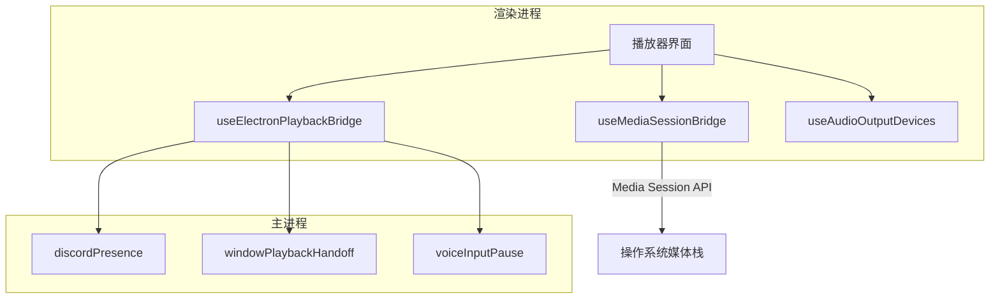
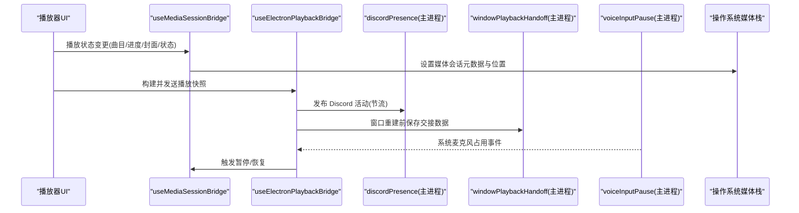
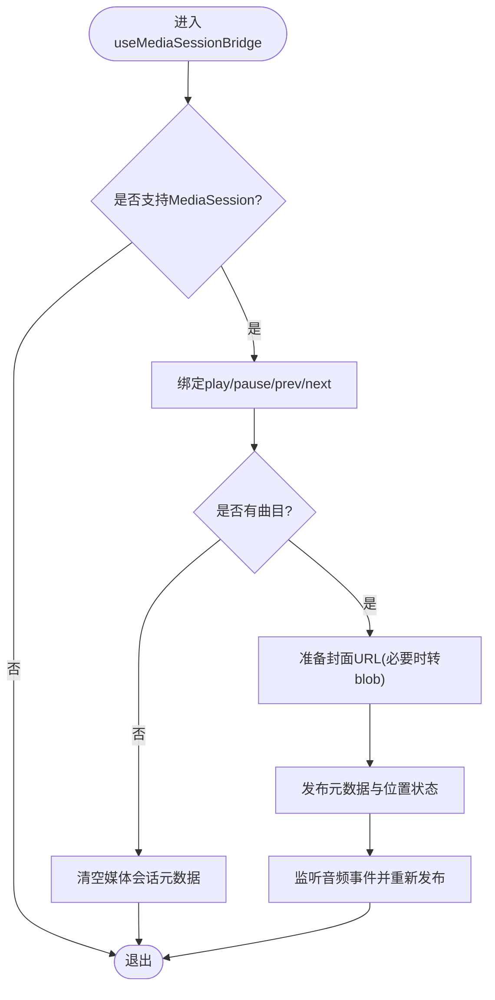
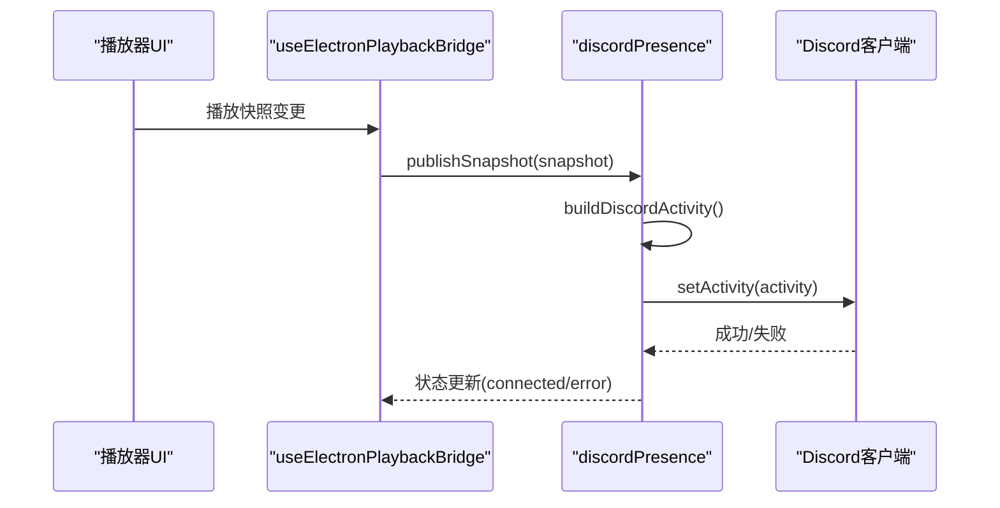
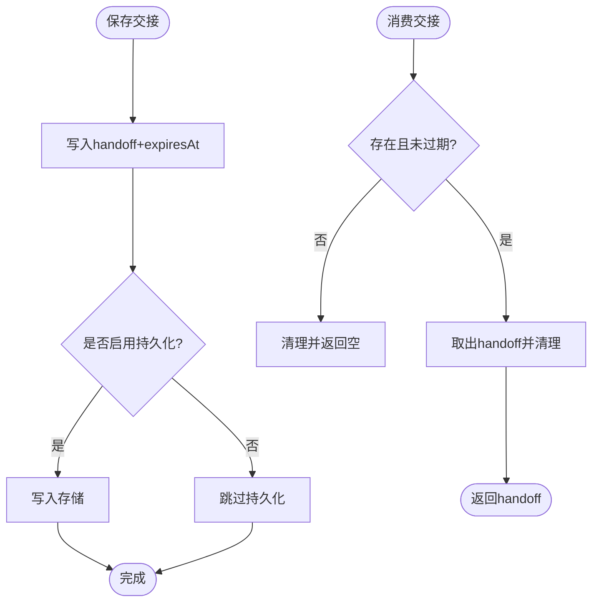
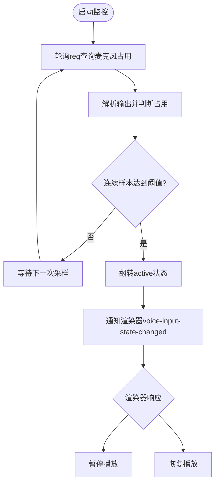
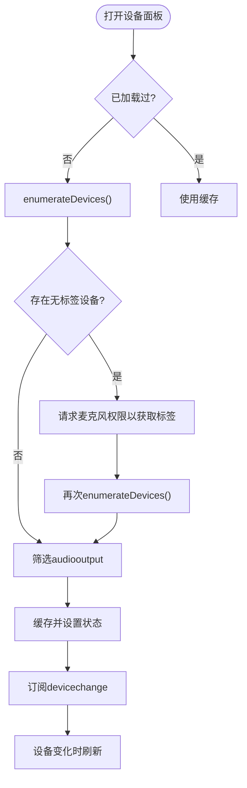
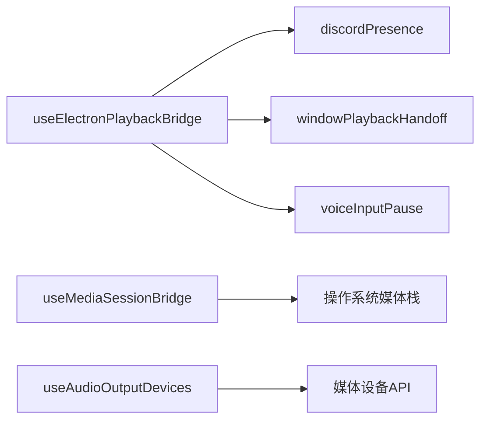

# 媒体系统集成

<cite>
**本文引用的文件**
- [electron/discordPresence.cjs](file://electron/discordPresence.cjs)
- [electron/windowPlaybackHandoff.cjs](file://electron/windowPlaybackHandoff.cjs)
- [electron/voiceInputPause.cjs](file://electron/voiceInputPause.cjs)
- [src/hooks/useMediaSessionBridge.ts](file://src/hooks/useMediaSessionBridge.ts)
- [src/utils/mediaSessionSync.ts](file://src/utils/mediaSessionSync.ts)
- [src/hooks/useElectronPlaybackBridge.ts](file://src/hooks/useElectronPlaybackBridge.ts)
- [src/hooks/useAudioOutputDevices.ts](file://src/hooks/useAudioOutputDevices.ts)
- [src/components/debug/MemoryMonitorWindow.tsx](file://src/components/debug/MemoryMonitorWindow.tsx)
- [package.json](file://package.json)
</cite>

## 目录
1. [简介](#简介)
2. [项目结构](#项目结构)
3. [核心组件](#核心组件)
4. [架构总览](#架构总览)
5. [详细组件分析](#详细组件分析)
6. [依赖关系分析](#依赖关系分析)
7. [性能考量](#性能考量)
8. [故障排查指南](#故障排查指南)
9. [结论](#结论)
10. [附录](#附录)

## 简介
本技术文档聚焦 Folia Player 的媒体系统集成，覆盖以下关键能力：
- 系统级媒体控制与锁屏显示（Media Session API）
- Discord Rich Presence 集成（游戏状态、活动信息同步）
- 窗口播放交接机制（多窗口状态同步、会话保持、资源管理）
- 语音输入暂停功能（麦克风检测、自动暂停/恢复）
- 媒体设备管理（音频输出设备选择与切换）
- 调试工具与问题排查方法

## 项目结构
本项目将媒体相关能力拆分为“前端桥接层”和“主进程能力层”，并通过 IPC 与平台 API 交互：
- 前端桥接层（React Hooks/Utils）
  - useMediaSessionBridge：将播放状态映射到浏览器 Media Session，驱动系统锁屏/耳机按键等
  - mediaSessionSync：封装位置状态与元数据发布，处理封面 URL 兼容
  - useElectronPlaybackBridge：统一 Electron 侧能力（远程控件、Discord 快照、Stage 播放、窗口交接消费）
  - useAudioOutputDevices：按需枚举并缓存音频输出设备，支持热插拔刷新
- 主进程能力层（Electron Main）
  - discordPresence：维护 Discord Rich Presence 客户端与活动更新节流
  - windowPlaybackHandoff：跨窗口/进程重启的播放交接存储（内存或持久化）
  - voiceInputPause：Windows 下监听系统麦克风占用，通知渲染器自动暂停/恢复

图表来源
- [src/hooks/useMediaSessionBridge.ts:1-210](file://src/hooks/useMediaSessionBridge.ts#L1-L210)
- [src/hooks/useElectronPlaybackBridge.ts:240-518](file://src/hooks/useElectronPlaybackBridge.ts#L240-L518)
- [electron/discordPresence.cjs:103-275](file://electron/discordPresence.cjs#L103-L275)
- [electron/windowPlaybackHandoff.cjs:11-97](file://electron/windowPlaybackHandoff.cjs#L11-L97)
- [electron/voiceInputPause.cjs:107-213](file://electron/voiceInputPause.cjs#L107-L213)

章节来源
- [src/hooks/useMediaSessionBridge.ts:1-210](file://src/hooks/useMediaSessionBridge.ts#L1-L210)
- [src/utils/mediaSessionSync.ts:1-97](file://src/utils/mediaSessionSync.ts#L1-L97)
- [src/hooks/useElectronPlaybackBridge.ts:240-518](file://src/hooks/useElectronPlaybackBridge.ts#L240-L518)
- [electron/discordPresence.cjs:103-275](file://electron/discordPresence.cjs#L103-L275)
- [electron/windowPlaybackHandoff.cjs:11-97](file://electron/windowPlaybackHandoff.cjs#L11-L97)
- [electron/voiceInputPause.cjs:107-213](file://electron/voiceInputPause.cjs#L107-L213)

## 核心组件
- 系统媒体会话桥接（Media Session）
  - 作用：将当前曲目、进度、封面、播放状态同步至系统媒体栈，支持锁屏显示、耳机按键、任务栏媒体控件。
  - 关键点：仅在源就绪时更新；封面 URL 需为 http/https/data/blob；在 Electron 自定义协议场景下使用 blob 过渡。
- Discord Rich Presence
  - 作用：在主进程维护 Discord 客户端，按播放快照生成活动信息，节流更新，清理/重连。
  - 关键点：应用 ID 校验、图片 URL 白名单、开始/结束时间估算、连接状态上报。
- 窗口播放交接
  - 作用：在窗口重建或进程重启时保存/恢复播放会话（歌曲、进度、播放状态），支持内存与持久化两种存储。
  - 关键点：TTL 过期策略、幂等 consume、失败降级。
- 语音输入暂停
  - 作用：在 Windows 上轮询系统麦克风占用，检测到系统语音输入激活时自动暂停播放，结束后恢复。
  - 关键点：注册表查询、去抖确认、仅对非自身进程生效。
- 音频输出设备管理
  - 作用：按需枚举音频输出设备，缓存结果，订阅设备变化，支持用户选择与标签记忆。
  - 关键点：避免启动即枚举；必要时请求麦克风权限以获取设备名；及时释放临时流。

章节来源
- [src/hooks/useMediaSessionBridge.ts:1-210](file://src/hooks/useMediaSessionBridge.ts#L1-L210)
- [src/utils/mediaSessionSync.ts:1-97](file://src/utils/mediaSessionSync.ts#L1-L97)
- [electron/discordPresence.cjs:1-285](file://electron/discordPresence.cjs#L1-L285)
- [electron/windowPlaybackHandoff.cjs:1-102](file://electron/windowPlaybackHandoff.cjs#L1-L102)
- [electron/voiceInputPause.cjs:1-219](file://electron/voiceInputPause.cjs#L1-L219)
- [src/hooks/useAudioOutputDevices.ts:1-220](file://src/hooks/useAudioOutputDevices.ts#L1-L220)

## 架构总览
下图展示了从播放状态到系统媒体栈、第三方服务与窗口间会话传递的整体流程。

图表来源
- [src/hooks/useMediaSessionBridge.ts:53-107](file://src/hooks/useMediaSessionBridge.ts#L53-L107)
- [src/hooks/useMediaSessionBridge.ts:109-192](file://src/hooks/useMediaSessionBridge.ts#L109-L192)
- [src/hooks/useElectronPlaybackBridge.ts:240-518](file://src/hooks/useElectronPlaybackBridge.ts#L240-L518)
- [electron/discordPresence.cjs:228-264](file://electron/discordPresence.cjs#L228-L264)
- [electron/windowPlaybackHandoff.cjs:59-80](file://electron/windowPlaybackHandoff.cjs#L59-L80)
- [electron/voiceInputPause.cjs:120-151](file://electron/voiceInputPause.cjs#L120-L151)

## 详细组件分析

### 系统媒体会话（锁屏/耳机按键）
- 行为
  - 绑定 play/pause/prev/next 动作处理器，转发到实际播放逻辑。
  - 当有曲目时，发布媒体元数据（标题、艺人、专辑、封面）与位置状态。
  - 在 Electron 自定义协议下，若封面不被接受，则下载为 blob URL 再发布。
- 复杂度与健壮性
  - 仅在音频源就绪且匹配当前源时更新，避免旧源延迟事件污染。
  - 对不支持的封面协议进行安全过滤与降级。
- 典型调用路径
  - 播放/暂停：通过 MediaSession 动作 -> 调用播放控制 -> 更新状态。
  - 元数据更新：loadedmetadata/durationchange/playing 事件触发发布。

图表来源
- [src/hooks/useMediaSessionBridge.ts:53-107](file://src/hooks/useMediaSessionBridge.ts#L53-L107)
- [src/hooks/useMediaSessionBridge.ts:109-192](file://src/hooks/useMediaSessionBridge.ts#L109-L192)
- [src/utils/mediaSessionSync.ts:22-52](file://src/utils/mediaSessionSync.ts#L22-L52)
- [src/utils/mediaSessionSync.ts:54-97](file://src/utils/mediaSessionSync.ts#L54-L97)

章节来源
- [src/hooks/useMediaSessionBridge.ts:1-210](file://src/hooks/useMediaSessionBridge.ts#L1-L210)
- [src/utils/mediaSessionSync.ts:1-97](file://src/utils/mediaSessionSync.ts#L1-L97)

### Discord Rich Presence 集成
- 行为
  - 根据播放快照构建活动信息（名称、详情、状态、封面、起止时间）。
  - 维护 Discord 客户端生命周期（登录、断开、销毁），错误可恢复。
  - 节流更新（默认间隔），避免频繁 RPC 调用。
- 配置与安全
  - 应用 ID 必须为合法数字字符串；图片 URL 仅允许 https/http，拒绝本地回环地址。
- 状态上报
  - 提供 enabled/configured/connected/error/applicationId 等状态，供 UI 展示。

图表来源
- [electron/discordPresence.cjs:52-101](file://electron/discordPresence.cjs#L52-L101)
- [electron/discordPresence.cjs:166-226](file://electron/discordPresence.cjs#L166-L226)
- [electron/discordPresence.cjs:228-264](file://electron/discordPresence.cjs#L228-L264)
- [src/hooks/useElectronPlaybackBridge.ts:527-536](file://src/hooks/useElectronPlaybackBridge.ts#L527-L536)

章节来源
- [electron/discordPresence.cjs:1-285](file://electron/discordPresence.cjs#L1-L285)
- [src/hooks/useElectronPlaybackBridge.ts:527-536](file://src/hooks/useElectronPlaybackBridge.ts#L527-L536)

### 窗口播放交接机制
- 目标
  - 在多窗口/进程重建或壁纸模式重启后，恢复歌曲、进度与播放状态。
- 实现要点
  - 内存态：进程内保存 handoff，带 TTL 过期。
  - 持久化态：可选 electron-store-like 存储，键值包含 handoff 与 expiresAt。
  - 幂等消费：consume 读取后立即清除，防止重复恢复。
- 使用流程
  - 窗口关闭/重建前：save(handoff)。
  - 新窗口启动：peek/consume 恢复，失败则降级。

图表来源
- [electron/windowPlaybackHandoff.cjs:11-97](file://electron/windowPlaybackHandoff.cjs#L11-L97)

章节来源
- [electron/windowPlaybackHandoff.cjs:1-102](file://electron/windowPlaybackHandoff.cjs#L1-L102)

### 语音输入暂停功能
- 目标
  - 在 Windows 上检测系统语音输入（如系统语音打字/IME）正在使用时，自动暂停播放；结束后恢复。
- 实现要点
  - 通过 reg query 查询麦克风同意存储，解析 LastUsedTimeStart/Stop 判断占用。
  - 忽略自身进程占用，避免误判。
  - 连续采样确认（开始/停止不同阈值），降低抖动。
  - 通过 IPC 向渲染器发送状态变更，由渲染器触发暂停/恢复。
- 流程图

图表来源
- [electron/voiceInputPause.cjs:38-102](file://electron/voiceInputPause.cjs#L38-L102)
- [electron/voiceInputPause.cjs:107-151](file://electron/voiceInputPause.cjs#L107-L151)
- [src/hooks/useElectronPlaybackBridge.ts:452-469](file://src/hooks/useElectronPlaybackBridge.ts#L452-L469)

章节来源
- [electron/voiceInputPause.cjs:1-219](file://electron/voiceInputPause.cjs#L1-L219)
- [src/hooks/useElectronPlaybackBridge.ts:452-469](file://src/hooks/useElectronPlaybackBridge.ts#L452-L469)

### 媒体设备管理（音频输出）
- 目标
  - 列出可用音频输出设备，支持用户选择与热插拔刷新。
- 实现要点
  - 延迟枚举：仅在用户打开设备面板时枚举，避免启动开销。
  - 设备名获取：若无标签，尝试请求麦克风权限以解锁设备名。
  - 缓存与订阅：缓存设备列表，订阅 devicechange 事件刷新。
  - 资源释放：及时停止临时 MediaStream，避免长期占用。
- 使用建议
  - 在设置面板中调用 ensureLoaded/refresh。
  - 结合 HTMLMediaElement.setSinkId 切换输出设备（由上层调用）。

图表来源
- [src/hooks/useAudioOutputDevices.ts:25-30](file://src/hooks/useAudioOutputDevices.ts#L25-L30)
- [src/hooks/useAudioOutputDevices.ts:95-144](file://src/hooks/useAudioOutputDevices.ts#L95-L144)
- [src/hooks/useAudioOutputDevices.ts:180-204](file://src/hooks/useAudioOutputDevices.ts#L180-L204)

章节来源
- [src/hooks/useAudioOutputDevices.ts:1-220](file://src/hooks/useAudioOutputDevices.ts#L1-L220)

## 依赖关系分析
- 前端到主进程
  - useElectronPlaybackBridge 负责聚合并发布多种快照（远程控件、Discord、Stage、任务栏控件），并消费窗口交接。
- 主进程到系统
  - discordPresence 依赖 @xhayper/discord-rpc 与系统 IPC。
  - voiceInputPause 依赖 Windows reg 命令与注册表。
  - windowPlaybackHandoff 依赖可选存储（electron-store 风格）。
- 前端到系统
  - useMediaSessionBridge 直接操作 navigator.mediaSession。
  - useAudioOutputDevices 使用 navigator.mediaDevices。

图表来源
- [src/hooks/useElectronPlaybackBridge.ts:240-518](file://src/hooks/useElectronPlaybackBridge.ts#L240-L518)
- [electron/discordPresence.cjs:166-226](file://electron/discordPresence.cjs#L166-L226)
- [electron/voiceInputPause.cjs:86-102](file://electron/voiceInputPause.cjs#L86-L102)
- [electron/windowPlaybackHandoff.cjs:11-97](file://electron/windowPlaybackHandoff.cjs#L11-L97)
- [src/hooks/useMediaSessionBridge.ts:53-107](file://src/hooks/useMediaSessionBridge.ts#L53-L107)
- [src/hooks/useAudioOutputDevices.ts:95-144](file://src/hooks/useAudioOutputDevices.ts#L95-L144)

章节来源
- [src/hooks/useElectronPlaybackBridge.ts:240-518](file://src/hooks/useElectronPlaybackBridge.ts#L240-L518)
- [electron/discordPresence.cjs:166-226](file://electron/discordPresence.cjs#L166-L226)
- [electron/voiceInputPause.cjs:86-102](file://electron/voiceInputPause.cjs#L86-L102)
- [electron/windowPlaybackHandoff.cjs:11-97](file://electron/windowPlaybackHandoff.cjs#L11-L97)
- [src/hooks/useMediaSessionBridge.ts:53-107](file://src/hooks/useMediaSessionBridge.ts#L53-L107)
- [src/hooks/useAudioOutputDevices.ts:95-144](file://src/hooks/useAudioOutputDevices.ts#L95-L144)

## 性能考量
- Discord 活动更新节流：避免频繁 RPC 导致卡顿或封禁风险。
- 媒体会话元数据发布：仅在源就绪且匹配时更新，减少无效调用。
- 设备枚举成本：延迟枚举与缓存，避免启动开销与不必要的麦克风权限请求。
- 窗口交接 TTL：合理设置 TTL，避免陈旧数据干扰。
- 内存与原生资源：通过调试窗口观察 Working Set/Heap 趋势，定位泄漏或高占用。

[本节为通用指导，不直接分析具体文件]

## 故障排查指南
- 媒体会话异常
  - 现象：锁屏/耳机按键无效或元数据不更新。
  - 检查：是否支持 MediaSession；音频源是否就绪；封面 URL 是否被接受；是否在 Electron 自定义协议下需要 blob 过渡。
  - 参考：[src/hooks/useMediaSessionBridge.ts:53-107](file://src/hooks/useMediaSessionBridge.ts#L53-L107)、[src/utils/mediaSessionSync.ts:22-52](file://src/utils/mediaSessionSync.ts#L22-L52)
- Discord 未显示或频繁断开
  - 现象：Rich Presence 未生效或连接不稳定。
  - 检查：应用 ID 是否合法；图片 URL 是否白名单；客户端是否成功登录；错误消息。
  - 参考：[electron/discordPresence.cjs:8-45](file://electron/discordPresence.cjs#L8-L45)、[electron/discordPresence.cjs:166-226](file://electron/discordPresence.cjs#L166-L226)
- 窗口重建后播放未恢复
  - 现象：重启后回到开头或未继续播放。
  - 检查：交接数据是否保存成功；TTL 是否过期；是否成功 consume。
  - 参考：[electron/windowPlaybackHandoff.cjs:59-80](file://electron/windowPlaybackHandoff.cjs#L59-L80)
- 语音输入未触发暂停
  - 现象：系统语音输入开启但未暂停。
  - 检查：平台是否为 Windows；reg 查询是否成功；是否忽略自身进程；连续样本阈值是否达到。
  - 参考：[electron/voiceInputPause.cjs:38-102](file://electron/voiceInputPause.cjs#L38-L102)、[electron/voiceInputPause.cjs:107-151](file://electron/voiceInputPause.cjs#L107-L151)
- 音频输出设备无法选择
  - 现象：设备列表为空或无标签。
  - 检查：是否支持 setSinkId；是否需要麦克风权限以获取标签；是否订阅了 devicechange。
  - 参考：[src/hooks/useAudioOutputDevices.ts:25-30](file://src/hooks/useAudioOutputDevices.ts#L25-L30)、[src/hooks/useAudioOutputDevices.ts:95-144](file://src/hooks/useAudioOutputDevices.ts#L95-L144)
- 内存/性能问题
  - 现象：长时间运行后卡顿或内存增长。
  - 检查：使用内存监控窗口查看 Working Set/Heap 趋势；关注原生资源（解码音频、WebAudio 节点、ONNX 会话）。
  - 参考：[src/components/debug/MemoryMonitorWindow.tsx:1-274](file://src/components/debug/MemoryMonitorWindow.tsx#L1-L274)

章节来源
- [src/hooks/useMediaSessionBridge.ts:53-107](file://src/hooks/useMediaSessionBridge.ts#L53-L107)
- [src/utils/mediaSessionSync.ts:22-52](file://src/utils/mediaSessionSync.ts#L22-L52)
- [electron/discordPresence.cjs:8-45](file://electron/discordPresence.cjs#L8-L45)
- [electron/discordPresence.cjs:166-226](file://electron/discordPresence.cjs#L166-L226)
- [electron/windowPlaybackHandoff.cjs:59-80](file://electron/windowPlaybackHandoff.cjs#L59-L80)
- [electron/voiceInputPause.cjs:38-102](file://electron/voiceInputPause.cjs#L38-L102)
- [electron/voiceInputPause.cjs:107-151](file://electron/voiceInputPause.cjs#L107-L151)
- [src/hooks/useAudioOutputDevices.ts:25-30](file://src/hooks/useAudioOutputDevices.ts#L25-L30)
- [src/hooks/useAudioOutputDevices.ts:95-144](file://src/hooks/useAudioOutputDevices.ts#L95-L144)
- [src/components/debug/MemoryMonitorWindow.tsx:1-274](file://src/components/debug/MemoryMonitorWindow.tsx#L1-L274)

## 结论
Folia Player 的媒体系统集成通过清晰的前后端分层与平台 API 抽象，实现了稳定的系统级媒体控制、Discord 活动同步、窗口会话交接、智能语音输入暂停以及灵活的音频设备管理。各模块具备完善的容错与节流策略，配合调试工具可有效定位与优化问题。

[本节为总结性内容，不直接分析具体文件]

## 附录
- 构建与打包
  - Electron 构建脚本与资源打包配置位于 package.json，确保必要的二进制与资源随包分发。
  - 参考：[package.json:43-47](file://package.json#L43-L47)、[package.json:52-110](file://package.json#L52-L110)

章节来源
- [package.json:43-47](file://package.json#L43-L47)
- [package.json:52-110](file://package.json#L52-L110)