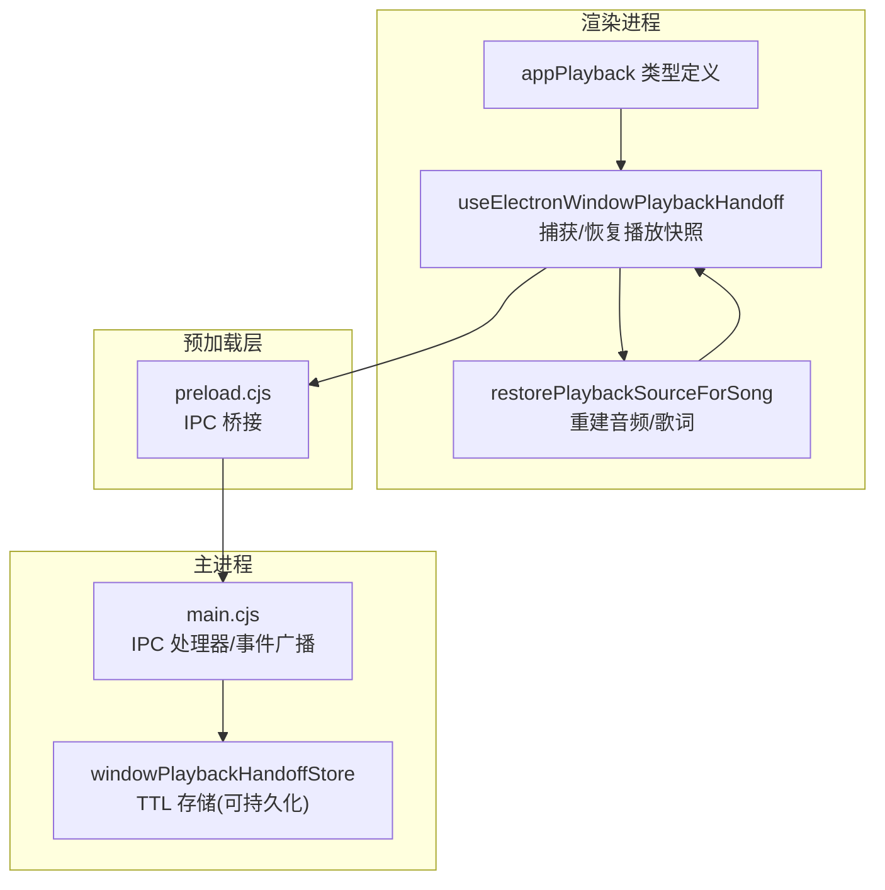
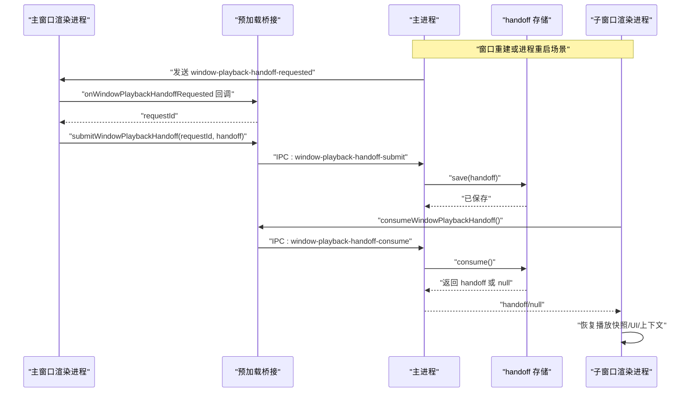
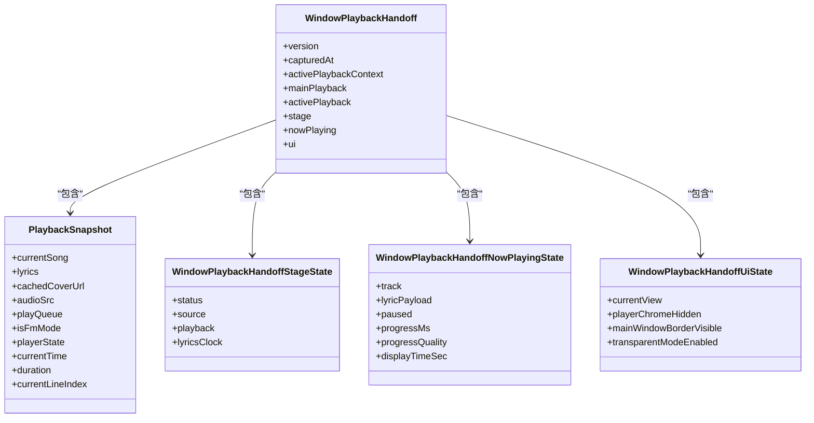
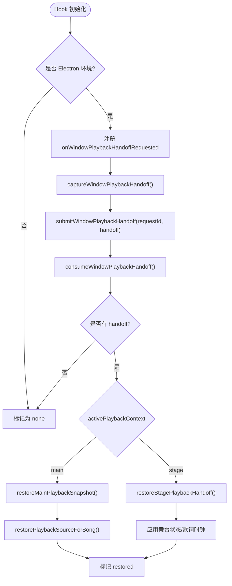
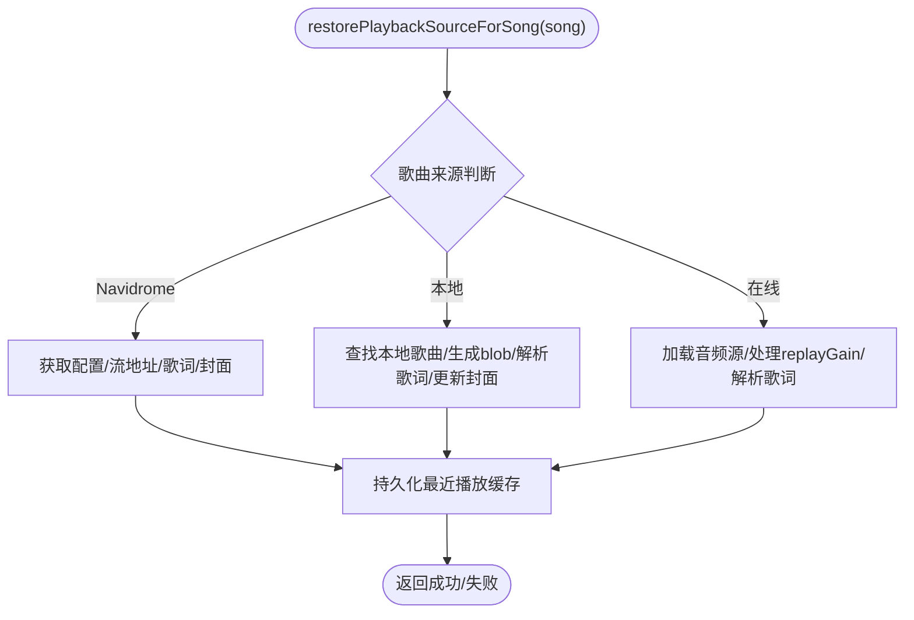
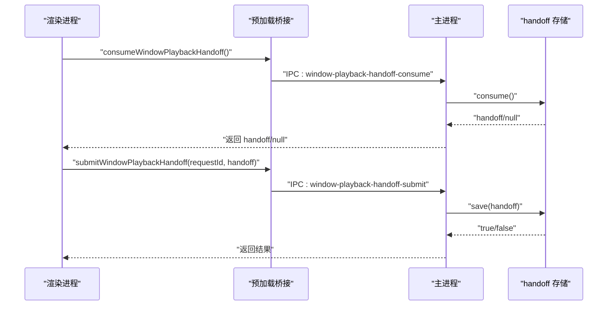
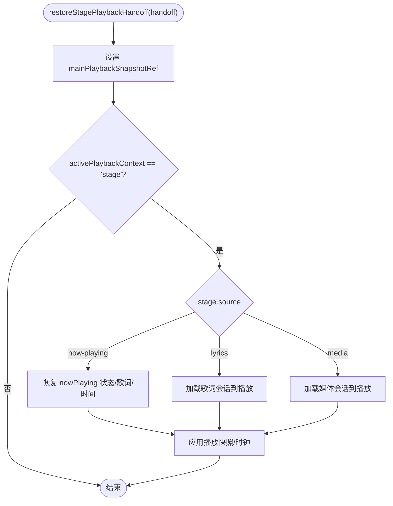
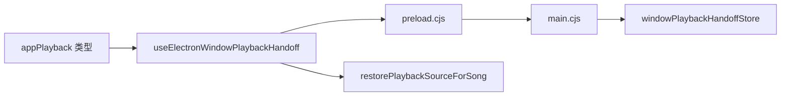

# 窗口播放交接

<cite>
**本文引用的文件**
- [electron/windowPlaybackHandoff.cjs](file://electron/windowPlaybackHandoff.cjs)
- [electron/preload.cjs](file://electron/preload.cjs)
- [electron/main.cjs](file://electron/main.cjs)
- [src/hooks/useElectronWindowPlaybackHandoff.ts](file://src/hooks/useElectronWindowPlaybackHandoff.ts)
- [src/hooks/useStagePlaybackController.ts](file://src/hooks/useStagePlaybackController.ts)
- [src/components/app/playback/restorePlaybackSource.ts](file://src/components/app/playback/restorePlaybackSource.ts)
- [src/types/appPlayback.ts](file://src/types/appPlayback.ts)
</cite>

## 目录
1. [简介](#简介)
2. [项目结构](#项目结构)
3. [核心组件](#核心组件)
4. [架构总览](#架构总览)
5. [详细组件分析](#详细组件分析)
6. [依赖关系分析](#依赖关系分析)
7. [性能考虑](#性能考虑)
8. [故障排查指南](#故障排查指南)
9. [结论](#结论)
10. [附录](#附录)

## 简介
本技术文档聚焦 Folia Player 的“窗口播放交接”机制，解释主窗口与子窗口（包括舞台模式、透明壁纸模式等）之间的播放状态共享、会话保持与资源管理。重点覆盖：
- 播放会话生命周期：窗口创建时的状态继承、关闭时的资源清理、异常恢复
- IPC 通信协议：消息格式、事件监听、错误处理
- 跨窗口数据一致性：播放进度同步、队列状态维护、用户偏好同步
- 性能优化建议：内存管理、网络请求优化、渲染调优
- 调试与测试方法：验证窗口交接正确性的实践

## 项目结构
窗口播放交接涉及前端 Hook、类型定义、回放源恢复、预加载桥接以及主进程 IPC 处理与持久化存储。整体组织如下：
- 前端侧：React Hook 负责捕获/恢复播放快照，并通过 window.electron 暴露的 IPC 接口与主进程交互
- 类型层：统一描述 WindowPlaybackHandoff、PlaybackSnapshot、NowPlaying 等数据结构
- 回放恢复：根据歌曲来源（本地、在线、Navidrome）重建可播放音频与歌词
- 主进程侧：提供消费/提交 handoff 的 IPC 处理器，并维护短生命周期的 handoff 存储（支持可选持久化）

**图表来源**
- [src/hooks/useElectronWindowPlaybackHandoff.ts:119-449](file://src/hooks/useElectronWindowPlaybackHandoff.ts#L119-L449)
- [src/components/app/playback/restorePlaybackSource.ts:66-297](file://src/components/app/playback/restorePlaybackSource.ts#L66-L297)
- [src/types/appPlayback.ts:47-105](file://src/types/appPlayback.ts#L47-L105)
- [electron/preload.cjs:140-149](file://electron/preload.cjs#L140-L149)
- [electron/main.cjs:4798-4816](file://electron/main.cjs#L4798-L4816)
- [electron/windowPlaybackHandoff.cjs:11-97](file://electron/windowPlaybackHandoff.cjs#L11-L97)

**章节来源**
- [src/hooks/useElectronWindowPlaybackHandoff.ts:119-449](file://src/hooks/useElectronWindowPlaybackHandoff.ts#L119-L449)
- [electron/preload.cjs:140-149](file://electron/preload.cjs#L140-L149)
- [electron/main.cjs:4798-4816](file://electron/main.cjs#L4798-L4816)
- [electron/windowPlaybackHandoff.cjs:11-97](file://electron/windowPlaybackHandoff.cjs#L11-L97)
- [src/types/appPlayback.ts:47-105](file://src/types/appPlayback.ts#L47-L105)

## 核心组件
- 播放快照与交接对象
  - PlaybackSnapshot：记录当前歌曲、歌词、封面、音频源、队列、FM 模式、播放器状态、时间与行索引
  - WindowPlaybackHandoff：版本化交接对象，包含 activePlaybackContext、mainPlayback、activePlayback、stage、nowPlaying、ui 等
- 前端 Hook
  - useElectronWindowPlaybackHandoff：构建/恢复播放快照，订阅主进程请求，消费 handoff，切换 UI 与播放上下文
- 回放源恢复
  - restorePlaybackSourceForSong：按歌曲来源重建音频源与歌词，更新队列与主题缓存
- 主进程存储
  - createWindowPlaybackHandoffStore：TTL 语义的短期存储，可选 electron-store 持久化，支持 save/consume/peek/clear
- 预加载桥接
  - preload.cjs：将 consume/submit/onRequested 等方法暴露给渲染进程
- 主进程 IPC
  - main.cjs：处理 window-playback-handoff-consume/submit，触发 window-playback-handoff-requested 事件，安全校验可信窗口

**章节来源**
- [src/types/appPlayback.ts:47-105](file://src/types/appPlayback.ts#L47-L105)
- [src/hooks/useElectronWindowPlaybackHandoff.ts:119-449](file://src/hooks/useElectronWindowPlaybackHandoff.ts#L119-L449)
- [src/components/app/playback/restorePlaybackSource.ts:66-297](file://src/components/app/playback/restorePlaybackSource.ts#L66-L297)
- [electron/windowPlaybackHandoff.cjs:11-97](file://electron/windowPlaybackHandoff.cjs#L11-L97)
- [electron/preload.cjs:140-149](file://electron/preload.cjs#L140-L149)
- [electron/main.cjs:4798-4816](file://electron/main.cjs#L4798-L4816)

## 架构总览
窗口播放交接通过“请求-响应”模式完成：
- 主进程在需要交接时向主窗口发送 window-playback-handoff-requested 事件
- 主窗口通过 onWindowPlaybackHandoffRequested 回调捕获当前播放快照并提交到主进程
- 主进程将 handoff 存入 TTL 存储；新窗口启动后通过 consumeWindowPlaybackHandoff 消费并恢复
- 若没有有效 handoff，则走正常初始化流程

**图表来源**
- [electron/main.cjs:3420-3433](file://electron/main.cjs#L3420-L3433)
- [electron/main.cjs:4798-4816](file://electron/main.cjs#L4798-L4816)
- [electron/preload.cjs:140-149](file://electron/preload.cjs#L140-L149)
- [electron/windowPlaybackHandoff.cjs:11-97](file://electron/windowPlaybackHandoff.cjs#L11-L97)
- [src/hooks/useElectronWindowPlaybackHandoff.ts:392-442](file://src/hooks/useElectronWindowPlaybackHandoff.ts#L392-L442)

## 详细组件分析

### 播放快照与交接对象模型
- PlaybackSnapshot：用于记录主/活动上下文的播放快照，包含歌曲、歌词、封面、音频源、队列、FM 模式、播放器状态、时间与行索引
- WindowPlaybackHandoff：版本化交接对象，包含 capturedAt、activePlaybackContext、mainPlayback、activePlayback、stage、nowPlaying、ui
- NowPlaying 与 Stage 状态：分别记录当前正在播放的轨道与歌词负载、舞台状态与歌词时钟

**图表来源**
- [src/types/appPlayback.ts:47-105](file://src/types/appPlayback.ts#L47-L105)

**章节来源**
- [src/types/appPlayback.ts:47-105](file://src/types/appPlayback.ts#L47-L105)

### 前端 Hook：捕获与恢复播放快照
- 捕获逻辑：buildPlaybackSnapshot 收集当前播放相关状态；captureWindowPlaybackHandoff 组装完整的 WindowPlaybackHandoff
- 恢复逻辑：restoreWindowPlaybackHandoff 根据 activePlaybackContext 决定恢复主上下文或舞台上下文；restoreMainPlaybackSnapshot 设置队列、时间、播放器状态并调用 restorePlaybackSourceForSong 重建音频/歌词
- IPC 集成：onWindowPlaybackHandoffRequested 监听主进程请求并提交快照；consumeWindowPlaybackHandoff 消费 handoff 并恢复

**图表来源**
- [src/hooks/useElectronWindowPlaybackHandoff.ts:119-449](file://src/hooks/useElectronWindowPlaybackHandoff.ts#L119-L449)
- [src/components/app/playback/restorePlaybackSource.ts:66-297](file://src/components/app/playback/restorePlaybackSource.ts#L66-L297)

**章节来源**
- [src/hooks/useElectronWindowPlaybackHandoff.ts:119-449](file://src/hooks/useElectronWindowPlaybackHandoff.ts#L119-L449)
- [src/components/app/playback/restorePlaybackSource.ts:66-297](file://src/components/app/playback/restorePlaybackSource.ts#L66-L297)

### 回放源恢复：音频与歌词重建
- 本地歌曲：查找本地库、生成 blob URL、解析内嵌/本地歌词、更新封面与队列
- 在线歌曲：加载音频源、处理 replayGain、优先使用缓存歌词或拉取在线歌词
- Navidrome：获取服务器信息、流地址、歌词与封面
- 失败回退：当无法恢复时，提示用户或回退到快照中的 audioSrc（非 blob）

**图表来源**
- [src/components/app/playback/restorePlaybackSource.ts:66-297](file://src/components/app/playback/restorePlaybackSource.ts#L66-L297)

**章节来源**
- [src/components/app/playback/restorePlaybackSource.ts:66-297](file://src/components/app/playback/restorePlaybackSource.ts#L66-L297)

### 主进程 IPC 与手递手存储
- 消费接口：window-playback-handoff-consume 仅对可信主窗口内容有效，返回 store.consume()
- 提交接口：window-playback-handoff-submit 支持两种模式：无 requestId 直接记住 handoff；有 requestId 则解决待处理的请求
- 事件广播：window-playback-handoff-requested 通知主窗口提交快照
- 存储实现：createWindowPlaybackHandoffStore 提供 TTL 语义，支持可选持久化（electron-store），过期自动清理

**图表来源**
- [electron/main.cjs:4798-4816](file://electron/main.cjs#L4798-L4816)
- [electron/windowPlaybackHandoff.cjs:11-97](file://electron/windowPlaybackHandoff.cjs#L11-L97)
- [electron/preload.cjs:140-149](file://electron/preload.cjs#L140-L149)

**章节来源**
- [electron/main.cjs:4798-4816](file://electron/main.cjs#L4798-L4816)
- [electron/windowPlaybackHandoff.cjs:11-97](file://electron/windowPlaybackHandoff.cjs#L11-L97)
- [electron/preload.cjs:140-149](file://electron/preload.cjs#L140-L149)

### 舞台模式下的交接恢复
- restoreStagePlaybackHandoff：根据 stage.status/source 选择恢复 now-playing、歌词或媒体会话；必要时应用 PlaybackSnapshot
- 与主上下文快照互备：mainPlaybackSnapshotRef.current 在切换上下文时保存/恢复，确保主/舞台之间的一致性

**图表来源**
- [src/hooks/useStagePlaybackController.ts:787-876](file://src/hooks/useStagePlaybackController.ts#L787-L876)

**章节来源**
- [src/hooks/useStagePlaybackController.ts:787-876](file://src/hooks/useStagePlaybackController.ts#L787-L876)

## 依赖关系分析
- 前端 Hook 依赖类型定义 appPlayback.ts，确保交接对象结构一致
- Hook 通过 preload.cjs 暴露的 IPC 方法与 main.cjs 交互
- main.cjs 使用 windowPlaybackHandoffStore 管理 TTL 存储，保证跨进程/重启的短暂会话保持
- restorePlaybackSourceForSong 依赖本地库、在线服务与歌词解析工具，确保恢复后的可播放性

**图表来源**
- [src/types/appPlayback.ts:47-105](file://src/types/appPlayback.ts#L47-L105)
- [src/hooks/useElectronWindowPlaybackHandoff.ts:119-449](file://src/hooks/useElectronWindowPlaybackHandoff.ts#L119-L449)
- [electron/preload.cjs:140-149](file://electron/preload.cjs#L140-L149)
- [electron/main.cjs:4798-4816](file://electron/main.cjs#L4798-L4816)
- [electron/windowPlaybackHandoff.cjs:11-97](file://electron/windowPlaybackHandoff.cjs#L11-L97)
- [src/components/app/playback/restorePlaybackSource.ts:66-297](file://src/components/app/playback/restorePlaybackSource.ts#L66-L297)

**章节来源**
- [src/types/appPlayback.ts:47-105](file://src/types/appPlayback.ts#L47-L105)
- [src/hooks/useElectronWindowPlaybackHandoff.ts:119-449](file://src/hooks/useElectronWindowPlaybackHandoff.ts#L119-L449)
- [electron/preload.cjs:140-149](file://electron/preload.cjs#L140-L149)
- [electron/main.cjs:4798-4816](file://electron/main.cjs#L4798-L4816)
- [electron/windowPlaybackHandoff.cjs:11-97](file://electron/windowPlaybackHandoff.cjs#L11-L97)
- [src/components/app/playback/restorePlaybackSource.ts:66-297](file://src/components/app/playback/restorePlaybackSource.ts#L66-L297)

## 性能考虑
- 内存管理
  - 使用 TTL 存储避免长期占用内存；过期自动清理，防止泄漏
  - 恢复音频源时及时释放旧 blob URL，避免内存累积
- 网络请求优化
  - 优先使用缓存歌词与封面；在线歌词与音频源按需加载
  - 对在线音频源设置时间戳标记，避免重复拉取
- 渲染性能调优
  - 仅在必要时重建播放源；减少不必要的状态更新
  - 舞台模式下复用歌词时钟与显示表面，降低重绘开销

[本节为通用指导，不直接分析具体文件]

## 故障排查指南
- 常见错误与定位
  - 未收到 handoff：检查主进程是否正确发送 window-playback-handoff-requested，渲染进程是否注册 onWindowPlaybackHandoffRequested
  - 提交失败：确认 requestId 是否为字符串且非空；主进程是否信任发送者
  - 恢复失败：查看 restorePlaybackSourceForSong 的日志与状态提示，确认本地库/在线服务可用性
- 调试建议
  - 在主进程与渲染进程添加日志，跟踪 handoff 的保存/消费流程
  - 使用浏览器开发者工具观察 IPC 调用与事件流
  - 针对舞台模式，检查 stage.status/source 与歌词时钟状态

**章节来源**
- [electron/main.cjs:3420-3433](file://electron/main.cjs#L3420-L3433)
- [electron/main.cjs:4798-4816](file://electron/main.cjs#L4798-L4816)
- [src/hooks/useElectronWindowPlaybackHandoff.ts:392-442](file://src/hooks/useElectronWindowPlaybackHandoff.ts#L392-L442)
- [src/components/app/playback/restorePlaybackSource.ts:66-297](file://src/components/app/playback/restorePlaybackSource.ts#L66-L297)

## 结论
Folia Player 的窗口播放交接机制通过标准化的快照结构与 TTL 存储实现了跨窗口/进程的播放状态共享与会话保持。前端 Hook 负责捕获与恢复，主进程负责安全校验与事件调度，回放源恢复模块确保音频与歌词的正确重建。该设计在保证一致性的同时兼顾了性能与可维护性，适用于多窗口、舞台模式与透明壁纸等多种场景。

[本节为总结，不直接分析具体文件]

## 附录
- IPC 消息清单
  - window-playback-handoff-requested：主进程向主窗口请求提交 handoff
  - window-playback-handoff-submit：渲染进程提交 handoff（可选 requestId）
  - window-playback-handoff-consume：新窗口消费 handoff
- 关键参数说明
  - ttlMs：handoff 存活时间（毫秒）
  - storageKey：持久化键名（可选）
  - requestId：请求标识符（用于异步配对）

[本节为补充信息，不直接分析具体文件]