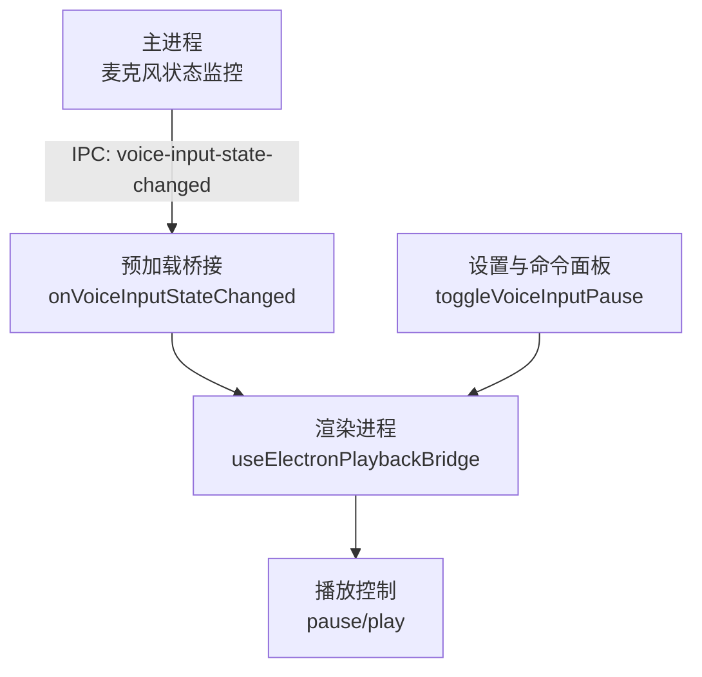
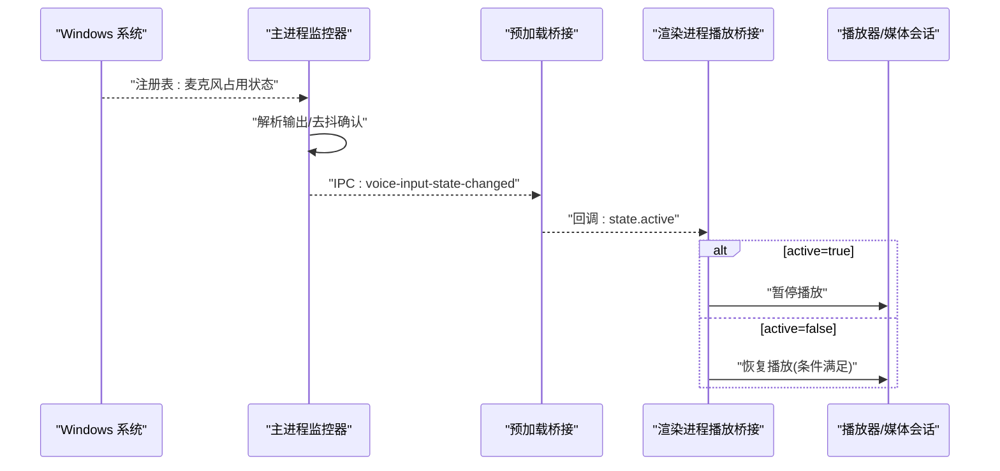
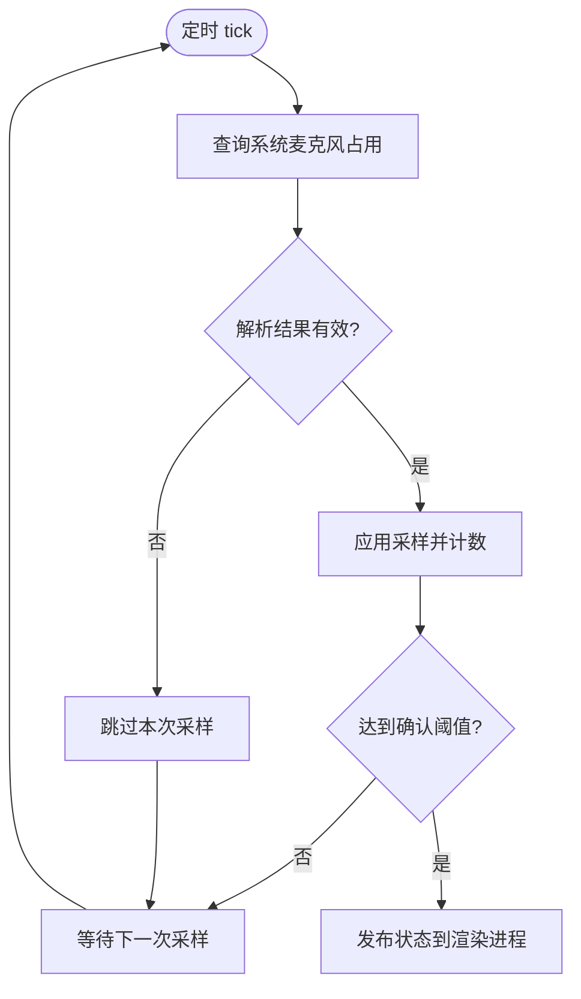
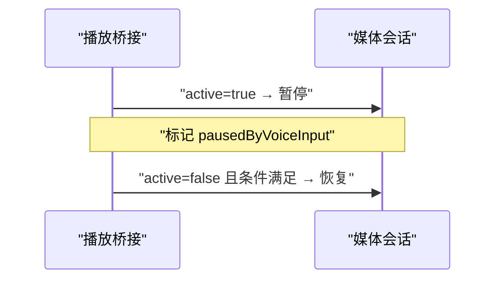
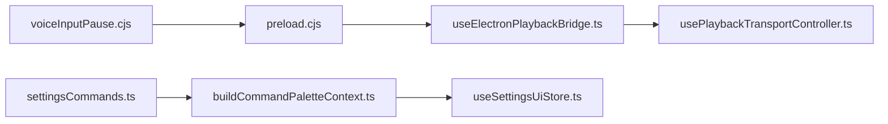

# 语音输入暂停

<cite>
**本文引用的文件**
- [electron/voiceInputPause.cjs](file://electron/voiceInputPause.cjs)
- [electron/preload.cjs](file://electron/preload.cjs)
- [src/hooks/useElectronPlaybackBridge.ts](file://src/hooks/useElectronPlaybackBridge.ts)
- [src/hooks/usePlaybackTransportController.ts](file://src/hooks/usePlaybackTransportController.ts)
- [src/components/app/buildCommandPaletteContext.ts](file://src/components/app/buildCommandPaletteContext.ts)
- [src/components/command-palette/commands/settingsCommands.ts](file://src/components/command-palette/commands/settingsCommands.ts)
- [src/stores/useSettingsUiStore.ts](file://src/stores/useSettingsUiStore.ts)
- [src/i18n/locales/zh-CN.ts](file://src/i18n/locales/zh-CN.ts)
</cite>

## 目录
1. [简介](#简介)
2. [项目结构](#项目结构)
3. [核心组件](#核心组件)
4. [架构总览](#架构总览)
5. [详细组件分析](#详细组件分析)
6. [依赖关系分析](#依赖关系分析)
7. [性能与稳定性](#性能与稳定性)
8. [故障排查指南](#故障排查指南)
9. [结论](#结论)
10. [附录：配置项与自定义规则](#附录：配置项与自定义规则)

## 简介
本技术文档聚焦 Folia Player 的“语音输入暂停”功能，系统性解析其在 Windows 桌面端的实现原理与交互流程。该功能通过主进程轮询系统麦克风占用状态，检测系统语音输入（如 Win+H 语音键入、IME 语音转文字）或其他应用正在使用麦克风时，自动暂停播放；当语音输入结束，再自动恢复播放。前端在 Electron 渲染进程中监听状态变更，结合播放控制桥接逻辑完成暂停与恢复，并通过命令面板提供开关入口与多语言提示。

## 项目结构
围绕该功能的代码主要分布在以下位置：
- 主进程监控模块：负责读取系统注册表并判断麦克风是否被其他进程占用，周期性采样并去抖后向渲染进程广播状态。
- 预加载桥接层：将主进程的 IPC 事件暴露给渲染进程。
- 渲染进程播放桥接：监听状态变化，调用媒体会话或底层播放器进行暂停/恢复。
- 设置与命令面板：提供用户可切换的开关，并在不同平台下控制可用性。
- 本地化文案：为开关与说明提供中文等语言文本。

**图表来源**
- [electron/voiceInputPause.cjs:107-189](file://electron/voiceInputPause.cjs#L107-L189)
- [electron/preload.cjs:178-183](file://electron/preload.cjs#L178-L183)
- [src/hooks/useElectronPlaybackBridge.ts:438-469](file://src/hooks/useElectronPlaybackBridge.ts#L438-L469)
- [src/components/command-palette/commands/settingsCommands.ts:168-180](file://src/components/command-palette/commands/settingsCommands.ts#L168-L180)

**章节来源**
- [electron/voiceInputPause.cjs:1-219](file://electron/voiceInputPause.cjs#L1-L219)
- [electron/preload.cjs:170-320](file://electron/preload.cjs#L170-L320)
- [src/hooks/useElectronPlaybackBridge.ts:424-488](file://src/hooks/useElectronPlaybackBridge.ts#L424-L488)
- [src/components/command-palette/commands/settingsCommands.ts:168-192](file://src/components/command-palette/commands/settingsCommands.ts#L168-L192)

## 核心组件
- 主进程麦克风状态监控器：周期性查询系统注册表中的麦克风授权存储，解析输出以判断是否有非自身进程正在捕获音频；对状态翻转采用连续采样确认机制，避免误触发。
- 预加载桥接：封装 IPC 事件订阅，暴露 onVoiceInputStateChanged 给渲染进程。
- 渲染进程播放桥接：监听状态变化，若当前处于播放中则暂停；当语音输入结束时，若之前是由该功能触发的暂停且当前仍为暂停态，则自动恢复播放。
- 设置与命令面板：提供“语音输入时暂停”的开关，限制在 Windows 平台可用，并通过上下文注入到命令面板。
- 本地化：提供中文标题与描述，便于用户理解功能范围与行为。

**章节来源**
- [electron/voiceInputPause.cjs:107-213](file://electron/voiceInputPause.cjs#L107-L213)
- [electron/preload.cjs:178-183](file://electron/preload.cjs#L178-L183)
- [src/hooks/useElectronPlaybackBridge.ts:438-469](file://src/hooks/useElectronPlaybackBridge.ts#L438-L469)
- [src/components/command-palette/commands/settingsCommands.ts:168-180](file://src/components/command-palette/commands/settingsCommands.ts#L168-L180)
- [src/i18n/locales/zh-CN.ts:1286-1287](file://src/i18n/locales/zh-CN.ts#L1286-L1287)

## 架构总览
整体数据流从主进程的系统级探测开始，经 IPC 传递至渲染进程，再由播放桥接驱动播放器暂停/恢复。设置开关影响主进程监控器的启用与轮询策略。

**图表来源**
- [electron/voiceInputPause.cjs:86-102](file://electron/voiceInputPause.cjs#L86-L102)
- [electron/voiceInputPause.cjs:120-152](file://electron/voiceInputPause.cjs#L120-L152)
- [electron/preload.cjs:178-183](file://electron/preload.cjs#L178-L183)
- [src/hooks/useElectronPlaybackBridge.ts:446-469](file://src/hooks/useElectronPlaybackBridge.ts#L446-L469)

## 详细组件分析

### 主进程麦克风状态监控器
- 系统探测：通过执行系统命令查询麦克风授权存储路径下的子项，解析“开始时间/停止时间”字段，判断是否存在非自身进程正在捕获音频。
- 去抖与确认：启动与停止分别需要连续多次采样一致才认为状态翻转，避免设备探测或短暂触碰导致的抖动。
- 轮询与生命周期：根据是否支持与是否启用决定是否启动定时器；支持立即释放渲染端状态，防止中途关闭功能时的残留。
- 状态发布：向渲染进程发送包含 active、enabled、supported 的状态对象。

**图表来源**
- [electron/voiceInputPause.cjs:154-163](file://electron/voiceInputPause.cjs#L154-L163)
- [electron/voiceInputPause.cjs:131-152](file://electron/voiceInputPause.cjs#L131-L152)
- [electron/voiceInputPause.cjs:165-189](file://electron/voiceInputPause.cjs#L165-L189)

**章节来源**
- [electron/voiceInputPause.cjs:8-11](file://electron/voiceInputPause.cjs#L8-L11)
- [electron/voiceInputPause.cjs:22-84](file://electron/voiceInputPause.cjs#L22-L84)
- [electron/voiceInputPause.cjs:107-213](file://electron/voiceInputPause.cjs#L107-L213)

### 预加载桥接与 IPC 通道
- 暴露 onVoiceInputStateChanged：订阅主进程事件，转发回调给渲染进程。
- 暴露 getVoiceInputPauseStatus：用于获取当前监控器状态快照。

**章节来源**
- [electron/preload.cjs:178-183](file://electron/preload.cjs#L178-L183)

### 渲染进程播放桥接
- 监听语音输入状态变化：
  - 当 active=true 且当前处于播放中，记录“由语音输入导致暂停”，并调用媒体会话暂停。
  - 当 active=false 且之前由该功能暂停且当前仍为暂停态，调用媒体会话恢复播放。
- 保护用户手动暂停：仅在“由该功能触发暂停”的前提下才自动恢复，避免覆盖用户手动操作。

**图表来源**
- [src/hooks/useElectronPlaybackBridge.ts:438-469](file://src/hooks/useElectronPlaybackBridge.ts#L438-L469)

**章节来源**
- [src/hooks/useElectronPlaybackBridge.ts:438-469](file://src/hooks/useElectronPlaybackBridge.ts#L438-L469)

### 设置与命令面板
- 命令面板提供“语音输入时暂停”的开关，限定在 Windows 平台可用。
- 通过上下文注入 voiceInputPauseSupported 与 toggleVoiceInputPause，调用设置存储更新。

**章节来源**
- [src/components/command-palette/commands/settingsCommands.ts:168-180](file://src/components/command-palette/commands/settingsCommands.ts#L168-L180)
- [src/components/app/buildCommandPaletteContext.ts:89-93](file://src/components/app/buildCommandPaletteContext.ts#L89-L93)
- [src/components/app/buildCommandPaletteContext.ts:206-208](file://src/components/app/buildCommandPaletteContext.ts#L206-L208)

### 本地化与用户可见文案
- 中文文案提供功能名称与描述，明确仅 Windows 桌面端生效，涵盖系统语音输入与其他应用占用麦克风的场景。

**章节来源**
- [src/i18n/locales/zh-CN.ts:1286-1287](file://src/i18n/locales/zh-CN.ts#L1286-L1287)

## 依赖关系分析
- 主进程监控器依赖操作系统能力（Windows 注册表），通过 child_process 执行系统命令。
- 预加载桥接依赖 Electron IPC 机制。
- 渲染进程桥接依赖媒体会话 API 与播放器控制接口。
- 设置与命令面板依赖全局设置存储与上下文注入。

**图表来源**
- [electron/voiceInputPause.cjs:107-213](file://electron/voiceInputPause.cjs#L107-L213)
- [electron/preload.cjs:178-183](file://electron/preload.cjs#L178-L183)
- [src/hooks/useElectronPlaybackBridge.ts:438-469](file://src/hooks/useElectronPlaybackBridge.ts#L438-L469)
- [src/hooks/usePlaybackTransportController.ts:137-166](file://src/hooks/usePlaybackTransportController.ts#L137-L166)
- [src/components/command-palette/commands/settingsCommands.ts:168-180](file://src/components/command-palette/commands/settingsCommands.ts#L168-L180)
- [src/components/app/buildCommandPaletteContext.ts:206-208](file://src/components/app/buildCommandPaletteContext.ts#L206-L208)
- [src/stores/useSettingsUiStore.ts:1875-2268](file://src/stores/useSettingsUiStore.ts#L1875-L2268)

**章节来源**
- [electron/voiceInputPause.cjs:107-213](file://electron/voiceInputPause.cjs#L107-L213)
- [electron/preload.cjs:178-183](file://electron/preload.cjs#L178-L183)
- [src/hooks/useElectronPlaybackBridge.ts:438-469](file://src/hooks/useElectronPlaybackBridge.ts#L438-L469)
- [src/hooks/usePlaybackTransportController.ts:137-166](file://src/hooks/usePlaybackTransportController.ts#L137-L166)
- [src/components/command-palette/commands/settingsCommands.ts:168-180](file://src/components/command-palette/commands/settingsCommands.ts#L168-L180)
- [src/components/app/buildCommandPaletteContext.ts:206-208](file://src/components/app/buildCommandPaletteContext.ts#L206-L208)
- [src/stores/useSettingsUiStore.ts:1875-2268](file://src/stores/useSettingsUiStore.ts#L1875-L2268)

## 性能与稳定性
- 轮询间隔与超时：默认每秒一次查询，注册表查询具备超时保护，避免阻塞主线程。
- 去抖策略：启动需连续两次一致，停止需三次一致，降低误判概率。
- 资源释放：功能关闭时立即清理定时器并重置状态，避免内存泄漏与状态不一致。
- 渲染端节流：仅在“由该功能触发暂停”的情况下才自动恢复，减少不必要的播放控制调用。

[本节为通用指导，不直接分析具体文件]

## 故障排查指南
- 现象：语音输入期间未暂停
  - 检查是否在 Windows 平台且已启用“语音输入时暂停”。
  - 查看主进程日志中是否有“麦克风探测失败”警告。
  - 确认系统麦克风权限与输入法/语音键入是否确实占用了麦克风。
- 现象：语音输入结束后未恢复
  - 确认是否由该功能触发了暂停（否则不会自动恢复）。
  - 检查媒体会话或播放器当前状态是否为暂停。
- 现象：频繁误暂停/误恢复
  - 调整轮询间隔或确认阈值（如需扩展配置）。
  - 观察系统其他应用是否频繁探测麦克风导致状态抖动。

**章节来源**
- [electron/voiceInputPause.cjs:154-163](file://electron/voiceInputPause.cjs#L154-L163)
- [src/hooks/useElectronPlaybackBridge.ts:446-469](file://src/hooks/useElectronPlaybackBridge.ts#L446-L469)

## 结论
Folia Player 的“语音输入暂停”功能在主进程通过系统级探测与去抖策略稳定识别麦克风占用，在渲染进程通过播放桥接精准控制暂停与恢复，配合命令面板与本地化文案提供直观的用户体验。该方案在 Windows 桌面端实现了低侵入、高可靠的自动暂停体验，同时避免了误触发与用户手动操作的冲突。

[本节为总结性内容，不直接分析具体文件]

## 附录：配置项与自定义规则
- 开关入口：命令面板中的“语音输入时暂停”，仅 Windows 平台可用。
- 行为约束：
  - 自动恢复仅在“由该功能触发暂停”的前提下进行，尊重用户手动暂停。
  - 功能关闭时立即释放渲染端状态，避免残留。
- 可扩展点（概念性建议）：
  - 轮询间隔：可根据设备性能与需求调整，平衡实时性与开销。
  - 确认阈值：可按场景调高/降低，提升灵敏度或稳定性。
  - 平台适配：当前实现基于 Windows 注册表；跨平台可通过抽象 queryInUse 与 isSupported 扩展到其他系统。

**章节来源**
- [src/components/command-palette/commands/settingsCommands.ts:168-180](file://src/components/command-palette/commands/settingsCommands.ts#L168-L180)
- [src/hooks/useElectronPlaybackBridge.ts:446-469](file://src/hooks/useElectronPlaybackBridge.ts#L446-L469)
- [electron/voiceInputPause.cjs:107-189](file://electron/voiceInputPause.cjs#L107-L189)