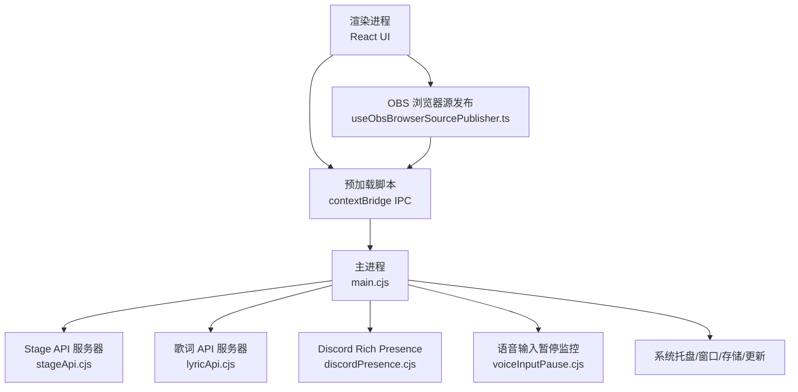
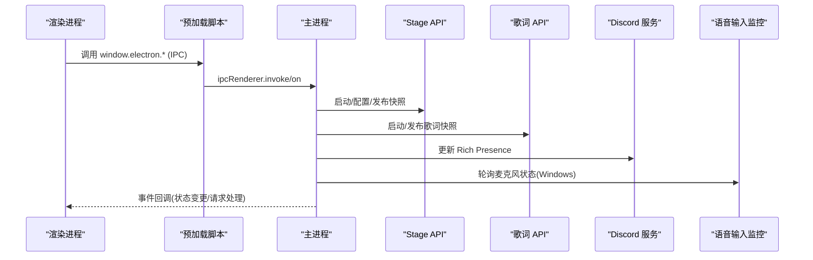
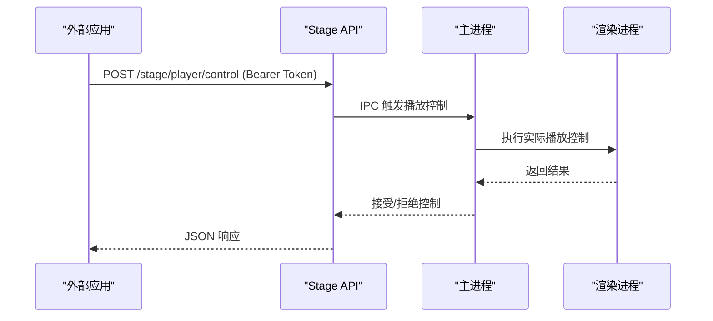
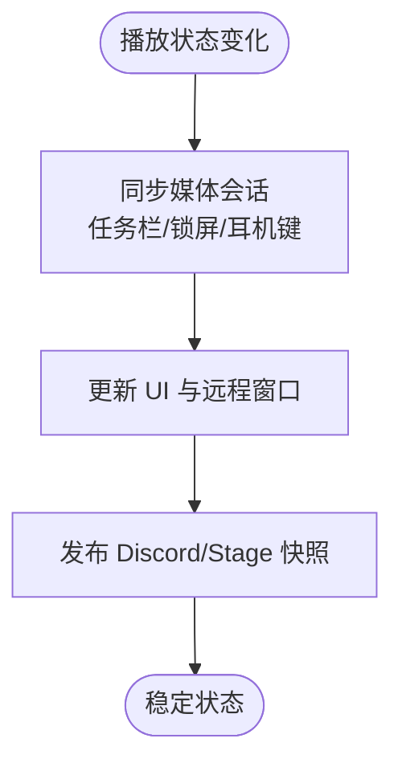
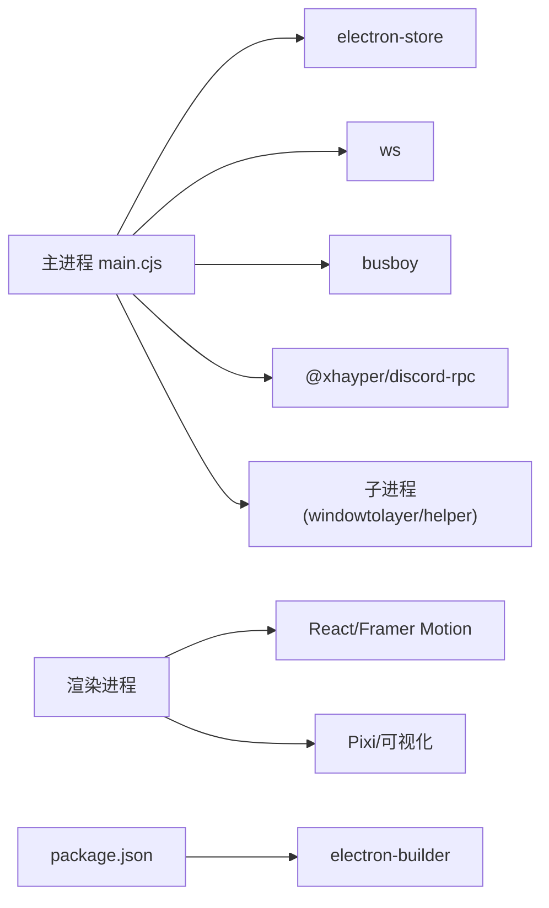

# 桌面系统集成

<cite>
**本文引用的文件**
- [electron/main.cjs](file://electron/main.cjs)
- [electron/preload.cjs](file://electron/preload.cjs)
- [electron/stageApi.cjs](file://electron/stageApi.cjs)
- [electron/discordPresence.cjs](file://electron/discordPresence.cjs)
- [electron/voiceInputPause.cjs](file://electron/voiceInputPause.cjs)
- [electron/lyricApi.cjs](file://electron/lyricApi.cjs)
- [src/hooks/useElectronPlaybackBridge.ts](file://src/hooks/useElectronPlaybackBridge.ts)
- [src/components/obs/ObsWebSourceApp.tsx](file://src/components/obs/ObsWebSourceApp.tsx)
- [src/hooks/useObsBrowserSourcePublisher.ts](file://src/hooks/useObsBrowserSourcePublisher.ts)
- [package.json](file://package.json)
</cite>

## 目录
1. [简介](#简介)
2. [项目结构](#项目结构)
3. [核心组件](#核心组件)
4. [架构总览](#架构总览)
5. [详细组件分析](#详细组件分析)
6. [依赖关系分析](#依赖关系分析)
7. [性能与优化](#性能与优化)
8. [故障排查指南](#故障排查指南)
9. [结论](#结论)

## 简介
本技术文档聚焦 Folia Player 的桌面系统集成，围绕 Electron 主进程架构展开，涵盖窗口管理、系统托盘、文件系统访问、原生模块集成、Stage API（OBS Browser Source 集成、直播推流、外部应用控制）、跨平台兼容性（Windows/macOS/Linux）、媒体会话集成（系统级媒体控制、锁屏信息、耳机按键响应）以及安全策略与调试优化工具。目标是帮助开发者快速理解并扩展桌面端能力。

## 项目结构
Folia 的桌面端由 Electron 主进程、渲染进程与预加载脚本组成：
- 主进程负责应用生命周期、窗口与托盘、本地服务（Stage/Lyric API）、平台特性（壁纸模式、语音输入暂停、Discord Rich Presence）、更新与存储等。
- 预加载脚本通过 contextBridge 暴露最小化 IPC 接口给渲染进程，屏蔽底层细节。
- 渲染进程通过 hooks 与服务层桥接桌面能力，如 OBS 浏览器源数据发布、Stage 播放快照、媒体会话同步等。

图表来源
- [electron/main.cjs:1-120](file://electron/main.cjs#L1-L120)
- [electron/stageApi.cjs:1-120](file://electron/stageApi.cjs#L1-L120)
- [electron/lyricApi.cjs:1-120](file://electron/lyricApi.cjs#L1-L120)
- [electron/discordPresence.cjs:1-120](file://electron/discordPresence.cjs#L1-L120)
- [electron/voiceInputPause.cjs:1-120](file://electron/voiceInputPause.cjs#L1-L120)
- [src/hooks/useObsBrowserSourcePublisher.ts:320-393](file://src/hooks/useObsBrowserSourcePublisher.ts#L320-L393)

章节来源
- [electron/main.cjs:1-120](file://electron/main.cjs#L1-L120)
- [electron/preload.cjs:1-120](file://electron/preload.cjs#L1-L120)
- [package.json:69-131](file://package.json#L69-L131)

## 核心组件
- 主进程入口与初始化：注册协议、平台开关、单实例锁、壁纸模式、托盘菜单、窗口创建与状态持久化、更新检查、本地服务启动。
- Stage API：提供 HTTP + WebSocket 的本地集成接口，支持歌词推送、媒体会话、播放控制与队列操作、令牌鉴权与限流。
- 歌词 API：仅对本地信任客户端暴露当前歌词快照，严格清洗字段，避免注入风险。
- Discord Rich Presence：基于主进程播放快照，周期性更新 Discord 活动状态。
- 语音输入暂停监控（Windows）：轮询系统麦克风使用状态，自动暂停/恢复播放。
- 预加载桥接：将桌面能力以最小权限暴露给渲染进程，包括窗口控制、缓存、更新、OBS 发布、Stage 控制等。

章节来源
- [electron/main.cjs:120-800](file://electron/main.cjs#L120-L800)
- [electron/stageApi.cjs:169-800](file://electron/stageApi.cjs#L169-L800)
- [electron/lyricApi.cjs:83-202](file://electron/lyricApi.cjs#L83-L202)
- [electron/discordPresence.cjs:103-285](file://electron/discordPresence.cjs#L103-L285)
- [electron/voiceInputPause.cjs:107-219](file://electron/voiceInputPause.cjs#L107-L219)
- [electron/preload.cjs:1-320](file://electron/preload.cjs#L1-L320)

## 架构总览
下图展示主进程与各子系统交互关系，以及渲染进程如何通过预加载桥接调用桌面能力。

图表来源
- [electron/preload.cjs:120-320](file://electron/preload.cjs#L120-L320)
- [electron/stageApi.cjs:648-676](file://electron/stageApi.cjs#L648-L676)
- [electron/lyricApi.cjs:141-163](file://electron/lyricApi.cjs#L141-L163)
- [electron/discordPresence.cjs:228-264](file://electron/discordPresence.cjs#L228-L264)
- [electron/voiceInputPause.cjs:154-189](file://electron/voiceInputPause.cjs#L154-L189)

## 详细组件分析

### 主进程：窗口管理、系统托盘、文件系统与安全策略
- 窗口管理：创建主窗口、远程窗口、视频导出窗口；支持置顶、任务栏隐藏、点击穿透、透明背景、全屏切换、最大化/最小化、窗口状态持久化与恢复。
- 系统托盘：多语言菜单项（显示/隐藏主窗口、打开遥控窗口、点击穿透、壁纸模式、重置窗口、退出），支持任务栏缩略图按钮。
- 文件系统访问：通过 electron-store 持久化设置；自定义协议（folia-cover、mod 协议）用于资源访问；缓存目录可配置；本地封面资产存储。
- 安全策略：
  - 仅注册必要特权协议，限制 fetch/secure/cors/stream。
  - 证书错误白名单仅放行特定 CDN 主机名与错误类型。
  - Stage API 与歌词 API 均绑定 127.0.0.1，且 Stage 使用 Bearer Token 鉴权。
  - 歌词 API 输出严格清洗，防止注入。
  - 预加载仅暴露最小 IPC 方法，遵循最小权限原则。

章节来源
- [electron/main.cjs:1-120](file://electron/main.cjs#L1-L120)
- [electron/main.cjs:607-800](file://electron/main.cjs#L607-L800)
- [electron/preload.cjs:120-320](file://electron/preload.cjs#L120-L320)

### Stage API：设计、OBS 集成与外部应用控制
- 设计要点：
  - HTTP 接口：状态查询、令牌生成、歌词/媒体会话上传、播放控制、队列操作。
  - WebSocket：实时推送播放状态、曲目变更、队列更新。
  - 令牌鉴权：随机生成并持久化，所有受保护接口需携带 Authorization: Bearer。
  - 限流与校验：JSON body 大小限制、multipart 字段/文件数量限制、时间戳与位置范围校验。
  - 会话管理：工作目录隔离、最近会话保留、资源清理。
- OBS 集成：
  - 渲染进程通过 useObsBrowserSourcePublisher 定时发布时钟与音频数据至主进程，再由主进程转发给 OBS 浏览器源。
  - ObsWebSourceApp 作为纯浏览器 OBS 覆盖壳，复用可视化渲染管线，支持 AI 主题与透明背景。
- 外部应用控制：
  - 外部工具可通过 HTTP 发送播放控制（上一首/下一首/暂停/继续/跳转）与队列操作（追加/插入/移除/移动/选择/清空）。
  - 主进程将请求转为内部播放控制，并通过 IPC 完成结果回传。

图表来源
- [electron/stageApi.cjs:169-800](file://electron/stageApi.cjs#L169-L800)
- [src/hooks/useObsBrowserSourcePublisher.ts:320-393](file://src/hooks/useObsBrowserSourcePublisher.ts#L320-L393)
- [src/components/obs/ObsWebSourceApp.tsx:1-265](file://src/components/obs/ObsWebSourceApp.tsx#L1-L265)

章节来源
- [electron/stageApi.cjs:169-800](file://electron/stageApi.cjs#L169-L800)
- [src/hooks/useObsBrowserSourcePublisher.ts:320-393](file://src/hooks/useObsBrowserSourcePublisher.ts#L320-L393)
- [src/components/obs/ObsWebSourceApp.tsx:1-265](file://src/components/obs/ObsWebSourceApp.tsx#L1-L265)

### 跨平台兼容性：Windows、macOS、Linux
- Windows：
  - 壁纸模式：通过 WorkerW 父子窗口重定向，支持点击穿透与鼠标事件注入；运行时重建窗口以保持边框一致。
  - 语音输入暂停：轮询注册表麦克风使用状态，自动暂停/恢复播放。
  - GPU 加速：忽略 GPU 黑名单、启用 GL 后端与光栅化。
- macOS：
  - GPU 加速：针对 Intel Mac + AMD 独显在 Retina 屏幕下的渲染卡顿进行优化。
  - 无壁纸模式实现，相关功能在设置中屏蔽。
- Linux：
  - 图形后端：支持 system/swiftshader/software 三种模式；AppImage 下优先 swiftshader 以避免崩溃。
  - Wayland/X11：Wayland 下通过 windowtolayer 子进程包装进入桌面层；X11 下直接设置窗口类型为 desktop。
  - 密码存储：根据桌面环境选择合适后端，避免明文降级。

章节来源
- [electron/main.cjs:78-137](file://electron/main.cjs#L78-L137)
- [electron/main.cjs:145-558](file://electron/main.cjs#L145-L558)
- [electron/voiceInputPause.cjs:107-219](file://electron/voiceInputPause.cjs#L107-L219)

### 媒体会话集成：系统级媒体控制、锁屏信息、耳机按键
- 渲染进程维护媒体会话桥接，统一处理播放/暂停/上一首/下一首/跳转，并与任务栏控件、Discord 状态、Stage 快照同步。
- 预加载暴露媒体会话相关 IPC，主进程监听系统事件并通知渲染进程。
- 耳机按键与系统媒体键通过操作系统媒体会话机制生效，无需额外适配。

图表来源
- [src/hooks/useElectronPlaybackBridge.ts:484-690](file://src/hooks/useElectronPlaybackBridge.ts#L484-L690)
- [electron/preload.cjs:120-220](file://electron/preload.cjs#L120-L220)

章节来源
- [src/hooks/useElectronPlaybackBridge.ts:484-690](file://src/hooks/useElectronPlaybackBridge.ts#L484-L690)
- [electron/preload.cjs:120-220](file://electron/preload.cjs#L120-L220)

### 安全策略：沙箱机制、权限管理、网络安全
- 最小权限 IPC：预加载仅暴露必要方法，避免直接访问 Node/Electron 对象。
- 本地服务绑定：Stage 与歌词 API 仅监听 127.0.0.1，防止外部网络访问。
- 令牌鉴权：Stage API 使用随机 Bearer Token，未授权请求被拒绝。
- 输入清洗：歌词 API 输出严格清洗，过滤非法字段与长度。
- 证书白名单：仅放行特定 CDN 主机名与错误类型，其他证书错误一律拒绝。
- 协议限制：自定义协议仅启用标准、安全、fetch、CORS、流式传输，避免滥用。

章节来源
- [electron/stageApi.cjs:227-241](file://electron/stageApi.cjs#L227-L241)
- [electron/lyricApi.cjs:141-163](file://electron/lyricApi.cjs#L141-L163)
- [electron/main.cjs:42-76](file://electron/main.cjs#L42-L76)
- [electron/preload.cjs:120-320](file://electron/preload.cjs#L120-L320)

### 调试与优化工具
- 调试接口：预加载暴露 debugGetState/debugSetState/debugOpenLogs/debugRendererMemory 等方法，便于定位内存与运行态问题。
- 模型与资源：提供模型下载、安装、扫描、移除等 IPC，支持多平台差异与可用性检测。
- 性能优化：
  - 音频/封面缓存：提供缓存查询、保存、统计与清理接口，降低重复 IO。
  - 设备像素比上报：渲染进程定期上报 DPR，避免不必要的 IPC 往返。
  - 间隔发布：OBS 时钟与音频数据按固定间隔发布，减少 IPC 压力。
  - 平台图形后端：Linux 下可选 swiftshader/software，避免 GPU 崩溃；macOS 下启用 GL 光栅化提升渲染性能。

章节来源
- [electron/preload.cjs:1-120](file://electron/preload.cjs#L1-L120)
- [src/hooks/useObsBrowserSourcePublisher.ts:320-393](file://src/hooks/useObsBrowserSourcePublisher.ts#L320-L393)
- [electron/main.cjs:78-137](file://electron/main.cjs#L78-L137)

## 依赖关系分析
- 主进程依赖：
  - electron-store：设置持久化。
  - ws：WebSocket 服务（Stage 播放器事件）。
  - busboy：multipart 表单解析（Stage 媒体上传）。
  - @xhayper/discord-rpc：Discord Rich Presence。
  - 子进程：windowtolayer/folia-wallpaper-helper（壁纸模式）。
- 渲染进程依赖：
  - React/Framer Motion：UI 与动画。
  - Pixi/可视化管线：OBS 覆盖与主窗口可视化。
- 构建与打包：
  - electron-builder：图标、托盘模板、Linux 桌面文件、windowtolayer 二进制等资源打包。

图表来源
- [electron/main.cjs:1-28](file://electron/main.cjs#L1-L28)
- [electron/stageApi.cjs:1-25](file://electron/stageApi.cjs#L1-L25)
- [electron/discordPresence.cjs:195-211](file://electron/discordPresence.cjs#L195-L211)
- [package.json:69-131](file://package.json#L69-L131)

章节来源
- [electron/main.cjs:1-28](file://electron/main.cjs#L1-L28)
- [electron/stageApi.cjs:1-25](file://electron/stageApi.cjs#L1-L25)
- [electron/discordPresence.cjs:195-211](file://electron/discordPresence.cjs#L195-L211)
- [package.json:69-131](file://package.json#L69-L131)

## 性能与优化
- IPC 节流：OBS 时钟与音频数据按固定间隔发布，避免每帧 IPC。
- 缓存策略：音频与封面缓存提供统计与清理，减少磁盘 IO。
- 平台优化：
  - Linux：swiftshader 避免 GPU 崩溃；软件渲染保证稳定性。
  - macOS：GL 光栅化提升 Retina 渲染性能。
  - Windows：忽略 GPU 黑名单，启用硬件加速。
- 资源管理：Stage 会话目录定期清理，保留最近 N 个会话，避免磁盘膨胀。

[本节为通用指导，不直接分析具体文件]

## 故障排查指南
- 壁纸模式不可用：
  - 检查 windowtolayer/folia-wallpaper-helper 是否存在与可执行权限。
  - 查看日志中的“missing”或“error”提示，确认环境变量与路径。
- 歌词 API 无法访问：
  - 确认端口未被占用，服务是否启动成功。
  - 检查 CORS 与允许的方法（GET/OPTIONS）。
- Stage API 鉴权失败：
  - 确认 Bearer Token 正确且已生成。
  - 检查请求头与 URL 路径。
- 语音输入暂停无效（Windows）：
  - 确认已启用功能且系统麦克风权限正常。
  - 查看轮询结果与状态变更事件。
- Discord 状态不更新：
  - 检查 Application ID 是否有效，客户端是否连接成功。
  - 查看状态变更回调与错误信息。

章节来源
- [electron/main.cjs:183-311](file://electron/main.cjs#L183-L311)
- [electron/lyricApi.cjs:141-163](file://electron/lyricApi.cjs#L141-L163)
- [electron/stageApi.cjs:227-241](file://electron/stageApi.cjs#L227-L241)
- [electron/voiceInputPause.cjs:154-189](file://electron/voiceInputPause.cjs#L154-L189)
- [electron/discordPresence.cjs:228-264](file://electron/discordPresence.cjs#L228-L264)

## 结论
Folia Player 的桌面系统集成以 Electron 主进程为核心，通过预加载桥接最小权限 IPC，结合 Stage API、歌词 API、Discord Rich Presence 与平台特性（壁纸模式、语音输入暂停、图形后端优化），实现了强大的桌面端能力。其安全策略严谨、跨平台兼容性好、调试与优化工具完善，适合进一步扩展直播推流、外部应用控制与媒体会话集成等场景。